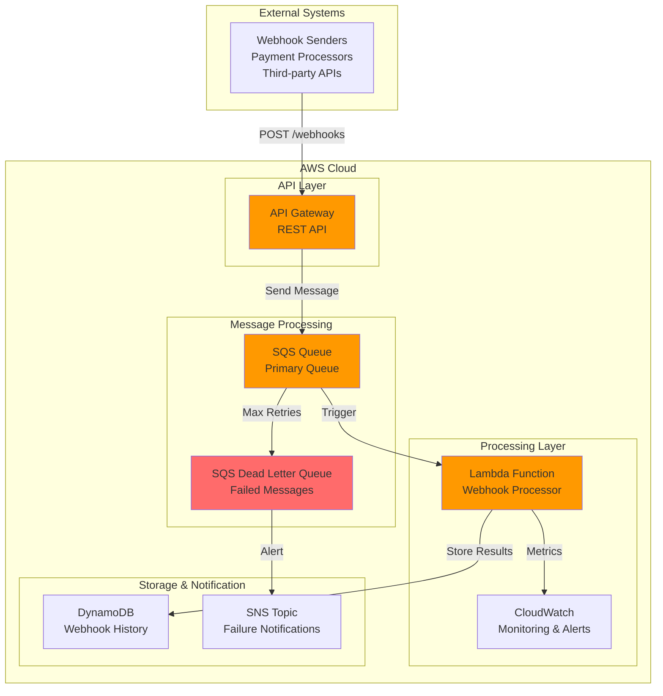

# Scalable Webhook Processing with SQS


## Problem

E-commerce companies and SaaS providers receive thousands of webhook notifications daily from payment processors, third-party services, and partner integrations. These webhooks often arrive in bursts during peak traffic periods, overwhelming traditional synchronous processing systems and causing dropped events, timeouts, and lost business-critical data. Without proper buffering and retry mechanisms, companies lose revenue from failed payment notifications, miss security alerts, and experience poor customer experiences due to integration failures.

## Solution

Build a robust webhook processing system using Amazon API Gateway as the entry point, Amazon SQS for reliable message queuing, and AWS Lambda for asynchronous processing. This architecture decouples webhook ingestion from processing, provides automatic retries through dead letter queues, and scales automatically to handle traffic spikes while maintaining delivery guarantees for critical business events.

## Architecture Diagram



## Prerequisites

1. AWS account with appropriate permissions for API Gateway, SQS, Lambda, IAM, DynamoDB, and CloudWatch
2. AWS CLI v2 installed and configured (or AWS CloudShell)
3. Basic understanding of webhook concepts and HTTP POST requests
4. Knowledge of REST API design and JSON message formats
5. Estimated cost: $5-15/month for development and testing (scales with message volume)

> **Note**: This solution processes webhooks asynchronously, which means immediate responses don't reflect processing results. Consider this for use cases requiring synchronous validation.

## Preparation

```bash
# Set environment variables
export AWS_REGION=$(aws configure get region)
export AWS_ACCOUNT_ID=$(aws sts get-caller-identity \
    --query Account --output text)

# Generate unique identifiers for resources
RANDOM_SUFFIX=$(aws secretsmanager get-random-password \
    --exclude-punctuation --exclude-uppercase \
    --password-length 6 --require-each-included-type \
    --output text --query RandomPassword)

export WEBHOOK_QUEUE_NAME="webhook-processing-queue-${RANDOM_SUFFIX}"
export WEBHOOK_DLQ_NAME="webhook-dlq-${RANDOM_SUFFIX}"
export WEBHOOK_FUNCTION_NAME="webhook-processor-${RANDOM_SUFFIX}"
export WEBHOOK_API_NAME="webhook-api-${RANDOM_SUFFIX}"
export WEBHOOK_TABLE_NAME="webhook-history-${RANDOM_SUFFIX}"

echo "✅ Environment variables configured"
echo "Queue Name: ${WEBHOOK_QUEUE_NAME}"
echo "Function Name: ${WEBHOOK_FUNCTION_NAME}"
echo "API Name: ${WEBHOOK_API_NAME}"
```

## Steps

1. **Create SQS Dead Letter Queue for Failed Messages**:

   Amazon SQS dead letter queues provide a critical safety net for webhook processing systems by capturing messages that fail processing after multiple attempts. This ensures no webhook notifications are permanently lost due to temporary processing issues, application bugs, or malformed payloads. Dead letter queues enable manual inspection, debugging, and reprocessing of failed messages, which is essential for maintaining data integrity in business-critical webhook scenarios like payment notifications or security alerts.

   ```bash
   # Create dead letter queue first
   aws sqs create-queue \
       --queue-name ${WEBHOOK_DLQ_NAME} \
       --attributes '{
           "MessageRetentionPeriod": "1209600",
           "VisibilityTimeout": "60"
       }'
   
   # Store DLQ URL and ARN
   export DLQ_URL=$(aws sqs get-queue-url \
       --queue-name ${WEBHOOK_DLQ_NAME} \
       --query QueueUrl --output text)
   
   export DLQ_ARN=$(aws sqs get-queue-attributes \
       --queue-url ${DLQ_URL} \
       --attribute-names QueueArn \
       --query 'Attributes.QueueArn' --output text)
   
   echo "✅ Dead letter queue created: ${DLQ_ARN}"
   ```

   The dead letter queue is now configured with a 14-day message retention period, providing ample time for investigation and reprocessing of failed webhooks. This foundation enables the fault-tolerant architecture that prevents webhook data loss and maintains system reliability.

2. **Create Primary SQS Queue with Dead Letter Queue Configuration**:

   The primary SQS queue serves as the message buffer between API Gateway webhook ingestion and Lambda processing, enabling the system to handle traffic spikes gracefully. SQS provides built-in durability (messages are replicated across multiple servers), automatic scaling, and configurable retry mechanisms. The redrive policy automatically moves messages to the dead letter queue after 3 failed processing attempts, balancing between retry resilience and preventing infinite processing loops that could consume resources unnecessarily.

   ```bash
   # Create primary queue with DLQ redrive policy
   aws sqs create-queue \
       --queue-name ${WEBHOOK_QUEUE_NAME} \
       --attributes '{
           "MessageRetentionPeriod": "1209600",
           "VisibilityTimeout": "300",
           "RedrivePolicy": "{\"deadLetterTargetArn\":\"'${DLQ_ARN}'\",\"maxReceiveCount\":3}"
       }'
   
   # Store primary queue URL and ARN
   export QUEUE_URL=$(aws sqs get-queue-url \
       --queue-name ${WEBHOOK_QUEUE_NAME} \
       --query QueueUrl --output text)
   
   export QUEUE_ARN=$(aws sqs get-queue-attributes \
       --queue-url ${QUEUE_URL} \
       --attribute-names QueueArn \
       --query 'Attributes.QueueArn' --output text)
   
   echo "✅ Primary webhook queue created: ${QUEUE_ARN}"
   ```

   The queue is now configured with a 5-minute visibility timeout, allowing sufficient time for Lambda functions to process webhook payloads while preventing message duplication. This establishes the reliable message buffering layer that decouples webhook ingestion from processing, enabling the system to maintain responsiveness even during processing delays or Lambda cold starts.

3. **Create DynamoDB Table for Webhook History**:

   DynamoDB provides the persistent storage layer for webhook audit trails, compliance reporting, and troubleshooting capabilities. The composite primary key design (webhook_id + timestamp) enables efficient queries for both individual webhook tracking and time-based analysis. This storage pattern supports business requirements for payment auditing, security incident investigation, and integration debugging while providing the scalability to handle millions of webhook events with consistent single-digit millisecond response times.

   ```bash
   # Create table for storing webhook processing history
   aws dynamodb create-table \
       --table-name ${WEBHOOK_TABLE_NAME} \
       --attribute-definitions \
           AttributeName=webhook_id,AttributeType=S \
           AttributeName=timestamp,AttributeType=S \
       --key-schema \
           AttributeName=webhook_id,KeyType=HASH \
           AttributeName=timestamp,KeyType=RANGE \
       --provisioned-throughput ReadCapacityUnits=5,WriteCapacityUnits=5 \
       --tags Key=Purpose,Value=WebhookProcessing
   
   # Wait for table to be active
   aws dynamodb wait table-exists \
       --table-name ${WEBHOOK_TABLE_NAME}
   
   echo "✅ DynamoDB table created: ${WEBHOOK_TABLE_NAME}"
   ```

   The table is now provisioned with baseline capacity that can auto-scale based on demand, providing cost-effective storage for webhook history while maintaining the performance needed for real-time queries. This establishes the searchable audit trail that enables compliance reporting and operational troubleshooting.

4. **Create IAM Role for API Gateway SQS Integration**:

   IAM roles enable secure, temporary credential delegation that follows the principle of least privilege, eliminating the need for long-term access keys in your application architecture. This role specifically grants API Gateway the minimum permissions needed to send webhook payloads to SQS, creating a secure bridge between the HTTP endpoint and the message queue. This design pattern prevents credential exposure while enabling service-to-service communication within your AWS environment.

   ```bash
   # Create trust policy for API Gateway
   cat > /tmp/apigw-trust-policy.json << EOF
   {
       "Version": "2012-10-17",
       "Statement": [
           {
               "Effect": "Allow",
               "Principal": {
                   "Service": "apigateway.amazonaws.com"
               },
               "Action": "sts:AssumeRole"
           }
       ]
   }
   EOF
   
   # Create API Gateway role
   aws iam create-role \
       --role-name webhook-apigw-sqs-role-${RANDOM_SUFFIX} \
       --assume-role-policy-document file:///tmp/apigw-trust-policy.json
   
   # Create policy for SQS permissions
   cat > /tmp/apigw-sqs-policy.json << EOF
   {
       "Version": "2012-10-17",
       "Statement": [
           {
               "Effect": "Allow",
               "Action": [
                   "sqs:SendMessage",
                   "sqs:GetQueueAttributes"
               ],
               "Resource": "${QUEUE_ARN}"
           }
       ]
   }
   EOF
   
   # Attach policy to role
   aws iam put-role-policy \
       --role-name webhook-apigw-sqs-role-${RANDOM_SUFFIX} \
       --policy-name SQSAccessPolicy \
       --policy-document file:///tmp/apigw-sqs-policy.json
   
   export APIGW_ROLE_ARN=$(aws iam get-role \
       --role-name webhook-apigw-sqs-role-${RANDOM_SUFFIX} \
       --query Role.Arn --output text)
   
   echo "✅ API Gateway IAM role created: ${APIGW_ROLE_ARN}"
   ```

   The IAM role is now configured with precise permissions that enable API Gateway to queue webhook messages while maintaining security boundaries. This credential management approach eliminates security risks associated with embedded access keys and enables AWS to handle credential rotation automatically.

5. **Create Lambda Function for Webhook Processing**:

   AWS Lambda provides serverless compute that automatically scales to handle webhook processing workloads without requiring server management. Lambda functions are invoked on-demand and only consume resources during execution, making them cost-effective for variable webhook traffic patterns. The function processes SQS messages in batches, enabling high throughput while maintaining individual message processing guarantees through SQS's visibility timeout mechanism.

   ```bash
   # Create Lambda function code
   cat > /tmp/webhook-processor.py << 'EOF'
   import json
   import boto3
   import uuid
   import os
   from datetime import datetime
   import logging
   
   logger = logging.getLogger()
   logger.setLevel(logging.INFO)
   
   dynamodb = boto3.resource('dynamodb')
   table = dynamodb.Table(os.environ['WEBHOOK_TABLE_NAME'])
   
   def lambda_handler(event, context):
       try:
           # Process each SQS record
           for record in event['Records']:
               # Parse the webhook payload
               webhook_body = json.loads(record['body'])
               
               # Generate unique webhook ID
               webhook_id = str(uuid.uuid4())
               timestamp = datetime.utcnow().isoformat()
               
               # Extract webhook metadata
               source_ip = webhook_body.get('source_ip', 'unknown')
               webhook_type = webhook_body.get('type', 'unknown')
               
               # Process the webhook (customize based on your needs)
               processed_data = process_webhook(webhook_body)
               
               # Store in DynamoDB
               table.put_item(
                   Item={
                       'webhook_id': webhook_id,
                       'timestamp': timestamp,
                       'source_ip': source_ip,
                       'webhook_type': webhook_type,
                       'raw_payload': json.dumps(webhook_body),
                       'processed_data': json.dumps(processed_data),
                       'status': 'processed'
                   }
               )
               
               logger.info(f"Processed webhook {webhook_id} of type {webhook_type}")
           
           return {
               'statusCode': 200,
               'body': json.dumps('Webhooks processed successfully')
           }
           
       except Exception as e:
           logger.error(f"Error processing webhook: {str(e)}")
           raise
   
   def process_webhook(payload):
       """
       Customize this function based on your webhook processing needs
       """
       # Example processing logic
       processed = {
           'processed_at': datetime.utcnow().isoformat(),
           'payload_size': len(json.dumps(payload)),
           'contains_sensitive_data': check_sensitive_data(payload)
       }
       
       # Add your specific processing logic here
       return processed
   
   def check_sensitive_data(payload):
       """
       Example function to check for sensitive data
       """
       sensitive_keys = ['credit_card', 'ssn', 'password', 'secret']
       payload_str = json.dumps(payload).lower()
       
       return any(key in payload_str for key in sensitive_keys)
   EOF
   
   # Create deployment package
   cd /tmp
   zip webhook-processor.zip webhook-processor.py
   
   # Create Lambda execution role
   cat > /tmp/lambda-trust-policy.json << EOF
   {
       "Version": "2012-10-17",
       "Statement": [
           {
               "Effect": "Allow",
               "Principal": {
                   "Service": "lambda.amazonaws.com"
               },
               "Action": "sts:AssumeRole"
           }
       ]
   }
   EOF
   
   aws iam create-role \
       --role-name webhook-lambda-role-${RANDOM_SUFFIX} \
       --assume-role-policy-document file:///tmp/lambda-trust-policy.json
   
   # Attach basic Lambda execution policy
   aws iam attach-role-policy \
       --role-name webhook-lambda-role-${RANDOM_SUFFIX} \
       --policy-arn arn:aws:iam::aws:policy/service-role/AWSLambdaBasicExecutionRole
   
   # Create DynamoDB access policy
   cat > /tmp/lambda-dynamodb-policy.json << EOF
   {
       "Version": "2012-10-17",
       "Statement": [
           {
               "Effect": "Allow",
               "Action": [
                   "dynamodb:PutItem",
                   "dynamodb:GetItem",
                   "dynamodb:UpdateItem",
                   "dynamodb:Query"
               ],
               "Resource": "arn:aws:dynamodb:${AWS_REGION}:${AWS_ACCOUNT_ID}:table/${WEBHOOK_TABLE_NAME}"
           }
       ]
   }
   EOF
   
   aws iam put-role-policy \
       --role-name webhook-lambda-role-${RANDOM_SUFFIX} \
       --policy-name DynamoDBAccessPolicy \
       --policy-document file:///tmp/lambda-dynamodb-policy.json
   
   export LAMBDA_ROLE_ARN=$(aws iam get-role \
       --role-name webhook-lambda-role-${RANDOM_SUFFIX} \
       --query Role.Arn --output text)
   
   # Wait for role propagation
   sleep 10
   
   # Create Lambda function
   aws lambda create-function \
       --function-name ${WEBHOOK_FUNCTION_NAME} \
       --runtime python3.9 \
       --role ${LAMBDA_ROLE_ARN} \
       --handler webhook-processor.lambda_handler \
       --zip-file fileb://webhook-processor.zip \
       --environment Variables="{WEBHOOK_TABLE_NAME=${WEBHOOK_TABLE_NAME}}" \
       --timeout 30 \
       --memory-size 256
   
   echo "✅ Lambda function created: ${WEBHOOK_FUNCTION_NAME}"
   ```

   The Lambda function is now deployed with appropriate memory allocation and timeout settings for webhook processing workloads. The function includes comprehensive error handling and logging to support operational monitoring and troubleshooting. This establishes the core processing engine that transforms webhook events into business logic while maintaining audit trails in DynamoDB.

6. **Create SQS Event Source Mapping for Lambda**:

   Event source mappings establish the connection between SQS queues and Lambda functions, enabling automatic polling and batch processing of messages. The batch size configuration optimizes throughput by processing multiple webhook messages in a single Lambda invocation, reducing invocation costs while maintaining processing latency. The batching window ensures messages are processed promptly even during low-traffic periods, balancing cost efficiency with responsiveness for time-sensitive webhook notifications.

   ```bash
   # Create event source mapping to trigger Lambda from SQS
   aws lambda create-event-source-mapping \
       --function-name ${WEBHOOK_FUNCTION_NAME} \
       --event-source-arn ${QUEUE_ARN} \
       --batch-size 10 \
       --maximum-batching-window-in-seconds 5
   
   echo "✅ SQS event source mapping created"
   ```

   The event source mapping is now configured to process up to 10 messages per Lambda invocation with a maximum 5-second batching window. This configuration provides optimal throughput for webhook processing while ensuring timely handling of urgent notifications. Lambda will automatically scale the number of concurrent executions based on queue depth, enabling the system to handle traffic spikes without manual intervention.

7. **Create REST API in API Gateway**:

   Amazon API Gateway provides a fully managed HTTP endpoint that handles webhook ingestion at scale, offering built-in features like request throttling, authentication, and monitoring. The regional endpoint configuration optimizes latency for webhook senders within the same geographic region while providing high availability across multiple Availability Zones. API Gateway automatically handles SSL termination, request validation, and response formatting, reducing the operational overhead of managing webhook endpoints.

   ```bash
   # Create REST API
   export API_ID=$(aws apigateway create-rest-api \
       --name ${WEBHOOK_API_NAME} \
       --description "Webhook processing API" \
       --endpoint-configuration types=REGIONAL \
       --query id --output text)
   
   # Get root resource ID
   export ROOT_RESOURCE_ID=$(aws apigateway get-resources \
       --rest-api-id ${API_ID} \
       --query 'items[0].id' --output text)
   
   # Create /webhooks resource
   export WEBHOOK_RESOURCE_ID=$(aws apigateway create-resource \
       --rest-api-id ${API_ID} \
       --parent-id ${ROOT_RESOURCE_ID} \
       --path-part webhooks \
       --query id --output text)
   
   echo "✅ API Gateway REST API created: ${API_ID}"
   echo "✅ Webhook resource created: ${WEBHOOK_RESOURCE_ID}"
   ```

   The API is now structured with a dedicated `/webhooks` resource path that provides a clean, RESTful interface for webhook delivery. This resource design enables future expansion with additional webhook endpoints (e.g., `/webhooks/payments`, `/webhooks/inventory`) while maintaining a consistent API structure for external integrators.

8. **Configure POST Method with SQS Integration**:

   The API Gateway to SQS integration enables direct message queuing without requiring Lambda for ingestion, reducing latency and costs while improving reliability. The mapping template transforms incoming webhook JSON payloads into SQS message format while preserving critical metadata like source IP and timestamp for security auditing. This direct integration pattern eliminates the cold start latency that would occur with Lambda-based webhook ingestion, ensuring consistent response times even for sporadic webhook traffic.

   ```bash
   # Create POST method
   aws apigateway put-method \
       --rest-api-id ${API_ID} \
       --resource-id ${WEBHOOK_RESOURCE_ID} \
       --http-method POST \
       --authorization-type NONE
   
   # Set up SQS integration
   aws apigateway put-integration \
       --rest-api-id ${API_ID} \
       --resource-id ${WEBHOOK_RESOURCE_ID} \
       --http-method POST \
       --type AWS \
       --integration-http-method POST \
       --uri "arn:aws:apigateway:${AWS_REGION}:sqs:path/${AWS_ACCOUNT_ID}/${WEBHOOK_QUEUE_NAME}" \
       --credentials ${APIGW_ROLE_ARN} \
       --request-parameters 'integration.request.header.Content-Type='"'"'application/x-www-form-urlencoded'"'"'' \
       --request-templates '{
           "application/json": "Action=SendMessage&MessageBody=$util.urlEncode(\"{\\\"source_ip\\\":\\\"$context.identity.sourceIp\\\",\\\"timestamp\\\":\\\"$context.requestTime\\\",\\\"body\\\":$input.json('$')}\")"
       }'
   
   # Create method response
   aws apigateway put-method-response \
       --rest-api-id ${API_ID} \
       --resource-id ${WEBHOOK_RESOURCE_ID} \
       --http-method POST \
       --status-code 200 \
       --response-models 'application/json=Empty'
   
   # Create integration response
   aws apigateway put-integration-response \
       --rest-api-id ${API_ID} \
       --resource-id ${WEBHOOK_RESOURCE_ID} \
       --http-method POST \
       --status-code 200 \
       --response-templates '{
           "application/json": "{\"message\": \"Webhook received and queued for processing\", \"requestId\": \"$context.requestId\"}"
       }'
   
   echo "✅ POST method configured with SQS integration"
   ```

   The POST method is now configured with a direct SQS integration that automatically queues webhook payloads while returning immediate acknowledgment to senders. The response template provides webhook senders with confirmation and a request ID for tracking, meeting the expectations of most webhook delivery systems that require synchronous acknowledgment.

9. **Deploy API Gateway Stage**:

   API Gateway stages enable environment management and controlled deployment of webhook endpoints, allowing for testing and gradual rollout of configuration changes. The production stage provides a stable endpoint URL that webhook senders can reliably target, while stage-specific configurations enable performance tuning and monitoring. This deployment model supports DevOps practices like blue-green deployments and canary releases for webhook endpoint updates.

   ```bash
   # Create deployment
   export DEPLOYMENT_ID=$(aws apigateway create-deployment \
       --rest-api-id ${API_ID} \
       --stage-name prod \
       --description "Production deployment for webhook processing" \
       --query id --output text)
   
   # Get the API endpoint URL
   export API_ENDPOINT="https://${API_ID}.execute-api.${AWS_REGION}.amazonaws.com/prod/webhooks"
   
   echo "✅ API deployed successfully"
   echo "✅ Webhook endpoint: ${API_ENDPOINT}"
   ```

   The webhook endpoint is now live and ready to receive webhook notifications from external systems. The production stage deployment provides a stable, versioned endpoint that can handle production traffic while supporting future updates through additional deployments and stage configurations.

10. **Set up CloudWatch Alarms for Monitoring**:

    CloudWatch alarms provide proactive monitoring for webhook processing failures, enabling rapid response to system issues before they impact business operations. The dead letter queue alarm detects when webhook processing fails repeatedly, indicating potential application bugs or infrastructure problems that require immediate attention. Lambda error monitoring helps identify processing issues, performance degradation, or configuration problems that could affect webhook reliability and business continuity.

    ```bash
    # Create alarm for dead letter queue messages
    aws cloudwatch put-metric-alarm \
        --alarm-name "webhook-dlq-messages-${RANDOM_SUFFIX}" \
        --alarm-description "Alert when messages appear in webhook DLQ" \
        --metric-name ApproximateNumberOfVisibleMessages \
        --namespace AWS/SQS \
        --statistic Sum \
        --period 300 \
        --threshold 1 \
        --comparison-operator GreaterThanOrEqualToThreshold \
        --evaluation-periods 1 \
        --dimensions Name=QueueName,Value=${WEBHOOK_DLQ_NAME}
    
    # Create alarm for Lambda errors
    aws cloudwatch put-metric-alarm \
        --alarm-name "webhook-lambda-errors-${RANDOM_SUFFIX}" \
        --alarm-description "Alert on Lambda function errors" \
        --metric-name Errors \
        --namespace AWS/Lambda \
        --statistic Sum \
        --period 300 \
        --threshold 5 \
        --comparison-operator GreaterThanThreshold \
        --evaluation-periods 1 \
        --dimensions Name=FunctionName,Value=${WEBHOOK_FUNCTION_NAME}
    
    echo "✅ CloudWatch alarms configured"
    ```

    The monitoring infrastructure is now established with automated alerting for critical system failures. These alarms provide early warning for webhook processing issues, enabling operations teams to respond quickly to failures and maintain the high reliability required for business-critical webhook integrations. Consider integrating these alarms with SNS topics and PagerDuty for immediate incident response.

## Validation & Testing

1. **Test webhook endpoint with sample payload**:

   ```bash
   # Send a test webhook
   curl -X POST ${API_ENDPOINT} \
       -H "Content-Type: application/json" \
       -d '{
           "type": "payment.completed",
           "transaction_id": "txn_123456",
           "amount": 99.99,
           "currency": "USD",
           "customer_id": "cust_789"
       }'
   ```

   Expected output: `{"message": "Webhook received and queued for processing", "requestId": "..."}`

2. **Verify message was queued in SQS**:

   ```bash
   # Check queue attributes
   aws sqs get-queue-attributes \
       --queue-url ${QUEUE_URL} \
       --attribute-names ApproximateNumberOfMessages
   ```

   Expected output: Messages should be processed quickly, so the count may show 0 if Lambda processed them.

3. **Verify webhook was processed and stored**:

   ```bash
   # Scan DynamoDB table for recent records
   aws dynamodb scan \
       --table-name ${WEBHOOK_TABLE_NAME} \
       --limit 5 \
       --query 'Items[*].[webhook_id.S,timestamp.S,webhook_type.S,status.S]' \
       --output table
   ```

   Expected output: Table showing processed webhook records.

4. **Test error handling with invalid payload**:

   ```bash
   # Send malformed JSON to test error handling
   curl -X POST ${API_ENDPOINT} \
       -H "Content-Type: application/json" \
       -d '{"invalid": json}'
   ```

   The API should still return 200 (queued), but Lambda may fail processing.

5. **Monitor CloudWatch metrics**:

   ```bash
   # Check Lambda invocations
   aws cloudwatch get-metric-statistics \
       --namespace AWS/Lambda \
       --metric-name Invocations \
       --dimensions Name=FunctionName,Value=${WEBHOOK_FUNCTION_NAME} \
       --start-time $(date -u -d '1 hour ago' +%Y-%m-%dT%H:%M:%S) \
       --end-time $(date -u +%Y-%m-%dT%H:%M:%S) \
       --period 300 \
       --statistics Sum
   ```

## Cleanup

1. **Delete API Gateway resources**:

   ```bash
   # Delete the API Gateway
   aws apigateway delete-rest-api \
       --rest-api-id ${API_ID}
   
   echo "✅ API Gateway deleted"
   ```

2. **Delete Lambda function and event source mapping**:

   ```bash
   # List and delete event source mappings
   aws lambda list-event-source-mappings \
       --function-name ${WEBHOOK_FUNCTION_NAME} \
       --query 'EventSourceMappings[].UUID' \
       --output text | xargs -I {} aws lambda delete-event-source-mapping --uuid {}
   
   # Delete Lambda function
   aws lambda delete-function \
       --function-name ${WEBHOOK_FUNCTION_NAME}
   
   echo "✅ Lambda function and event source mapping deleted"
   ```

3. **Delete SQS queues**:

   ```bash
   # Delete primary queue
   aws sqs delete-queue --queue-url ${QUEUE_URL}
   
   # Delete dead letter queue
   aws sqs delete-queue --queue-url ${DLQ_URL}
   
   echo "✅ SQS queues deleted"
   ```

4. **Delete DynamoDB table**:

   ```bash
   # Delete DynamoDB table
   aws dynamodb delete-table \
       --table-name ${WEBHOOK_TABLE_NAME}
   
   echo "✅ DynamoDB table deleted"
   ```

5. **Delete IAM roles and policies**:

   ```bash
   # Delete API Gateway role policies and role
   aws iam delete-role-policy \
       --role-name webhook-apigw-sqs-role-${RANDOM_SUFFIX} \
       --policy-name SQSAccessPolicy
   
   aws iam delete-role \
       --role-name webhook-apigw-sqs-role-${RANDOM_SUFFIX}
   
   # Delete Lambda role policies and role
   aws iam delete-role-policy \
       --role-name webhook-lambda-role-${RANDOM_SUFFIX} \
       --policy-name DynamoDBAccessPolicy
   
   aws iam detach-role-policy \
       --role-name webhook-lambda-role-${RANDOM_SUFFIX} \
       --policy-arn arn:aws:iam::aws:policy/service-role/AWSLambdaBasicExecutionRole
   
   aws iam delete-role \
       --role-name webhook-lambda-role-${RANDOM_SUFFIX}
   
   echo "✅ IAM roles and policies deleted"
   ```

6. **Delete CloudWatch alarms**:

   ```bash
   # Delete CloudWatch alarms
   aws cloudwatch delete-alarms \
       --alarm-names "webhook-dlq-messages-${RANDOM_SUFFIX}" \
                    "webhook-lambda-errors-${RANDOM_SUFFIX}"
   
   echo "✅ CloudWatch alarms deleted"
   ```

7. **Clean up local files**:

   ```bash
   # Remove temporary files
   rm -f /tmp/webhook-processor.py /tmp/webhook-processor.zip
   rm -f /tmp/apigw-trust-policy.json /tmp/apigw-sqs-policy.json
   rm -f /tmp/lambda-trust-policy.json /tmp/lambda-dynamodb-policy.json
   
   echo "✅ Local temporary files cleaned up"
   ```

## Discussion

This webhook processing architecture demonstrates several key patterns for building resilient, scalable message processing systems in AWS. The combination of API Gateway, SQS, and Lambda provides a fully managed, serverless solution that can handle webhook traffic spikes while maintaining delivery guarantees through dead letter queues and retry mechanisms.

The architecture leverages SQS's built-in durability and visibility timeout features to ensure messages aren't lost even if processing fails temporarily. The dead letter queue captures messages that fail processing after multiple attempts, allowing for manual inspection and reprocessing. This is particularly valuable for webhook scenarios where losing notifications could mean missing payments, security alerts, or other critical business events.

API Gateway's integration with SQS eliminates the need for Lambda to handle the initial webhook ingestion, reducing cold start latency and improving overall system reliability. The mapping template transforms incoming webhook payloads into properly formatted SQS messages, including metadata like source IP and timestamp for audit trails. This approach also provides natural rate limiting and throttling capabilities to protect downstream systems.

The DynamoDB integration provides searchable webhook history, enabling compliance auditing and troubleshooting. Consider implementing time-based partitioning for high-volume scenarios to optimize query performance and manage costs effectively.

> **Tip**: Use SQS message attributes to implement webhook routing based on payload content, allowing multiple Lambda functions to process different webhook types from the same queue.

## Challenge

Extend this webhook processing system with these enhancements:

1. **Implement webhook signature verification** using HMAC-SHA256 to validate webhook authenticity before processing, storing shared secrets in AWS Secrets Manager
2. **Add webhook filtering and routing** using SQS message attributes to route different webhook types to specialized Lambda functions for processing
3. **Create a webhook replay mechanism** that allows reprocessing of failed or missing webhooks by reading from DynamoDB history and re-queuing messages
4. **Implement webhook deduplication** using SQS FIFO queues or DynamoDB conditional writes to handle duplicate webhook deliveries from unreliable senders
5. **Add comprehensive monitoring dashboard** using CloudWatch custom metrics, SNS notifications for dead letter queue alerts, and API Gateway access logging for compliance requirements

## Infrastructure Code

*Infrastructure code will be generated after recipe approval.*