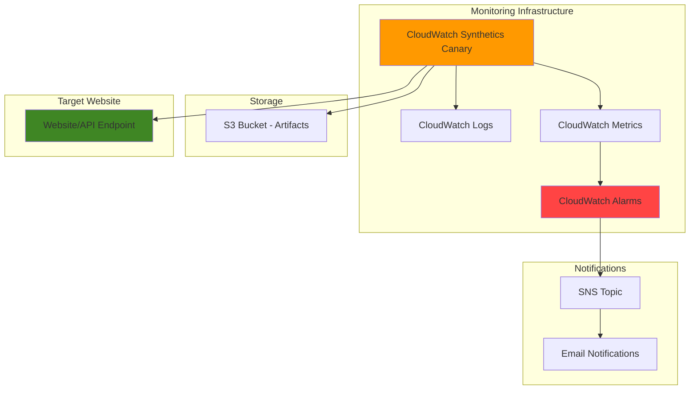

# Website Monitoring with CloudWatch Synthetics

## Problem

Your organization needs proactive website monitoring that detects availability issues, performance degradation, and user experience problems before customers notice them. Traditional monitoring approaches only alert when infrastructure fails, missing application-level issues that impact customer experience. Without continuous synthetic monitoring from a customer perspective, you risk revenue loss from undetected downtime and poor user experiences that damage brand reputation.

## Solution

CloudWatch Synthetics provides automated canary monitoring that tests your website functionality from the customer perspective using headless browser automation. The solution creates synthetic canaries that continuously run scripted tests against your endpoints, collecting performance metrics, screenshots, and detailed logs. This proactive monitoring approach detects issues before they impact real users while providing actionable insights for troubleshooting.

## Architecture Diagram



## Prerequisites

1. AWS account with CloudWatch Synthetics and IAM permissions
2. AWS CLI installed and configured (v2.15 or later)
3. Basic understanding of website monitoring concepts
4. Target website or API endpoint to monitor
5. Estimated cost: $0.0012 per canary run plus S3 storage and Lambda execution costs

> **Note**: CloudWatch Synthetics includes 100 free canary runs per month, then charges $0.0012 per run. A canary running every 5 minutes costs approximately $53.57 per month for execution plus additional AWS service costs.

## Preparation

```bash
# Set environment variables
export AWS_REGION=$(aws configure get region)
export AWS_ACCOUNT_ID=$(aws sts get-caller-identity \
    --query Account --output text)

# Generate unique identifiers for resources
RANDOM_SUFFIX=$(aws secretsmanager get-random-password \
    --exclude-punctuation --exclude-uppercase \
    --password-length 6 --require-each-included-type \
    --output text --query RandomPassword)

# Set monitoring configuration
export WEBSITE_URL="https://example.com"
export CANARY_NAME="website-monitor-${RANDOM_SUFFIX}"
export S3_BUCKET="synthetics-artifacts-${RANDOM_SUFFIX}"
export NOTIFICATION_EMAIL="your-email@example.com"

echo "✅ AWS environment configured for region: ${AWS_REGION}"
echo "✅ Canary name: ${CANARY_NAME}"
```

## Steps

1. **Create S3 Bucket for Canary Artifacts**:

   CloudWatch Synthetics requires an S3 bucket to store canary artifacts including screenshots, HAR files, and logs. This bucket serves as the central repository for all monitoring evidence, enabling detailed analysis of website performance and failures. The artifacts are crucial for troubleshooting issues and understanding user experience from the synthetic monitoring perspective.

   ```bash
   # Create S3 bucket for synthetics artifacts
   aws s3 mb s3://${S3_BUCKET} --region ${AWS_REGION}
   
   # Enable versioning for artifact history
   aws s3api put-bucket-versioning \
       --bucket ${S3_BUCKET} \
       --versioning-configuration Status=Enabled
   
   # Configure lifecycle policy for cost optimization
   aws s3api put-bucket-lifecycle-configuration \
       --bucket ${S3_BUCKET} \
       --lifecycle-configuration '{
         "Rules": [{
           "ID": "SyntheticsArtifactRetention",
           "Status": "Enabled",
           "Filter": {"Prefix": ""},
           "Transitions": [{
             "Days": 30,
             "StorageClass": "STANDARD_IA"
           }],
           "Expiration": {"Days": 90}
         }]
       }'
   
   echo "✅ S3 bucket created: ${S3_BUCKET}"
   ```

   The S3 bucket now provides secure, versioned storage for all canary artifacts with automatic lifecycle management to control costs while maintaining sufficient retention for troubleshooting.

2. **Create IAM Role for Synthetics Canary**:

   The canary requires an IAM role with specific permissions to execute browser automation, write artifacts to S3, and publish metrics to CloudWatch. This role follows the principle of least privilege while providing necessary access for comprehensive monitoring functionality.

   ```bash
   # Create trust policy for Synthetics service
   cat > synthetics-trust-policy.json << 'EOF'
   {
     "Version": "2012-10-17",
     "Statement": [
       {
         "Effect": "Allow",
         "Principal": {
           "Service": "lambda.amazonaws.com"
         },
         "Action": "sts:AssumeRole"
       }
     ]
   }
   EOF
   
   # Create IAM role for canary execution
   aws iam create-role \
       --role-name SyntheticsCanaryRole-${RANDOM_SUFFIX} \
       --assume-role-policy-document file://synthetics-trust-policy.json
   
   # Attach AWS managed policy for Synthetics execution
   aws iam attach-role-policy \
       --role-name SyntheticsCanaryRole-${RANDOM_SUFFIX} \
       --policy-arn arn:aws:iam::aws:policy/CloudWatchSyntheticsExecutionRolePolicy
   
   # Get the role ARN for canary creation
   ROLE_ARN=$(aws iam get-role \
       --role-name SyntheticsCanaryRole-${RANDOM_SUFFIX} \
       --query 'Role.Arn' --output text)
   
   echo "✅ IAM role created: ${ROLE_ARN}"
   ```

   The IAM role is now configured with appropriate permissions to execute synthetic monitoring while maintaining security best practices through managed policies.

3. **Create Website Monitoring Canary Script**:

   The canary script defines the synthetic monitoring logic using Puppeteer browser automation. This script simulates real user interactions, capturing performance metrics, visual evidence, and error conditions that impact user experience.

   ```bash
   # Create canary script for website monitoring
   cat > canary-script.js << 'EOF'
   const synthetics = require('Synthetics');
   const log = require('SyntheticsLogger');
   
   const checkWebsite = async function () {
       let page = await synthetics.getPage();
       
       // Navigate to website with performance monitoring
       const response = await synthetics.executeStepFunction('loadHomepage', async function () {
           return await page.goto(synthetics.getConfiguration().getUrl(), {
               waitUntil: 'networkidle0',
               timeout: 30000
           });
       });
       
       // Verify successful response
       if (response.status() < 200 || response.status() > 299) {
           throw new Error(`Failed to load page: ${response.status()}`);
       }
       
       // Check for critical page elements
       await synthetics.executeStepFunction('verifyPageElements', async function () {
           await page.waitForSelector('body', { timeout: 10000 });
           
           // Verify page title exists
           const title = await page.title();
           if (!title || title.length === 0) {
               throw new Error('Page title is missing');
           }
           
           log.info(`Page title: ${title}`);
           
           // Check for JavaScript errors
           const errors = await page.evaluate(() => {
               return window.console.errors || [];
           });
           
           if (errors.length > 0) {
               log.warn(`JavaScript errors detected: ${errors.length}`);
           }
       });
       
       // Capture performance metrics
       await synthetics.executeStepFunction('captureMetrics', async function () {
           const metrics = await page.evaluate(() => {
               const navigation = performance.getEntriesByType('navigation')[0];
               return {
                   loadTime: navigation.loadEventEnd - navigation.loadEventStart,
                   domContentLoaded: navigation.domContentLoadedEventEnd - navigation.domContentLoadedEventStart,
                   responseTime: navigation.responseEnd - navigation.requestStart
               };
           });
           
           // Log custom metrics
           log.info(`Load time: ${metrics.loadTime}ms`);
           log.info(`DOM content loaded: ${metrics.domContentLoaded}ms`);
           log.info(`Response time: ${metrics.responseTime}ms`);
           
           // Set custom CloudWatch metrics
           await synthetics.addUserAgentMetric('LoadTime', metrics.loadTime, 'Milliseconds');
           await synthetics.addUserAgentMetric('ResponseTime', metrics.responseTime, 'Milliseconds');
       });
   };
   
   exports.handler = async () => {
       return await synthetics.executeStep('checkWebsite', checkWebsite);
   };
   EOF
   
   # Create ZIP package for canary deployment
   zip canary-package.zip canary-script.js
   
   echo "✅ Canary script created and packaged"
   ```

   The monitoring script now provides comprehensive website testing including response validation, element verification, performance measurement, and custom metrics collection.

4. **Deploy CloudWatch Synthetics Canary**:

   The canary deployment establishes the automated monitoring schedule and configuration. CloudWatch Synthetics manages the execution environment, scaling, and integration with other AWS services while providing detailed monitoring capabilities from multiple AWS regions.

   ```bash
   # Create the synthetics canary
   aws synthetics create-canary \
       --name ${CANARY_NAME} \
       --runtime-version syn-nodejs-puppeteer-10.0 \
       --execution-role-arn ${ROLE_ARN} \
       --schedule '{
         "Expression": "rate(5 minutes)",
         "DurationInSeconds": 0
       }' \
       --code '{
         "Handler": "canary-script.handler",
         "ZipFile": '$(base64 -w 0 canary-package.zip)''
       }' \
       --artifact-s3-location s3://${S3_BUCKET}/canary-artifacts \
       --run-config '{
         "TimeoutInSeconds": 60,
         "MemoryInMB": 960,
         "ActiveTracing": true,
         "EnvironmentVariables": {
           "URL": "'${WEBSITE_URL}'"
         }
       }' \
       --success-retention-period-in-days 31 \
       --failure-retention-period-in-days 31 \
       --tags '{
         "Purpose": "WebsiteMonitoring",
         "Environment": "Production",
         "CreatedBy": "SyntheticsRecipe"
       }'
   
   # Start the canary
   aws synthetics start-canary --name ${CANARY_NAME}
   
   echo "✅ Canary deployed and started: ${CANARY_NAME}"
   ```

   The canary is now actively monitoring your website every 5 minutes, collecting performance data and storing artifacts for analysis and troubleshooting.

5. **Create CloudWatch Alarms for Monitoring**:

   CloudWatch alarms provide automated alerting when website availability or performance degrades. The alarms monitor synthetic test results and trigger notifications, enabling rapid response to issues before they impact customer experience.

   ```bash
   # Create SNS topic for alerts
   SNS_TOPIC_ARN=$(aws sns create-topic \
       --name synthetics-alerts-${RANDOM_SUFFIX} \
       --query 'TopicArn' --output text)
   
   # Subscribe email to SNS topic
   aws sns subscribe \
       --topic-arn ${SNS_TOPIC_ARN} \
       --protocol email \
       --notification-endpoint ${NOTIFICATION_EMAIL}
   
   # Create alarm for canary failures
   aws cloudwatch put-metric-alarm \
       --alarm-name "${CANARY_NAME}-FailureAlarm" \
       --alarm-description "Alert when website monitoring canary fails" \
       --metric-name SuccessPercent \
       --namespace CloudWatchSynthetics \
       --statistic Average \
       --period 300 \
       --threshold 90 \
       --comparison-operator LessThanThreshold \
       --evaluation-periods 2 \
       --alarm-actions ${SNS_TOPIC_ARN} \
       --dimensions Name=CanaryName,Value=${CANARY_NAME}
   
   # Create alarm for high response times
   aws cloudwatch put-metric-alarm \
       --alarm-name "${CANARY_NAME}-ResponseTimeAlarm" \
       --alarm-description "Alert when website response time is high" \
       --metric-name Duration \
       --namespace CloudWatchSynthetics \
       --statistic Average \
       --period 300 \
       --threshold 10000 \
       --comparison-operator GreaterThanThreshold \
       --evaluation-periods 2 \
       --alarm-actions ${SNS_TOPIC_ARN} \
       --dimensions Name=CanaryName,Value=${CANARY_NAME}
   
   echo "✅ CloudWatch alarms created with SNS notifications"
   echo "✅ Check your email for SNS subscription confirmation"
   ```

   The monitoring system now includes automated alerting for both availability failures and performance degradation, ensuring rapid notification of issues.

6. **Configure CloudWatch Dashboard**:

   A centralized dashboard provides visual monitoring of website performance trends, availability metrics, and historical data. This dashboard enables stakeholders to understand website health patterns and make data-driven decisions about performance optimization.

   ```bash
   # Create CloudWatch dashboard configuration
   cat > dashboard-config.json << EOF
   {
     "widgets": [
       {
         "type": "metric",
         "x": 0, "y": 0, "width": 12, "height": 6,
         "properties": {
           "metrics": [
             ["CloudWatchSynthetics", "SuccessPercent", "CanaryName", "${CANARY_NAME}"],
             [".", "Duration", ".", "."]
           ],
           "period": 300,
           "stat": "Average",
           "region": "${AWS_REGION}",
           "title": "Website Monitoring Overview",
           "yAxis": {"left": {"min": 0, "max": 100}}
         }
       },
       {
         "type": "metric",
         "x": 12, "y": 0, "width": 12, "height": 6,
         "properties": {
           "metrics": [
             ["CloudWatchSynthetics", "Failed", "CanaryName", "${CANARY_NAME}"],
             [".", "Passed", ".", "."]
           ],
           "period": 300,
           "stat": "Sum",
           "region": "${AWS_REGION}",
           "title": "Test Results",
           "yAxis": {"left": {"min": 0}}
         }
       }
     ]
   }
   EOF
   
   # Create the dashboard
   aws cloudwatch put-dashboard \
       --dashboard-name "Website-Monitoring-${RANDOM_SUFFIX}" \
       --dashboard-body file://dashboard-config.json
   
   echo "✅ CloudWatch dashboard created: Website-Monitoring-${RANDOM_SUFFIX}"
   ```

   The dashboard provides comprehensive visualization of website monitoring metrics, enabling quick assessment of performance trends and issue identification.

## Validation & Testing

1. Verify the canary is running successfully:

   ```bash
   # Check canary status and recent runs
   aws synthetics get-canary --name ${CANARY_NAME}
   
   # Get recent canary run results
   aws synthetics get-canary-runs \
       --name ${CANARY_NAME} \
       --max-results 5
   ```

   Expected output: Canary status should show "RUNNING" with recent successful executions.

2. Test monitoring by simulating website issues:

   ```bash
   # View canary metrics in CloudWatch
   aws cloudwatch get-metric-statistics \
       --namespace CloudWatchSynthetics \
       --metric-name SuccessPercent \
       --dimensions Name=CanaryName,Value=${CANARY_NAME} \
       --start-time $(date -u -d '1 hour ago' +%Y-%m-%dT%H:%M:%SZ) \
       --end-time $(date -u +%Y-%m-%dT%H:%M:%SZ) \
       --period 300 \
       --statistics Average
   
   # Check S3 for generated artifacts
   aws s3 ls s3://${S3_BUCKET}/canary-artifacts/ --recursive
   ```

   Expected output: Metrics showing success percentages and S3 artifacts including screenshots and logs.

3. Verify alarm functionality:

   ```bash
   # Check alarm states
   aws cloudwatch describe-alarms \
       --alarm-names "${CANARY_NAME}-FailureAlarm" "${CANARY_NAME}-ResponseTimeAlarm"
   
   # View dashboard in AWS Console
   echo "Dashboard URL: https://${AWS_REGION}.console.aws.amazon.com/cloudwatch/home?region=${AWS_REGION}#dashboards:name=Website-Monitoring-${RANDOM_SUFFIX}"
   ```

## Cleanup

1. Remove the synthetics canary:

   ```bash
   # Stop and delete the canary
   aws synthetics stop-canary --name ${CANARY_NAME}
   
   # Wait for canary to stop
   sleep 30
   
   aws synthetics delete-canary --name ${CANARY_NAME}
   
   echo "✅ Deleted canary: ${CANARY_NAME}"
   ```

2. Remove CloudWatch resources:

   ```bash
   # Delete CloudWatch alarms
   aws cloudwatch delete-alarms \
       --alarm-names "${CANARY_NAME}-FailureAlarm" "${CANARY_NAME}-ResponseTimeAlarm"
   
   # Delete dashboard
   aws cloudwatch delete-dashboards \
       --dashboard-names "Website-Monitoring-${RANDOM_SUFFIX}"
   
   echo "✅ Deleted CloudWatch resources"
   ```

3. Remove IAM role and S3 bucket:

   ```bash
   # Detach policy and delete IAM role
   aws iam detach-role-policy \
       --role-name SyntheticsCanaryRole-${RANDOM_SUFFIX} \
       --policy-arn arn:aws:iam::aws:policy/CloudWatchSyntheticsExecutionRolePolicy
   
   aws iam delete-role --role-name SyntheticsCanaryRole-${RANDOM_SUFFIX}
   
   # Empty and delete S3 bucket
   aws s3 rm s3://${S3_BUCKET} --recursive
   aws s3 rb s3://${S3_BUCKET}
   
   # Delete SNS topic
   aws sns delete-topic --topic-arn ${SNS_TOPIC_ARN}
   
   # Clean up local files
   rm -f synthetics-trust-policy.json canary-script.js canary-package.zip dashboard-config.json
   
   echo "✅ Cleanup completed"
   ```

## Discussion

CloudWatch Synthetics provides proactive website monitoring through automated canary testing that simulates real user interactions. The service leverages headless browser automation to execute complex user journeys, capturing detailed performance metrics, visual evidence, and error conditions that traditional infrastructure monitoring misses. This synthetic monitoring approach enables organizations to detect customer-impacting issues before they affect real users, reducing mean time to detection and improving overall service reliability.

The canary execution model provides several key advantages over traditional monitoring approaches. By running tests from AWS's global infrastructure, organizations gain visibility into website performance from multiple geographic locations, helping identify regional performance issues and content delivery optimization opportunities. The integration with CloudWatch metrics and alarms creates a comprehensive monitoring ecosystem that can trigger automated remediation workflows or alert development teams for rapid response.

Security considerations are paramount when implementing synthetic monitoring. The IAM role configuration follows AWS security best practices by using managed policies that provide least-privilege access to required services. The S3 bucket storage includes versioning and lifecycle policies to manage costs while maintaining audit trails. Additionally, the canary scripts should avoid including sensitive information in test data or URLs, as execution details are logged and stored in CloudWatch.

Performance optimization opportunities include adjusting canary frequency based on business requirements, implementing custom metrics for business-specific KPIs, and leveraging X-Ray tracing for detailed performance analysis. The artifact retention policies can be customized based on compliance requirements and cost considerations, with longer retention periods providing more historical data for trend analysis but increasing storage costs. For more information, see the [AWS Well-Architected Framework operational excellence pillar](https://docs.aws.amazon.com/wellarchitected/latest/operational-excellence-pillar/welcome.html).

> **Tip**: Use CloudWatch Synthetics with AWS X-Ray for distributed tracing to gain deeper insights into performance bottlenecks across your application stack. The [X-Ray integration documentation](https://docs.aws.amazon.com/AmazonCloudWatch/latest/monitoring/CloudWatch_Synthetics_Canaries_tracing.html) provides detailed guidance on enabling enhanced monitoring capabilities.

## Challenge

Extend this solution by implementing these enhancements:

1. **Multi-Region Monitoring**: Deploy canaries in multiple AWS regions to monitor global website performance and implement cross-region alerting for comprehensive availability monitoring.

2. **Advanced User Journey Testing**: Create complex canary scripts that simulate complete user workflows including login, form submissions, and e-commerce transactions using Puppeteer automation.

3. **Integration with AWS Systems Manager**: Implement automated remediation workflows using Systems Manager Automation documents triggered by CloudWatch alarms for self-healing infrastructure.

4. **Custom Business Metrics**: Extend canary scripts to collect and publish business-specific metrics such as page load performance, conversion funnel health, and third-party service dependencies.

5. **Compliance and Reporting**: Implement automated SLA reporting using CloudWatch Insights queries and scheduled Lambda functions to generate executive dashboards and compliance reports.

## Infrastructure Code

### Available Infrastructure as Code:

- [Infrastructure Code Overview](code/README.md) - Detailed description of all infrastructure components
- [AWS CDK (Python)](code/cdk-python/) - AWS CDK Python implementation
- [AWS CDK (TypeScript)](code/cdk-typescript/) - AWS CDK TypeScript implementation
- [CloudFormation](code/cloudformation.yaml) - AWS CloudFormation template
- [Bash CLI Scripts](code/scripts/) - Example bash scripts using AWS CLI commands to deploy infrastructure
- [Terraform](code/terraform/) - Terraform configuration files