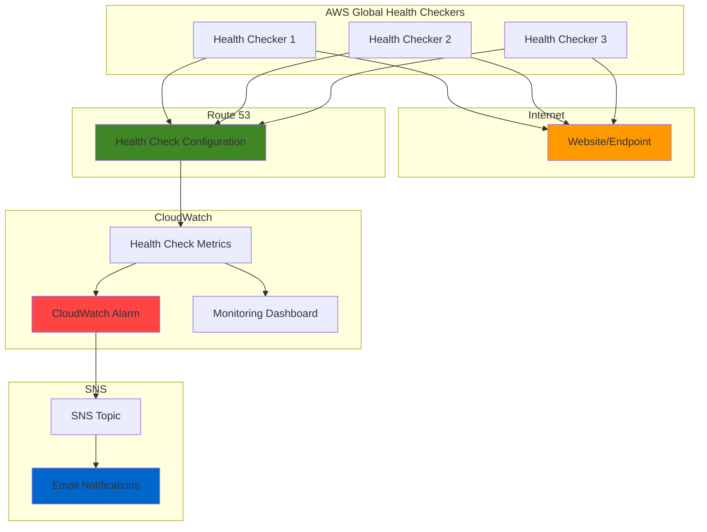

# Website Uptime Monitoring with Route 53

## Problem

E-commerce businesses and web applications lose significant revenue when their websites go down unexpectedly. Without automated monitoring, downtime can persist for hours before being detected, resulting in lost customers, damaged reputation, and direct financial impact. Traditional monitoring solutions are often complex to implement and expensive to maintain, leaving many organizations without adequate uptime visibility.

## Solution

Build a comprehensive website uptime monitoring system using AWS Route 53 health checks that automatically monitors website availability across multiple global locations. This solution integrates with CloudWatch for metrics visualization and SNS for instant email notifications when sites go down, providing cost-effective monitoring with enterprise-grade reliability and global coverage.

## Architecture Diagram



## Prerequisites

1. AWS account with appropriate permissions for Route 53, CloudWatch, and SNS
2. AWS CLI v2 installed and configured (or AWS Cloud Shell)
3. Basic understanding of DNS and HTTP protocols
4. A website or web application to monitor (can be any publicly accessible URL)
5. Valid email address for receiving notifications
6. Estimated cost: $0.50-$2.00 per month per health check (depending on frequency)

> **Note**: Route 53 health checks are billed based on the number of health checks and request frequency. Standard health checks cost $0.50 per month, while calculated health checks cost $1.00 per month.

## Preparation

```bash
# Set environment variables
export AWS_REGION=$(aws configure get region)
export AWS_ACCOUNT_ID=$(aws sts get-caller-identity \
    --query Account --output text)

# Generate unique identifiers for resources
RANDOM_SUFFIX=$(aws secretsmanager get-random-password \
    --exclude-punctuation --exclude-uppercase \
    --password-length 6 --require-each-included-type \
    --output text --query RandomPassword)

# Set the website URL to monitor (replace with your actual website)
export WEBSITE_URL="https://httpbin.org/status/200"
export MONITOR_EMAIL="your-email@example.com"

# Create resource names with unique suffix
export SNS_TOPIC_NAME="website-uptime-alerts-${RANDOM_SUFFIX}"
export HEALTH_CHECK_NAME="website-uptime-${RANDOM_SUFFIX}"
export ALARM_NAME="website-down-${RANDOM_SUFFIX}"
export DASHBOARD_NAME="website-uptime-dashboard-${RANDOM_SUFFIX}"

echo "✅ Environment configured for monitoring: ${WEBSITE_URL}"
echo "✅ Notifications will be sent to: ${MONITOR_EMAIL}"
```

## Steps

1. **Create SNS Topic for Email Notifications**:

   Amazon SNS provides reliable, scalable messaging for sending notifications to multiple subscribers. Creating the SNS topic first ensures we have a notification endpoint ready before configuring the health check alarm. This decoupled approach allows for easy addition of multiple notification channels and follows AWS best practices for event-driven architectures.

   ```bash
   # Create SNS topic for uptime alerts
   SNS_TOPIC_ARN=$(aws sns create-topic \
       --name ${SNS_TOPIC_NAME} \
       --query TopicArn --output text)
   
   # Subscribe your email address to the topic
   aws sns subscribe \
       --topic-arn ${SNS_TOPIC_ARN} \
       --protocol email \
       --notification-endpoint ${MONITOR_EMAIL}
   
   echo "✅ SNS topic created: ${SNS_TOPIC_ARN}"
   echo "⚠️  Please check your email and confirm the subscription"
   ```

   A confirmation email will be sent to your specified address. This subscription must be confirmed before notifications will be delivered, providing an additional security layer to prevent spam and ensuring only authorized recipients receive alerts.

2. **Create Route 53 Health Check Configuration**:

   Route 53 health checks provide global monitoring from multiple AWS edge locations worldwide, ensuring accurate availability assessment. The health check configuration defines the monitoring parameters including request interval, failure threshold, and the specific endpoint to monitor. This global approach eliminates false positives from single-location monitoring.

   ```bash
   # Create health check configuration file
   cat > health-check-config.json << EOF
   {
       "Type": "HTTPS",
       "ResourcePath": "/status/200",
       "FullyQualifiedDomainName": "httpbin.org",
       "Port": 443,
       "RequestInterval": 30,
       "FailureThreshold": 3,
       "MeasureLatency": true,
       "EnableSNI": true
   }
   EOF
   
   # Create the health check
   HEALTH_CHECK_ID=$(aws route53 create-health-check \
       --caller-reference "uptime-monitor-$(date +%s)" \
       --health-check-config file://health-check-config.json \
       --query HealthCheck.Id --output text)
   
   echo "✅ Health check created with ID: ${HEALTH_CHECK_ID}"
   ```

   The health check is configured to monitor HTTPS endpoints every 30 seconds with a failure threshold of 3 consecutive failures before marking the endpoint as unhealthy. This configuration balances responsiveness with resilience against temporary network issues. The EnableSNI parameter ensures proper SSL/TLS certificate validation for websites using Server Name Indication.

3. **Add Tags to Health Check for Organization**:

   Proper resource tagging enables effective cost management, resource organization, and operational oversight. Tags provide metadata that helps identify resource purpose, owner, and environment, which is crucial for maintaining large-scale infrastructure and following AWS Well-Architected Framework principles.

   ```bash
   # Add descriptive tags to the health check
   aws route53 change-tags-for-resource \
       --resource-type healthcheck \
       --resource-id ${HEALTH_CHECK_ID} \
       --add-tags \
           Key=Name,Value=${HEALTH_CHECK_NAME} \
           Key=Purpose,Value=UptimeMonitoring \
           Key=Environment,Value=Production \
           Key=Owner,Value=DevOps
   
   echo "✅ Tags added to health check"
   ```

   These tags will appear in AWS billing reports and can be used for cost allocation, automated resource management, and compliance reporting. Consistent tagging strategies are essential for multi-account AWS environments.

4. **Create CloudWatch Alarm for Health Check Failures**:

   CloudWatch alarms provide automated monitoring and alerting capabilities by continuously evaluating health check metrics. This alarm triggers when the health check fails, enabling immediate notification and potential automated remediation actions. The alarm uses the HealthCheckStatus metric which returns 1 for healthy and 0 for unhealthy states.

   ```bash
   # Create CloudWatch alarm for health check failures
   aws cloudwatch put-metric-alarm \
       --alarm-name ${ALARM_NAME} \
       --alarm-description "Alert when website is down" \
       --metric-name HealthCheckStatus \
       --namespace AWS/Route53 \
       --statistic Minimum \
       --period 60 \
       --threshold 1 \
       --comparison-operator LessThanThreshold \
       --evaluation-periods 2 \
       --alarm-actions ${SNS_TOPIC_ARN} \
       --ok-actions ${SNS_TOPIC_ARN} \
       --dimensions Name=HealthCheckId,Value=${HEALTH_CHECK_ID}
   
   echo "✅ CloudWatch alarm created: ${ALARM_NAME}"
   ```

   The alarm monitors the HealthCheckStatus metric and triggers when the minimum value over 2 consecutive periods is less than 1, indicating the site is down. The alarm includes both alarm-actions and ok-actions to notify when the site goes down and when it recovers.

5. **Create CloudWatch Dashboard for Visualization**:

   CloudWatch dashboards provide centralized visualization of health check metrics, enabling quick assessment of website performance trends and availability patterns. The dashboard includes multiple widgets showing different aspects of uptime monitoring, providing comprehensive visibility into website health.

   ```bash
   # Create dashboard configuration
   cat > dashboard-config.json << EOF
   {
       "widgets": [
           {
               "type": "metric",
               "x": 0,
               "y": 0,
               "width": 12,
               "height": 6,
               "properties": {
                   "metrics": [
                       ["AWS/Route53", "HealthCheckStatus", "HealthCheckId", "${HEALTH_CHECK_ID}"]
                   ],
                   "period": 300,
                   "stat": "Average",
                   "region": "us-east-1",
                   "title": "Website Health Status",
                   "yAxis": {
                       "left": {
                           "min": 0,
                           "max": 1
                       }
                   }
               }
           },
           {
               "type": "metric",
               "x": 12,
               "y": 0,
               "width": 12,
               "height": 6,
               "properties": {
                   "metrics": [
                       ["AWS/Route53", "HealthCheckPercentHealthy", "HealthCheckId", "${HEALTH_CHECK_ID}"]
                   ],
                   "period": 300,
                   "stat": "Average",
                   "region": "us-east-1",
                   "title": "Health Check Percentage",
                   "yAxis": {
                       "left": {
                           "min": 0,
                           "max": 100
                       }
                   }
               }
           }
       ]
   }
   EOF
   
   # Create the dashboard
   aws cloudwatch put-dashboard \
       --dashboard-name ${DASHBOARD_NAME} \
       --dashboard-body file://dashboard-config.json
   
   echo "✅ CloudWatch dashboard created: ${DASHBOARD_NAME}"
   ```

   The dashboard provides real-time and historical views of website health, helping identify patterns and trends in availability that can inform infrastructure decisions. Route 53 health check metrics are only available in the us-east-1 region.

6. **Configure Additional Health Check Regions** (Optional):

   Route 53 health checks can be configured to monitor from specific regions to reduce latency and improve accuracy for geographically distributed applications. This configuration enhances monitoring precision for global websites and can help identify regional connectivity issues.

   ```bash
   # Get current health check configuration
   aws route53 get-health-check \
       --health-check-id ${HEALTH_CHECK_ID} \
       --query HealthCheck.Config
   
   # Note: Region selection requires API calls to update health check config
   # This is typically done through the AWS console for easier management
   
   echo "✅ Health check regions can be configured via AWS console"
   ```

   Regional configuration allows you to select specific AWS regions for health checking, which can be particularly useful for optimizing check latency and ensuring accurate results for regional applications.

7. **Test the Monitoring System**:

   Validating the monitoring system ensures that all components work together correctly and that notifications are delivered as expected. Testing helps identify any configuration issues before they impact production monitoring and verifies the end-to-end functionality.

   ```bash
   # Wait for health check to initialize (takes 2-3 minutes)
   echo "⏳ Waiting for health check to initialize..."
   sleep 120
   
   # Check health check status
   aws route53 get-health-check \
       --health-check-id ${HEALTH_CHECK_ID} \
       --query HealthCheck.Status
   
   # View recent CloudWatch metrics
   aws cloudwatch get-metric-statistics \
       --namespace AWS/Route53 \
       --metric-name HealthCheckStatus \
       --dimensions Name=HealthCheckId,Value=${HEALTH_CHECK_ID} \
       --start-time $(date -u -d '10 minutes ago' +%Y-%m-%dT%H:%M:%S) \
       --end-time $(date -u +%Y-%m-%dT%H:%M:%S) \
       --period 300 \
       --statistics Average
   
   echo "✅ Health check is now active and monitoring"
   ```

   The system will begin monitoring immediately and start generating metrics that feed into the CloudWatch dashboard and alarm system. Initial health check results may take a few minutes to appear in CloudWatch.

## Validation & Testing

1. **Verify Health Check is Active**:

   ```bash
   # Check health check status and configuration
   aws route53 get-health-check \
       --health-check-id ${HEALTH_CHECK_ID} \
       --query 'HealthCheck.{Status:Status,Config:Config}'
   ```

   Expected output: Status should show "Success" and Config should match your configuration parameters.

2. **Test Email Notifications**:

   ```bash
   # Manually trigger the alarm to test notifications
   aws cloudwatch set-alarm-state \
       --alarm-name ${ALARM_NAME} \
       --state-value ALARM \
       --state-reason "Testing notification system"
   
   # Reset alarm state
   sleep 30
   aws cloudwatch set-alarm-state \
       --alarm-name ${ALARM_NAME} \
       --state-value OK \
       --state-reason "Test completed"
   ```

   Expected result: You should receive email notifications for both ALARM and OK states.

3. **View Dashboard Metrics**:

   ```bash
   # Get dashboard URL
   echo "Dashboard URL: https://console.aws.amazon.com/cloudwatch/home?region=${AWS_REGION}#dashboards:name=${DASHBOARD_NAME}"
   
   # Check current metrics
   aws cloudwatch get-metric-statistics \
       --namespace AWS/Route53 \
       --metric-name HealthCheckPercentHealthy \
       --dimensions Name=HealthCheckId,Value=${HEALTH_CHECK_ID} \
       --start-time $(date -u -d '1 hour ago' +%Y-%m-%dT%H:%M:%S) \
       --end-time $(date -u +%Y-%m-%dT%H:%M:%S) \
       --period 300 \
       --statistics Average
   ```

   Expected result: Metrics should show 100% healthy for a functioning website.

4. **Test with Different Website URLs**:

   ```bash
   # Test monitoring a non-existent endpoint (should fail)
   cat > test-health-check.json << EOF
   {
       "Type": "HTTPS",
       "ResourcePath": "/nonexistent",
       "FullyQualifiedDomainName": "httpbin.org",
       "Port": 443,
       "RequestInterval": 30,
       "FailureThreshold": 1
   }
   EOF
   
   # Create test health check
   TEST_HC_ID=$(aws route53 create-health-check \
       --caller-reference "test-$(date +%s)" \
       --health-check-config file://test-health-check.json \
       --query HealthCheck.Id --output text)
   
   echo "✅ Test health check created: ${TEST_HC_ID}"
   echo "⚠️  This should fail and can be deleted after testing"
   ```

## Cleanup

1. **Delete CloudWatch Dashboard**:

   ```bash
   # Remove the dashboard
   aws cloudwatch delete-dashboards \
       --dashboard-names ${DASHBOARD_NAME}
   
   echo "✅ Dashboard deleted"
   ```

2. **Delete CloudWatch Alarm**:

   ```bash
   # Remove the alarm
   aws cloudwatch delete-alarms \
       --alarm-names ${ALARM_NAME}
   
   echo "✅ CloudWatch alarm deleted"
   ```

3. **Delete SNS Topic and Subscription**:

   ```bash
   # Delete SNS topic (this also removes all subscriptions)
   aws sns delete-topic \
       --topic-arn ${SNS_TOPIC_ARN}
   
   echo "✅ SNS topic and subscriptions deleted"
   ```

4. **Delete Route 53 Health Check**:

   ```bash
   # Delete the health check
   aws route53 delete-health-check \
       --health-check-id ${HEALTH_CHECK_ID}
   
   # Delete test health check if created
   if [ ! -z "${TEST_HC_ID}" ]; then
       aws route53 delete-health-check \
           --health-check-id ${TEST_HC_ID}
   fi
   
   echo "✅ Health checks deleted"
   ```

5. **Remove Configuration Files**:

   ```bash
   # Clean up local configuration files
   rm -f health-check-config.json
   rm -f dashboard-config.json
   rm -f test-health-check.json
   
   # Clear environment variables
   unset WEBSITE_URL MONITOR_EMAIL SNS_TOPIC_NAME HEALTH_CHECK_NAME
   unset ALARM_NAME DASHBOARD_NAME HEALTH_CHECK_ID SNS_TOPIC_ARN
   
   echo "✅ Configuration files and environment variables cleaned up"
   ```

## Discussion

This uptime monitoring solution leverages AWS Route 53 health checks to provide enterprise-grade website monitoring with global coverage and high reliability. Route 53 health checks operate from multiple AWS edge locations worldwide, providing accurate availability assessment by testing from geographically distributed points. This approach eliminates false positives that might occur from single-location monitoring and provides comprehensive coverage for global applications.

The integration with CloudWatch provides powerful metrics collection and visualization capabilities, enabling both real-time monitoring and historical analysis. CloudWatch alarms offer flexible threshold-based alerting with support for multiple notification channels, statistical functions, and complex evaluation criteria. The metrics collected include health check status, response time, and percentage of healthy checkers, providing comprehensive insights into website performance and availability patterns.

The SNS integration enables reliable, scalable notification delivery to multiple subscribers and channels. SNS supports not only email notifications but also SMS, HTTP endpoints, and integration with other AWS services like Lambda functions for automated remediation. This flexibility allows organizations to integrate uptime monitoring into existing incident response workflows and escalation procedures.

Cost optimization is achieved through intelligent configuration of health check intervals and failure thresholds. The 30-second check interval provides responsive monitoring while the 3-failure threshold prevents false alarms from temporary network issues. Organizations can further optimize costs by adjusting these parameters based on their specific requirements and acceptable notification latency.

> **Tip**: Enable SNI (Server Name Indication) for HTTPS health checks when monitoring websites that use SSL/TLS certificates, as this ensures proper certificate validation and accurate health assessment.

For comprehensive monitoring strategies and best practices, refer to the [AWS Route 53 Health Check Documentation](https://docs.aws.amazon.com/Route53/latest/DeveloperGuide/welcome-health-checks.html), [CloudWatch Alarms User Guide](https://docs.aws.amazon.com/AmazonCloudWatch/latest/monitoring/AlarmThatSendsEmail.html), [SNS Email Notifications Documentation](https://docs.aws.amazon.com/sns/latest/dg/sns-email-notifications.html), [Route 53 Health Check Best Practices](https://docs.aws.amazon.com/Route53/latest/DeveloperGuide/best-practices-healthchecks.html), and [AWS Well-Architected Framework Reliability Pillar](https://docs.aws.amazon.com/wellarchitected/latest/reliability-pillar/monitoring-workloads.html).

## Challenge

Extend this monitoring solution by implementing these enhancements:

1. **Multi-Region Health Checks**: Configure health checks from specific AWS regions to monitor regional application performance and implement geo-specific alerting for globally distributed applications.

2. **Calculated Health Checks**: Create calculated health checks that combine multiple endpoint health checks using Boolean logic (AND/OR operations) to monitor complex multi-tier applications with dependencies.

3. **Automated Remediation**: Integrate with AWS Lambda functions triggered by SNS notifications to implement automated remediation actions such as restarting application services, scaling resources, or updating DNS records.

4. **Advanced Metrics and Dashboards**: Create comprehensive CloudWatch dashboards with custom metrics, response time analysis, availability SLAs, and integration with AWS X-Ray for distributed tracing.

5. **Integration with Incident Management**: Connect the monitoring system with external incident management platforms (PagerDuty, Slack, Microsoft Teams) using SNS HTTP endpoints or Lambda functions for enterprise-grade alerting workflows.

## Infrastructure Code

*Infrastructure code will be generated after recipe approval.*