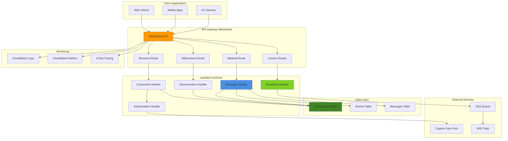

# Managing WebSocket APIs with Route and Connection Handling

## Problem

Modern applications require real-time bidirectional communication for features like live chat, collaborative editing, gaming, and live data feeds. Traditional REST APIs with polling mechanisms create high latency, excessive bandwidth usage, and poor user experience. Organizations need scalable WebSocket infrastructure that handles connection management, message routing, user authentication, and connection state persistence without managing WebSocket servers or complex networking infrastructure.

## Solution

Implement a comprehensive WebSocket API using API Gateway WebSocket APIs with Lambda-based route handlers, DynamoDB for connection state management, and sophisticated message routing patterns. This solution provides real-time communication capabilities with automatic scaling, connection lifecycle management, and advanced routing logic for building interactive applications.

## Architecture Diagram



## Prerequisites

1. AWS account with API Gateway, Lambda, DynamoDB, and CloudWatch permissions
2. AWS CLI v2 installed and configured (or AWS CloudShell)
3. Understanding of WebSocket protocol, real-time applications, and event-driven architecture
4. Knowledge of DynamoDB data modeling and Lambda function patterns
5. Estimated cost: $15-25 for testing (includes API Gateway WebSocket connections, Lambda executions, DynamoDB operations)

> **Note**: WebSocket APIs have different pricing than REST APIs, with charges based on connection duration and message count. Monitor usage during testing to avoid unexpected costs. See [API Gateway WebSocket pricing](https://aws.amazon.com/api-gateway/pricing/) for details.

## Preparation

```bash
# Set environment variables
export AWS_REGION=$(aws configure get region)
export AWS_ACCOUNT_ID=$(aws sts get-caller-identity \
    --query Account --output text)

# Generate unique identifiers for resource naming
RANDOM_SUFFIX=$(aws secretsmanager get-random-password \
    --exclude-punctuation --exclude-uppercase \
    --password-length 6 --require-each-included-type \
    --output text --query RandomPassword)

export API_NAME="websocket-api-${RANDOM_SUFFIX}"
export CONNECTIONS_TABLE="websocket-connections-${RANDOM_SUFFIX}"
export ROOMS_TABLE="websocket-rooms-${RANDOM_SUFFIX}"
export MESSAGES_TABLE="websocket-messages-${RANDOM_SUFFIX}"

# Create DynamoDB tables for connection and state management
aws dynamodb create-table \
    --table-name ${CONNECTIONS_TABLE} \
    --attribute-definitions \
        AttributeName=connectionId,AttributeType=S \
        AttributeName=userId,AttributeType=S \
        AttributeName=roomId,AttributeType=S \
    --key-schema \
        AttributeName=connectionId,KeyType=HASH \
    --global-secondary-indexes \
        'IndexName=UserIndex,KeySchema=[{AttributeName=userId,KeyType=HASH}],Projection={ProjectionType=ALL},ProvisionedThroughput={ReadCapacityUnits=5,WriteCapacityUnits=5}' \
        'IndexName=RoomIndex,KeySchema=[{AttributeName=roomId,KeyType=HASH}],Projection={ProjectionType=ALL},ProvisionedThroughput={ReadCapacityUnits=5,WriteCapacityUnits=5}' \
    --provisioned-throughput \
        ReadCapacityUnits=5,WriteCapacityUnits=5

aws dynamodb create-table \
    --table-name ${ROOMS_TABLE} \
    --attribute-definitions \
        AttributeName=roomId,AttributeType=S \
        AttributeName=ownerId,AttributeType=S \
    --key-schema \
        AttributeName=roomId,KeyType=HASH \
    --global-secondary-indexes \
        'IndexName=OwnerIndex,KeySchema=[{AttributeName=ownerId,KeyType=HASH}],Projection={ProjectionType=ALL},ProvisionedThroughput={ReadCapacityUnits=5,WriteCapacityUnits=5}' \
    --provisioned-throughput \
        ReadCapacityUnits=5,WriteCapacityUnits=5

aws dynamodb create-table \
    --table-name ${MESSAGES_TABLE} \
    --attribute-definitions \
        AttributeName=messageId,AttributeType=S \
        AttributeName=roomId,AttributeType=S \
        AttributeName=timestamp,AttributeType=N \
    --key-schema \
        AttributeName=messageId,KeyType=HASH \
    --global-secondary-indexes \
        'IndexName=RoomTimestampIndex,KeySchema=[{AttributeName=roomId,KeyType=HASH},{AttributeName=timestamp,KeyType=RANGE}],Projection={ProjectionType=ALL},ProvisionedThroughput={ReadCapacityUnits=5,WriteCapacityUnits=5}' \
    --provisioned-throughput \
        ReadCapacityUnits=5,WriteCapacityUnits=5

# Wait for tables to be created before proceeding
aws dynamodb wait table-exists --table-name ${CONNECTIONS_TABLE}
aws dynamodb wait table-exists --table-name ${ROOMS_TABLE}
aws dynamodb wait table-exists --table-name ${MESSAGES_TABLE}

echo "✅ Created DynamoDB tables for WebSocket state management"
```

## Steps

1. **Create IAM Roles and Policies for Lambda Functions**:

   IAM roles and policies form the security foundation for WebSocket APIs, enabling Lambda functions to interact with DynamoDB and API Gateway while maintaining least privilege access. These permissions enable connection state management, message persistence, and real-time message delivery through the API Gateway Management API, following [AWS security best practices](https://docs.aws.amazon.com/IAM/latest/UserGuide/best-practices.html).

   ```bash
   # Create IAM role for WebSocket Lambda functions
   aws iam create-role \
       --role-name websocket-lambda-role-${RANDOM_SUFFIX} \
       --assume-role-policy-document '{
           "Version": "2012-10-17",
           "Statement": [
               {
                   "Effect": "Allow",
                   "Principal": {
                       "Service": "lambda.amazonaws.com"
                   },
                   "Action": "sts:AssumeRole"
               }
           ]
       }'
   
   # Create custom policy for WebSocket operations
   aws iam create-policy \
       --policy-name websocket-policy-${RANDOM_SUFFIX} \
       --policy-document '{
           "Version": "2012-10-17",
           "Statement": [
               {
                   "Effect": "Allow",
                   "Action": [
                       "dynamodb:Query",
                       "dynamodb:Scan",
                       "dynamodb:GetItem",
                       "dynamodb:PutItem",
                       "dynamodb:UpdateItem",
                       "dynamodb:DeleteItem"
                   ],
                   "Resource": [
                       "arn:aws:dynamodb:'${AWS_REGION}':'${AWS_ACCOUNT_ID}':table/'${CONNECTIONS_TABLE}'",
                       "arn:aws:dynamodb:'${AWS_REGION}':'${AWS_ACCOUNT_ID}':table/'${CONNECTIONS_TABLE}'/index/*",
                       "arn:aws:dynamodb:'${AWS_REGION}':'${AWS_ACCOUNT_ID}':table/'${ROOMS_TABLE}'",
                       "arn:aws:dynamodb:'${AWS_REGION}':'${AWS_ACCOUNT_ID}':table/'${ROOMS_TABLE}'/index/*",
                       "arn:aws:dynamodb:'${AWS_REGION}':'${AWS_ACCOUNT_ID}':table/'${MESSAGES_TABLE}'",
                       "arn:aws:dynamodb:'${AWS_REGION}':'${AWS_ACCOUNT_ID}':table/'${MESSAGES_TABLE}'/index/*"
                   ]
               },
               {
                   "Effect": "Allow",
                   "Action": [
                       "execute-api:ManageConnections"
                   ],
                   "Resource": "arn:aws:execute-api:'${AWS_REGION}':'${AWS_ACCOUNT_ID}':*/@connections/*"
               }
           ]
       }'
   
   # Attach policies to role
   aws iam attach-role-policy \
       --role-name websocket-lambda-role-${RANDOM_SUFFIX} \
       --policy-arn arn:aws:iam::aws:policy/service-role/AWSLambdaBasicExecutionRole
   
   aws iam attach-role-policy \
       --role-name websocket-lambda-role-${RANDOM_SUFFIX} \
       --policy-arn arn:aws:iam::${AWS_ACCOUNT_ID}:policy/websocket-policy-${RANDOM_SUFFIX}
   
   # Wait for role propagation
   sleep 10
   
   export LAMBDA_ROLE_ARN="arn:aws:iam::${AWS_ACCOUNT_ID}:role/websocket-lambda-role-${RANDOM_SUFFIX}"
   
   echo "✅ Created IAM roles and policies"
   ```

   The IAM role is now established with appropriate permissions for WebSocket operations. This security foundation enables Lambda functions to store connection state in DynamoDB and send messages back to clients through the API Gateway Management API, following AWS security best practices with least privilege access.

2. **Create Connection Handler Lambda Function**:

   The connection handler manages the WebSocket connection lifecycle during the $connect route, which is triggered when clients establish WebSocket connections. This function validates authentication tokens, stores connection metadata in DynamoDB, and sends welcome messages to establish bidirectional communication channels, implementing [WebSocket API connection patterns](https://docs.aws.amazon.com/apigateway/latest/developerguide/apigateway-websocket-api-route-keys-connect-disconnect.html).

   ```bash
   # Create connection handler for $connect route
   cat > connect_handler.py << 'EOF'
   import json
   import boto3
   import os
   import time
   from botocore.exceptions import ClientError
   
   dynamodb = boto3.resource('dynamodb')
   connections_table = dynamodb.Table(os.environ['CONNECTIONS_TABLE'])
   
   def lambda_handler(event, context):
       connection_id = event['requestContext']['connectionId']
       domain_name = event['requestContext']['domainName']
       stage = event['requestContext']['stage']
       
       # Extract query parameters for authentication and room joining
       query_params = event.get('queryStringParameters') or {}
       user_id = query_params.get('userId', 'anonymous')
       room_id = query_params.get('roomId', 'general')
       auth_token = query_params.get('token')
       
       try:
           # Basic token validation (in production, integrate with Cognito)
           if auth_token:
               # Simulate token validation
               if not auth_token.startswith('valid_'):
                   return {
                       'statusCode': 401,
                       'body': json.dumps({'error': 'Invalid authentication token'})
                   }
           
           # Store connection information with comprehensive metadata
           connection_data = {
               'connectionId': connection_id,
               'userId': user_id,
               'roomId': room_id,
               'connectedAt': int(time.time()),
               'domainName': domain_name,
               'stage': stage,
               'lastActivity': int(time.time()),
               'status': 'connected'
           }
           
           # Add optional user metadata if provided
           if 'username' in query_params:
               connection_data['username'] = query_params['username']
           
           connections_table.put_item(Item=connection_data)
           
           # Send welcome message using API Gateway Management API
           api_gateway = boto3.client('apigatewaymanagementapi',
               endpoint_url=f'https://{domain_name}/{stage}')
           
           welcome_message = {
               'type': 'welcome',
               'data': {
                   'connectionId': connection_id,
                   'userId': user_id,
                   'roomId': room_id,
                   'message': f'Welcome to room {room_id}!',
                   'timestamp': int(time.time())
               }
           }
           
           api_gateway.post_to_connection(
               ConnectionId=connection_id,
               Data=json.dumps(welcome_message)
           )
           
           print(f"Connection established: {connection_id} for user {user_id} in room {room_id}")
           
           return {
               'statusCode': 200,
               'body': json.dumps({'message': 'Connected successfully'})
           }
           
       except ClientError as e:
           print(f"DynamoDB error: {e}")
           return {
               'statusCode': 500,
               'body': json.dumps({'error': 'Connection failed'})
           }
       except Exception as e:
           print(f"Unexpected error: {e}")
           return {
               'statusCode': 500,
               'body': json.dumps({'error': 'Internal server error'})
           }
   EOF
   
   # Package and deploy connection handler with updated runtime
   zip connect_handler.zip connect_handler.py
   aws lambda create-function \
       --function-name websocket-connect-${RANDOM_SUFFIX} \
       --runtime python3.13 \
       --role ${LAMBDA_ROLE_ARN} \
       --handler connect_handler.lambda_handler \
       --zip-file fileb://connect_handler.zip \
       --description "WebSocket connection handler" \
       --timeout 30 \
       --memory-size 256 \
       --environment Variables='{
           "CONNECTIONS_TABLE": "'${CONNECTIONS_TABLE}'"
       }'
   
   export CONNECT_FUNCTION_ARN=$(aws lambda get-function \
       --function-name websocket-connect-${RANDOM_SUFFIX} \
       --query Configuration.FunctionArn --output text)
   
   echo "✅ Created connection handler Lambda function"
   ```

   The connection handler is now deployed and ready to process incoming WebSocket connections. This function establishes the foundation for real-time communication by validating clients, storing connection state in DynamoDB, and initiating the bidirectional messaging protocol essential for interactive applications.

3. **Create Disconnect Handler Lambda Function**:

   The disconnect handler ensures graceful cleanup when WebSocket connections terminate through the $disconnect route. This function removes connection state from DynamoDB, preventing stale connection accumulation and maintaining accurate user presence information for real-time applications, following [connection lifecycle management patterns](https://docs.aws.amazon.com/apigateway/latest/developerguide/websocket-api-route-keys-connect-disconnect.html).

   ```bash
   # Create disconnect handler for $disconnect route
   cat > disconnect_handler.py << 'EOF'
   import json
   import boto3
   import os
   from botocore.exceptions import ClientError
   
   dynamodb = boto3.resource('dynamodb')
   connections_table = dynamodb.Table(os.environ['CONNECTIONS_TABLE'])
   
   def lambda_handler(event, context):
       connection_id = event['requestContext']['connectionId']
       
       try:
           # Get connection information before deletion for logging
           response = connections_table.get_item(
               Key={'connectionId': connection_id}
           )
           
           if 'Item' in response:
               connection_data = response['Item']
               user_id = connection_data.get('userId', 'unknown')
               room_id = connection_data.get('roomId', 'unknown')
               
               print(f"Disconnecting user {user_id} from room {room_id}")
           
           # Remove connection from table to prevent stale connections
           connections_table.delete_item(
               Key={'connectionId': connection_id}
           )
           
           print(f"Connection removed: {connection_id}")
           
           return {
               'statusCode': 200,
               'body': json.dumps({'message': 'Disconnected successfully'})
           }
           
       except ClientError as e:
           print(f"DynamoDB error: {e}")
           return {
               'statusCode': 500,
               'body': json.dumps({'error': 'Disconnect failed'})
           }
       except Exception as e:
           print(f"Unexpected error: {e}")
           return {
               'statusCode': 500,
               'body': json.dumps({'error': 'Internal server error'})
           }
   EOF
   
   # Package and deploy disconnect handler
   zip disconnect_handler.zip disconnect_handler.py
   aws lambda create-function \
       --function-name websocket-disconnect-${RANDOM_SUFFIX} \
       --runtime python3.13 \
       --role ${LAMBDA_ROLE_ARN} \
       --handler disconnect_handler.lambda_handler \
       --zip-file fileb://disconnect_handler.zip \
       --description "WebSocket disconnect handler" \
       --timeout 30 \
       --memory-size 256 \
       --environment Variables='{
           "CONNECTIONS_TABLE": "'${CONNECTIONS_TABLE}'"
       }'
   
   export DISCONNECT_FUNCTION_ARN=$(aws lambda get-function \
       --function-name websocket-disconnect-${RANDOM_SUFFIX} \
       --query Configuration.FunctionArn --output text)
   
   echo "✅ Created disconnect handler Lambda function"
   ```

   The disconnect handler is now configured to maintain connection state consistency. This cleanup mechanism prevents resource leaks and ensures accurate user presence tracking, which is critical for collaborative applications and real-time user experience.

4. **Create Message Handler Lambda Function**:

   The message handler processes all real-time communication through the $default route and custom routes, implementing sophisticated message routing logic for different communication patterns. This function handles chat messages, room management, private messaging, and administrative commands while maintaining message persistence and broadcasting capabilities using [route selection expressions](https://docs.aws.amazon.com/apigateway/latest/developerguide/websocket-api-develop-routes.html).

   ```bash
   # Create message handler for default and custom routes
   cat > message_handler.py << 'EOF'
   import json
   import boto3
   import os
   import time
   import uuid
   from botocore.exceptions import ClientError
   from boto3.dynamodb.conditions import Key
   
   dynamodb = boto3.resource('dynamodb')
   connections_table = dynamodb.Table(os.environ['CONNECTIONS_TABLE'])
   rooms_table = dynamodb.Table(os.environ['ROOMS_TABLE'])
   messages_table = dynamodb.Table(os.environ['MESSAGES_TABLE'])
   
   def lambda_handler(event, context):
       connection_id = event['requestContext']['connectionId']
       domain_name = event['requestContext']['domainName']
       stage = event['requestContext']['stage']
       route_key = event['requestContext']['routeKey']
       
       # Parse message from client with error handling
       try:
           message_data = json.loads(event.get('body', '{}'))
       except json.JSONDecodeError:
           return send_error(connection_id, domain_name, stage, 'Invalid JSON format')
       
       # Get sender connection info from DynamoDB
       try:
           sender_response = connections_table.get_item(
               Key={'connectionId': connection_id}
           )
           
           if 'Item' not in sender_response:
               return send_error(connection_id, domain_name, stage, 'Connection not found')
           
           sender_info = sender_response['Item']
           
       except ClientError as e:
           print(f"Error getting sender info: {e}")
           return {'statusCode': 500}
       
       # Route message based on type with comprehensive message handling
       message_type = message_data.get('type', 'chat')
       
       if message_type == 'chat':
           return handle_chat_message(message_data, sender_info, domain_name, stage)
       elif message_type == 'join_room':
           return handle_join_room(message_data, sender_info, connection_id, domain_name, stage)
       elif message_type == 'leave_room':
           return handle_leave_room(message_data, sender_info, connection_id, domain_name, stage)
       elif message_type == 'private_message':
           return handle_private_message(message_data, sender_info, domain_name, stage)
       elif message_type == 'room_list':
           return handle_room_list(sender_info, connection_id, domain_name, stage)
       else:
           return send_error(connection_id, domain_name, stage, f'Unknown message type: {message_type}')
   
   def handle_chat_message(message_data, sender_info, domain_name, stage):
       room_id = message_data.get('roomId', sender_info['roomId'])
       message_content = message_data.get('message', '')
       
       if not message_content.strip():
           return send_error(sender_info['connectionId'], domain_name, stage, 'Message cannot be empty')
       
       # Store message in database with comprehensive metadata
       message_id = str(uuid.uuid4())
       timestamp = int(time.time())
       
       message_record = {
           'messageId': message_id,
           'roomId': room_id,
           'senderId': sender_info['userId'],
           'senderName': sender_info.get('username', sender_info['userId']),
           'message': message_content,
           'timestamp': timestamp,
           'type': 'chat'
       }
       
       messages_table.put_item(Item=message_record)
       
       # Broadcast to all connections in the room
       broadcast_message = {
           'type': 'chat',
           'data': {
               'messageId': message_id,
               'roomId': room_id,
               'senderId': sender_info['userId'],
               'senderName': sender_info.get('username', sender_info['userId']),
               'message': message_content,
               'timestamp': timestamp
           }
       }
       
       broadcast_to_room(room_id, broadcast_message, domain_name, stage)
       
       return {'statusCode': 200}
   
   def handle_join_room(message_data, sender_info, connection_id, domain_name, stage):
       new_room_id = message_data.get('roomId')
       
       if not new_room_id:
           return send_error(connection_id, domain_name, stage, 'Room ID required')
       
       # Update connection's room using DynamoDB update operations
       connections_table.update_item(
           Key={'connectionId': connection_id},
           UpdateExpression='SET roomId = :room_id, lastActivity = :timestamp',
           ExpressionAttributeValues={
               ':room_id': new_room_id,
               ':timestamp': int(time.time())
           }
       )
       
       # Notify room of new member
       join_message = {
           'type': 'user_joined',
           'data': {
               'userId': sender_info['userId'],
               'username': sender_info.get('username', sender_info['userId']),
               'roomId': new_room_id,
               'timestamp': int(time.time())
           }
       }
       
       broadcast_to_room(new_room_id, join_message, domain_name, stage)
       
       return {'statusCode': 200}
   
   def handle_private_message(message_data, sender_info, domain_name, stage):
       target_user_id = message_data.get('targetUserId')
       message_content = message_data.get('message')
       
       if not target_user_id or not message_content:
           return send_error(sender_info['connectionId'], domain_name, stage, 
                           'Target user ID and message required for private messages')
       
       # Find target user's connections using GSI
       response = connections_table.query(
           IndexName='UserIndex',
           KeyConditionExpression=Key('userId').eq(target_user_id)
       )
       
       if not response['Items']:
           return send_error(sender_info['connectionId'], domain_name, stage, 
                           'Target user not found or offline')
       
       # Send private message to all target user's connections
       private_message = {
           'type': 'private_message',
           'data': {
               'senderId': sender_info['userId'],
               'senderName': sender_info.get('username', sender_info['userId']),
               'message': message_content,
               'timestamp': int(time.time())
           }
       }
       
       api_gateway = boto3.client('apigatewaymanagementapi',
           endpoint_url=f'https://{domain_name}/{stage}')
       
       for target_connection in response['Items']:
           try:
               api_gateway.post_to_connection(
                   ConnectionId=target_connection['connectionId'],
                   Data=json.dumps(private_message)
               )
           except ClientError as e:
               if e.response['Error']['Code'] == 'GoneException':
                   # Remove stale connection
                   connections_table.delete_item(
                       Key={'connectionId': target_connection['connectionId']}
                   )
       
       return {'statusCode': 200}
   
   def handle_room_list(sender_info, connection_id, domain_name, stage):
       # Get active rooms (rooms with at least one connection)
       response = connections_table.scan(
           ProjectionExpression='roomId'
       )
       
       active_rooms = {}
       for item in response['Items']:
           room_id = item['roomId']
           active_rooms[room_id] = active_rooms.get(room_id, 0) + 1
       
       room_list_message = {
           'type': 'room_list',
           'data': {
               'rooms': [
                   {'roomId': room_id, 'activeUsers': count}
                   for room_id, count in active_rooms.items()
               ],
               'timestamp': int(time.time())
           }
       }
       
       api_gateway = boto3.client('apigatewaymanagementapi',
           endpoint_url=f'https://{domain_name}/{stage}')
       
       api_gateway.post_to_connection(
           ConnectionId=connection_id,
           Data=json.dumps(room_list_message)
       )
       
       return {'statusCode': 200}
   
   def broadcast_to_room(room_id, message, domain_name, stage):
       # Get all connections in the room using room index
       response = connections_table.query(
           IndexName='RoomIndex',
           KeyConditionExpression=Key('roomId').eq(room_id)
       )
       
       api_gateway = boto3.client('apigatewaymanagementapi',
           endpoint_url=f'https://{domain_name}/{stage}')
       
       message_data = json.dumps(message)
       stale_connections = []
       
       for connection in response['Items']:
           try:
               api_gateway.post_to_connection(
                   ConnectionId=connection['connectionId'],
                   Data=message_data
               )
           except ClientError as e:
               if e.response['Error']['Code'] == 'GoneException':
                   stale_connections.append(connection['connectionId'])
       
       # Clean up stale connections
       for connection_id in stale_connections:
           connections_table.delete_item(Key={'connectionId': connection_id})
   
   def send_error(connection_id, domain_name, stage, error_message):
       api_gateway = boto3.client('apigatewaymanagementapi',
           endpoint_url=f'https://{domain_name}/{stage}')
       
       error_response = {
           'type': 'error',
           'data': {
               'message': error_message,
               'timestamp': int(time.time())
           }
       }
       
       try:
           api_gateway.post_to_connection(
               ConnectionId=connection_id,
               Data=json.dumps(error_response)
           )
       except ClientError:
           pass  # Connection might be gone
       
       return {'statusCode': 400}
   EOF
   
   # Package and deploy message handler
   zip message_handler.zip message_handler.py
   aws lambda create-function \
       --function-name websocket-message-${RANDOM_SUFFIX} \
       --runtime python3.13 \
       --role ${LAMBDA_ROLE_ARN} \
       --handler message_handler.lambda_handler \
       --zip-file fileb://message_handler.zip \
       --description "WebSocket message handler" \
       --timeout 60 \
       --memory-size 512 \
       --environment Variables='{
           "CONNECTIONS_TABLE": "'${CONNECTIONS_TABLE}'",
           "ROOMS_TABLE": "'${ROOMS_TABLE}'",
           "MESSAGES_TABLE": "'${MESSAGES_TABLE}'"
       }'
   
   export MESSAGE_FUNCTION_ARN=$(aws lambda get-function \
       --function-name websocket-message-${RANDOM_SUFFIX} \
       --query Configuration.FunctionArn --output text)
   
   echo "✅ Created message handler Lambda function"
   ```

   The message handler is now deployed with comprehensive routing and broadcasting capabilities. This function enables complex real-time interactions including room-based messaging, private communications, and administrative features, providing the core functionality for interactive applications with automatic stale connection cleanup.

5. **Create WebSocket API Gateway**:

   API Gateway WebSocket APIs provide managed infrastructure for WebSocket connections with automatic scaling, connection management, and integration with AWS services. The route selection expression enables message-based routing to different Lambda handlers, creating a flexible and extensible real-time messaging architecture following [WebSocket API patterns](https://docs.aws.amazon.com/apigateway/latest/developerguide/apigateway-websocket-api-overview.html).

   ```bash
   # Create WebSocket API with route selection expression
   export API_ID=$(aws apigatewayv2 create-api \
       --name ${API_NAME} \
       --protocol-type WEBSOCKET \
       --route-selection-expression '$request.body.type' \
       --description "Advanced WebSocket API with route management" \
       --query ApiId --output text)
   
   # Create $connect integration with Lambda proxy
   export CONNECT_INTEGRATION_ID=$(aws apigatewayv2 create-integration \
       --api-id ${API_ID} \
       --integration-type AWS_PROXY \
       --integration-uri "arn:aws:apigateway:${AWS_REGION}:lambda:path/2015-03-31/functions/${CONNECT_FUNCTION_ARN}/invocations" \
       --query IntegrationId --output text)
   
   # Create $disconnect integration
   export DISCONNECT_INTEGRATION_ID=$(aws apigatewayv2 create-integration \
       --api-id ${API_ID} \
       --integration-type AWS_PROXY \
       --integration-uri "arn:aws:apigateway:${AWS_REGION}:lambda:path/2015-03-31/functions/${DISCONNECT_FUNCTION_ARN}/invocations" \
       --query IntegrationId --output text)
   
   # Create $default integration for message routing
   export MESSAGE_INTEGRATION_ID=$(aws apigatewayv2 create-integration \
       --api-id ${API_ID} \
       --integration-type AWS_PROXY \
       --integration-uri "arn:aws:apigateway:${AWS_REGION}:lambda:path/2015-03-31/functions/${MESSAGE_FUNCTION_ARN}/invocations" \
       --query IntegrationId --output text)
   
   echo "✅ Created WebSocket API and integrations"
   ```

   The WebSocket API is now configured with Lambda integrations for connection lifecycle management and message processing. This managed infrastructure eliminates the complexity of WebSocket server management while providing enterprise-grade scalability and reliability.

6. **Create Routes for WebSocket API**:

   WebSocket routes define how incoming connections and messages are processed, with special routes ($connect, $disconnect, $default) handling connection lifecycle events and custom routes enabling message-type-based routing. This routing mechanism provides flexibility for complex real-time applications with multiple communication patterns as detailed in the [WebSocket routing documentation](https://docs.aws.amazon.com/apigateway/latest/developerguide/websocket-api-develop-routes.html).

   ```bash
   # Create $connect route for connection establishment
   aws apigatewayv2 create-route \
       --api-id ${API_ID} \
       --route-key '$connect' \
       --target "integrations/${CONNECT_INTEGRATION_ID}"
   
   # Create $disconnect route for connection cleanup
   aws apigatewayv2 create-route \
       --api-id ${API_ID} \
       --route-key '$disconnect' \
       --target "integrations/${DISCONNECT_INTEGRATION_ID}"
   
   # Create $default route for unmatched messages
   aws apigatewayv2 create-route \
       --api-id ${API_ID} \
       --route-key '$default' \
       --target "integrations/${MESSAGE_INTEGRATION_ID}"
   
   # Create custom routes for specific message types
   aws apigatewayv2 create-route \
       --api-id ${API_ID} \
       --route-key 'chat' \
       --target "integrations/${MESSAGE_INTEGRATION_ID}"
   
   aws apigatewayv2 create-route \
       --api-id ${API_ID} \
       --route-key 'join_room' \
       --target "integrations/${MESSAGE_INTEGRATION_ID}"
   
   aws apigatewayv2 create-route \
       --api-id ${API_ID} \
       --route-key 'private_message' \
       --target "integrations/${MESSAGE_INTEGRATION_ID}"
   
   echo "✅ Created WebSocket routes"
   ```

   The WebSocket routes are now configured to handle both connection lifecycle events and message routing based on message types. This routing structure enables sophisticated real-time applications with multiple communication patterns while maintaining clean separation of concerns.

7. **Grant Permissions and Deploy API**:

   API Gateway requires explicit permissions to invoke Lambda functions, implementing AWS security principles that prevent unauthorized function execution. The deployment process creates a staging environment with comprehensive logging and monitoring capabilities for production-ready WebSocket APIs.

   ```bash
   # Grant API Gateway permission to invoke Lambda functions
   aws lambda add-permission \
       --function-name websocket-connect-${RANDOM_SUFFIX} \
       --statement-id websocket-connect-permission-${RANDOM_SUFFIX} \
       --action lambda:InvokeFunction \
       --principal apigateway.amazonaws.com \
       --source-arn "arn:aws:execute-api:${AWS_REGION}:${AWS_ACCOUNT_ID}:${API_ID}/*/*"
   
   aws lambda add-permission \
       --function-name websocket-disconnect-${RANDOM_SUFFIX} \
       --statement-id websocket-disconnect-permission-${RANDOM_SUFFIX} \
       --action lambda:InvokeFunction \
       --principal apigateway.amazonaws.com \
       --source-arn "arn:aws:execute-api:${AWS_REGION}:${AWS_ACCOUNT_ID}:${API_ID}/*/*"
   
   aws lambda add-permission \
       --function-name websocket-message-${RANDOM_SUFFIX} \
       --statement-id websocket-message-permission-${RANDOM_SUFFIX} \
       --action lambda:InvokeFunction \
       --principal apigateway.amazonaws.com \
       --source-arn "arn:aws:execute-api:${AWS_REGION}:${AWS_ACCOUNT_ID}:${API_ID}/*/*"
   
   # Deploy API to staging stage with comprehensive configuration
   export DEPLOYMENT_ID=$(aws apigatewayv2 create-deployment \
       --api-id ${API_ID} \
       --stage-name staging \
       --description "Initial deployment of WebSocket API" \
       --query DeploymentId --output text)
   
   # Create staging stage with monitoring and throttling
   aws apigatewayv2 create-stage \
       --api-id ${API_ID} \
       --stage-name staging \
       --deployment-id ${DEPLOYMENT_ID} \
       --description "Staging environment for WebSocket API" \
       --default-route-settings '{
           "DetailedMetricsEnabled": true,
           "LoggingLevel": "INFO",
           "DataTraceEnabled": true,
           "ThrottlingBurstLimit": 500,
           "ThrottlingRateLimit": 1000
       }'
   
   export WEBSOCKET_ENDPOINT="wss://${API_ID}.execute-api.${AWS_REGION}.amazonaws.com/staging"
   
   echo "✅ Deployed WebSocket API"
   echo "✅ WebSocket Endpoint: ${WEBSOCKET_ENDPOINT}"
   ```

   The WebSocket API is now live and ready for client connections. The staging environment includes detailed metrics, logging, and throttling controls, providing comprehensive observability and protection for real-time applications in production scenarios.

8. **Create WebSocket Client Test Script**:

   A comprehensive test client demonstrates WebSocket API capabilities and provides interactive testing for all implemented features. This client supports connection management, message routing, room operations, and private messaging, enabling thorough validation of the real-time communication infrastructure.

   ```bash
   # Create Python WebSocket test client with enhanced functionality
   cat > websocket_client.py << 'EOF'
   import asyncio
   import websockets
   import json
   import sys
   
   class WebSocketClient:
       def __init__(self, uri, user_id, username, room_id="general"):
           self.uri = f"{uri}?userId={user_id}&username={username}&roomId={room_id}&token=valid_test_token"
           self.user_id = user_id
           self.username = username
           self.room_id = room_id
           self.websocket = None
       
       async def connect(self):
           try:
               self.websocket = await websockets.connect(self.uri)
               print(f"Connected as {self.username} ({self.user_id}) to room {self.room_id}")
               return True
           except Exception as e:
               print(f"Connection failed: {e}")
               return False
       
       async def listen(self):
           try:
               async for message in self.websocket:
                   data = json.loads(message)
                   await self.handle_message(data)
           except websockets.exceptions.ConnectionClosed:
               print("Connection closed")
           except Exception as e:
               print(f"Error listening: {e}")
       
       async def handle_message(self, data):
           message_type = data.get('type')
           payload = data.get('data', {})
           
           if message_type == 'welcome':
               print(f"✅ {payload.get('message')}")
           elif message_type == 'chat':
               sender = payload.get('senderName', payload.get('senderId'))
               message = payload.get('message')
               print(f"💬 {sender}: {message}")
           elif message_type == 'user_joined':
               username = payload.get('username')
               print(f"👋 {username} joined the room")
           elif message_type == 'private_message':
               sender = payload.get('senderName', payload.get('senderId'))
               message = payload.get('message')
               print(f"🔒 Private from {sender}: {message}")
           elif message_type == 'room_list':
               rooms = payload.get('rooms', [])
               print("📋 Active rooms:")
               for room in rooms:
                   print(f"  - {room['roomId']}: {room['activeUsers']} users")
           elif message_type == 'error':
               print(f"❌ Error: {payload.get('message')}")
           else:
               print(f"📨 {message_type}: {payload}")
       
       async def send_message(self, message_type, data):
           if self.websocket:
               message = json.dumps({
                   'type': message_type,
                   **data
               })
               await self.websocket.send(message)
       
       async def chat(self, message, room_id=None):
           await self.send_message('chat', {
               'message': message,
               'roomId': room_id or self.room_id
           })
       
       async def join_room(self, room_id):
           self.room_id = room_id
           await self.send_message('join_room', {
               'roomId': room_id
           })
       
       async def private_message(self, target_user_id, message):
           await self.send_message('private_message', {
               'targetUserId': target_user_id,
               'message': message
           })
       
       async def get_room_list(self):
           await self.send_message('room_list', {})
       
       async def disconnect(self):
           if self.websocket:
               await self.websocket.close()
   
   async def interactive_client(websocket_uri):
       user_id = input("Enter user ID: ") or "testuser"
       username = input("Enter username: ") or "TestUser"
       room_id = input("Enter room ID (default: general): ") or "general"
       
       client = WebSocketClient(websocket_uri, user_id, username, room_id)
       
       if not await client.connect():
           return
       
       # Start listening in background
       listen_task = asyncio.create_task(client.listen())
       
       print("\nCommands:")
       print("  /chat <message>          - Send chat message")
       print("  /join <room_id>          - Join room")
       print("  /private <user_id> <msg> - Send private message")
       print("  /rooms                   - List active rooms")
       print("  /quit                    - Disconnect")
       print()
       
       try:
           while True:
               command = input("> ")
               
               if command.startswith('/chat '):
                   message = command[6:]
                   await client.chat(message)
               elif command.startswith('/join '):
                   room_id = command[6:]
                   await client.join_room(room_id)
               elif command.startswith('/private '):
                   parts = command[9:].split(' ', 1)
                   if len(parts) == 2:
                       target_user, message = parts
                       await client.private_message(target_user, message)
                   else:
                       print("Usage: /private <user_id> <message>")
               elif command == '/rooms':
                   await client.get_room_list()
               elif command == '/quit':
                   break
               else:
                   print("Unknown command")
       
       except KeyboardInterrupt:
           pass
       finally:
           listen_task.cancel()
           await client.disconnect()
           print("Disconnected")
   
   if __name__ == "__main__":
       if len(sys.argv) != 2:
           print("Usage: python websocket_client.py <websocket_uri>")
           sys.exit(1)
       
       websocket_uri = sys.argv[1]
       asyncio.run(interactive_client(websocket_uri))
   EOF
   
   echo "✅ Created WebSocket test client"
   echo "✅ Test with: python websocket_client.py ${WEBSOCKET_ENDPOINT}"
   ```

   The interactive test client is ready for comprehensive WebSocket API validation. This tool enables testing of all communication patterns including multi-user scenarios, room management, and private messaging, providing confidence in the real-time infrastructure before deploying production applications.

## Validation & Testing

1. **Test Basic WebSocket Connection**:

   ```bash
   # Install required Python packages for testing
   pip3 install websockets 2>/dev/null || echo "Please install websockets: pip install websockets"
   
   # Test connection programmatically
   echo "Testing WebSocket connection..."
   python3 -c "
   import asyncio
   import websockets
   import json
   
   async def test_connection():
       uri = '${WEBSOCKET_ENDPOINT}?userId=testuser1&username=TestUser1&roomId=general&token=valid_test_token'
       try:
           async with websockets.connect(uri) as websocket:
               print('✅ Connection successful')
               
               # Send a test message
               test_message = json.dumps({
                   'type': 'chat',
                   'message': 'Hello from automated test!'
               })
               await websocket.send(test_message)
               
               # Listen for response
               response = await asyncio.wait_for(websocket.recv(), timeout=5)
               print(f'✅ Received: {response}')
               
       except Exception as e:
           print(f'❌ Connection failed: {e}')
   
   asyncio.run(test_connection())
   "
   ```

2. **Test DynamoDB Connection Storage**:

   ```bash
   # Check if connections are stored in DynamoDB
   echo "Checking stored connections..."
   aws dynamodb scan \
       --table-name ${CONNECTIONS_TABLE} \
       --select COUNT \
       --query 'Count'
   
   # View connection details with enhanced output
   aws dynamodb scan \
       --table-name ${CONNECTIONS_TABLE} \
       --max-items 5
   ```

3. **Test Message Storage**:

   ```bash
   # Check if messages are stored in database
   echo "Checking stored messages..."
   aws dynamodb scan \
       --table-name ${MESSAGES_TABLE} \
       --select COUNT \
       --query 'Count'
   ```

4. **Test Error Handling**:

   ```bash
   # Test invalid authentication
   python3 -c "
   import asyncio
   import websockets
   
   async def test_invalid_auth():
       uri = '${WEBSOCKET_ENDPOINT}?userId=testuser&token=invalid_token'
       try:
           async with websockets.connect(uri) as websocket:
               print('❌ Should have failed authentication')
       except websockets.exceptions.ConnectionClosedError as e:
           print(f'✅ Authentication failed as expected: {e.code}')
       except Exception as e:
           print(f'Test result: {e}')
   
   asyncio.run(test_invalid_auth())
   "
   ```

5. **Monitor CloudWatch Metrics**:

   ```bash
   # Check API Gateway WebSocket metrics
   aws cloudwatch get-metric-statistics \
       --namespace AWS/ApiGatewayV2 \
       --metric-name ConnectCount \
       --dimensions Name=ApiId,Value=${API_ID} \
       --start-time $(date -u -d '10 minutes ago' +%Y-%m-%dT%H:%M:%S) \
       --end-time $(date -u +%Y-%m-%dT%H:%M:%S) \
       --period 300 \
       --statistics Sum
   ```

6. **Run Interactive Test Session**:

   ```bash
   echo "To run interactive test:"
   echo "python3 websocket_client.py ${WEBSOCKET_ENDPOINT}"
   echo ""
   echo "Open multiple terminals to test multi-user scenarios:"
   echo "1. Start first client as user1 in room 'general'"
   echo "2. Start second client as user2 in room 'general'"
   echo "3. Test chat messages, room switching, private messages"
   ```

## Cleanup

1. **Delete WebSocket API**:

   ```bash
   # Delete WebSocket API (this removes all routes and integrations)
   aws apigatewayv2 delete-api \
       --api-id ${API_ID}
   
   echo "✅ Deleted WebSocket API"
   ```

2. **Delete Lambda Functions**:

   ```bash
   # Delete Lambda functions in reverse order of creation
   aws lambda delete-function \
       --function-name websocket-connect-${RANDOM_SUFFIX}
   
   aws lambda delete-function \
       --function-name websocket-disconnect-${RANDOM_SUFFIX}
   
   aws lambda delete-function \
       --function-name websocket-message-${RANDOM_SUFFIX}
   
   echo "✅ Deleted Lambda functions"
   ```

3. **Delete DynamoDB Tables**:

   ```bash
   # Delete DynamoDB tables (data will be permanently lost)
   aws dynamodb delete-table \
       --table-name ${CONNECTIONS_TABLE}
   
   aws dynamodb delete-table \
       --table-name ${ROOMS_TABLE}
   
   aws dynamodb delete-table \
       --table-name ${MESSAGES_TABLE}
   
   echo "✅ Deleted DynamoDB tables"
   ```

4. **Delete IAM Resources**:

   ```bash
   # Detach policies and delete IAM resources
   aws iam detach-role-policy \
       --role-name websocket-lambda-role-${RANDOM_SUFFIX} \
       --policy-arn arn:aws:iam::aws:policy/service-role/AWSLambdaBasicExecutionRole
   
   aws iam detach-role-policy \
       --role-name websocket-lambda-role-${RANDOM_SUFFIX} \
       --policy-arn arn:aws:iam::${AWS_ACCOUNT_ID}:policy/websocket-policy-${RANDOM_SUFFIX}
   
   aws iam delete-role \
       --role-name websocket-lambda-role-${RANDOM_SUFFIX}
   
   aws iam delete-policy \
       --policy-arn arn:aws:iam::${AWS_ACCOUNT_ID}:policy/websocket-policy-${RANDOM_SUFFIX}
   
   echo "✅ Deleted IAM resources"
   ```

5. **Clean up local files**:

   ```bash
   # Remove local files created during deployment
   rm -f *.py *.zip
   
   echo "✅ Cleaned up local files"
   ```

## Discussion

This recipe demonstrates a comprehensive WebSocket API implementation that addresses the full lifecycle of real-time application development using AWS managed services. The architecture separates concerns between connection management, message routing, and data persistence, enabling scalable and maintainable real-time applications that follow [AWS Well-Architected Framework](https://docs.aws.amazon.com/wellarchitected/latest/framework/welcome.html) principles.

**Connection Lifecycle Management**: The $connect and $disconnect route handlers provide sophisticated connection state management with authentication, room assignment, and graceful cleanup. The DynamoDB-based connection storage enables horizontal scaling and connection state persistence across Lambda function invocations. The implementation includes connection validation, stale connection cleanup, and comprehensive error handling that follows [WebSocket API best practices](https://docs.aws.amazon.com/apigateway/latest/developerguide/websocket-api-route-keys-connect-disconnect.html).

**Advanced Message Routing**: The route-based message handling enables different processing logic for various message types including chat messages, room management, private messaging, and administrative commands. The route selection expression (`$request.body.type`) provides automatic routing based on message content, reducing complexity in the Lambda handlers while enabling extensible message type support as documented in the [WebSocket routing guide](https://docs.aws.amazon.com/apigateway/latest/developerguide/websocket-api-develop-routes.html).

**Real-Time Broadcasting Patterns**: The implementation demonstrates efficient broadcasting mechanisms for room-based messaging, private messaging, and system notifications. The DynamoDB Global Secondary Indexes enable fast queries for room membership and user lookup, while the API Gateway Management API provides reliable message delivery with automatic connection cleanup for disconnected clients. This approach follows [DynamoDB access patterns](https://docs.aws.amazon.com/amazondynamodb/latest/developerguide/best-practices.html) for optimal performance.

> **Warning**: Be mindful of DynamoDB read/write capacity when scaling to thousands of concurrent connections. Consider using on-demand billing or implementing connection pooling strategies to manage costs effectively as outlined in the [DynamoDB cost optimization guide](https://docs.aws.amazon.com/amazondynamodb/latest/developerguide/CostOptimization.html).

**Scalability and Performance**: WebSocket APIs on API Gateway automatically scale to handle thousands of concurrent connections without server management. The Lambda-based handlers scale independently based on message volume, while DynamoDB provides consistent performance for connection state and message storage. The architecture supports horizontal scaling patterns for large-scale real-time applications following [serverless application patterns](https://docs.aws.amazon.com/lambda/latest/dg/best-practices.html).

> **Tip**: Implement connection heartbeat mechanisms using ping/pong messages to detect and clean up zombie connections that may not trigger the $disconnect route properly. This ensures accurate connection state and prevents resource leaks.

## Challenge

Extend this WebSocket API by implementing these advanced features:

1. **Authentication and Authorization**: Integrate with Amazon Cognito User Pools for JWT token validation, implement role-based access control for rooms, and add user permissions management for administrative functions using [Cognito authentication patterns](https://docs.aws.amazon.com/cognito/latest/devguide/authentication.html).

2. **Message Persistence and History**: Implement message history retrieval with pagination, message search functionality, and archival strategies for long-term message storage using S3 and DynamoDB TTL following [data lifecycle patterns](https://docs.aws.amazon.com/amazondynamodb/latest/developerguide/TTL.html).

3. **Advanced Room Management**: Create hierarchical room structures, implement private/public room visibility, add room moderation features, and support for room-based permissions and user roles with comprehensive access control.

4. **Real-Time Presence and Status**: Implement user presence indicators (online/offline/away), typing indicators for chat applications, and user activity tracking with automatic status updates using event-driven patterns.

5. **Integration with External Services**: Add webhook support for external system integration, implement message queuing with SQS for reliable delivery, and create notification systems using SNS for offline users following [event-driven architecture patterns](https://docs.aws.amazon.com/eventbridge/latest/userguide/eb-event-patterns.html).

## Infrastructure Code

### Available Infrastructure as Code:

- [Infrastructure Code Overview](code/README.md) - Detailed description of all infrastructure components
- [AWS CDK (Python)](code/cdk-python/) - AWS CDK Python implementation
- [AWS CDK (TypeScript)](code/cdk-typescript/) - AWS CDK TypeScript implementation
- [CloudFormation](code/cloudformation.yaml) - AWS CloudFormation template
- [Bash CLI Scripts](code/scripts/) - Example bash scripts using AWS CLI commands to deploy infrastructure
- [Terraform](code/terraform/) - Terraform configuration files