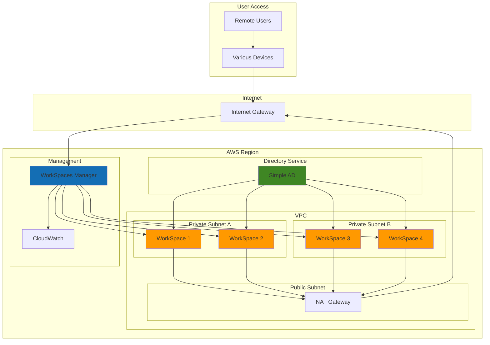

# Virtual Desktop Infrastructure with WorkSpaces

## Problem

Remote and hybrid work environments require secure, scalable virtual desktop infrastructure that can support diverse workforce needs while maintaining centralized IT management and security controls. Traditional VDI solutions often involve complex hardware procurement, lengthy deployment cycles, and significant upfront capital investment, making it difficult for organizations to quickly adapt to changing workforce requirements or scale resources dynamically.

## Solution

AWS WorkSpaces provides a fully managed, cloud-based virtual desktop service that eliminates the complexity of traditional VDI deployments. By integrating WorkSpaces with AWS Directory Service and VPC networking, organizations can rapidly deploy secure, persistent virtual desktops that users can access from any device, anywhere, while maintaining centralized user management and security policies.

## Architecture Diagram



## Prerequisites

1. AWS account with WorkSpaces, Directory Service, VPC, and EC2 permissions
2. AWS CLI v2 installed and configured (or AWS CloudShell)
3. Basic understanding of VPC networking and Active Directory concepts
4. Knowledge of Windows desktop administration and user management
5. Estimated cost: $25-50/month per WorkSpace (depends on bundle type and usage)

> **Note**: WorkSpaces pricing varies by bundle type and billing model (hourly vs monthly). Simple AD is provided free when used with WorkSpaces.

## Preparation

```bash
# Set environment variables
export AWS_REGION=$(aws configure get region)
export AWS_ACCOUNT_ID=$(aws sts get-caller-identity \
    --query Account --output text)

# Generate unique identifiers for resources
RANDOM_SUFFIX=$(aws secretsmanager get-random-password \
    --exclude-punctuation --exclude-uppercase \
    --password-length 6 --require-each-included-type \
    --output text --query RandomPassword)

export VPC_NAME="workspaces-vpc-${RANDOM_SUFFIX}"
export DIRECTORY_NAME="workspaces-dir-${RANDOM_SUFFIX}"
export WORKSPACE_USERNAME="testuser${RANDOM_SUFFIX}"

# Verify WorkSpaces is available in the region
aws workspaces describe-workspace-directories \
    --region $AWS_REGION > /dev/null 2>&1

if [ $? -ne 0 ]; then
    echo "WorkSpaces is not available in region $AWS_REGION"
    exit 1
fi

echo "✅ Environment prepared for WorkSpaces deployment"
```

## Steps

1. **Create VPC with subnets for WorkSpaces**:

   AWS WorkSpaces requires a secure, isolated network environment to operate effectively. A VPC provides this foundation by creating a virtual network that's logically separated from other networks in the AWS cloud. This network isolation is critical for enterprise security as it enables you to control traffic flow, implement security groups, and ensure that virtual desktops can only communicate with authorized resources. The VPC serves as the security perimeter for your entire WorkSpaces deployment.

   ```bash
   # Create VPC
   VPC_ID=$(aws ec2 create-vpc \
       --cidr-block 10.0.0.0/16 \
       --tag-specifications "ResourceType=vpc,Tags=[{Key=Name,Value=${VPC_NAME}}]" \
       --query 'Vpc.VpcId' --output text)
   
   # Enable DNS hostnames and resolution
   aws ec2 modify-vpc-attribute \
       --vpc-id $VPC_ID \
       --enable-dns-hostnames
   
   aws ec2 modify-vpc-attribute \
       --vpc-id $VPC_ID \
       --enable-dns-support
   
   echo "✅ Created VPC: $VPC_ID"
   ```

   The VPC is now established with DNS resolution enabled, which is essential for WorkSpaces to resolve internal service names and communicate with AWS Directory Service. This foundational step enables all subsequent networking components and provides the secure environment required for virtual desktop deployments.

2. **Create public and private subnets**:

   Subnets divide your VPC into smaller network segments across multiple Availability Zones, providing both high availability and security isolation. WorkSpaces requires private subnets to maintain security while the public subnet hosts the NAT Gateway for outbound internet access. This multi-subnet architecture ensures that even if one Availability Zone experiences issues, WorkSpaces in other zones remain operational, maintaining business continuity for remote workers.

   ```bash
   # Get available Availability Zones
   AZ_1=$(aws ec2 describe-availability-zones \
       --query 'AvailabilityZones[0].ZoneName' --output text)
   AZ_2=$(aws ec2 describe-availability-zones \
       --query 'AvailabilityZones[1].ZoneName' --output text)
   
   # Create public subnet for NAT Gateway
   PUBLIC_SUBNET_ID=$(aws ec2 create-subnet \
       --vpc-id $VPC_ID \
       --cidr-block 10.0.1.0/24 \
       --availability-zone $AZ_1 \
       --tag-specifications "ResourceType=subnet,Tags=[{Key=Name,Value=${VPC_NAME}-public}]" \
       --query 'Subnet.SubnetId' --output text)
   
   # Create private subnets for WorkSpaces
   PRIVATE_SUBNET_1_ID=$(aws ec2 create-subnet \
       --vpc-id $VPC_ID \
       --cidr-block 10.0.2.0/24 \
       --availability-zone $AZ_1 \
       --tag-specifications "ResourceType=subnet,Tags=[{Key=Name,Value=${VPC_NAME}-private-1}]" \
       --query 'Subnet.SubnetId' --output text)
   
   PRIVATE_SUBNET_2_ID=$(aws ec2 create-subnet \
       --vpc-id $VPC_ID \
       --cidr-block 10.0.3.0/24 \
       --availability-zone $AZ_2 \
       --tag-specifications "ResourceType=subnet,Tags=[{Key=Name,Value=${VPC_NAME}-private-2}]" \
       --query 'Subnet.SubnetId' --output text)
   
   echo "✅ Created subnets: Public=$PUBLIC_SUBNET_ID, Private1=$PRIVATE_SUBNET_1_ID, Private2=$PRIVATE_SUBNET_2_ID"
   ```

   The subnet architecture is now in place with proper Availability Zone distribution. This configuration enables WorkSpaces to be deployed across multiple AZs for high availability while maintaining security through private subnet isolation. The separation of public and private subnets follows AWS security best practices by keeping virtual desktops in private networks.

3. **Set up internet gateway and NAT gateway**:

   Internet connectivity for WorkSpaces requires careful configuration to maintain security while enabling necessary external access. The Internet Gateway provides a connection point to the internet, while the NAT Gateway allows WorkSpaces in private subnets to access the internet for software updates, web browsing, and cloud services without exposing them to inbound internet traffic. This architecture pattern is essential for enterprise security as it implements a unidirectional internet access model.

   ```bash
   # Create and attach Internet Gateway
   IGW_ID=$(aws ec2 create-internet-gateway \
       --tag-specifications "ResourceType=internet-gateway,Tags=[{Key=Name,Value=${VPC_NAME}-igw}]" \
       --query 'InternetGateway.InternetGatewayId' --output text)
   
   aws ec2 attach-internet-gateway \
       --internet-gateway-id $IGW_ID \
       --vpc-id $VPC_ID
   
   # Allocate Elastic IP for NAT Gateway
   EIP_ALLOCATION_ID=$(aws ec2 allocate-address \
       --domain vpc \
       --tag-specifications "ResourceType=elastic-ip,Tags=[{Key=Name,Value=${VPC_NAME}-nat-eip}]" \
       --query 'AllocationId' --output text)
   
   # Create NAT Gateway
   NAT_GW_ID=$(aws ec2 create-nat-gateway \
       --subnet-id $PUBLIC_SUBNET_ID \
       --allocation-id $EIP_ALLOCATION_ID \
       --tag-specifications "ResourceType=nat-gateway,Tags=[{Key=Name,Value=${VPC_NAME}-nat}]" \
       --query 'NatGateway.NatGatewayId' --output text)
   
   # Wait for NAT Gateway to be available
   aws ec2 wait nat-gateway-available --nat-gateway-ids $NAT_GW_ID
   
   echo "✅ Created networking components: IGW=$IGW_ID, NAT=$NAT_GW_ID"
   ```

   The internet connectivity infrastructure is now operational, providing secure outbound access for WorkSpaces. This configuration ensures that virtual desktops can reach external resources like software repositories and web services while maintaining the security posture required for enterprise environments. The NAT Gateway provides high availability and managed scaling for internet access.

4. **Configure route tables**:

   Route tables define how network traffic flows within your VPC and to external destinations. Proper routing configuration is crucial for WorkSpaces functionality as it determines how virtual desktops communicate with AWS services, the internet, and each other. The routing design implements a hub-and-spoke pattern where private subnets route through the NAT Gateway for internet access while maintaining internal VPC connectivity for AWS service communication.

   ```bash
   # Create route table for public subnet
   PUBLIC_RT_ID=$(aws ec2 create-route-table \
       --vpc-id $VPC_ID \
       --tag-specifications "ResourceType=route-table,Tags=[{Key=Name,Value=${VPC_NAME}-public-rt}]" \
       --query 'RouteTable.RouteTableId' --output text)
   
   # Create route table for private subnets
   PRIVATE_RT_ID=$(aws ec2 create-route-table \
       --vpc-id $VPC_ID \
       --tag-specifications "ResourceType=route-table,Tags=[{Key=Name,Value=${VPC_NAME}-private-rt}]" \
       --query 'RouteTable.RouteTableId' --output text)
   
   # Add routes
   aws ec2 create-route \
       --route-table-id $PUBLIC_RT_ID \
       --destination-cidr-block 0.0.0.0/0 \
       --gateway-id $IGW_ID
   
   aws ec2 create-route \
       --route-table-id $PRIVATE_RT_ID \
       --destination-cidr-block 0.0.0.0/0 \
       --nat-gateway-id $NAT_GW_ID
   
   # Associate subnets with route tables
   aws ec2 associate-route-table \
       --subnet-id $PUBLIC_SUBNET_ID \
       --route-table-id $PUBLIC_RT_ID
   
   aws ec2 associate-route-table \
       --subnet-id $PRIVATE_SUBNET_1_ID \
       --route-table-id $PRIVATE_RT_ID
   
   aws ec2 associate-route-table \
       --subnet-id $PRIVATE_SUBNET_2_ID \
       --route-table-id $PRIVATE_RT_ID
   
   echo "✅ Configured routing for VPC"
   ```

   The routing configuration is now complete, establishing secure communication paths for all network traffic. This setup ensures that WorkSpaces can reach AWS services through the VPC's internal routing while accessing external internet resources through the controlled NAT Gateway path, maintaining the security and performance requirements for enterprise virtual desktop infrastructure.

5. **Create Simple AD directory**:

   AWS Directory Service provides the identity and authentication foundation for WorkSpaces, enabling centralized user management and single sign-on capabilities. Simple AD is a Microsoft Active Directory-compatible directory service that's fully managed by AWS, eliminating the operational overhead of maintaining directory infrastructure. This directory service integrates seamlessly with WorkSpaces to provide user authentication, group policies, and centralized management of virtual desktop access.

   ```bash
   # Create Simple AD directory
   DIRECTORY_ID=$(aws ds create-directory \
       --name "${DIRECTORY_NAME}.local" \
       --password "TempPassword123!" \
       --description "WorkSpaces Simple AD Directory" \
       --size Small \
       --vpc-settings "VpcId=${VPC_ID},SubnetIds=${PRIVATE_SUBNET_1_ID},${PRIVATE_SUBNET_2_ID}" \
       --query 'DirectoryId' --output text)
   
   # Wait for directory to be created
   echo "Creating directory... this may take 10-15 minutes"
   aws ds wait directory-available --directory-ids $DIRECTORY_ID
   
   echo "✅ Created Simple AD directory: $DIRECTORY_ID"
   ```

   The Simple AD directory is now active and ready to authenticate WorkSpaces users. This directory provides the authentication backbone for your virtual desktop environment, enabling features like domain join, group policies, and centralized user management. The directory spans multiple Availability Zones for high availability and integrates with AWS security services for comprehensive identity management.

> **Warning**: The temporary password used here should be changed immediately in production environments. Consider integrating with AWS Secrets Manager for secure password management.

6. **Register directory with WorkSpaces**:

   Registering the directory with WorkSpaces establishes the connection between your identity infrastructure and the virtual desktop service. This registration process configures WorkSpaces to use your Simple AD for user authentication and enables features like WorkDocs integration and self-service capabilities. The registration also sets up the necessary IAM roles and permissions for WorkSpaces to manage virtual desktops on behalf of directory users.

   ```bash
   # Register directory for WorkSpaces
   aws workspaces register-workspace-directory \
       --directory-id $DIRECTORY_ID \
       --subnet-ids $PRIVATE_SUBNET_1_ID $PRIVATE_SUBNET_2_ID \
       --enable-work-docs \
       --enable-self-service
   
   # Wait for registration to complete
   sleep 30
   
   # Verify registration
   aws workspaces describe-workspace-directories \
       --directory-ids $DIRECTORY_ID \
       --query 'Directories[0].State' --output text
   
   echo "✅ Registered directory with WorkSpaces"
   ```

   The directory registration is complete, establishing the integration between Simple AD and WorkSpaces. This enables the creation of virtual desktops for directory users and activates features like WorkDocs for file sharing and self-service portal for users to manage their own WorkSpaces settings. The registration process also configures the necessary security policies and access controls.

7. **Create directory user for WorkSpace**:

   User management in Simple AD requires careful consideration of authentication and access control requirements. While Simple AD provides Microsoft Active Directory compatibility, user creation in a managed directory service follows AWS-specific patterns. For production deployments, organizations typically integrate with existing identity providers or use AWS Single Sign-On for federated access management.

   ```bash
   # Get directory IP addresses for user creation
   DIRECTORY_IPS=$(aws ds describe-directories \
       --directory-ids $DIRECTORY_ID \
       --query 'DirectoryDescriptions[0].DnsIpAddrs' --output text)
   
   # Create user in Simple AD (using PowerShell commands via Systems Manager)
   # Note: This requires additional setup. For demo purposes, we'll use a different approach
   
   # Create WorkSpace user through WorkSpaces service
   # This will be done in the next step when creating the WorkSpace
   
   echo "✅ Prepared for user creation"
   ```

   The directory infrastructure is prepared for user management. In production environments, user creation would typically be handled through directory management tools or automated provisioning systems integrated with HR systems. The next step will demonstrate WorkSpace creation with a user account.

8. **Create WorkSpace for user**:

   AWS WorkSpaces offers various bundle configurations optimized for different use cases, from basic productivity tasks to graphics-intensive applications. Bundle selection impacts both performance and cost, making it important to match bundle types with user requirements. The WorkSpace creation process provisions a complete virtual desktop environment including operating system, applications, and user profile storage, all managed by AWS infrastructure.

   ```bash
   # Get available WorkSpace bundles
   BUNDLE_ID=$(aws workspaces describe-workspace-bundles \
       --query 'Bundles[?contains(Name, `Standard`) && contains(Name, `Windows`)].BundleId | [0]' \
       --output text)
   
   # Create WorkSpace
   aws workspaces create-workspaces \
       --workspaces DirectoryId=$DIRECTORY_ID,UserName=$WORKSPACE_USERNAME,BundleId=$BUNDLE_ID,UserVolumeEncryptionEnabled=true,RootVolumeEncryptionEnabled=true,WorkspaceProperties='{RunningMode=AUTO_STOP,RunningModeAutoStopTimeoutInMinutes=60,RootVolumeSizeGib=80,UserVolumeSizeGib=50,ComputeTypeName=STANDARD}'
   
   # Wait for WorkSpace to be available
   echo "Creating WorkSpace... this may take 20-30 minutes"
   
   # Get WorkSpace ID
   WORKSPACE_ID=$(aws workspaces describe-workspaces \
       --directory-id $DIRECTORY_ID \
       --query 'Workspaces[0].WorkspaceId' --output text)
   
   echo "✅ Created WorkSpace: $WORKSPACE_ID"
   ```

   The WorkSpace is now provisioning with enterprise-grade security features including encryption at rest for both root and user volumes. The AUTO_STOP configuration optimizes costs by automatically stopping the WorkSpace when not in use, while the Standard bundle provides adequate performance for typical productivity applications. This configuration demonstrates cost-effective virtual desktop deployment with strong security controls.

9. **Configure WorkSpace access and security**:

   Access control for WorkSpaces requires implementing network-level security policies and user access restrictions. IP access control groups provide an additional security layer by restricting WorkSpace access to specific IP ranges, which is particularly important for organizations with compliance requirements or those operating in regulated industries. These controls complement the directory-based authentication to provide defense-in-depth security.

   ```bash
   # Create IP access control group
   IP_GROUP_ID=$(aws workspaces create-ip-group \
       --group-name "${VPC_NAME}-ip-group" \
       --group-desc "IP access control for WorkSpaces" \
       --user-rules "ipRule=0.0.0.0/0,ruleDesc=Allow all IPs" \
       --query 'GroupId' --output text)
   
   # Associate IP group with directory
   aws workspaces associate-ip-groups \
       --directory-id $DIRECTORY_ID \
       --group-ids $IP_GROUP_ID
   
   # Configure WorkSpace properties
   aws workspaces modify-workspace-properties \
       --workspace-id $WORKSPACE_ID \
       --workspace-properties RunningMode=AUTO_STOP,RunningModeAutoStopTimeoutInMinutes=60
   
   echo "✅ Configured WorkSpace security and properties"
   ```

   Security policies are now active, providing network-level access controls and cost optimization through auto-stop functionality. In production environments, IP access control groups would typically be configured with specific IP ranges rather than allowing all IPs, implementing geographic or office-based access restrictions as required by organizational security policies.

> **Tip**: For enhanced security, configure IP access control groups with specific IP ranges that match your organization's office locations or VPN endpoints rather than allowing access from all IPs.

10. **Set up CloudWatch monitoring**:

    Comprehensive monitoring is essential for maintaining WorkSpaces performance and availability in production environments. CloudWatch provides detailed metrics about WorkSpace connectivity, performance, and usage patterns, enabling proactive management and troubleshooting. Monitoring data helps optimize costs, plan capacity, and ensure consistent user experience across the virtual desktop infrastructure.

    ```bash
    # Enable CloudWatch monitoring for WorkSpaces
    aws logs create-log-group \
        --log-group-name /aws/workspaces/${DIRECTORY_ID}
    
    # Create CloudWatch alarm for WorkSpace connection failures
    aws cloudwatch put-metric-alarm \
        --alarm-name "WorkSpaces-Connection-Failures" \
        --alarm-description "Monitor WorkSpace connection failures" \
        --metric-name "ConnectionAttempt" \
        --namespace "AWS/WorkSpaces" \
        --statistic Sum \
        --period 300 \
        --threshold 5 \
        --comparison-operator GreaterThanThreshold \
        --evaluation-periods 2 \
        --alarm-actions "arn:aws:sns:${AWS_REGION}:${AWS_ACCOUNT_ID}:workspaces-alerts"
    
    echo "✅ Configured CloudWatch monitoring"
    ```

    Monitoring infrastructure is now operational, providing visibility into WorkSpace performance and availability. The connection failure alarm enables proactive response to connectivity issues, while the log group captures detailed operational data for troubleshooting and optimization. This monitoring foundation supports enterprise-grade operations and SLA management.

## Validation & Testing

1. **Verify WorkSpace status**:

   ```bash
   # Check WorkSpace status
   aws workspaces describe-workspaces \
       --directory-id $DIRECTORY_ID \
       --query 'Workspaces[0].{State:State,IpAddress:IpAddress,ComputerName:ComputerName}'
   ```

   Expected output: WorkSpace should be in "AVAILABLE" state with an IP address assigned.

2. **Test directory connectivity**:

   ```bash
   # Verify directory is active
   aws ds describe-directories \
       --directory-ids $DIRECTORY_ID \
       --query 'DirectoryDescriptions[0].{Stage:Stage,DnsIpAddrs:DnsIpAddrs}'
   ```

   Expected output: Directory should be in "Active" stage with DNS IP addresses.

3. **Validate network configuration**:

   ```bash
   # Check VPC configuration
   aws ec2 describe-vpcs --vpc-ids $VPC_ID \
       --query 'Vpcs[0].{State:State,CidrBlock:CidrBlock}'
   
   # Check subnet configuration
   aws ec2 describe-subnets \
       --subnet-ids $PRIVATE_SUBNET_1_ID $PRIVATE_SUBNET_2_ID \
       --query 'Subnets[].{SubnetId:SubnetId,AvailabilityZone:AvailabilityZone,State:State}'
   ```

4. **Test WorkSpace bundle and image**:

   ```bash
   # Verify bundle information
   aws workspaces describe-workspace-bundles \
       --bundle-ids $BUNDLE_ID \
       --query 'Bundles[0].{Name:Name,ComputeType:ComputeType,Storage:Storage}'
   ```

## Cleanup

1. **Terminate WorkSpaces**:

   ```bash
   # Terminate all WorkSpaces in the directory
   aws workspaces terminate-workspaces \
       --terminate-workspace-requests WorkspaceId=$WORKSPACE_ID
   
   # Wait for termination to complete
   echo "Terminating WorkSpaces... this may take 10-15 minutes"
   aws workspaces describe-workspaces \
       --workspace-ids $WORKSPACE_ID \
       --query 'Workspaces[0].State' --output text
   
   echo "✅ Terminated WorkSpaces"
   ```

2. **Deregister directory from WorkSpaces**:

   ```bash
   # Deregister directory
   aws workspaces deregister-workspace-directory \
       --directory-id $DIRECTORY_ID
   
   echo "✅ Deregistered directory from WorkSpaces"
   ```

3. **Delete IP access control group**:

   ```bash
   # Delete IP group
   aws workspaces delete-ip-group \
       --group-id $IP_GROUP_ID
   
   echo "✅ Deleted IP access control group"
   ```

4. **Delete Simple AD directory**:

   ```bash
   # Delete directory
   aws ds delete-directory \
       --directory-id $DIRECTORY_ID
   
   echo "✅ Deleted Simple AD directory"
   ```

5. **Remove networking components**:

   ```bash
   # Delete NAT Gateway
   aws ec2 delete-nat-gateway \
       --nat-gateway-id $NAT_GW_ID
   
   # Wait for NAT Gateway deletion
   aws ec2 wait nat-gateway-deleted --nat-gateway-ids $NAT_GW_ID
   
   # Release Elastic IP
   aws ec2 release-address \
       --allocation-id $EIP_ALLOCATION_ID
   
   # Delete route tables
   aws ec2 delete-route-table \
       --route-table-id $PUBLIC_RT_ID
   
   aws ec2 delete-route-table \
       --route-table-id $PRIVATE_RT_ID
   
   echo "✅ Removed networking components"
   ```

6. **Delete VPC and associated resources**:

   ```bash
   # Detach and delete Internet Gateway
   aws ec2 detach-internet-gateway \
       --internet-gateway-id $IGW_ID \
       --vpc-id $VPC_ID
   
   aws ec2 delete-internet-gateway \
       --internet-gateway-id $IGW_ID
   
   # Delete subnets
   aws ec2 delete-subnet --subnet-id $PUBLIC_SUBNET_ID
   aws ec2 delete-subnet --subnet-id $PRIVATE_SUBNET_1_ID
   aws ec2 delete-subnet --subnet-id $PRIVATE_SUBNET_2_ID
   
   # Delete VPC
   aws ec2 delete-vpc --vpc-id $VPC_ID
   
   # Delete CloudWatch resources
   aws logs delete-log-group \
       --log-group-name /aws/workspaces/${DIRECTORY_ID}
   
   aws cloudwatch delete-alarms \
       --alarm-names "WorkSpaces-Connection-Failures"
   
   echo "✅ Cleaned up all resources"
   ```

## Discussion

AWS WorkSpaces provides a powerful solution for organizations seeking to implement virtual desktop infrastructure without the complexity and cost of traditional VDI deployments. The integration with AWS Directory Service enables centralized user management and authentication, while VPC networking ensures secure, isolated environments for virtual desktops.

The architecture demonstrated in this recipe leverages Simple AD for user management, which is suitable for organizations without existing on-premises Active Directory infrastructure. For enterprises with existing AD environments, AD Connector or AWS Managed Microsoft AD can provide seamless integration with existing identity systems. The use of private subnets with NAT Gateway ensures that WorkSpaces have internet access for software updates and web browsing while maintaining network security.

WorkSpaces offers multiple bundle types optimized for different use cases, from basic productivity tasks to graphics-intensive applications. The pricing model supports both monthly and hourly billing, allowing organizations to optimize costs based on usage patterns. Auto-stop functionality further reduces costs by automatically stopping WorkSpaces when not in use, which is particularly valuable for part-time or seasonal workers.

The solution scales elastically, allowing organizations to quickly provision additional WorkSpaces as needed without hardware procurement delays. Integration with AWS services like CloudWatch enables comprehensive monitoring and alerting, while AWS Systems Manager can be used for patch management and configuration compliance across the WorkSpace fleet.

For more information about WorkSpaces best practices, see the [AWS WorkSpaces Administration Guide](https://docs.aws.amazon.com/workspaces/latest/adminguide/amazon-workspaces.html) and [Best Practices for Deploying Amazon WorkSpaces](https://docs.aws.amazon.com/whitepapers/latest/best-practices-deploying-amazon-workspaces/best-practices-deploying-amazon-workspaces.html).

## Challenge

Extend this solution by implementing these enhancements:

1. **Multi-Region Disaster Recovery**: Set up WorkSpaces in a secondary AWS region with directory synchronization to provide business continuity in case of regional failures.

2. **Advanced Security Integration**: Implement multi-factor authentication using AWS MFA devices and integrate with AWS Single Sign-On for federated access management.

3. **Custom Image Management**: Create custom WorkSpace images with pre-installed applications and configurations, then implement an automated image update pipeline using AWS Systems Manager.

4. **Performance Optimization**: Implement CloudWatch dashboards for WorkSpaces performance monitoring and create Lambda functions for automated scaling based on usage patterns and performance metrics.

5. **Cost Optimization Automation**: Build a cost optimization system that automatically converts WorkSpaces between hourly and monthly billing models based on usage patterns, and implements automated start/stop schedules for development environments.

## Infrastructure Code

*Infrastructure code will be generated after recipe approval.*