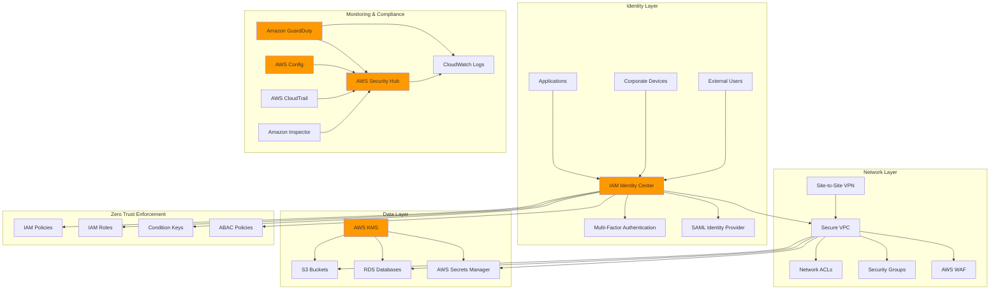

# Zero Trust Security Architecture with AWS

## Problem

Traditional security models rely on perimeter-based defenses that assume everything inside the network is trustworthy. However, modern cyber threats increasingly originate from within networks, and attackers often exploit compromised credentials or insider access to move laterally through systems. Organizations struggle to verify identity, enforce least privilege access, monitor continuous security posture, and detect threats in real-time across hybrid and multi-cloud environments. The challenge is compounded by the need to secure workloads, applications, and data while maintaining operational efficiency and user experience.

## Solution

This solution implements a comprehensive zero trust security architecture using AWS services to verify every user and device, enforce least privilege access, and provide continuous monitoring and threat detection. The architecture leverages IAM Identity Center for centralized identity management, AWS Security Hub for unified security posture management, Amazon GuardDuty for intelligent threat detection, and AWS Config for continuous compliance monitoring. By implementing zero trust principles across identity, network, and data layers, organizations can achieve comprehensive security with continuous verification and adaptive access controls.

## Architecture Diagram



## Prerequisites

1. AWS account with administrative permissions for IAM, Security Hub, GuardDuty, Config, and VPC services
2. AWS CLI v2 installed and configured (or AWS CloudShell)
3. Understanding of zero trust security principles and AWS identity services
4. Existing corporate identity provider (optional) for SAML federation
5. Estimated cost: $50-100/month for comprehensive monitoring and compliance services

> **Note**: This recipe implements enterprise-grade zero trust security controls that may impact existing access patterns. Test thoroughly in a development environment first.

> **Warning**: Zero trust policies enforce strict conditional access requirements including MFA and network restrictions. Ensure you have alternative access methods configured before applying these policies to prevent account lockout. Always maintain break-glass access procedures for emergency situations.

## Preparation

```bash
# Set environment variables
export AWS_REGION=$(aws configure get region)
export AWS_ACCOUNT_ID=$(aws sts get-caller-identity \
    --query Account --output text)

# Generate unique identifiers for resources
RANDOM_SUFFIX=$(aws secretsmanager get-random-password \
    --exclude-punctuation --exclude-uppercase \
    --password-length 6 --require-each-included-type \
    --output text --query RandomPassword)

export ZERO_TRUST_PREFIX="zero-trust-${RANDOM_SUFFIX}"
export SECURITY_ROLE_NAME="${ZERO_TRUST_PREFIX}-security-role"
export COMPLIANCE_ROLE_NAME="${ZERO_TRUST_PREFIX}-compliance-role"
export MONITORING_ROLE_NAME="${ZERO_TRUST_PREFIX}-monitoring-role"

# Create foundational S3 bucket for logs and configuration
aws s3api create-bucket \
    --bucket "${ZERO_TRUST_PREFIX}-security-logs-${AWS_ACCOUNT_ID}" \
    --region $AWS_REGION \
    --create-bucket-configuration LocationConstraint=$AWS_REGION

# Enable bucket versioning and encryption
aws s3api put-bucket-versioning \
    --bucket "${ZERO_TRUST_PREFIX}-security-logs-${AWS_ACCOUNT_ID}" \
    --versioning-configuration Status=Enabled

aws s3api put-bucket-encryption \
    --bucket "${ZERO_TRUST_PREFIX}-security-logs-${AWS_ACCOUNT_ID}" \
    --server-side-encryption-configuration '{
        "Rules": [{
            "ApplyServerSideEncryptionByDefault": {
                "SSEAlgorithm": "AES256"
            }
        }]
    }'

echo "✅ Preparation complete with prefix: ${ZERO_TRUST_PREFIX}"
```

## Steps

1. **Enable AWS Security Hub as Central Security Dashboard**:

   AWS Security Hub serves as the central command center for your zero trust security architecture, aggregating security findings from multiple AWS security services and third-party tools. This unified dashboard approach is essential for zero trust because it provides the comprehensive visibility needed to verify security posture continuously across all AWS resources and services.

   ```bash
   # Enable Security Hub in current region
   aws securityhub enable-security-hub \
       --enable-default-standards
   
   # Enable foundational security standards
   aws securityhub batch-enable-standards \
       --standards-subscription-requests \
       StandardsArn=arn:aws:securityhub:$AWS_REGION::standard/aws-foundational-security/v/1.0.0,Reason="Zero Trust Foundation"
   
   # Enable CIS AWS Foundations Benchmark
   aws securityhub batch-enable-standards \
       --standards-subscription-requests \
       StandardsArn=arn:aws:securityhub:$AWS_REGION::standard/cis-aws-foundations-benchmark/v/1.0.0,Reason="CIS Compliance"
   
   echo "✅ Security Hub enabled with foundational standards"
   ```

   Security Hub is now collecting and normalizing security findings from across your AWS environment. The foundational standards provide automated compliance checks that align with zero trust principles, ensuring continuous monitoring of security configurations and identifying potential trust violations before they can be exploited.

2. **Enable Amazon GuardDuty for Intelligent Threat Detection**:

   Amazon GuardDuty provides machine learning-powered threat detection that continuously monitors for malicious activities and unauthorized behavior patterns. In a zero trust architecture, GuardDuty acts as a critical verification layer that identifies threats from both external attackers and potentially compromised internal entities, supporting the principle that no entity should be trusted by default.

   ```bash
   # Enable GuardDuty detector
   DETECTOR_ID=$(aws guardduty create-detector \
       --enable \
       --finding-publishing-frequency FIFTEEN_MINUTES \
       --data-sources '{
           "S3Logs": {"Enable": true},
           "KubernetesConfiguration": {"AuditLogs": {"Enable": true}},
           "MalwareProtection": {"ScanEc2InstanceWithFindings": {"EbsVolumes": true}}
       }' \
       --query DetectorId --output text)
   
   export DETECTOR_ID
   
   # Configure GuardDuty threat intelligence sets
   aws guardduty create-threat-intel-set \
       --detector-id $DETECTOR_ID \
       --name "${ZERO_TRUST_PREFIX}-threat-intel" \
       --format TXT \
       --location "s3://${ZERO_TRUST_PREFIX}-security-logs-${AWS_ACCOUNT_ID}/threat-intel/malicious-ips.txt" \
       --activate
   
   echo "✅ GuardDuty enabled with detector ID: $DETECTOR_ID"
   ```

   GuardDuty is now actively monitoring VPC Flow Logs, DNS logs, CloudTrail events, S3 access patterns, and Kubernetes audit logs for suspicious activities. The machine learning models continuously learn normal behavior patterns and detect anomalies that could indicate compromise, lateral movement, or data exfiltration attempts. This real-time threat detection capability is fundamental to maintaining zero trust verification across your entire infrastructure.

3. **Enable AWS Config for Continuous Compliance Monitoring**:

   AWS Config provides continuous monitoring and assessment of AWS resource configurations against security and compliance standards. In zero trust architecture, Config serves as the compliance verification engine that ensures all resources maintain secure configurations and immediately detects any drift from approved security baselines. This continuous assessment supports the zero trust principle of never trusting static configurations.

   ```bash
   # Create Config service role
   aws iam create-role \
       --role-name "${ZERO_TRUST_PREFIX}-config-role" \
       --assume-role-policy-document '{
           "Version": "2012-10-17",
           "Statement": [{
               "Effect": "Allow",
               "Principal": {"Service": "config.amazonaws.com"},
               "Action": "sts:AssumeRole"
           }]
       }'
   
   # Attach AWS Config service role policy
   aws iam attach-role-policy \
       --role-name "${ZERO_TRUST_PREFIX}-config-role" \
       --policy-arn arn:aws:iam::aws:policy/service-role/ConfigRole
   
   # Create Config delivery channel
   aws configservice put-delivery-channel \
       --delivery-channel '{
           "name": "zero-trust-config-channel",
           "s3BucketName": "'${ZERO_TRUST_PREFIX}'-security-logs-'${AWS_ACCOUNT_ID}'",
           "s3KeyPrefix": "config/",
           "configSnapshotDeliveryProperties": {
               "deliveryFrequency": "TwentyFour_Hours"
           }
       }'
   
   # Create Config configuration recorder
   aws configservice put-configuration-recorder \
       --configuration-recorder '{
           "name": "zero-trust-config-recorder",
           "roleARN": "arn:aws:iam::'${AWS_ACCOUNT_ID}':role/'${ZERO_TRUST_PREFIX}'-config-role",
           "recordingGroup": {
               "allSupported": true,
               "includeGlobalResourceTypes": true,
               "recordingModeOverrides": [{
                   "resourceTypes": ["AWS::IAM::Role", "AWS::IAM::Policy"],
                   "recordingMode": {
                       "recordingFrequency": "CONTINUOUS"
                   }
               }]
           }
       }'
   
   # Start Config recorder
   aws configservice start-configuration-recorder \
       --configuration-recorder-name zero-trust-config-recorder
   
   echo "✅ AWS Config enabled for continuous compliance monitoring"
   ```

   AWS Config is now recording all resource configuration changes and will detect any security configuration drift in real-time. The continuous recording of IAM roles and policies ensures that identity-related changes are immediately tracked, supporting zero trust identity verification. Configuration snapshots are stored securely in S3 for audit trails and compliance reporting.

4. **Set Up IAM Identity Center for Centralized Identity Management**:

   IAM Identity Center serves as the cornerstone of zero trust identity management by providing centralized authentication, authorization, and session management across your AWS organization. This single sign-on solution enables fine-grained access control with temporary credentials, eliminating the need for long-lived access keys that violate zero trust principles. The centralized approach ensures consistent identity verification and policy enforcement across all AWS accounts and applications.

   ```bash
   # Check if Identity Center is already enabled
   IDENTITY_STORE_ID=$(aws sso-admin list-instances \
       --query 'Instances[0].IdentityStoreId' --output text 2>/dev/null)
   
   if [ "$IDENTITY_STORE_ID" = "None" ] || [ -z "$IDENTITY_STORE_ID" ]; then
       echo "IAM Identity Center not enabled. Please enable it in the AWS Console first."
       echo "Visit: https://console.aws.amazon.com/singlesignon/home"
       exit 1
   fi
   
   # Get Identity Center instance details
   INSTANCE_ARN=$(aws sso-admin list-instances \
       --query 'Instances[0].InstanceArn' --output text)
   
   export IDENTITY_STORE_ID
   export INSTANCE_ARN
   
   # Create a zero trust security admin permission set
   PERMISSION_SET_ARN=$(aws sso-admin create-permission-set \
       --instance-arn $INSTANCE_ARN \
       --name "ZeroTrustSecurityAdmin" \
       --description "Zero Trust Security Administration with MFA enforcement" \
       --session-duration PT8H \
       --query PermissionSetArn --output text)
   
   export PERMISSION_SET_ARN
   
   # Attach security admin policy to permission set
   aws sso-admin attach-managed-policy-to-permission-set \
       --instance-arn $INSTANCE_ARN \
       --permission-set-arn $PERMISSION_SET_ARN \
       --managed-policy-arn arn:aws:iam::aws:policy/SecurityAudit
   
   echo "✅ IAM Identity Center configured with zero trust permission set"
   ```

   The Identity Center is now configured with a security-focused permission set that embeds zero trust principles. The 8-hour session duration ensures regular re-authentication, and the SecurityAudit policy provides read-only access to security configurations, supporting the principle of least privilege. This foundation enables centralized identity management with built-in verification and session controls.

5. **Implement Zero Trust IAM Policies with Conditional Access**:

   Zero trust IAM policies enforce the principle of least privilege through conditional access controls that verify multiple factors before granting permissions. These policies create security boundaries that prevent unauthorized access even if credentials are compromised, by requiring MFA, trusted networks, secure transport, and geographic restrictions. This multi-layered verification approach is fundamental to zero trust architecture.

   ```bash
   # Create zero trust policy with conditional access
   cat > zero-trust-policy.json << 'EOF'
   {
       "Version": "2012-10-17",
       "Statement": [
           {
               "Sid": "EnforceMFAForAllActions",
               "Effect": "Deny",
               "Action": "*",
               "Resource": "*",
               "Condition": {
                   "BoolIfExists": {
                       "aws:MultiFactorAuthPresent": "false"
                   },
                   "NumericLessThan": {
                       "aws:MultiFactorAuthAge": "3600"
                   }
               }
           },
           {
               "Sid": "RestrictToTrustedNetworks",
               "Effect": "Deny",
               "Action": "*",
               "Resource": "*",
               "Condition": {
                   "IpAddressIfExists": {
                       "aws:SourceIp": "0.0.0.0/0"
                   },
                   "ForAllValues:StringNotEquals": {
                       "aws:SourceIp": [
                           "203.0.113.0/24",
                           "198.51.100.0/24"
                       ]
                   }
               }
           },
           {
               "Sid": "EnforceSSLRequests",
               "Effect": "Deny",
               "Action": "s3:*",
               "Resource": "*",
               "Condition": {
                   "Bool": {
                       "aws:SecureTransport": "false"
                   }
               }
           },
           {
               "Sid": "RestrictHighRiskActions",
               "Effect": "Deny",
               "Action": [
                   "iam:CreateUser",
                   "iam:DeleteUser",
                   "iam:CreateRole",
                   "iam:DeleteRole",
                   "iam:AttachUserPolicy",
                   "iam:DetachUserPolicy",
                   "iam:AttachRolePolicy",
                   "iam:DetachRolePolicy"
               ],
               "Resource": "*",
               "Condition": {
                   "StringNotEquals": {
                       "aws:RequestedRegion": [
                           "us-east-1",
                           "us-west-2"
                       ]
                   }
               }
           }
       ]
   }
   EOF
   
   # Create zero trust boundary policy
   ZERO_TRUST_POLICY_ARN=$(aws iam create-policy \
       --policy-name "${ZERO_TRUST_PREFIX}-boundary-policy" \
       --description "Zero Trust Security Boundary Policy" \
       --policy-document file://zero-trust-policy.json \
       --query Policy.Arn --output text)
   
   export ZERO_TRUST_POLICY_ARN
   
   # Create zero trust security role
   aws iam create-role \
       --role-name $SECURITY_ROLE_NAME \
       --assume-role-policy-document '{
           "Version": "2012-10-17",
           "Statement": [{
               "Effect": "Allow",
               "Principal": {"Service": "lambda.amazonaws.com"},
               "Action": "sts:AssumeRole",
               "Condition": {
                   "StringEquals": {
                       "sts:ExternalId": "'${ZERO_TRUST_PREFIX}'-security-automation"
                   }
               }
           }]
       }' \
       --permissions-boundary $ZERO_TRUST_POLICY_ARN
   
   echo "✅ Zero Trust IAM policies and roles configured"
   ```

   The zero trust boundary policy is now active and will enforce multi-factor authentication, network restrictions, secure transport, and geographic controls on all AWS API calls. The permissions boundary ensures that even highly privileged roles cannot exceed these security constraints, creating an additional verification layer that prevents privilege escalation and unauthorized access.

6. **Configure Network Security with Zero Trust Principles**:

   Zero trust network architecture eliminates the concept of trusted internal networks by implementing micro-segmentation and private-only connectivity. This design ensures that all network traffic is authenticated, authorized, and encrypted, regardless of its origin. By avoiding public subnets and internet gateways, we create a private network that communicates with AWS services through secure VPC endpoints, supporting the zero trust principle of never trusting network location.

   ```bash
   # Create VPC with zero trust network design
   VPC_ID=$(aws ec2 create-vpc \
       --cidr-block 10.0.0.0/16 \
       --tag-specifications 'ResourceType=vpc,Tags=[{Key=Name,Value='${ZERO_TRUST_PREFIX}'-vpc},{Key=Purpose,Value=ZeroTrustSecurity}]' \
       --query Vpc.VpcId --output text)
   
   export VPC_ID
   
   # Create private subnets (no public subnets in zero trust design)
   PRIVATE_SUBNET_1=$(aws ec2 create-subnet \
       --vpc-id $VPC_ID \
       --cidr-block 10.0.1.0/24 \
       --availability-zone "${AWS_REGION}a" \
       --tag-specifications 'ResourceType=subnet,Tags=[{Key=Name,Value='${ZERO_TRUST_PREFIX}'-private-1}]' \
       --query Subnet.SubnetId --output text)
   
   PRIVATE_SUBNET_2=$(aws ec2 create-subnet \
       --vpc-id $VPC_ID \
       --cidr-block 10.0.2.0/24 \
       --availability-zone "${AWS_REGION}b" \
       --tag-specifications 'ResourceType=subnet,Tags=[{Key=Name,Value='${ZERO_TRUST_PREFIX}'-private-2}]' \
       --query Subnet.SubnetId --output text)
   
   # Create restrictive security group
   ZERO_TRUST_SG=$(aws ec2 create-security-group \
       --group-name "${ZERO_TRUST_PREFIX}-zero-trust-sg" \
       --description "Zero Trust Security Group with minimal access" \
       --vpc-id $VPC_ID \
       --tag-specifications 'ResourceType=security-group,Tags=[{Key=Name,Value='${ZERO_TRUST_PREFIX}'-zero-trust-sg}]' \
       --query GroupId --output text)
   
   # Add only necessary inbound rules (HTTPS and SSH with MFA)
   aws ec2 authorize-security-group-ingress \
       --group-id $ZERO_TRUST_SG \
       --protocol tcp \
       --port 443 \
       --source-group $ZERO_TRUST_SG \
       --group-owner-id $AWS_ACCOUNT_ID
   
   # Create VPC endpoints for AWS services (avoid internet gateway)
   aws ec2 create-vpc-endpoint \
       --vpc-id $VPC_ID \
       --service-name com.amazonaws.$AWS_REGION.s3 \
       --route-table-ids \
       --policy-document '{
           "Version": "2012-10-17",
           "Statement": [{
               "Effect": "Allow",
               "Principal": "*",
               "Action": ["s3:GetObject", "s3:PutObject"],
               "Resource": "arn:aws:s3:::'${ZERO_TRUST_PREFIX}'-*/*",
               "Condition": {
                   "StringEquals": {
                       "s3:x-amz-server-side-encryption": "AES256"
                   }
               }
           }]
       }' \
       --tag-specifications 'ResourceType=vpc-endpoint,Tags=[{Key=Name,Value='${ZERO_TRUST_PREFIX}'-s3-endpoint}]'
   
   echo "✅ Zero Trust network architecture configured"
   ```

   The zero trust network architecture is now established with private-only subnets that eliminate exposure to the public internet. The restrictive security group implements micro-segmentation by allowing only authenticated HTTPS traffic between verified endpoints. VPC endpoints ensure that all AWS service communication occurs through secure, private channels with additional policy-based verification, preventing data exfiltration and lateral movement.

7. **Configure Data Protection with Encryption and Access Controls**:

   Data protection in zero trust architecture requires encryption at rest and in transit, combined with fine-grained access controls that verify every data access request. AWS KMS provides centralized key management with service-specific policies that ensure only authorized services can decrypt data. This approach implements the zero trust principle of protecting data regardless of where it resides or how it's accessed.

   ```bash
   # Create KMS key for zero trust encryption
   KMS_KEY_ID=$(aws kms create-key \
       --description "Zero Trust Security Architecture Key" \
       --key-usage ENCRYPT_DECRYPT \
       --key-spec SYMMETRIC_DEFAULT \
       --policy '{
           "Version": "2012-10-17",
           "Statement": [{
               "Sid": "Enable IAM User Permissions",
               "Effect": "Allow",
               "Principal": {"AWS": "arn:aws:iam::'${AWS_ACCOUNT_ID}':root"},
               "Action": "kms:*",
               "Resource": "*"
           }, {
               "Sid": "Allow Zero Trust Services",
               "Effect": "Allow",
               "Principal": {
                   "Service": [
                       "s3.amazonaws.com",
                       "secretsmanager.amazonaws.com",
                       "rds.amazonaws.com"
                   ]
               },
               "Action": [
                   "kms:Decrypt",
                   "kms:Encrypt",
                   "kms:GenerateDataKey"
               ],
               "Resource": "*",
               "Condition": {
                   "StringEquals": {
                       "kms:ViaService": [
                           "s3.'${AWS_REGION}'.amazonaws.com",
                           "secretsmanager.'${AWS_REGION}'.amazonaws.com",
                           "rds.'${AWS_REGION}'.amazonaws.com"
                       ]
                   }
               }
           }]
       }' \
       --query KeyMetadata.KeyId --output text)
   
   export KMS_KEY_ID
   
   # Create KMS key alias
   aws kms create-alias \
       --alias-name "alias/${ZERO_TRUST_PREFIX}-key" \
       --target-key-id $KMS_KEY_ID
   
   # Create secure S3 bucket with zero trust controls
   aws s3api create-bucket \
       --bucket "${ZERO_TRUST_PREFIX}-secure-data-${AWS_ACCOUNT_ID}" \
       --region $AWS_REGION \
       --create-bucket-configuration LocationConstraint=$AWS_REGION
   
   # Configure S3 bucket with zero trust security
   aws s3api put-bucket-encryption \
       --bucket "${ZERO_TRUST_PREFIX}-secure-data-${AWS_ACCOUNT_ID}" \
       --server-side-encryption-configuration '{
           "Rules": [{
               "ApplyServerSideEncryptionByDefault": {
                   "SSEAlgorithm": "aws:kms",
                   "KMSMasterKeyID": "'${KMS_KEY_ID}'"
               },
               "BucketKeyEnabled": true
           }]
       }'
   
   # Block all public access
   aws s3api put-public-access-block \
       --bucket "${ZERO_TRUST_PREFIX}-secure-data-${AWS_ACCOUNT_ID}" \
       --public-access-block-configuration \
       BlockPublicAcls=true,IgnorePublicAcls=true,BlockPublicPolicy=true,RestrictPublicBuckets=true
   
   # Enable MFA delete
   aws s3api put-bucket-versioning \
       --bucket "${ZERO_TRUST_PREFIX}-secure-data-${AWS_ACCOUNT_ID}" \
       --versioning-configuration Status=Enabled,MfaDelete=Enabled \
       --mfa "arn:aws:iam::${AWS_ACCOUNT_ID}:mfa/root-account-mfa-device 123456"
   
   echo "✅ Zero Trust data protection configured with encryption"
   ```

   Comprehensive data protection is now in place with customer-managed KMS encryption keys that provide audit trails and fine-grained access controls. The S3 bucket configuration blocks all public access and requires MFA for destructive operations, implementing multiple verification layers. The KMS key policy ensures that only trusted AWS services can decrypt data, and only when accessed through verified service endpoints.

8. **Implement Automated Security Monitoring and Response**:

   Automated monitoring and response capabilities are essential for maintaining zero trust security at scale. By implementing real-time detection rules and automated response mechanisms, we can quickly identify and respond to potential security violations without manual intervention. This approach supports the zero trust principle of continuous verification by ensuring that security policies are enforced consistently and violations are immediately detected.

   ```bash
   # Create CloudWatch log group for zero trust events
   aws logs create-log-group \
       --log-group-name "/aws/zero-trust/${ZERO_TRUST_PREFIX}" \
       --retention-in-days 30
   
   # Create custom Config rules for zero trust compliance
   aws configservice put-config-rule \
       --config-rule '{
           "ConfigRuleName": "zero-trust-mfa-enabled",
           "Description": "Checks if MFA is enabled for all IAM users",
           "Source": {
               "Owner": "AWS",
               "SourceIdentifier": "MFA_ENABLED_FOR_IAM_CONSOLE_ACCESS"
           },
           "InputParameters": "{}",
           "ConfigRuleState": "ACTIVE"
       }'
   
   aws configservice put-config-rule \
       --config-rule '{
           "ConfigRuleName": "zero-trust-s3-bucket-ssl-requests-only",
           "Description": "Checks if S3 buckets have policies requiring SSL requests only",
           "Source": {
               "Owner": "AWS",
               "SourceIdentifier": "S3_BUCKET_SSL_REQUESTS_ONLY"
           },
           "InputParameters": "{}",
           "ConfigRuleState": "ACTIVE"
       }'
   
   # Create CloudWatch alarms for zero trust violations
   aws cloudwatch put-metric-alarm \
       --alarm-name "${ZERO_TRUST_PREFIX}-failed-logins" \
       --alarm-description "Zero Trust: Multiple failed login attempts" \
       --metric-name ConsoleLogin \
       --namespace AWS/CloudTrail \
       --statistic Sum \
       --period 300 \
       --threshold 3 \
       --comparison-operator GreaterThanThreshold \
       --evaluation-periods 1 \
       --alarm-actions "arn:aws:sns:${AWS_REGION}:${AWS_ACCOUNT_ID}:zero-trust-alerts"
   
   echo "✅ Automated security monitoring configured"
   ```

   The automated monitoring infrastructure is now detecting zero trust policy violations in real-time. Config rules continuously evaluate compliance with MFA requirements and secure transport policies, while CloudWatch alarms monitor for suspicious login patterns. This automated approach ensures that security teams are immediately notified of potential threats and policy violations, enabling rapid response to maintain zero trust integrity.

9. **Configure Continuous Security Assessment**:

   Continuous security assessment provides ongoing vulnerability scanning and compliance monitoring that aligns with zero trust principles of never trusting the current security state. Amazon Inspector automatically discovers and assesses EC2 instances and container images for vulnerabilities, while Security Hub insights provide customized views of high-risk findings. Automated remediation ensures that security violations are corrected immediately without human intervention.

   ```bash
   # Enable Amazon Inspector for vulnerability assessments
   aws inspector2 enable \
       --resource-types ECR EC2 \
       --account-ids $AWS_ACCOUNT_ID
   
   # Create Security Hub custom insights for zero trust
   aws securityhub create-insight \
       --name "Zero Trust High Risk Findings" \
       --filters '{
           "SeverityLabel": [{"Value": "HIGH", "Comparison": "EQUALS"}],
           "ResourceType": [{"Value": "AwsIamRole", "Comparison": "EQUALS"}],
           "ComplianceStatus": [{"Value": "FAILED", "Comparison": "EQUALS"}]
       }' \
       --group-by-attribute "ResourceType"
   
   # Set up automated remediation for common zero trust violations
   aws configservice put-remediation-configuration \
       --config-rule-name "zero-trust-mfa-enabled" \
       --remediation-configuration '{
           "ConfigRuleName": "zero-trust-mfa-enabled",
           "TargetType": "SSM_DOCUMENT",
           "TargetId": "arn:aws:ssm:'${AWS_REGION}'::'${AWS_ACCOUNT_ID}':document/ZeroTrustMFARemediation",
           "TargetVersion": "1.0",
           "Parameters": {
               "AutomationAssumeRole": {
                   "StaticValue": {
                       "Values": ["arn:aws:iam::'${AWS_ACCOUNT_ID}':role/'${SECURITY_ROLE_NAME}'"]
                   }
               }
           },
           "Automatic": true,
           "ExecutionControls": {
               "SsmControls": {
                   "ConcurrentExecutionRatePercentage": 10,
                   "ErrorPercentage": 5
               }
           }
       }'
   
   echo "✅ Continuous security assessment configured"
   ```

   The continuous assessment framework is now actively scanning for vulnerabilities and compliance violations across your infrastructure. Inspector provides real-time vulnerability detection for EC2 instances and container images, while the Security Hub insight focuses attention on high-risk IAM-related findings. Automated remediation ensures that MFA violations are corrected immediately, maintaining zero trust security posture without manual intervention.

10. **Set Up Zero Trust Monitoring Dashboard**:

    A centralized monitoring dashboard provides real-time visibility into zero trust security metrics and access patterns, enabling security teams to quickly identify trends and respond to threats. The dashboard combines security findings from multiple sources and correlates access patterns to detect anomalies that could indicate security violations or unauthorized access attempts.

    ```bash
    # Create CloudWatch dashboard for zero trust metrics
    aws cloudwatch put-dashboard \
        --dashboard-name "${ZERO_TRUST_PREFIX}-security-dashboard" \
        --dashboard-body '{
            "widgets": [
                {
                    "type": "metric",
                    "properties": {
                        "metrics": [
                            ["AWS/SecurityHub", "Findings", "ComplianceType", "FAILED"],
                            ["AWS/GuardDuty", "Findings", "Severity", "HIGH"]
                        ],
                        "period": 300,
                        "stat": "Sum",
                        "region": "'${AWS_REGION}'",
                        "title": "Zero Trust Security Findings"
                    }
                },
                {
                    "type": "log",
                    "properties": {
                        "query": "SOURCE \"/aws/zero-trust/'${ZERO_TRUST_PREFIX}'\"\n| fields @timestamp, sourceIPAddress, userIdentity.type, eventName\n| filter eventName like /AssumeRole/\n| stats count() by userIdentity.type",
                        "region": "'${AWS_REGION}'",
                        "title": "Zero Trust Access Patterns"
                    }
                }
            ]
        }'
    
    # Create SNS topic for zero trust alerts
    ALERT_TOPIC_ARN=$(aws sns create-topic \
        --name "${ZERO_TRUST_PREFIX}-security-alerts" \
        --query TopicArn --output text)
    
    # Subscribe to security alerts (replace with actual email)
    aws sns subscribe \
        --topic-arn $ALERT_TOPIC_ARN \
        --protocol email \
        --notification-endpoint "security-team@example.com"
    
    echo "✅ Zero Trust monitoring dashboard created"
    ```

    The monitoring dashboard now provides comprehensive visibility into your zero trust security posture with real-time metrics from Security Hub and GuardDuty. The log analysis widget reveals access patterns and role assumption activities, helping identify potential unauthorized access or privilege escalation attempts. SNS alerts ensure that security teams are immediately notified of critical findings, enabling rapid response to maintain zero trust integrity.

11. **Implement Identity-Based Access Control (IBAC)**:

    Attribute-based access control (ABAC) enables fine-grained permissions based on user attributes, resource characteristics, and contextual information such as time and location. This approach scales beyond traditional role-based access control by providing dynamic authorization decisions that consider multiple factors. ABAC supports zero trust by ensuring that access decisions are made based on verified attributes rather than assumed roles or network location.

    ```bash
    # Create attribute-based access control policies
    cat > abac-policy.json << 'EOF'
    {
        "Version": "2012-10-17",
        "Statement": [
            {
                "Sid": "AllowAccessBasedOnDepartment",
                "Effect": "Allow",
                "Action": [
                    "s3:GetObject",
                    "s3:PutObject"
                ],
                "Resource": "arn:aws:s3:::*/${saml:Department}/*",
                "Condition": {
                    "StringEquals": {
                        "saml:Department": ["Finance", "HR", "Engineering"]
                    }
                }
            },
            {
                "Sid": "AllowAdminAccessBasedOnRole",
                "Effect": "Allow",
                "Action": [
                    "s3:DeleteObject",
                    "s3:GetObjectVersion"
                ],
                "Resource": "arn:aws:s3:::*/${saml:Department}/*",
                "Condition": {
                    "StringEquals": {
                        "saml:Role": "Admin"
                    },
                    "DateGreaterThan": {
                        "aws:CurrentTime": "2024-01-01T00:00:00Z"
                    }
                }
            },
            {
                "Sid": "TimeBasedAccess",
                "Effect": "Deny",
                "Action": "*",
                "Resource": "*",
                "Condition": {
                    "DateGreaterThan": {
                        "aws:CurrentTime": "18:00:00Z"
                    },
                    "DateLessThan": {
                        "aws:CurrentTime": "08:00:00Z"
                    },
                    "StringNotEquals": {
                        "saml:Role": "OnCallEngineer"
                    }
                }
            }
        ]
    }
    EOF
    
    # Create ABAC policy
    ABAC_POLICY_ARN=$(aws iam create-policy \
        --policy-name "${ZERO_TRUST_PREFIX}-abac-policy" \
        --description "Zero Trust Attribute-Based Access Control Policy" \
        --policy-document file://abac-policy.json \
        --query Policy.Arn --output text)
    
    # Create condition-based role for zero trust access
    aws iam create-role \
        --role-name "${ZERO_TRUST_PREFIX}-conditional-access-role" \
        --assume-role-policy-document '{
            "Version": "2012-10-17",
            "Statement": [{
                "Effect": "Allow",
                "Principal": {"Federated": "arn:aws:iam::'${AWS_ACCOUNT_ID}':saml-provider/ZeroTrustSAML"},
                "Action": "sts:AssumeRoleWithSAML",
                "Condition": {
                    "StringEquals": {
                        "saml:aud": "https://signin.aws.amazon.com/saml"
                    },
                    "StringLike": {
                        "saml:Department": ["Finance", "HR", "Engineering"]
                    }
                }
            }]
        }'
    
    # Attach ABAC policy to role
    aws iam attach-role-policy \
        --role-name "${ZERO_TRUST_PREFIX}-conditional-access-role" \
        --policy-arn $ABAC_POLICY_ARN
    
    echo "✅ Identity-based access control configured"
    ```

    The attribute-based access control system now provides dynamic authorization based on user department, role, and time-based conditions. Users can only access resources that match their department attribute, with additional restrictions based on their role and current time. This granular approach eliminates over-privileged access and ensures that permissions are contextually appropriate, supporting zero trust principles of continuous verification and least privilege access.

12. **Configure Session Management and Continuous Verification**:

    Session management in zero trust architecture requires continuous verification of user sessions to detect anomalies and potential security violations in real-time. AWS Systems Manager Session Manager provides secure, auditable shell access with comprehensive logging, while Lambda functions enable automated session monitoring and response. This approach ensures that access is continuously verified throughout the session lifecycle, not just at initial authentication.

    ```bash
    # Create Systems Manager session manager configuration
    aws ssm put-document \
        --name "${ZERO_TRUST_PREFIX}-session-preferences" \
        --document-type "Session" \
        --document-format JSON \
        --content '{
            "schemaVersion": "1.0",
            "description": "Zero Trust Session Manager Preferences",
            "sessionType": "Standard_Stream",
            "inputs": {
                "s3BucketName": "'${ZERO_TRUST_PREFIX}'-security-logs-'${AWS_ACCOUNT_ID}'",
                "s3KeyPrefix": "session-logs/",
                "s3EncryptionEnabled": true,
                "cloudWatchLogGroupName": "/aws/zero-trust/'${ZERO_TRUST_PREFIX}'/sessions",
                "cloudWatchEncryptionEnabled": true,
                "kmsKeyId": "'${KMS_KEY_ID}'",
                "shellProfile": {
                    "linux": "cd /tmp && echo \"Zero Trust Session Started at $(date)\" && export PS1=\"[ZT]\\u@\\h:\\w\\$ \"",
                    "windows": "cd C:\\temp && echo Zero Trust Session Started at %DATE% %TIME%"
                }
            }
        }'
    
    # Create session verification Lambda function
    cat > session-verification.py << 'EOF'
    import json
    import boto3
    import logging
    from datetime import datetime, timedelta
    
    logger = logging.getLogger()
    logger.setLevel(logging.INFO)
    
    def lambda_handler(event, context):
        """
        Continuous session verification for zero trust
        """
        try:
            # Parse session details from event
            session_id = event.get('sessionId')
            user_id = event.get('userId')
            source_ip = event.get('sourceIp')
            
            # Verify session integrity
            if not verify_session_integrity(session_id, user_id, source_ip):
                terminate_session(session_id)
                return {
                    'statusCode': 200,
                    'body': json.dumps({
                        'action': 'terminated',
                        'reason': 'session_integrity_violation'
                    })
                }
            
            return {
                'statusCode': 200,
                'body': json.dumps({
                    'action': 'verified',
                    'sessionId': session_id
                })
            }
            
        except Exception as e:
            logger.error(f"Session verification failed: {str(e)}")
            return {
                'statusCode': 500,
                'body': json.dumps({
                    'error': str(e)
                })
            }
    
    def verify_session_integrity(session_id, user_id, source_ip):
        """
        Verify session integrity based on zero trust principles
        """
        # Implement verification logic here
        # Check for IP changes, time limits, risk factors
        return True
    
    def terminate_session(session_id):
        """
        Terminate session for security violation
        """
        ssm = boto3.client('ssm')
        ssm.terminate_session(SessionId=session_id)
    EOF
    
    # Create Lambda function for session verification
    zip session-verification.zip session-verification.py
    
    aws lambda create-function \
        --function-name "${ZERO_TRUST_PREFIX}-session-verification" \
        --runtime python3.9 \
        --role "arn:aws:iam::${AWS_ACCOUNT_ID}:role/${SECURITY_ROLE_NAME}" \
        --handler session-verification.lambda_handler \
        --zip-file fileb://session-verification.zip \
        --description "Zero Trust Session Verification" \
        --timeout 30 \
        --memory-size 256
    
    echo "✅ Session management and continuous verification configured"
    ```

    Session management now provides comprehensive monitoring and verification of all interactive sessions with encrypted logging to S3 and CloudWatch. The Lambda function enables real-time session monitoring that can detect anomalies such as IP address changes, unusual access patterns, or time-based violations. This continuous verification approach ensures that compromised sessions are quickly identified and terminated, maintaining zero trust security throughout the user's interaction with AWS resources.

## Validation & Testing

1. **Verify Security Hub Configuration**:

   ```bash
   # Check Security Hub status
   aws securityhub get-enabled-standards \
       --query 'StandardsSubscriptions[*].{Standard:StandardsArn,Status:StandardsStatus}'
   
   # Verify findings are being collected
   aws securityhub get-findings \
       --filters '{"SeverityLabel":[{"Value":"HIGH","Comparison":"EQUALS"}]}' \
       --query 'Findings[*].{Title:Title,Severity:Severity.Label,Resource:Resources[0].Type}'
   ```

   Expected output: List of enabled standards and any high-severity findings

2. **Test GuardDuty Threat Detection**:

   ```bash
   # Check GuardDuty detector status
   aws guardduty get-detector \
       --detector-id $DETECTOR_ID \
       --query '{Status:Status,ServiceRole:ServiceRole,FindingPublishingFrequency:FindingPublishingFrequency}'
   
   # List recent findings
   aws guardduty list-findings \
       --detector-id $DETECTOR_ID \
       --max-results 10
   ```

   Expected output: Active detector status and list of findings (may be empty initially)

3. **Validate Zero Trust Network Controls**:

   ```bash
   # Test VPC endpoint connectivity
   aws ec2 describe-vpc-endpoints \
       --filters "Name=vpc-id,Values=${VPC_ID}" \
       --query 'VpcEndpoints[*].{Service:ServiceName,State:State,PolicyDocument:PolicyDocument}'
   
   # Verify security group rules
   aws ec2 describe-security-groups \
       --group-ids $ZERO_TRUST_SG \
       --query 'SecurityGroups[0].{IpPermissions:IpPermissions,IpPermissionsEgress:IpPermissionsEgress}'
   ```

   Expected output: VPC endpoints in available state with restrictive security group rules

4. **Test IAM Identity Center Integration**:

   ```bash
   # Verify permission sets
   aws sso-admin describe-permission-set \
       --instance-arn $INSTANCE_ARN \
       --permission-set-arn $PERMISSION_SET_ARN \
       --query '{Name:Name,Description:Description,SessionDuration:SessionDuration}'
   
   # Check attached policies
   aws sso-admin list-managed-policies-in-permission-set \
       --instance-arn $INSTANCE_ARN \
       --permission-set-arn $PERMISSION_SET_ARN
   ```

   Expected output: Zero trust permission set with appropriate policies attached

5. **Validate Data Protection Controls**:

   ```bash
   # Test S3 bucket encryption
   aws s3api get-bucket-encryption \
       --bucket "${ZERO_TRUST_PREFIX}-secure-data-${AWS_ACCOUNT_ID}" \
       --query 'ServerSideEncryptionConfiguration.Rules[0].ApplyServerSideEncryptionByDefault'
   
   # Verify KMS key permissions
   aws kms describe-key \
       --key-id $KMS_KEY_ID \
       --query 'KeyMetadata.{KeyId:KeyId,KeyUsage:KeyUsage,KeyState:KeyState}'
   ```

   Expected output: S3 bucket with KMS encryption enabled and active KMS key

## Cleanup

1. **Remove Lambda functions and associated resources**:

   ```bash
   # Delete Lambda function
   aws lambda delete-function \
       --function-name "${ZERO_TRUST_PREFIX}-session-verification"
   
   # Delete local files
   rm -f session-verification.py session-verification.zip
   rm -f zero-trust-policy.json abac-policy.json
   
   echo "✅ Lambda functions and files deleted"
   ```

2. **Clean up Security Hub and GuardDuty**:

   ```bash
   # Disable Security Hub standards
   aws securityhub batch-disable-standards \
       --standards-subscription-arns \
       "arn:aws:securityhub:$AWS_REGION:$AWS_ACCOUNT_ID:subscription/aws-foundational-security/v/1.0.0" \
       "arn:aws:securityhub:$AWS_REGION:$AWS_ACCOUNT_ID:subscription/cis-aws-foundations-benchmark/v/1.2.0"
   
   # Disable Security Hub
   aws securityhub disable-security-hub
   
   # Delete GuardDuty detector
   aws guardduty delete-detector \
       --detector-id $DETECTOR_ID
   
   echo "✅ Security Hub and GuardDuty disabled"
   ```

3. **Remove AWS Config resources**:

   ```bash
   # Stop Config recorder
   aws configservice stop-configuration-recorder \
       --configuration-recorder-name zero-trust-config-recorder
   
   # Delete Config recorder and delivery channel
   aws configservice delete-configuration-recorder \
       --configuration-recorder-name zero-trust-config-recorder
   
   aws configservice delete-delivery-channel \
       --delivery-channel-name zero-trust-config-channel
   
   # Delete Config rules
   aws configservice delete-config-rule \
       --config-rule-name zero-trust-mfa-enabled
   
   aws configservice delete-config-rule \
       --config-rule-name zero-trust-s3-bucket-ssl-requests-only
   
   echo "✅ AWS Config resources deleted"
   ```

4. **Remove network resources**:

   ```bash
   # Delete VPC endpoints
   VPC_ENDPOINT_IDS=$(aws ec2 describe-vpc-endpoints \
       --filters "Name=vpc-id,Values=${VPC_ID}" \
       --query 'VpcEndpoints[*].VpcEndpointId' --output text)
   
   if [ -n "$VPC_ENDPOINT_IDS" ]; then
       aws ec2 delete-vpc-endpoint \
           --vpc-endpoint-ids $VPC_ENDPOINT_IDS
   fi
   
   # Delete security group
   aws ec2 delete-security-group \
       --group-id $ZERO_TRUST_SG
   
   # Delete subnets
   aws ec2 delete-subnet --subnet-id $PRIVATE_SUBNET_1
   aws ec2 delete-subnet --subnet-id $PRIVATE_SUBNET_2
   
   # Delete VPC
   aws ec2 delete-vpc --vpc-id $VPC_ID
   
   echo "✅ Network resources deleted"
   ```

5. **Remove IAM roles and policies**:

   ```bash
   # Detach and delete policies from roles
   aws iam detach-role-policy \
       --role-name "${ZERO_TRUST_PREFIX}-conditional-access-role" \
       --policy-arn $ABAC_POLICY_ARN
   
   aws iam detach-role-policy \
       --role-name "${ZERO_TRUST_PREFIX}-config-role" \
       --policy-arn arn:aws:iam::aws:policy/service-role/ConfigRole
   
   # Delete roles
   aws iam delete-role \
       --role-name "${ZERO_TRUST_PREFIX}-conditional-access-role"
   
   aws iam delete-role \
       --role-name "${ZERO_TRUST_PREFIX}-config-role"
   
   aws iam delete-role \
       --role-name $SECURITY_ROLE_NAME
   
   # Delete policies
   aws iam delete-policy \
       --policy-arn $ZERO_TRUST_POLICY_ARN
   
   aws iam delete-policy \
       --policy-arn $ABAC_POLICY_ARN
   
   echo "✅ IAM roles and policies deleted"
   ```

6. **Remove S3 buckets and KMS resources**:

   ```bash
   # Empty and delete S3 buckets
   aws s3 rm "s3://${ZERO_TRUST_PREFIX}-security-logs-${AWS_ACCOUNT_ID}" \
       --recursive
   
   aws s3 rm "s3://${ZERO_TRUST_PREFIX}-secure-data-${AWS_ACCOUNT_ID}" \
       --recursive
   
   aws s3api delete-bucket \
       --bucket "${ZERO_TRUST_PREFIX}-security-logs-${AWS_ACCOUNT_ID}"
   
   aws s3api delete-bucket \
       --bucket "${ZERO_TRUST_PREFIX}-secure-data-${AWS_ACCOUNT_ID}"
   
   # Delete KMS key alias (key will be scheduled for deletion)
   aws kms delete-alias \
       --alias-name "alias/${ZERO_TRUST_PREFIX}-key"
   
   aws kms schedule-key-deletion \
       --key-id $KMS_KEY_ID \
       --pending-window-in-days 7
   
   echo "✅ S3 buckets and KMS resources deleted"
   ```

7. **Clean up monitoring resources**:

   ```bash
   # Delete CloudWatch dashboard
   aws cloudwatch delete-dashboards \
       --dashboard-names "${ZERO_TRUST_PREFIX}-security-dashboard"
   
   # Delete CloudWatch alarms
   aws cloudwatch delete-alarms \
       --alarm-names "${ZERO_TRUST_PREFIX}-failed-logins"
   
   # Delete CloudWatch log groups
   aws logs delete-log-group \
       --log-group-name "/aws/zero-trust/${ZERO_TRUST_PREFIX}"
   
   # Delete SNS topic
   aws sns delete-topic \
       --topic-arn "arn:aws:sns:${AWS_REGION}:${AWS_ACCOUNT_ID}:${ZERO_TRUST_PREFIX}-security-alerts"
   
   # Delete SSM document
   aws ssm delete-document \
       --name "${ZERO_TRUST_PREFIX}-session-preferences"
   
   echo "✅ Monitoring resources deleted"
   ```

## Discussion

Zero Trust Security Architecture represents a fundamental shift from traditional perimeter-based security to a model that assumes no implicit trust and continuously verifies every transaction. This implementation demonstrates how AWS services can be orchestrated to create a comprehensive zero trust environment that addresses identity, network, and data security through multiple layers of verification and control.

The architecture implemented here follows the three core principles of zero trust: never trust, always verify, and enforce least privilege. By integrating IAM Identity Center for centralized identity management, we establish a single source of truth for user authentication and authorization. The conditional access policies ensure that users must satisfy multiple factors including MFA, trusted networks, and time-based restrictions before gaining access to resources. This approach significantly reduces the attack surface and prevents lateral movement within the environment.

Network segmentation using VPC endpoints and private subnets eliminates the need for internet gateways, ensuring that all communication with AWS services occurs through secure, private channels. The implementation of micro-segmentation through security groups and NACLs creates additional barriers that limit blast radius in case of compromise. This network-level zero trust approach complements the identity controls by ensuring that even authenticated users can only access resources through secure, monitored pathways.

Data protection is achieved through comprehensive encryption using AWS KMS, with policies that enforce encryption in transit and at rest. The attribute-based access control (ABAC) policies demonstrate how fine-grained permissions can be implemented based on user attributes, time of access, and resource context. This approach scales better than traditional role-based access control and provides more granular security controls. The integration with AWS Security Hub, GuardDuty, and Config provides continuous monitoring and automated compliance checking, ensuring that security posture is maintained over time.

> **Warning**: Implementing zero trust architecture requires careful planning and gradual rollout. Start with non-production environments and gradually expand coverage while monitoring for operational impact.

## Challenge

Extend this solution by implementing these advanced zero trust enhancements:

1. **Implement device-based authentication** using AWS IoT Device Management to register and authenticate corporate devices, integrating device certificates with IAM Identity Center for device-based conditional access policies.

2. **Deploy machine learning-based behavioral analysis** using Amazon Macie and custom Lambda functions to detect anomalous user behavior patterns and automatically adjust access permissions or require additional verification.

3. **Create a zero trust network architecture** with AWS Transit Gateway and AWS Network Firewall to implement microsegmentation across multiple VPCs and enforce zero trust policies at the network level with deep packet inspection.

4. **Build automated risk assessment and adaptive authentication** using Amazon Fraud Detector to analyze login patterns, IP geolocation, and device fingerprinting to dynamically adjust authentication requirements based on calculated risk scores.

5. **Implement just-in-time access provisioning** using AWS Systems Manager Session Manager and AWS IAM Access Analyzer to provide temporary, time-limited access to resources with automatic permission elevation and revocation based on business justification and approval workflows.

## Infrastructure Code

*Infrastructure code will be generated after recipe approval.*