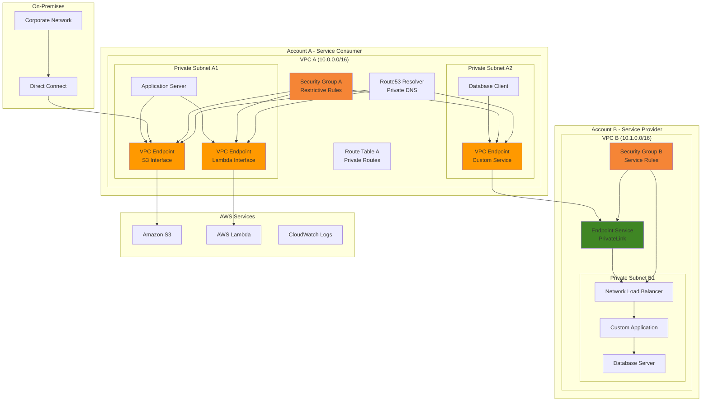

# Zero Trust Network with VPC Endpoints

## Problem

Traditional network security models rely on perimeter-based defenses that trust all traffic within the network boundary. However, modern cyber threats often originate from within the network, and many enterprise applications need secure access to cloud services without exposing data to the public internet. Organizations struggle with providing secure, private connectivity to AWS services and cross-account resources while maintaining strict access controls and comprehensive audit trails. The challenge is compounded when dealing with hybrid cloud environments where on-premises resources must securely communicate with AWS services through private connections.

## Solution

This solution implements a zero trust network architecture using VPC endpoints and AWS PrivateLink to create secure, private connectivity channels. The architecture eliminates internet gateways and NAT devices for service communication, provides granular access controls through security groups and endpoint policies, and enables private DNS resolution for seamless service discovery. By leveraging interface VPC endpoints for AWS services and PrivateLink for custom applications, organizations can achieve complete network isolation while maintaining scalability and auditability.

## Architecture Diagram



## Prerequisites

1. AWS CLI v2 installed and configured with appropriate permissions
2. Two AWS accounts or separate VPCs for cross-account demonstration
3. Basic understanding of VPC networking, security groups, and DNS
4. Familiarity with zero trust security principles
5. Estimated cost: $50-100 per month for VPC endpoints and data processing charges

> **Note**: VPC endpoints incur hourly charges (~$7.20/month each) plus data processing fees (~$0.01/GB). Plan your endpoint usage accordingly.

## Preparation

```bash
# Set environment variables
export AWS_REGION=$(aws configure get region)
export AWS_ACCOUNT_ID=$(aws sts get-caller-identity \
    --query Account --output text)

# Generate unique identifiers for resources
RANDOM_SUFFIX=$(aws secretsmanager get-random-password \
    --exclude-punctuation --exclude-uppercase \
    --password-length 6 --require-each-included-type \
    --output text --query RandomPassword)

# Set resource names
export VPC_NAME="zero-trust-vpc-${RANDOM_SUFFIX}"
export PROVIDER_VPC_NAME="provider-vpc-${RANDOM_SUFFIX}"
export ENDPOINT_SERVICE_NAME="zero-trust-service-${RANDOM_SUFFIX}"

# Create foundational VPC for zero trust architecture
VPC_ID=$(aws ec2 create-vpc \
    --cidr-block 10.0.0.0/16 \
    --enable-dns-support \
    --enable-dns-hostnames \
    --query 'Vpc.VpcId' --output text)

aws ec2 create-tags \
    --resources ${VPC_ID} \
    --tags Key=Name,Value=${VPC_NAME} Key=Environment,Value=ZeroTrust

echo "✅ Created VPC: ${VPC_ID}"

# Create provider VPC for cross-account demonstration
PROVIDER_VPC_ID=$(aws ec2 create-vpc \
    --cidr-block 10.1.0.0/16 \
    --enable-dns-support \
    --enable-dns-hostnames \
    --query 'Vpc.VpcId' --output text)

aws ec2 create-tags \
    --resources ${PROVIDER_VPC_ID} \
    --tags Key=Name,Value=${PROVIDER_VPC_NAME} Key=Environment,Value=Provider

echo "✅ Created Provider VPC: ${PROVIDER_VPC_ID}"

# Store VPC IDs for later use
export VPC_ID
export PROVIDER_VPC_ID
```

## Steps

1. **Create Private Subnets with Zero Trust Design**:

   Zero trust architecture requires complete network isolation from the public internet. Private subnets provide this isolation by having no direct routes to internet gateways, ensuring all traffic flows through controlled VPC endpoints. Multi-AZ deployment across availability zones provides high availability and fault tolerance for your zero trust infrastructure.

   > **Warning**: Never attach internet gateways or NAT devices to route tables associated with zero trust subnets, as this would compromise the network isolation that forms the foundation of zero trust security.

   ```bash
   # Create first private subnet in consumer VPC
   PRIVATE_SUBNET_1=$(aws ec2 create-subnet \
       --vpc-id ${VPC_ID} \
       --cidr-block 10.0.1.0/24 \
       --availability-zone ${AWS_REGION}a \
       --query 'Subnet.SubnetId' --output text)
   
   aws ec2 create-tags \
       --resources ${PRIVATE_SUBNET_1} \
       --tags Key=Name,Value="ZeroTrust-Private-1" Key=Type,Value=Private
   
   # Create second private subnet for multi-AZ deployment
   PRIVATE_SUBNET_2=$(aws ec2 create-subnet \
       --vpc-id ${VPC_ID} \
       --cidr-block 10.0.2.0/24 \
       --availability-zone ${AWS_REGION}b \
       --query 'Subnet.SubnetId' --output text)
   
   aws ec2 create-tags \
       --resources ${PRIVATE_SUBNET_2} \
       --tags Key=Name,Value="ZeroTrust-Private-2" Key=Type,Value=Private
   
   # Create provider subnet for service hosting
   PROVIDER_SUBNET=$(aws ec2 create-subnet \
       --vpc-id ${PROVIDER_VPC_ID} \
       --cidr-block 10.1.1.0/24 \
       --availability-zone ${AWS_REGION}a \
       --query 'Subnet.SubnetId' --output text)
   
   aws ec2 create-tags \
       --resources ${PROVIDER_SUBNET} \
       --tags Key=Name,Value="Provider-Subnet" Key=Type,Value=Private
   
   export PRIVATE_SUBNET_1 PRIVATE_SUBNET_2 PROVIDER_SUBNET
   echo "✅ Created private subnets for zero trust architecture"
   ```

   The subnets are now established as the foundation of your zero trust network. These private subnets will host your VPC endpoints and applications without any direct internet connectivity, enforcing the zero trust principle of denying all traffic by default.

2. **Configure Security Groups with Least Privilege Access**:

   Security groups function as virtual firewalls that control traffic at the instance level, implementing the zero trust principle of explicit verification. The least privilege approach ensures each resource can only access what it absolutely needs, reducing attack surface and potential blast radius from security incidents.

   ```bash
   # Create restrictive security group for VPC endpoints
   ENDPOINT_SG=$(aws ec2 create-security-group \
       --group-name "zero-trust-endpoint-sg" \
       --description "Zero Trust VPC Endpoint Security Group" \
       --vpc-id ${VPC_ID} \
       --query 'GroupId' --output text)
   
   # Allow HTTPS traffic only from specific CIDR
   aws ec2 authorize-security-group-ingress \
       --group-id ${ENDPOINT_SG} \
       --protocol tcp \
       --port 443 \
       --cidr 10.0.0.0/16
   
   # Create security group for application servers
   APP_SG=$(aws ec2 create-security-group \
       --group-name "zero-trust-app-sg" \
       --description "Zero Trust Application Security Group" \
       --vpc-id ${VPC_ID} \
       --query 'GroupId' --output text)
   
   # Allow outbound HTTPS to VPC endpoints only
   aws ec2 authorize-security-group-egress \
       --group-id ${APP_SG} \
       --protocol tcp \
       --port 443 \
       --source-group ${ENDPOINT_SG}
   
   # Remove default outbound rule
   aws ec2 revoke-security-group-egress \
       --group-id ${APP_SG} \
       --protocol all \
       --port all \
       --cidr 0.0.0.0/0
   
   # Create provider security group
   PROVIDER_SG=$(aws ec2 create-security-group \
       --group-name "provider-service-sg" \
       --description "Provider Service Security Group" \
       --vpc-id ${PROVIDER_VPC_ID} \
       --query 'GroupId' --output text)
   
   aws ec2 authorize-security-group-ingress \
       --group-id ${PROVIDER_SG} \
       --protocol tcp \
       --port 443 \
       --cidr 10.0.0.0/16
   
   export ENDPOINT_SG APP_SG PROVIDER_SG
   echo "✅ Created security groups with least privilege access"
   ```

   Critical security controls are now in place with micro-segmentation enforced through security groups. The application security group explicitly denies all internet access while permitting only encrypted HTTPS communication to VPC endpoints, embodying zero trust principles.

3. **Create Interface VPC Endpoints for AWS Services**:

   VPC endpoints enable private connectivity to AWS services without traversing the public internet, eliminating external network exposure and potential man-in-the-middle attacks. Interface endpoints create elastic network interfaces (ENIs) within your VPC with private IP addresses, enabling standard networking concepts like security groups and DNS resolution to apply to AWS service traffic.

   ```bash
   # Create S3 interface endpoint for zero trust data access
   S3_ENDPOINT=$(aws ec2 create-vpc-endpoint \
       --vpc-id ${VPC_ID} \
       --service-name com.amazonaws.${AWS_REGION}.s3 \
       --vpc-endpoint-type Interface \
       --subnet-ids ${PRIVATE_SUBNET_1} ${PRIVATE_SUBNET_2} \
       --security-group-ids ${ENDPOINT_SG} \
       --private-dns-enabled \
       --policy-document '{
           "Version": "2012-10-17",
           "Statement": [
               {
                   "Effect": "Allow",
                   "Principal": "*",
                   "Action": [
                       "s3:GetObject",
                       "s3:PutObject",
                       "s3:ListBucket"
                   ],
                   "Resource": "*",
                   "Condition": {
                       "StringEquals": {
                           "aws:PrincipalAccount": "'${AWS_ACCOUNT_ID}'"
                       }
                   }
               }
           ]
       }' \
       --query 'VpcEndpoint.VpcEndpointId' --output text)
   
   # Create Lambda interface endpoint
   LAMBDA_ENDPOINT=$(aws ec2 create-vpc-endpoint \
       --vpc-id ${VPC_ID} \
       --service-name com.amazonaws.${AWS_REGION}.lambda \
       --vpc-endpoint-type Interface \
       --subnet-ids ${PRIVATE_SUBNET_1} ${PRIVATE_SUBNET_2} \
       --security-group-ids ${ENDPOINT_SG} \
       --private-dns-enabled \
       --query 'VpcEndpoint.VpcEndpointId' --output text)
   
   # Create CloudWatch Logs endpoint for monitoring
   LOGS_ENDPOINT=$(aws ec2 create-vpc-endpoint \
       --vpc-id ${VPC_ID} \
       --service-name com.amazonaws.${AWS_REGION}.logs \
       --vpc-endpoint-type Interface \
       --subnet-ids ${PRIVATE_SUBNET_1} ${PRIVATE_SUBNET_2} \
       --security-group-ids ${ENDPOINT_SG} \
       --private-dns-enabled \
       --query 'VpcEndpoint.VpcEndpointId' --output text)
   
   export S3_ENDPOINT LAMBDA_ENDPOINT LOGS_ENDPOINT
   echo "✅ Created VPC endpoints for AWS services"
   ```

   Your applications now have secure, private pathways to AWS services through interface endpoints. The endpoint policies provide additional access controls beyond IAM, enabling network-level restrictions that complement identity-based permissions for comprehensive zero trust security.

4. **Set Up Network Load Balancer for PrivateLink Service**:

   Network Load Balancers (NLB) operate at Layer 4 and provide ultra-high performance, low-latency load balancing essential for PrivateLink services. The internal scheme ensures the NLB is only accessible within the VPC, maintaining network isolation while enabling scalable service delivery across multiple targets.

   ```bash
   # Create Network Load Balancer for PrivateLink
   NLB_ARN=$(aws elbv2 create-load-balancer \
       --name "zero-trust-nlb-${RANDOM_SUFFIX}" \
       --type network \
       --scheme internal \
       --subnets ${PROVIDER_SUBNET} \
       --security-groups ${PROVIDER_SG} \
       --query 'LoadBalancers[0].LoadBalancerArn' --output text)
   
   # Create target group for custom application
   TARGET_GROUP_ARN=$(aws elbv2 create-target-group \
       --name "zero-trust-tg-${RANDOM_SUFFIX}" \
       --protocol TCP \
       --port 443 \
       --vpc-id ${PROVIDER_VPC_ID} \
       --target-type ip \
       --health-check-protocol TCP \
       --health-check-port 443 \
       --query 'TargetGroups[0].TargetGroupArn' --output text)
   
   # Create listener for NLB
   LISTENER_ARN=$(aws elbv2 create-listener \
       --load-balancer-arn ${NLB_ARN} \
       --protocol TCP \
       --port 443 \
       --default-actions Type=forward,TargetGroupArn=${TARGET_GROUP_ARN} \
       --query 'Listeners[0].ListenerArn' --output text)
   
   # Wait for NLB to be active
   aws elbv2 wait load-balancer-available \
       --load-balancer-arns ${NLB_ARN}
   
   export NLB_ARN TARGET_GROUP_ARN LISTENER_ARN
   echo "✅ Created Network Load Balancer for PrivateLink service"
   ```

   The Network Load Balancer is now ready to serve as the foundation for your PrivateLink service. This high-performance load balancer will enable secure, private cross-account connectivity while maintaining the zero trust principle of controlled access through VPC endpoint connections.

5. **Create VPC Endpoint Service Configuration**:

   VPC endpoint services powered by PrivateLink enable secure sharing of services across AWS accounts without internet exposure or VPC peering. The acceptance-required flag enforces explicit approval for each connection request, ensuring strict access control that aligns with zero trust principles of explicit verification.

   ```bash
   # Create endpoint service configuration
   SERVICE_CONFIG=$(aws ec2 create-vpc-endpoint-service-configuration \
       --network-load-balancer-arns ${NLB_ARN} \
       --acceptance-required \
       --tag-specifications 'ResourceType=vpc-endpoint-service,Tags=[{Key=Name,Value=ZeroTrustEndpointService}]' \
       --query 'ServiceConfiguration.ServiceName' --output text)
   
   # Get service ID for permissions
   SERVICE_ID=$(aws ec2 describe-vpc-endpoint-service-configurations \
       --filters Name=service-name,Values=${SERVICE_CONFIG} \
       --query 'ServiceConfigurations[0].ServiceId' --output text)
   
   # Add permissions for consumer account
   aws ec2 modify-vpc-endpoint-service-permissions \
       --service-id ${SERVICE_ID} \
       --add-allowed-principals arn:aws:iam::${AWS_ACCOUNT_ID}:root
   
   export SERVICE_CONFIG SERVICE_ID
   echo "✅ Created VPC endpoint service: ${SERVICE_CONFIG}"
   ```

   Your PrivateLink service is now configured and ready to accept connections from authorized accounts. This service enables secure, private connectivity patterns that scale across multiple accounts while maintaining centralized access control and comprehensive audit trails.

6. **Create VPC Endpoint to Connect to PrivateLink Service**:

   Interface VPC endpoints for custom services create secure, private connections to PrivateLink services across AWS accounts. This connection model eliminates the need for complex networking configurations like VPC peering while providing granular control over cross-account access through service-specific endpoints.

   ```bash
   # Create VPC endpoint to connect to custom service
   CUSTOM_ENDPOINT=$(aws ec2 create-vpc-endpoint \
       --vpc-id ${VPC_ID} \
       --service-name ${SERVICE_CONFIG} \
       --vpc-endpoint-type Interface \
       --subnet-ids ${PRIVATE_SUBNET_1} ${PRIVATE_SUBNET_2} \
       --security-group-ids ${ENDPOINT_SG} \
       --private-dns-enabled \
       --query 'VpcEndpoint.VpcEndpointId' --output text)
   
   # Wait for endpoint to be available
   aws ec2 wait vpc-endpoint-available \
       --vpc-endpoint-ids ${CUSTOM_ENDPOINT}
   
   # Accept the endpoint connection
   aws ec2 accept-vpc-endpoint-connections \
       --service-id ${SERVICE_ID} \
       --vpc-endpoint-ids ${CUSTOM_ENDPOINT}
   
   export CUSTOM_ENDPOINT
   echo "✅ Created and accepted VPC endpoint connection: ${CUSTOM_ENDPOINT}"
   ```

   The cross-account PrivateLink connection is now established and operational. Applications in your consumer VPC can now securely access services in the provider account through encrypted, private network paths that never traverse the public internet.

7. **Configure Private DNS Resolution**:

   Private DNS resolution enables seamless service discovery within your zero trust network without exposing internal architecture to external DNS systems. Route53 private hosted zones provide authoritative DNS resolution for internal services, ensuring applications can locate resources using familiar DNS names while maintaining complete network isolation.

   ```bash
   # Create private hosted zone for custom service
   HOSTED_ZONE_ID=$(aws route53 create-hosted-zone \
       --name "zero-trust-service.internal" \
       --caller-reference "zero-trust-$(date +%s)" \
       --vpc VPCRegion=${AWS_REGION},VPCId=${VPC_ID} \
       --query 'HostedZone.Id' --output text | cut -d'/' -f3)
   
   # Get VPC endpoint DNS names
   ENDPOINT_DNS=$(aws ec2 describe-vpc-endpoints \
       --vpc-endpoint-ids ${CUSTOM_ENDPOINT} \
       --query 'VpcEndpoints[0].DnsEntries[0].DnsName' --output text)
   
   # Create DNS record for service discovery
   aws route53 change-resource-record-sets \
       --hosted-zone-id ${HOSTED_ZONE_ID} \
       --change-batch '{
           "Changes": [
               {
                   "Action": "CREATE",
                   "ResourceRecordSet": {
                       "Name": "api.zero-trust-service.internal",
                       "Type": "CNAME",
                       "TTL": 300,
                       "ResourceRecords": [
                           {
                               "Value": "'${ENDPOINT_DNS}'"
                           }
                       ]
                   }
               }
           ]
       }'
   
   export HOSTED_ZONE_ID ENDPOINT_DNS
   echo "✅ Configured private DNS resolution"
   ```

   Private DNS resolution is now configured, enabling applications to access your PrivateLink services using human-readable domain names. This abstraction layer provides operational flexibility and simplifies application configuration while maintaining the security benefits of private networking.

8. **Set Up Route Tables with No Internet Access**:

   Route tables without internet gateway routes enforce zero trust networking by ensuring no traffic can flow to the public internet. This configuration creates air-gapped networks where all external communication must flow through controlled VPC endpoints, providing complete visibility and control over data flows.

   ```bash
   # Create custom route table for zero trust networking
   ROUTE_TABLE_ID=$(aws ec2 create-route-table \
       --vpc-id ${VPC_ID} \
       --query 'RouteTable.RouteTableId' --output text)
   
   aws ec2 create-tags \
       --resources ${ROUTE_TABLE_ID} \
       --tags Key=Name,Value="ZeroTrust-RouteTable"
   
   # Associate route table with private subnets
   aws ec2 associate-route-table \
       --route-table-id ${ROUTE_TABLE_ID} \
       --subnet-id ${PRIVATE_SUBNET_1}
   
   aws ec2 associate-route-table \
       --route-table-id ${ROUTE_TABLE_ID} \
       --subnet-id ${PRIVATE_SUBNET_2}
   
   # Create provider route table
   PROVIDER_ROUTE_TABLE=$(aws ec2 create-route-table \
       --vpc-id ${PROVIDER_VPC_ID} \
       --query 'RouteTable.RouteTableId' --output text)
   
   aws ec2 associate-route-table \
       --route-table-id ${PROVIDER_ROUTE_TABLE} \
       --subnet-id ${PROVIDER_SUBNET}
   
   export ROUTE_TABLE_ID PROVIDER_ROUTE_TABLE
   echo "✅ Configured route tables with no internet access"
   ```

   Your network routing is now configured to prevent any unauthorized internet access. All traffic must flow through explicitly configured VPC endpoints, creating a fully contained zero trust environment where network access is granted on a need-to-know basis.

9. **Enable VPC Flow Logs for Network Monitoring**:

   VPC Flow Logs provide comprehensive network traffic visibility essential for zero trust monitoring and compliance. These logs capture detailed information about IP traffic flows, enabling security teams to detect anomalies, investigate incidents, and ensure compliance with data governance requirements through complete network audit trails.

   ```bash
   # Create IAM role for VPC Flow Logs
   FLOW_LOGS_ROLE=$(aws iam create-role \
       --role-name "VPCFlowLogsRole-${RANDOM_SUFFIX}" \
       --assume-role-policy-document '{
           "Version": "2012-10-17",
           "Statement": [
               {
                   "Effect": "Allow",
                   "Principal": {
                       "Service": "vpc-flow-logs.amazonaws.com"
                   },
                   "Action": "sts:AssumeRole"
               }
           ]
       }' \
       --query 'Role.Arn' --output text)
   
   # Attach policy for CloudWatch Logs
   aws iam attach-role-policy \
       --role-name "VPCFlowLogsRole-${RANDOM_SUFFIX}" \
       --policy-arn arn:aws:iam::aws:policy/service-role/VPCFlowLogsDeliveryRolePolicy
   
   # Create CloudWatch log group
   LOG_GROUP_NAME="/aws/vpc/zero-trust-flowlogs"
   aws logs create-log-group \
       --log-group-name ${LOG_GROUP_NAME}
   
   # Create VPC Flow Logs
   FLOW_LOGS_ID=$(aws ec2 create-flow-logs \
       --resource-type VPC \
       --resource-ids ${VPC_ID} \
       --traffic-type ALL \
       --log-destination-type cloud-watch-logs \
       --log-group-name ${LOG_GROUP_NAME} \
       --deliver-logs-permission-arn ${FLOW_LOGS_ROLE} \
       --query 'FlowLogIds[0]' --output text)
   
   export FLOW_LOGS_ROLE LOG_GROUP_NAME FLOW_LOGS_ID
   echo "✅ Enabled VPC Flow Logs for network monitoring"
   ```

   Comprehensive network monitoring is now active through VPC Flow Logs. This observability foundation enables continuous security monitoring, anomaly detection, and forensic analysis capabilities essential for maintaining zero trust security posture.

10. **Create Test Application for Validation**:

    A test Lambda function deployed within your zero trust VPC provides validation of connectivity patterns and security controls. This function tests both allowed connections (AWS services through VPC endpoints) and blocked connections (direct internet access), demonstrating the effectiveness of your zero trust implementation.

    ```bash
    # Create test Lambda function for validation
    LAMBDA_FUNCTION_NAME="zero-trust-test-${RANDOM_SUFFIX}"
    
    # Create Lambda execution role
    LAMBDA_ROLE=$(aws iam create-role \
        --role-name "ZeroTrustLambdaRole-${RANDOM_SUFFIX}" \
        --assume-role-policy-document '{
            "Version": "2012-10-17",
            "Statement": [
                {
                    "Effect": "Allow",
                    "Principal": {
                        "Service": "lambda.amazonaws.com"
                    },
                    "Action": "sts:AssumeRole"
                }
            ]
        }' \
        --query 'Role.Arn' --output text)
    
    # Attach basic execution policy
    aws iam attach-role-policy \
        --role-name "ZeroTrustLambdaRole-${RANDOM_SUFFIX}" \
        --policy-arn arn:aws:iam::aws:policy/service-role/AWSLambdaVPCAccessExecutionRole
    
    # Create Lambda function code
    cat > /tmp/lambda_function.py << 'EOF'
import json
import boto3
import urllib3

def lambda_handler(event, context):
    """Test function to validate zero trust connectivity"""
    try:
        # Test S3 access through VPC endpoint
        s3_client = boto3.client('s3')
        buckets = s3_client.list_buckets()
        
        # Test external HTTP request (should fail in zero trust)
        http = urllib3.PoolManager()
        try:
            response = http.request('GET', 'https://httpbin.org/get', timeout=5)
            internet_access = True
        except:
            internet_access = False
        
        return {
            'statusCode': 200,
            'body': json.dumps({
                'message': 'Zero Trust validation complete',
                's3_access': len(buckets['Buckets']) >= 0,
                'internet_access': internet_access,
                'vpc_endpoint_working': True
            })
        }
    except Exception as e:
        return {
            'statusCode': 500,
            'body': json.dumps({
                'error': str(e)
            })
        }
EOF
    
    # Create deployment package
    cd /tmp && zip lambda_function.zip lambda_function.py
    
    # Wait for IAM role to be ready
    sleep 10
    
    # Deploy Lambda function
    aws lambda create-function \
        --function-name ${LAMBDA_FUNCTION_NAME} \
        --runtime python3.9 \
        --role ${LAMBDA_ROLE} \
        --handler lambda_function.lambda_handler \
        --code fileb://lambda_function.zip \
        --vpc-config SubnetIds=${PRIVATE_SUBNET_1},SecurityGroupIds=${APP_SG} \
        --timeout 30
    
    export LAMBDA_FUNCTION_NAME LAMBDA_ROLE
    echo "✅ Created test Lambda function for validation"
    ```

    Your validation application is now deployed and ready to test the zero trust connectivity patterns. This function will demonstrate that AWS services are accessible through VPC endpoints while internet access is completely blocked, proving the effectiveness of your security controls.

## Validation & Testing

1. **Verify VPC Endpoints Are Active**:

   ```bash
   # Check S3 VPC endpoint status
   aws ec2 describe-vpc-endpoints \
       --vpc-endpoint-ids ${S3_ENDPOINT} \
       --query 'VpcEndpoints[0].State' --output text
   
   # Check Lambda VPC endpoint status  
   aws ec2 describe-vpc-endpoints \
       --vpc-endpoint-ids ${LAMBDA_ENDPOINT} \
       --query 'VpcEndpoints[0].State' --output text
   
   # Check custom service endpoint status
   aws ec2 describe-vpc-endpoints \
       --vpc-endpoint-ids ${CUSTOM_ENDPOINT} \
       --query 'VpcEndpoints[0].State' --output text
   ```

   Expected output: `available` for all endpoints

2. **Test Private DNS Resolution**:

   ```bash
   # Test DNS resolution through VPC endpoint
   aws ec2 describe-vpc-endpoints \
       --vpc-endpoint-ids ${S3_ENDPOINT} \
       --query 'VpcEndpoints[0].DnsEntries[0].DnsName' --output text
   
   # Verify private hosted zone
   aws route53 list-resource-record-sets \
       --hosted-zone-id ${HOSTED_ZONE_ID} \
       --query 'ResourceRecordSets[?Type==`CNAME`].Name' --output text
   ```

   Expected output: DNS names for endpoints and custom service records

3. **Test Zero Trust Connectivity**:

   ```bash
   # Invoke test Lambda function
   aws lambda invoke \
       --function-name ${LAMBDA_FUNCTION_NAME} \
       --payload '{}' \
       /tmp/lambda_response.json
   
   # Check response
   cat /tmp/lambda_response.json | jq '.'
   ```

   Expected output: S3 access should work, internet access should be blocked

4. **Verify Network Flow Logs**:

   ```bash
   # Check VPC Flow Logs
   aws ec2 describe-flow-logs \
       --flow-log-ids ${FLOW_LOGS_ID} \
       --query 'FlowLogs[0].FlowLogStatus' --output text
   
   # Check recent log entries
   aws logs describe-log-streams \
       --log-group-name ${LOG_GROUP_NAME} \
       --order-by LastEventTime \
       --descending \
       --max-items 3
   ```

   Expected output: Active flow logs with recent entries

5. **Test Cross-Account PrivateLink Connectivity**:

   ```bash
   # Verify endpoint service connections
   aws ec2 describe-vpc-endpoint-connections \
       --filters Name=service-id,Values=${SERVICE_ID} \
       --query 'VpcEndpointConnections[0].VpcEndpointState' --output text
   
   # Test custom service endpoint
   aws ec2 describe-vpc-endpoints \
       --vpc-endpoint-ids ${CUSTOM_ENDPOINT} \
       --query 'VpcEndpoints[0].DnsEntries[0].DnsName' --output text
   ```

   Expected output: Connected state and valid DNS name

## Cleanup

1. **Remove Lambda function and IAM roles**:

   ```bash
   # Delete Lambda function
   aws lambda delete-function \
       --function-name ${LAMBDA_FUNCTION_NAME}
   
   # Delete Lambda IAM role
   aws iam detach-role-policy \
       --role-name "ZeroTrustLambdaRole-${RANDOM_SUFFIX}" \
       --policy-arn arn:aws:iam::aws:policy/service-role/AWSLambdaVPCAccessExecutionRole
   
   aws iam delete-role \
       --role-name "ZeroTrustLambdaRole-${RANDOM_SUFFIX}"
   
   echo "✅ Deleted Lambda function and IAM role"
   ```

2. **Remove VPC endpoints**:

   ```bash
   # Delete VPC endpoints
   aws ec2 delete-vpc-endpoints \
       --vpc-endpoint-ids ${S3_ENDPOINT} ${LAMBDA_ENDPOINT} ${LOGS_ENDPOINT} ${CUSTOM_ENDPOINT}
   
   echo "✅ Deleted VPC endpoints"
   ```

3. **Remove VPC endpoint service configuration**:

   ```bash
   # Delete endpoint service configuration
   aws ec2 delete-vpc-endpoint-service-configurations \
       --service-ids ${SERVICE_ID}
   
   echo "✅ Deleted endpoint service configuration"
   ```

4. **Remove Network Load Balancer**:

   ```bash
   # Delete NLB listener
   aws elbv2 delete-listener \
       --listener-arn ${LISTENER_ARN}
   
   # Delete target group
   aws elbv2 delete-target-group \
       --target-group-arn ${TARGET_GROUP_ARN}
   
   # Delete load balancer
   aws elbv2 delete-load-balancer \
       --load-balancer-arn ${NLB_ARN}
   
   echo "✅ Deleted Network Load Balancer"
   ```

5. **Remove Route53 hosted zone**:

   ```bash
   # Delete DNS records
   aws route53 change-resource-record-sets \
       --hosted-zone-id ${HOSTED_ZONE_ID} \
       --change-batch '{
           "Changes": [
               {
                   "Action": "DELETE",
                   "ResourceRecordSet": {
                       "Name": "api.zero-trust-service.internal",
                       "Type": "CNAME",
                       "TTL": 300,
                       "ResourceRecords": [
                           {
                               "Value": "'${ENDPOINT_DNS}'"
                           }
                       ]
                   }
               }
           ]
       }'
   
   # Delete hosted zone
   aws route53 delete-hosted-zone \
       --id ${HOSTED_ZONE_ID}
   
   echo "✅ Deleted Route53 hosted zone"
   ```

6. **Remove VPC Flow Logs and CloudWatch resources**:

   ```bash
   # Delete VPC Flow Logs
   aws ec2 delete-flow-logs \
       --flow-log-ids ${FLOW_LOGS_ID}
   
   # Delete CloudWatch log group
   aws logs delete-log-group \
       --log-group-name ${LOG_GROUP_NAME}
   
   # Delete Flow Logs IAM role
   aws iam detach-role-policy \
       --role-name "VPCFlowLogsRole-${RANDOM_SUFFIX}" \
       --policy-arn arn:aws:iam::aws:policy/service-role/VPCFlowLogsDeliveryRolePolicy
   
   aws iam delete-role \
       --role-name "VPCFlowLogsRole-${RANDOM_SUFFIX}"
   
   echo "✅ Deleted VPC Flow Logs and CloudWatch resources"
   ```

7. **Remove networking infrastructure**:

   ```bash
   # Delete security groups (delete in reverse dependency order)
   aws ec2 delete-security-group \
       --group-id ${APP_SG}
   
   aws ec2 delete-security-group \
       --group-id ${ENDPOINT_SG}
   
   aws ec2 delete-security-group \
       --group-id ${PROVIDER_SG}
   
   # Delete subnets
   aws ec2 delete-subnet \
       --subnet-id ${PRIVATE_SUBNET_1}
   
   aws ec2 delete-subnet \
       --subnet-id ${PRIVATE_SUBNET_2}
   
   aws ec2 delete-subnet \
       --subnet-id ${PROVIDER_SUBNET}
   
   # Delete route tables
   aws ec2 delete-route-table \
       --route-table-id ${ROUTE_TABLE_ID}
   
   aws ec2 delete-route-table \
       --route-table-id ${PROVIDER_ROUTE_TABLE}
   
   # Delete VPCs
   aws ec2 delete-vpc \
       --vpc-id ${VPC_ID}
   
   aws ec2 delete-vpc \
       --vpc-id ${PROVIDER_VPC_ID}
   
   echo "✅ Deleted networking infrastructure"
   ```

## Discussion

Zero trust network architecture represents a fundamental shift from traditional perimeter-based security models to a "never trust, always verify" approach. This implementation leverages AWS VPC endpoints and PrivateLink to create secure, private communication channels that eliminate the need for internet gateways, NAT devices, or VPN connections for accessing AWS services and cross-account resources.

The architecture provides several key benefits: **Network Isolation** ensures that traffic never traverses the public internet, reducing attack surface and improving compliance posture. **Granular Access Control** through security groups and endpoint policies allows fine-grained permission management at the network level. **Private DNS Resolution** enables seamless service discovery without exposing internal architecture to external networks. **Comprehensive Monitoring** via VPC Flow Logs provides complete visibility into network traffic patterns for security analysis and compliance reporting.

PrivateLink technology facilitates secure cross-account connectivity without VPC peering or complex networking configurations. By creating VPC endpoint services backed by Network Load Balancers, organizations can expose internal services to other AWS accounts while maintaining complete control over access permissions and network policies. This approach scales efficiently across multiple accounts and regions while preserving the zero trust principles of explicit verification and least privilege access.

The implementation also addresses hybrid cloud scenarios where on-premises networks need secure access to AWS services. By integrating with AWS Direct Connect or Site-to-Site VPN connections, organizations can extend their zero trust architecture to include on-premises resources, ensuring consistent security policies across hybrid environments.

> **Tip**: Use AWS Config rules to automatically monitor VPC endpoint configurations and ensure they remain compliant with your zero trust policies. This provides continuous compliance validation and alerting for any configuration drift.

> **Note**: Interface VPC endpoints automatically provide DNS resolution and security group controls, making them seamlessly integrate with existing application architectures without requiring code changes. See the [AWS PrivateLink documentation](https://docs.aws.amazon.com/vpc/latest/privatelink/) for detailed service coverage.

## Challenge

Extend this zero trust architecture by implementing these advanced capabilities:

1. **Multi-Region Zero Trust**: Deploy the architecture across multiple AWS regions with cross-region PrivateLink connectivity and centralized DNS management through Route53 Resolver rules.

2. **Container-Based Zero Trust**: Integrate the architecture with Amazon EKS using AWS App Mesh service mesh for microservices communication and Calico network policies for pod-level security controls.

3. **Automated Compliance Monitoring**: Build AWS Config custom rules and CloudWatch alarms to automatically detect and remediate zero trust policy violations, including unauthorized internet access attempts.

4. **Identity-Based Network Access**: Implement AWS Verified Access to add identity-based controls to the network layer, requiring user authentication before allowing access to VPC endpoints and internal services.

5. **Advanced Threat Detection**: Deploy AWS GuardDuty VPC Flow Logs analysis and Amazon Detective for automated threat detection and investigation capabilities within the zero trust network.

## Infrastructure Code

*Infrastructure code will be generated after recipe approval.*