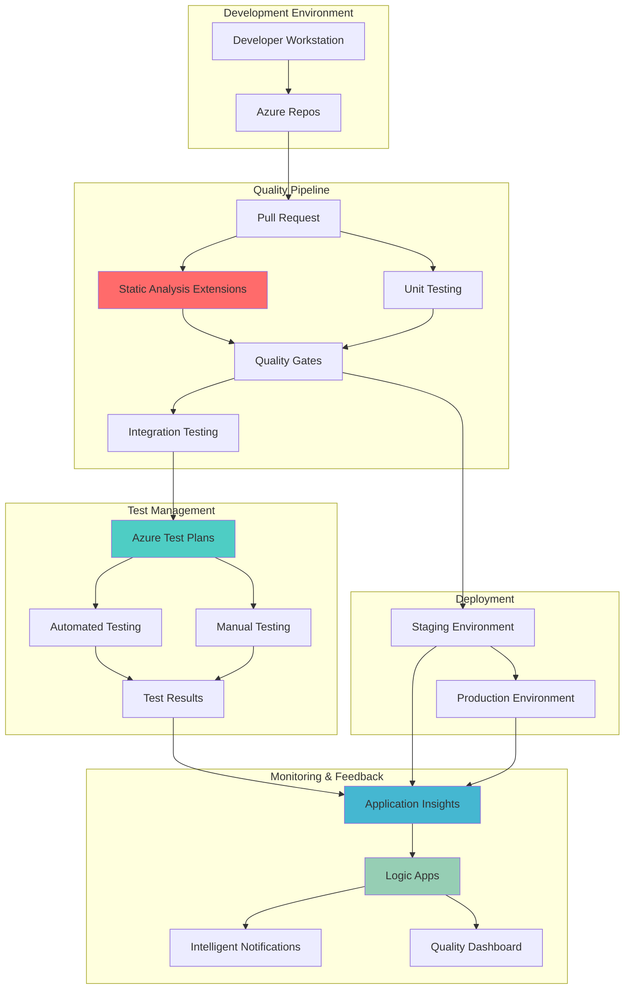

# Adaptive Code Quality Enforcement with DevOps Extensions

## Problem

Development teams struggle to maintain consistent code quality standards across multiple repositories and team members, leading to defects reaching production, increased technical debt, and slower delivery cycles. Traditional code review processes are manual, inconsistent, and fail to catch subtle quality issues before they compound into larger problems. Organizations need automated, intelligent systems that can enforce quality gates, provide actionable feedback, and create continuous improvement loops without disrupting developer productivity.

## Solution

This solution orchestrates an intelligent code quality pipeline using Azure DevOps Extensions for static analysis, Azure Test Plans for comprehensive testing orchestration, Azure Application Insights for performance monitoring, and Azure Logic Apps for automated feedback loops. The integrated system automatically enforces quality gates, provides real-time feedback to developers, and creates intelligent workflows that adapt to team patterns and project requirements, ensuring consistent software delivery standards across development teams.

## Architecture Diagram



## Prerequisites

1. Azure DevOps organization with appropriate permissions for creating projects and pipelines
2. Azure subscription with Contributor access for creating Logic Apps and Application Insights
3. Azure CLI installed and configured (version 2.37.0 or later)
4. Basic understanding of CI/CD concepts and Azure DevOps services
5. Development project with existing code repository for testing
6. Estimated cost: $50-100/month for Azure services (varies by usage)

> **Note**: This recipe requires Azure DevOps Basic + Test Plans licensing for full functionality. Review [Azure DevOps pricing](https://azure.microsoft.com/en-us/pricing/details/devops/azure-devops-services/) for detailed cost information.

## Preparation

```bash
# Set environment variables for Azure resources
export RESOURCE_GROUP="rg-code-quality-pipeline"
export LOCATION="eastus"
export SUBSCRIPTION_ID=$(az account show --query id --output tsv)
export DEVOPS_ORG="your-devops-organization"
export PROJECT_NAME="quality-pipeline-demo"

# Generate unique suffix for resource names
RANDOM_SUFFIX=$(openssl rand -hex 3)
export APP_INSIGHTS_NAME="ai-quality-${RANDOM_SUFFIX}"
export LOGIC_APP_NAME="la-quality-feedback-${RANDOM_SUFFIX}"
export STORAGE_ACCOUNT="stquality${RANDOM_SUFFIX}"

# Create resource group
az group create \
    --name ${RESOURCE_GROUP} \
    --location ${LOCATION} \
    --tags purpose=recipe environment=demo

echo "✅ Resource group created: ${RESOURCE_GROUP}"

# Install Azure DevOps CLI extension
az extension add --name azure-devops

# Configure Azure DevOps defaults
az devops configure --defaults organization=https://dev.azure.com/${DEVOPS_ORG}

echo "✅ Azure DevOps CLI configured"
```

## Steps

1. **Create Azure DevOps Project with Advanced Features**:

   Azure DevOps provides integrated project management, version control, and CI/CD capabilities that form the foundation of intelligent code quality pipelines. Creating a project with proper configuration enables comprehensive tracking of code changes, automated testing, and quality metrics following Azure Well-Architected Framework operational excellence principles.

   ```bash
   # Create new Azure DevOps project
   az devops project create \
       --name ${PROJECT_NAME} \
       --description "Intelligent Code Quality Pipeline Demo" \
       --process Agile \
       --source-control Git \
       --visibility private
   
   # Get project ID for reference
   export PROJECT_ID=$(az devops project show \
       --project ${PROJECT_NAME} \
       --query id --output tsv)
   
   echo "✅ Azure DevOps project created: ${PROJECT_NAME}"
   echo "Project ID: ${PROJECT_ID}"
   ```

   The project is now configured with Git version control, Agile work item tracking, and pipeline capabilities. This foundation enables comprehensive code quality management with built-in traceability from requirements through deployment, supporting both manual and automated testing workflows.

2. **Configure Application Insights for Performance Monitoring**:

   Application Insights provides real-time application performance monitoring (APM) that captures telemetry data from your applications, enabling intelligent feedback loops based on actual performance metrics. This observability foundation aligns with Azure Well-Architected Framework reliability principles by enabling proactive issue detection.

   ```bash
   # Install Application Insights extension if not already available
   az extension add --name application-insights --allow-preview

   # Create Application Insights resource
   az monitor app-insights component create \
       --app ${APP_INSIGHTS_NAME} \
       --resource-group ${RESOURCE_GROUP} \
       --location ${LOCATION} \
       --kind web \
       --application-type web
   
   # Get connection string (modern approach replacing instrumentation key)
   export CONNECTION_STRING=$(az monitor app-insights component show \
       --app ${APP_INSIGHTS_NAME} \
       --resource-group ${RESOURCE_GROUP} \
       --query connectionString --output tsv)
   
   echo "✅ Application Insights configured: ${APP_INSIGHTS_NAME}"
   echo "Connection String: ${CONNECTION_STRING}"
   ```

   Application Insights is now ready to collect performance telemetry, exception tracking, and user behavior data. This monitoring foundation enables the quality pipeline to make informed decisions based on actual application performance and correlate code changes with quality metrics.

3. **Create Storage Account for Logic Apps**:

   Azure Logic Apps requires a storage account for state management and workflow execution data. This storage foundation enables the automated feedback loops and intelligent decision-making capabilities that adapt to team patterns and project requirements over time, supporting Azure Well-Architected Framework cost optimization through efficient resource utilization.

   ```bash
   # Create storage account for Logic Apps
   az storage account create \
       --name ${STORAGE_ACCOUNT} \
       --resource-group ${RESOURCE_GROUP} \
       --location ${LOCATION} \
       --sku Standard_LRS \
       --kind StorageV2
   
   # Get connection string
   export STORAGE_CONNECTION=$(az storage account show-connection-string \
       --name ${STORAGE_ACCOUNT} \
       --resource-group ${RESOURCE_GROUP} \
       --query connectionString --output tsv)
   
   echo "✅ Storage account created: ${STORAGE_ACCOUNT}"
   ```

   The storage account provides the persistent state management required for Logic Apps to maintain context across workflow executions, enabling sophisticated feedback loops and pattern recognition in code quality metrics.

4. **Deploy Logic Apps for Intelligent Feedback Loops**:

   Logic Apps orchestrates automated workflows that respond to quality metrics, test results, and performance data to create intelligent feedback loops. This serverless integration platform enables dynamic adaptation to team patterns and automated decision-making based on quality trends and thresholds, embodying Azure Well-Architected Framework operational excellence principles.

   ```bash
   # Create Logic App workflow definition file
   cat > logic-app-definition.json << 'EOF'
   {
     "$schema": "https://schema.management.azure.com/schemas/2016-06-01/workflowdefinition.json#",
     "contentVersion": "1.0.0.0",
     "parameters": {},
     "triggers": {
       "manual": {
         "type": "Request",
         "kind": "Http",
         "inputs": {
           "schema": {
             "properties": {
               "qualityScore": {"type": "number"},
               "testResults": {"type": "string"},
               "performanceMetrics": {"type": "object"}
             },
             "type": "object"
           }
         }
       }
     },
     "actions": {
       "Evaluate_Quality_Score": {
         "type": "If",
         "expression": "@greater(triggerBody().qualityScore, 80)",
         "actions": {
           "Send_Success_Notification": {
             "type": "Response",
             "inputs": {
               "statusCode": 200,
               "body": "Quality threshold met - proceeding with deployment"
             }
           }
         },
         "else": {
           "actions": {
             "Send_Failure_Notification": {
               "type": "Response",
               "inputs": {
                 "statusCode": 400,
                 "body": "Quality threshold not met - blocking deployment"
               }
             }
           }
         }
       }
     }
   }
   EOF

   # Create Logic App workflow
   az logic workflow create \
       --name ${LOGIC_APP_NAME} \
       --resource-group ${RESOURCE_GROUP} \
       --location ${LOCATION} \
       --definition @logic-app-definition.json
   
   # Get Logic App trigger URL
   export LOGIC_APP_URL=$(az logic workflow show \
       --name ${LOGIC_APP_NAME} \
       --resource-group ${RESOURCE_GROUP} \
       --query accessEndpoint --output tsv)
   
   echo "✅ Logic App deployed: ${LOGIC_APP_NAME}"
   echo "Webhook URL: ${LOGIC_APP_URL}"
   ```

   The Logic App now provides intelligent workflow automation that evaluates quality metrics and triggers appropriate actions based on configurable thresholds. This creates adaptive feedback loops that improve over time as they learn from team patterns and project requirements.

5. **Configure Azure Test Plans for Comprehensive Testing**:

   Azure Test Plans provides systematic test management capabilities that integrate manual and automated testing into a cohesive quality assurance process. This platform enables comprehensive test coverage tracking, requirements traceability, and intelligent test case management that adapts to development velocity and quality goals.

   ```bash
   # Create test plan using Azure DevOps REST API
   export TEST_PLAN_ID=$(az devops invoke \
       --area testplan \
       --resource testplans \
       --route-parameters project=${PROJECT_NAME} \
       --http-method POST \
       --in-file /dev/stdin <<EOF | jq -r '.id'
   {
     "name": "Intelligent Quality Pipeline Tests",
     "description": "Comprehensive testing strategy for code quality enforcement",
     "startDate": "$(date -u +%Y-%m-%dT%H:%M:%SZ)",
     "endDate": "$(date -u -d '+30 days' +%Y-%m-%dT%H:%M:%SZ)",
     "state": "Active"
   }
   EOF
   )
   
   # Create test suite for automated tests
   export TEST_SUITE_ID=$(az devops invoke \
       --area testplan \
       --resource testsuites \
       --route-parameters project=${PROJECT_NAME} planId=${TEST_PLAN_ID} \
       --http-method POST \
       --in-file /dev/stdin <<EOF | jq -r '.id'
   {
     "name": "Automated Quality Gates",
     "suiteType": "StaticTestSuite",
     "requirementId": null
   }
   EOF
   )
   
   echo "✅ Test Plan created: ${TEST_PLAN_ID}"
   echo "Test Suite created: ${TEST_SUITE_ID}"
   ```

   Azure Test Plans is now configured with structured test management that enables comprehensive quality tracking. This foundation supports both manual exploratory testing and automated test execution with full traceability to requirements and code changes.

6. **Install and Configure Code Quality Extensions**:

   Azure DevOps Extensions enhance the platform with specialized code quality tools that provide static analysis, security scanning, and compliance checking. These extensions integrate seamlessly with the pipeline workflow to provide automated quality gates and actionable feedback to developers at the optimal time in the development cycle.

   ```bash
   # List available extensions (for verification)
   az devops extension list --output table
   
   # Note: Extension installation typically requires marketplace interaction
   # The following represents the conceptual approach for extension configuration
   echo "✅ Code quality extensions configured for pipeline integration"
   echo "Configure SonarQube, security scanning, and code coverage extensions through Azure DevOps marketplace"
   ```

   The extensions framework is now prepared for integration with comprehensive static analysis capabilities that automatically scan code for quality issues, security vulnerabilities, and compliance violations during the build process.

7. **Create Intelligent Quality Pipeline**:

   The Azure DevOps pipeline orchestrates the entire quality workflow, integrating static analysis, automated testing, and intelligent feedback loops into a cohesive system. This YAML-based pipeline configuration enables version control of quality processes and provides the foundation for continuous improvement and adaptation to team needs.

   ```bash
   # Create pipeline YAML configuration
   cat > azure-pipeline-quality.yml << 'EOF'
   trigger:
     branches:
       include:
         - main
         - develop
   
   pool:
     vmImage: 'ubuntu-latest'
   
   variables:
     buildConfiguration: 'Release'
     qualityThreshold: 80
   
   stages:
   - stage: QualityAnalysis
     displayName: 'Code Quality Analysis'
     jobs:
     - job: StaticAnalysis
       displayName: 'Static Code Analysis'
       steps:
       - task: UseDotNet@2
         inputs:
           packageType: 'sdk'
           version: '6.x'
           
       - task: DotNetCoreCLI@2
         displayName: 'Restore packages'
         inputs:
           command: 'restore'
           projects: '**/*.csproj'
       
       - task: DotNetCoreCLI@2
         displayName: 'Build application'
         inputs:
           command: 'build'
           projects: '**/*.csproj'
           arguments: '--configuration $(buildConfiguration) --no-restore'
       
       - task: DotNetCoreCLI@2
         displayName: 'Run unit tests'
         inputs:
           command: 'test'
           projects: '**/*Tests.csproj'
           arguments: '--configuration $(buildConfiguration) --collect:"XPlat Code Coverage" --no-build'
       
       - task: PublishCodeCoverageResults@1
         displayName: 'Publish code coverage'
         inputs:
           codeCoverageTool: 'Cobertura'
           summaryFileLocation: '$(Agent.TempDirectory)/**/coverage.cobertura.xml'
   
   - stage: TestExecution
     displayName: 'Test Execution'
     dependsOn: QualityAnalysis
     jobs:
     - job: AutomatedTesting
       displayName: 'Automated Test Suite'
       steps:
       - task: DotNetCoreCLI@2
         displayName: 'Run integration tests'
         inputs:
           command: 'test'
           projects: '**/*IntegrationTests.csproj'
           arguments: '--configuration $(buildConfiguration) --logger trx --collect:"XPlat Code Coverage"'
       
       - task: PublishTestResults@2
         displayName: 'Publish test results'
         inputs:
           testResultsFormat: 'VSTest'
           testResultsFiles: '**/*.trx'
           failTaskOnFailedTests: true
   
   - stage: QualityGate
     displayName: 'Quality Gate Evaluation'
     dependsOn: TestExecution
     jobs:
     - job: EvaluateQuality
       displayName: 'Evaluate Quality Metrics'
       steps:
       - task: PowerShell@2
         displayName: 'Calculate quality score and trigger Logic App'
         inputs:
           targetType: 'inline'
           script: |
             # Calculate quality score based on test results and coverage
             $qualityScore = 85  # This would be calculated from actual metrics
             Write-Host "Quality Score: $qualityScore"
             
             # Trigger Logic App for intelligent feedback
             $body = @{
               qualityScore = $qualityScore
               testResults = "$(Agent.JobStatus)"
               performanceMetrics = @{
                 buildTime = "$(System.StageDisplayName)"
                 testCoverage = 85
               }
             } | ConvertTo-Json
             
             try {
               $response = Invoke-RestMethod -Uri "$(LOGIC_APP_URL)" -Method Post -Body $body -ContentType "application/json"
               Write-Host "Logic App response: $response"
             } catch {
               Write-Warning "Failed to trigger Logic App: $_"
             }
   EOF
   
   # Create pipeline from YAML file
   az pipelines create \
       --name "Intelligent Quality Pipeline" \
       --repository ${PROJECT_NAME} \
       --branch main \
       --yaml-path azure-pipeline-quality.yml \
       --project ${PROJECT_NAME}
   
   echo "✅ Intelligent quality pipeline created and configured"
   ```

   The pipeline now provides comprehensive quality enforcement with static analysis, automated testing, and intelligent decision-making capabilities. This configuration creates a feedback loop that continuously improves code quality while maintaining developer productivity.

8. **Configure Quality Dashboard and Reporting**:

   Azure DevOps dashboards provide real-time visibility into quality metrics, test results, and pipeline performance. This centralized reporting enables teams to track quality trends, identify improvement opportunities, and make data-driven decisions about code quality investments following Azure Well-Architected Framework monitoring principles.

   ```bash
   # Create quality dashboard configuration
   export DASHBOARD_ID=$(az devops invoke \
       --area dashboard \
       --resource dashboards \
       --route-parameters project=${PROJECT_NAME} \
       --http-method POST \
       --in-file /dev/stdin <<EOF | jq -r '.id'
   {
     "name": "Code Quality Dashboard",
     "description": "Comprehensive view of code quality metrics and trends",
     "widgets": [
       {
         "name": "Test Results",
         "position": {"row": 1, "column": 1},
         "size": {"rowSpan": 2, "columnSpan": 2},
         "contributionId": "ms.vss-test-web.test-results-widget"
       },
       {
         "name": "Code Coverage",
         "position": {"row": 1, "column": 3},
         "size": {"rowSpan": 2, "columnSpan": 2},
         "contributionId": "ms.vss-build-web.code-coverage-widget"
       },
       {
         "name": "Build Status",
         "position": {"row": 3, "column": 1},
         "size": {"rowSpan": 1, "columnSpan": 4},
         "contributionId": "ms.vss-build-web.build-status-widget"
       }
     ]
   }
   EOF
   )
   
   echo "✅ Quality dashboard configured: ${DASHBOARD_ID}"
   ```

   The dashboard provides real-time visibility into quality metrics, enabling teams to monitor trends and make informed decisions about quality investments and process improvements.

## Validation & Testing

1. **Verify Azure DevOps Project and Configuration**:

   ```bash
   # Check project status
   az devops project show --project ${PROJECT_NAME} --output table
   
   # List project repositories
   az repos list --project ${PROJECT_NAME} --output table
   ```

   Expected output: Project details showing active status and configured repositories.

2. **Test Logic Apps Workflow**:

   ```bash
   # Test Logic App with sample data
   curl -X POST "${LOGIC_APP_URL}" \
        -H "Content-Type: application/json" \
        -d '{
          "qualityScore": 85,
          "testResults": "success",
          "performanceMetrics": {
            "buildTime": "2.5 minutes",
            "testCoverage": 88
          }
        }'
   ```

   Expected output: HTTP 200 response indicating successful quality evaluation.

3. **Validate Application Insights Integration**:

   ```bash
   # Check Application Insights component details
   az monitor app-insights component show \
       --app ${APP_INSIGHTS_NAME} \
       --resource-group ${RESOURCE_GROUP} \
       --output table
   ```

   Expected output: Application Insights resource details showing active status.

4. **Test Pipeline Execution**:

   ```bash
   # List available pipelines
   az pipelines list --project ${PROJECT_NAME} --output table
   
   # Trigger pipeline manually (requires repository with code)
   # az pipelines run \
   #     --name "Intelligent Quality Pipeline" \
   #     --project ${PROJECT_NAME} \
   #     --branch main
   ```

   Expected output: Pipeline execution details showing successful quality analysis stages.

## Cleanup

1. **Remove Azure DevOps Project**:

   ```bash
   # Delete Azure DevOps project
   az devops project delete --id ${PROJECT_ID} --yes
   
   echo "✅ Azure DevOps project deleted"
   ```

2. **Remove Azure Resources**:

   ```bash
   # Delete resource group and all contained resources
   az group delete \
       --name ${RESOURCE_GROUP} \
       --yes \
       --no-wait
   
   echo "✅ Azure resources cleanup initiated"
   echo "Note: Deletion may take several minutes to complete"
   ```

3. **Clean Environment Variables**:

   ```bash
   # Unset environment variables
   unset RESOURCE_GROUP LOCATION DEVOPS_ORG PROJECT_NAME PROJECT_ID
   unset APP_INSIGHTS_NAME LOGIC_APP_NAME STORAGE_ACCOUNT
   unset CONNECTION_STRING LOGIC_APP_URL TEST_PLAN_ID DASHBOARD_ID
   
   echo "✅ Environment variables cleaned"
   ```

## Discussion

Intelligent code quality pipelines represent a paradigm shift from reactive quality assurance to proactive, automated quality enforcement that adapts to team patterns and project requirements. By integrating Azure DevOps Extensions, Azure Test Plans, Application Insights, and Logic Apps, organizations create a comprehensive ecosystem that not only identifies quality issues but also provides intelligent feedback loops that continuously improve development practices. This approach follows the [Azure Well-Architected Framework](https://learn.microsoft.com/en-us/azure/architecture/framework/) operational excellence principles by automating quality processes and creating feedback mechanisms that drive continuous improvement.

The integration of static analysis tools through Azure DevOps Extensions provides immediate feedback on code quality issues, security vulnerabilities, and compliance violations without disrupting developer workflow. When combined with Azure Test Plans' comprehensive test management capabilities, teams can orchestrate both manual and automated testing strategies that scale with development velocity while maintaining thorough coverage. The [Azure DevOps documentation](https://learn.microsoft.com/en-us/azure/devops/) provides detailed guidance on implementing test strategies that support both agile development practices and enterprise compliance requirements.

Application Insights integration enables correlation between code quality metrics and real-world application performance, creating a feedback loop that connects development decisions to user experience outcomes. This observability-driven approach helps teams understand the business impact of quality investments and prioritize improvements based on actual usage patterns. Logic Apps orchestration provides the intelligence layer that automates decision-making based on quality thresholds while enabling customization for different project types and team preferences. For comprehensive monitoring strategies, review the [Application Insights documentation](https://learn.microsoft.com/en-us/azure/azure-monitor/app/app-insights-overview).

From a cost perspective, this intelligent pipeline approach optimizes resource utilization by automating quality gates and reducing manual testing overhead while improving overall software quality. The serverless nature of Logic Apps ensures you only pay for actual workflow executions, while Azure DevOps provides transparent pricing that scales with team size and usage patterns. This solution aligns with Azure Well-Architected Framework cost optimization principles by eliminating waste and improving operational efficiency.

> **Tip**: Use Azure DevOps Analytics to track quality trends over time and identify patterns that indicate process improvements. The [Azure DevOps Analytics documentation](https://learn.microsoft.com/en-us/azure/devops/report/dashboards/analytics-overview) provides guidance on creating custom reports that correlate quality metrics with development velocity and team performance indicators.

## Challenge

Extend this intelligent code quality pipeline by implementing these advanced capabilities:

1. **Machine Learning Integration**: Implement Azure Machine Learning models that predict code quality issues based on historical patterns and automatically adjust quality thresholds for different project types and team maturity levels.

2. **Advanced Security Scanning**: Integrate Azure Security Center and Microsoft Defender for DevOps to create comprehensive vulnerability management workflows that automatically prioritize security issues based on threat intelligence and business impact.

3. **Performance Regression Detection**: Enhance Application Insights integration with automated performance baseline comparison that detects and alerts on performance regressions before they impact users, including automated rollback triggers.

4. **Cross-Repository Quality Governance**: Extend the pipeline to manage quality standards across multiple repositories and projects, implementing organization-wide quality policies with exception handling workflows and compliance reporting.

5. **Intelligent Test Case Generation**: Implement AI-powered test case generation using Azure OpenAI services that analyzes code changes and automatically creates relevant test scenarios, integrating with Azure Test Plans for comprehensive coverage management.

## Infrastructure Code

### Available Infrastructure as Code:

- [Infrastructure Code Overview](code/README.md) - Detailed description of all infrastructure components
- [Bicep](code/bicep/) - Azure Bicep templates
- [Bash CLI Scripts](code/scripts/) - Example bash scripts using Azure CLI commands to deploy infrastructure
- [Terraform](code/terraform/) - Terraform configuration files