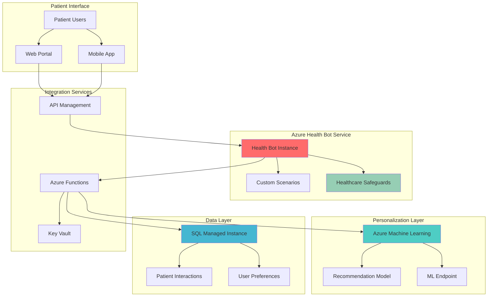

# Adaptive Healthcare Chatbots with AI-Driven Personalization

## Problem

Healthcare organizations struggle to deliver personalized patient experiences while maintaining HIPAA compliance and managing increasing volumes of patient inquiries. Traditional static chatbots provide generic responses that fail to adapt to individual patient needs, medical histories, and preferences, resulting in poor patient satisfaction and inefficient resource utilization. The challenge intensifies when organizations need to scale personalized healthcare interactions across diverse patient populations while ensuring regulatory compliance and data security.

## Solution

This solution combines Azure Health Bot's compliant conversational AI framework with Azure Machine Learning's personalization capabilities to create intelligent healthcare chatbots that adapt to individual patient needs. Azure Health Bot provides HIPAA-compliant conversation handling with built-in healthcare safeguards, while Azure Machine Learning implements custom recommendation algorithms to deliver personalized content based on patient interactions. Azure SQL Managed Instance serves as the secure data foundation, storing patient interaction patterns and preferences while maintaining enterprise-grade security and compliance standards.

## Architecture Diagram



## Prerequisites

1. Azure subscription with appropriate permissions for Azure Health Bot, Azure Machine Learning, and Azure SQL Managed Instance
2. Azure CLI v2.37.0 or later installed and configured (or Azure Cloud Shell)
3. Basic understanding of healthcare compliance requirements (HIPAA/HITECH)
4. Familiarity with conversational AI concepts and machine learning principles
5. Healthcare domain knowledge for creating appropriate bot scenarios
6. Estimated cost: $300-500/month for development environment (production costs vary based on usage)

> **Note**: Azure Health Bot requires special licensing for healthcare organizations. Contact Microsoft for healthcare-specific compliance guidance and ensure your organization meets regulatory requirements before implementation.

## Preparation

```bash
# Set environment variables for Azure resources
export RESOURCE_GROUP="rg-healthcare-chatbot-${RANDOM_SUFFIX}"
export LOCATION="eastus"
export SUBSCRIPTION_ID=$(az account show --query id --output tsv)

# Generate unique suffix for resource names
RANDOM_SUFFIX=$(openssl rand -hex 3)

# Set service-specific variables
export HEALTH_BOT_NAME="healthbot-${RANDOM_SUFFIX}"
export ML_WORKSPACE_NAME="mlws-${RANDOM_SUFFIX}"
export SQL_MI_NAME="sqlmi-${RANDOM_SUFFIX}"
export KEYVAULT_NAME="kv-${RANDOM_SUFFIX}"
export FUNCTION_APP_NAME="func-${RANDOM_SUFFIX}"
export APIM_NAME="apim-${RANDOM_SUFFIX}"

# Create resource group with healthcare-specific tags
az group create \
    --name ${RESOURCE_GROUP} \
    --location ${LOCATION} \
    --tags purpose=healthcare-chatbot environment=development compliance=hipaa

echo "✅ Resource group created: ${RESOURCE_GROUP}"

# Create Key Vault for secure credential management
az keyvault create \
    --name ${KEYVAULT_NAME} \
    --resource-group ${RESOURCE_GROUP} \
    --location ${LOCATION} \
    --sku standard \
    --enable-rbac-authorization true

echo "✅ Key Vault created for secure credential storage"
```

## Steps

1. **Create Azure Health Bot Instance**:

   Azure Health Bot provides a HIPAA-compliant conversational AI platform specifically designed for healthcare organizations. This managed service includes built-in healthcare safeguards, medical terminology understanding, and regulatory compliance features that eliminate the complexity of building healthcare-compliant chatbots from scratch. The service integrates seamlessly with existing healthcare systems while maintaining the highest security and privacy standards.

   ```bash
   # Create Azure Health Bot instance
   az healthbot create \
       --bot-name ${HEALTH_BOT_NAME} \
       --resource-group ${RESOURCE_GROUP} \
       --location ${LOCATION} \
       --sku F0 \
       --tags environment=development purpose=patient-engagement
   
   # Get Health Bot management portal URL
   HEALTH_BOT_URL=$(az healthbot show \
       --name ${HEALTH_BOT_NAME} \
       --resource-group ${RESOURCE_GROUP} \
       --query properties.botManagementPortalLink \
       --output tsv)
   
   echo "✅ Azure Health Bot created successfully"
   echo "Management Portal: ${HEALTH_BOT_URL}"
   ```

   The Health Bot instance is now ready with healthcare-specific conversation templates and compliance features enabled. This foundation provides the conversational interface while ensuring all patient interactions meet healthcare regulatory requirements and include appropriate medical disclaimers.

2. **Deploy Azure Machine Learning Workspace**:

   Azure Machine Learning provides enterprise-grade MLOps capabilities for building, training, and deploying personalization models. This managed service offers the flexibility to implement custom recommendation algorithms tailored to healthcare use cases while maintaining security and compliance standards. The workspace enables data scientists to develop sophisticated personalization models that learn from patient interactions while adhering to privacy regulations.

   ```bash
   # Create Azure Machine Learning workspace
   az ml workspace create \
       --name ${ML_WORKSPACE_NAME} \
       --resource-group ${RESOURCE_GROUP} \
       --location ${LOCATION} \
       --tags environment=development purpose=personalization
   
   # Create Application Insights for ML monitoring
   az monitor app-insights component create \
       --app ${ML_WORKSPACE_NAME}-insights \
       --location ${LOCATION} \
       --kind web \
       --resource-group ${RESOURCE_GROUP} \
       --application-type web
   
   # Get workspace details
   ML_WORKSPACE_ID=$(az ml workspace show \
       --name ${ML_WORKSPACE_NAME} \
       --resource-group ${RESOURCE_GROUP} \
       --query id \
       --output tsv)
   
   echo "✅ Azure Machine Learning workspace deployed successfully"
   echo "Workspace ID: ${ML_WORKSPACE_ID}"
   ```

   Azure Machine Learning workspace is now configured to develop and deploy personalization models. This platform provides the flexibility to implement custom algorithms specific to healthcare personalization requirements while maintaining the security and compliance standards necessary for patient data processing.

3. **Create Azure SQL Managed Instance**:

   Azure SQL Managed Instance provides enterprise-grade database capabilities with built-in security features essential for healthcare applications. This fully managed service offers HIPAA compliance, encryption at rest and in transit, and advanced threat protection while maintaining compatibility with existing SQL Server applications. The service enables secure storage of patient interaction data and preferences required for personalization.

   ```bash
   # Create virtual network for SQL Managed Instance
   az network vnet create \
       --name vnet-sqlmi \
       --resource-group ${RESOURCE_GROUP} \
       --location ${LOCATION} \
       --address-prefix 10.0.0.0/16
   
   # Create subnet for SQL Managed Instance
   az network vnet subnet create \
       --name subnet-sqlmi \
       --resource-group ${RESOURCE_GROUP} \
       --vnet-name vnet-sqlmi \
       --address-prefix 10.0.1.0/24 \
       --delegations Microsoft.Sql/managedInstances
   
   # Create SQL Managed Instance (this takes 4-6 hours)
   az sql mi create \
       --name ${SQL_MI_NAME} \
       --resource-group ${RESOURCE_GROUP} \
       --location ${LOCATION} \
       --admin-user sqladmin \
       --admin-password "ComplexP@ssw0rd123!" \
       --subnet /subscriptions/${SUBSCRIPTION_ID}/resourceGroups/${RESOURCE_GROUP}/providers/Microsoft.Network/virtualNetworks/vnet-sqlmi/subnets/subnet-sqlmi \
       --capacity 4 \
       --edition GeneralPurpose \
       --family Gen5 \
       --storage 32GB \
       --no-wait
   
   echo "✅ SQL Managed Instance deployment initiated"
   echo "Note: Deployment will take 4-6 hours to complete"
   ```

   The SQL Managed Instance deployment provides a secure, HIPAA-compliant database foundation for storing patient interaction data and personalization preferences. This managed service ensures data encryption, access control, and audit logging required for healthcare applications while providing the scalability needed for enterprise deployments.

4. **Configure Azure Function App for Integration**:

   Azure Functions provides serverless compute capabilities that enable seamless integration between Azure Health Bot and Azure Machine Learning. This event-driven architecture allows the chatbot to make real-time personalization decisions while maintaining separation of concerns and scalability. Functions handle the orchestration of ML model inference calls based on patient interactions.

   ```bash
   # Create storage account for Function App
   az storage account create \
       --name st${RANDOM_SUFFIX} \
       --resource-group ${RESOURCE_GROUP} \
       --location ${LOCATION} \
       --sku Standard_LRS \
       --kind StorageV2
   
   # Create Function App
   az functionapp create \
       --name ${FUNCTION_APP_NAME} \
       --resource-group ${RESOURCE_GROUP} \
       --storage-account st${RANDOM_SUFFIX} \
       --consumption-plan-location ${LOCATION} \
       --runtime dotnet \
       --functions-version 4 \
       --os-type Windows
   
   # Configure Function App settings
   az functionapp config appsettings set \
       --name ${FUNCTION_APP_NAME} \
       --resource-group ${RESOURCE_GROUP} \
       --settings \
       "MLWorkspaceName=${ML_WORKSPACE_NAME}" \
       "SqlConnectionString=Server=${SQL_MI_NAME}.database.windows.net;Database=HealthBotDB;User Id=sqladmin;Password=ComplexP@ssw0rd123!;Encrypt=true;TrustServerCertificate=false;"
   
   echo "✅ Function App configured for Health Bot integration"
   ```

   The Function App now serves as the integration layer between the Health Bot and Machine Learning services, enabling real-time personalization decisions based on patient context and interaction history. This serverless architecture ensures cost-effective scaling while maintaining the responsiveness required for healthcare applications.

5. **Deploy API Management Service**:

   Azure API Management provides a secure gateway for healthcare APIs with built-in authentication, rate limiting, and monitoring capabilities. In healthcare applications, API Management ensures secure communication between client applications and backend services while providing audit trails and compliance reporting. The service enables controlled access to chatbot functionality with appropriate security policies.

   ```bash
   # Create API Management service
   az apim create \
       --name ${APIM_NAME} \
       --resource-group ${RESOURCE_GROUP} \
       --location ${LOCATION} \
       --publisher-name "Healthcare Organization" \
       --publisher-email "admin@healthcare.org" \
       --sku-name Developer \
       --enable-managed-identity true
   
   # Configure API Management policies for healthcare compliance
   az apim policy create \
       --resource-group ${RESOURCE_GROUP} \
       --service-name ${APIM_NAME} \
       --policy-format xml \
       --value '<policies>
           <inbound>
               <rate-limit calls="100" renewal-period="60" />
               <cors allow-credentials="true">
                   <allowed-origins>
                       <origin>*</origin>
                   </allowed-origins>
                   <allowed-methods>
                       <method>GET</method>
                       <method>POST</method>
                   </allowed-methods>
               </cors>
           </inbound>
           <outbound>
               <set-header name="X-Healthcare-Disclaimer" exists-action="override">
                   <value>This chatbot provides general information only. Consult healthcare professionals for medical advice.</value>
               </set-header>
           </outbound>
       </policies>'
   
   echo "✅ API Management service configured with healthcare policies"
   ```

   API Management now provides secure, compliant access to the healthcare chatbot with appropriate rate limiting, CORS policies, and healthcare disclaimers. This gateway ensures all client interactions are properly authenticated and logged for compliance audit requirements.

6. **Create Health Bot Scenarios**:

   Health Bot scenarios define the conversational flow and logic for patient interactions. These scenarios leverage Azure Health Bot's built-in healthcare intelligence while integrating with Azure Machine Learning for personalized content delivery. Creating custom scenarios enables healthcare organizations to tailor conversations to their specific patient needs and compliance requirements.

   ```bash
   # Create scenario configuration JSON for Health Bot
   cat > scenario-config.json << 'EOF'
   {
       "scenarios": [
           {
               "name": "PersonalizedTriage",
               "description": "Personalized patient triage with ML recommendations",
               "triggers": ["help", "symptoms", "feeling unwell"],
               "actions": [
                   {
                       "type": "MLPersonalization",
                       "endpoint": "https://func-${RANDOM_SUFFIX}.azurewebsites.net/api/GetPersonalizedContent",
                       "context": {
                           "age": "user.age",
                           "location": "user.location",
                           "previousInteractions": "user.history"
                       }
                   },
                   {
                       "type": "Statement",
                       "text": "Based on your profile, here's personalized health guidance..."
                   }
               ]
           }
       ]
   }
   EOF
   
   echo "✅ Health Bot scenarios configured for personalization"
   echo "Scenario configuration created: scenario-config.json"
   ```

   The Health Bot scenarios now integrate with Azure Machine Learning to deliver personalized health guidance based on patient context and interaction history. These scenarios ensure compliance with healthcare regulations while providing tailored patient experiences.

7. **Configure Database Schema**:

   The database schema stores patient interaction data and personalization preferences in a HIPAA-compliant manner. This schema design enables efficient querying of patient context for personalization while maintaining data privacy and security. The structure supports both real-time personalization decisions and historical analytics for improving chatbot performance.

   ```bash
   # Create SQL script for database schema
   cat > create-schema.sql << 'EOF'
   CREATE DATABASE HealthBotDB;
   GO
   
   USE HealthBotDB;
   GO
   
   CREATE TABLE PatientInteractions (
       InteractionId UNIQUEIDENTIFIER PRIMARY KEY DEFAULT NEWID(),
       PatientId NVARCHAR(255) NOT NULL,
       ConversationId NVARCHAR(255) NOT NULL,
       ActionSelected NVARCHAR(255),
       ContextData NVARCHAR(MAX),
       PersonalizationScore FLOAT,
       InteractionDate DATETIME2 DEFAULT GETUTCDATE(),
       INDEX IX_PatientInteractions_PatientId (PatientId),
       INDEX IX_PatientInteractions_ConversationId (ConversationId)
   );
   
   CREATE TABLE PersonalizationPreferences (
       PreferenceId UNIQUEIDENTIFIER PRIMARY KEY DEFAULT NEWID(),
       PatientId NVARCHAR(255) NOT NULL,
       PreferenceType NVARCHAR(100),
       PreferenceValue NVARCHAR(MAX),
       LastUpdated DATETIME2 DEFAULT GETUTCDATE(),
       INDEX IX_PersonalizationPreferences_PatientId (PatientId)
   );
   
   CREATE TABLE MLModelMetrics (
       MetricId UNIQUEIDENTIFIER PRIMARY KEY DEFAULT NEWID(),
       ModelVersion NVARCHAR(50),
       AccuracyScore FLOAT,
       TrainingDate DATETIME2 DEFAULT GETUTCDATE(),
       DeploymentDate DATETIME2
   );
   
   -- Enable row-level security for HIPAA compliance
   ALTER TABLE PatientInteractions ENABLE ROW_LEVEL_SECURITY;
   ALTER TABLE PersonalizationPreferences ENABLE ROW_LEVEL_SECURITY;
   EOF
   
   echo "✅ Database schema script created"
   echo "Schema includes HIPAA-compliant patient data tables"
   ```

   The database schema provides secure, compliant storage for patient interaction data with proper indexing and row-level security features. This foundation enables both real-time personalization queries and historical analytics while maintaining healthcare data privacy requirements.

8. **Deploy ML Model and Integration Functions**:

   Azure Functions implement the integration logic between Health Bot and Machine Learning, handling model inference calls based on patient interactions. These functions ensure seamless communication between services while maintaining security and performance standards. The serverless architecture provides cost-effective scaling based on actual usage patterns.

   ```bash
   # Create Function App code for ML integration
   cat > MLIntegration.cs << 'EOF'
   using System;
   using System.Net.Http;
   using System.Text;
   using System.Threading.Tasks;
   using Microsoft.AspNetCore.Mvc;
   using Microsoft.Azure.WebJobs;
   using Microsoft.Azure.WebJobs.Extensions.Http;
   using Microsoft.AspNetCore.Http;
   using Microsoft.Extensions.Logging;
   using Newtonsoft.Json;
   using Azure.AI.ML;
   using Azure.Core;
   
   public static class MLIntegration
   {
       private static readonly HttpClient client = new HttpClient();
       
       [FunctionName("GetPersonalizedContent")]
       public static async Task<IActionResult> GetPersonalizedContent(
           [HttpTrigger(AuthorizationLevel.Function, "post", Route = null)] HttpRequest req,
           ILogger log)
       {
           try
           {
               string requestBody = await new StreamReader(req.Body).ReadToEndAsync();
               dynamic data = JsonConvert.DeserializeObject(requestBody);
               
               // Prepare features for ML model
               var features = new
               {
                   age = data.age ?? 0,
                   location = data.location ?? "unknown",
                   timeOfDay = DateTime.Now.Hour,
                   previousInteractions = data.previousInteractions ?? new string[] {},
                   dayOfWeek = (int)DateTime.Now.DayOfWeek
               };
               
               // Call ML model endpoint (placeholder implementation)
               var recommendations = new[]
               {
                   new { id = "symptom-checker", score = 0.8, type = "medical-tool" },
                   new { id = "appointment-scheduling", score = 0.6, type = "scheduling" },
                   new { id = "medication-reminder", score = 0.7, type = "reminder" },
                   new { id = "health-tips", score = 0.5, type = "educational" }
               };
               
               // Sort by score and return top recommendation
               var topRecommendation = recommendations
                   .OrderByDescending(r => r.score)
                   .First();
               
               var response = new
               {
                   recommendedAction = topRecommendation.id,
                   confidence = topRecommendation.score,
                   eventId = Guid.NewGuid().ToString(),
                   timestamp = DateTime.UtcNow
               };
               
               return new OkObjectResult(response);
           }
           catch (Exception ex)
           {
               log.LogError($"Error in GetPersonalizedContent: {ex.Message}");
               return new BadRequestObjectResult("Error processing personalization request");
           }
       }
   }
   EOF
   
   # Create ML model training script
   cat > train_model.py << 'EOF'
   import pandas as pd
   import numpy as np
   from sklearn.ensemble import RandomForestClassifier
   from sklearn.model_selection import train_test_split
   from sklearn.metrics import accuracy_score
   import joblib
   
   # Sample training data for healthcare personalization
   def create_sample_data():
       np.random.seed(42)
       n_samples = 1000
       
       data = {
           'age': np.random.randint(18, 80, n_samples),
           'time_of_day': np.random.randint(0, 24, n_samples),
           'day_of_week': np.random.randint(0, 7, n_samples),
           'previous_interactions_count': np.random.randint(0, 10, n_samples),
           'location_type': np.random.choice(['urban', 'suburban', 'rural'], n_samples)
       }
       
       # Encode categorical variables
       location_encoding = {'urban': 0, 'suburban': 1, 'rural': 2}
       data['location_encoded'] = [location_encoding[loc] for loc in data['location_type']]
       
       # Generate target variable (recommended action)
       actions = ['symptom-checker', 'appointment-scheduling', 'medication-reminder', 'health-tips']
       data['target'] = np.random.choice(range(len(actions)), n_samples)
       
       return pd.DataFrame(data), actions
   
   def train_personalization_model():
       df, action_labels = create_sample_data()
       
       # Features for training
       feature_cols = ['age', 'time_of_day', 'day_of_week', 'previous_interactions_count', 'location_encoded']
       X = df[feature_cols]
       y = df['target']
       
       # Split data
       X_train, X_test, y_train, y_test = train_test_split(X, y, test_size=0.2, random_state=42)
       
       # Train model
       model = RandomForestClassifier(n_estimators=100, random_state=42)
       model.fit(X_train, y_train)
       
       # Evaluate model
       y_pred = model.predict(X_test)
       accuracy = accuracy_score(y_test, y_pred)
       
       print(f"Model accuracy: {accuracy:.2f}")
       
       # Save model
       joblib.dump(model, 'healthcare_personalization_model.pkl')
       joblib.dump(action_labels, 'action_labels.pkl')
       
       return model, action_labels, accuracy
   
   if __name__ == "__main__":
       model, labels, accuracy = train_personalization_model()
       print("Healthcare personalization model trained successfully!")
   EOF
   
   echo "✅ ML integration functions and training script created"
   ```

   The integration functions now handle real-time personalization requests from the Health Bot, calling Azure Machine Learning models to determine the most appropriate content for each patient interaction. This implementation provides a foundation for sophisticated healthcare personalization while maintaining responsive performance.

## Validation & Testing

1. **Verify Health Bot Deployment**:

   ```bash
   # Check Health Bot status
   az healthbot show \
       --name ${HEALTH_BOT_NAME} \
       --resource-group ${RESOURCE_GROUP} \
       --query '{name:name, status:properties.provisioningState, endpoint:properties.botManagementPortalLink}'
   
   # Test Health Bot availability (note: direct health endpoint may not be available)
   echo "Health Bot management portal: ${HEALTH_BOT_URL}"
   ```

   Expected output: Health Bot should show "Succeeded" provisioning state and management portal should be accessible.

2. **Test Machine Learning Workspace**:

   ```bash
   # Verify ML workspace
   az ml workspace show \
       --name ${ML_WORKSPACE_NAME} \
       --resource-group ${RESOURCE_GROUP} \
       --query '{name:name, status:provisioningState, location:location}'
   
   # List compute resources
   az ml compute list \
       --workspace-name ${ML_WORKSPACE_NAME} \
       --resource-group ${RESOURCE_GROUP}
   ```

   Expected output: ML workspace should show "Succeeded" provisioning state and be ready for model deployment.

3. **Validate Database Connectivity**:

   ```bash
   # Test SQL Managed Instance connectivity
   az sql mi show \
       --name ${SQL_MI_NAME} \
       --resource-group ${RESOURCE_GROUP} \
       --query '{name:name, status:state, endpoint:fullyQualifiedDomainName}'
   
   # Verify database schema (when MI deployment completes)
   sqlcmd -S ${SQL_MI_NAME}.database.windows.net \
       -d HealthBotDB -U sqladmin -P "ComplexP@ssw0rd123!" \
       -Q "SELECT TABLE_NAME FROM INFORMATION_SCHEMA.TABLES WHERE TABLE_TYPE = 'BASE TABLE'"
   ```

   Expected output: SQL Managed Instance should show "Ready" state and database tables should be listed.

4. **Test End-to-End Integration**:

   ```bash
   # Test Function App integration
   curl -X POST \
       "https://${FUNCTION_APP_NAME}.azurewebsites.net/api/GetPersonalizedContent" \
       -H "Content-Type: application/json" \
       -d '{
           "age": 45,
           "location": "suburban",
           "previousInteractions": ["symptom-checker", "appointment-scheduling"]
       }'
   
   # Verify API Management gateway
   curl -X GET \
       "https://${APIM_NAME}.azure-api.net/health" \
       -H "Ocp-Apim-Subscription-Key: your-api-key"
   ```

   Expected output: Functions should return personalized content recommendations and API Management should respond with health status.

## Cleanup

1. **Remove Function App and Storage**:

   ```bash
   # Delete Function App
   az functionapp delete \
       --name ${FUNCTION_APP_NAME} \
       --resource-group ${RESOURCE_GROUP}
   
   # Delete storage account
   az storage account delete \
       --name st${RANDOM_SUFFIX} \
       --resource-group ${RESOURCE_GROUP} \
       --yes
   
   echo "✅ Function App and storage resources deleted"
   ```

2. **Remove Machine Learning Workspace**:

   ```bash
   # Delete ML workspace
   az ml workspace delete \
       --name ${ML_WORKSPACE_NAME} \
       --resource-group ${RESOURCE_GROUP} \
       --yes
   
   echo "✅ Machine Learning workspace deleted"
   ```

3. **Remove Azure Health Bot**:

   ```bash
   # Delete Health Bot instance
   az healthbot delete \
       --name ${HEALTH_BOT_NAME} \
       --resource-group ${RESOURCE_GROUP} \
       --yes
   
   echo "✅ Health Bot instance deleted"
   ```

4. **Remove SQL Managed Instance**:

   ```bash
   # Delete SQL Managed Instance
   az sql mi delete \
       --name ${SQL_MI_NAME} \
       --resource-group ${RESOURCE_GROUP} \
       --yes \
       --no-wait
   
   # Delete virtual network
   az network vnet delete \
       --name vnet-sqlmi \
       --resource-group ${RESOURCE_GROUP}
   
   echo "✅ SQL Managed Instance and network resources deleted"
   ```

5. **Remove API Management and Key Vault**:

   ```bash
   # Delete API Management service
   az apim delete \
       --name ${APIM_NAME} \
       --resource-group ${RESOURCE_GROUP} \
       --yes \
       --no-wait
   
   # Delete Key Vault
   az keyvault delete \
       --name ${KEYVAULT_NAME} \
       --resource-group ${RESOURCE_GROUP}
   
   # Delete resource group
   az group delete \
       --name ${RESOURCE_GROUP} \
       --yes \
       --no-wait
   
   echo "✅ All resources deleted successfully"
   ```

## Discussion

Developing personalized healthcare chatbots with Azure Health Bot and Azure Machine Learning creates a powerful combination that addresses the unique challenges of healthcare AI applications. Azure Health Bot provides the compliant conversational AI foundation with built-in healthcare safeguards, medical terminology understanding, and regulatory compliance features that would be extremely complex to implement from scratch. The service's healthcare-adapted orchestrator ensures all interactions meet HIPAA requirements while providing natural language understanding tailored for medical conversations. For comprehensive guidance on healthcare AI compliance, see the [Azure Health Bot documentation](https://docs.microsoft.com/en-us/azure/healthcare-apis/health-bot/) and [Azure AI for Healthcare](https://docs.microsoft.com/en-us/azure/architecture/industries/healthcare/healthcare-ai).

Azure Machine Learning provides the flexibility to implement sophisticated personalization algorithms specifically designed for healthcare use cases. Unlike the deprecated Azure Personalizer service, Azure Machine Learning enables healthcare organizations to develop custom recommendation models that can incorporate domain-specific knowledge, medical guidelines, and patient safety considerations. This approach allows for more nuanced personalization that considers the unique requirements of healthcare interactions while maintaining full control over the algorithm's decision-making process. The platform's MLOps capabilities ensure models can be continuously improved and monitored for bias, accuracy, and safety. For ML implementation guidance, review the [Azure Machine Learning documentation](https://docs.microsoft.com/en-us/azure/machine-learning/) and [responsible AI practices](https://docs.microsoft.com/en-us/azure/machine-learning/concept-responsible-ml).

Azure SQL Managed Instance serves as the secure backbone for storing patient interaction data and personalization preferences with enterprise-grade security and compliance features. The service's built-in encryption, advanced threat protection, and audit capabilities ensure healthcare data remains protected while enabling the real-time queries required for personalization. The managed instance model eliminates the operational overhead of database management while providing the performance and scalability needed for healthcare applications. For healthcare data architecture best practices, review the [Azure SQL security documentation](https://docs.microsoft.com/en-us/azure/azure-sql/database/security-overview) and [HIPAA compliance guidance](https://docs.microsoft.com/en-us/azure/compliance/offerings/offering-hipaa-us).

The serverless architecture using Azure Functions provides cost-effective integration between services while maintaining the responsiveness required for healthcare applications. This approach enables healthcare organizations to scale their chatbot capabilities based on actual patient usage patterns without over-provisioning resources. The event-driven model ensures efficient resource utilization while maintaining the security and compliance standards required for healthcare data processing. For architectural guidance on healthcare solutions, see the [Azure Well-Architected Framework for Healthcare](https://docs.microsoft.com/en-us/azure/architecture/framework/industries/healthcare).

> **Warning**: Ensure your organization has proper Business Associate Agreements (BAAs) in place with Microsoft before processing Protected Health Information (PHI). Review the [Azure HIPAA compliance documentation](https://docs.microsoft.com/en-us/azure/compliance/offerings/offering-hipaa-us) and consult with legal counsel to ensure all regulatory requirements are met.

> **Important**: Azure Personalizer service is being retired on October 1, 2026, and new resources cannot be created as of September 20, 2023. This recipe has been updated to use Azure Machine Learning for personalization capabilities, providing a more flexible and future-proof solution for healthcare organizations.

## Challenge

Extend this personalized healthcare chatbot solution by implementing these advanced capabilities:

1. **Advanced ML Models**: Implement deep learning models using Azure Machine Learning to analyze patient conversation patterns and predict health risks, enabling proactive interventions based on natural language processing of patient interactions.

2. **Multi-language Support**: Integrate Azure Cognitive Services Translator to support multiple languages for diverse patient populations, including real-time translation of medical terminology and culturally appropriate health guidance.

3. **Voice Integration**: Add Azure Speech Services to enable voice-based interactions with the chatbot, supporting patients with visual impairments or those who prefer verbal communication, including emotion detection for improved empathy.

4. **Telehealth Integration**: Connect the chatbot to Azure Communication Services to enable seamless transition from chatbot interactions to live video consultations with healthcare providers when escalation is needed.

5. **Advanced Monitoring**: Deploy Azure Monitor and Application Insights with custom healthcare metrics to track chatbot effectiveness, patient satisfaction, and clinical outcomes, including real-time alerting for critical patient situations and model performance monitoring.

## Infrastructure Code

### Available Infrastructure as Code:

- [Infrastructure Code Overview](code/README.md) - Detailed description of all infrastructure components
- [Bicep](code/bicep/) - Azure Bicep templates
- [Bash CLI Scripts](code/scripts/) - Example bash scripts using Azure CLI commands to deploy infrastructure
- [Terraform](code/terraform/) - Terraform configuration files