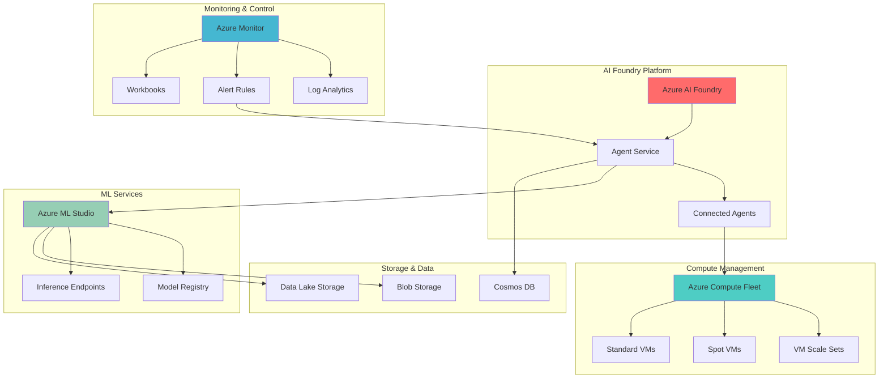

# Adaptive ML Model Scaling with Azure AI Foundry and Compute Fleet

## Problem

Organizations running ML workloads face significant challenges in dynamically scaling compute resources to match fluctuating demand patterns. Traditional approaches either overprovision expensive compute resources leading to waste, or underprovision causing performance bottlenecks during peak usage periods. Without intelligent orchestration, teams struggle to optimize costs while maintaining service level agreements across diverse ML model training and inference workloads.

## Solution

Azure AI Foundry Agent Service provides intelligent orchestration capabilities that automatically scale ML compute resources using Azure Compute Fleet based on real-time demand patterns. This solution creates adaptive agents that monitor workload metrics, analyze capacity requirements, and dynamically provision or deprovision compute resources across multiple VM series and availability zones, ensuring optimal cost-performance balance while maintaining high availability.

## Architecture Diagram



## Prerequisites

1. Azure subscription with appropriate permissions for AI Foundry, Compute Fleet, and Machine Learning
2. Azure CLI v2.60.0 or later installed and configured
3. Understanding of machine learning workflows and Azure compute services
4. Familiarity with Azure AI Foundry and agent orchestration concepts
5. Estimated cost: $50-150 for testing resources (varies by region and compute usage)

> **Note**: This recipe requires preview features. Ensure your subscription has access to Azure AI Foundry and Compute Fleet preview services before proceeding.

## Preparation

```bash
# Set environment variables for Azure resources
export RESOURCE_GROUP="rg-ml-adaptive-scaling"
export LOCATION="eastus"
export SUBSCRIPTION_ID=$(az account show --query id --output tsv)
export TENANT_ID=$(az account show --query tenantId --output tsv)

# Generate unique suffix for resource names
RANDOM_SUFFIX=$(openssl rand -hex 3)
export AI_FOUNDRY_NAME="aif-adaptive-${RANDOM_SUFFIX}"
export COMPUTE_FLEET_NAME="cf-ml-scaling-${RANDOM_SUFFIX}"
export ML_WORKSPACE_NAME="mlw-scaling-${RANDOM_SUFFIX}"
export STORAGE_ACCOUNT_NAME="stmlscaling${RANDOM_SUFFIX}"
export KEY_VAULT_NAME="kv-ml-${RANDOM_SUFFIX}"
export LOG_ANALYTICS_NAME="law-ml-${RANDOM_SUFFIX}"

# Create resource group
az group create \
    --name ${RESOURCE_GROUP} \
    --location ${LOCATION} \
    --tags purpose=ml-scaling environment=demo

echo "✅ Resource group created: ${RESOURCE_GROUP}"

# Register required resource providers
az provider register --namespace Microsoft.MachineLearningServices
az provider register --namespace Microsoft.Compute
az provider register --namespace Microsoft.CognitiveServices
az provider register --namespace Microsoft.OperationalInsights

echo "✅ Resource providers registered"
```

## Steps

1. **Create Azure AI Foundry Hub and Project**:

   Azure AI Foundry serves as the central orchestration platform for intelligent agent management. The Agent Service provides production-ready infrastructure for deploying ML scaling agents that can make autonomous decisions about compute resource allocation. This foundational step establishes the secure, governed environment needed for enterprise-scale ML operations.

   ```bash
   # Create AI Foundry hub
   az ml workspace create \
       --resource-group ${RESOURCE_GROUP} \
       --name ${AI_FOUNDRY_NAME} \
       --location ${LOCATION} \
       --kind Hub \
       --description "AI Foundry Hub for ML Scaling"
   
   # Create project within the hub
   az ml workspace create \
       --resource-group ${RESOURCE_GROUP} \
       --name "project-${AI_FOUNDRY_NAME}" \
       --location ${LOCATION} \
       --kind Project \
       --hub-id "/subscriptions/${SUBSCRIPTION_ID}/resourceGroups/${RESOURCE_GROUP}/providers/Microsoft.MachineLearningServices/workspaces/${AI_FOUNDRY_NAME}"
   
   echo "✅ AI Foundry hub and project created"
   ```

   The AI Foundry hub now provides centralized governance and security for all ML agents. The project workspace enables isolated development and deployment of scaling agents while maintaining enterprise compliance and observability standards.

2. **Create Machine Learning Workspace with Compute Fleet Integration**:

   Azure Machine Learning workspace provides the foundation for ML model development and deployment. Integrating with Compute Fleet enables dynamic scaling capabilities that automatically adjust compute resources based on training and inference demands. This integration supports both spot and standard VM allocation strategies for cost optimization.

   ```bash
   # Create ML workspace
   az ml workspace create \
       --resource-group ${RESOURCE_GROUP} \
       --name ${ML_WORKSPACE_NAME} \
       --location ${LOCATION} \
       --storage-account "/subscriptions/${SUBSCRIPTION_ID}/resourceGroups/${RESOURCE_GROUP}/providers/Microsoft.Storage/storageAccounts/${STORAGE_ACCOUNT_NAME}" \
       --key-vault "/subscriptions/${SUBSCRIPTION_ID}/resourceGroups/${RESOURCE_GROUP}/providers/Microsoft.KeyVault/vaults/${KEY_VAULT_NAME}"
   
   # Create compute fleet for dynamic scaling
   az vm fleet create \
       --resource-group ${RESOURCE_GROUP} \
       --name ${COMPUTE_FLEET_NAME} \
       --location ${LOCATION} \
       --vm-sizes-profile '[
         {
           "name": "Standard_D4s_v3",
           "rank": 1
         },
         {
           "name": "Standard_D8s_v3", 
           "rank": 2
         },
         {
           "name": "Standard_E4s_v3",
           "rank": 3
         }
       ]' \
       --spot-priority-profile '{
         "capacity": 20,
         "minCapacity": 5,
         "maxPricePerVM": 0.10,
         "evictionPolicy": "Deallocate",
         "allocationStrategy": "PriceCapacityOptimized"
       }' \
       --regular-priority-profile '{
         "capacity": 10,
         "minCapacity": 2,
         "allocationStrategy": "LowestPrice"
       }'
   
   echo "✅ ML workspace and compute fleet configured"
   ```

   The compute fleet is now configured with intelligent allocation strategies that prioritize cost-effective spot instances while maintaining guaranteed capacity through regular VMs. This hybrid approach ensures consistent performance while optimizing costs for ML workloads.

3. **Deploy AI Foundry Agent Service for Scaling Orchestration**:

   The Agent Service orchestrates complex multi-agent workflows that monitor ML workload patterns and make intelligent scaling decisions. These agents leverage Azure Monitor metrics to assess compute demand and automatically adjust Compute Fleet capacity to maintain optimal performance while minimizing costs.

   ```bash
   # Create agent service configuration
   cat > agent-config.json << 'EOF'
   {
     "name": "ml-scaling-agent",
     "description": "Intelligent ML compute scaling orchestrator",
     "model": {
       "type": "gpt-4",
       "version": "2024-02-01",
       "parameters": {
         "temperature": 0.3,
         "maxTokens": 2000
       }
     },
     "instructions": "You are an expert ML infrastructure agent responsible for optimizing compute resource allocation. Monitor workload metrics, analyze capacity requirements, and make scaling decisions to maintain performance while minimizing costs. Always consider spot instance availability and pricing trends.",
     "tools": [
       {
         "type": "azure_monitor",
         "name": "workload_monitor",
         "configuration": {
           "workspace_id": "${LOG_ANALYTICS_NAME}",
           "metrics": ["cpu_utilization", "memory_usage", "queue_depth", "inference_latency"]
         }
       },
       {
         "type": "compute_fleet",
         "name": "fleet_manager",
         "configuration": {
           "fleet_id": "${COMPUTE_FLEET_NAME}",
           "scaling_policies": {
             "scale_up_threshold": 0.75,
             "scale_down_threshold": 0.25,
             "cooldown_period": 300
           }
         }
       }
     ],
     "connectedAgents": [
       {
         "name": "cost-optimizer",
         "role": "Analyze cost patterns and recommend optimal VM mix"
       },
       {
         "name": "performance-monitor", 
         "role": "Track ML model performance and SLA compliance"
       }
     ]
   }
   EOF
   
   # Deploy agent service
   az ml agent create \
       --resource-group ${RESOURCE_GROUP} \
       --workspace-name ${AI_FOUNDRY_NAME} \
       --name ml-scaling-agent \
       --file agent-config.json
   
   echo "✅ AI Foundry Agent Service deployed"
   ```

   The Agent Service is now active with intelligent orchestration capabilities. The connected agents work collaboratively to optimize compute allocation, monitor performance metrics, and ensure cost-effective scaling decisions across your ML infrastructure.

4. **Configure Azure Monitor for Workload Intelligence**:

   Azure Monitor provides comprehensive observability for ML workloads, enabling agents to make data-driven scaling decisions. Log Analytics workspaces collect performance metrics, while custom queries identify scaling triggers and optimization opportunities. This monitoring foundation is essential for autonomous scaling operations.

   ```bash
   # Create Log Analytics workspace
   az monitor log-analytics workspace create \
       --resource-group ${RESOURCE_GROUP} \
       --workspace-name ${LOG_ANALYTICS_NAME} \
       --location ${LOCATION} \
       --sku pergb2018
   
   # Configure monitoring for ML workspace
   az ml workspace update \
       --resource-group ${RESOURCE_GROUP} \
       --name ${ML_WORKSPACE_NAME} \
       --application-insights "/subscriptions/${SUBSCRIPTION_ID}/resourceGroups/${RESOURCE_GROUP}/providers/Microsoft.Insights/components/ai-${ML_WORKSPACE_NAME}"
   
   # Create custom workbook for scaling metrics
   cat > scaling-workbook.json << 'EOF'
   {
     "version": "Notebook/1.0",
     "items": [
       {
         "type": 9,
         "content": {
           "version": "KqlParameterItem/1.0",
           "parameters": [
             {
               "id": "timeRange",
               "version": "KqlParameterItem/1.0",
               "name": "TimeRange",
               "type": 4,
               "value": {
                 "durationMs": 3600000
               }
             }
           ]
         }
       },
       {
         "type": 3,
         "content": {
           "version": "KqlItem/1.0",
           "query": "AzureMetrics\n| where ResourceProvider == \"MICROSOFT.MACHINELEARNINGSERVICES\"\n| where MetricName in (\"CpuUtilization\", \"MemoryUtilization\")\n| summarize avg(Average) by bin(TimeGenerated, 5m), MetricName\n| render timechart",
           "size": 0,
           "title": "ML Compute Utilization",
           "timeContext": {
             "durationMs": 3600000
           }
         }
       }
     ]
   }
   EOF
   
   # Deploy monitoring workbook
   az monitor workbook create \
       --resource-group ${RESOURCE_GROUP} \
       --name "ML-Scaling-Dashboard" \
       --display-name "ML Adaptive Scaling Dashboard" \
       --description "Comprehensive monitoring for ML compute scaling" \
       --template-data @scaling-workbook.json
   
   echo "✅ Azure Monitor configured with scaling intelligence"
   ```

   The monitoring infrastructure now provides real-time visibility into ML workload patterns. The custom workbook enables operators to visualize scaling decisions and optimize agent configurations based on historical performance data.

5. **Create Intelligent Scaling Policies and Alert Rules**:

   Intelligent scaling policies define the automated responses to changing ML workload demands. These policies integrate with Azure Monitor alerts to trigger agent actions when performance thresholds are exceeded or cost optimization opportunities are identified. This automation ensures consistent, policy-driven scaling behavior.

   ```bash
   # Create scaling policy for training workloads
   cat > training-scaling-policy.json << 'EOF'
   {
     "name": "training-workload-scaling",
     "description": "Dynamic scaling for ML training jobs",
     "triggers": [
       {
         "type": "metric",
         "metric": "queue_depth",
         "threshold": 5,
         "operator": "GreaterThan",
         "action": "scale_up",
         "parameters": {
           "increment": 3,
           "maxCapacity": 50
         }
       },
       {
         "type": "metric", 
         "metric": "cpu_utilization",
         "threshold": 20,
         "operator": "LessThan",
         "duration": "10m",
         "action": "scale_down",
         "parameters": {
           "decrement": 2,
           "minCapacity": 2
         }
       }
     ],
     "constraints": {
       "maxCostPerHour": 100,
       "preferredVMSizes": ["Standard_D4s_v3", "Standard_E4s_v3"],
       "spotInstanceRatio": 0.7
     }
   }
   EOF
   
   # Create alert rule for scaling triggers
   az monitor metrics alert create \
       --resource-group ${RESOURCE_GROUP} \
       --name "ml-scaling-trigger" \
       --description "Triggers agent scaling actions" \
       --scopes "/subscriptions/${SUBSCRIPTION_ID}/resourceGroups/${RESOURCE_GROUP}/providers/Microsoft.MachineLearningServices/workspaces/${ML_WORKSPACE_NAME}" \
       --condition "avg compute_utilization > 75" \
       --window-size 5m \
       --evaluation-frequency 1m \
       --action-group "/subscriptions/${SUBSCRIPTION_ID}/resourceGroups/${RESOURCE_GROUP}/providers/Microsoft.Insights/actionGroups/ml-scaling-actions"
   
   # Deploy scaling policy to agent service
   az ml agent update \
       --resource-group ${RESOURCE_GROUP} \
       --workspace-name ${AI_FOUNDRY_NAME} \
       --name ml-scaling-agent \
       --add-policy @training-scaling-policy.json
   
   echo "✅ Intelligent scaling policies configured"
   ```

   The scaling policies are now active and will automatically trigger agent actions based on real-time workload metrics. These policies ensure consistent scaling behavior while maintaining cost controls and performance guarantees across your ML infrastructure.

6. **Deploy Sample ML Models for Scaling Testing**:

   Sample ML models provide realistic workloads for testing the adaptive scaling system. These models simulate real-world training and inference patterns, enabling validation of agent decision-making and scaling performance. The models also generate the telemetry data needed for continuous optimization.

   ```bash
   # Create sample training script
   cat > train_model.py << 'EOF'
   import mlflow
   import numpy as np
   from sklearn.ensemble import RandomForestClassifier
   from sklearn.datasets import make_classification
   from sklearn.model_selection import train_test_split
   import time
   import argparse
   
   def train_model(n_samples=10000, n_features=20):
       # Generate synthetic dataset
       X, y = make_classification(
           n_samples=n_samples, 
           n_features=n_features, 
           n_informative=10, 
           n_redundant=10,
           random_state=42
       )
       
       X_train, X_test, y_train, y_test = train_test_split(
           X, y, test_size=0.2, random_state=42
       )
       
       # Simulate compute-intensive training
       with mlflow.start_run():
           model = RandomForestClassifier(
               n_estimators=100, 
               max_depth=10, 
               random_state=42
           )
           
           # Add artificial delay to simulate compute load
           time.sleep(30)
           
           model.fit(X_train, y_train)
           accuracy = model.score(X_test, y_test)
           
           mlflow.log_metric("accuracy", accuracy)
           mlflow.log_param("n_samples", n_samples)
           mlflow.log_param("n_features", n_features)
           
           mlflow.sklearn.log_model(model, "model")
           
       return model, accuracy
   
   if __name__ == "__main__":
       parser = argparse.ArgumentParser()
       parser.add_argument("--samples", type=int, default=10000)
       parser.add_argument("--features", type=int, default=20)
       args = parser.parse_args()
       
       model, accuracy = train_model(args.samples, args.features)
       print(f"Model trained with accuracy: {accuracy:.3f}")
   EOF
   
   # Create ML job for testing scaling
   az ml job create \
       --resource-group ${RESOURCE_GROUP} \
       --workspace-name ${ML_WORKSPACE_NAME} \
       --name "scaling-test-job" \
       --type command \
       --code . \
       --command "python train_model.py --samples 50000 --features 100" \
       --environment "AzureML-sklearn-1.0-ubuntu20.04-py38-cpu" \
       --compute "compute-cluster"
   
   # Create inference endpoint for testing
   az ml online-endpoint create \
       --resource-group ${RESOURCE_GROUP} \
       --workspace-name ${ML_WORKSPACE_NAME} \
       --name "scaling-test-endpoint" \
       --auth-mode key
   
   echo "✅ Sample ML models deployed for scaling testing"
   ```

   The sample models are now generating realistic ML workloads that will trigger the adaptive scaling system. These models provide the foundation for testing agent decision-making and validating scaling performance under various load conditions.

7. **Configure Connected Agents for Multi-Agent Orchestration**:

   Connected agents enable sophisticated multi-agent workflows where specialized agents collaborate to optimize different aspects of ML infrastructure. The cost optimizer agent focuses on economic efficiency, while the performance monitor ensures SLA compliance. This orchestration creates a comprehensive adaptive scaling system.

   ```bash
   # Create cost optimizer agent
   cat > cost-optimizer-agent.json << 'EOF'
   {
     "name": "cost-optimizer",
     "description": "Specialized agent for ML cost optimization",
     "model": {
       "type": "gpt-4",
       "version": "2024-02-01"
     },
     "instructions": "You are a cost optimization specialist for ML infrastructure. Analyze pricing patterns, spot instance availability, and resource utilization to recommend the most cost-effective compute configurations. Always balance cost savings with performance requirements.",
     "tools": [
       {
         "type": "azure_pricing",
         "name": "pricing_analyzer"
       },
       {
         "type": "azure_advisor",
         "name": "cost_recommendations"
       }
     ]
   }
   EOF
   
   # Create performance monitor agent
   cat > performance-monitor-agent.json << 'EOF'
   {
     "name": "performance-monitor",
     "description": "Specialized agent for ML performance monitoring",
     "model": {
       "type": "gpt-4",
       "version": "2024-02-01"
     },
     "instructions": "You are a performance monitoring specialist for ML workloads. Track model training times, inference latency, and resource utilization to ensure SLA compliance. Identify performance bottlenecks and recommend optimization strategies.",
     "tools": [
       {
         "type": "azure_monitor",
         "name": "performance_metrics"
       },
       {
         "type": "application_insights",
         "name": "ml_telemetry"
       }
     ]
   }
   EOF
   
   # Deploy connected agents
   az ml agent create \
       --resource-group ${RESOURCE_GROUP} \
       --workspace-name ${AI_FOUNDRY_NAME} \
       --name cost-optimizer \
       --file cost-optimizer-agent.json
   
   az ml agent create \
       --resource-group ${RESOURCE_GROUP} \
       --workspace-name ${AI_FOUNDRY_NAME} \
       --name performance-monitor \
       --file performance-monitor-agent.json
   
   # Configure agent connections
   az ml agent connection create \
       --resource-group ${RESOURCE_GROUP} \
       --workspace-name ${AI_FOUNDRY_NAME} \
       --source-agent ml-scaling-agent \
       --target-agent cost-optimizer \
       --connection-type bidirectional
   
   az ml agent connection create \
       --resource-group ${RESOURCE_GROUP} \
       --workspace-name ${AI_FOUNDRY_NAME} \
       --source-agent ml-scaling-agent \
       --target-agent performance-monitor \
       --connection-type bidirectional
   
   echo "✅ Connected agents configured for multi-agent orchestration"
   ```

   The connected agents are now operating as a collaborative network, with the main scaling agent coordinating with specialized agents for cost optimization and performance monitoring. This multi-agent approach ensures comprehensive decision-making for adaptive ML scaling.

8. **Implement Automated Scaling Workflows**:

   Automated workflows orchestrate the complete scaling lifecycle from demand detection to resource provisioning. These workflows integrate agent intelligence with Azure Compute Fleet capabilities to create seamless scaling operations. The workflows also include safety mechanisms to prevent resource sprawl and cost overruns.

   ```bash
   # Create scaling workflow definition
   cat > scaling-workflow.json << 'EOF'
   {
     "name": "adaptive-ml-scaling",
     "description": "Automated ML compute scaling workflow",
     "version": "1.0",
     "triggers": [
       {
         "type": "schedule",
         "schedule": "0 */5 * * * *",
         "description": "Check scaling needs every 5 minutes"
       },
       {
         "type": "metric_alert",
         "source": "azure_monitor",
         "description": "Respond to immediate scaling alerts"
       }
     ],
     "workflow": {
       "steps": [
         {
           "name": "assess_demand",
           "type": "agent_action",
           "agent": "ml-scaling-agent",
           "action": "analyze_workload_demand",
           "parameters": {
             "lookback_minutes": 15,
             "prediction_horizon": 30
           }
         },
         {
           "name": "cost_analysis",
           "type": "agent_action",
           "agent": "cost-optimizer",
           "action": "analyze_cost_options",
           "depends_on": ["assess_demand"]
         },
         {
           "name": "performance_check",
           "type": "agent_action",
           "agent": "performance-monitor",
           "action": "validate_performance_requirements",
           "depends_on": ["assess_demand"]
         },
         {
           "name": "scaling_decision",
           "type": "agent_collaboration",
           "agents": ["ml-scaling-agent", "cost-optimizer", "performance-monitor"],
           "action": "collaborative_scaling_decision",
           "depends_on": ["cost_analysis", "performance_check"]
         },
         {
           "name": "execute_scaling",
           "type": "compute_fleet_action",
           "action": "update_fleet_capacity",
           "depends_on": ["scaling_decision"]
         }
       ]
     }
   }
   EOF
   
   # Deploy scaling workflow
   az ml workflow create \
       --resource-group ${RESOURCE_GROUP} \
       --workspace-name ${AI_FOUNDRY_NAME} \
       --name adaptive-ml-scaling \
       --file scaling-workflow.json
   
   # Enable workflow automation
   az ml workflow enable \
       --resource-group ${RESOURCE_GROUP} \
       --workspace-name ${AI_FOUNDRY_NAME} \
       --name adaptive-ml-scaling
   
   echo "✅ Automated scaling workflows implemented"
   ```

   The automated scaling workflows are now active and will continuously monitor ML workload demands, collaborate across agents to make optimal scaling decisions, and execute changes to the Compute Fleet. This creates a fully autonomous adaptive scaling system for your ML infrastructure.

## Validation & Testing

1. **Verify AI Foundry Agent Service deployment**:

   ```bash
   # Check agent service status
   az ml agent show \
       --resource-group ${RESOURCE_GROUP} \
       --workspace-name ${AI_FOUNDRY_NAME} \
       --name ml-scaling-agent
   
   # Verify connected agents
   az ml agent connection list \
       --resource-group ${RESOURCE_GROUP} \
       --workspace-name ${AI_FOUNDRY_NAME}
   ```

   Expected output: Active agent service with connected cost-optimizer and performance-monitor agents.

2. **Test Compute Fleet scaling capabilities**:

   ```bash
   # Check fleet capacity and utilization
   az vm fleet show \
       --resource-group ${RESOURCE_GROUP} \
       --name ${COMPUTE_FLEET_NAME} \
       --query '{name:name, capacity:capacity, utilization:utilization}'
   
   # Validate scaling policies
   az ml agent policy list \
       --resource-group ${RESOURCE_GROUP} \
       --workspace-name ${AI_FOUNDRY_NAME} \
       --agent ml-scaling-agent
   ```

   Expected output: Fleet showing configured capacity with active scaling policies.

3. **Validate monitoring and alerting**:

   ```bash
   # Check monitoring workbook
   az monitor workbook show \
       --resource-group ${RESOURCE_GROUP} \
       --name "ML-Scaling-Dashboard"
   
   # Verify alert rules
   az monitor metrics alert list \
       --resource-group ${RESOURCE_GROUP} \
       --query '[].{name:name, enabled:enabled, condition:condition}'
   ```

   Expected output: Active workbook and alert rules for ML scaling monitoring.

4. **Test agent collaboration and decision-making**:

   ```bash
   # Submit test ML job to trigger scaling
   az ml job submit \
       --resource-group ${RESOURCE_GROUP} \
       --workspace-name ${ML_WORKSPACE_NAME} \
       --name "scaling-validation-job" \
       --compute "compute-cluster" \
       --command "python train_model.py --samples 100000 --features 200"
   
   # Monitor agent actions
   az ml agent logs \
       --resource-group ${RESOURCE_GROUP} \
       --workspace-name ${AI_FOUNDRY_NAME} \
       --name ml-scaling-agent \
       --tail 50
   ```

   Expected output: Agent logs showing scaling decisions and fleet capacity adjustments.

## Cleanup

1. **Stop automated workflows**:

   ```bash
   # Disable scaling workflow
   az ml workflow disable \
       --resource-group ${RESOURCE_GROUP} \
       --workspace-name ${AI_FOUNDRY_NAME} \
       --name adaptive-ml-scaling
   
   echo "✅ Automated workflows stopped"
   ```

2. **Remove agent connections and services**:

   ```bash
   # Delete agent connections
   az ml agent connection delete \
       --resource-group ${RESOURCE_GROUP} \
       --workspace-name ${AI_FOUNDRY_NAME} \
       --source-agent ml-scaling-agent \
       --target-agent cost-optimizer
   
   # Delete agents
   az ml agent delete \
       --resource-group ${RESOURCE_GROUP} \
       --workspace-name ${AI_FOUNDRY_NAME} \
       --name ml-scaling-agent
   
   echo "✅ Agent services removed"
   ```

3. **Clean up compute resources**:

   ```bash
   # Delete compute fleet
   az vm fleet delete \
       --resource-group ${RESOURCE_GROUP} \
       --name ${COMPUTE_FLEET_NAME} \
       --yes
   
   # Delete ML workspace
   az ml workspace delete \
       --resource-group ${RESOURCE_GROUP} \
       --name ${ML_WORKSPACE_NAME} \
       --yes
   
   echo "✅ Compute resources cleaned up"
   ```

4. **Remove resource group and all resources**:

   ```bash
   # Delete resource group
   az group delete \
       --name ${RESOURCE_GROUP} \
       --yes \
       --no-wait
   
   echo "✅ Resource group deletion initiated: ${RESOURCE_GROUP}"
   echo "Note: Deletion may take several minutes to complete"
   ```

## Discussion

Azure AI Foundry Agent Service represents a paradigm shift in ML infrastructure management by enabling autonomous, intelligent scaling decisions. Unlike traditional rule-based auto-scaling, these agents leverage large language models to understand complex workload patterns and make contextual decisions that balance performance, cost, and resource availability. The agent-based approach provides unprecedented flexibility in handling diverse ML workloads while maintaining operational efficiency. For comprehensive guidance on agent development, see the [Azure AI Foundry Agent Service documentation](https://learn.microsoft.com/en-us/azure/ai-foundry/agents/overview).

The integration with Azure Compute Fleet enables sophisticated compute resource management that spans multiple VM series, pricing models, and availability zones. This approach maximizes resource utilization while minimizing costs through intelligent mixing of spot and standard instances. The fleet's ability to scale up to 10,000 VMs in a single API call provides the elasticity needed for large-scale ML workloads, while the agent service ensures optimal resource allocation strategies. For detailed fleet configuration guidance, see the [Azure Compute Fleet documentation](https://learn.microsoft.com/en-us/azure/azure-compute-fleet/overview).

Connected agents create a collaborative intelligence network where specialized agents contribute domain expertise to scaling decisions. This multi-agent orchestration ensures that cost optimization, performance monitoring, and capacity planning are all considered in scaling actions. The agent collaboration patterns demonstrated in this recipe can be extended to include additional specialists such as security compliance agents, data governance agents, or workload scheduling agents. For multi-agent orchestration patterns, refer to the [Azure AI Foundry multi-agent documentation](https://learn.microsoft.com/en-us/azure/ai-foundry/agents/how-to/connected-agents).

The monitoring and observability infrastructure provides the foundation for continuous optimization of scaling decisions. Azure Monitor workbooks and custom queries enable operators to understand agent behavior and fine-tune scaling policies based on historical performance data. This feedback loop ensures that the adaptive scaling system continuously improves its decision-making accuracy over time. For comprehensive monitoring strategies, see the [Azure Monitor documentation](https://learn.microsoft.com/en-us/azure/azure-monitor/) and [Azure Machine Learning monitoring guide](https://learn.microsoft.com/en-us/azure/machine-learning/monitor-azure-machine-learning).

> **Tip**: Use Azure Cost Management and Billing APIs to create custom cost tracking dashboards that complement the agent-based scaling decisions. This provides additional visibility into cost optimization effectiveness and helps identify opportunities for further savings.

## Challenge

Extend this adaptive scaling solution by implementing these advanced capabilities:

1. **Multi-Region Scaling Intelligence**: Deploy agents across multiple Azure regions with cross-region workload balancing based on capacity, latency, and cost considerations.

2. **Predictive Scaling with Time Series Forecasting**: Integrate Azure Machine Learning time series forecasting models to predict future compute demands and proactively scale resources.

3. **GPU Compute Fleet Integration**: Extend the solution to include GPU-optimized compute fleets for deep learning workloads with specialized agents for GPU resource optimization.

4. **Advanced Cost Optimization**: Implement sophisticated cost models that consider Reserved Instances, Savings Plans, and Azure Hybrid Benefit in scaling decisions.

5. **MLOps Integration**: Connect the scaling system with Azure DevOps and MLOps pipelines to automatically scale compute resources based on deployment schedules and model training requirements.

## Infrastructure Code

*Infrastructure code will be generated after recipe approval.*