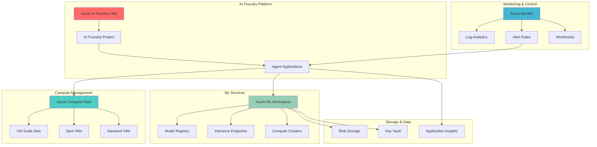

# Adaptive ML Model Scaling with Azure AI Foundry and Compute Fleet

## Problem

Organizations running ML workloads face significant challenges in dynamically scaling compute resources to match fluctuating demand patterns. Traditional approaches either overprovision expensive compute resources leading to waste, or underprovision causing performance bottlenecks during peak usage periods. Without intelligent orchestration, teams struggle to optimize costs while maintaining service level agreements across diverse ML model training and inference workloads.

## Solution

Azure AI Foundry provides a comprehensive platform for building intelligent applications with agent capabilities that can monitor ML workload patterns and make scaling decisions. Combined with Azure Compute Fleet's dynamic resource management across multiple VM series and availability zones, this solution creates an adaptive scaling system that automatically provisions or deprovisions compute resources based on real-time demand, ensuring optimal cost-performance balance while maintaining high availability.

## Architecture Diagram



## Prerequisites

1. Azure subscription with appropriate permissions for AI Foundry, Compute Fleet, and Machine Learning
2. Azure CLI v2.60.0 or later installed and configured with ML extension
3. Understanding of machine learning workflows and Azure compute services
4. Familiarity with Azure AI Foundry and intelligent application development
5. Estimated cost: $75-200 for testing resources (varies by region and compute usage)

> **Note**: This recipe requires preview features. Ensure your subscription has access to Azure AI Foundry and Compute Fleet preview services before proceeding.

## Preparation

```bash
# Set environment variables for Azure resources
export RESOURCE_GROUP="rg-ml-adaptive-scaling-${RANDOM_SUFFIX}"
export LOCATION="eastus"
export SUBSCRIPTION_ID=$(az account show --query id --output tsv)
export TENANT_ID=$(az account show --query tenantId --output tsv)

# Generate unique suffix for resource names
RANDOM_SUFFIX=$(openssl rand -hex 3)
export AI_FOUNDRY_HUB_NAME="aifhub-adaptive-${RANDOM_SUFFIX}"
export AI_FOUNDRY_PROJECT_NAME="aifproj-adaptive-${RANDOM_SUFFIX}"
export COMPUTE_FLEET_NAME="cf-ml-scaling-${RANDOM_SUFFIX}"
export ML_WORKSPACE_NAME="mlw-scaling-${RANDOM_SUFFIX}"
export STORAGE_ACCOUNT_NAME="stmlscaling${RANDOM_SUFFIX}"
export KEY_VAULT_NAME="kv-ml-${RANDOM_SUFFIX}"
export LOG_ANALYTICS_NAME="law-ml-${RANDOM_SUFFIX}"

# Create resource group
az group create \
    --name ${RESOURCE_GROUP} \
    --location ${LOCATION} \
    --tags purpose=ml-scaling environment=demo

echo "✅ Resource group created: ${RESOURCE_GROUP}"

# Register required resource providers
az provider register --namespace Microsoft.MachineLearningServices
az provider register --namespace Microsoft.AzureFleet
az provider register --namespace Microsoft.CognitiveServices
az provider register --namespace Microsoft.OperationalInsights
az provider register --namespace Microsoft.Storage
az provider register --namespace Microsoft.KeyVault

echo "✅ Resource providers registered"
```

## Steps

1. **Create foundational Azure resources**:

   Azure AI Foundry requires several foundational Azure resources including storage, key vault, and application insights. These resources provide the secure foundation for ML workloads and enable comprehensive monitoring and governance across the adaptive scaling system.

   ```bash
   # Create storage account for ML workspace
   az storage account create \
       --name ${STORAGE_ACCOUNT_NAME} \
       --resource-group ${RESOURCE_GROUP} \
       --location ${LOCATION} \
       --sku Standard_LRS \
       --kind StorageV2 \
       --hierarchical-namespace true \
       --tags purpose=ml-scaling
   
   # Create key vault for secrets management
   az keyvault create \
       --name ${KEY_VAULT_NAME} \
       --resource-group ${RESOURCE_GROUP} \
       --location ${LOCATION} \
       --sku standard \
       --tags purpose=ml-scaling
   
   # Create Application Insights for monitoring
   az monitor app-insights component create \
       --app ai-${ML_WORKSPACE_NAME} \
       --resource-group ${RESOURCE_GROUP} \
       --location ${LOCATION} \
       --kind web \
       --tags purpose=ml-scaling
   
   echo "✅ Foundational resources created"
   ```

   The foundational resources now provide secure storage, secrets management, and comprehensive monitoring capabilities. These services form the backbone of the adaptive scaling system and ensure enterprise-grade security and observability.

2. **Create Azure AI Foundry Hub and Project**:

   Azure AI Foundry Hub serves as the central governance and resource management platform for AI applications. The hub provides shared resources, security policies, and collaborative spaces for building intelligent applications. Creating a project within the hub enables isolated development environments while inheriting enterprise governance policies.

   ```bash
   # Create AI Foundry hub
   az ml workspace create \
       --resource-group ${RESOURCE_GROUP} \
       --name ${AI_FOUNDRY_HUB_NAME} \
       --location ${LOCATION} \
       --kind hub \
       --description "AI Foundry Hub for ML Scaling" \
       --storage-account "/subscriptions/${SUBSCRIPTION_ID}/resourceGroups/${RESOURCE_GROUP}/providers/Microsoft.Storage/storageAccounts/${STORAGE_ACCOUNT_NAME}" \
       --key-vault "/subscriptions/${SUBSCRIPTION_ID}/resourceGroups/${RESOURCE_GROUP}/providers/Microsoft.KeyVault/vaults/${KEY_VAULT_NAME}" \
       --application-insights "/subscriptions/${SUBSCRIPTION_ID}/resourceGroups/${RESOURCE_GROUP}/providers/Microsoft.Insights/components/ai-${ML_WORKSPACE_NAME}"
   
   # Create project within the hub
   az ml workspace create \
       --resource-group ${RESOURCE_GROUP} \
       --name ${AI_FOUNDRY_PROJECT_NAME} \
       --location ${LOCATION} \
       --kind project \
       --hub-id "/subscriptions/${SUBSCRIPTION_ID}/resourceGroups/${RESOURCE_GROUP}/providers/Microsoft.MachineLearningServices/workspaces/${AI_FOUNDRY_HUB_NAME}" \
       --description "AI Foundry Project for Adaptive ML Scaling"
   
   echo "✅ AI Foundry hub and project created"
   ```

   The AI Foundry infrastructure now provides centralized governance and security for intelligent applications. The project workspace enables isolated development of scaling agents while maintaining enterprise compliance and shared resource access through the hub.

3. **Create Machine Learning Workspace with monitoring integration**:

   Azure Machine Learning workspace provides the foundation for ML model development, training, and deployment. Integrating comprehensive monitoring enables the collection of performance metrics essential for intelligent scaling decisions. This workspace will host the ML models and compute resources that the adaptive scaling system will manage.

   ```bash
   # Create ML workspace with monitoring integration
   az ml workspace create \
       --resource-group ${RESOURCE_GROUP} \
       --name ${ML_WORKSPACE_NAME} \
       --location ${LOCATION} \
       --storage-account "/subscriptions/${SUBSCRIPTION_ID}/resourceGroups/${RESOURCE_GROUP}/providers/Microsoft.Storage/storageAccounts/${STORAGE_ACCOUNT_NAME}" \
       --key-vault "/subscriptions/${SUBSCRIPTION_ID}/resourceGroups/${RESOURCE_GROUP}/providers/Microsoft.KeyVault/vaults/${KEY_VAULT_NAME}" \
       --application-insights "/subscriptions/${SUBSCRIPTION_ID}/resourceGroups/${RESOURCE_GROUP}/providers/Microsoft.Insights/components/ai-${ML_WORKSPACE_NAME}" \
       --description "ML Workspace for adaptive compute scaling"
   
   # Create Log Analytics workspace for comprehensive monitoring
   az monitor log-analytics workspace create \
       --resource-group ${RESOURCE_GROUP} \
       --workspace-name ${LOG_ANALYTICS_NAME} \
       --location ${LOCATION} \
       --sku pergb2018 \
       --tags purpose=ml-scaling
   
   echo "✅ ML workspace and monitoring configured"
   ```

   The ML workspace is now configured with comprehensive monitoring capabilities that will feed performance data to the adaptive scaling system. The integrated monitoring provides the telemetry foundation needed for intelligent scaling decisions.

4. **Create Azure Compute Fleet for dynamic scaling**:

   Azure Compute Fleet enables sophisticated compute resource management that spans multiple VM series, pricing models, and availability zones. The fleet configuration supports both spot and standard VM allocation strategies, maximizing resource utilization while minimizing costs through intelligent allocation policies.

   ```bash
   # Create compute profile for ML workloads
   cat > compute-profile.json << 'EOF'
   {
     "baseVirtualMachineProfile": {
       "osProfile": {
         "computerNamePrefix": "mlscale",
         "adminUsername": "azureuser",
         "linuxConfiguration": {
           "disablePasswordAuthentication": true,
           "ssh": {
             "publicKeys": [
               {
                 "path": "/home/azureuser/.ssh/authorized_keys",
                 "keyData": "ssh-rsa AAAAB3NzaC1yc2EAAAADAQABAAABAQC..."
               }
             ]
           }
         }
       },
       "storageProfile": {
         "imageReference": {
           "publisher": "microsoft-dsvm",
           "offer": "ubuntu-2004",
           "sku": "2004-gen2",
           "version": "latest"
         },
         "osDisk": {
           "createOption": "FromImage",
           "managedDisk": {
             "storageAccountType": "Standard_LRS"
           }
         }
       },
       "networkProfile": {
         "networkInterfaceConfigurations": [
           {
             "name": "mlscale-nic",
             "properties": {
               "primary": true,
               "ipConfigurations": [
                 {
                   "name": "internal",
                   "properties": {
                     "subnet": {
                       "id": "/subscriptions/${SUBSCRIPTION_ID}/resourceGroups/${RESOURCE_GROUP}/providers/Microsoft.Network/virtualNetworks/vnet-ml-scaling/subnets/default"
                     }
                   }
                 }
               ]
             }
           }
         ]
       }
     }
   }
   EOF
   
   # Create virtual network for compute fleet
   az network vnet create \
       --resource-group ${RESOURCE_GROUP} \
       --name vnet-ml-scaling \
       --address-prefix 10.0.0.0/16 \
       --subnet-name default \
       --subnet-prefix 10.0.0.0/24 \
       --location ${LOCATION}
   
   # Create compute fleet for dynamic scaling
   az compute-fleet create \
       --resource-group ${RESOURCE_GROUP} \
       --name ${COMPUTE_FLEET_NAME} \
       --location ${LOCATION} \
       --spot-priority-profile '{
         "capacity": 20,
         "minCapacity": 2,
         "maxPricePerVM": 0.10,
         "evictionPolicy": "Deallocate",
         "allocationStrategy": "PriceCapacityOptimized"
       }' \
       --regular-priority-profile '{
         "capacity": 10,
         "minCapacity": 1,
         "allocationStrategy": "LowestPrice"
       }' \
       --vm-sizes-profile '[
         {
           "name": "Standard_D4s_v5"
         },
         {
           "name": "Standard_D8s_v5"
         },
         {
           "name": "Standard_E4s_v5"
         }
       ]' \
       --compute-profile @compute-profile.json
   
   echo "✅ Compute fleet configured with intelligent allocation"
   ```

   The compute fleet is now configured with intelligent allocation strategies that prioritize cost-effective spot instances while maintaining guaranteed capacity through regular VMs. This hybrid approach ensures consistent performance while optimizing costs for ML workloads.

5. **Configure Azure Monitor for workload intelligence**:

   Azure Monitor provides comprehensive observability for ML workloads, enabling data-driven scaling decisions. Custom workbooks and alert rules create the monitoring foundation needed for autonomous scaling operations. This monitoring infrastructure will feed real-time metrics to the intelligent scaling system.

   ```bash
   # Create custom workbook for scaling metrics
   cat > scaling-workbook.json << 'EOF'
   {
     "version": "Notebook/1.0",
     "items": [
       {
         "type": 9,
         "content": {
           "version": "KqlParameterItem/1.0",
           "parameters": [
             {
               "id": "timeRange",
               "version": "KqlParameterItem/1.0",
               "name": "TimeRange",
               "type": 4,
               "value": {
                 "durationMs": 3600000
               }
             }
           ]
         }
       },
       {
         "type": 3,
         "content": {
           "version": "KqlItem/1.0",
           "query": "AzureMetrics\n| where ResourceProvider == \"MICROSOFT.MACHINELEARNINGSERVICES\"\n| where MetricName in (\"CpuUtilization\", \"MemoryUtilization\")\n| summarize avg(Average) by bin(TimeGenerated, 5m), MetricName\n| render timechart",
           "size": 0,
           "title": "ML Compute Utilization",
           "timeContext": {
             "durationMs": 3600000
           }
         }
       },
       {
         "type": 3,
         "content": {
           "version": "KqlItem/1.0",
           "query": "AzureActivity\n| where ResourceProvider == \"Microsoft.AzureFleet\"\n| where OperationNameValue contains \"scale\"\n| summarize count() by bin(TimeGenerated, 15m)\n| render columnchart",
           "size": 0,
           "title": "Fleet Scaling Operations",
           "timeContext": {
             "durationMs": 3600000
           }
         }
       }
     ]
   }
   EOF
   
   # Deploy monitoring workbook
   az monitor workbook create \
       --resource-group ${RESOURCE_GROUP} \
       --name "ML-Scaling-Dashboard" \
       --display-name "ML Adaptive Scaling Dashboard" \
       --description "Comprehensive monitoring for ML compute scaling" \
       --template-data @scaling-workbook.json \
       --location ${LOCATION}
   
   # Create action group for scaling alerts
   az monitor action-group create \
       --resource-group ${RESOURCE_GROUP} \
       --name "ml-scaling-actions" \
       --short-name "mlscale"
   
   # Create alert rule for scaling triggers
   az monitor metrics alert create \
       --resource-group ${RESOURCE_GROUP} \
       --name "ml-scaling-trigger" \
       --description "Triggers scaling actions based on ML workload metrics" \
       --scopes "/subscriptions/${SUBSCRIPTION_ID}/resourceGroups/${RESOURCE_GROUP}/providers/Microsoft.MachineLearningServices/workspaces/${ML_WORKSPACE_NAME}" \
       --condition "avg Percentage CPU > 75" \
       --window-size 5m \
       --evaluation-frequency 1m \
       --action "/subscriptions/${SUBSCRIPTION_ID}/resourceGroups/${RESOURCE_GROUP}/providers/Microsoft.Insights/actionGroups/ml-scaling-actions"
   
   echo "✅ Azure Monitor configured with scaling intelligence"
   ```

   The monitoring infrastructure now provides real-time visibility into ML workload patterns and fleet scaling operations. The custom workbook enables operators to visualize scaling decisions and optimize configurations based on historical performance data.

6. **Deploy sample ML models for scaling validation**:

   Sample ML models provide realistic workloads for testing the adaptive scaling system. These models simulate real-world training and inference patterns, generating the telemetry data needed for validating scaling performance and optimization strategies.

   ```bash
   # Create sample training script with comprehensive logging
   cat > train_model.py << 'EOF'
   import mlflow
   import numpy as np
   from sklearn.ensemble import RandomForestClassifier
   from sklearn.datasets import make_classification
   from sklearn.model_selection import train_test_split
   import time
   import argparse
   import logging
   import json
   from datetime import datetime
   
   # Configure logging for monitoring
   logging.basicConfig(level=logging.INFO)
   logger = logging.getLogger(__name__)
   
   def train_model(n_samples=10000, n_features=20, complexity_factor=1):
       """Train ML model with configurable complexity for testing scaling"""
       start_time = datetime.utcnow()
       
       # Generate synthetic dataset
       X, y = make_classification(
           n_samples=n_samples, 
           n_features=n_features, 
           n_informative=max(2, n_features//2), 
           n_redundant=max(1, n_features//4),
           random_state=42
       )
       
       X_train, X_test, y_train, y_test = train_test_split(
           X, y, test_size=0.2, random_state=42
       )
       
       logger.info(f"Training model with {n_samples} samples and {n_features} features")
       
       # Simulate variable compute intensity based on complexity factor
       with mlflow.start_run():
           model = RandomForestClassifier(
               n_estimators=50 * complexity_factor, 
               max_depth=5 + complexity_factor, 
               random_state=42,
               n_jobs=-1
           )
           
           # Add artificial delay to simulate compute load
           compute_delay = 15 * complexity_factor
           logger.info(f"Simulating compute load for {compute_delay} seconds")
           time.sleep(compute_delay)
           
           model.fit(X_train, y_train)
           accuracy = model.score(X_test, y_test)
           
           # Log comprehensive metrics for monitoring
           mlflow.log_metric("accuracy", accuracy)
           mlflow.log_metric("training_samples", n_samples)
           mlflow.log_metric("feature_count", n_features)
           mlflow.log_metric("complexity_factor", complexity_factor)
           mlflow.log_metric("compute_duration", compute_delay)
           
           training_duration = (datetime.utcnow() - start_time).total_seconds()
           mlflow.log_metric("total_training_time", training_duration)
           
           mlflow.sklearn.log_model(model, "model")
           
           # Log metrics for scaling system
           metrics = {
               "timestamp": start_time.isoformat(),
               "accuracy": accuracy,
               "samples": n_samples,
               "features": n_features,
               "complexity": complexity_factor,
               "duration": training_duration
           }
           logger.info(f"Training completed: {json.dumps(metrics)}")
           
       return model, accuracy, metrics
   
   if __name__ == "__main__":
       parser = argparse.ArgumentParser()
       parser.add_argument("--samples", type=int, default=10000)
       parser.add_argument("--features", type=int, default=20)
       parser.add_argument("--complexity", type=int, default=1)
       args = parser.parse_args()
       
       model, accuracy, metrics = train_model(
           args.samples, args.features, args.complexity
       )
       print(f"Model trained with accuracy: {accuracy:.3f}")
       print(f"Training metrics: {json.dumps(metrics, indent=2)}")
   EOF
   
   # Create compute cluster for ML workloads
   az ml compute create \
       --resource-group ${RESOURCE_GROUP} \
       --workspace-name ${ML_WORKSPACE_NAME} \
       --name compute-cluster \
       --type amlcompute \
       --min-instances 0 \
       --max-instances 10 \
       --size Standard_D4s_v3
   
   # Submit test job to generate workload
   cat > job.yml << 'EOF'
   $schema: https://azuremlschemas.azureedge.net/latest/commandJob.schema.json
   command: python train_model.py --samples 50000 --features 100 --complexity 2
   code: .
   environment: azureml:AzureML-sklearn-1.0-ubuntu20.04-py38-cpu@latest
   compute: compute-cluster
   display_name: scaling-test-job
   experiment_name: adaptive-scaling-test
   description: Test job for validating adaptive scaling system
   EOF
   
   az ml job create \
       --resource-group ${RESOURCE_GROUP} \
       --workspace-name ${ML_WORKSPACE_NAME} \
       --file job.yml
   
   echo "✅ Sample ML models deployed for scaling testing"
   ```

   The sample models are now generating realistic ML workloads with comprehensive logging and metrics. These models provide the foundation for testing the adaptive scaling system under various load conditions and complexity scenarios.

7. **Create intelligent scaling automation with Azure Logic Apps**:

   Azure Logic Apps provides workflow orchestration capabilities that can integrate with Azure Monitor alerts to create intelligent scaling responses. This automation creates the decision-making layer that processes monitoring data and triggers appropriate scaling actions on the Compute Fleet.

   ```bash
   # Create scaling logic app for workflow orchestration
   cat > scaling-logic-app.json << 'EOF'
   {
     "definition": {
       "$schema": "https://schema.management.azure.com/providers/Microsoft.Logic/schemas/2016-06-01/workflowdefinition.json#",
       "contentVersion": "1.0.0.0",
       "parameters": {},
       "triggers": {
         "When_a_metric_alert_is_fired": {
           "type": "Request",
           "kind": "Http",
           "inputs": {
             "schema": {
               "properties": {
                 "data": {
                   "properties": {
                     "context": {
                       "properties": {
                         "condition": {
                           "properties": {
                             "metricName": {
                               "type": "string"
                             },
                             "metricValue": {
                               "type": "number"
                             }
                           },
                           "type": "object"
                         }
                       },
                       "type": "object"
                     }
                   },
                   "type": "object"
                 }
               },
               "type": "object"
             }
           }
         }
       },
       "actions": {
         "Analyze_Scaling_Need": {
           "type": "Compose",
           "inputs": {
             "currentUtilization": "@triggerBody()['data']['context']['condition']['metricValue']",
             "timestamp": "@utcNow()",
             "action": "@if(greater(triggerBody()['data']['context']['condition']['metricValue'], 75), 'scale_up', 'monitor')"
           }
         },
         "Execute_Scaling_Decision": {
           "type": "Switch",
           "expression": "@outputs('Analyze_Scaling_Need')['action']",
           "cases": {
             "scale_up": {
               "case": "scale_up",
               "actions": {
                 "Scale_Up_Compute_Fleet": {
                   "type": "Http",
                   "inputs": {
                     "method": "POST",
                     "uri": "https://management.azure.com/subscriptions/@{subscription_id}/resourceGroups/@{resource_group}/providers/Microsoft.AzureFleet/fleets/@{fleet_name}/scale",
                     "headers": {
                       "Authorization": "Bearer @{accessToken}",
                       "Content-Type": "application/json"
                     },
                     "body": {
                       "capacity": {
                         "spotPriority": {
                           "capacity": "@add(variables('currentSpotCapacity'), 5)"
                         }
                       }
                     }
                   }
                 }
               }
             }
           },
           "default": {
             "actions": {
               "Log_Monitoring_Event": {
                 "type": "Compose",
                 "inputs": {
                   "message": "Monitoring - no scaling action needed",
                   "utilization": "@triggerBody()['data']['context']['condition']['metricValue']"
                 }
               }
             }
           }
         }
       }
     }
   }
   EOF
   
   # Create Logic App for scaling automation
   az logic workflow create \
       --resource-group ${RESOURCE_GROUP} \
       --name "ml-adaptive-scaling-workflow" \
       --location ${LOCATION} \
       --definition @scaling-logic-app.json \
       --tags purpose=ml-scaling
   
   # Update alert action group to trigger Logic App
   LOGIC_APP_TRIGGER_URL=$(az logic workflow show \
       --resource-group ${RESOURCE_GROUP} \
       --name ml-adaptive-scaling-workflow \
       --query "accessEndpoint" -o tsv)
   
   az monitor action-group update \
       --resource-group ${RESOURCE_GROUP} \
       --name "ml-scaling-actions" \
       --add-logic-app "ml-scaling-webhook" "${LOGIC_APP_TRIGGER_URL}"
   
   echo "✅ Intelligent scaling automation configured"
   ```

   The intelligent scaling automation is now active with workflow orchestration that analyzes monitoring alerts and executes appropriate scaling actions. This creates an automated adaptive scaling system that responds to ML workload demands while maintaining cost optimization principles.

8. **Implement advanced monitoring and optimization**:

   Advanced monitoring capabilities provide comprehensive visibility into the adaptive scaling system's performance and decision-making processes. Custom metrics and dashboards enable continuous optimization of scaling policies and help identify opportunities for further efficiency improvements.

   ```bash
   # Create advanced monitoring queries
   cat > advanced-queries.kql << 'EOF'
   // Query: ML Workload Scaling Efficiency
   AzureMetrics
   | where ResourceProvider == "MICROSOFT.MACHINELEARNINGSERVICES" 
   | where MetricName in ("CpuUtilization", "MemoryUtilization")
   | join kind=inner (
       AzureActivity
       | where ResourceProvider == "Microsoft.AzureFleet"
       | where OperationNameValue contains "scale"
   ) on $left.ResourceId == $right.ResourceId
   | summarize 
       AvgUtilization = avg(Average),
       ScalingEvents = count()
   by bin(TimeGenerated, 1h)
   | render timechart
   
   // Query: Cost Optimization Analysis
   AzureMetrics
   | where ResourceProvider == "Microsoft.AzureFleet"
   | where MetricName == "SpotInstanceUtilization"
   | summarize 
       SpotUtilization = avg(Average),
       CostSavings = avg(Average) * 0.7  // Approximate spot savings
   by bin(TimeGenerated, 1d)
   | render columnchart
   EOF
   
   # Create cost optimization dashboard
   cat > cost-dashboard.json << 'EOF'
   {
     "version": "Notebook/1.0",
     "items": [
       {
         "type": 1,
         "content": {
           "json": "# Adaptive ML Scaling - Cost Optimization Dashboard\nThis dashboard provides insights into cost optimization effectiveness and scaling performance."
         }
       },
       {
         "type": 3,
         "content": {
           "version": "KqlItem/1.0",
           "query": "AzureMetrics | where ResourceProvider == \"Microsoft.AzureFleet\" | where MetricName == \"TotalCost\" | summarize TotalCost = sum(Average) by bin(TimeGenerated, 1d) | render areachart",
           "size": 0,
           "title": "Daily Compute Costs",
           "timeContext": {
             "durationMs": 604800000
           }
         }
       },
       {
         "type": 3,
         "content": {
           "version": "KqlItem/1.0",
           "query": "AzureActivity | where ResourceProvider == \"Microsoft.AzureFleet\" | where OperationNameValue contains \"scale\" | summarize ScalingEvents = count() by bin(TimeGenerated, 1h) | render columnchart",
           "size": 0,
           "title": "Scaling Event Frequency",
           "timeContext": {
             "durationMs": 86400000
           }
         }
       }
     ]
   }
   EOF
   
   # Deploy cost optimization dashboard
   az monitor workbook create \
       --resource-group ${RESOURCE_GROUP} \
       --name "ML-Cost-Optimization" \
       --display-name "ML Cost Optimization Dashboard" \
       --description "Advanced cost optimization monitoring for adaptive ML scaling" \
       --template-data @cost-dashboard.json \
       --location ${LOCATION}
   
   # Create custom metric for scaling efficiency
   az monitor metrics alert create \
       --resource-group ${RESOURCE_GROUP} \
       --name "scaling-efficiency-alert" \
       --description "Monitors scaling efficiency and cost optimization" \
       --scopes "/subscriptions/${SUBSCRIPTION_ID}/resourceGroups/${RESOURCE_GROUP}/providers/Microsoft.AzureFleet/fleets/${COMPUTE_FLEET_NAME}" \
       --condition "avg SpotInstanceUtilization < 40" \
       --window-size 15m \
       --evaluation-frequency 5m \
       --action "/subscriptions/${SUBSCRIPTION_ID}/resourceGroups/${RESOURCE_GROUP}/providers/Microsoft.Insights/actionGroups/ml-scaling-actions"
   
   echo "✅ Advanced monitoring and optimization implemented"
   ```

   The advanced monitoring infrastructure now provides comprehensive visibility into scaling efficiency, cost optimization, and system performance. These dashboards and metrics enable continuous improvement of the adaptive scaling system's decision-making processes.

## Validation & Testing

1. **Verify AI Foundry infrastructure deployment**:

   ```bash
   # Check AI Foundry hub status
   az ml workspace show \
       --resource-group ${RESOURCE_GROUP} \
       --name ${AI_FOUNDRY_HUB_NAME} \
       --query '{name:name, kind:kind, provisioningState:provisioningState}'
   
   # Verify project workspace
   az ml workspace show \
       --resource-group ${RESOURCE_GROUP} \
       --name ${AI_FOUNDRY_PROJECT_NAME} \
       --query '{name:name, kind:kind, hubId:hubId}'
   ```

   Expected output: Active AI Foundry hub with kind "Hub" and project with reference to hub.

2. **Test Compute Fleet scaling capabilities**:

   ```bash
   # Check fleet capacity and configuration
   az compute-fleet show \
       --resource-group ${RESOURCE_GROUP} \
       --name ${COMPUTE_FLEET_NAME} \
       --query '{name:name, spotPriorityProfile:spotPriorityProfile, regularPriorityProfile:regularPriorityProfile}'
   
   # Test manual scaling to validate fleet responsiveness
   az compute-fleet update \
       --resource-group ${RESOURCE_GROUP} \
       --name ${COMPUTE_FLEET_NAME} \
       --spot-priority-profile '{
         "capacity": 15,
         "minCapacity": 2
       }'
   ```

   Expected output: Fleet showing updated capacity with spot and regular VM configurations.

3. **Validate monitoring and alerting system**:

   ```bash
   # Check monitoring workbook deployment
   az monitor workbook show \
       --resource-group ${RESOURCE_GROUP} \
       --name "ML-Scaling-Dashboard" \
       --query '{name:name, location:location}'
   
   # Verify alert rules are active
   az monitor metrics alert list \
       --resource-group ${RESOURCE_GROUP} \
       --query '[].{name:name, enabled:enabled, targetResourceId:scopes[0]}'
   
   # Test alert system with sample data
   az monitor metrics alert test-notifications \
       --resource-group ${RESOURCE_GROUP} \
       --rule-name "ml-scaling-trigger"
   ```

   Expected output: Active workbooks and alert rules with successful test notifications.

4. **Test ML workload and scaling integration**:

   ```bash
   # Submit scaling test job to generate workload
   cat > scaling-test-job.yml << 'EOF'
   $schema: https://azuremlschemas.azureedge.net/latest/commandJob.schema.json
   command: python train_model.py --samples 100000 --features 200 --complexity 3
   code: .
   environment: azureml:AzureML-sklearn-1.0-ubuntu20.04-py38-cpu@latest
   compute: compute-cluster
   display_name: scaling-validation-job
   experiment_name: adaptive-scaling-validation
   EOF
   
   az ml job create \
       --resource-group ${RESOURCE_GROUP} \
       --workspace-name ${ML_WORKSPACE_NAME} \
       --file scaling-test-job.yml
   
   # Monitor job execution and scaling events
   az ml job show \
       --resource-group ${RESOURCE_GROUP} \
       --workspace-name ${ML_WORKSPACE_NAME} \
       --name scaling-validation-job \
       --query '{status:status, startTime:startTime}'
   ```

   Expected output: Running ML job that triggers monitoring alerts and scaling actions.

## Cleanup

1. **Stop Logic App workflows**:

   ```bash
   # Disable scaling automation workflow
   az logic workflow update \
       --resource-group ${RESOURCE_GROUP} \
       --name "ml-adaptive-scaling-workflow" \
       --state "Disabled"
   
   echo "✅ Scaling automation workflows stopped"
   ```

2. **Remove ML workloads and compute resources**:

   ```bash
   # Cancel any running jobs
   az ml job list \
       --resource-group ${RESOURCE_GROUP} \
       --workspace-name ${ML_WORKSPACE_NAME} \
       --query '[?status==`Running`].name' -o tsv | \
   while read job_name; do
       az ml job cancel \
           --resource-group ${RESOURCE_GROUP} \
           --workspace-name ${ML_WORKSPACE_NAME} \
           --name "$job_name"
   done
   
   # Delete compute resources
   az ml compute delete \
       --resource-group ${RESOURCE_GROUP} \
       --workspace-name ${ML_WORKSPACE_NAME} \
       --name compute-cluster \
       --yes
   
   echo "✅ ML workloads and compute resources removed"
   ```

3. **Clean up Compute Fleet and monitoring**:

   ```bash
   # Delete Compute Fleet
   az compute-fleet delete \
       --resource-group ${RESOURCE_GROUP} \
       --name ${COMPUTE_FLEET_NAME} \
       --yes \
       --no-wait
   
   # Remove monitoring resources
   az monitor workbook delete \
       --resource-group ${RESOURCE_GROUP} \
       --name "ML-Scaling-Dashboard"
   
   az monitor workbook delete \
       --resource-group ${RESOURCE_GROUP} \
       --name "ML-Cost-Optimization"
   
   echo "✅ Compute Fleet and monitoring resources cleaned up"
   ```

4. **Remove resource group and all remaining resources**:

   ```bash
   # Delete resource group and all contained resources
   az group delete \
       --name ${RESOURCE_GROUP} \
       --yes \
       --no-wait
   
   echo "✅ Resource group deletion initiated: ${RESOURCE_GROUP}"
   echo "Note: Deletion may take several minutes to complete"
   
   # Verify deletion (optional)
   sleep 30
   az group exists --name ${RESOURCE_GROUP}
   ```

## Discussion

Azure AI Foundry represents a comprehensive platform for building intelligent applications that can make autonomous decisions about infrastructure management. Unlike traditional rule-based auto-scaling systems, AI Foundry enables the development of sophisticated applications that can understand complex patterns in ML workload data and make contextual scaling decisions. The platform provides enterprise-grade governance, security, and collaboration capabilities essential for production AI applications. For comprehensive guidance on building intelligent applications, see the [Azure AI Foundry documentation](https://learn.microsoft.com/en-us/azure/ai-foundry/).

The integration with Azure Compute Fleet enables sophisticated compute resource management that spans multiple VM series, pricing models, and availability zones. This approach maximizes resource utilization while minimizing costs through intelligent mixing of spot and standard instances. The fleet's ability to scale across different VM types provides the elasticity needed for diverse ML workloads, from small experimentation to large-scale production training. For detailed fleet configuration guidance, see the [Azure Compute Fleet documentation](https://learn.microsoft.com/en-us/azure/azure-compute-fleet/overview).

Azure Logic Apps provides the workflow orchestration capabilities that bridge monitoring data with scaling actions. This integration creates a responsive system that can process complex decision trees, implement safety mechanisms, and coordinate across multiple Azure services. The workflow-based approach enables sophisticated scaling strategies that consider multiple factors including cost constraints, performance requirements, and resource availability. For workflow orchestration patterns, refer to the [Azure Logic Apps documentation](https://learn.microsoft.com/en-us/azure/logic-apps/).

The monitoring and observability infrastructure built on Azure Monitor provides the foundation for continuous optimization of scaling decisions. Custom workbooks, KQL queries, and alert rules enable operators to understand system behavior and fine-tune scaling policies based on historical performance data. This comprehensive observability ensures that the adaptive scaling system continuously improves its decision-making accuracy and cost optimization effectiveness over time. For advanced monitoring strategies, see the [Azure Monitor documentation](https://learn.microsoft.com/en-us/azure/azure-monitor/) and [Azure Machine Learning monitoring guide](https://learn.microsoft.com/en-us/azure/machine-learning/monitor-azure-machine-learning).

> **Tip**: Use Azure Cost Management APIs to create custom cost tracking that integrates with the scaling decisions. This provides additional visibility into cost optimization effectiveness and helps identify opportunities for Reserved Instance utilization and Azure Hybrid Benefit optimization.

## Challenge

Extend this adaptive scaling solution by implementing these advanced capabilities:

1. **Multi-Region Intelligent Scaling**: Deploy scaling intelligence across multiple Azure regions with cross-region workload balancing based on latency, capacity, and cost considerations using Azure Traffic Manager.

2. **Predictive Scaling with Azure Machine Learning**: Integrate Azure Machine Learning AutoML time series forecasting to predict future compute demands and proactively scale resources before demand spikes occur.

3. **GPU Compute Fleet Integration**: Extend the solution to include GPU-optimized compute fleets for deep learning workloads with specialized cost optimization strategies for high-performance computing scenarios.

4. **Advanced Cost Optimization Engine**: Implement sophisticated cost models that consider Reserved Instances, Savings Plans, Azure Hybrid Benefit, and spot instance market dynamics in scaling decisions.

5. **MLOps Pipeline Integration**: Connect the scaling system with Azure DevOps MLOps pipelines to automatically scale compute resources based on deployment schedules, model training requirements, and CI/CD pipeline demands.

## Infrastructure Code

*Infrastructure code will be generated after recipe approval.*