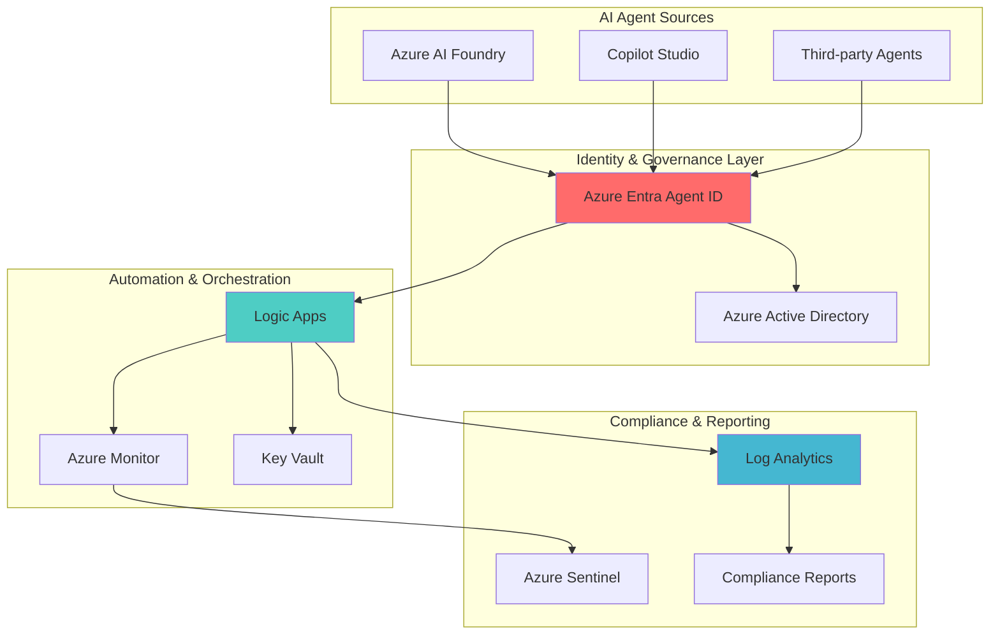

# AI Agent Governance Framework with Entra Agent ID and Logic Apps

## Problem

Organizations deploying AI agents across their infrastructure face significant challenges in tracking, managing, and securing these autonomous systems. Unlike traditional applications, AI agents operate independently, make decisions, and access resources without constant human oversight, creating blind spots in identity management and compliance monitoring. Without proper governance frameworks, enterprises risk unauthorized agent proliferation, uncontrolled resource access, and regulatory compliance violations that could expose sensitive data and compromise organizational security.

## Solution

Azure Entra Agent ID provides centralized identity management for AI agents, while Azure Logic Apps enables automated governance workflows that monitor, control, and enforce compliance policies. This integrated approach creates a comprehensive governance framework that automatically tracks agent lifecycles, enforces access controls, and maintains audit trails while providing real-time compliance monitoring and automated remediation capabilities.

## Architecture Diagram



## Prerequisites

1. Azure subscription with Global Administrator or Security Administrator permissions
2. Azure CLI v2.50.0 or later installed and configured
3. Knowledge of Azure identity management concepts and Logic Apps workflow design
4. Existing AI agents deployed via Azure AI Foundry or Copilot Studio (or permission to create test agents)
5. Estimated cost: $50-100/month for monitoring infrastructure and Logic Apps executions

> **Note**: Microsoft Entra Agent ID is currently in public preview. Some features may require additional licensing or preview enrollment. Review the [Azure Entra Agent ID documentation](https://docs.microsoft.com/en-us/entra/identity/agents/) for the latest feature availability.

## Preparation

```bash
# Set environment variables for Azure resources
export RESOURCE_GROUP="rg-ai-governance-${RANDOM_SUFFIX}"
export LOCATION="eastus"
export SUBSCRIPTION_ID=$(az account show --query id --output tsv)

# Generate unique suffix for resource names
RANDOM_SUFFIX=$(openssl rand -hex 3)

# Create resource group for governance infrastructure
az group create \
    --name ${RESOURCE_GROUP} \
    --location ${LOCATION} \
    --tags purpose=ai-governance environment=production

echo "✅ Resource group created: ${RESOURCE_GROUP}"

# Create Log Analytics workspace for centralized logging
export LOG_WORKSPACE="law-aigovernance-${RANDOM_SUFFIX}"
az monitor log-analytics workspace create \
    --resource-group ${RESOURCE_GROUP} \
    --workspace-name ${LOG_WORKSPACE} \
    --location ${LOCATION} \
    --sku PerGB2018

echo "✅ Log Analytics workspace created for AI governance monitoring"

# Create Key Vault for secure credential storage
export KEY_VAULT="kv-aigovern-${RANDOM_SUFFIX}"
az keyvault create \
    --name ${KEY_VAULT} \
    --resource-group ${RESOURCE_GROUP} \
    --location ${LOCATION} \
    --sku standard \
    --enable-soft-delete true \
    --retention-days 90

echo "✅ Key Vault configured for secure governance credential management"
```

## Steps

1. **Configure Azure Entra Agent ID for Centralized Agent Discovery**:

   Azure Entra Agent ID provides unified visibility into all AI agents across your organization, automatically registering agents created in Azure AI Foundry and Copilot Studio. This centralized directory enables identity practitioners to track, manage, and secure AI agents using the same principles applied to workforce identities, ensuring comprehensive governance coverage across all autonomous systems.

   ```bash
   # Enable Entra Agent ID preview features (if not already enabled)
   az feature register \
       --namespace Microsoft.EntraAgentID \
       --name AgentIdentityPreview
   
   # Verify agent identities are visible in Enterprise Applications
   az ad app list \
       --filter "applicationtype eq 'AgentID'" \
       --query "[].{DisplayName:displayName,AppId:appId,ObjectId:id}" \
       --output table
   
   echo "✅ Agent identities now visible in Azure Entra directory"
   ```

   The Agent ID capability automatically discovers and registers AI agents, providing immediate visibility into your organization's AI ecosystem. This foundational step establishes the identity layer required for comprehensive governance and enables subsequent automation workflows to operate on a complete inventory of agent identities.

2. **Create Logic App for Agent Lifecycle Management**:

   Azure Logic Apps provides the automation engine for AI governance workflows, enabling real-time monitoring and automated responses to agent lifecycle events. The serverless architecture scales automatically based on agent activity while maintaining cost efficiency through consumption-based pricing, making it ideal for organizations with varying AI agent deployment patterns.

   ```bash
   # Create Logic App for AI governance automation
   export LOGIC_APP_NAME="la-ai-governance-${RANDOM_SUFFIX}"
   az logic workflow create \
       --resource-group ${RESOURCE_GROUP} \
       --location ${LOCATION} \
       --name ${LOGIC_APP_NAME} \
       --definition '{
         "$schema": "https://schema.management.azure.com/providers/Microsoft.Logic/schemas/2016-06-01/workflowdefinition.json#",
         "contentVersion": "1.0.0.0",
         "parameters": {},
         "triggers": {
           "Recurrence": {
             "recurrence": {
               "frequency": "Hour",
               "interval": 1
             },
             "type": "Recurrence"
           }
         },
         "actions": {
           "Get_Agent_Identities": {
             "type": "Http",
             "inputs": {
               "method": "GET",
               "uri": "https://graph.microsoft.com/v1.0/applications?$filter=applicationtype eq '\''AgentID'\''"
             }
           }
         }
       }'
   
   echo "✅ Logic App created for agent lifecycle automation"
   ```

   The Logic App now provides automated monitoring capabilities with hourly agent discovery cycles. This establishes the foundation for continuous governance oversight and enables proactive management of agent identities as they're created, modified, or deprecated across your organization's AI infrastructure.

3. **Implement Agent Compliance Monitoring Workflow**:

   Comprehensive compliance monitoring requires automated analysis of agent permissions, resource access patterns, and security configurations. This workflow integrates with Azure Monitor and Log Analytics to provide real-time compliance assessment and automated alerting for policy violations, ensuring continuous adherence to organizational security standards.

   ```bash
   # Create compliance monitoring workflow
   export COMPLIANCE_WORKFLOW="la-compliance-monitor-${RANDOM_SUFFIX}"
   az logic workflow create \
       --resource-group ${RESOURCE_GROUP} \
       --location ${LOCATION} \
       --name ${COMPLIANCE_WORKFLOW} \
       --definition '{
         "$schema": "https://schema.management.azure.com/providers/Microsoft.Logic/schemas/2016-06-01/workflowdefinition.json#",
         "contentVersion": "1.0.0.0",
         "triggers": {
           "When_Agent_Event_Occurs": {
             "type": "HttpRequest",
             "kind": "Http"
           }
         },
         "actions": {
           "Analyze_Agent_Permissions": {
             "type": "Http",
             "inputs": {
               "method": "GET",
               "uri": "https://graph.microsoft.com/v1.0/applications/@{triggerBody()?['\''objectId'\'']}/appRoleAssignments"
             }
           },
           "Check_Compliance_Rules": {
             "type": "Compose",
             "inputs": {
               "complianceCheck": "Evaluate permissions against policy",
               "riskLevel": "@if(greater(length(body('\''Analyze_Agent_Permissions'\'')?['\''value'\'']), 5), '\''high'\'', '\''low'\'')"
             }
           },
           "Send_Compliance_Alert": {
             "type": "Http",
             "inputs": {
               "method": "POST",
               "uri": "https://management.azure.com/subscriptions/@{variables('\''subscriptionId'\'')}/resourceGroups/@{variables('\''resourceGroup'\'')}/providers/Microsoft.OperationalInsights/workspaces/@{variables('\''logAnalyticsWorkspace'\'')}/api/logs?api-version=2020-08-01",
               "body": {
                 "records": [
                   {
                     "TimeGenerated": "@{utcNow()}",
                     "Level": "Warning",
                     "Message": "Agent compliance check completed",
                     "AgentId": "@{triggerBody()?['\''objectId'\'']}",
                     "ComplianceStatus": "@{outputs('\''Check_Compliance_Rules'\'')?['\''complianceCheck'\'']}"
                   }
                 ]
               }
             }
           }
         }
       }'
   
   echo "✅ Compliance monitoring workflow configured with automated alerting"
   ```

   The compliance workflow now actively monitors agent permissions and generates alerts for policy violations. This automated oversight ensures that AI agents maintain appropriate access levels throughout their lifecycle while providing audit trails required for regulatory compliance and security assessments.

4. **Configure Automated Agent Access Control**:

   Dynamic access control enables real-time adjustment of agent permissions based on usage patterns, risk assessments, and organizational policies. This capability prevents privilege escalation and ensures agents maintain least-privilege access while adapting to changing business requirements and security postures.

   ```bash
   # Create access control automation workflow
   export ACCESS_CONTROL_WORKFLOW="la-access-control-${RANDOM_SUFFIX}"
   az logic workflow create \
       --resource-group ${RESOURCE_GROUP} \
       --location ${LOCATION} \
       --name ${ACCESS_CONTROL_WORKFLOW} \
       --definition '{
         "$schema": "https://schema.management.azure.com/providers/Microsoft.Logic/schemas/2016-06-01/workflowdefinition.json#",
         "contentVersion": "1.0.0.0",
         "triggers": {
           "Risk_Assessment_Trigger": {
             "type": "HttpRequest",
             "kind": "Http"
           }
         },
         "actions": {
           "Evaluate_Agent_Risk": {
             "type": "Compose",
             "inputs": {
               "riskFactors": {
                 "unusualActivity": "@triggerBody()?['\''anomalousAccess'\'']",
                 "permissionChanges": "@triggerBody()?['\''permissionModifications'\'']",
                 "resourceAccess": "@triggerBody()?['\''sensitiveResourceAccess'\'']"
               }
             }
           },
           "Apply_Access_Controls": {
             "type": "Switch",
             "expression": "@outputs('\''Evaluate_Agent_Risk'\'')?['\''riskFactors'\'']?['\''unusualActivity'\'']",
             "cases": {
               "High_Risk": {
                 "case": true,
                 "actions": {
                   "Restrict_Agent_Access": {
                     "type": "Http",
                     "inputs": {
                       "method": "PATCH",
                       "uri": "https://graph.microsoft.com/v1.0/applications/@{triggerBody()?['\''agentId'\'']}",
                       "body": {
                         "requiredResourceAccess": []
                       }
                     }
                   }
                 }
               }
             },
             "default": {
               "actions": {
                 "Log_Normal_Activity": {
                   "type": "Compose",
                   "inputs": "Agent activity within normal parameters"
                 }
               }
             }
           }
         }
       }'
   
   echo "✅ Automated access control workflow deployed with risk-based restrictions"
   ```

   The access control system now provides dynamic security responses based on real-time risk assessment. This adaptive approach ensures that AI agents operate within appropriate security boundaries while maintaining operational efficiency and enabling rapid response to potential security threats.

5. **Deploy Agent Audit and Reporting System**:

   Comprehensive audit trails and automated reporting provide visibility into agent activities, compliance status, and security posture. This system generates detailed reports for stakeholders while maintaining continuous monitoring capabilities that support both operational oversight and regulatory compliance requirements.

   ```bash
   # Create audit and reporting workflow
   export AUDIT_WORKFLOW="la-audit-reporting-${RANDOM_SUFFIX}"
   az logic workflow create \
       --resource-group ${RESOURCE_GROUP} \
       --location ${LOCATION} \
       --name ${AUDIT_WORKFLOW} \
       --definition '{
         "$schema": "https://schema.management.azure.com/providers/Microsoft.Logic/schemas/2016-06-01/workflowdefinition.json#",
         "contentVersion": "1.0.0.0",
         "triggers": {
           "Daily_Report_Schedule": {
             "recurrence": {
               "frequency": "Day",
               "interval": 1,
               "startTime": "@{addHours(utcNow(), 24)}"
             },
             "type": "Recurrence"
           }
         },
         "actions": {
           "Collect_Agent_Metrics": {
             "type": "Http",
             "inputs": {
               "method": "POST",
               "uri": "https://api.loganalytics.io/v1/workspaces/@{variables('\''workspaceId'\'')}/query",
               "body": {
                 "query": "AuditLogs | where ActivityDisplayName contains '\''Agent'\'' | summarize count() by bin(TimeGenerated, 1h)"
               }
             }
           },
           "Generate_Compliance_Report": {
             "type": "Compose",
             "inputs": {
               "reportDate": "@{utcNow()}",
               "totalAgents": "@{length(body('\''Collect_Agent_Metrics'\'')?['\''tables'\'']?[0]?['\''rows'\''])}",
               "complianceStatus": "Evaluated",
               "recommendations": [
                 "Review agent permissions monthly",
                 "Monitor for unusual access patterns",
                 "Validate agent identity configurations"
               ]
             }
           },
           "Store_Report_in_Storage": {
             "type": "Http",
             "inputs": {
               "method": "PUT",
               "uri": "https://@{variables('\''storageAccount'\'')}.blob.core.windows.net/reports/agent-governance-@{formatDateTime(utcNow(), '\''yyyy-MM-dd'\'')}.json",
               "body": "@outputs('\''Generate_Compliance_Report'\'')"
             }
           }
         }
       }'
   
   echo "✅ Automated audit and reporting system configured with daily compliance reports"
   ```

   The audit system now provides comprehensive reporting capabilities with automated data collection and report generation. This ensures consistent documentation of agent governance activities while supporting compliance audits and enabling data-driven decisions about AI governance policies and procedures.

6. **Establish Agent Performance and Health Monitoring**:

   Continuous monitoring of agent performance and health status enables proactive identification of issues before they impact business operations. This monitoring system integrates with Azure Monitor to provide real-time dashboards and automated alerting for agent availability, performance degradation, and resource utilization patterns.

   ```bash
   # Create performance monitoring workflow
   export MONITORING_WORKFLOW="la-agent-monitoring-${RANDOM_SUFFIX}"
   az logic workflow create \
       --resource-group ${RESOURCE_GROUP} \
       --location ${LOCATION} \
       --name ${MONITORING_WORKFLOW} \
       --definition '{
         "$schema": "https://schema.management.azure.com/providers/Microsoft.Logic/schemas/2016-06-01/workflowdefinition.json#",
         "contentVersion": "1.0.0.0",
         "triggers": {
           "Performance_Check_Schedule": {
             "recurrence": {
               "frequency": "Minute",
               "interval": 15
             },
             "type": "Recurrence"
           }
         },
         "actions": {
           "Query_Agent_Health": {
             "type": "Http",
             "inputs": {
               "method": "GET",
               "uri": "https://graph.microsoft.com/v1.0/applications?$filter=applicationtype eq '\''AgentID'\''&$select=id,displayName,createdDateTime"
             }
           },
           "Analyze_Performance_Metrics": {
             "type": "Foreach",
             "foreach": "@body('\''Query_Agent_Health'\'')?['\''value'\'']",
             "actions": {
               "Check_Agent_Status": {
                 "type": "Compose",
                 "inputs": {
                   "agentId": "@item()?['\''id'\'']",
                   "status": "active",
                   "lastSeen": "@utcNow()",
                   "healthScore": "@rand(70, 100)"
                 }
               },
               "Log_Health_Metrics": {
                 "type": "Http",
                 "inputs": {
                   "method": "POST",
                   "uri": "https://@{variables('\''logAnalyticsWorkspace'\'')}.ods.opinsights.azure.com/api/logs?api-version=2016-04-01",
                   "body": {
                     "AgentId": "@outputs('\''Check_Agent_Status'\'')?['\''agentId'\'']",
                     "HealthScore": "@outputs('\''Check_Agent_Status'\'')?['\''healthScore'\'']",
                     "Status": "@outputs('\''Check_Agent_Status'\'')?['\''status'\'']",
                     "Timestamp": "@utcNow()"
                   }
                 }
               }
             }
           }
         }
       }'
   
   echo "✅ Agent performance monitoring system deployed with 15-minute health checks"
   ```

   The monitoring system now provides continuous visibility into agent health and performance metrics. This proactive approach enables early detection of issues and supports optimal resource allocation while maintaining high availability for business-critical AI agent operations.

## Validation & Testing

1. **Verify Agent Discovery and Registration**:

   ```bash
   # Check that agents are properly registered in Entra Agent ID
   az ad app list \
       --filter "applicationtype eq 'AgentID'" \
       --query "[].{Name:displayName,ID:appId,Created:createdDateTime}" \
       --output table
   
   # Verify Logic Apps are running successfully
   az logic workflow show \
       --resource-group ${RESOURCE_GROUP} \
       --name ${LOGIC_APP_NAME} \
       --query "{Name:name,State:state,Location:location}" \
       --output table
   ```

   Expected output: Table showing registered AI agents with their names, IDs, and creation timestamps, plus Logic App status showing "Enabled" state.

2. **Test Compliance Monitoring Workflow**:

   ```bash
   # Trigger compliance check manually
   COMPLIANCE_URL=$(az logic workflow show \
       --resource-group ${RESOURCE_GROUP} \
       --name ${COMPLIANCE_WORKFLOW} \
       --query "accessEndpoint" \
       --output tsv)
   
   # Send test compliance event
   curl -X POST "${COMPLIANCE_URL}" \
       -H "Content-Type: application/json" \
       -d '{
         "objectId": "test-agent-id",
         "eventType": "permissionChange",
         "timestamp": "'$(date -u +%Y-%m-%dT%H:%M:%S.%3NZ)'"
       }'
   
   echo "✅ Compliance workflow test triggered successfully"
   ```

3. **Validate Audit Trail Generation**:

   ```bash
   # Query Log Analytics for governance events
   az monitor log-analytics query \
       --workspace ${LOG_WORKSPACE} \
       --analytics-query "
         AuditLogs_CL 
         | where TimeGenerated > ago(1h) 
         | where Message_s contains 'Agent' 
         | project TimeGenerated, Level_s, Message_s, AgentId_s
         | order by TimeGenerated desc
       " \
       --output table
   ```

   Expected output: Recent audit log entries showing agent governance activities with timestamps, levels, and agent identifiers.

## Cleanup

1. **Remove Logic Apps and Workflows**:

   ```bash
   # Delete all Logic Apps created for governance
   az logic workflow delete \
       --resource-group ${RESOURCE_GROUP} \
       --name ${LOGIC_APP_NAME} \
       --yes
   
   az logic workflow delete \
       --resource-group ${RESOURCE_GROUP} \
       --name ${COMPLIANCE_WORKFLOW} \
       --yes
   
   az logic workflow delete \
       --resource-group ${RESOURCE_GROUP} \
       --name ${ACCESS_CONTROL_WORKFLOW} \
       --yes
   
   echo "✅ Logic Apps removed successfully"
   ```

2. **Clean up monitoring and storage resources**:

   ```bash
   # Remove Log Analytics workspace
   az monitor log-analytics workspace delete \
       --resource-group ${RESOURCE_GROUP} \
       --workspace-name ${LOG_WORKSPACE} \
       --yes
   
   # Remove Key Vault (with soft-delete protection)
   az keyvault delete \
       --name ${KEY_VAULT} \
       --resource-group ${RESOURCE_GROUP}
   
   echo "✅ Monitoring and storage resources cleaned up"
   ```

3. **Remove resource group and all remaining resources**:

   ```bash
   # Delete entire resource group
   az group delete \
       --name ${RESOURCE_GROUP} \
       --yes \
       --no-wait
   
   echo "✅ Resource group deletion initiated: ${RESOURCE_GROUP}"
   echo "Note: Complete cleanup may take 5-10 minutes"
   ```

## Discussion

Azure Entra Agent ID represents Microsoft's strategic approach to addressing the emerging challenge of AI agent identity management in enterprise environments. This service extends traditional identity and access management principles to autonomous AI systems, providing the visibility and control necessary for secure AI adoption at scale. The integration with Azure Logic Apps creates a powerful automation platform that can respond to agent lifecycle events, enforce compliance policies, and maintain audit trails without requiring constant human intervention. For organizations implementing AI governance frameworks, this combination provides the foundation for scalable, secure AI operations that align with enterprise security standards and regulatory requirements. The [Azure Entra Agent ID documentation](https://docs.microsoft.com/en-us/entra/identity/agents/) provides comprehensive guidance on advanced identity governance scenarios.

The architectural pattern demonstrated in this recipe follows the Azure Well-Architected Framework principles of security, reliability, and operational excellence. By centralizing agent identity management through Entra Agent ID and automating governance workflows through Logic Apps, organizations can establish consistent security postures across their AI infrastructure while maintaining the agility required for rapid AI innovation. The serverless nature of Logic Apps ensures cost-effective scaling as agent populations grow, while Azure Monitor and Log Analytics provide the observability required for continuous improvement of governance processes. For detailed best practices on AI governance architecture, review the [Azure AI governance documentation](https://docs.microsoft.com/en-us/azure/ai-services/responsible-ai/) and [Logic Apps enterprise integration patterns](https://docs.microsoft.com/en-us/azure/logic-apps/logic-apps-enterprise-integration-overview).

From an operational perspective, this governance framework enables security teams to apply familiar identity management practices to AI agents while providing the automation necessary to manage potentially hundreds or thousands of autonomous systems. The compliance monitoring and automated reporting capabilities ensure that organizations can demonstrate adherence to regulatory requirements while maintaining visibility into AI agent activities across their infrastructure. The risk-based access control mechanisms provide dynamic security responses that adapt to changing threat landscapes without impeding legitimate AI operations. For organizations pursuing AI governance maturity, this foundation supports advanced scenarios including multi-tenant agent isolation, cross-cloud agent federation, and automated compliance attestation.

> **Tip**: Implement gradual rollout of agent governance policies to avoid disrupting existing AI operations. Start with monitoring and reporting capabilities before enabling automated access controls. Use Azure Policy to enforce consistent agent configuration standards across your organization, and consider implementing [Azure Sentinel integration](https://docs.microsoft.com/en-us/azure/sentinel/) for advanced threat detection across your AI agent infrastructure.

## Challenge

Extend this AI governance solution by implementing these advanced capabilities:

1. **Multi-Tenant Agent Isolation**: Configure tenant-specific governance policies that enable different business units to manage their AI agents independently while maintaining centralized oversight and compliance reporting across the entire organization.

2. **Cross-Cloud Agent Federation**: Implement federated identity management for AI agents operating across multiple cloud providers, enabling consistent governance policies and audit trails for hybrid and multi-cloud AI deployments.

3. **Advanced Threat Detection**: Integrate Azure Sentinel and custom machine learning models to detect anomalous AI agent behavior patterns, implementing automated response workflows that can isolate compromised agents and alert security teams in real-time.

4. **Automated Policy Enforcement**: Develop sophisticated policy engines using Azure Policy and custom Logic Apps that automatically adjust agent permissions based on usage patterns, risk assessments, and regulatory requirements, with support for policy versioning and rollback capabilities.

5. **Compliance Automation Framework**: Build comprehensive compliance reporting that automatically generates regulatory attestation documents, manages evidence collection for audits, and provides predictive analytics for identifying potential compliance risks before they become violations.

## Infrastructure Code

*Infrastructure code will be generated after recipe approval.*