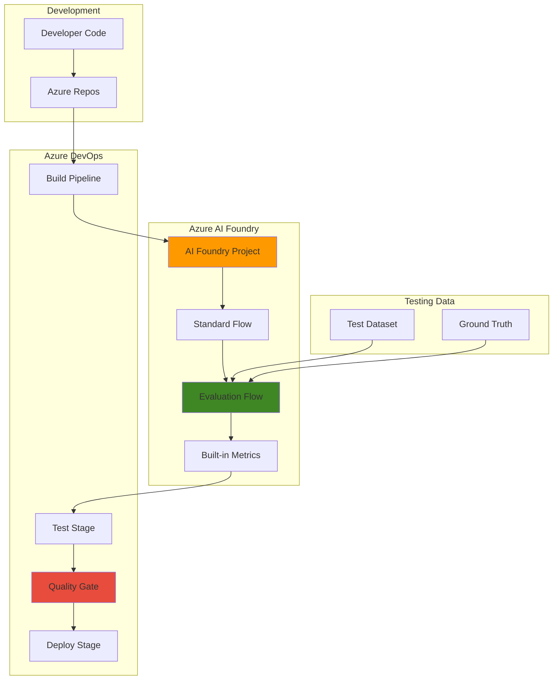

# AI Application Testing with Evaluation Flows and AI Foundry

## Problem

Organizations deploying generative AI applications struggle with systematic quality assessment and testing processes. Without structured evaluation frameworks measuring groundedness, relevance, and coherence, teams face production risks including hallucinations, inconsistent responses, and regulatory compliance failures that can damage customer trust and business outcomes.

## Solution

Implement automated testing workflows using Azure AI Foundry's evaluation flows and Prompt Flow to systematically assess AI application quality. This approach combines built-in evaluation metrics with CI/CD integration through Azure DevOps, enabling continuous quality monitoring and automated gating based on performance thresholds before production deployment.

## Architecture Diagram



## Prerequisites

1. Azure subscription with AI Foundry and DevOps services access
2. Azure CLI installed and configured (version 2.58.0 or later)
3. Basic understanding of machine learning evaluation concepts
4. Knowledge of YAML pipeline syntax and Git workflows
5. Estimated cost: $15-25 for compute resources and model inference during testing

> **Note**: Ensure your Azure subscription has sufficient OpenAI model quota for evaluation runs, as AI-assisted metrics require GPT model deployments.

## Preparation

```bash
# Set environment variables for Azure resources
export RESOURCE_GROUP="rg-ai-testing-${RANDOM_SUFFIX}"
export LOCATION="eastus"
export SUBSCRIPTION_ID=$(az account show --query id --output tsv)

# Generate unique suffix for resource names
RANDOM_SUFFIX=$(openssl rand -hex 3)

# Create resource group for AI testing resources
az group create \
    --name ${RESOURCE_GROUP} \
    --location ${LOCATION} \
    --tags purpose=ai-testing environment=demo

echo "✅ Resource group created: ${RESOURCE_GROUP}"

# Create Azure AI Services resource (Foundry project base)
export AI_SERVICES_NAME="ai-testing-svc-${RANDOM_SUFFIX}"
az cognitiveservices account create \
    --name ${AI_SERVICES_NAME} \
    --resource-group ${RESOURCE_GROUP} \
    --location ${LOCATION} \
    --kind AIServices \
    --sku S0 \
    --custom-domain ${AI_SERVICES_NAME}

echo "✅ AI Services resource created: ${AI_SERVICES_NAME}"

# Get the AI Services endpoint for later use
export AI_ENDPOINT=$(az cognitiveservices account show \
    --name ${AI_SERVICES_NAME} \
    --resource-group ${RESOURCE_GROUP} \
    --query "properties.endpoint" --output tsv)
```

## Steps

1. **Create OpenAI Model Deployment for Evaluation**:

   Azure AI Foundry evaluation flows require GPT model deployments to power AI-assisted quality metrics like groundedness and coherence. These models act as judges to evaluate your AI application responses against established criteria, providing quantitative scores that enable automated quality gating in CI/CD pipelines.

   ```bash
   # Create OpenAI model deployment for evaluation
   export MODEL_DEPLOYMENT_NAME="gpt-4o-mini-eval"
   az cognitiveservices account deployment create \
       --name ${AI_SERVICES_NAME} \
       --resource-group ${RESOURCE_GROUP} \
       --deployment-name ${MODEL_DEPLOYMENT_NAME} \
       --model-name gpt-4o-mini \
       --model-version "2024-07-18" \
       --model-format OpenAI \
       --sku-capacity 10 \
       --sku-name Standard
   
   echo "✅ Evaluation model deployed: ${MODEL_DEPLOYMENT_NAME}"
   ```

   The GPT-4O-mini model provides cost-effective evaluation capabilities while maintaining high accuracy for quality assessment tasks. This deployment serves as the foundation for all AI-assisted evaluation metrics.

2. **Create Test Dataset for Evaluation**:

   Structured test data enables systematic evaluation of AI applications by providing consistent query-context-ground_truth triplets. This standardized format supports both traditional NLP metrics and AI-assisted quality assessments, forming the foundation for comprehensive evaluation workflows.

   ```bash
   # Create test dataset for evaluation
   cat > test_data.jsonl << 'EOF'
{"query": "What is the capital of France?", "context": "France is a country in Western Europe with Paris as its capital city.", "ground_truth": "Paris"}
{"query": "How does photosynthesis work?", "context": "Photosynthesis is the process by which plants convert sunlight into chemical energy using chlorophyll.", "ground_truth": "Plants use chlorophyll to convert sunlight, carbon dioxide, and water into glucose and oxygen"}
{"query": "What is machine learning?", "context": "Machine learning is a subset of artificial intelligence that enables computers to learn from data.", "ground_truth": "A branch of AI that allows systems to automatically learn and improve from experience without explicit programming"}
EOF
   
   # Upload test dataset to Azure Storage for AI Foundry access
   export STORAGE_ACCOUNT="aitesting${RANDOM_SUFFIX}"
   az storage account create \
       --name ${STORAGE_ACCOUNT} \
       --resource-group ${RESOURCE_GROUP} \
       --location ${LOCATION} \
       --sku Standard_LRS
   
   # Create container for test data
   export STORAGE_KEY=$(az storage account keys list \
       --resource-group ${RESOURCE_GROUP} \
       --account-name ${STORAGE_ACCOUNT} \
       --query '[0].value' --output tsv)
   
   az storage container create \
       --name test-datasets \
       --account-name ${STORAGE_ACCOUNT} \
       --account-key ${STORAGE_KEY}
   
   # Upload test dataset
   az storage blob upload \
       --file test_data.jsonl \
       --container-name test-datasets \
       --name ai-test-dataset.jsonl \
       --account-name ${STORAGE_ACCOUNT} \
       --account-key ${STORAGE_KEY}
   
   echo "✅ Test dataset uploaded to Azure Storage"
   ```

   The test dataset contains query-context-ground_truth triplets that provide comprehensive evaluation scenarios. This structured data enables both traditional NLP metrics and AI-assisted quality assessments.

3. **Create Custom Evaluation Flow**:

   Evaluation flows process AI application outputs and generate quantitative quality metrics. Custom evaluation flows enable tailored assessment criteria specific to your use case while leveraging Azure AI Foundry's built-in evaluators for comprehensive quality measurement across multiple dimensions.

   ```bash
   # Create evaluation flow directory structure
   mkdir -p evaluation_flow
   
   # Create flow configuration file
   cat > evaluation_flow/flow.dag.yaml << 'EOF'
$schema: https://azuremlschemas.azureedge.net/promptflow/1.0.0/flow.schema.json
inputs:
  query:
    type: string
  response:
    type: string
  context:
    type: string
  ground_truth:
    type: string
outputs:
  groundedness_score:
    type: object
    reference: ${evaluate_groundedness.output}
  relevance_score:
    type: object
    reference: ${evaluate_relevance.output}
  coherence_score:
    type: object
    reference: ${evaluate_coherence.output}
  overall_score:
    type: object
    reference: ${calculate_overall.output}
nodes:
- name: evaluate_groundedness
  type: python
  source:
    type: code
    path: groundedness_evaluator.py
  inputs:
    query: ${inputs.query}
    response: ${inputs.response}
    context: ${inputs.context}
- name: evaluate_relevance
  type: python
  source:
    type: code
    path: relevance_evaluator.py
  inputs:
    query: ${inputs.query}
    response: ${inputs.response}
    context: ${inputs.context}
- name: evaluate_coherence
  type: python
  source:
    type: code
    path: coherence_evaluator.py
  inputs:
    query: ${inputs.query}
    response: ${inputs.response}
- name: calculate_overall
  type: python
  source:
    type: code
    path: overall_calculator.py
  inputs:
    groundedness: ${evaluate_groundedness.output}
    relevance: ${evaluate_relevance.output}
    coherence: ${evaluate_coherence.output}
EOF
   
   echo "✅ Evaluation flow configuration created"
   ```

   The evaluation flow orchestrates multiple quality assessments in parallel, enabling comprehensive evaluation while maintaining performance efficiency through proper node dependencies and data flow management.

4. **Implement Evaluation Logic**:

   Evaluation nodes implement specific quality assessment algorithms using Azure AI Foundry's built-in evaluators. These Python scripts leverage the Azure AI Evaluation SDK to provide standardized, research-backed metrics that align with industry best practices for generative AI quality assessment.

   ```bash
   # Get AI Services endpoint and key for evaluators
   export AZURE_OPENAI_ENDPOINT="${AI_ENDPOINT}"
   export AZURE_OPENAI_API_KEY=$(az cognitiveservices account keys list \
       --name ${AI_SERVICES_NAME} \
       --resource-group ${RESOURCE_GROUP} \
       --query "key1" --output tsv)
   export AZURE_OPENAI_DEPLOYMENT="${MODEL_DEPLOYMENT_NAME}"
   
   # Create groundedness evaluator
   cat > evaluation_flow/groundedness_evaluator.py << 'EOF'
from azure.ai.evaluation import GroundednessEvaluator
import os

def main(query: str, response: str, context: str):
    # Initialize evaluator with model configuration
    model_config = {
        "azure_endpoint": os.environ.get("AZURE_OPENAI_ENDPOINT"),
        "api_key": os.environ.get("AZURE_OPENAI_API_KEY"),
        "azure_deployment": os.environ.get("AZURE_OPENAI_DEPLOYMENT")
    }
    
    evaluator = GroundednessEvaluator(model_config=model_config)
    
    # Evaluate groundedness
    result = evaluator(
        query=query,
        response=response,
        context=context
    )
    
    return {
        "groundedness": result["groundedness"],
        "reasoning": result.get("reasoning", "")
    }
EOF
   
   # Create relevance evaluator
   cat > evaluation_flow/relevance_evaluator.py << 'EOF'
from azure.ai.evaluation import RelevanceEvaluator
import os

def main(query: str, response: str, context: str):
    model_config = {
        "azure_endpoint": os.environ.get("AZURE_OPENAI_ENDPOINT"),
        "api_key": os.environ.get("AZURE_OPENAI_API_KEY"),
        "azure_deployment": os.environ.get("AZURE_OPENAI_DEPLOYMENT")
    }
    
    evaluator = RelevanceEvaluator(model_config=model_config)
    
    result = evaluator(
        query=query,
        response=response,
        context=context
    )
    
    return {
        "relevance": result["relevance"],
        "reasoning": result.get("reasoning", "")
    }
EOF
   
   # Create coherence evaluator
   cat > evaluation_flow/coherence_evaluator.py << 'EOF'
from azure.ai.evaluation import CoherenceEvaluator
import os

def main(query: str, response: str):
    model_config = {
        "azure_endpoint": os.environ.get("AZURE_OPENAI_ENDPOINT"),
        "api_key": os.environ.get("AZURE_OPENAI_API_KEY"),
        "azure_deployment": os.environ.get("AZURE_OPENAI_DEPLOYMENT")
    }
    
    evaluator = CoherenceEvaluator(model_config=model_config)
    
    result = evaluator(
        query=query,
        response=response
    )
    
    return {
        "coherence": result["coherence"],
        "reasoning": result.get("reasoning", "")
    }
EOF
   
   echo "✅ Evaluation logic implemented"
   ```

   Each evaluator leverages the Azure AI Evaluation SDK's built-in algorithms, ensuring consistent and reliable quality assessment aligned with academic research and industry standards for generative AI evaluation.

5. **Create Overall Score Calculator**:

   The overall score calculator aggregates individual evaluation metrics into composite scores that enable automated decision-making in CI/CD pipelines. This aggregation logic applies domain-specific weighting and threshold rules to determine overall application quality and deployment readiness.

   ```bash
   # Create overall score calculator
   cat > evaluation_flow/overall_calculator.py << 'EOF'
def main(groundedness, relevance, coherence):
    # Extract scores (assuming 1-5 scale from evaluators)
    groundedness_score = groundedness.get("groundedness", 0)
    relevance_score = relevance.get("relevance", 0)
    coherence_score = coherence.get("coherence", 0)
    
    # Calculate weighted overall score
    # Groundedness is most critical for factual accuracy
    weights = {
        "groundedness": 0.5,
        "relevance": 0.3,
        "coherence": 0.2
    }
    
    overall_score = (
        groundedness_score * weights["groundedness"] +
        relevance_score * weights["relevance"] +
        coherence_score * weights["coherence"]
    )
    
    # Determine quality tier
    if overall_score >= 4.0:
        quality_tier = "Excellent"
        pass_threshold = True
    elif overall_score >= 3.0:
        quality_tier = "Good"
        pass_threshold = True
    elif overall_score >= 2.0:
        quality_tier = "Fair"
        pass_threshold = False
    else:
        quality_tier = "Poor"
        pass_threshold = False
    
    return {
        "overall_score": overall_score,
        "quality_tier": quality_tier,
        "pass_threshold": pass_threshold,
        "individual_scores": {
            "groundedness": groundedness_score,
            "relevance": relevance_score,
            "coherence": coherence_score
        }
    }
EOF
   
   echo "✅ Overall score calculator created"
   ```

   The weighted scoring approach prioritizes groundedness for factual accuracy while maintaining balanced assessment across all quality dimensions. Threshold-based gating enables automated CI/CD decision-making.

6. **Package Evaluation Flow**:

   Packaging the evaluation flow with proper dependencies enables cloud-based execution with managed compute resources and integration with other Azure services. This step prepares the evaluation logic for deployment and CI/CD pipeline integration.

   ```bash
   # Create requirements file for evaluation flow
   cat > evaluation_flow/requirements.txt << 'EOF'
azure-ai-evaluation>=1.0.0
azure-identity>=1.12.0
openai>=1.0.0
EOF
   
   # Create flow package for deployment
   cd evaluation_flow
   zip -r ../ai-quality-evaluator.zip .
   cd ..
   
   echo "✅ Evaluation flow packaged for deployment"
   ```

   The packaged flow becomes available for batch evaluation runs and can be triggered programmatically through Azure CLI or REST APIs, enabling seamless CI/CD integration.

7. **Create Azure DevOps Pipeline for CI/CD Integration**:

   Azure DevOps pipelines automate the testing workflow by triggering evaluation flows on code changes and enforcing quality gates based on evaluation results. This automation ensures consistent quality assessment while preventing deployment of substandard AI applications.

   ```bash
   # Create Azure DevOps pipeline configuration
   mkdir -p .azuredevops/pipelines
   
   cat > .azuredevops/pipelines/ai-testing-pipeline.yml << 'EOF'
trigger:
  branches:
    include:
    - main
    - develop

variables:
  azureServiceConnection: 'azure-service-connection'
  resourceGroup: '$(RESOURCE_GROUP)'
  aiServicesName: '$(AI_SERVICES_NAME)'
  storageAccount: '$(STORAGE_ACCOUNT)'

stages:
- stage: Test
  displayName: 'AI Quality Testing'
  jobs:
  - job: EvaluateAIApplication
    displayName: 'Run Evaluation Flow'
    pool:
      vmImage: 'ubuntu-latest'
    
    steps:
    - task: AzureCLI@2
      displayName: 'Install AI Evaluation SDK'
      inputs:
        azureSubscription: $(azureServiceConnection)
        scriptType: 'bash'
        scriptLocation: 'inlineScript'
        inlineScript: |
          pip install azure-ai-evaluation[remote] \
                      azure-identity azure-ai-projects
    
    - task: AzureCLI@2
      displayName: 'Run AI Evaluation'
      inputs:
        azureSubscription: $(azureServiceConnection)
        scriptType: 'bash'
        scriptLocation: 'inlineScript'
        inlineScript: |
          # Set environment variables for evaluation
          export AZURE_OPENAI_ENDPOINT="${AI_ENDPOINT}"
          export AZURE_OPENAI_API_KEY=$(az cognitiveservices account keys list \
              --name $(aiServicesName) \
              --resource-group $(resourceGroup) \
              --query "key1" --output tsv)
          export AZURE_OPENAI_DEPLOYMENT="${MODEL_DEPLOYMENT_NAME}"
          
          # Run Python evaluation script
          python run_evaluation.py \
              --data-path test_data.jsonl \
              --output-path evaluation_results.json
          
          # Check quality gates
          python check_quality_gates.py evaluation_results.json

- stage: Deploy
  displayName: 'Deploy to Production'
  dependsOn: Test
  condition: succeeded()
  jobs:
  - deployment: DeployAIApplication
    displayName: 'Deploy AI Application'
    environment: 'production'
    strategy:
      runOnce:
        deploy:
          steps:
          - script: echo "Deploying AI application to production"
            displayName: 'Deploy Application'
EOF
   
   echo "✅ Azure DevOps pipeline configuration created"
   ```

   The pipeline implements a two-stage approach with quality gates, ensuring only applications meeting evaluation thresholds proceed to production deployment. This automated gating reduces manual oversight while maintaining quality standards.

8. **Create Evaluation Runner and Quality Gate Scripts**:

   The evaluation runner script orchestrates the evaluation process using the Azure AI Evaluation SDK, while the quality gate checker processes results and determines deployment eligibility. These scripts enable automated quality control throughout the development lifecycle.

   ```bash
   # Create evaluation runner script
   cat > run_evaluation.py << 'EOF'
#!/usr/bin/env python3
import argparse
import json
import os
from azure.ai.evaluation import evaluate, GroundednessEvaluator, \
                                   RelevanceEvaluator, CoherenceEvaluator

def main():
    parser = argparse.ArgumentParser(description='Run AI evaluation')
    parser.add_argument('--data-path', required=True, 
                       help='Path to test data JSONL file')
    parser.add_argument('--output-path', required=True, 
                       help='Path to save evaluation results')
    args = parser.parse_args()
    
    # Model configuration
    model_config = {
        "azure_endpoint": os.environ.get("AZURE_OPENAI_ENDPOINT"),
        "api_key": os.environ.get("AZURE_OPENAI_API_KEY"),
        "azure_deployment": os.environ.get("AZURE_OPENAI_DEPLOYMENT")
    }
    
    # Initialize evaluators
    evaluators = {
        "groundedness": GroundednessEvaluator(model_config=model_config),
        "relevance": RelevanceEvaluator(model_config=model_config),
        "coherence": CoherenceEvaluator(model_config=model_config)
    }
    
    # Mock target function for evaluation
    def mock_target_fn(query):
        # In real scenarios, this would call your AI application
        return {
            "response": f"Mock response for: {query}",
            "context": "Mock context information"
        }
    
    # Run evaluation
    result = evaluate(
        evaluation_name="ai-quality-assessment",
        data=args.data_path,
        target=mock_target_fn,
        evaluators=evaluators,
        output_path=args.output_path
    )
    
    print(f"Evaluation completed. Results saved to {args.output_path}")
    
    # Calculate overall scores
    overall_results = calculate_overall_scores(result)
    
    # Save overall results
    with open(args.output_path, 'w') as f:
        json.dump(overall_results, f, indent=2)

def calculate_overall_scores(result):
    """Calculate weighted overall scores from evaluation results."""
    weights = {"groundedness": 0.5, "relevance": 0.3, "coherence": 0.2}
    
    # Extract average scores (simplified for demo)
    avg_scores = {}
    for metric in weights.keys():
        if metric in result.metrics_summary:
            avg_scores[metric] = result.metrics_summary[metric]['mean']
        else:
            avg_scores[metric] = 0
    
    overall_score = sum(avg_scores[m] * weights[m] for m in weights.keys())
    
    return {
        "overall_score": overall_score,
        "quality_tier": "Good" if overall_score >= 3.0 else "Fair", 
        "pass_threshold": overall_score >= 3.0,
        "individual_scores": avg_scores
    }

if __name__ == "__main__":
    main()
EOF
   
   # Create quality gate checker script  
   cat > check_quality_gates.py << 'EOF'
#!/usr/bin/env python3
import json
import sys
import os

def check_quality_gates(results_file):
    """Check if evaluation results meet quality thresholds."""
    
    # Define quality thresholds
    THRESHOLDS = {
        "overall_score": 3.0,
        "groundedness": 3.0,
        "relevance": 2.5,
        "coherence": 2.5
    }
    
    try:
        with open(results_file, 'r') as f:
            results = json.load(f)
        
        # Extract scores from results
        overall_score = results.get("overall_score", 0)
        individual_scores = results.get("individual_scores", {})
        
        print(f"Overall Score: {overall_score}")
        print(f"Individual Scores: {individual_scores}")
        
        # Check overall threshold
        if overall_score < THRESHOLDS["overall_score"]:
            print(f"❌ Overall score {overall_score} below threshold {THRESHOLDS['overall_score']}")
            sys.exit(1)
        
        # Check individual score thresholds
        for metric, threshold in THRESHOLDS.items():
            if metric == "overall_score":
                continue
                
            score = individual_scores.get(metric, 0)
            if score < threshold:
                print(f"❌ {metric} score {score} below threshold {threshold}")
                sys.exit(1)
        
        print("✅ All quality gates passed!")
        print("🚀 Proceeding with deployment")
        
    except Exception as e:
        print(f"❌ Error checking quality gates: {str(e)}")
        sys.exit(1)

if __name__ == "__main__":
    if len(sys.argv) != 2:
        print("Usage: python check_quality_gates.py <results_file>")
        sys.exit(1)
    
    check_quality_gates(sys.argv[1])
EOF
   
   chmod +x run_evaluation.py check_quality_gates.py
   echo "✅ Evaluation runner and quality gate scripts created"
   ```

   The quality gate script provides clear pass/fail decisions based on configurable thresholds, enabling teams to customize quality standards while maintaining automated enforcement throughout the deployment pipeline.

## Validation & Testing

1. **Test Evaluation Flow Execution**:

   ```bash
   # Set environment variables for testing
   export AZURE_OPENAI_ENDPOINT="${AI_ENDPOINT}"
   export AZURE_OPENAI_API_KEY=$(az cognitiveservices account keys list \
       --name ${AI_SERVICES_NAME} \
       --resource-group ${RESOURCE_GROUP} \
       --query "key1" --output tsv)
   export AZURE_OPENAI_DEPLOYMENT="${MODEL_DEPLOYMENT_NAME}"
   
   # Run evaluation flow against test data
   python run_evaluation.py \
       --data-path test_data.jsonl \
       --output-path test_results.json
   
   echo "Evaluation run completed successfully"
   ```

   Expected output: Successful evaluation execution with generated metrics for each test case and overall quality assessment scores.

2. **Verify Evaluation Results**:

   ```bash
   # Check evaluation results
   cat test_results.json | jq '.'
   
   # Verify results structure contains required fields
   python -c "
import json
with open('test_results.json') as f:
    results = json.load(f)
assert 'overall_score' in results
assert 'individual_scores' in results
print('✅ Results structure validated')
"
   ```

   Expected output: JSON results containing overall_score, quality_tier, pass_threshold, and individual_scores for groundedness, relevance, and coherence metrics.

3. **Test Quality Gate Logic**:

   ```bash
   # Create sample results for testing
   cat > sample_results.json << 'EOF'
{
  "overall_score": 3.5,
  "quality_tier": "Good",
  "pass_threshold": true,
  "individual_scores": {
    "groundedness": 4.0,
    "relevance": 3.5,
    "coherence": 3.0
  }
}
EOF
   
   # Test quality gate checker
   python check_quality_gates.py sample_results.json
   ```

   Expected output: "✅ All quality gates passed!" message indicating successful threshold validation and readiness for deployment.

## Cleanup

1. **Remove AI Services and Model Deployments**:

   ```bash
   # Delete model deployment
   az cognitiveservices account deployment delete \
       --name ${AI_SERVICES_NAME} \
       --resource-group ${RESOURCE_GROUP} \
       --deployment-name ${MODEL_DEPLOYMENT_NAME}
   
   # Delete AI Services resource
   az cognitiveservices account delete \
       --name ${AI_SERVICES_NAME} \
       --resource-group ${RESOURCE_GROUP}
   
   echo "✅ AI Services resources deleted"
   ```

2. **Remove Storage Resources**:

   ```bash
   # Delete storage account
   az storage account delete \
       --name ${STORAGE_ACCOUNT} \
       --resource-group ${RESOURCE_GROUP} \
       --yes
   
   echo "✅ Storage resources deleted"
   ```

3. **Remove Resource Group and Local Files**:

   ```bash
   # Delete resource group and all contained resources
   az group delete \
       --name ${RESOURCE_GROUP} \
       --yes \
       --no-wait
   
   echo "✅ Resource group deletion initiated: ${RESOURCE_GROUP}"
   echo "Note: Deletion may take several minutes to complete"
   
   # Remove local test files and directories
   rm -rf evaluation_flow/ .azuredevops/ test_data.jsonl \
          sample_results.json run_evaluation.py \
          check_quality_gates.py test_results.json \
          ai-quality-evaluator.zip
   
   echo "✅ Local files cleaned up"
   ```

## Discussion

This recipe implements a comprehensive GenAIOps testing framework using Azure AI Foundry's evaluation capabilities and Prompt Flow integration. The solution addresses the critical challenge of systematic quality assessment for generative AI applications by combining automated evaluation metrics with CI/CD pipeline integration through Azure DevOps.

The evaluation framework leverages Azure AI Foundry's built-in evaluators that implement research-backed quality metrics. Groundedness evaluation measures how well responses align with provided context, preventing hallucinations and ensuring factual accuracy. Relevance evaluation assesses response appropriateness to user queries, while coherence evaluation measures logical flow and readability. These AI-assisted metrics use GPT models as judges, providing nuanced assessment that traditional rule-based approaches cannot achieve.

The CI/CD integration through Azure DevOps enables automated quality gates that prevent deployment of substandard AI applications. By implementing threshold-based decision making, teams can enforce consistent quality standards while maintaining development velocity. The weighted scoring approach prioritizes critical metrics like groundedness while maintaining balanced assessment across all quality dimensions, enabling domain-specific customization based on business requirements.

The architecture follows Azure Well-Architected Framework principles by implementing proper separation of concerns, automated monitoring, and cost optimization through efficient resource utilization. The solution scales automatically with Azure's managed services while providing comprehensive observability through detailed evaluation logs and metrics tracking. The modular design enables teams to customize evaluation criteria and thresholds based on specific use cases and compliance requirements.

> **Tip**: Configure evaluation model quotas appropriately to handle batch evaluation workloads. Monitor token usage and consider using GPT-4O-mini for cost-effective evaluation while maintaining assessment quality.

**Sources:**
- [Azure AI Foundry Evaluation Documentation](https://learn.microsoft.com/en-us/azure/ai-foundry/how-to/evaluate-generative-ai-app)
- [Azure AI Evaluation SDK](https://learn.microsoft.com/en-us/azure/ai-foundry/how-to/develop/evaluate-sdk)
- [Azure AI Foundry SDK Overview](https://learn.microsoft.com/en-us/azure/ai-foundry/how-to/develop/sdk-overview)
- [Azure DevOps Pipeline Integration](https://learn.microsoft.com/en-us/azure/devops/pipelines/)
- [Azure Well-Architected Framework for AI](https://learn.microsoft.com/en-us/azure/well-architected/mission-critical/mission-critical-deployment-testing)

## Challenge

Extend this evaluation framework by implementing these enhancements:

1. **Multi-Model Evaluation**: Create evaluation flows that compare responses across different LLM deployments, enabling A/B testing and model performance benchmarking with automated winner selection based on composite scores.

2. **Custom Domain Evaluators**: Develop domain-specific evaluation metrics for specialized use cases like medical accuracy, legal compliance, or financial analysis using custom Python evaluators and prompt-based assessment criteria.

3. **Advanced Safety Testing**: Integrate Azure AI Content Safety evaluators and adversarial testing simulators to detect potential harmful outputs, jailbreak attempts, and bias in AI application responses.

4. **Production Monitoring Integration**: Extend the framework to continuously evaluate production AI applications using Azure Monitor and Application Insights, enabling drift detection and automated retraining triggers.

5. **Human-in-the-Loop Validation**: Implement approval workflows for borderline evaluation results, combining automated assessment with human expert review for complex evaluation scenarios requiring domain expertise.

## Infrastructure Code

*Infrastructure code will be generated after recipe approval.*