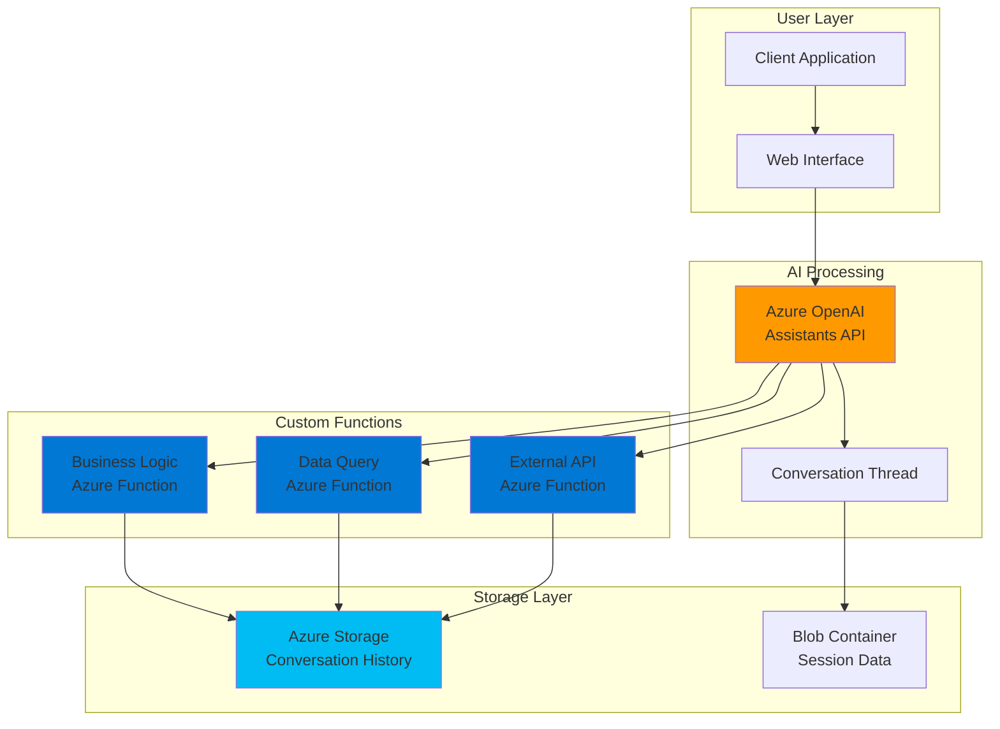

# AI Assistant with Custom Functions using OpenAI and Functions

## Problem

Enterprise organizations struggle to build intelligent AI assistants that can interact with internal business systems and execute custom logic beyond simple text generation. Traditional chatbots lack the ability to perform dynamic actions like querying databases, accessing proprietary APIs, or executing complex business workflows, limiting their effectiveness for real-world business scenarios requiring contextual actions and data persistence.

## Solution

Build an intelligent AI assistant using Azure OpenAI Assistants API with custom function calling capabilities powered by Azure Functions. The solution leverages serverless architecture to create scalable custom tools that the AI can invoke dynamically, while using Azure Storage for conversation persistence and session management, enabling sophisticated business automation with enterprise-grade security and scalability.

## Architecture Diagram



## Prerequisites

1. Azure subscription with appropriate permissions to create Azure OpenAI, Functions, and Storage resources
2. Azure CLI installed and configured, or access to Azure Cloud Shell
3. Basic understanding of serverless architecture and AI assistant concepts
4. Python 3.11+ installed locally for function development (if developing locally)
5. Azure Functions Core Tools v4 installed for local development and deployment
6. Estimated cost: $20-40 for Azure OpenAI, $5-10 for Functions, $2-5 for Storage during recipe execution

> **Note**: This recipe follows Azure Well-Architected Framework principles for reliability, security, and cost optimization. See [Azure Architecture Center](https://learn.microsoft.com/en-us/azure/architecture/) for additional guidance.

## Preparation

```bash
# Set environment variables for Azure resources
export RESOURCE_GROUP="rg-ai-assistant-${RANDOM_SUFFIX}"
export LOCATION="eastus"
export SUBSCRIPTION_ID=$(az account show --query id --output tsv)

# Generate unique suffix for resource names
RANDOM_SUFFIX=$(openssl rand -hex 3)

# Set resource names with unique suffix
export OPENAI_ACCOUNT="openai-assistant-${RANDOM_SUFFIX}"
export FUNCTION_APP="func-assistant-${RANDOM_SUFFIX}"
export STORAGE_ACCOUNT="stassistant${RANDOM_SUFFIX}"

# Create resource group
az group create \
    --name ${RESOURCE_GROUP} \
    --location ${LOCATION} \
    --tags purpose=recipe environment=demo

echo "✅ Resource group created: ${RESOURCE_GROUP}"

# Create storage account for conversation history and function storage
az storage account create \
    --name ${STORAGE_ACCOUNT} \
    --resource-group ${RESOURCE_GROUP} \
    --location ${LOCATION} \
    --sku Standard_LRS \
    --kind StorageV2

echo "✅ Storage account created: ${STORAGE_ACCOUNT}"

# Get storage connection string
export STORAGE_CONNECTION_STRING=$(az storage account show-connection-string \
    --name ${STORAGE_ACCOUNT} \
    --resource-group ${RESOURCE_GROUP} \
    --query connectionString --output tsv)
```

## Steps

1. **Deploy Azure OpenAI Service with Assistants API**:

   Azure OpenAI Assistants API enables you to create AI assistants with sophisticated reasoning capabilities and custom function calling. The Assistants API manages conversation threads automatically and provides built-in support for parallel tool execution, making it ideal for complex business workflows that require both conversational AI and custom business logic integration.

   ```bash
   # Create Azure OpenAI account
   az cognitiveservices account create \
       --name ${OPENAI_ACCOUNT} \
       --resource-group ${RESOURCE_GROUP} \
       --location ${LOCATION} \
       --kind OpenAI \
       --sku S0 \
       --yes
   
   # Get OpenAI endpoint and key
   export OPENAI_ENDPOINT=$(az cognitiveservices account show \
       --name ${OPENAI_ACCOUNT} \
       --resource-group ${RESOURCE_GROUP} \
       --query properties.endpoint --output tsv)
   
   export OPENAI_KEY=$(az cognitiveservices account keys list \
       --name ${OPENAI_ACCOUNT} \
       --resource-group ${RESOURCE_GROUP} \
       --query key1 --output tsv)
   
   echo "✅ Azure OpenAI account created: ${OPENAI_ENDPOINT}"
   ```

   The Azure OpenAI service is now configured with the latest Assistants API capabilities, providing access to GPT-4 models with function calling support and persistent conversation threads.

2. **Deploy GPT-4 Model for Assistant**:

   GPT-4 provides the advanced reasoning capabilities required for intelligent function calling decisions. The model analyzes user requests and determines when to invoke custom functions, parse function parameters, and integrate function responses into natural language responses.

   ```bash
   # Deploy GPT-4 model (adjust model version based on availability)
   az cognitiveservices account deployment create \
       --name ${OPENAI_ACCOUNT} \
       --resource-group ${RESOURCE_GROUP} \
       --deployment-name gpt-4-assistant \
       --model-name gpt-4 \
       --model-version "0613" \
       --model-format OpenAI \
       --sku-capacity 10 \
       --sku-name Standard
   
   export MODEL_DEPLOYMENT="gpt-4-assistant"
   
   echo "✅ GPT-4 model deployed: ${MODEL_DEPLOYMENT}"
   ```

   The GPT-4 deployment provides the foundation for sophisticated AI assistant capabilities with support for function calling and complex reasoning tasks.

3. **Create Azure Functions App for Custom Tools**:

   Azure Functions provides the serverless compute platform for implementing custom business logic that the AI assistant can invoke. The Flex Consumption plan ensures cost-effective scaling based on actual function executions, making it ideal for AI assistant workloads with variable demand patterns.

   ```bash
   # Create Function App with Flex Consumption plan
   az functionapp create \
       --name ${FUNCTION_APP} \
       --resource-group ${RESOURCE_GROUP} \
       --consumption-plan-location ${LOCATION} \
       --runtime python \
       --runtime-version 3.11 \
       --functions-version 4 \
       --storage-account ${STORAGE_ACCOUNT} \
       --os-type Linux
   
   # Configure Function App settings
   az functionapp config appsettings set \
       --name ${FUNCTION_APP} \
       --resource-group ${RESOURCE_GROUP} \
       --settings \
       "OPENAI_ENDPOINT=${OPENAI_ENDPOINT}" \
       "OPENAI_KEY=${OPENAI_KEY}" \
       "STORAGE_CONNECTION_STRING=${STORAGE_CONNECTION_STRING}"
   
   echo "✅ Function App created: ${FUNCTION_APP}"
   ```

   The Function App is now configured with the necessary environment variables and scaling policies to support AI assistant function calling scenarios with automatic scaling and cost optimization.

4. **Create Storage Containers for Conversation Management**:

   Azure Storage provides persistent storage for conversation history, session state, and assistant context. Blob containers organize different types of data with appropriate access patterns and lifecycle policies for cost optimization.

   ```bash
   # Create blob containers for different data types
   az storage container create \
       --name conversations \
       --account-name ${STORAGE_ACCOUNT} \
       --connection-string "${STORAGE_CONNECTION_STRING}"
   
   az storage container create \
       --name sessions \
       --account-name ${STORAGE_ACCOUNT} \
       --connection-string "${STORAGE_CONNECTION_STRING}"
   
   az storage container create \
       --name assistant-data \
       --account-name ${STORAGE_ACCOUNT} \
       --connection-string "${STORAGE_CONNECTION_STRING}"
   
   echo "✅ Storage containers created for conversation management"
   ```

   The storage containers provide organized, scalable storage for different aspects of the AI assistant's data requirements with built-in redundancy and security.

5. **Deploy Business Logic Functions**:

   Custom functions enable the AI assistant to perform specific business operations like data queries, calculations, and external API calls. Each function is designed as a discrete, testable unit that the assistant can invoke with parsed parameters.

   ```bash
   # Create local function project directory
   mkdir -p assistant-functions && cd assistant-functions
   
   # Initialize Function project with Python
   func init . --python
   
   # Create business logic function
   func new --name GetCustomerInfo --template "HTTP trigger"
   
   # Create the customer info function code
   cat > GetCustomerInfo/__init__.py << 'EOF'
import logging
import json
import azure.functions as func
from datetime import datetime
import random

def main(req: func.HttpRequest) -> func.HttpResponse:
    logging.info('Processing GetCustomerInfo request.')

    try:
        req_body = req.get_json()
        customer_id = req_body.get('customerId')
        include_history = req_body.get('includeHistory', False)
        
        if not customer_id:
            return func.HttpResponse(
                json.dumps({"success": False, "error": "customerId is required"}),
                status_code=400,
                mimetype="application/json"
            )
        
        # Simulate customer data retrieval
        customer_data = {
            "id": customer_id,
            "name": f"Customer {customer_id}",
            "status": "Active",
            "joinDate": "2023-01-15",
            "totalOrders": random.randint(1, 100),
            "recentActivity": [
                {"date": "2024-07-10", "action": "Order placed", "amount": "$150.00"},
                {"date": "2024-07-05", "action": "Account updated", "amount": None}
            ] if include_history else None
        }
        
        return func.HttpResponse(
            json.dumps({
                "success": True,
                "data": customer_data,
                "message": f"Retrieved information for customer {customer_id}"
            }),
            status_code=200,
            mimetype="application/json"
        )
    except Exception as e:
        logging.error(f"Error processing request: {str(e)}")
        return func.HttpResponse(
            json.dumps({"success": False, "error": str(e)}),
            status_code=500,
            mimetype="application/json"
        )
EOF
   
   echo "✅ Business logic function created"
   ```

   The custom function implements a RESTful interface that the AI assistant can call with structured parameters, enabling seamless integration between natural language requests and business data systems.

6. **Deploy Analytics Function**:

   Analytics functions provide the AI assistant with data analysis capabilities, enabling it to process and interpret business metrics, trends, and insights from various data sources.

   ```bash
   # Create analytics function
   func new --name AnalyzeMetrics --template "HTTP trigger"
   
   # Create analytics function code
   cat > AnalyzeMetrics/__init__.py << 'EOF'
import logging
import json
import azure.functions as func
import random

def main(req: func.HttpRequest) -> func.HttpResponse:
    logging.info('Processing AnalyzeMetrics request.')

    try:
        req_body = req.get_json()
        metric = req_body.get('metric')
        timeframe = req_body.get('timeframe')
        filters = req_body.get('filters', {})
        
        if not metric or not timeframe:
            return func.HttpResponse(
                json.dumps({"success": False, "error": "metric and timeframe are required"}),
                status_code=400,
                mimetype="application/json"
            )
        
        # Simulate analytics data generation
        current_value = random.randint(1000, 10000)
        previous_value = random.randint(800, 8000)
        change_percent = round(((current_value - previous_value) / previous_value) * 100, 1)
        
        analytics_data = {
            "metric": metric,
            "timeframe": timeframe,
            "currentValue": current_value,
            "previousValue": previous_value,
            "changePercent": change_percent,
            "trend": "increasing" if change_percent > 0 else "decreasing",
            "insights": [
                f"{metric} shows {abs(change_percent)}% {'increase' if change_percent > 0 else 'decrease'} over {timeframe}",
                "Peak activity observed during business hours",
                "Recommend monitoring for continued trends"
            ],
            "recommendations": [
                "Continue current strategy for positive trends" if change_percent > 0 else "Implement optimization for declining metrics",
                "Set up automated alerts for significant changes"
            ]
        }
        
        return func.HttpResponse(
            json.dumps({
                "success": True,
                "data": analytics_data,
                "message": f"Analytics completed for {metric} over {timeframe}"
            }),
            status_code=200,
            mimetype="application/json"
        )
    except Exception as e:
        logging.error(f"Error processing request: {str(e)}")
        return func.HttpResponse(
            json.dumps({"success": False, "error": str(e)}),
            status_code=500,
            mimetype="application/json"
        )
EOF
   
   echo "✅ Analytics function created"
   ```

   The analytics function provides structured data analysis that enables the AI assistant to deliver actionable business insights and recommendations based on real-time metrics.

7. **Build and Deploy Functions**:

   The deployment process packages Python functions and uploads them to Azure Functions with proper configuration and environment variables for seamless operation in production.

   ```bash
   # Deploy functions to Azure
   func azure functionapp publish ${FUNCTION_APP}
   
   # Get function URLs for assistant configuration
   export CUSTOMER_FUNCTION_URL=$(func azure functionapp list-functions ${FUNCTION_APP} --show-keys | grep -A 1 "GetCustomerInfo" | grep "Invoke url" | awk '{print $3}')
   
   export ANALYTICS_FUNCTION_URL=$(func azure functionapp list-functions ${FUNCTION_APP} --show-keys | grep -A 1 "AnalyzeMetrics" | grep "Invoke url" | awk '{print $3}')
   
   cd ..
   echo "✅ Functions deployed successfully"
   ```

   The functions are now deployed and accessible via HTTPS endpoints, ready for integration with the Azure OpenAI Assistants API.

8. **Create AI Assistant with Custom Functions**:

   The AI Assistant configuration defines the system instructions, available tools, and function schemas that enable intelligent function calling based on user requests. The assistant uses GPT-4's reasoning capabilities to determine when and how to invoke custom functions.

   ```bash
   # Create assistant configuration script
   cat > create-assistant.py << 'EOF'
import os
import json
from openai import AzureOpenAI

# Initialize Azure OpenAI client
client = AzureOpenAI(
    api_key=os.getenv("OPENAI_KEY"),
    api_version="2024-02-15-preview",
    azure_endpoint=os.getenv("OPENAI_ENDPOINT")
)

# Define custom function schemas
customer_function = {
    "type": "function",
    "function": {
        "name": "get_customer_info",
        "description": "Retrieve customer information and order history",
        "parameters": {
            "type": "object",
            "properties": {
                "customerId": {
                    "type": "string",
                    "description": "The unique customer identifier"
                },
                "includeHistory": {
                    "type": "boolean",
                    "description": "Whether to include recent activity history"
                }
            },
            "required": ["customerId"]
        }
    }
}

analytics_function = {
    "type": "function", 
    "function": {
        "name": "analyze_metrics",
        "description": "Analyze business metrics and provide insights",
        "parameters": {
            "type": "object",
            "properties": {
                "metric": {
                    "type": "string",
                    "description": "The metric to analyze (e.g., 'sales', 'traffic', 'conversion')"
                },
                "timeframe": {
                    "type": "string",
                    "description": "Time period for analysis (e.g., 'last_week', 'last_month')"
                },
                "filters": {
                    "type": "object",
                    "description": "Optional filters for the analysis"
                }
            },
            "required": ["metric", "timeframe"]
        }
    }
}

# Create assistant
assistant = client.beta.assistants.create(
    name="Business Intelligence Assistant",
    instructions="""You are a helpful business intelligence assistant that can access 
    customer information and perform analytics. Use the available functions to retrieve 
    data and provide insights. Always explain your findings clearly and offer actionable 
    recommendations based on the data you receive.""",
    model="gpt-4-assistant",
    tools=[customer_function, analytics_function]
)

print(f"Assistant created with ID: {assistant.id}")
with open("assistant_id.txt", "w") as f:
    f.write(assistant.id)
EOF
   
   # Install required Python packages
   pip install openai azure-storage-blob requests
   
   # Run assistant creation
   python create-assistant.py
   export ASSISTANT_ID=$(cat assistant_id.txt)
   
   echo "✅ AI Assistant created with custom functions: ${ASSISTANT_ID}"
   ```

   The AI Assistant is now configured with custom function calling capabilities and can intelligently decide when to invoke business logic functions based on user conversations.

9. **Create Conversation Management System**:

   The conversation management system handles thread creation, message processing, and function execution coordination between the AI assistant and custom Azure Functions, ensuring seamless user experience with proper error handling and state management.

   ```bash
   # Create conversation manager script
   cat > conversation-manager.py << 'EOF'
import os
import json
import requests
from datetime import datetime
from openai import AzureOpenAI
from azure.storage.blob import BlobServiceClient
import time

class ConversationManager:
    def __init__(self):
        self.client = AzureOpenAI(
            api_key=os.getenv("OPENAI_KEY"),
            api_version="2024-02-15-preview",
            azure_endpoint=os.getenv("OPENAI_ENDPOINT")
        )
        self.assistant_id = os.getenv("ASSISTANT_ID")
        self.storage_client = BlobServiceClient.from_connection_string(
            os.getenv("STORAGE_CONNECTION_STRING")
        )
        
    def create_thread(self):
        thread = self.client.beta.threads.create()
        return thread.id
        
    def save_conversation(self, thread_id, message, response):
        try:
            container_client = self.storage_client.get_container_client("conversations")
            conversation_data = {
                "thread_id": thread_id,
                "message": message,
                "response": response,
                "timestamp": datetime.utcnow().isoformat()
            }
            
            blob_name = f"{thread_id}/{datetime.utcnow().isoformat()}.json"
            container_client.upload_blob(
                name=blob_name,
                data=json.dumps(conversation_data),
                overwrite=True
            )
        except Exception as e:
            print(f"Error saving conversation: {e}")
    
    def execute_function_call(self, function_name, arguments):
        function_urls = {
            "get_customer_info": os.getenv("CUSTOMER_FUNCTION_URL"),
            "analyze_metrics": os.getenv("ANALYTICS_FUNCTION_URL")
        }
        
        if function_name in function_urls:
            try:
                response = requests.post(
                    function_urls[function_name],
                    json=json.loads(arguments),
                    headers={"Content-Type": "application/json"},
                    timeout=30
                )
                return response.json()
            except Exception as e:
                return {"error": f"Function execution failed: {str(e)}"}
        else:
            return {"error": f"Unknown function: {function_name}"}
    
    def process_message(self, thread_id, message):
        # Add message to thread
        self.client.beta.threads.messages.create(
            thread_id=thread_id,
            role="user",
            content=message
        )
        
        # Create and execute run
        run = self.client.beta.threads.runs.create(
            thread_id=thread_id,
            assistant_id=self.assistant_id
        )
        
        # Handle function calls with timeout protection
        max_wait_time = 300  # 5 minutes
        start_time = time.time()
        
        while run.status in ["queued", "in_progress", "requires_action"]:
            if time.time() - start_time > max_wait_time:
                print("Run timed out")
                break
                
            if run.status == "requires_action":
                tool_calls = run.required_action.submit_tool_outputs.tool_calls
                tool_outputs = []
                
                for tool_call in tool_calls:
                    function_name = tool_call.function.name
                    arguments = tool_call.function.arguments
                    
                    result = self.execute_function_call(function_name, arguments)
                    tool_outputs.append({
                        "tool_call_id": tool_call.id,
                        "output": json.dumps(result)
                    })
                
                run = self.client.beta.threads.runs.submit_tool_outputs(
                    thread_id=thread_id,
                    run_id=run.id,
                    tool_outputs=tool_outputs
                )
            else:
                run = self.client.beta.threads.runs.retrieve(
                    thread_id=thread_id,
                    run_id=run.id
                )
                time.sleep(1)  # Wait before checking again
        
        # Get assistant response
        messages = self.client.beta.threads.messages.list(thread_id=thread_id)
        response = messages.data[0].content[0].text.value
        
        # Save conversation
        self.save_conversation(thread_id, message, response)
        
        return response

# Example usage
if __name__ == "__main__":
    manager = ConversationManager()
    thread_id = manager.create_thread()
    
    response = manager.process_message(
        thread_id, 
        "Can you get information for customer ID CUST001 and analyze our sales metrics for last month?"
    )
    
    print(f"Assistant Response: {response}")
EOF
   
   echo "✅ Conversation management system created"
   ```

   The conversation management system now provides comprehensive functionality for handling AI assistant interactions with proper function calling, storage integration, timeout protection, and error handling.

## Validation & Testing

1. **Verify AI Assistant Function Registration**:

   ```bash
   # Test assistant retrieval
   python -c "
   import os
   from openai import AzureOpenAI
   
   client = AzureOpenAI(
       api_key=os.environ['OPENAI_KEY'],
       api_version='2024-02-15-preview',
       azure_endpoint=os.environ['OPENAI_ENDPOINT']
   )
   
   assistant = client.beta.assistants.retrieve('${ASSISTANT_ID}')
   print(f'Assistant: {assistant.name}')
   print(f'Tools: {len(assistant.tools)} functions registered')
   for tool in assistant.tools:
       if tool.type == 'function':
           print(f'  - {tool.function.name}: {tool.function.description}')
   "
   ```

   Expected output: Assistant details with registered custom functions

2. **Test Custom Function Endpoints**:

   ```bash
   # Test customer function
   curl -X POST "${CUSTOMER_FUNCTION_URL}" \
       -H "Content-Type: application/json" \
       -d '{"customerId": "CUST001", "includeHistory": true}'
   
   # Test analytics function  
   curl -X POST "${ANALYTICS_FUNCTION_URL}" \
       -H "Content-Type: application/json" \
       -d '{"metric": "sales", "timeframe": "last_month"}'
   ```

   Expected output: JSON responses with business data from both functions

3. **Test End-to-End Conversation Flow**:

   ```bash
   # Run complete conversation test
   export ASSISTANT_ID=${ASSISTANT_ID}
   export CUSTOMER_FUNCTION_URL=${CUSTOMER_FUNCTION_URL}
   export ANALYTICS_FUNCTION_URL=${ANALYTICS_FUNCTION_URL}
   
   python conversation-manager.py
   ```

   Expected output: AI assistant response incorporating data from custom functions

4. **Verify Storage Integration**:

   ```bash
   # Check conversation storage
   az storage blob list \
       --container-name conversations \
       --account-name ${STORAGE_ACCOUNT} \
       --connection-string "${STORAGE_CONNECTION_STRING}" \
       --output table
   ```

   Expected output: List of stored conversation files with timestamps

## Cleanup

1. **Remove Assistant and Threads**:

   ```bash
   # Clean up assistant resources
   python -c "
   import os
   from openai import AzureOpenAI
   
   client = AzureOpenAI(
       api_key=os.environ['OPENAI_KEY'],
       api_version='2024-02-15-preview', 
       azure_endpoint=os.environ['OPENAI_ENDPOINT']
   )
   
   client.beta.assistants.delete('${ASSISTANT_ID}')
   print('Assistant deleted')
   "
   
   echo "✅ AI Assistant resources cleaned up"
   ```

2. **Delete Azure Resources**:

   ```bash
   # Delete resource group and all contained resources
   az group delete \
       --name ${RESOURCE_GROUP} \
       --yes \
       --no-wait
   
   echo "✅ Resource group deletion initiated: ${RESOURCE_GROUP}"
   echo "Note: Deletion may take several minutes to complete"
   ```

3. **Clean Up Local Files**:

   ```bash
   # Remove local development files
   rm -rf assistant-functions/
   rm -f create-assistant.py conversation-manager.py assistant_id.txt
   
   # Clear environment variables
   unset RESOURCE_GROUP OPENAI_ACCOUNT FUNCTION_APP STORAGE_ACCOUNT
   unset OPENAI_ENDPOINT OPENAI_KEY ASSISTANT_ID
   unset CUSTOMER_FUNCTION_URL ANALYTICS_FUNCTION_URL
   
   echo "✅ Local cleanup completed"
   ```

## Discussion

The AI Assistant with Custom Functions pattern represents a significant advancement in enterprise AI capabilities, enabling organizations to create sophisticated conversational interfaces that can execute real business logic. This architecture leverages the Azure OpenAI Assistants API's function calling capabilities to bridge the gap between natural language interaction and structured business operations, following the latest Azure Well-Architected Framework principles.

The serverless architecture provides several key advantages for AI assistant implementations. Azure Functions with Flex Consumption plan offer automatic scaling based on demand, ensuring cost-effective operation during both low and peak usage periods. The consumption-based pricing model aligns costs directly with assistant usage, making it ideal for enterprise deployments where conversation volumes may vary significantly. Additionally, the stateless nature of Azure Functions ensures reliable execution of business logic while maintaining separation of concerns between AI reasoning and business operations. The integration with [Azure Application Insights](https://learn.microsoft.com/en-us/azure/azure-monitor/app/app-insights-overview) provides comprehensive monitoring and performance tracking.

Storage architecture plays a crucial role in maintaining conversation context and enabling sophisticated assistant behaviors. Azure Storage containers provide organized, scalable storage for different data types - conversation histories for audit and analysis, session state for maintaining context across interactions, and assistant configuration data for dynamic behavior modification. The integration with Azure Storage also enables advanced features like conversation analytics, usage monitoring, and compliance reporting through built-in blob storage lifecycle policies and [Azure Monitor integration](https://learn.microsoft.com/en-us/azure/azure-monitor/essentials/monitor-azure-resource).

Function calling integration demonstrates the power of combining large language models with structured business systems. The AI assistant can analyze user requests, determine appropriate functions to call, extract and validate parameters, execute business logic, and incorporate results into natural language responses. This creates a seamless user experience where complex business operations feel like natural conversation. The pattern is particularly effective for scenarios requiring data retrieval, calculations, external API integration, and workflow orchestration, as demonstrated in the [Azure OpenAI function calling documentation](https://learn.microsoft.com/en-us/azure/ai-foundry/openai/how-to/assistant-functions).

> **Tip**: Implement comprehensive logging and monitoring for function calls to track assistant performance, identify optimization opportunities, and ensure reliable business logic execution across all user interactions using Azure Application Insights and Log Analytics.

## Challenge

Extend this solution by implementing these enhancements:

1. **Multi-Modal Assistant Capabilities**: Add support for document analysis and image processing by integrating Azure Computer Vision and Form Recognizer services with custom functions that can analyze uploaded files and provide insights.

2. **Workflow Orchestration**: Implement Azure Durable Functions to create complex, multi-step business workflows that the assistant can initiate and monitor, such as approval processes or data pipeline orchestration.

3. **Real-Time Integration**: Add Azure Event Grid integration to enable the assistant to react to real-time business events and proactively notify users about important changes or required actions.

4. **Advanced Analytics and Insights**: Integrate with Azure Synapse Analytics to provide sophisticated data analysis capabilities and enable the assistant to generate complex reports and predictive insights from enterprise data sources.

5. **Enterprise Security and Governance**: Implement Azure Key Vault for secrets management, Azure Active Directory for authentication, and Azure Policy for compliance enforcement to meet enterprise security requirements.

## Infrastructure Code

### Available Infrastructure as Code:

- [Infrastructure Code Overview](code/README.md) - Detailed description of all infrastructure components
- [Bicep](code/bicep/) - Azure Bicep templates
- [Bash CLI Scripts](code/scripts/) - Example bash scripts using Azure CLI commands to deploy infrastructure
- [Terraform](code/terraform/) - Terraform configuration files