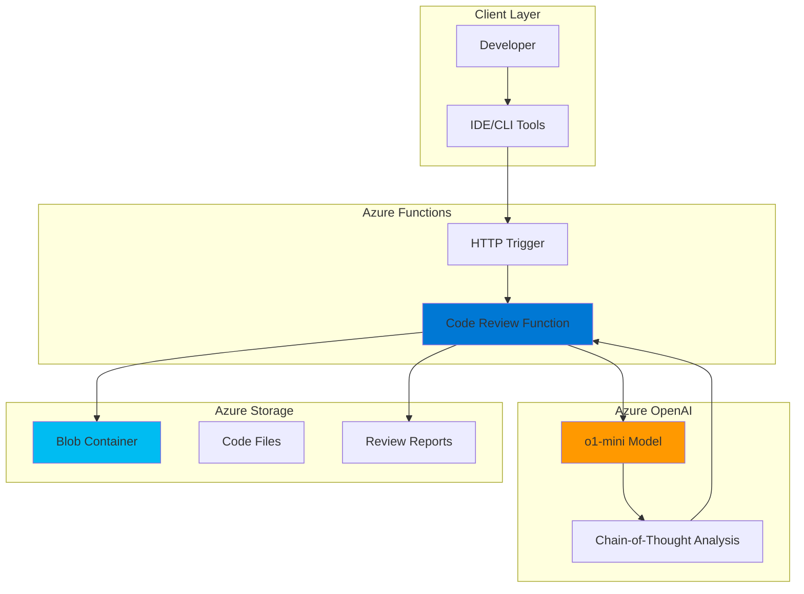

# AI Code Review Assistant with Reasoning and Functions

## Problem

Development teams struggle with inconsistent code review quality and lengthy review cycles that delay software delivery. Manual code reviews often miss subtle issues, lack comprehensive analysis of code complexity, and vary significantly based on reviewer expertise and availability. This creates bottlenecks in continuous integration pipelines and reduces overall code quality, ultimately impacting team productivity and software reliability.

## Solution

Build an intelligent code review system using Azure OpenAI's o1-mini reasoning model to provide comprehensive code analysis through serverless Azure Functions. The system automatically processes code files stored in Azure Blob Storage, leverages advanced reasoning capabilities to identify issues, suggest improvements, and generates structured review reports, enabling consistent and thorough code analysis at scale.

## Architecture Diagram



## Prerequisites

1. Azure subscription with appropriate permissions for creating OpenAI, Functions, and Storage resources
2. Azure CLI installed and configured (version 2.50.0 or later)
3. Azure Functions Core Tools (version 4.x or later)
4. Python 3.11 or later for local development
5. Basic understanding of Azure Functions and serverless computing concepts
6. Estimated cost: $15-25 for testing (primarily Azure OpenAI usage)

> **Note**: Azure OpenAI Service requires application approval and may have regional availability limitations. The o1-mini model is currently available in select regions including eastus, westus, and northcentralus.

## Preparation

```bash
# Set environment variables for Azure resources
export RESOURCE_GROUP="rg-ai-code-review-${RANDOM_SUFFIX}"
export LOCATION="eastus"
export SUBSCRIPTION_ID=$(az account show --query id --output tsv)

# Generate unique suffix for resource names
RANDOM_SUFFIX=$(openssl rand -hex 3)

# Create resource group
az group create \
    --name ${RESOURCE_GROUP} \
    --location ${LOCATION} \
    --tags purpose=recipe environment=demo

echo "✅ Resource group created: ${RESOURCE_GROUP}"

# Set additional environment variables
export STORAGE_ACCOUNT="stcodereview${RANDOM_SUFFIX}"
export FUNCTION_APP="func-code-review-${RANDOM_SUFFIX}"
export OPENAI_ACCOUNT="oai-code-review-${RANDOM_SUFFIX}"
```

## Steps

1. **Create Azure Storage Account for Code Files**:

   Azure Storage provides the foundational layer for our code review system, offering secure, scalable blob storage for both input code files and generated review reports. The storage account enables seamless integration with Azure Functions through built-in bindings and supports fine-grained access control for sensitive code assets.

   ```bash
   # Create storage account with standard performance tier
   az storage account create \
       --name ${STORAGE_ACCOUNT} \
       --resource-group ${RESOURCE_GROUP} \
       --location ${LOCATION} \
       --sku Standard_LRS \
       --kind StorageV2 \
       --access-tier Hot
   
   # Get storage connection string
   STORAGE_CONNECTION=$(az storage account show-connection-string \
       --name ${STORAGE_ACCOUNT} \
       --resource-group ${RESOURCE_GROUP} \
       --query connectionString --output tsv)
   
   echo "✅ Storage account created: ${STORAGE_ACCOUNT}"
   ```

   The storage account is now configured with hot access tier for frequent read/write operations on code files and review reports. This provides the persistent storage layer required for our serverless code review workflow.

2. **Create Blob Containers for Code and Reports**:

   ```bash
   # Create container for code files
   az storage container create \
       --name "code-files" \
       --connection-string "${STORAGE_CONNECTION}" \
       --public-access off
   
   # Create container for review reports
   az storage container create \
       --name "review-reports" \
       --connection-string "${STORAGE_CONNECTION}" \
       --public-access off
   
   echo "✅ Blob containers created for code and reports"
   ```

3. **Deploy Azure OpenAI Service with o1-mini Model**:

   Azure OpenAI's o1-mini reasoning model provides advanced chain-of-thought capabilities specifically optimized for complex code analysis tasks. This model excels at multi-step reasoning, making it ideal for identifying subtle code issues, architectural problems, and suggesting comprehensive improvements through systematic analysis.

   ```bash
   # Create Azure OpenAI resource
   az cognitiveservices account create \
       --name ${OPENAI_ACCOUNT} \
       --resource-group ${RESOURCE_GROUP} \
       --location ${LOCATION} \
       --kind OpenAI \
       --sku S0 \
       --custom-domain ${OPENAI_ACCOUNT}
   
   # Get OpenAI endpoint and key
   OPENAI_ENDPOINT=$(az cognitiveservices account show \
       --name ${OPENAI_ACCOUNT} \
       --resource-group ${RESOURCE_GROUP} \
       --query properties.endpoint --output tsv)
   
   OPENAI_KEY=$(az cognitiveservices account keys list \
       --name ${OPENAI_ACCOUNT} \
       --resource-group ${RESOURCE_GROUP} \
       --query key1 --output tsv)
   
   echo "✅ Azure OpenAI resource created: ${OPENAI_ACCOUNT}"
   ```

   The OpenAI service is now ready to deploy the o1-mini model for advanced code reasoning capabilities. This reasoning model will provide comprehensive analysis through step-by-step problem solving for complex code review tasks.

4. **Deploy o1-mini Model for Code Analysis**:

   ```bash
   # Deploy o1-mini model for code analysis
   az cognitiveservices account deployment create \
       --name ${OPENAI_ACCOUNT} \
       --resource-group ${RESOURCE_GROUP} \
       --deployment-name "o1-mini-code-review" \
       --model-name "o1-mini" \
       --model-version "2024-09-12" \
       --model-format OpenAI \
       --sku-capacity 10 \
       --sku-name "Standard"
   
   echo "✅ o1-mini model deployed for code analysis"
   ```

5. **Create Azure Function App with Python Runtime**:

   Azure Functions provides the serverless compute platform that orchestrates our code review workflow. The Python runtime environment enables seamless integration with Azure OpenAI SDK and blob storage operations, while automatically scaling based on review request volume and maintaining cost-effectiveness through consumption-based pricing.

   ```bash
   # Create Function App with Python 3.11 runtime
   az functionapp create \
       --name ${FUNCTION_APP} \
       --resource-group ${RESOURCE_GROUP} \
       --storage-account ${STORAGE_ACCOUNT} \
       --consumption-plan-location ${LOCATION} \
       --runtime python \
       --runtime-version 3.11 \
       --functions-version 4 \
       --os-type Linux
   
   echo "✅ Function App created: ${FUNCTION_APP}"
   ```

   The Function App is configured with Python 3.11 runtime and consumption pricing model, providing automatic scaling and cost optimization for variable code review workloads.

6. **Configure Function App Settings**:

   ```bash
   # Configure application settings for OpenAI and Storage
   az functionapp config appsettings set \
       --name ${FUNCTION_APP} \
       --resource-group ${RESOURCE_GROUP} \
       --settings \
       "AZURE_OPENAI_ENDPOINT=${OPENAI_ENDPOINT}" \
       "AZURE_OPENAI_KEY=${OPENAI_KEY}" \
       "AZURE_STORAGE_CONNECTION_STRING=${STORAGE_CONNECTION}" \
       "OPENAI_DEPLOYMENT_NAME=o1-mini-code-review"
   
   echo "✅ Function App configured with OpenAI and Storage settings"
   ```

7. **Create Local Function Project and Deploy Code**:

   ```bash
   # Create local directory for function code
   mkdir code-review-function && cd code-review-function
   
   # Initialize Function App project
   func init . --python --model V2
   
   # Create requirements.txt for dependencies
   cat << 'EOF' > requirements.txt
azure-functions
azure-storage-blob>=12.19.0
azure-identity>=1.15.0
openai>=1.40.0
python-dotenv>=1.0.0
EOF
   
   # Create the main function code
   cat << 'EOF' > function_app.py
import azure.functions as func
import json
import logging
import os
from azure.storage.blob import BlobServiceClient
from azure.identity import DefaultAzureCredential
from openai import AzureOpenAI
import datetime

app = func.FunctionApp(http_auth_level=func.AuthLevel.FUNCTION)

# Initialize clients
def get_openai_client():
    return AzureOpenAI(
        azure_endpoint=os.environ["AZURE_OPENAI_ENDPOINT"],
        api_key=os.environ["AZURE_OPENAI_KEY"],
        api_version="2024-10-21"
    )

def get_blob_client():
    return BlobServiceClient.from_connection_string(
        os.environ["AZURE_STORAGE_CONNECTION_STRING"]
    )

@app.route(route="review-code", methods=["POST"])
def review_code(req: func.HttpRequest) -> func.HttpResponse:
    """
    HTTP trigger function to analyze code and generate review reports
    Expects JSON payload with 'filename' and 'code_content' fields
    """
    logging.info('Code review request received')
    
    try:
        # Parse request data
        req_body = req.get_json()
        filename = req_body.get('filename')
        code_content = req_body.get('code_content')
        
        if not filename or not code_content:
            return func.HttpResponse(
                json.dumps({"error": "Missing filename or code_content"}),
                status_code=400,
                mimetype="application/json"
            )
        
        # Store code file in blob storage
        blob_client = get_blob_client()
        code_blob = blob_client.get_blob_client(
            container="code-files", 
            blob=filename
        )
        code_blob.upload_blob(code_content, overwrite=True)
        
        # Analyze code with OpenAI o1-mini
        openai_client = get_openai_client()
        
        system_prompt = """You are an expert code reviewer with deep knowledge of software engineering best practices, security vulnerabilities, performance optimization, and maintainability principles. 

Analyze the provided code systematically and provide a comprehensive review covering:
1. Code quality and style adherence
2. Potential bugs and logical errors
3. Security vulnerabilities and concerns
4. Performance optimization opportunities
5. Maintainability and readability improvements
6. Architecture and design pattern suggestions

Use chain-of-thought reasoning to work through each aspect methodically. Provide specific, actionable recommendations with code examples when appropriate."""

        user_prompt = f"""Please review the following code file: {filename}

Code content:
```
{code_content}
```

Provide a detailed analysis with severity levels (High, Medium, Low) for each issue found. Include positive aspects of the code as well as areas for improvement."""

        response = openai_client.chat.completions.create(
            model=os.environ["OPENAI_DEPLOYMENT_NAME"],
            messages=[
                {"role": "user", "content": user_prompt}
            ],
            max_completion_tokens=4000,
            temperature=0.1
        )
        
        review_content = response.choices[0].message.content
        
        # Create structured review report
        review_report = {
            "filename": filename,
            "review_timestamp": datetime.datetime.utcnow().isoformat(),
            "model_used": "o1-mini",
            "review_content": review_content,
            "metadata": {
                "code_length": len(code_content),
                "file_type": filename.split('.')[-1] if '.' in filename else "unknown"
            }
        }
        
        # Store review report in blob storage
        report_filename = f"review-{filename}-{datetime.datetime.utcnow().strftime('%Y%m%d_%H%M%S')}.json"
        report_blob = blob_client.get_blob_client(
            container="review-reports", 
            blob=report_filename
        )
        report_blob.upload_blob(
            json.dumps(review_report, indent=2), 
            overwrite=True
        )
        
        logging.info(f'Code review completed for {filename}')
        
        return func.HttpResponse(
            json.dumps({
                "status": "success",
                "filename": filename,
                "report_filename": report_filename,
                "review_summary": review_content[:500] + "..." if len(review_content) > 500 else review_content
            }),
            status_code=200,
            mimetype="application/json"
        )
        
    except Exception as e:
        logging.error(f'Error processing code review: {str(e)}')
        return func.HttpResponse(
            json.dumps({"error": f"Internal server error: {str(e)}"}),
            status_code=500,
            mimetype="application/json"
        )

@app.route(route="get-report", methods=["GET"])
def get_report(req: func.HttpRequest) -> func.HttpResponse:
    """
    HTTP trigger function to retrieve code review reports
    Expects 'report_filename' as query parameter
    """
    logging.info('Report retrieval request received')
    
    try:
        report_filename = req.params.get('report_filename')
        
        if not report_filename:
            return func.HttpResponse(
                json.dumps({"error": "Missing report_filename parameter"}),
                status_code=400,
                mimetype="application/json"
            )
        
        # Retrieve report from blob storage
        blob_client = get_blob_client()
        report_blob = blob_client.get_blob_client(
            container="review-reports", 
            blob=report_filename
        )
        
        report_content = report_blob.download_blob().readall()
        report_data = json.loads(report_content)
        
        logging.info(f'Report retrieved: {report_filename}')
        
        return func.HttpResponse(
            json.dumps(report_data, indent=2),
            status_code=200,
            mimetype="application/json"
        )
        
    except Exception as e:
        logging.error(f'Error retrieving report: {str(e)}')
        return func.HttpResponse(
            json.dumps({"error": f"Report not found or error: {str(e)}"}),
            status_code=404,
            mimetype="application/json"
        )
EOF
   
   echo "✅ Function code created locally"
   ```

   This comprehensive function code implements two HTTP endpoints: one for submitting code for review and another for retrieving generated reports. The code leverages Azure OpenAI's reasoning capabilities through carefully crafted prompts that guide systematic analysis, using the latest API version and proper parameter naming for o1-mini model compatibility.

8. **Deploy Function to Azure**:

   ```bash
   # Deploy function code to Azure
   func azure functionapp publish ${FUNCTION_APP} --python
   
   echo "✅ Function deployed to Azure: ${FUNCTION_APP}"
   ```

## Validation & Testing

1. **Test Code Review Function with Sample Code**:

   ```bash
   # Get Function App URL
   FUNCTION_URL=$(az functionapp show \
       --name ${FUNCTION_APP} \
       --resource-group ${RESOURCE_GROUP} \
       --query defaultHostName --output tsv)
   
   # Get function key for authentication
   FUNCTION_KEY=$(az functionapp keys list \
       --name ${FUNCTION_APP} \
       --resource-group ${RESOURCE_GROUP} \
       --query functionKeys.default --output tsv)
   
   # Test with sample Python code
   curl -X POST "https://${FUNCTION_URL}/api/review-code?code=${FUNCTION_KEY}" \
       -H "Content-Type: application/json" \
       -d '{
         "filename": "sample.py",
         "code_content": "def calculate_average(numbers):\n    total = 0\n    for num in numbers:\n        total += num\n    return total / len(numbers)\n\nresult = calculate_average([1, 2, 3, 4, 5])\nprint(result)"
       }'
   ```

   Expected output: JSON response with review analysis and report filename.

2. **Verify Blob Storage Contains Files**:

   ```bash
   # List code files in storage
   az storage blob list \
       --container-name "code-files" \
       --connection-string "${STORAGE_CONNECTION}" \
       --output table
   
   # List review reports
   az storage blob list \
       --container-name "review-reports" \
       --connection-string "${STORAGE_CONNECTION}" \
       --output table
   ```

3. **Test Report Retrieval Function**:

   ```bash
   # Get the report filename from the previous response and test retrieval
   curl "https://${FUNCTION_URL}/api/get-report?code=${FUNCTION_KEY}&report_filename=review-sample.py-20250723_143022.json"
   ```

   Expected output: Complete JSON review report with detailed analysis.

## Cleanup

1. **Remove Function App and associated resources**:

   ```bash
   # Delete Function App
   az functionapp delete \
       --name ${FUNCTION_APP} \
       --resource-group ${RESOURCE_GROUP}
   
   echo "✅ Deleted Function App"
   ```

2. **Remove Azure OpenAI Service**:

   ```bash
   # Delete OpenAI resource
   az cognitiveservices account delete \
       --name ${OPENAI_ACCOUNT} \
       --resource-group ${RESOURCE_GROUP}
   
   echo "✅ Deleted Azure OpenAI resource"
   ```

3. **Remove Storage Account**:

   ```bash
   # Delete Storage Account
   az storage account delete \
       --name ${STORAGE_ACCOUNT} \
       --resource-group ${RESOURCE_GROUP} \
       --yes
   
   echo "✅ Deleted Storage Account"
   ```

4. **Remove Resource Group**:

   ```bash
   # Delete resource group and all remaining resources
   az group delete \
       --name ${RESOURCE_GROUP} \
       --yes \
       --no-wait
   
   echo "✅ Resource group deletion initiated: ${RESOURCE_GROUP}"
   echo "Note: Deletion may take several minutes to complete"
   ```

## Discussion

This AI-powered code review system demonstrates the practical application of Azure OpenAI's o1-mini reasoning model for automated software quality assurance. The o1-mini model's chain-of-thought reasoning capabilities make it particularly well-suited for code analysis tasks that require systematic evaluation of multiple quality dimensions including security, performance, maintainability, and architectural design patterns. Unlike traditional models, o1-mini provides internal reasoning steps that lead to more thorough and accurate code analysis results.

The serverless architecture using Azure Functions provides several key advantages for this use case. Functions automatically scale based on review request volume, ensuring consistent response times during peak development periods while maintaining cost efficiency during low usage. The consumption-based pricing model means organizations only pay for actual compute time used during code analysis, making this solution economically viable for teams of all sizes. Additionally, the event-driven nature of Functions enables easy integration with existing CI/CD pipelines through HTTP triggers or blob storage events.

Azure Blob Storage serves as the persistence layer for both input code files and generated review reports, providing enterprise-grade security features including encryption at rest, role-based access control, and audit logging. This ensures sensitive code assets remain protected while enabling collaborative access to review results. The structured JSON report format facilitates integration with existing development tools and enables advanced analytics on code quality trends over time.

The implementation follows Azure Well-Architected Framework principles by incorporating proper error handling, structured logging, and secure configuration management through environment variables. The system can be enhanced with additional features such as webhook notifications, integration with version control systems, and custom rule sets tailored to specific coding standards or compliance requirements. For production deployments, consider implementing additional security measures such as Azure API Management for rate limiting and API key rotation, Azure Key Vault for secrets management, and Azure Active Directory authentication for user access control.

> **Tip**: Monitor Azure OpenAI usage through Azure Monitor to optimize token consumption and implement caching strategies for frequently reviewed code patterns. The o1-mini model uses reasoning tokens in addition to completion tokens, so monitor both metrics for accurate cost tracking.

**Documentation Sources:**
- [Azure OpenAI Service Models](https://learn.microsoft.com/en-us/azure/ai-foundry/openai/concepts/models#o-series-models)
- [Azure Functions Python Developer Guide](https://learn.microsoft.com/en-us/azure/azure-functions/functions-reference-python)
- [Azure Blob Storage Python SDK](https://learn.microsoft.com/en-us/python/api/overview/azure/storage-blob-readme)
- [Azure OpenAI Reasoning Models](https://learn.microsoft.com/en-us/azure/ai-foundry/openai/how-to/reasoning)
- [Azure Functions Best Practices](https://learn.microsoft.com/en-us/azure/azure-functions/functions-best-practices)

## Challenge

Extend this solution by implementing these enhancements:

1. **Multi-Language Support**: Add specialized prompts and analysis rules for different programming languages (JavaScript, Java, C#, Go) with language-specific best practices and vulnerability patterns.

2. **Integration with GitHub Actions**: Create a GitHub Action that automatically triggers code reviews on pull requests, posts results as PR comments, and blocks merges for high-severity issues.

3. **Custom Rule Engine**: Implement a configurable rule system that allows teams to define custom coding standards, architectural patterns, and compliance requirements specific to their organization.

4. **Code Quality Metrics Dashboard**: Build a Power BI or Azure Dashboard that aggregates review results over time, tracks code quality trends, and identifies common issue patterns across projects.

5. **Collaborative Review Workflow**: Add functionality for human reviewers to approve, modify, or dispute AI-generated recommendations, creating a hybrid human-AI review process with feedback loops for model improvement.

## Infrastructure Code

### Available Infrastructure as Code:

- [Infrastructure Code Overview](code/README.md) - Detailed description of all infrastructure components
- [Bicep](code/bicep/) - Azure Bicep templates
- [Bash CLI Scripts](code/scripts/) - Example bash scripts using Azure CLI commands to deploy infrastructure
- [Terraform](code/terraform/) - Terraform configuration files