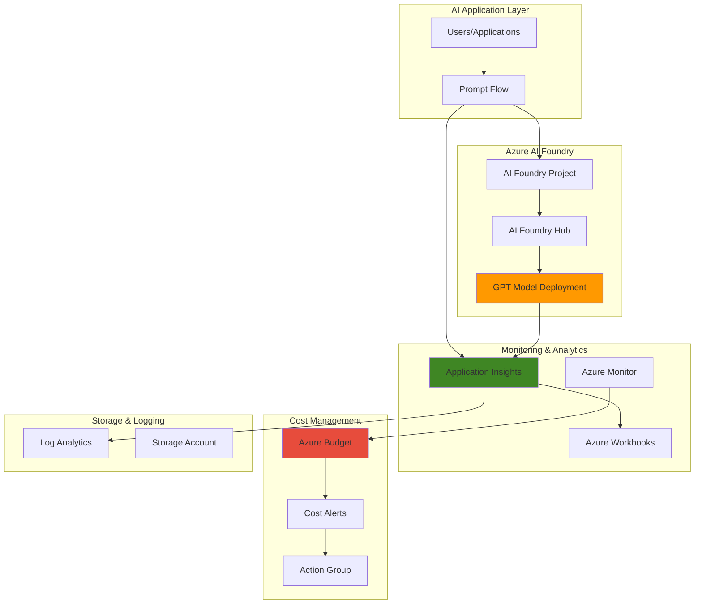

# AI Cost Monitoring with Foundry and Application Insights

## Problem

Organizations adopting generative AI solutions face significant challenges in managing and controlling AI-related expenses, particularly with unpredictable token consumption patterns and varying model costs. Without proper cost visibility and automated alerting, AI projects can quickly exceed budgets, leading to financial surprises and potential project cancellations. Traditional monitoring approaches lack the granular insights needed to track token usage, latency patterns, and cost attribution across different AI workloads.

## Solution

Implement a comprehensive AI cost monitoring solution using Azure AI Foundry integrated with Application Insights and Azure Monitor. This approach provides real-time token usage tracking, automated cost alerting, and detailed analytics dashboards that enable proactive cost management. The solution combines Azure AI Foundry's built-in monitoring capabilities with custom telemetry collection and automated budget controls to optimize AI spending while maintaining performance.

## Architecture Diagram



## Prerequisites

1. Azure subscription with Owner or Contributor permissions for resource creation
2. Azure CLI installed and configured (version 2.60.0 or later)
3. Basic understanding of Azure AI services and cost management concepts
4. Familiarity with KQL (Kusto Query Language) for custom queries
5. Estimated cost: $50-100 for testing depending on model usage and retention settings

> **Note**: This recipe follows Azure Well-Architected Framework principles for cost optimization and operational excellence.

## Preparation

```bash
# Set environment variables for Azure resources
export RESOURCE_GROUP="rg-ai-monitoring-${RANDOM_SUFFIX}"
export LOCATION="eastus"
export SUBSCRIPTION_ID=$(az account show --query id --output tsv)

# Generate unique suffix for resource names
RANDOM_SUFFIX=$(openssl rand -hex 3)

# Set AI-specific resource names
export AI_HUB_NAME="aihub-${RANDOM_SUFFIX}"
export AI_PROJECT_NAME="aiproject-${RANDOM_SUFFIX}"
export APP_INSIGHTS_NAME="appins-ai-${RANDOM_SUFFIX}"
export LOG_ANALYTICS_NAME="logs-ai-${RANDOM_SUFFIX}"
export STORAGE_ACCOUNT_NAME="stor${RANDOM_SUFFIX}"

# Create resource group
az group create \
    --name ${RESOURCE_GROUP} \
    --location ${LOCATION} \
    --tags purpose=ai-monitoring environment=demo

echo "✅ Resource group created: ${RESOURCE_GROUP}"

# Create Log Analytics workspace for Application Insights
az monitor log-analytics workspace create \
    --resource-group ${RESOURCE_GROUP} \
    --workspace-name ${LOG_ANALYTICS_NAME} \
    --location ${LOCATION} \
    --tags purpose=ai-monitoring

LOG_ANALYTICS_ID=$(az monitor log-analytics workspace show \
    --resource-group ${RESOURCE_GROUP} \
    --workspace-name ${LOG_ANALYTICS_NAME} \
    --query id --output tsv)

echo "✅ Log Analytics workspace created: ${LOG_ANALYTICS_NAME}"
```

## Steps

1. **Create Application Insights for AI Telemetry Collection**:

   Application Insights serves as the central telemetry collection service for AI applications, automatically capturing performance metrics, token usage patterns, and custom events. By enabling custom metrics with dimensions, we can track specific AI-related measurements like token consumption per request, model latency, and cost attribution across different workloads.

   ```bash
   # Create Application Insights instance
   az monitor app-insights component create \
       --app ${APP_INSIGHTS_NAME} \
       --location ${LOCATION} \
       --resource-group ${RESOURCE_GROUP} \
       --workspace ${LOG_ANALYTICS_ID} \
       --kind web \
       --tags purpose=ai-monitoring
   
   # Get Application Insights instrumentation key and connection string
   export APPINS_KEY=$(az monitor app-insights component show \
       --app ${APP_INSIGHTS_NAME} \
       --resource-group ${RESOURCE_GROUP} \
       --query instrumentationKey --output tsv)
   
   export APPINS_CONNECTION=$(az monitor app-insights component show \
       --app ${APP_INSIGHTS_NAME} \
       --resource-group ${RESOURCE_GROUP} \
       --query connectionString --output tsv)
   
   echo "✅ Application Insights created with key: ${APPINS_KEY}"
   ```

   Application Insights is now configured to collect comprehensive telemetry data from AI workloads, providing the foundation for cost monitoring and performance analysis.

2. **Create Storage Account for AI Foundry Dependencies**:

   Azure AI Foundry requires a storage account for storing project artifacts, model files, and experiment data. This storage also supports data lineage tracking and provides additional cost visibility for data storage components.

   ```bash
   # Create storage account for AI Foundry
   az storage account create \
       --name ${STORAGE_ACCOUNT_NAME} \
       --resource-group ${RESOURCE_GROUP} \
       --location ${LOCATION} \
       --sku Standard_LRS \
       --kind StorageV2 \
       --tags purpose=ai-foundry
   
   # Get storage account key for configuration
   export STORAGE_KEY=$(az storage account keys list \
       --resource-group ${RESOURCE_GROUP} \
       --account-name ${STORAGE_ACCOUNT_NAME} \
       --query '[0].value' --output tsv)
   
   echo "✅ Storage account created: ${STORAGE_ACCOUNT_NAME}"
   ```

3. **Deploy Azure AI Foundry Hub and Project**:

   Azure AI Foundry Hub provides centralized management of AI resources and enables cost governance across multiple projects. The hub automatically integrates with Application Insights for telemetry collection and supports token-level cost tracking for deployed models.

   ```bash
   # Create AI Foundry Hub using the new --kind hub parameter
   az ml workspace create \
       --kind hub \
       --resource-group ${RESOURCE_GROUP} \
       --name ${AI_HUB_NAME} \
       --location ${LOCATION} \
       --storage-account ${STORAGE_ACCOUNT_NAME} \
       --application-insights ${APPINS_KEY} \
       --tags purpose=ai-foundry environment=monitoring
   
   # Get the Hub ID for project creation
   HUB_ID=$(az ml workspace show \
       --resource-group ${RESOURCE_GROUP} \
       --name ${AI_HUB_NAME} \
       --query id --output tsv)
   
   # Create AI Foundry Project linked to the hub
   az ml workspace create \
       --kind project \
       --resource-group ${RESOURCE_GROUP} \
       --name ${AI_PROJECT_NAME} \
       --hub-id ${HUB_ID} \
       --tags purpose=ai-project parent-hub=${AI_HUB_NAME}
   
   echo "✅ AI Foundry Hub and Project created successfully"
   ```

   The AI Foundry environment is now established with integrated monitoring capabilities, ready for model deployment and cost tracking.

4. **Configure Custom Metrics Collection in Application Insights**:

   Custom metrics enable detailed tracking of AI-specific measurements like token consumption, request costs, and model performance indicators. This configuration allows for granular cost analysis and optimization insights.

   ```bash
   # Enable custom metrics in Application Insights using REST API
   az rest \
       --method PATCH \
       --url "https://management.azure.com/subscriptions/${SUBSCRIPTION_ID}/resourceGroups/${RESOURCE_GROUP}/providers/Microsoft.Insights/components/${APP_INSIGHTS_NAME}?api-version=2020-02-02" \
       --body '{
         "properties": {
           "customMetricsOptedInType": "WithDimensions"
         }
       }'
   
   # Create custom telemetry configuration file for token tracking
   cat > token-tracking.json << EOF
   {
     "customEvents": {
       "tokenUsage": {
         "properties": {
           "modelName": "string",
           "promptTokens": "number",
           "completionTokens": "number",
           "totalTokens": "number",
           "estimatedCost": "number",
           "requestDuration": "number"
         }
       }
     }
   }
   EOF
   
   echo "✅ Custom metrics configuration completed"
   ```

5. **Create AI Cost Monitoring Budget and Alerts**:

   Azure budgets provide proactive cost control by monitoring spending against predefined thresholds. Integration with Action Groups enables automated responses when costs approach or exceed budget limits, ensuring cost governance without manual intervention.

   ```bash
   # Create budget for AI resources with automated alerting
   # Note: Budget creation requires specific date format and scope parameters
   START_DATE=$(date -d "first day of this month" +%Y-%m-01)
   END_DATE=$(date -d "first day of next year" +%Y-01-01)
   
   az consumption budget create-with-rg \
       --budget-name "ai-foundry-budget-${RANDOM_SUFFIX}" \
       --resource-group ${RESOURCE_GROUP} \
       --amount 100 \
       --time-grain Monthly \
       --time-period start=${START_DATE} end=${END_DATE} \
       --category Cost \
       --notifications '{
         "80Percent": {
           "enabled": true,
           "operator": "GreaterThan",
           "threshold": 80,
           "contactEmails": ["admin@company.com"]
         },
         "100Percent": {
           "enabled": true,
           "operator": "GreaterThan", 
           "threshold": 100,
           "contactEmails": ["admin@company.com"]
         }
       }'
   
   echo "✅ AI cost budget created with 80% and 100% thresholds"
   ```

6. **Deploy Sample Prompt Flow with Cost Tracking**:

   This Prompt Flow demonstrates how to integrate custom telemetry collection for tracking token usage and costs in real-time. The flow includes built-in cost calculation and automatic logging to Application Insights.

   ```bash
   # Create a sample prompt flow configuration
   cat > prompt-flow.yaml << EOF
   name: cost-monitoring-flow
   inputs:
     user_query:
       type: string
   outputs:
     response:
       type: string
   nodes:
     - name: llm_node
       type: llm
       inputs:
         prompt: "Answer the following question: \${inputs.user_query}"
         model: gpt-35-turbo
         temperature: 0.7
       connection: Default_AzureOpenAI
   EOF
   
   # Create Python script for cost tracking integration
   cat > cost_tracker.py << EOF
   import json
   import time
   from azure.monitor.opentelemetry import configure_azure_monitor
   from opentelemetry import trace
   
   # Configure Application Insights telemetry
   configure_azure_monitor(connection_string="${APPINS_CONNECTION}")
   tracer = trace.get_tracer(__name__)
   
   def track_ai_costs(model_name, prompt_tokens, completion_tokens, total_cost):
       with tracer.start_as_current_span("ai_token_usage") as span:
           span.set_attributes({
               "ai.model.name": model_name,
               "ai.usage.prompt_tokens": prompt_tokens,
               "ai.usage.completion_tokens": completion_tokens,
               "ai.usage.total_tokens": prompt_tokens + completion_tokens,
               "ai.cost.total": total_cost,
               "ai.timestamp": int(time.time())
           })
   
   print("Cost tracking integration ready")
   EOF
   
   echo "✅ Prompt Flow with cost tracking configured"
   ```

7. **Create Azure Monitor Dashboard for AI Cost Analytics**:

   Azure Workbooks provide interactive dashboards for visualizing AI costs, token usage patterns, and performance metrics. This centralized view enables stakeholders to monitor AI spending and identify optimization opportunities.

   ```bash
   # Create workbook template for AI cost monitoring
   cat > ai-monitoring-workbook.json << EOF
   {
     "version": "Notebook/1.0",
     "items": [
       {
         "type": 1,
         "content": {
           "json": "# AI Cost Monitoring Dashboard\n\nComprehensive view of AI token usage, costs, and performance metrics."
         }
       },
       {
         "type": 3,
         "content": {
           "version": "KqlItem/1.0",
           "query": "customEvents\n| where name == \"tokenUsage\"\n| summarize TotalCost = sum(todouble(customMeasurements.estimatedCost)), TotalTokens = sum(todouble(customMeasurements.totalTokens)) by bin(timestamp, 1h)\n| render timechart",
           "queryType": 0,
           "resourceType": "microsoft.insights/components"
         }
       }
     ]
   }
   EOF
   
   # Deploy the workbook to Azure using the monitor workbook create command
   az monitor workbook create \
       --resource-group ${RESOURCE_GROUP} \
       --display-name "AI Cost Monitoring Dashboard" \
       --serialized-data "$(cat ai-monitoring-workbook.json)" \
       --location ${LOCATION} \
       --tags purpose=ai-monitoring
   
   echo "✅ AI monitoring dashboard created in Azure Monitor"
   ```

8. **Configure Automated Cost Alerts with Action Groups**:

   Action Groups enable automated responses to cost threshold breaches, including email notifications, webhook calls, and integration with external systems. This ensures immediate notification and potential automated cost control actions.

   ```bash
   # Create Action Group for cost alerts
   az monitor action-group create \
       --resource-group ${RESOURCE_GROUP} \
       --name "ai-cost-alerts-${RANDOM_SUFFIX}" \
       --short-name "AIAlerts" \
       --email admin admin@company.com \
       --webhook costWebhook https://api.company.com/ai-cost-alert \
       --tags purpose=cost-monitoring
   
   # Create alert rule for high token usage using updated syntax
   az monitor metrics alert create \
       --name "high-ai-token-usage" \
       --resource-group ${RESOURCE_GROUP} \
       --description "Alert when AI token usage exceeds threshold" \
       --condition "avg customMetrics/tokenUsage > 1000" \
       --window-size 5m \
       --evaluation-frequency 1m \
       --action "ai-cost-alerts-${RANDOM_SUFFIX}" \
       --tags purpose=token-monitoring
   
   echo "✅ Automated cost alerts configured with Action Groups"
   ```

## Validation & Testing

1. **Verify AI Foundry Hub and Project deployment**:

   ```bash
   # Check AI Foundry Hub status
   az ml workspace show \
       --resource-group ${RESOURCE_GROUP} \
       --name ${AI_HUB_NAME} \
       --query '{name:name,location:location,provisioningState:provisioningState}'
   
   # Verify Application Insights integration
   az ml workspace show \
       --resource-group ${RESOURCE_GROUP} \
       --name ${AI_PROJECT_NAME} \
       --query 'applicationInsights'
   ```

   Expected output: Both workspaces should show "Succeeded" provisioning state with Application Insights resource ID populated.

2. **Test custom telemetry collection**:

   ```bash
   # Simulate AI token usage telemetry
   python3 -c "
   import requests
   import json
   import time
   
   # Test telemetry data
   telemetry_data = {
       'name': 'Microsoft.ApplicationInsights.Event',
       'time': time.strftime('%Y-%m-%dT%H:%M:%S.%fZ'),
       'data': {
           'baseType': 'EventData',
           'baseData': {
               'name': 'tokenUsage',
               'properties': {
                   'modelName': 'gpt-35-turbo',
                   'totalTokens': '150',
                   'estimatedCost': '0.003'
               }
           }
       }
   }
   
   print('Telemetry test data created:', json.dumps(telemetry_data, indent=2))
   "
   ```

3. **Validate budget and alert configuration**:

   ```bash
   # Check budget configuration
   az consumption budget list \
       --resource-group ${RESOURCE_GROUP} \
       --query '[].{name:name,amount:amount,currentSpend:currentSpend.amount}'
   
   # Verify Action Group configuration
   az monitor action-group show \
       --resource-group ${RESOURCE_GROUP} \
       --name "ai-cost-alerts-${RANDOM_SUFFIX}" \
       --query '{name:name,enabled:enabled,emailReceivers:emailReceivers[].emailAddress}'
   ```

4. **Test Application Insights query capabilities**:

   ```bash
   # Query Application Insights for AI telemetry using Azure CLI
   az monitor app-insights query \
       --app ${APP_INSIGHTS_NAME} \
       --resource-group ${RESOURCE_GROUP} \
       --analytics-query "customEvents | where name == 'tokenUsage' | limit 10"
   ```

## Cleanup

1. **Remove Action Groups and alert rules**:

   ```bash
   # Delete alert rules
   az monitor metrics alert delete \
       --name "high-ai-token-usage" \
       --resource-group ${RESOURCE_GROUP}
   
   # Delete Action Group
   az monitor action-group delete \
       --resource-group ${RESOURCE_GROUP} \
       --name "ai-cost-alerts-${RANDOM_SUFFIX}"
   
   echo "✅ Alert configurations removed"
   ```

2. **Delete AI Foundry resources**:

   ```bash
   # Delete AI Project and Hub
   az ml workspace delete \
       --resource-group ${RESOURCE_GROUP} \
       --name ${AI_PROJECT_NAME} \
       --yes
   
   az ml workspace delete \
       --resource-group ${RESOURCE_GROUP} \
       --name ${AI_HUB_NAME} \
       --yes
   
   echo "✅ AI Foundry resources deleted"
   ```

3. **Remove monitoring and storage resources**:

   ```bash
   # Delete budget
   az consumption budget delete \
       --budget-name "ai-foundry-budget-${RANDOM_SUFFIX}" \
       --resource-group ${RESOURCE_GROUP}
   
   # Delete workbook
   az monitor workbook delete \
       --resource-group ${RESOURCE_GROUP} \
       --name "AI Cost Monitoring Dashboard"
   
   echo "✅ Monitoring resources cleaned up"
   ```

4. **Delete resource group and all remaining resources**:

   ```bash
   # Delete entire resource group
   az group delete \
       --name ${RESOURCE_GROUP} \
       --yes \
       --no-wait
   
   echo "✅ Resource group deletion initiated: ${RESOURCE_GROUP}"
   echo "Note: Complete deletion may take several minutes"
   
   # Verify deletion
   az group exists --name ${RESOURCE_GROUP}
   ```

## Discussion

This recipe demonstrates a comprehensive approach to AI cost monitoring that addresses the critical challenge of unpredictable AI expenses in enterprise environments. The solution leverages Azure AI Foundry's native integration with Application Insights to provide real-time visibility into token consumption, model performance, and associated costs. By implementing custom telemetry collection alongside automated budget controls, organizations can maintain cost discipline while enabling AI innovation.

The architecture follows Azure Well-Architected Framework principles, particularly focusing on cost optimization and operational excellence. Application Insights serves as the central telemetry hub, automatically collecting standard performance metrics while supporting custom events for AI-specific measurements like token usage and cost attribution. This dual approach provides both infrastructure visibility and business-critical AI usage insights.

The integration of Azure Monitor with Action Groups enables automated cost governance through proactive alerting and optional automated responses when spending thresholds are exceeded. This automation reduces the operational burden on teams while ensuring that AI projects remain within approved budget boundaries. The workbook-based dashboards provide stakeholders with intuitive visualizations of AI spending patterns, enabling data-driven optimization decisions.

The solution's scalability is enhanced through the use of Azure AI Foundry's hub-and-project model, which allows for centralized cost governance across multiple AI initiatives while maintaining project-level cost visibility. This approach supports enterprise scenarios where different business units or teams require isolated AI environments with shared governance policies.

> **Tip**: Consider implementing cost allocation tags at the project level to enable chargeback scenarios and detailed cost attribution across business units.

**Documentation References:**
- [Azure AI Foundry cost management](https://learn.microsoft.com/en-us/azure/ai-foundry/how-to/costs-plan-manage)
- [Application Insights custom metrics](https://learn.microsoft.com/en-us/azure/azure-monitor/essentials/metrics-custom-overview)
- [Azure Monitor budget automation](https://learn.microsoft.com/en-us/azure/cost-management-billing/costs/manage-automation)
- [AI monitoring best practices](https://learn.microsoft.com/en-us/training/modules/monitor-generative-ai-app/)
- [Azure Well-Architected cost optimization](https://learn.microsoft.com/en-us/azure/well-architected/cost-optimization/)

## Challenge

Extend this solution by implementing these enhancements:

1. **Multi-Model Cost Comparison**: Implement A/B testing between different AI models (GPT-3.5, GPT-4, Claude) with automatic cost-per-quality analysis and recommendations for optimal model selection based on use case requirements.

2. **Predictive Cost Forecasting**: Integrate Azure Machine Learning to analyze historical token usage patterns and predict future AI costs, enabling proactive budget planning and early warning systems for cost overruns.

3. **Real-time Cost Optimization**: Develop dynamic model routing that automatically selects the most cost-effective model based on query complexity, current pricing, and response quality requirements using Azure Functions and Event Grid.

4. **Cross-Tenant Cost Consolidation**: Extend the monitoring solution to aggregate AI costs across multiple Azure tenants or hybrid cloud environments, providing enterprise-wide visibility into AI spending and enabling centralized cost governance.

5. **Integration with DevOps Pipelines**: Implement cost gates in Azure DevOps pipelines that automatically validate AI model deployments against cost budgets and performance benchmarks before promoting to production environments.

## Infrastructure Code

### Available Infrastructure as Code:

- [Infrastructure Code Overview](code/README.md) - Detailed description of all infrastructure components
- [Bicep](code/bicep/) - Azure Bicep templates
- [Bash CLI Scripts](code/scripts/) - Example bash scripts using Azure CLI commands to deploy infrastructure
- [Terraform](code/terraform/) - Terraform configuration files