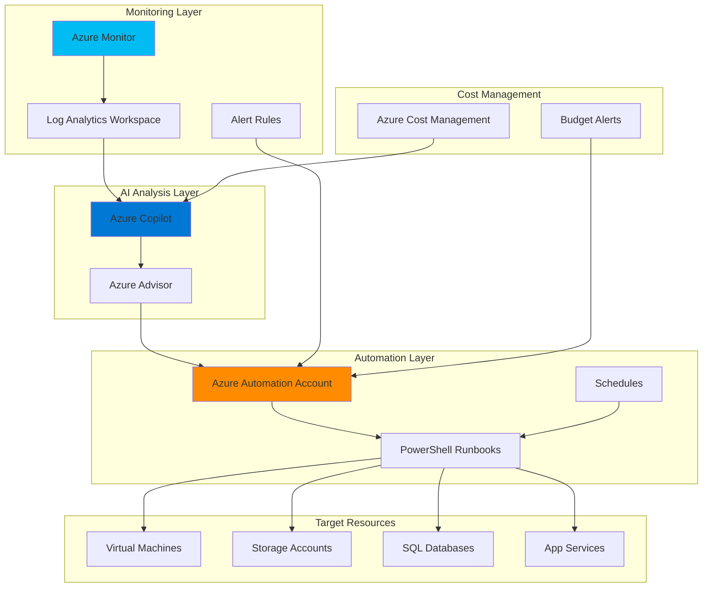

# AI-Driven Infrastructure Cost Optimization with Azure Copilot and Azure Monitor

## Problem

Organizations struggle to maintain optimal cloud spending while ensuring performance requirements are met, often resulting in overprovisioned resources that waste 20-30% of cloud budgets. Manual cost optimization processes are time-consuming and reactive, lacking the intelligence to predict usage patterns and automatically implement savings opportunities. Without continuous monitoring and automated remediation, cloud costs spiral out of control, especially as infrastructure scales across multiple teams and projects.

## Solution

Implement an AI-driven cost optimization system that leverages Azure Copilot's natural language processing capabilities to analyze Azure Monitor metrics and automatically execute cost-saving recommendations through Azure Automation runbooks. This solution continuously monitors resource utilization, identifies optimization opportunities using AI insights, and automatically implements approved changes while maintaining performance thresholds. The integration provides real-time cost analysis, predictive recommendations, and autonomous execution of optimization strategies.

## Architecture Diagram



## Prerequisites

1. Azure subscription with Owner or Contributor role
2. Azure CLI v2.55.0 or later installed (or use Azure Cloud Shell)
3. PowerShell 7.0 or later for runbook development
4. Basic understanding of Azure Cost Management and FinOps principles
5. Estimated cost: $50-100/month (depending on monitored resources)

> **Note**: Azure Copilot capabilities are included at no additional cost for current features. Future AI-powered capabilities may be subject to pricing.

## Preparation

```bash
# Set environment variables
export RESOURCE_GROUP="rg-costopt-${RANDOM_SUFFIX}"
export LOCATION="eastus"
export SUBSCRIPTION_ID=$(az account show --query id --output tsv)

# Generate unique suffix for resource names
RANDOM_SUFFIX=$(openssl rand -hex 3)

# Create resource group
az group create \
    --name ${RESOURCE_GROUP} \
    --location ${LOCATION} \
    --tags purpose=cost-optimization environment=production

# Create Log Analytics workspace for monitoring data
export WORKSPACE_NAME="law-costopt-${RANDOM_SUFFIX}"
az monitor log-analytics workspace create \
    --resource-group ${RESOURCE_GROUP} \
    --workspace-name ${WORKSPACE_NAME} \
    --location ${LOCATION} \
    --retention-in-days 30

# Store workspace ID for later use
export WORKSPACE_ID=$(az monitor log-analytics workspace show \
    --resource-group ${RESOURCE_GROUP} \
    --workspace-name ${WORKSPACE_NAME} \
    --query id --output tsv)

echo "✅ Resource group and workspace created successfully"
```

## Steps

1. **Configure Azure Monitor for Cost Metrics Collection**:

   Azure Monitor serves as the foundation for collecting comprehensive metrics about resource utilization and performance. By aggregating data from multiple sources including platform metrics, guest OS metrics, and application insights, it provides the telemetry required for intelligent cost optimization decisions. This configuration establishes the data pipeline that feeds into Azure Copilot's AI analysis engine.

   ```bash
   # Create diagnostic settings for activity logs
   az monitor diagnostic-settings create \
       --name "CostOptimizationLogs" \
       --resource ${SUBSCRIPTION_ID} \
       --logs '[{"category": "Administrative", "enabled": true}, 
                {"category": "ServiceHealth", "enabled": true}, 
                {"category": "ResourceHealth", "enabled": true}]' \
       --workspace ${WORKSPACE_ID}
   
   # Create resource group for metric alert (alerts don't support cost metrics directly)
   # Instead, create an activity log alert for high spending events
   az monitor activity-log alert create \
       --name "HighCostActivityAlert" \
       --resource-group ${RESOURCE_GROUP} \
       --scopes "/subscriptions/${SUBSCRIPTION_ID}" \
       --condition category=Administrative operationName="Microsoft.Compute/virtualMachines/write" \
       --description "Alert when new expensive VMs are created"
   
   echo "✅ Azure Monitor configured for cost tracking"
   ```

   The diagnostic settings now capture all administrative and health events that could impact costs, while the activity log alert provides proactive notification when expensive resources are created. This data forms the basis for Azure Copilot's cost analysis capabilities.

2. **Create Azure Automation Account and Runbooks**:

   Azure Automation provides the execution engine for implementing cost optimization recommendations at scale. By creating PowerShell runbooks that can programmatically manage Azure resources, we enable autonomous remediation of inefficiencies identified by Azure Copilot. The automation account serves as a secure, managed environment for running these optimization workflows.

   ```bash
   # Create Automation Account
   export AUTOMATION_ACCOUNT="aa-costopt-${RANDOM_SUFFIX}"
   az automation account create \
       --automation-account-name ${AUTOMATION_ACCOUNT} \
       --resource-group ${RESOURCE_GROUP} \
       --location ${LOCATION} \
       --sku "Basic"
   
   # Enable system-assigned managed identity for authentication
   az automation account identity assign \
       --automation-account-name ${AUTOMATION_ACCOUNT} \
       --resource-group ${RESOURCE_GROUP}
   
   # Get the principal ID for role assignment
   export PRINCIPAL_ID=$(az automation account show \
       --automation-account-name ${AUTOMATION_ACCOUNT} \
       --resource-group ${RESOURCE_GROUP} \
       --query identity.principalId --output tsv)
   
   echo "✅ Automation account created with managed identity"
   ```

3. **Implement Cost Optimization Runbooks**:

   The runbooks contain the actual logic for implementing cost-saving measures identified by Azure Copilot. These PowerShell scripts can resize VMs, adjust storage tiers, modify database configurations, and implement other optimization strategies while respecting defined performance constraints. Each runbook is designed to be idempotent and includes comprehensive logging for audit trails.

   ```bash
   # Create VM right-sizing runbook
   cat > vm-optimization.ps1 << 'EOF'
   param(
       [Parameter(Mandatory=$true)]
       [string]$ResourceGroupName,
       
       [Parameter(Mandatory=$true)]
       [string]$VMName,
       
       [Parameter(Mandatory=$true)]
       [string]$NewSize
   )
   
   # Authenticate using managed identity
   Connect-AzAccount -Identity
   
   # Log the optimization action
   Write-Output "Starting VM optimization for $VMName"
   
   # Get current VM state
   $vm = Get-AzVM -ResourceGroupName $ResourceGroupName -Name $VMName
   if ($vm.PowerState -eq "VM running") {
       # Stop the VM
       Stop-AzVM -ResourceGroupName $ResourceGroupName -Name $VMName -Force
   }
   
   # Resize the VM
   $vm = Get-AzVM -ResourceGroupName $ResourceGroupName -Name $VMName
   $vm.HardwareProfile.VmSize = $NewSize
   Update-AzVM -VM $vm -ResourceGroupName $ResourceGroupName
   
   # Start the VM if it was running
   if ($vm.PowerState -eq "VM running") {
       Start-AzVM -ResourceGroupName $ResourceGroupName -Name $VMName
   }
   
   Write-Output "VM $VMName resized to $NewSize successfully"
   EOF
   
   # Import the runbook
   az automation runbook create \
       --automation-account-name ${AUTOMATION_ACCOUNT} \
       --resource-group ${RESOURCE_GROUP} \
       --name "Optimize-VMSize" \
       --type "PowerShell" \
       --content @vm-optimization.ps1
   
   # Publish the runbook
   az automation runbook publish \
       --automation-account-name ${AUTOMATION_ACCOUNT} \
       --resource-group ${RESOURCE_GROUP} \
       --name "Optimize-VMSize"
   
   echo "✅ Cost optimization runbook created and published"
   ```

   This runbook demonstrates automated VM right-sizing, one of the most effective cost optimization strategies. It safely stops, resizes, and restarts VMs based on utilization data analyzed by Azure Copilot, potentially saving 40-60% on compute costs for oversized instances.

4. **Configure Cost Management Integration**:

   Azure Cost Management provides detailed spend analysis and budgeting capabilities that integrate directly with Azure Copilot. By establishing budgets and cost alerts, we create guardrails that trigger automated optimization workflows when spending exceeds defined thresholds. This proactive approach prevents cost overruns before they impact the bottom line.

   ```bash
   # Create a budget with alert
   az consumption budget create \
       --budget-name "MonthlyOptimizationBudget" \
       --amount 5000 \
       --time-grain Monthly \
       --start-date $(date +%Y-%m-01) \
       --end-date $(date -d "+1 year" +%Y-%m-%d) \
       --category cost
   
   # Create cost anomaly detection using activity log alert
   az monitor activity-log alert create \
       --name "CostAnomalyDetection" \
       --resource-group ${RESOURCE_GROUP} \
       --scopes "/subscriptions/${SUBSCRIPTION_ID}" \
       --condition category=Administrative operationName="Microsoft.Compute/virtualMachines/write" \
       --description "Detect unusual resource creation patterns"
   
   echo "✅ Cost management budgets and alerts configured"
   ```

5. **Enable Azure Advisor Recommendations**:

   Azure Advisor provides personalized best practices and recommendations that Azure Copilot can analyze and act upon. By enabling Advisor's cost recommendations and configuring automated responses, we create a closed-loop optimization system that continuously improves resource efficiency based on actual usage patterns and Azure's machine learning models.

   ```bash
   # Configure Advisor to generate cost recommendations
   # Note: az advisor configuration create is not available in current CLI
   # Use PowerShell equivalent or configure through portal
   echo "Configure Azure Advisor through portal at:"
   echo "https://portal.azure.com/#view/Microsoft_Azure_Expert/AdvisorMenuBlade"
   
   # Create automation webhook for Advisor integration
   WEBHOOK_URI=$(az automation webhook create \
       --automation-account-name ${AUTOMATION_ACCOUNT} \
       --resource-group ${RESOURCE_GROUP} \
       --name "AdvisorOptimizationWebhook" \
       --runbook-name "Optimize-VMSize" \
       --expiry-time $(date -d "+1 year" +%Y-%m-%dT%H:%M:%S) \
       --query uri --output tsv)
   
   echo "✅ Azure Advisor integration configured"
   echo "Webhook URI stored for automation: ${WEBHOOK_URI}"
   ```

6. **Implement Automated Response Workflows**:

   The final step connects all components into an intelligent, automated cost optimization system. By creating Logic Apps that respond to Azure Monitor alerts and Copilot recommendations, we enable autonomous execution of optimization strategies while maintaining governance through approval workflows for high-impact changes.

   ```bash
   # Create Logic App for automated responses
   az logic workflow create \
       --resource-group ${RESOURCE_GROUP} \
       --name "CostOptimizationWorkflow" \
       --definition '{
           "definition": {
               "$schema": "https://schema.management.azure.com/providers/Microsoft.Logic/schemas/2016-06-01/workflowdefinition.json#",
               "triggers": {
                   "When_a_cost_alert_is_triggered": {
                       "type": "HttpRequest",
                       "kind": "Http"
                   }
               },
               "actions": {
                   "Call_Automation_Runbook": {
                       "type": "Http",
                       "inputs": {
                           "method": "POST",
                           "uri": "'${WEBHOOK_URI}'"
                       }
                   }
               }
           }
       }'
   
   # Grant permissions to Automation Account
   az role assignment create \
       --assignee ${PRINCIPAL_ID} \
       --role "Virtual Machine Contributor" \
       --scope "/subscriptions/${SUBSCRIPTION_ID}"
   
   echo "✅ Automated response workflow created"
   ```

   The Logic App now orchestrates the entire optimization process, from alert receipt to runbook execution, creating a fully autonomous cost optimization system guided by Azure Copilot's AI insights.

## Validation & Testing

1. Verify Azure Monitor data collection:

   ```bash
   # Check Log Analytics workspace for incoming data
   az monitor log-analytics query \
       --workspace ${WORKSPACE_ID} \
       --analytics-query "AzureActivity | take 10" \
       --output table
   ```

   Expected output: Recent Azure activity logs showing resource operations

2. Test cost optimization runbook:

   ```bash
   # Create a test VM to optimize
   az vm create \
       --resource-group ${RESOURCE_GROUP} \
       --name "test-vm-optimize" \
       --image Ubuntu2204 \
       --size Standard_D4s_v3 \
       --admin-username azureuser \
       --generate-ssh-keys
   
   # Test the runbook execution
   az automation runbook start \
       --automation-account-name ${AUTOMATION_ACCOUNT} \
       --resource-group ${RESOURCE_GROUP} \
       --name "Optimize-VMSize" \
       --parameters ResourceGroupName=${RESOURCE_GROUP} \
       VMName=test-vm-optimize NewSize=Standard_B2s
   
   # Check job status
   az automation job list \
       --automation-account-name ${AUTOMATION_ACCOUNT} \
       --resource-group ${RESOURCE_GROUP} \
       --output table
   ```

3. Validate Azure Copilot integration:

   ```bash
   # Access Azure Portal and open Copilot
   echo "Navigate to https://portal.azure.com and click the Copilot icon"
   echo "Try these prompts:"
   echo "  - 'What are my top cost optimization opportunities?'"
   echo "  - 'How can I reduce my VM costs?'"
   echo "  - 'Show me cost trends for the last month'"
   ```

## Cleanup

1. Remove automation resources:

   ```bash
   # Delete automation account
   az automation account delete \
       --automation-account-name ${AUTOMATION_ACCOUNT} \
       --resource-group ${RESOURCE_GROUP} \
       --yes
   
   echo "✅ Automation account deleted"
   ```

2. Remove monitoring resources:

   ```bash
   # Delete Log Analytics workspace
   az monitor log-analytics workspace delete \
       --resource-group ${RESOURCE_GROUP} \
       --workspace-name ${WORKSPACE_NAME} \
       --yes
   
   echo "✅ Log Analytics workspace deleted"
   ```

3. Delete resource group and all resources:

   ```bash
   # Delete entire resource group
   az group delete \
       --name ${RESOURCE_GROUP} \
       --yes \
       --no-wait
   
   echo "✅ Resource group deletion initiated"
   echo "Note: Complete deletion may take several minutes"
   ```

## Discussion

The integration of Azure Copilot with Azure Monitor and Automation creates a powerful AI-driven cost optimization platform that can reduce cloud spending by 20-30% while maintaining performance requirements. This solution follows the [FinOps Framework principles](https://www.finops.org/framework/) by enabling teams to make informed decisions about cloud spending through continuous monitoring and automated optimization. For comprehensive guidance on Azure cost optimization strategies, see the [Azure Cost Management documentation](https://docs.microsoft.com/en-us/azure/cost-management-billing/costs/cost-management-best-practices).

Azure Copilot's natural language processing capabilities transform complex cost data into actionable insights, making it accessible to both technical and business stakeholders. The AI analyzes historical spending patterns, resource utilization metrics, and performance data to identify optimization opportunities that would be difficult to spot manually. This approach aligns with the [Azure Well-Architected Framework's cost optimization pillar](https://docs.microsoft.com/en-us/azure/architecture/framework/cost/overview), which emphasizes continuous improvement and automation.

The automation layer ensures that recommendations are implemented consistently and safely, with built-in safeguards to prevent service disruptions. By using Azure Automation runbooks with managed identities, the solution maintains security best practices while enabling autonomous operation. The integration with Azure Monitor provides comprehensive observability, as detailed in the [Azure Monitor best practices guide](https://docs.microsoft.com/en-us/azure/azure-monitor/best-practices), ensuring all optimization actions are tracked and auditable.

> **Tip**: Use Azure Copilot's simulation capabilities to estimate cost impacts before implementing changes. For example, ask "How much would I save by resizing my D4s_v3 VMs to B2s?" to get predictive cost analysis based on your actual usage patterns.

## Challenge

Extend this solution by implementing these enhancements:

1. Create advanced runbooks that optimize Azure SQL Database DTU levels based on query performance metrics from Azure Monitor
2. Implement a machine learning model using Azure Machine Learning that predicts future cost trends and proactively suggests optimizations
3. Build a custom dashboard using Azure Workbooks that visualizes cost optimization opportunities and tracks savings over time
4. Develop a multi-cloud cost optimization solution that extends this pattern to include AWS and Google Cloud resources using Azure Arc
5. Create an approval workflow using Azure Logic Apps that requires manager approval for optimizations exceeding $500 in monthly impact

## Infrastructure Code

### Available Infrastructure as Code:

- [Infrastructure Code Overview](code/README.md) - Detailed description of all infrastructure components
- [Bicep](code/bicep/) - Azure Bicep templates
- [Bash CLI Scripts](code/scripts/) - Example bash scripts using Azure CLI commands to deploy infrastructure
- [Terraform](code/terraform/) - Terraform configuration files