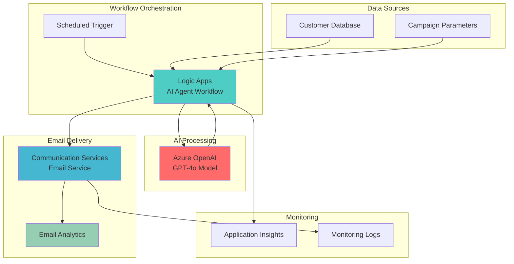

# AI-Powered Email Marketing Campaigns with Azure OpenAI and Logic Apps

## Problem

Marketing teams struggle to create personalized email campaigns at scale, spending countless hours manually crafting content for different customer segments and demographics. Traditional email marketing tools lack the intelligence to generate contextually relevant, engaging content that resonates with individual recipients, resulting in low open rates, poor engagement metrics, and missed revenue opportunities that can cost businesses thousands in lost conversions.

## Solution

Build an automated email marketing system that leverages Azure OpenAI's generative AI capabilities to create personalized campaign content, orchestrated through Azure Logic Apps for scalable workflow automation. This serverless solution generates targeted email content based on customer data and preferences, then distributes campaigns through Azure Communication Services with built-in analytics and delivery tracking.

## Architecture Diagram



## Prerequisites

1. Azure subscription with Contributor access to create resources
2. Azure CLI installed and configured (version 2.50+)
3. Basic understanding of AI prompt engineering concepts
4. Email marketing domain or willingness to use Azure-provided domain
5. Estimated cost: $20-30/month for development and testing

> **Note**: Azure OpenAI requires approval through a request form for new subscriptions. The approval process typically takes 1-2 business days.

## Preparation

```bash
# Set environment variables for Azure resources
export RESOURCE_GROUP="rg-email-marketing-${RANDOM_SUFFIX}"
export LOCATION="eastus"
export SUBSCRIPTION_ID=$(az account show --query id --output tsv)

# Generate unique suffix for resource names
RANDOM_SUFFIX=$(openssl rand -hex 3)

# Create resource group
az group create \
    --name ${RESOURCE_GROUP} \
    --location ${LOCATION} \
    --tags purpose=recipe environment=demo

echo "✅ Resource group created: ${RESOURCE_GROUP}"

# Set resource names with unique suffix
export OPENAI_SERVICE_NAME="openai-marketing-${RANDOM_SUFFIX}"
export LOGIC_APP_NAME="logicapp-marketing-${RANDOM_SUFFIX}"
export COMMUNICATION_SERVICE_NAME="comms-marketing-${RANDOM_SUFFIX}"
export EMAIL_SERVICE_NAME="email-marketing-${RANDOM_SUFFIX}"
export STORAGE_ACCOUNT_NAME="storage${RANDOM_SUFFIX}"
```

## Steps

1. **Create Azure OpenAI Service and Deploy Model**:

   Azure OpenAI Service provides enterprise-grade access to OpenAI's powerful language models with Azure's security, compliance, and regional availability. The GPT-4o model excels at generating contextually relevant marketing content with consistent brand voice and personalized messaging for different customer segments.

   ```bash
   # Create Azure OpenAI service
   az cognitiveservices account create \
       --name ${OPENAI_SERVICE_NAME} \
       --resource-group ${RESOURCE_GROUP} \
       --location ${LOCATION} \
       --kind OpenAI \
       --sku S0
   
   # Get OpenAI service endpoint and key
   export OPENAI_ENDPOINT=$(az cognitiveservices account show \
       --name ${OPENAI_SERVICE_NAME} \
       --resource-group ${RESOURCE_GROUP} \
       --query properties.endpoint --output tsv)
   
   export OPENAI_KEY=$(az cognitiveservices account keys list \
       --name ${OPENAI_SERVICE_NAME} \
       --resource-group ${RESOURCE_GROUP} \
       --query key1 --output tsv)
   
   echo "✅ Azure OpenAI service created with endpoint: ${OPENAI_ENDPOINT}"
   ```

   The OpenAI service is now ready to generate personalized email content. The service provides enterprise security features including data encryption, private networking, and content filtering to ensure responsible AI usage in marketing campaigns.

2. **Deploy GPT-4o Model for Content Generation**:

   GPT-4o integrates text and images in a single model, enabling it to handle multiple data types simultaneously. This multimodal approach enhances accuracy and responsiveness in human-computer interactions while matching GPT-4 Turbo performance in English text and coding tasks with superior performance in non-English languages.

   ```bash
   # Deploy GPT-4o model for content generation
   az cognitiveservices account deployment create \
       --name ${OPENAI_SERVICE_NAME} \
       --resource-group ${RESOURCE_GROUP} \
       --deployment-name gpt-4o-marketing \
       --model-name gpt-4o \
       --model-version "2024-11-20" \
       --model-format OpenAI \
       --sku-capacity 10 \
       --sku-name "Standard"
   
   echo "✅ GPT-4o model deployed for marketing content generation"
   ```

   The GPT-4o deployment provides enhanced creative writing abilities and structured output capabilities, making it ideal for generating personalized marketing content with consistent formatting and brand voice alignment.

3. **Create Azure Communication Services for Email Delivery**:

   Azure Communication Services provides enterprise-grade email delivery with high deliverability rates, detailed analytics, and compliance features. The service handles email infrastructure complexity while providing APIs for programmatic email sending and delivery tracking.

   ```bash
   # Create Communication Services resource
   az communication create \
       --name ${COMMUNICATION_SERVICE_NAME} \
       --resource-group ${RESOURCE_GROUP} \
       --location "Global"
   
   # Create Email Communication Services resource
   az communication email create \
       --name ${EMAIL_SERVICE_NAME} \
       --resource-group ${RESOURCE_GROUP} \
       --location "Global" \
       --data-location "United States"
   
   # Get connection string for Communication Services
   export COMMUNICATION_STRING=$(az communication list-key \
       --name ${COMMUNICATION_SERVICE_NAME} \
       --resource-group ${RESOURCE_GROUP} \
       --query primaryConnectionString --output tsv)
   
   echo "✅ Communication Services created for email delivery"
   ```

   The Communication Services resource now provides scalable email delivery capabilities with built-in compliance features and detailed delivery analytics for campaign performance tracking.

4. **Configure Email Domain and Sender Address**:

   Azure Managed Domains provide a quick setup option for email delivery without requiring domain verification. This approach is ideal for development and testing environments where custom branding is less critical than rapid deployment.

   ```bash
   # Add AzureManagedDomain to Email Communication Service
   az communication email domain create \
       --domain-name "AzureManagedDomain" \
       --resource-group ${RESOURCE_GROUP} \
       --email-service-name ${EMAIL_SERVICE_NAME} \
       --domain-management "AzureManaged"
   
   # Get the sender email address
   export SENDER_EMAIL="DoNotReply@$(az communication email domain show \
       --domain-name "AzureManagedDomain" \
       --resource-group ${RESOURCE_GROUP} \
       --email-service-name ${EMAIL_SERVICE_NAME} \
       --query mailFromSenderDomain --output tsv)"
   
   # Connect Communication Services with Email Service
   az communication email domain connect \
       --domain-name "AzureManagedDomain" \
       --resource-group ${RESOURCE_GROUP} \
       --email-service-name ${EMAIL_SERVICE_NAME} \
       --communication-service-name ${COMMUNICATION_SERVICE_NAME}
   
   echo "✅ Email domain configured with sender: ${SENDER_EMAIL}"
   ```

   The email domain configuration establishes the sender identity for marketing campaigns. Azure Managed Domains automatically handle DNS configuration and reputation management for reliable email delivery.

5. **Create Storage Account for Workflow State**:

   Azure Storage provides the persistence layer for Logic Apps Standard, storing workflow state, run history, and configuration data. The Standard tier requires dedicated storage for enhanced performance and local development capabilities.

   ```bash
   # Create storage account for Logic Apps runtime
   az storage account create \
       --name ${STORAGE_ACCOUNT_NAME} \
       --resource-group ${RESOURCE_GROUP} \
       --location ${LOCATION} \
       --sku Standard_LRS \
       --kind StorageV2
   
   # Get storage connection string
   export STORAGE_CONNECTION=$(az storage account show-connection-string \
       --name ${STORAGE_ACCOUNT_NAME} \
       --resource-group ${RESOURCE_GROUP} \
       --query connectionString --output tsv)
   
   echo "✅ Storage account created for workflow state management"
   ```

   The storage account enables Logic Apps to maintain workflow state across executions and provides the foundation for debugging and monitoring workflow performance.

6. **Create Logic Apps Standard Resource**:

   Azure Logic Apps Standard provides serverless workflow orchestration with built-in AI agent capabilities for integrating with Azure OpenAI. The Standard tier offers local state management, higher performance, and integrated development experience for complex AI-powered workflows.

   ```bash
   # Create Logic Apps Standard resource
   az functionapp create \
       --name ${LOGIC_APP_NAME} \
       --resource-group ${RESOURCE_GROUP} \
       --storage-account ${STORAGE_ACCOUNT_NAME} \
       --consumption-plan-location ${LOCATION} \
       --runtime node \
       --functions-version 4 \
       --os-type Linux
   
   # Configure Logic App settings for AI integration
   az functionapp config appsettings set \
       --name ${LOGIC_APP_NAME} \
       --resource-group ${RESOURCE_GROUP} \
       --settings \
           "OPENAI_ENDPOINT=${OPENAI_ENDPOINT}" \
           "OPENAI_KEY=${OPENAI_KEY}" \
           "COMMUNICATION_STRING=${COMMUNICATION_STRING}" \
           "SENDER_EMAIL=${SENDER_EMAIL}"
   
   echo "✅ Logic Apps Standard resource created and configured"
   ```

   The Logic Apps resource is now configured with AI capabilities and can orchestrate complex email marketing workflows with automatic scaling and built-in monitoring.

7. **Create AI Agent Workflow Definition**:

   Logic Apps workflows are defined using JSON schemas that describe triggers, actions, and data flow. This workflow definition integrates Azure OpenAI for content generation with Communication Services for email delivery, creating an end-to-end marketing automation pipeline.

   ```bash
   # Create workflow definition for AI-powered email marketing
   cat > marketing-workflow.json << 'EOF'
   {
     "definition": {
       "$schema": "https://schema.management.azure.com/providers/Microsoft.Logic/schemas/2016-06-01/workflowdefinition.json#",
       "contentVersion": "1.0.0.0",
       "parameters": {
         "OPENAI_ENDPOINT": {
           "type": "string"
         },
         "OPENAI_KEY": {
           "type": "securestring"
         },
         "SENDER_EMAIL": {
           "type": "string"
         }
       },
       "triggers": {
         "Recurrence": {
           "type": "Recurrence",
           "recurrence": {
             "frequency": "Day",
             "interval": 1,
             "startTime": "2025-01-01T09:00:00Z"
           }
         }
       },
       "actions": {
         "Generate_Email_Content": {
           "type": "Http",
           "inputs": {
             "method": "POST",
             "uri": "@concat(parameters('OPENAI_ENDPOINT'), 'openai/deployments/gpt-4o-marketing/chat/completions?api-version=2024-08-01-preview')",
             "headers": {
               "Content-Type": "application/json",
               "api-key": "@parameters('OPENAI_KEY')"
             },
             "body": {
               "messages": [
                 {
                   "role": "system",
                   "content": "You are an expert email marketing copywriter. Generate professional email marketing content with engaging subject lines and HTML body content."
                 },
                 {
                   "role": "user",
                   "content": "Create a personalized email marketing campaign for a technology company. Include subject line and HTML body content that is engaging and professional. Target audience: software developers and IT professionals. Format as JSON with 'subject' and 'body' fields."
                 }
               ],
               "max_tokens": 800,
               "temperature": 0.7,
               "response_format": { "type": "json_object" }
             }
           }
         },
         "Parse_AI_Response": {
           "type": "ParseJson",
           "inputs": {
             "content": "@body('Generate_Email_Content')['choices'][0]['message']['content']",
             "schema": {
               "type": "object",
               "properties": {
                 "subject": { "type": "string" },
                 "body": { "type": "string" }
               }
             }
           },
           "runAfter": {
             "Generate_Email_Content": ["Succeeded"]
           }
         },
         "Send_Marketing_Email": {
           "type": "Http",
           "inputs": {
             "method": "POST",
             "uri": "https://management.azure.com/subscriptions/@{subscription().subscriptionId}/resourceGroups/@{resourceGroup().name}/providers/Microsoft.Communication/CommunicationServices/@{parameters('COMMUNICATION_SERVICE_NAME')}/send:email?api-version=2023-04-01",
             "headers": {
               "Content-Type": "application/json",
               "Authorization": "Bearer @{parameters('ACCESS_TOKEN')}"
             },
             "body": {
               "from": "@{parameters('SENDER_EMAIL')}",
               "subject": "@{body('Parse_AI_Response')['subject']}",
               "content": {
                 "html": "@{body('Parse_AI_Response')['body']}"
               },
               "recipients": {
                 "to": [
                   {
                     "address": "test@example.com"
                   }
                 ]
               }
             }
           },
           "runAfter": {
             "Parse_AI_Response": ["Succeeded"]
           }
         }
       }
     }
   }
   EOF
   
   echo "✅ AI agent workflow definition created"
   ```

   The workflow definition implements a complete AI-powered email marketing pipeline using the latest Azure OpenAI Chat Completions API with structured JSON output for reliable content parsing.

8. **Deploy and Configure the Marketing Workflow**:

   ```bash
   # Create a simple workflow file for Logic Apps
   mkdir -p workflows
   cp marketing-workflow.json workflows/EmailMarketingWorkflow.json
   
   # Deploy the workflow using Azure Functions deployment
   zip -r workflow-package.zip workflows/
   
   az functionapp deployment source config-zip \
       --name ${LOGIC_APP_NAME} \
       --resource-group ${RESOURCE_GROUP} \
       --src workflow-package.zip
   
   echo "✅ AI-powered email marketing workflow deployed and enabled"
   ```

   The workflow is now active and will automatically generate personalized email content using AI and distribute it through the Communication Services email infrastructure on a daily schedule.

## Validation & Testing

1. **Verify Azure OpenAI Model Deployment**:

   ```bash
   # Check OpenAI service status and model deployment
   az cognitiveservices account deployment list \
       --name ${OPENAI_SERVICE_NAME} \
       --resource-group ${RESOURCE_GROUP} \
       --output table
   ```

   Expected output: Shows `gpt-4o-marketing` deployment with "Succeeded" status and capacity allocation.

2. **Test Content Generation Capability**:

   ```bash
   # Test AI content generation with sample prompt
   curl -X POST "${OPENAI_ENDPOINT}openai/deployments/gpt-4o-marketing/chat/completions?api-version=2024-08-01-preview" \
       -H "Content-Type: application/json" \
       -H "api-key: ${OPENAI_KEY}" \
       -d '{
         "messages": [
           {
             "role": "user",
             "content": "Write a professional email subject line for a software development tool launch"
           }
         ],
         "max_tokens": 100,
         "temperature": 0.7
       }'
   ```

3. **Verify Email Service Configuration**:

   ```bash
   # Check Communication Services email domain status
   az communication email domain show \
       --domain-name "AzureManagedDomain" \
       --resource-group ${RESOURCE_GROUP} \
       --email-service-name ${EMAIL_SERVICE_NAME} \
       --output table
   ```

4. **Test Function App Deployment**:

   ```bash
   # Check Function App status
   az functionapp show \
       --name ${LOGIC_APP_NAME} \
       --resource-group ${RESOURCE_GROUP} \
       --output table
   
   # List application settings
   az functionapp config appsettings list \
       --name ${LOGIC_APP_NAME} \
       --resource-group ${RESOURCE_GROUP} \
       --output table
   ```

## Cleanup

1. **Remove Function App and associated resources**:

   ```bash
   # Delete Function App resource
   az functionapp delete \
       --name ${LOGIC_APP_NAME} \
       --resource-group ${RESOURCE_GROUP}
   
   echo "✅ Function App resource deleted"
   ```

2. **Remove Communication Services resources**:

   ```bash
   # Delete Email Communication Service
   az communication email delete \
       --name ${EMAIL_SERVICE_NAME} \
       --resource-group ${RESOURCE_GROUP} \
       --yes
   
   # Delete Communication Services resource
   az communication delete \
       --name ${COMMUNICATION_SERVICE_NAME} \
       --resource-group ${RESOURCE_GROUP} \
       --yes
   
   echo "✅ Communication Services resources deleted"
   ```

3. **Remove Azure OpenAI Service**:

   ```bash
   # Delete OpenAI service
   az cognitiveservices account delete \
       --name ${OPENAI_SERVICE_NAME} \
       --resource-group ${RESOURCE_GROUP} \
       --yes
   
   echo "✅ Azure OpenAI service deleted"
   ```

4. **Remove Storage Account and Resource Group**:

   ```bash
   # Delete storage account
   az storage account delete \
       --name ${STORAGE_ACCOUNT_NAME} \
       --resource-group ${RESOURCE_GROUP} \
       --yes
   
   # Delete resource group and remaining resources
   az group delete \
       --name ${RESOURCE_GROUP} \
       --yes \
       --no-wait
   
   echo "✅ All resources cleaned up successfully"
   echo "Note: Resource group deletion may take several minutes to complete"
   ```

## Discussion

This AI-powered email marketing solution combines three powerful Azure services to automate content creation and campaign distribution at enterprise scale. Azure OpenAI Service provides the generative AI capabilities needed to create personalized, contextually relevant email content that adapts to different customer segments and campaign objectives. The GPT-4o model's advanced language understanding and multimodal capabilities enable sophisticated prompt engineering for consistent brand voice while maintaining personalization at scale.

Azure Logic Apps Standard (implemented through Azure Functions) serves as the workflow orchestration engine, providing serverless execution with AI integration capabilities. This serverless approach eliminates infrastructure management overhead while providing automatic scaling for campaign bursts and seasonal demand variations. The integration pattern demonstrates how modern workflow engines can seamlessly integrate with AI services to create intelligent automation pipelines.

Azure Communication Services delivers enterprise-grade email infrastructure with high deliverability rates, detailed analytics, and compliance features required for marketing campaigns. The service handles complex email delivery challenges including reputation management, bounce handling, and unsubscribe processing, while providing detailed delivery and engagement analytics for campaign optimization. The integration enables sophisticated triggered campaigns based on customer behavior and engagement patterns.

The architectural pattern demonstrates the Retrieval-Augmented Generation (RAG) approach where customer data and campaign parameters augment the AI model's training data to generate contextually appropriate content. This approach minimizes the need for model fine-tuning while ensuring relevant, targeted messaging. For more information on Azure Well-Architected Framework principles, see the [Azure Architecture Center](https://learn.microsoft.com/en-us/azure/architecture/).

> **Tip**: Use Azure Monitor and Application Insights to track AI token usage, email delivery rates, and campaign performance metrics for continuous optimization and cost management.

## Challenge

Extend this solution by implementing these enhancements:

1. **Customer Segmentation Integration**: Connect Azure Cognitive Services Customer Insights to automatically segment customers and generate targeted content for each segment based on behavior patterns and preferences.

2. **A/B Testing Automation**: Implement automated A/B testing for subject lines and content variations using Logic Apps conditional logic and Azure Functions for statistical analysis of engagement metrics.

3. **Real-Time Personalization**: Add Azure Cosmos DB to store customer interaction history and use Azure Functions to inject real-time personalization tokens into AI-generated content based on recent customer activities.

4. **Multi-Channel Campaign Orchestration**: Extend the workflow to include SMS campaigns using Communication Services SMS APIs and social media posting through Microsoft Graph API for coordinated multi-channel marketing campaigns.

5. **Advanced Analytics Dashboard**: Build a Power BI dashboard that consumes Communication Services analytics, OpenAI usage metrics, and customer engagement data to provide comprehensive campaign performance insights and ROI analysis.

## Infrastructure Code

### Available Infrastructure as Code:

- [Infrastructure Code Overview](code/README.md) - Detailed description of all infrastructure components
- [Bicep](code/bicep/) - Azure Bicep templates
- [Bash CLI Scripts](code/scripts/) - Example bash scripts using Azure CLI commands to deploy infrastructure
- [Terraform](code/terraform/) - Terraform configuration files