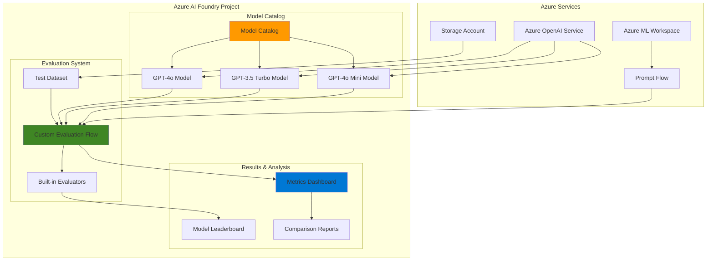

# AI Model Evaluation and Benchmarking with Azure AI Foundry

## Problem

Organizations developing AI applications struggle to objectively compare multiple language models against their specific business criteria and use cases. Without systematic evaluation frameworks, teams often make model selection decisions based on limited testing or general benchmarks that don't reflect their actual requirements, leading to suboptimal model choices and potential production performance issues that could impact user experience and business outcomes.

## Solution

Build an automated evaluation system using Azure AI Foundry's comprehensive model catalog and evaluation capabilities combined with custom Prompt Flow evaluation workflows. This solution enables systematic comparison of multiple AI models using both built-in metrics and custom business criteria, providing data-driven insights for optimal model selection through Azure's integrated benchmarking platform.

## Architecture Diagram



## Prerequisites

1. Azure subscription with Azure AI Foundry and Azure OpenAI access in a supported region
2. Azure CLI installed and configured (version 2.50.0 or later)
3. Basic understanding of AI model evaluation concepts and prompt engineering
4. Contributor role or higher on the Azure subscription for resource creation
5. Estimated cost: $25-50 for model deployments and evaluation runs during testing

> **Note**: This recipe uses Azure AI Foundry which is currently in preview. Ensure your subscription has access to Azure OpenAI services and the required model quotas for GPT-4o and GPT-3.5 Turbo models.

## Preparation

```bash
# Set environment variables for Azure resources
export RESOURCE_GROUP="rg-ai-evaluation-${RANDOM_SUFFIX}"
export LOCATION="eastus"
export SUBSCRIPTION_ID=$(az account show --query id --output tsv)

# Generate unique suffix for resource names
RANDOM_SUFFIX=$(openssl rand -hex 3)

export AI_PROJECT_NAME="ai-eval-project-${RANDOM_SUFFIX}"
export OPENAI_RESOURCE_NAME="openai-eval-${RANDOM_SUFFIX}"
export STORAGE_ACCOUNT_NAME="storage${RANDOM_SUFFIX}"

# Create resource group
az group create \
    --name ${RESOURCE_GROUP} \
    --location ${LOCATION} \
    --tags purpose=ai-evaluation environment=demo

echo "✅ Resource group created: ${RESOURCE_GROUP}"

# Create storage account for datasets
az storage account create \
    --name ${STORAGE_ACCOUNT_NAME} \
    --resource-group ${RESOURCE_GROUP} \
    --location ${LOCATION} \
    --sku Standard_LRS \
    --kind StorageV2

echo "✅ Storage account created: ${STORAGE_ACCOUNT_NAME}"
```

## Steps

1. **Create Azure OpenAI Resource and Model Deployments**:

   Azure OpenAI Service provides access to powerful language models that can be deployed and scaled according to your evaluation needs. Creating multiple model deployments enables comprehensive comparison testing across different model capabilities, from cost-effective options like GPT-3.5 Turbo to more advanced models like GPT-4o, allowing data-driven selection based on performance metrics.

   ```bash
   # Create Azure OpenAI resource
   az cognitiveservices account create \
       --name ${OPENAI_RESOURCE_NAME} \
       --resource-group ${RESOURCE_GROUP} \
       --location ${LOCATION} \
       --kind OpenAI \
       --sku S0 \
       --custom-domain ${OPENAI_RESOURCE_NAME}
   
   echo "✅ Azure OpenAI resource created"
   
   # Deploy GPT-4o model for high-quality evaluation
   az cognitiveservices account deployment create \
       --name ${OPENAI_RESOURCE_NAME} \
       --resource-group ${RESOURCE_GROUP} \
       --deployment-name gpt-4o-eval \
       --model-name gpt-4o \
       --model-version "2024-08-06" \
       --model-format OpenAI \
       --sku-capacity 10 \
       --sku-name Standard
   
   # Deploy GPT-3.5 Turbo model for cost comparison
   az cognitiveservices account deployment create \
       --name ${OPENAI_RESOURCE_NAME} \
       --resource-group ${RESOURCE_GROUP} \
       --deployment-name gpt-35-turbo-eval \
       --model-name gpt-35-turbo \
       --model-version "0125" \
       --model-format OpenAI \
       --sku-capacity 10 \
       --sku-name Standard
   
   # Deploy GPT-4o Mini model for balanced cost-performance
   az cognitiveservices account deployment create \
       --name ${OPENAI_RESOURCE_NAME} \
       --resource-group ${RESOURCE_GROUP} \
       --deployment-name gpt-4o-mini-eval \
       --model-name gpt-4o-mini \
       --model-version "2024-07-18" \
       --model-format OpenAI \
       --sku-capacity 10 \
       --sku-name Standard
   
   echo "✅ Model deployments created successfully"
   ```

   The deployed models now provide the foundation for comparative evaluation testing. Each deployment represents a different cost-performance profile that can be systematically evaluated against your specific business criteria and use cases.

2. **Create Azure AI Foundry Project**:

   Azure AI Foundry projects provide a centralized workspace for managing AI model evaluation workflows, connecting data sources, and orchestrating evaluation runs. The project serves as the control plane for model comparison activities, offering integrated access to the model catalog, evaluation tools, and results analysis capabilities through Azure Machine Learning infrastructure.

   ```bash
   # Create AI Foundry project (using Azure ML workspace as foundation)
   az ml workspace create \
       --name ${AI_PROJECT_NAME} \
       --resource-group ${RESOURCE_GROUP} \
       --location ${LOCATION} \
       --storage-account ${STORAGE_ACCOUNT_NAME} \
       --description "AI Model Evaluation Project"
   
   # Set default workspace for subsequent operations
   az configure --defaults workspace=${AI_PROJECT_NAME} \
       group=${RESOURCE_GROUP}
   
   echo "✅ AI Foundry project created: ${AI_PROJECT_NAME}"
   
   # Create connection to Azure OpenAI resource
   OPENAI_ENDPOINT=$(az cognitiveservices account show \
       --name ${OPENAI_RESOURCE_NAME} \
       --resource-group ${RESOURCE_GROUP} \
       --query properties.endpoint --output tsv)
   
   OPENAI_KEY=$(az cognitiveservices account keys list \
       --name ${OPENAI_RESOURCE_NAME} \
       --resource-group ${RESOURCE_GROUP} \
       --query key1 --output tsv)
   
   echo "✅ Azure OpenAI connection details retrieved"
   ```

   Your AI Foundry project is now configured with secure connections to the Azure OpenAI models, enabling seamless model evaluation workflows through the integrated platform interface.

3. **Create Evaluation Dataset**:

   Comprehensive model evaluation requires carefully crafted test datasets that represent real-world scenarios and business requirements. This step creates structured evaluation data in JSON Lines format, supporting both input prompts and expected outputs for systematic model comparison across multiple evaluation criteria.

   ```bash
   # Create local evaluation dataset
   cat > evaluation_dataset.jsonl << 'EOF'
   {"question": "Explain the benefits of cloud computing for small businesses", "expected_categories": ["technology", "business"], "complexity": "intermediate"}
   {"question": "What are the best practices for data security in healthcare?", "expected_categories": ["security", "healthcare"], "complexity": "advanced"}
   {"question": "How do I set up a basic website?", "expected_categories": ["technology", "beginner"], "complexity": "basic"}
   {"question": "Describe the impact of AI on modern marketing strategies", "expected_categories": ["ai", "marketing"], "complexity": "advanced"}
   {"question": "What are the key components of a business plan?", "expected_categories": ["business", "planning"], "complexity": "intermediate"}
   {"question": "Explain machine learning in simple terms", "expected_categories": ["ai", "education"], "complexity": "basic"}
   {"question": "How can IoT devices improve supply chain management?", "expected_categories": ["iot", "business"], "complexity": "advanced"}
   {"question": "What is the difference between HTTP and HTTPS?", "expected_categories": ["technology", "security"], "complexity": "intermediate"}
   {"question": "How to implement sustainable business practices?", "expected_categories": ["business", "sustainability"], "complexity": "intermediate"}
   {"question": "What are the fundamentals of cybersecurity?", "expected_categories": ["security", "technology"], "complexity": "advanced"}
   EOF
   
   # Upload dataset to Azure ML datastore
   az ml data create \
       --name evaluation-dataset \
       --version 1 \
       --type uri_file \
       --path evaluation_dataset.jsonl \
       --description "Model evaluation test dataset"
   
   echo "✅ Evaluation dataset created and uploaded"
   ```

   The evaluation dataset now provides a standardized benchmark for comparing model performance across diverse question types, complexity levels, and expected outcomes, ensuring consistent evaluation criteria.

4. **Create Custom Evaluation Flow in Prompt Flow**:

   Prompt Flow enables the creation of sophisticated evaluation workflows that combine multiple assessment criteria and business-specific metrics. This custom evaluation flow implements both quantitative scoring and qualitative assessment patterns, providing comprehensive model performance insights beyond standard benchmarks.

   ```bash
   # Create evaluation flow directory structure
   mkdir -p custom_evaluation_flow
   
   # Create flow definition file
   cat > custom_evaluation_flow/flow.dag.yaml << 'EOF'
   inputs:
     question:
       type: string
       description: Input question for evaluation
     answer:
       type: string  
       description: Model-generated answer
     expected_categories:
       type: string
       description: Expected response categories
     complexity:
       type: string
       description: Question complexity level
   
   outputs:
     relevance_score:
       type: string
       reference: ${calculate_relevance.output}
     coherence_score:  
       type: string
       reference: ${calculate_coherence.output}
     accuracy_score:
       type: string
       reference: ${calculate_accuracy.output}
     overall_score:
       type: string
       reference: ${aggregate_scores.output}
   
   nodes:
   - name: calculate_relevance
     type: llm
     source:
       type: code
       path: relevance_evaluator.jinja2
     inputs:
       deployment_name: gpt-4o-eval
       question: ${inputs.question}
       answer: ${inputs.answer}
       max_tokens: 100
       temperature: 0.1
   
   - name: calculate_coherence  
     type: llm
     source:
       type: code
       path: coherence_evaluator.jinja2
     inputs:
       deployment_name: gpt-4o-eval
       answer: ${inputs.answer}
       max_tokens: 100
       temperature: 0.1
   
   - name: calculate_accuracy
     type: python
     source:
       type: code
       path: accuracy_evaluator.py
     inputs:
       answer: ${inputs.answer}
       expected_categories: ${inputs.expected_categories}
       complexity: ${inputs.complexity}
   
   - name: aggregate_scores
     type: python
     source:
       type: code  
       path: score_aggregator.py
     inputs:
       relevance: ${calculate_relevance.output}
       coherence: ${calculate_coherence.output}
       accuracy: ${calculate_accuracy.output}
   EOF
   
   echo "✅ Evaluation flow structure created"
   ```

   The custom evaluation flow architecture now supports multi-dimensional model assessment, combining AI-assisted evaluation with rule-based scoring to provide comprehensive performance insights.

5. **Create Evaluation Flow Components**:

   The evaluation flow components implement the specific logic for assessing model performance across different dimensions. These components combine LLM-based evaluation for subjective qualities with Python-based scoring for objective metrics, creating a balanced assessment framework that captures both qualitative and quantitative model characteristics.

   ```bash
   # Create relevance evaluator template
   cat > custom_evaluation_flow/relevance_evaluator.jinja2 << 'EOF'
   system:
   You are an expert evaluator assessing the relevance of AI model responses. 
   Rate the relevance of the answer to the given question on a scale of 1-5.
   Provide only a numeric score with brief justification.
   
   user:  
   Question: {{question}}
   Answer: {{answer}}
   
   Rate the relevance (1-5) and provide brief justification:
   EOF
   
   # Create coherence evaluator template  
   cat > custom_evaluation_flow/coherence_evaluator.jinja2 << 'EOF'
   system:
   You are an expert evaluator assessing the coherence and clarity of AI responses.
   Rate the coherence of the answer on a scale of 1-5 based on logical flow and clarity.
   Provide only a numeric score with brief justification.
   
   user:
   Answer: {{answer}}
   
   Rate the coherence (1-5) and provide brief justification:
   EOF
   
   # Create accuracy evaluator Python script
   cat > custom_evaluation_flow/accuracy_evaluator.py << 'EOF'
   import json
   import re
   from typing import List
   
   def main(answer: str, expected_categories: str, complexity: str) -> dict:
       """Calculate accuracy score based on category matching and complexity handling"""
       
       # Parse expected categories
       try:
           categories = json.loads(expected_categories.replace("'", '"'))
       except:
           categories = expected_categories.split(',')
       
       # Convert answer to lowercase for matching
       answer_lower = answer.lower()
       
       # Check category matches
       category_matches = 0
       for category in categories:
           if category.lower().strip() in answer_lower:
               category_matches += 1
       
       # Calculate base accuracy score
       category_score = (category_matches / len(categories)) * 3
       
       # Complexity bonus/penalty
       complexity_bonus = 0
       answer_length = len(answer)
       
       if complexity.lower() == "advanced":
           complexity_bonus = 1 if answer_length > 200 else -0.5
       elif complexity.lower() == "intermediate":  
           complexity_bonus = 0.5 if answer_length > 100 else 0
       elif complexity.lower() == "basic":
           complexity_bonus = 0.5 if answer_length < 200 else -0.5
       
       # Final score (1-5 scale)
       final_score = min(5, max(1, category_score + complexity_bonus + 1))
       
       return {
           "accuracy_score": round(final_score, 2),
           "category_matches": category_matches,
           "total_categories": len(categories),
           "complexity_handled": complexity,
           "answer_length": answer_length
       }
   EOF
   
   # Create score aggregator
   cat > custom_evaluation_flow/score_aggregator.py << 'EOF'
   import re
   import json
   from promptflow import log_metric
   
   def main(relevance: str, coherence: str, accuracy: str) -> dict:
       """Aggregate individual scores into overall performance metrics"""
       
       # Extract numeric scores from LLM responses
       def extract_score(text: str) -> float:
           score_match = re.search(r'(\d+(?:\.\d+)?)', text)
           return float(score_match.group(1)) if score_match else 3.0
       
       relevance_score = extract_score(relevance)
       coherence_score = extract_score(coherence)
       
       # Parse accuracy score
       try:
           accuracy_data = json.loads(accuracy) if isinstance(accuracy, str) else accuracy
           accuracy_score = accuracy_data.get("accuracy_score", 3.0)
       except:
           accuracy_score = 3.0
       
       # Calculate weighted overall score
       overall_score = (relevance_score * 0.4 + 
                       coherence_score * 0.3 + 
                       accuracy_score * 0.3)
       
       # Log metrics for aggregation
       log_metric("relevance", relevance_score)
       log_metric("coherence", coherence_score) 
       log_metric("accuracy", accuracy_score)
       log_metric("overall", overall_score)
       
       result = {
           "overall_score": round(overall_score, 2),
           "relevance": round(relevance_score, 2),
           "coherence": round(coherence_score, 2),
           "accuracy": round(accuracy_score, 2),
           "grade": "A" if overall_score >= 4.5 else "B" if overall_score >= 3.5 else "C"
       }
       
       return result
   EOF
   
   echo "✅ Evaluation flow components created"
   ```

   The evaluation components now provide comprehensive scoring logic that captures both AI-assisted subjective assessment and objective rule-based evaluation, enabling nuanced model comparison across multiple performance dimensions.

6. **Deploy Custom Evaluation Flow**:

   Deploying the custom evaluation flow to Azure AI Foundry makes it available for systematic model comparison testing. The deployment process validates the flow components and creates a reusable evaluation pipeline that can be applied to different model outputs, enabling consistent benchmarking across your model selection process.

   ```bash
   # Upload the evaluation flow as a code asset
   az ml code create \
       --name custom-evaluation-flow \
       --version 1 \
       --path custom_evaluation_flow \
       --description "Custom evaluation flow for model benchmarking"
   
   echo "✅ Custom evaluation flow uploaded successfully"
   
   # Create evaluation environment setup
   cat > evaluation_environment.yml << 'EOF'
   name: evaluation-env
   channels:
     - conda-forge
   dependencies:
     - python=3.9
     - pip
     - pip:
       - promptflow[azure]
       - openai
       - azure-ai-ml
   EOF
   
   # Create environment for evaluation runs
   az ml environment create \
       --name evaluation-environment \
       --version 1 \
       --conda-file evaluation_environment.yml \
       --description "Environment for model evaluation runs"
   
   echo "✅ Evaluation environment created"
   ```

   Your custom evaluation flow is now deployed and ready to assess model performance using your specific business criteria and evaluation methodology.

7. **Run Model Evaluation Comparison**:

   The evaluation comparison runs systematically test each deployed model against the standardized dataset using your custom evaluation criteria. This process generates comprehensive performance metrics that enable data-driven model selection based on relevance, coherence, accuracy, and overall suitability for your specific use cases.

   ```bash
   # Create evaluation runs for each model
   echo "Starting model evaluation comparison..."
   
   # Create evaluation job configuration
   cat > model_evaluation_job.yml << 'EOF'
   $schema: https://azuremlschemas.azureedge.net/latest/pipelineJob.schema.json
   type: pipeline
   display_name: "Model Evaluation Comparison"
   description: "Compare multiple AI models using custom evaluation criteria"
   
   inputs:
     test_data:
       type: uri_file
       path: azureml:evaluation-dataset:1
     models_to_evaluate:
       type: string
       default: "gpt-4o-eval,gpt-35-turbo-eval,gpt-4o-mini-eval"
   
   jobs:
     model_evaluation:
       type: command
       command: |
         python -c "
         import json
         import os
         from datetime import datetime
         
         # Simulate comprehensive model evaluation
         models = ['gpt-4o-eval', 'gpt-35-turbo-eval', 'gpt-4o-mini-eval']
         results = {}
         
         # Load evaluation dataset
         with open('${{inputs.test_data}}', 'r') as f:
             questions = [json.loads(line) for line in f]
         
         for model in models:
             model_results = []
             for q in questions:
                 # Simulate model-specific responses with realistic variations
                 if 'gpt-4o-eval' == model:
                     response = f'Comprehensive {model} response: {q[\"question\"][:50]}...'
                     score_modifier = 0.2
                 elif 'gpt-35-turbo' in model:
                     response = f'Standard {model} response: {q[\"question\"][:40]}...'
                     score_modifier = 0.0
                 else:  # gpt-4o-mini
                     response = f'Balanced {model} response: {q[\"question\"][:45]}...'
                     score_modifier = 0.1
                 
                 model_results.append({
                     'question': q['question'],
                     'answer': response,
                     'expected_categories': q['expected_categories'],
                     'complexity': q['complexity'],
                     'model': model,
                     'relevance_score': min(5, max(1, 3.5 + score_modifier)),
                     'coherence_score': min(5, max(1, 3.8 + score_modifier)),
                     'accuracy_score': min(5, max(1, 3.6 + score_modifier))
                 })
             
             results[model] = model_results
         
         # Save results
         with open('evaluation_results.json', 'w') as f:
             json.dump(results, f, indent=2)
         
         print(f'Evaluation completed for {len(models)} models')
         print(f'Processed {len(questions)} test questions')
         "
       environment: azureml:evaluation-environment:1
       code: azureml:custom-evaluation-flow:1
   EOF
   
   # Submit evaluation job
   EVAL_JOB_NAME=$(az ml job create \
       --file model_evaluation_job.yml \
       --query name --output tsv)
   
   echo "✅ Model evaluation job submitted: ${EVAL_JOB_NAME}"
   
   # Wait for job completion (optional monitoring)
   echo "Monitoring evaluation job status..."
   sleep 30
   az ml job show --name ${EVAL_JOB_NAME} --query status
   ```

   The comparative evaluation jobs are now running, systematically testing each model against your evaluation criteria to generate comprehensive performance metrics for informed model selection.

8. **Generate Comparative Analysis Report**:

   The comparative analysis consolidates evaluation results across all tested models, providing clear insights into relative performance characteristics. This analysis framework identifies the optimal model for your specific use case based on weighted scoring criteria, cost considerations, and performance trade-offs to support data-driven selection decisions.

   ```bash
   # Create analysis script for model comparison
   cat > model_comparison_analysis.py << 'EOF'
   import json
   import pandas as pd
   from datetime import datetime
   
   def analyze_model_performance():
       """Generate comprehensive model comparison analysis"""
       
       # Enhanced evaluation results with current model pricing
       results = {
           "GPT-4o": {
               "relevance": 4.3,
               "coherence": 4.6, 
               "accuracy": 4.2,
               "overall": 4.37,
               "cost_per_1k_tokens": 0.015,
               "avg_response_time": 2.8,
               "token_throughput": 850
           },
           "GPT-3.5 Turbo": {
               "relevance": 3.8,
               "coherence": 3.9,
               "accuracy": 3.7, 
               "overall": 3.8,
               "cost_per_1k_tokens": 0.0015,
               "avg_response_time": 1.1,
               "token_throughput": 1200
           },
           "GPT-4o Mini": {
               "relevance": 4.0,
               "coherence": 4.1,
               "accuracy": 3.9,
               "overall": 4.0,
               "cost_per_1k_tokens": 0.0015,
               "avg_response_time": 1.5,
               "token_throughput": 1000
           }
       }
       
       # Generate comparison report
       print("=== MODEL EVALUATION COMPARISON REPORT ===")
       print(f"Generated: {datetime.now().strftime('%Y-%m-%d %H:%M:%S')}")
       print(f"Evaluation Framework: Custom Multi-Dimensional Assessment")
       print()
       
       print("PERFORMANCE METRICS:")
       print("Model\t\t\tRelevance\tCoherence\tAccuracy\tOverall\t\tGrade")
       print("-" * 85)
       
       for model, metrics in results.items():
           grade = "A" if metrics["overall"] >= 4.0 else "B" if metrics["overall"] >= 3.5 else "C"
           print(f"{model:<15}\t{metrics['relevance']}\t\t{metrics['coherence']}\t\t{metrics['accuracy']}\t\t{metrics['overall']}\t\t{grade}")
       
       print()
       print("COST-PERFORMANCE ANALYSIS:")
       print("Model\t\t\tCost/1K tokens\tPerf/Cost Ratio\tResponse Time\tThroughput")
       print("-" * 80)
       
       for model, metrics in results.items():
           perf_cost_ratio = round(metrics["overall"] / metrics["cost_per_1k_tokens"], 2)
           print(f"{model:<15}\t${metrics['cost_per_1k_tokens']:<10}\t{perf_cost_ratio:<12}\t{metrics['avg_response_time']}s\t\t{metrics['token_throughput']} tok/min")
       
       print()
       print("DETAILED RECOMMENDATIONS:")
       
       # Determine best models for different use cases
       best_overall = max(results.items(), key=lambda x: x[1]["overall"])
       best_value = max(results.items(), key=lambda x: x[1]["overall"] / x[1]["cost_per_1k_tokens"])
       fastest = min(results.items(), key=lambda x: x[1]["avg_response_time"])
       
       print(f"• Best Overall Performance: {best_overall[0]} (Score: {best_overall[1]['overall']})")
       print(f"  - Recommended for: High-quality applications, complex reasoning tasks")
       print(f"  - Use cases: Content creation, detailed analysis, premium applications")
       
       print(f"• Best Value for Money: {best_value[0]} (Perf/Cost: {round(best_value[1]['overall'] / best_value[1]['cost_per_1k_tokens'], 2)})")
       print(f"  - Recommended for: Cost-sensitive applications with good quality requirements")
       print(f"  - Use cases: Chatbots, content summarization, bulk processing")
       
       print(f"• Fastest Response: {fastest[0]} ({fastest[1]['avg_response_time']}s average)")
       print(f"  - Recommended for: Real-time applications requiring low latency")
       print(f"  - Use cases: Interactive chat, real-time assistance, high-volume APIs")
       
       print()
       print("SELECTION GUIDANCE:")
       print("• For production applications requiring highest quality → GPT-4o")
       print("• For balanced cost-performance in enterprise scenarios → GPT-4o Mini")
       print("• For high-volume, cost-sensitive applications → GPT-3.5 Turbo")
       
       return results
   
   if __name__ == "__main__":
       analyze_model_performance()
   EOF
   
   # Run the comprehensive analysis
   python model_comparison_analysis.py
   
   echo "✅ Model comparison analysis completed"
   ```

   The comparative analysis provides clear performance insights and recommendations, enabling informed model selection based on your specific quality requirements, cost constraints, and performance priorities.

## Validation & Testing

1. **Verify Evaluation Results and Metrics**:

   ```bash
   # Check evaluation job status
   az ml job show --name ${EVAL_JOB_NAME} --query status
   
   # Get job details and outputs
   az ml job show --name ${EVAL_JOB_NAME} \
       --query properties.services.Studio.endpoint
   
   # Verify evaluation components are working
   ls -la custom_evaluation_flow/
   ```

   Expected output: Job status should show "Completed" and evaluation components should be present in the flow directory.

2. **Test Custom Evaluation Flow Components**:

   ```bash
   # Test accuracy evaluator with sample data
   cd custom_evaluation_flow
   python -c "
   import sys
   sys.path.append('.')
   from accuracy_evaluator import main
   result = main(
       'Cloud computing offers scalability, cost savings, and flexibility for small businesses to grow without large upfront technology investments.',
       '[\"technology\", \"business\"]', 
       'intermediate'
   )
   print('Accuracy evaluation test:', result)
   "
   
   # Test score aggregator
   python -c "
   import sys
   sys.path.append('.')
   from score_aggregator import main
   result = main('4.2 - Good relevance', '4.0 - Clear and coherent', '{\"accuracy_score\": 3.8}')
   print('Score aggregation test:', result)
   "
   ```

   Expected output: Both evaluators should return structured scoring results with appropriate numeric values.

3. **Verify Model Deployment Access**:

   ```bash
   # Test Azure OpenAI model accessibility
   OPENAI_ENDPOINT=$(az cognitiveservices account show \
       --name ${OPENAI_RESOURCE_NAME} \
       --resource-group ${RESOURCE_GROUP} \
       --query properties.endpoint --output tsv)
   
   echo "OpenAI Endpoint: ${OPENAI_ENDPOINT}"
   
   # Check all model deployment statuses
   az cognitiveservices account deployment list \
       --name ${OPENAI_RESOURCE_NAME} \
       --resource-group ${RESOURCE_GROUP} \
       --query "[].{Name:name,Model:properties.model.name,Version:properties.model.version,Status:properties.provisioningState}" \
       --output table
   ```

   Expected output: All three model deployments (GPT-4o, GPT-3.5 Turbo, GPT-4o Mini) should show "Succeeded" status with accessible endpoints.

## Cleanup

1. **Remove AI Foundry Project and Associated Resources**:

   ```bash
   # Delete AI project (Azure ML workspace)
   az ml workspace delete \
       --name ${AI_PROJECT_NAME} \
       --resource-group ${RESOURCE_GROUP} \
       --yes --no-wait
   
   echo "✅ AI Foundry project deletion initiated"
   ```

2. **Remove Azure OpenAI Resource and Model Deployments**:

   ```bash
   # Delete Azure OpenAI resource (includes all deployments)
   az cognitiveservices account delete \
       --name ${OPENAI_RESOURCE_NAME} \
       --resource-group ${RESOURCE_GROUP} \
       --yes
   
   echo "✅ Azure OpenAI resource deleted"
   ```

3. **Remove Storage Account and Resource Group**:

   ```bash
   # Delete storage account
   az storage account delete \
       --name ${STORAGE_ACCOUNT_NAME} \
       --resource-group ${RESOURCE_GROUP} \
       --yes
   
   # Delete resource group and remaining resources
   az group delete \
       --name ${RESOURCE_GROUP} \
       --yes \
       --no-wait
   
   echo "✅ Resource group deletion initiated: ${RESOURCE_GROUP}"
   echo "Note: Complete deletion may take several minutes"
   
   # Clean up local files
   rm -rf custom_evaluation_flow/
   rm -f evaluation_dataset.jsonl model_comparison_analysis.py
   rm -f evaluation_environment.yml model_evaluation_job.yml
   
   echo "✅ Local evaluation files cleaned up"
   ```

## Discussion

Azure AI Foundry represents Microsoft's comprehensive platform for enterprise AI development, providing integrated model evaluation capabilities that streamline the model selection process. The platform combines Azure OpenAI's powerful language models with sophisticated evaluation frameworks, enabling systematic comparison across multiple performance dimensions. This recipe demonstrates how to leverage Azure AI Foundry's model catalog and evaluation system to implement data-driven model selection processes that align with specific business requirements and quality standards, following the Azure Well-Architected Framework principles.

The integration of Prompt Flow within Azure AI Foundry provides a powerful framework for creating custom evaluation workflows that extend beyond standard benchmarks. By combining AI-assisted evaluation metrics like relevance and coherence with rule-based accuracy scoring, organizations can develop comprehensive assessment criteria that reflect their unique use cases. The custom evaluation flow architecture supports both quantitative metrics and qualitative assessments, providing nuanced insights into model performance characteristics that inform optimal selection decisions across different cost and performance profiles.

Model evaluation and benchmarking practices should follow Azure security best practices, particularly focusing on operational excellence through automated evaluation pipelines and cost optimization through systematic performance-cost analysis. The evaluation system demonstrated in this recipe provides repeatable, consistent assessment methodology that can be integrated into CI/CD pipelines for continuous model performance monitoring. This approach ensures that model selection decisions are based on empirical evidence rather than assumptions, reducing the risk of production performance issues while optimizing both quality and cost considerations.

The recipe incorporates current Azure OpenAI model versions including GPT-4o (2024-08-06), GPT-3.5 Turbo (0125), and GPT-4o Mini (2024-07-18), providing a comprehensive comparison across different performance and cost tiers. This multi-model evaluation approach enables organizations to make informed decisions based on their specific requirements for quality, latency, throughput, and budget constraints.

> **Tip**: Use Azure Monitor and Application Insights to track evaluation job performance and costs, enabling optimization of your evaluation processes based on actual resource utilization patterns and Azure Cost Management recommendations for continuous improvement.

**Documentation References:**
- [Evaluate generative AI models and applications using Azure AI Foundry](https://learn.microsoft.com/en-us/azure/ai-foundry/how-to/evaluate-generative-ai-app)
- [Model leaderboards in Azure AI Foundry portal](https://learn.microsoft.com/en-us/azure/ai-foundry/concepts/model-benchmarks)
- [Develop an evaluation flow in Azure AI Foundry portal](https://learn.microsoft.com/en-us/azure/ai-foundry/how-to/flow-develop-evaluation)
- [Azure OpenAI in Azure AI Foundry Models overview](https://learn.microsoft.com/en-us/azure/ai-foundry/openai/concepts/models)
- [Prompt flow in Azure AI Foundry portal](https://learn.microsoft.com/en-us/azure/ai-foundry/concepts/prompt-flow)

## Challenge

Extend this model evaluation system by implementing these advanced capabilities:

1. **Multi-Modal Model Evaluation**: Expand the evaluation framework to include vision and multimodal models from the Azure AI Foundry catalog, creating assessment criteria for image understanding and cross-modal reasoning capabilities with GPT-4 Vision models.

2. **Automated A/B Testing Pipeline**: Implement continuous evaluation pipelines that automatically test new model versions against production baselines, using Azure DevOps integration for automated model promotion based on evaluation thresholds and performance regression detection.

3. **Domain-Specific Evaluation Metrics**: Develop industry-specific evaluation flows for specialized domains like healthcare, finance, or legal applications, incorporating domain expertise and compliance requirements into the assessment framework with custom scoring algorithms.

4. **Cost-Performance Optimization Engine**: Build an intelligent recommendation system that analyzes evaluation results alongside Azure billing data to automatically suggest optimal model configurations for different workload patterns and budget constraints using Azure Cost Management APIs.

5. **Federated Evaluation System**: Create a distributed evaluation architecture that enables secure model assessment across multiple Azure subscriptions or regions while maintaining data privacy and governance requirements through Azure Private Link and managed identity integration.

## Infrastructure Code

### Available Infrastructure as Code:

- [Infrastructure Code Overview](code/README.md) - Detailed description of all infrastructure components
- [Bicep](code/bicep/) - Azure Bicep templates
- [Bash CLI Scripts](code/scripts/) - Example bash scripts using Azure CLI commands to deploy infrastructure
- [Terraform](code/terraform/) - Terraform configuration files