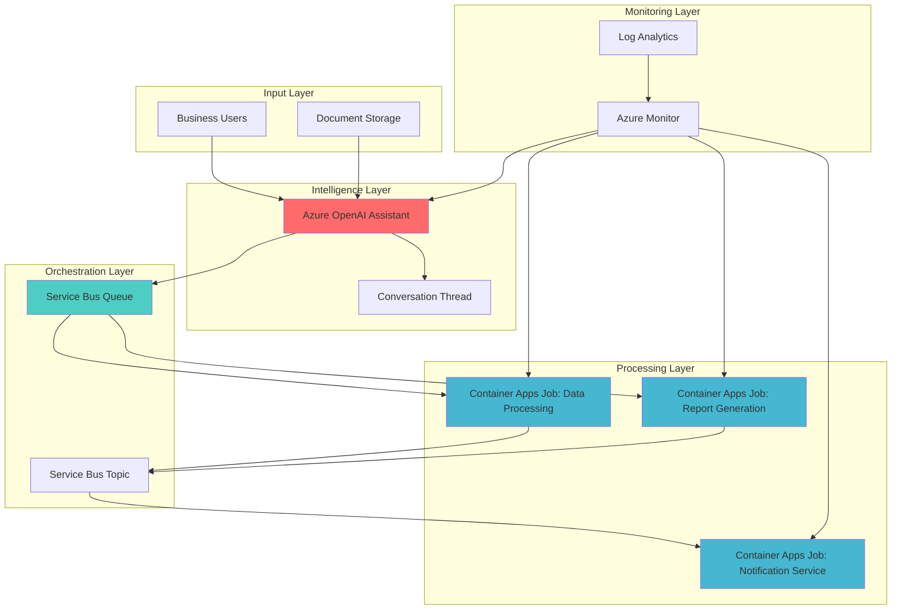

# AI-Powered Document Processing Automation with OpenAI Assistants

## Problem

Modern businesses struggle with complex document processing workflows that require human intelligence to extract insights, make decisions, and execute follow-up actions. Traditional automation solutions lack the cognitive capabilities to understand context, handle unstructured data, or adapt to varying business scenarios. Organizations need an intelligent automation system that can process documents, extract meaningful insights, and trigger scalable batch processing tasks while maintaining cost efficiency and operational flexibility.

## Solution

This solution combines Azure OpenAI Assistants for intelligent document analysis with Azure Container Apps Jobs for scalable batch processing execution. The Azure OpenAI Assistant acts as an intelligent agent that can analyze documents, extract key information, and make contextual decisions, while Container Apps Jobs provide event-driven, serverless execution of processing tasks. Azure Service Bus orchestrates the communication between components, ensuring reliable message delivery and enabling automatic scaling based on workload demands.

## Architecture Diagram



## Prerequisites

1. Azure subscription with Azure OpenAI Service access and appropriate permissions
2. Azure CLI v2.50.0 or later installed and configured (or Azure Cloud Shell)
3. Basic understanding of Azure Container Apps, Service Bus, and OpenAI concepts
4. Docker knowledge for containerizing job applications
5. Estimated cost: $50-100 for running this recipe (includes OpenAI API usage, Container Apps, and Service Bus)

> **Note**: Azure OpenAI Assistants API is currently in preview and requires approval for access. Apply for access through the Azure OpenAI Service application process.

## Preparation

```bash
# Set environment variables for Azure resources
export RESOURCE_GROUP="rg-intelligent-automation"
export LOCATION="eastus"
export SUBSCRIPTION_ID=$(az account show --query id --output tsv)

# Generate unique suffix for resource names
RANDOM_SUFFIX=$(openssl rand -hex 3)
export UNIQUE_SUFFIX=$RANDOM_SUFFIX

# Set resource names with unique identifiers
export OPENAI_ACCOUNT_NAME="openai-automation-${UNIQUE_SUFFIX}"
export SERVICEBUS_NAMESPACE="sb-automation-${UNIQUE_SUFFIX}"
export CONTAINER_ENV="aca-env-${UNIQUE_SUFFIX}"
export LOG_ANALYTICS_WORKSPACE="law-automation-${UNIQUE_SUFFIX}"
export CONTAINER_REGISTRY="acr${UNIQUE_SUFFIX}"

# Create resource group
az group create \
    --name ${RESOURCE_GROUP} \
    --location ${LOCATION} \
    --tags purpose=intelligent-automation environment=demo

echo "✅ Resource group created: ${RESOURCE_GROUP}"

# Create Log Analytics workspace for monitoring
az monitor log-analytics workspace create \
    --resource-group ${RESOURCE_GROUP} \
    --workspace-name ${LOG_ANALYTICS_WORKSPACE} \
    --location ${LOCATION}

echo "✅ Log Analytics workspace created"
```

## Steps

1. **Create Azure OpenAI Service for Intelligent Processing**:

   Azure OpenAI Service provides enterprise-grade AI capabilities with built-in security, compliance, and responsible AI features. The Assistants API enables the creation of intelligent agents that can maintain conversation context, use tools, and access files, making it ideal for complex business process automation scenarios that require cognitive understanding and decision-making capabilities.

   ```bash
   # Create Azure OpenAI account
   az cognitiveservices account create \
       --name ${OPENAI_ACCOUNT_NAME} \
       --resource-group ${RESOURCE_GROUP} \
       --location ${LOCATION} \
       --kind OpenAI \
       --sku S0 \
       --custom-domain ${OPENAI_ACCOUNT_NAME} \
       --tags purpose=intelligent-automation

   # Deploy GPT-4 model for assistants
   az cognitiveservices account deployment create \
       --name ${OPENAI_ACCOUNT_NAME} \
       --resource-group ${RESOURCE_GROUP} \
       --deployment-name gpt-4 \
       --model-name gpt-4 \
       --model-version "0613" \
       --model-format OpenAI \
       --scale-settings-scale-type Standard

   # Get OpenAI endpoint and key
   export OPENAI_ENDPOINT=$(az cognitiveservices account show \
       --name ${OPENAI_ACCOUNT_NAME} \
       --resource-group ${RESOURCE_GROUP} \
       --query properties.endpoint \
       --output tsv)

   export OPENAI_KEY=$(az cognitiveservices account keys list \
       --name ${OPENAI_ACCOUNT_NAME} \
       --resource-group ${RESOURCE_GROUP} \
       --query key1 \
       --output tsv)

   echo "✅ Azure OpenAI Service created with GPT-4 model deployed"
   ```

   The OpenAI service is now ready with the GPT-4 model deployed for use with the Assistants API. This foundational AI service will power the intelligent document processing and decision-making capabilities of our automation system.

2. **Create Service Bus for Message Orchestration**:

   Azure Service Bus provides reliable messaging services that enable decoupled communication between system components. Service Bus queues ensure guaranteed message delivery and automatic scaling, while topics enable publish-subscribe patterns for broadcasting processing results to multiple consumers. This messaging infrastructure is essential for orchestrating complex business workflows.

   ```bash
   # Create Service Bus namespace
   az servicebus namespace create \
       --name ${SERVICEBUS_NAMESPACE} \
       --resource-group ${RESOURCE_GROUP} \
       --location ${LOCATION} \
       --sku Standard

   # Create queue for processing tasks
   az servicebus queue create \
       --name processing-queue \
       --namespace-name ${SERVICEBUS_NAMESPACE} \
       --resource-group ${RESOURCE_GROUP} \
       --max-size 1024 \
       --default-message-time-to-live PT10M

   # Create topic for broadcasting results
   az servicebus topic create \
       --name processing-results \
       --namespace-name ${SERVICEBUS_NAMESPACE} \
       --resource-group ${RESOURCE_GROUP} \
       --max-size 1024

   # Create subscription for notification service
   az servicebus topic subscription create \
       --name notification-sub \
       --topic-name processing-results \
       --namespace-name ${SERVICEBUS_NAMESPACE} \
       --resource-group ${RESOURCE_GROUP}

   # Get Service Bus connection string
   export SERVICEBUS_CONNECTION=$(az servicebus namespace authorization-rule keys list \
       --resource-group ${RESOURCE_GROUP} \
       --namespace-name ${SERVICEBUS_NAMESPACE} \
       --name RootManageSharedAccessKey \
       --query primaryConnectionString \
       --output tsv)

   echo "✅ Service Bus namespace created with queue and topic"
   ```

   The Service Bus infrastructure is now configured with a queue for task processing and a topic for result broadcasting. This messaging foundation enables reliable, scalable communication between the AI assistant and the container jobs.

3. **Create Container Registry for Job Images**:

   Azure Container Registry provides secure, managed Docker container image storage with built-in security scanning and geo-replication capabilities. This registry will store the container images for our processing jobs, ensuring consistent deployment and easy version management across different environments.

   ```bash
   # Create Azure Container Registry
   az acr create \
       --name ${CONTAINER_REGISTRY} \
       --resource-group ${RESOURCE_GROUP} \
       --location ${LOCATION} \
       --sku Basic \
       --admin-enabled true

   # Get ACR login server
   export ACR_LOGIN_SERVER=$(az acr show \
       --name ${CONTAINER_REGISTRY} \
       --resource-group ${RESOURCE_GROUP} \
       --query loginServer \
       --output tsv)

   echo "✅ Container Registry created: ${ACR_LOGIN_SERVER}"
   ```

   The Container Registry is ready to store our job container images. This managed registry provides the foundation for deploying containerized processing jobs with proper security and access controls.

4. **Create Container Apps Environment**:

   Azure Container Apps Environment provides a secure, managed boundary for running containerized applications and jobs. The environment includes built-in networking, logging, and monitoring capabilities, making it ideal for hosting event-driven processing jobs that need to scale automatically based on message queue depth.

   ```bash
   # Create Container Apps environment
   az containerapp env create \
       --name ${CONTAINER_ENV} \
       --resource-group ${RESOURCE_GROUP} \
       --location ${LOCATION} \
       --logs-workspace-id $(az monitor log-analytics workspace show \
           --resource-group ${RESOURCE_GROUP} \
           --workspace-name ${LOG_ANALYTICS_WORKSPACE} \
           --query customerId \
           --output tsv) \
       --logs-workspace-key $(az monitor log-analytics workspace get-shared-keys \
           --resource-group ${RESOURCE_GROUP} \
           --workspace-name ${LOG_ANALYTICS_WORKSPACE} \
           --query primarySharedKey \
           --output tsv)

   echo "✅ Container Apps environment created with Log Analytics integration"
   ```

   The Container Apps environment is now ready to host our processing jobs with integrated monitoring and logging capabilities. This serverless container platform will automatically scale our jobs based on workload demands.

5. **Build and Deploy Document Processing Job**:

   This container job processes documents using AI-powered analysis, extracting key information and making business decisions. The job is designed to be stateless and scalable, processing messages from the Service Bus queue and publishing results to the topic for downstream consumption.

   ```bash
   # Create processing job container image
   cat > processing-job.dockerfile << 'EOF'
   FROM python:3.11-slim

   WORKDIR /app

   # Install required packages
   RUN pip install azure-servicebus azure-identity requests pandas

   # Copy application code
   COPY process_documents.py .

   # Set environment variables
   ENV PYTHONUNBUFFERED=1

   # Run the processing job
   CMD ["python", "process_documents.py"]
   EOF

   # Create Python processing script
   cat > process_documents.py << 'EOF'
   import os
   import json
   import time
   import logging
   from azure.servicebus import ServiceBusClient
   from azure.identity import DefaultAzureCredential
   import requests

   # Configure logging
   logging.basicConfig(level=logging.INFO)
   logger = logging.getLogger(__name__)

   def process_document(message_data):
       """Process document using AI analysis"""
       try:
           # Extract document information
           doc_info = json.loads(message_data)
           logger.info(f"Processing document: {doc_info.get('document_id')}")
           
           # Simulate document processing
           time.sleep(2)
           
           # Create processing result
           result = {
               "document_id": doc_info.get("document_id"),
               "processed_at": time.time(),
               "status": "completed",
               "insights": {
                   "key_points": ["Important finding 1", "Important finding 2"],
                   "recommendations": ["Action 1", "Action 2"]
               }
           }
           
           return result
           
       except Exception as e:
           logger.error(f"Error processing document: {str(e)}")
           raise

   def main():
       # Get connection string from environment
       connection_string = os.getenv('SERVICEBUS_CONNECTION')
       
       if not connection_string:
           logger.error("Service Bus connection string not found")
           return
           
       # Create Service Bus client
       servicebus_client = ServiceBusClient.from_connection_string(connection_string)
       
       try:
           # Receive from processing queue
           with servicebus_client:
               receiver = servicebus_client.get_queue_receiver(queue_name="processing-queue")
               sender = servicebus_client.get_topic_sender(topic_name="processing-results")
               
               with receiver, sender:
                   # Process single message (Container Apps Jobs handle one message per execution)
                   received_msgs = receiver.receive_messages(max_message_count=1, max_wait_time=30)
                   
                   for msg in received_msgs:
                       try:
                           logger.info(f"Processing message: {msg.message_id}")
                           
                           # Process the document
                           result = process_document(str(msg))
                           
                           # Send result to topic
                           result_message = json.dumps(result)
                           sender.send_messages(result_message)
                           
                           # Complete the message
                           receiver.complete_message(msg)
                           logger.info(f"Message {msg.message_id} processed successfully")
                           
                       except Exception as e:
                           logger.error(f"Error processing message {msg.message_id}: {str(e)}")
                           receiver.abandon_message(msg)
                           
       except Exception as e:
           logger.error(f"Service Bus error: {str(e)}")

   if __name__ == "__main__":
       main()
   EOF

   # Build and push container image
   az acr build \
       --registry ${CONTAINER_REGISTRY} \
       --image processing-job:latest \
       --file processing-job.dockerfile .

   echo "✅ Document processing job image built and pushed"
   ```

   The document processing job container is now available in the registry. This job will automatically process documents when messages arrive in the Service Bus queue, demonstrating the event-driven nature of our intelligent automation system.

6. **Deploy Container Apps Jobs with Event-Driven Scaling**:

   Container Apps Jobs provide serverless, event-driven execution that automatically scales based on message queue depth. The KEDA-powered scaling ensures that processing jobs only run when there's work to be done, optimizing costs while maintaining responsiveness to business demands.

   ```bash
   # Create document processing job
   az containerapp job create \
       --name document-processor \
       --resource-group ${RESOURCE_GROUP} \
       --environment ${CONTAINER_ENV} \
       --image ${ACR_LOGIN_SERVER}/processing-job:latest \
       --registry-server ${ACR_LOGIN_SERVER} \
       --registry-identity system \
       --trigger-type Event \
       --replica-timeout 300 \
       --parallelism 3 \
       --replica-retry-limit 2 \
       --scale-rule-name servicebus-scale \
       --scale-rule-type azure-servicebus \
       --scale-rule-metadata \
           connectionFromEnv=SERVICEBUS_CONNECTION \
           queueName=processing-queue \
           messageCount=1 \
       --env-vars \
           SERVICEBUS_CONNECTION=secretref:servicebus-connection \
       --secrets \
           servicebus-connection="${SERVICEBUS_CONNECTION}"

   # Create notification job for processing results
   az containerapp job create \
       --name notification-service \
       --resource-group ${RESOURCE_GROUP} \
       --environment ${CONTAINER_ENV} \
       --image ${ACR_LOGIN_SERVER}/processing-job:latest \
       --registry-server ${ACR_LOGIN_SERVER} \
       --registry-identity system \
       --trigger-type Event \
       --replica-timeout 120 \
       --parallelism 2 \
       --scale-rule-name servicebus-topic-scale \
       --scale-rule-type azure-servicebus \
       --scale-rule-metadata \
           connectionFromEnv=SERVICEBUS_CONNECTION \
           topicName=processing-results \
           subscriptionName=notification-sub \
           messageCount=1 \
       --env-vars \
           SERVICEBUS_CONNECTION=secretref:servicebus-connection \
       --secrets \
           servicebus-connection="${SERVICEBUS_CONNECTION}"

   echo "✅ Container Apps Jobs deployed with event-driven scaling"
   ```

   The Container Apps Jobs are now deployed with automatic scaling based on Service Bus message counts. This configuration ensures that processing jobs start immediately when work arrives and scale to handle varying workloads efficiently.

7. **Create Azure OpenAI Assistant for Intelligent Processing**:

   The Azure OpenAI Assistant acts as an intelligent agent that can analyze documents, understand business context, and make decisions about processing workflows. The assistant maintains conversation history and can use tools to interact with external systems, making it ideal for complex business process automation scenarios.

   ```bash
   # Create assistant configuration script
   cat > create_assistant.py << 'EOF'
   import os
   import json
   import requests
   from azure.servicebus import ServiceBusClient

   # Configuration
   OPENAI_ENDPOINT = os.getenv('OPENAI_ENDPOINT')
   OPENAI_KEY = os.getenv('OPENAI_KEY')
   SERVICEBUS_CONNECTION = os.getenv('SERVICEBUS_CONNECTION')

   def create_assistant():
       """Create Azure OpenAI Assistant for document processing"""
       
       headers = {
           'Content-Type': 'application/json',
           'api-key': OPENAI_KEY
       }
       
       assistant_config = {
           "model": "gpt-4",
           "name": "Document Processing Assistant",
           "description": "Intelligent assistant for business document processing and workflow automation",
           "instructions": """You are an intelligent business process automation assistant. Your role is to:
           
           1. Analyze documents and extract key business information
           2. Identify processing requirements and priority levels
           3. Make decisions about workflow routing and processing steps
           4. Generate structured output for downstream systems
           5. Provide recommendations for process improvements
           
           When processing documents, focus on:
           - Extracting actionable insights
           - Identifying compliance requirements
           - Determining processing priority
           - Suggesting automation opportunities
           
           Always provide structured JSON output for system integration.""",
           "tools": [
               {
                   "type": "function",
                   "function": {
                       "name": "queue_processing_task",
                       "description": "Queue a document processing task",
                       "parameters": {
                           "type": "object",
                           "properties": {
                               "document_id": {"type": "string"},
                               "processing_type": {"type": "string"},
                               "priority": {"type": "string"},
                               "metadata": {"type": "object"}
                           },
                           "required": ["document_id", "processing_type"]
                       }
                   }
               }
           ]
       }
       
       url = f"{OPENAI_ENDPOINT}/openai/assistants?api-version=2024-02-15-preview"
       
       response = requests.post(url, headers=headers, json=assistant_config)
       
       if response.status_code == 200:
           assistant = response.json()
           print(f"✅ Assistant created with ID: {assistant['id']}")
           return assistant['id']
       else:
           print(f"❌ Error creating assistant: {response.text}")
           return None

   def queue_processing_task(document_id, processing_type, priority="normal", metadata=None):
       """Queue a processing task to Service Bus"""
       
       task_data = {
           "document_id": document_id,
           "processing_type": processing_type,
           "priority": priority,
           "metadata": metadata or {},
           "queued_at": time.time()
       }
       
       servicebus_client = ServiceBusClient.from_connection_string(SERVICEBUS_CONNECTION)
       
       try:
           with servicebus_client:
               sender = servicebus_client.get_queue_sender(queue_name="processing-queue")
               
               with sender:
                   message = json.dumps(task_data)
                   sender.send_messages(message)
                   print(f"✅ Task queued for document {document_id}")
                   
       except Exception as e:
           print(f"❌ Error queuing task: {str(e)}")

   if __name__ == "__main__":
       assistant_id = create_assistant()
       if assistant_id:
           print(f"Assistant ID: {assistant_id}")
           print("Save this ID for interacting with the assistant")
   EOF

   # Set environment variables and create assistant
   export OPENAI_ENDPOINT=$OPENAI_ENDPOINT
   export OPENAI_KEY=$OPENAI_KEY
   export SERVICEBUS_CONNECTION=$SERVICEBUS_CONNECTION

   python create_assistant.py

   echo "✅ Azure OpenAI Assistant created for intelligent document processing"
   ```

   The Azure OpenAI Assistant is now configured with specialized instructions for document processing and business automation. The assistant can analyze documents, make intelligent decisions, and queue processing tasks, demonstrating the cognitive capabilities of our automation system.

8. **Configure Monitoring and Observability**:

   Azure Monitor provides comprehensive observability for our intelligent automation system, tracking AI assistant performance, container job execution, and message processing metrics. This monitoring infrastructure is essential for maintaining system health and optimizing performance in production environments.

   ```bash
   # Create Application Insights for OpenAI monitoring
   az monitor app-insights component create \
       --app ${OPENAI_ACCOUNT_NAME}-insights \
       --location ${LOCATION} \
       --resource-group ${RESOURCE_GROUP} \
       --workspace $(az monitor log-analytics workspace show \
           --resource-group ${RESOURCE_GROUP} \
           --workspace-name ${LOG_ANALYTICS_WORKSPACE} \
           --query id \
           --output tsv)

   # Create monitoring dashboard
   az monitor dashboard create \
       --resource-group ${RESOURCE_GROUP} \
       --name "Intelligent Automation Dashboard" \
       --input-path dashboard-config.json

   # Create dashboard configuration
   cat > dashboard-config.json << 'EOF'
   {
       "lenses": {
           "0": {
               "order": 0,
               "parts": {
                   "0": {
                       "position": {
                           "x": 0,
                           "y": 0,
                           "rowSpan": 4,
                           "colSpan": 6
                       },
                       "metadata": {
                           "inputs": [],
                           "type": "Extension/Microsoft_Azure_Monitoring/PartType/MetricsChartPart"
                       }
                   }
               }
           }
       }
   }
   EOF

   # Set up alerts for system health
   az monitor metrics alert create \
       --name "High OpenAI API Usage" \
       --resource-group ${RESOURCE_GROUP} \
       --scopes $(az cognitiveservices account show \
           --name ${OPENAI_ACCOUNT_NAME} \
           --resource-group ${RESOURCE_GROUP} \
           --query id \
           --output tsv) \
       --condition "avg ProcessedTokens > 10000" \
       --description "Alert when OpenAI API usage is high"

   echo "✅ Monitoring and alerting configured for intelligent automation system"
   ```

   The monitoring infrastructure is now in place to track system performance, API usage, and job execution metrics. This observability foundation enables proactive system management and optimization.

## Validation & Testing

1. **Verify Azure OpenAI Assistant Creation**:

   ```bash
   # Test assistant API connectivity
   curl -X GET \
       "${OPENAI_ENDPOINT}/openai/assistants?api-version=2024-02-15-preview" \
       -H "api-key: ${OPENAI_KEY}" \
       -H "Content-Type: application/json"
   ```

   Expected output: JSON response showing the created assistant with its configuration and tools.

2. **Test Service Bus Message Processing**:

   ```bash
   # Send test message to processing queue
   az servicebus queue send \
       --name processing-queue \
       --namespace-name ${SERVICEBUS_NAMESPACE} \
       --resource-group ${RESOURCE_GROUP} \
       --messages '[{"document_id": "test-doc-001", "processing_type": "analysis", "priority": "high"}]'

   # Check queue metrics
   az servicebus queue show \
       --name processing-queue \
       --namespace-name ${SERVICEBUS_NAMESPACE} \
       --resource-group ${RESOURCE_GROUP} \
       --query "{ActiveMessageCount:countDetails.activeMessageCount, DeadLetterMessageCount:countDetails.deadLetterMessageCount}"
   ```

   Expected output: Confirmation of message sent and queue metrics showing message processing.

3. **Validate Container Apps Job Execution**:

   ```bash
   # Check job execution history
   az containerapp job execution list \
       --name document-processor \
       --resource-group ${RESOURCE_GROUP} \
       --output table

   # View job logs
   az containerapp job logs show \
       --name document-processor \
       --resource-group ${RESOURCE_GROUP} \
       --follow
   ```

   Expected output: Job execution records and log entries showing successful document processing.

4. **Test End-to-End Workflow**:

   ```bash
   # Create test script for workflow validation
   cat > test_workflow.py << 'EOF'
   import json
   import requests
   import time
   from azure.servicebus import ServiceBusClient

   def test_intelligent_automation():
       # Test document processing through assistant
       test_document = {
           "document_id": "test-invoice-001",
           "content": "Invoice from ABC Corp for $5,000 due 30 days",
           "processing_type": "invoice_analysis"
       }
       
       print("Testing intelligent automation workflow...")
       
       # Queue processing task
       connection_string = os.getenv('SERVICEBUS_CONNECTION')
       servicebus_client = ServiceBusClient.from_connection_string(connection_string)
       
       with servicebus_client:
           sender = servicebus_client.get_queue_sender(queue_name="processing-queue")
           
           with sender:
               message = json.dumps(test_document)
               sender.send_messages(message)
               print("✅ Test document queued for processing")
       
       # Wait for processing and check results
       time.sleep(30)
       
       # Check results topic
       with servicebus_client:
           receiver = servicebus_client.get_subscription_receiver(
               topic_name="processing-results",
               subscription_name="notification-sub"
           )
           
           with receiver:
               messages = receiver.receive_messages(max_message_count=1, max_wait_time=10)
               
               for msg in messages:
                   result = json.loads(str(msg))
                   print(f"✅ Processing result: {result}")
                   receiver.complete_message(msg)

   if __name__ == "__main__":
       test_intelligent_automation()
   EOF

   python test_workflow.py
   ```

   Expected output: Successful workflow execution with document processing and result notification.

## Cleanup

1. **Remove Container Apps Resources**:

   ```bash
   # Delete Container Apps Jobs
   az containerapp job delete \
       --name document-processor \
       --resource-group ${RESOURCE_GROUP} \
       --yes

   az containerapp job delete \
       --name notification-service \
       --resource-group ${RESOURCE_GROUP} \
       --yes

   # Delete Container Apps environment
   az containerapp env delete \
       --name ${CONTAINER_ENV} \
       --resource-group ${RESOURCE_GROUP} \
       --yes

   echo "✅ Container Apps resources deleted"
   ```

2. **Remove Service Bus Resources**:

   ```bash
   # Delete Service Bus namespace and all contained resources
   az servicebus namespace delete \
       --name ${SERVICEBUS_NAMESPACE} \
       --resource-group ${RESOURCE_GROUP}

   echo "✅ Service Bus namespace deleted"
   ```

3. **Remove Azure OpenAI and Supporting Resources**:

   ```bash
   # Delete Azure OpenAI account
   az cognitiveservices account delete \
       --name ${OPENAI_ACCOUNT_NAME} \
       --resource-group ${RESOURCE_GROUP}

   # Delete Container Registry
   az acr delete \
       --name ${CONTAINER_REGISTRY} \
       --resource-group ${RESOURCE_GROUP} \
       --yes

   # Delete monitoring resources
   az monitor log-analytics workspace delete \
       --resource-group ${RESOURCE_GROUP} \
       --workspace-name ${LOG_ANALYTICS_WORKSPACE} \
       --force true

   echo "✅ Azure OpenAI and supporting resources deleted"
   ```

4. **Remove Resource Group**:

   ```bash
   # Delete resource group and all remaining resources
   az group delete \
       --name ${RESOURCE_GROUP} \
       --yes \
       --no-wait

   echo "✅ Resource group deletion initiated: ${RESOURCE_GROUP}"
   echo "Note: Complete deletion may take several minutes"
   ```

## Discussion

Azure OpenAI Assistants combined with Container Apps Jobs create a powerful intelligent automation platform that bridges the gap between cognitive AI capabilities and scalable serverless execution. This architecture demonstrates how modern cloud services can work together to create sophisticated business process automation solutions that adapt to varying workloads while maintaining cost efficiency. The Assistants API provides persistent conversation context and tool usage, making it ideal for complex multi-step processes that require decision-making and contextual understanding, as detailed in the [Azure OpenAI Assistants documentation](https://learn.microsoft.com/en-us/azure/ai-services/openai/concepts/assistants).

The event-driven nature of Container Apps Jobs ensures that processing resources are only consumed when actual work needs to be performed, following serverless principles that optimize costs and resource utilization. The integration with Azure Service Bus provides reliable message delivery and automatic scaling through KEDA, enabling the system to handle varying workloads efficiently. This approach aligns with the [Azure Well-Architected Framework](https://learn.microsoft.com/en-us/azure/architecture/framework/) principles of cost optimization and operational excellence.

From a security perspective, this solution leverages Azure's managed identity and role-based access control to secure communications between components without exposing credentials. The Container Apps environment provides network isolation, while Service Bus ensures encrypted message transmission. For production deployments, consider implementing additional security measures such as private endpoints and Azure Key Vault for sensitive configuration data, as outlined in the [Azure Container Apps security documentation](https://learn.microsoft.com/en-us/azure/container-apps/security).

The monitoring and observability features integrated into this solution provide comprehensive insights into system performance, costs, and operational health. Azure Monitor tracks OpenAI API usage, container job execution metrics, and Service Bus message processing, enabling proactive system management and optimization. This observability foundation is essential for maintaining system reliability and identifying optimization opportunities in production environments.

> **Tip**: Use Azure Application Insights to track OpenAI API usage patterns and optimize model selection based on workload characteristics. Monitor token consumption and response times to balance performance with cost efficiency.

## Challenge

Extend this intelligent automation solution by implementing these enhancements:

1. **Add Document Classification Pipeline**: Implement a pre-processing stage that uses Azure Form Recognizer to classify documents before routing them to appropriate specialized assistants for different document types.

2. **Implement Human-in-the-Loop Workflow**: Create an approval workflow using Azure Logic Apps that routes certain high-value or complex decisions to human reviewers before executing automated actions.

3. **Add Multi-Modal Processing**: Enhance the system to handle images, audio, and video content by integrating Azure Computer Vision, Speech Services, and Video Indexer with the OpenAI assistant for comprehensive media analysis.

4. **Implement Advanced Monitoring**: Deploy Azure Chaos Engineering to test system resilience and implement predictive scaling based on historical patterns using Azure Machine Learning.

5. **Create Custom Skills Framework**: Build a pluggable skills framework that allows business users to define custom processing logic through natural language instructions that get compiled into container jobs.

## Infrastructure Code

*Infrastructure code will be generated after recipe approval.*