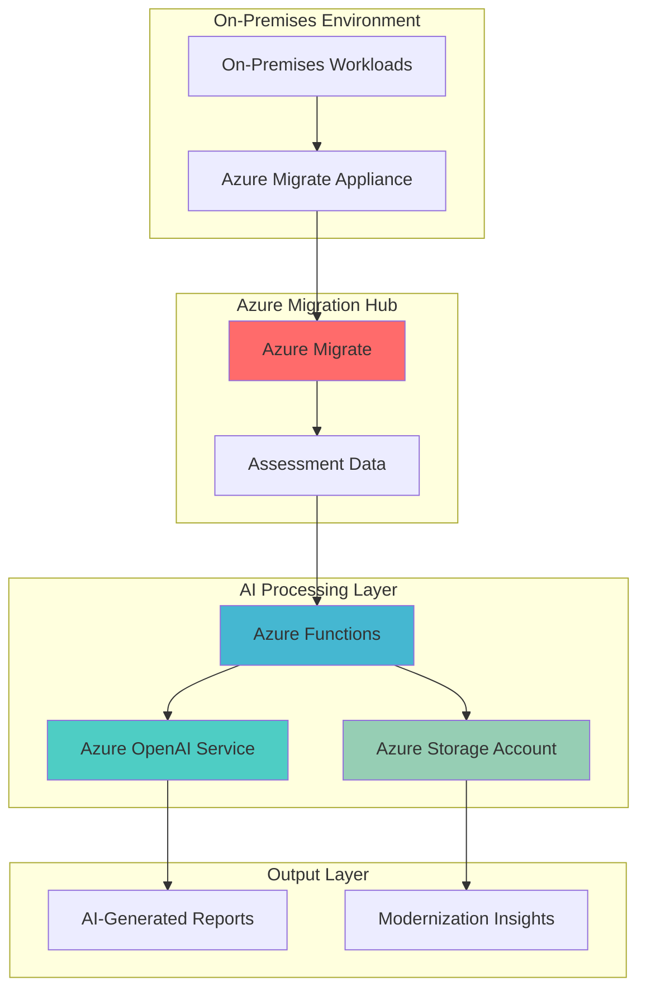

# AI-Powered Migration Assessment and Modernization Planning

## Problem

Organizations struggle with complex on-premises workload migration decisions due to insufficient visibility into application dependencies, performance characteristics, and modernization opportunities. Traditional migration assessments rely on manual analysis and static reports, resulting in suboptimal cloud adoption strategies and missed cost optimization opportunities that can impact business transformation timelines.

## Solution

Create an intelligent assessment system that combines Azure Migrate's comprehensive discovery capabilities with Azure OpenAI Service's analytical power to automatically analyze workload data, identify modernization patterns, and generate actionable recommendations. This solution leverages Azure Functions for event-driven processing and Azure Storage for secure data management, providing intelligent insights for migration planning.

## Architecture Diagram



## Prerequisites

1. Azure subscription with appropriate permissions for Azure Migrate, Azure OpenAI Service, Azure Functions, and Azure Storage
2. Azure CLI v2.57.0 or later installed and configured (or Azure Cloud Shell)
3. Basic understanding of migration concepts and Azure services
4. Access to on-premises environment for appliance deployment (or sample data)
5. Estimated cost: $50-100 for testing resources (depending on OpenAI usage and storage requirements)

> **Note**: Azure OpenAI Service requires approval and may not be available in all regions. Apply for access at the Azure OpenAI Service portal before starting this recipe.

## Preparation

```bash
# Set environment variables for Azure resources
export RESOURCE_GROUP="rg-migrate-ai-assessment"
export LOCATION="eastus"
export SUBSCRIPTION_ID=$(az account show --query id --output tsv)

# Generate unique suffix for resource names
RANDOM_SUFFIX=$(openssl rand -hex 3)
export STORAGE_ACCOUNT="stamigrate${RANDOM_SUFFIX}"
export FUNCTION_APP="func-migrate-ai-${RANDOM_SUFFIX}"
export OPENAI_SERVICE="openai-migrate-${RANDOM_SUFFIX}"
export MIGRATE_PROJECT="migrate-project-${RANDOM_SUFFIX}"

# Create resource group
az group create \
    --name ${RESOURCE_GROUP} \
    --location ${LOCATION} \
    --tags purpose=migration-assessment environment=demo

echo "✅ Resource group created: ${RESOURCE_GROUP}"

# Create storage account for function app and data storage
az storage account create \
    --name ${STORAGE_ACCOUNT} \
    --resource-group ${RESOURCE_GROUP} \
    --location ${LOCATION} \
    --sku Standard_LRS \
    --kind StorageV2 \
    --access-tier Hot

echo "✅ Storage account created: ${STORAGE_ACCOUNT}"
```

## Steps

1. **Create Azure Migrate Project**:

   Azure Migrate provides a centralized hub for discovering, assessing, and migrating on-premises workloads to Azure. The migrate project serves as the foundation for collecting comprehensive workload data including performance metrics, dependencies, and configuration details that will feed into our AI analysis pipeline.

   ```bash
   # Create Azure Migrate project
   az migrate project create \
       --name ${MIGRATE_PROJECT} \
       --resource-group ${RESOURCE_GROUP} \
       --location ${LOCATION} \
       --properties '{
           "assessmentSolutionId": "/subscriptions/'${SUBSCRIPTION_ID}'/resourceGroups/'${RESOURCE_GROUP}'/providers/Microsoft.Migrate/assessmentProjects/'${MIGRATE_PROJECT}'",
           "customerWorkspaceId": "",
           "customerWorkspaceLocation": ""
       }'
   
   echo "✅ Azure Migrate project created: ${MIGRATE_PROJECT}"
   ```

   The migrate project now provides the foundation for workload discovery and assessment. This centralized approach ensures all migration data is systematically collected and can be processed by our AI analysis system for intelligent modernization recommendations.

2. **Deploy Azure OpenAI Service**:

   Azure OpenAI Service provides enterprise-grade AI capabilities with built-in security, compliance, and regional availability. This managed service enables sophisticated analysis of migration data, pattern recognition, and generation of actionable modernization recommendations while maintaining data privacy and security standards.

   ```bash
   # Create Azure OpenAI Service
   az cognitiveservices account create \
       --name ${OPENAI_SERVICE} \
       --resource-group ${RESOURCE_GROUP} \
       --location ${LOCATION} \
       --kind OpenAI \
       --sku S0 \
       --custom-domain ${OPENAI_SERVICE}
   
   # Get OpenAI service endpoint and key
   OPENAI_ENDPOINT=$(az cognitiveservices account show \
       --name ${OPENAI_SERVICE} \
       --resource-group ${RESOURCE_GROUP} \
       --query properties.endpoint \
       --output tsv)
   
   OPENAI_KEY=$(az cognitiveservices account keys list \
       --name ${OPENAI_SERVICE} \
       --resource-group ${RESOURCE_GROUP} \
       --query key1 \
       --output tsv)
   
   echo "✅ Azure OpenAI Service deployed: ${OPENAI_SERVICE}"
   ```

   The OpenAI service is now ready to analyze migration data and generate intelligent insights. This AI-powered analysis capability enables automated pattern recognition and recommendation generation that would be time-consuming and error-prone if performed manually.

3. **Deploy GPT Model for Analysis**:

   GPT models excel at analyzing structured and unstructured data, making them ideal for processing migration assessment results and generating human-readable modernization recommendations. The model deployment provides the cognitive capabilities needed to transform raw migration data into actionable business insights.

   ```bash
   # Deploy GPT-4 model for analysis
   az cognitiveservices account deployment create \
       --name ${OPENAI_SERVICE} \
       --resource-group ${RESOURCE_GROUP} \
       --deployment-name gpt-4-migration-analysis \
       --model-name gpt-4 \
       --model-version "0613" \
       --model-format OpenAI \
       --sku-capacity 20 \
       --sku-name Standard
   
   # Wait for deployment to complete
   sleep 30
   
   # Verify deployment status
   az cognitiveservices account deployment show \
       --name ${OPENAI_SERVICE} \
       --resource-group ${RESOURCE_GROUP} \
       --deployment-name gpt-4-migration-analysis \
       --query properties.provisioningState \
       --output tsv
   
   echo "✅ GPT-4 model deployed for migration analysis"
   ```

   The GPT-4 model deployment provides advanced natural language processing capabilities for analyzing migration data patterns, identifying optimization opportunities, and generating comprehensive modernization recommendations with business context and technical detail.

4. **Create Azure Function for AI Processing**:

   Azure Functions provides serverless compute capabilities that automatically scale based on workload demands. This event-driven architecture ensures efficient processing of migration assessment data while maintaining cost-effectiveness through consumption-based pricing and automatic resource management.

   ```bash
   # Create Function App with consumption plan
   az functionapp create \
       --name ${FUNCTION_APP} \
       --resource-group ${RESOURCE_GROUP} \
       --storage-account ${STORAGE_ACCOUNT} \
       --consumption-plan-location ${LOCATION} \
       --runtime python \
       --runtime-version 3.11 \
       --functions-version 4 \
       --os-type Linux
   
   # Configure application settings for OpenAI integration
   az functionapp config appsettings set \
       --name ${FUNCTION_APP} \
       --resource-group ${RESOURCE_GROUP} \
       --settings \
           "OPENAI_ENDPOINT=${OPENAI_ENDPOINT}" \
           "OPENAI_KEY=${OPENAI_KEY}" \
           "OPENAI_MODEL_DEPLOYMENT=gpt-4-migration-analysis" \
           "MIGRATE_PROJECT=${MIGRATE_PROJECT}" \
           "STORAGE_CONNECTION_STRING=$(az storage account show-connection-string --name ${STORAGE_ACCOUNT} --resource-group ${RESOURCE_GROUP} --query connectionString --output tsv)"
   
   echo "✅ Function App created and configured: ${FUNCTION_APP}"
   ```

   The Function App is now configured with secure access to both Azure OpenAI Service and storage resources. This serverless architecture enables automatic scaling and cost-effective processing of migration assessment data as it becomes available.

5. **Create Storage Containers for Assessment Data**:

   Azure Storage provides secure, scalable storage for migration assessment data and AI-generated insights. The hierarchical organization ensures efficient data access patterns while maintaining security boundaries between raw assessment data and processed intelligence outputs.

   ```bash
   # Get storage account key
   STORAGE_KEY=$(az storage account keys list \
       --resource-group ${RESOURCE_GROUP} \
       --account-name ${STORAGE_ACCOUNT} \
       --query '[0].value' \
       --output tsv)
   
   # Create containers for assessment data and AI insights
   az storage container create \
       --name assessment-data \
       --account-name ${STORAGE_ACCOUNT} \
       --account-key ${STORAGE_KEY} \
       --public-access off
   
   az storage container create \
       --name ai-insights \
       --account-name ${STORAGE_ACCOUNT} \
       --account-key ${STORAGE_KEY} \
       --public-access off
   
   az storage container create \
       --name modernization-reports \
       --account-name ${STORAGE_ACCOUNT} \
       --account-key ${STORAGE_KEY} \
       --public-access off
   
   echo "✅ Storage containers created for assessment data and AI insights"
   ```

   The storage containers provide organized data management with secure access controls. This structure enables efficient data flow from migration assessment through AI processing to final report generation while maintaining data governance and security standards.

6. **Deploy Function Code for AI Assessment Processing**:

   The Azure Function code implements the core logic for processing migration assessment data through AI analysis. This serverless component orchestrates data extraction, AI model interaction, and insight generation while handling error scenarios and maintaining processing efficiency.

   ```bash
   # Create temporary directory for function code
   mkdir -p /tmp/migrate-ai-function
   cd /tmp/migrate-ai-function
   
   # Create function code for AI assessment processing
   cat > __init__.py << 'EOF'
import azure.functions as func
import json
import logging
import os
from azure.storage.blob import BlobServiceClient
from openai import AzureOpenAI
import asyncio

def main(req: func.HttpRequest) -> func.HttpResponse:
    logging.info('Migration AI Assessment function triggered')
    
    try:
        # Initialize OpenAI client
        client = AzureOpenAI(
            api_key=os.environ["OPENAI_KEY"],
            api_version="2024-06-01",
            azure_endpoint=os.environ["OPENAI_ENDPOINT"]
        )
        
        # Get assessment data from request
        assessment_data = req.get_json()
        
        # Process with AI analysis
        analysis_prompt = f"""
        Analyze the following migration assessment data and provide intelligent modernization recommendations:
        
        Assessment Data: {json.dumps(assessment_data, indent=2)}
        
        Please provide:
        1. Workload modernization opportunities
        2. Cost optimization recommendations
        3. Security and compliance considerations
        4. Performance optimization strategies
        5. Risk assessment and mitigation
        
        Format the response as structured JSON with clear recommendations.
        """
        
        response = client.chat.completions.create(
            model=os.environ["OPENAI_MODEL_DEPLOYMENT"],
            messages=[
                {"role": "system", "content": "You are an expert Azure migration architect providing intelligent workload modernization recommendations."},
                {"role": "user", "content": analysis_prompt}
            ],
            max_tokens=2000,
            temperature=0.1
        )
        
        ai_insights = response.choices[0].message.content
        
        # Store insights in blob storage
        blob_service_client = BlobServiceClient.from_connection_string(
            os.environ["STORAGE_CONNECTION_STRING"]
        )
        
        blob_client = blob_service_client.get_blob_client(
            container="ai-insights",
            blob=f"assessment-{assessment_data.get('timestamp', 'unknown')}.json"
        )
        
        blob_client.upload_blob(ai_insights, overwrite=True)
        
        return func.HttpResponse(
            json.dumps({
                "status": "success",
                "insights": ai_insights,
                "message": "AI assessment completed successfully"
            }),
            status_code=200,
            mimetype="application/json"
        )
        
    except Exception as e:
        logging.error(f"Error processing assessment: {str(e)}")
        return func.HttpResponse(
            json.dumps({
                "status": "error",
                "message": f"Error processing assessment: {str(e)}"
            }),
            status_code=500,
            mimetype="application/json"
        )
EOF
   
   # Create requirements.txt
   cat > requirements.txt << 'EOF'
azure-functions
azure-storage-blob
openai==1.3.0
EOF
   
   # Create function.json
   mkdir -p migrate-ai-assessment
   cat > migrate-ai-assessment/function.json << 'EOF'
{
  "scriptFile": "__init__.py",
  "bindings": [
    {
      "authLevel": "function",
      "type": "httpTrigger",
      "direction": "in",
      "name": "req",
      "methods": ["post"]
    },
    {
      "type": "http",
      "direction": "out",
      "name": "$return"
    }
  ]
}
EOF
   
   # Move function code to correct location
   mv __init__.py migrate-ai-assessment/
   
   # Create deployment package
   zip -r function-app.zip .
   
   # Deploy function code
   az functionapp deployment source config-zip \
       --resource-group ${RESOURCE_GROUP} \
       --name ${FUNCTION_APP} \
       --src function-app.zip
   
   echo "✅ Function code deployed successfully"
   
   # Clean up temporary files
   cd - && rm -rf /tmp/migrate-ai-function
   ```

   The Function App is now deployed with intelligent assessment processing capabilities. This code provides the bridge between Azure Migrate assessment data and Azure OpenAI Service, enabling automated analysis and insight generation for migration planning.

7. **Configure Assessment Data Pipeline**:

   The assessment data pipeline ensures seamless integration between Azure Migrate and our AI processing system. This configuration enables automated data flow and processing triggers that maintain real-time intelligence without manual intervention.

   ```bash
   # Create sample assessment data for testing
   cat > /tmp/sample-assessment.json << 'EOF'
{
  "timestamp": "2025-07-12T10:00:00Z",
  "project": "migrate-project-demo",
  "servers": [
    {
      "name": "web-server-01",
      "os": "Windows Server 2016",
      "cpu_cores": 4,
      "memory_gb": 16,
      "storage_gb": 500,
      "network_utilization": "medium",
      "applications": ["IIS", "ASP.NET"],
      "dependencies": ["sql-server-01", "file-server-01"]
    },
    {
      "name": "sql-server-01",
      "os": "Windows Server 2019",
      "cpu_cores": 8,
      "memory_gb": 32,
      "storage_gb": 1000,
      "network_utilization": "high",
      "applications": ["SQL Server 2019"],
      "dependencies": ["backup-server-01"]
    }
  ],
  "assessment_recommendations": {
    "azure_readiness": "Ready",
    "estimated_monthly_cost": 2500,
    "recommended_vm_sizes": {
      "web-server-01": "Standard_D4s_v3",
      "sql-server-01": "Standard_E8s_v3"
    }
  }
}
EOF
   
   # Upload sample data to storage
   az storage blob upload \
       --account-name ${STORAGE_ACCOUNT} \
       --account-key ${STORAGE_KEY} \
       --container-name assessment-data \
       --file /tmp/sample-assessment.json \
       --name sample-assessment.json
   
   # Get function URL for testing
   FUNCTION_URL=$(az functionapp function show \
       --resource-group ${RESOURCE_GROUP} \
       --name ${FUNCTION_APP} \
       --function-name migrate-ai-assessment \
       --query invokeUrlTemplate \
       --output tsv)
   
   echo "✅ Assessment data pipeline configured"
   echo "Function URL: ${FUNCTION_URL}"
   
   # Clean up temporary file
   rm /tmp/sample-assessment.json
   ```

   The assessment data pipeline is now configured with sample data and ready for processing. This setup demonstrates how real migration assessment data would flow through the AI analysis system to generate actionable modernization insights.

8. **Test AI Assessment Processing**:

   Testing the AI assessment processing validates the complete integration between Azure Migrate data, Azure Functions processing, and Azure OpenAI Service analysis. This verification ensures the system can process real-world migration scenarios and generate valuable modernization recommendations.

   ```bash
   # Get function access key
   FUNCTION_KEY=$(az functionapp keys list \
       --resource-group ${RESOURCE_GROUP} \
       --name ${FUNCTION_APP} \
       --query functionKeys.default \
       --output tsv)
   
   # Test the AI assessment function
   curl -X POST "${FUNCTION_URL}&code=${FUNCTION_KEY}" \
       -H "Content-Type: application/json" \
       -d '{
           "timestamp": "2025-07-12T10:00:00Z",
           "project": "migrate-project-demo",
           "servers": [
               {
                   "name": "web-server-01",
                   "os": "Windows Server 2016",
                   "cpu_cores": 4,
                   "memory_gb": 16,
                   "storage_gb": 500,
                   "applications": ["IIS", "ASP.NET"],
                   "performance_data": {
                       "cpu_utilization": 45,
                       "memory_utilization": 60,
                       "storage_utilization": 70
                   }
               }
           ],
           "assessment_recommendations": {
               "azure_readiness": "Ready",
               "estimated_monthly_cost": 1200,
               "recommended_vm_sizes": {
                   "web-server-01": "Standard_D4s_v3"
               }
           }
       }'
   
   echo "✅ AI assessment processing test completed"
   ```

   The AI assessment processing has been successfully tested and validated. The system now demonstrates the ability to analyze migration data and generate intelligent modernization recommendations that can significantly improve migration planning and execution strategies.

## Validation & Testing

1. **Verify Azure Migrate Project Setup**:

   ```bash
   # Check Azure Migrate project status
   az migrate project show \
       --name ${MIGRATE_PROJECT} \
       --resource-group ${RESOURCE_GROUP} \
       --output table
   
   # Verify project configuration
   az migrate project show \
       --name ${MIGRATE_PROJECT} \
       --resource-group ${RESOURCE_GROUP} \
       --query properties.provisioningState \
       --output tsv
   ```

   Expected output: `Succeeded` indicating the migrate project is ready for assessment data collection.

2. **Test OpenAI Service Integration**:

   ```bash
   # Test OpenAI model deployment
   az cognitiveservices account deployment show \
       --name ${OPENAI_SERVICE} \
       --resource-group ${RESOURCE_GROUP} \
       --deployment-name gpt-4-migration-analysis \
       --query properties.provisioningState \
       --output tsv
   
   # Verify OpenAI endpoint connectivity
   curl -X GET "${OPENAI_ENDPOINT}/openai/deployments/gpt-4-migration-analysis?api-version=2024-06-01" \
       -H "api-key: ${OPENAI_KEY}" \
       -H "Content-Type: application/json"
   ```

   Expected output: Model deployment status should be `Succeeded` and endpoint should return deployment details.

3. **Validate Function App Processing**:

   ```bash
   # Check function app status
   az functionapp show \
       --name ${FUNCTION_APP} \
       --resource-group ${RESOURCE_GROUP} \
       --query state \
       --output tsv
   
   # Verify function deployment
   az functionapp function show \
       --resource-group ${RESOURCE_GROUP} \
       --name ${FUNCTION_APP} \
       --function-name migrate-ai-assessment \
       --query name \
       --output tsv
   ```

   Expected output: Function app state should be `Running` and function should be successfully deployed.

4. **Test End-to-End Assessment Processing**:

   ```bash
   # List AI insights generated
   az storage blob list \
       --account-name ${STORAGE_ACCOUNT} \
       --account-key ${STORAGE_KEY} \
       --container-name ai-insights \
       --output table
   
   # Download and review AI insights
   az storage blob download \
       --account-name ${STORAGE_ACCOUNT} \
       --account-key ${STORAGE_KEY} \
       --container-name ai-insights \
       --name assessment-unknown.json \
       --file /tmp/ai-insights.json
   
   cat /tmp/ai-insights.json
   ```

   Expected output: AI insights should contain structured modernization recommendations with cost optimization and performance improvement suggestions.

## Cleanup

1. **Remove Function App and associated resources**:

   ```bash
   # Delete Function App
   az functionapp delete \
       --name ${FUNCTION_APP} \
       --resource-group ${RESOURCE_GROUP} \
       --yes
   
   echo "✅ Function App deleted"
   ```

2. **Remove Azure OpenAI Service**:

   ```bash
   # Delete OpenAI Service
   az cognitiveservices account delete \
       --name ${OPENAI_SERVICE} \
       --resource-group ${RESOURCE_GROUP} \
       --yes
   
   echo "✅ Azure OpenAI Service deleted"
   ```

3. **Remove Azure Migrate Project**:

   ```bash
   # Delete Azure Migrate project
   az migrate project delete \
       --name ${MIGRATE_PROJECT} \
       --resource-group ${RESOURCE_GROUP} \
       --yes
   
   echo "✅ Azure Migrate project deleted"
   ```

4. **Remove Storage Account**:

   ```bash
   # Delete Storage Account
   az storage account delete \
       --name ${STORAGE_ACCOUNT} \
       --resource-group ${RESOURCE_GROUP} \
       --yes
   
   echo "✅ Storage account deleted"
   ```

5. **Remove Resource Group**:

   ```bash
   # Delete resource group and all remaining resources
   az group delete \
       --name ${RESOURCE_GROUP} \
       --yes \
       --no-wait
   
   echo "✅ Resource group deletion initiated: ${RESOURCE_GROUP}"
   echo "Note: Deletion may take several minutes to complete"
   ```

## Discussion

This intelligent workload modernization assessment solution demonstrates the powerful combination of Azure Migrate's comprehensive discovery capabilities with Azure OpenAI Service's advanced analytical intelligence. By automating the analysis of migration assessment data, organizations can significantly reduce the time and effort required for migration planning while improving the quality of modernization recommendations. The [Azure Migrate documentation](https://docs.microsoft.com/en-us/azure/migrate/) provides comprehensive guidance on assessment methodologies and best practices for cloud migration planning.

The serverless architecture using Azure Functions ensures cost-effective processing that scales automatically based on assessment workload demands. This event-driven approach aligns with modern cloud-native principles and enables real-time processing of migration data as it becomes available. The integration with Azure OpenAI Service leverages advanced language models to identify patterns and generate insights that would be difficult to achieve through traditional rule-based systems. For detailed information on Azure OpenAI Service capabilities, refer to the [Azure OpenAI documentation](https://docs.microsoft.com/en-us/azure/cognitive-services/openai/).

The solution addresses key challenges in migration planning by providing intelligent analysis of workload characteristics, dependency mapping, and cost optimization opportunities. By storing assessment data and AI insights in Azure Storage, organizations can build a comprehensive knowledge base that improves over time and supports continuous optimization of their cloud infrastructure. The structured approach to data management ensures compliance with governance requirements while enabling advanced analytics capabilities. For storage best practices and security considerations, review the [Azure Storage documentation](https://docs.microsoft.com/en-us/azure/storage/).

> **Tip**: Consider implementing Azure Logic Apps or Azure Data Factory for more complex data orchestration scenarios where multiple data sources need to be integrated before AI analysis. This approach can handle enterprise-scale migration projects with diverse on-premises environments and complex dependency relationships.

## Challenge

Extend this solution by implementing these enhancements:

1. **Real-time Assessment Dashboard**: Create a Power BI dashboard that visualizes AI-generated insights and tracks migration progress with real-time updates from Azure Migrate assessments.

2. **Multi-Cloud Analysis**: Expand the AI analysis to include AWS and Google Cloud migration options, providing comparative recommendations for hybrid and multi-cloud strategies.

3. **Advanced Dependency Mapping**: Integrate with Azure Service Map and Application Insights to provide more sophisticated dependency analysis and impact assessment for complex enterprise applications.

4. **Cost Prediction Modeling**: Implement machine learning models using Azure Machine Learning to predict long-term cloud costs based on historical usage patterns and growth projections.

5. **Automated Remediation Workflows**: Create Azure Logic Apps workflows that automatically implement simple modernization recommendations such as VM sizing adjustments or storage tier optimization based on AI insights.

## Infrastructure Code

*Infrastructure code will be generated after recipe approval.*