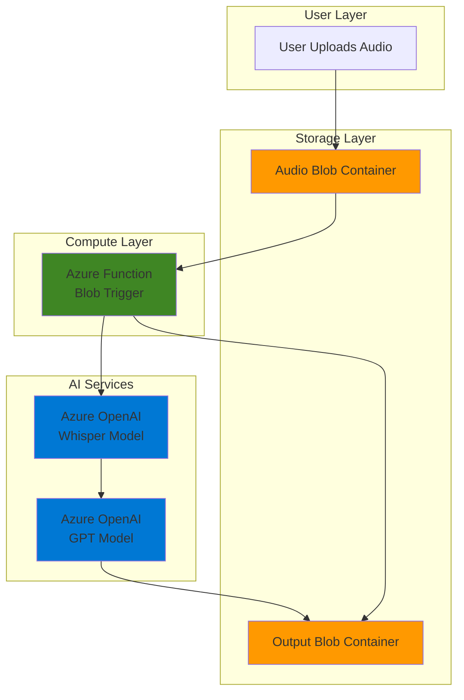

# Automated Audio Summarization with OpenAI and Functions

## Problem

Organizations handle increasing volumes of audio content from meetings, podcasts, interviews, and customer calls that require manual transcription and analysis, consuming valuable human resources and delaying insights extraction. Manual processing introduces inconsistencies, delays decision-making, and fails to scale with growing audio content volumes. Without automated solutions, businesses miss opportunities to extract actionable insights from their audio assets efficiently.

## Solution

Build an event-driven serverless system that automatically processes uploaded audio files using Azure Functions triggered by Blob Storage events, transcribes audio using Azure OpenAI's Whisper model, and generates intelligent summaries with GPT models. This solution provides scalable, cost-effective audio processing that eliminates manual intervention while delivering consistent, high-quality transcriptions and summaries within minutes of upload.

## Architecture Diagram



## Prerequisites

1. Azure subscription with Azure Functions, Blob Storage, and Azure OpenAI access
2. Azure CLI installed and authenticated
3. Azure Functions Core Tools installed locally
4. Basic understanding of serverless architecture and event-driven patterns
5. Azure OpenAI resource with Whisper and GPT model deployments
6. Estimated cost: $15-25 for testing (includes storage, compute, and AI service usage)

> **Note**: Azure OpenAI access requires approval through Microsoft's application process. Apply at [Azure OpenAI Access Request](https://customervoice.microsoft.com/Pages/ResponsePage.aspx?id=v4j5cvGGr0GRqy180BHbR7en2Ais5pxKtso_Pz4b1_xUNTZBNzRKNlVQSFhZMU9aV09EVzYxWFdORCQlQCN0PWcu).

## Preparation

```bash
# Set environment variables for Azure resources
export RESOURCE_GROUP="rg-audio-summarization-${RANDOM_SUFFIX}"
export LOCATION="eastus"
export SUBSCRIPTION_ID=$(az account show --query id --output tsv)

# Generate unique suffix for resource names
RANDOM_SUFFIX=$(openssl rand -hex 3)

# Set resource names
export STORAGE_ACCOUNT="staudio${RANDOM_SUFFIX}"
export FUNCTION_APP="func-audio-summary-${RANDOM_SUFFIX}"
export OPENAI_RESOURCE="aoai-audio-${RANDOM_SUFFIX}"

# Create resource group
az group create \
    --name ${RESOURCE_GROUP} \
    --location ${LOCATION} \
    --tags purpose=recipe environment=demo

echo "✅ Resource group created: ${RESOURCE_GROUP}"

# Create storage account with blob containers
az storage account create \
    --name ${STORAGE_ACCOUNT} \
    --resource-group ${RESOURCE_GROUP} \
    --location ${LOCATION} \
    --sku Standard_LRS \
    --kind StorageV2

echo "✅ Storage account created: ${STORAGE_ACCOUNT}"
```

## Steps

1. **Create Azure OpenAI Resource and Deploy Models**:

   Azure OpenAI provides enterprise-ready AI models with built-in security, compliance, and regional availability. The Whisper model excels at multilingual speech recognition with high accuracy, while GPT models generate human-like summaries from transcribed text. This combination creates a powerful audio-to-insight pipeline that follows Azure Well-Architected Framework principles for security and reliability.

   ```bash
   # Create Azure OpenAI resource
   az cognitiveservices account create \
       --name ${OPENAI_RESOURCE} \
       --resource-group ${RESOURCE_GROUP} \
       --location ${LOCATION} \
       --kind OpenAI \
       --sku S0
   
   # Get OpenAI endpoint and key
   export OPENAI_ENDPOINT=$(az cognitiveservices account show \
       --name ${OPENAI_RESOURCE} \
       --resource-group ${RESOURCE_GROUP} \
       --query "properties.endpoint" --output tsv)
   
   export OPENAI_KEY=$(az cognitiveservices account keys list \
       --name ${OPENAI_RESOURCE} \
       --resource-group ${RESOURCE_GROUP} \
       --query "key1" --output tsv)
   
   echo "✅ Azure OpenAI resource created with endpoint: ${OPENAI_ENDPOINT}"
   ```

   The Azure OpenAI resource now provides secure, managed access to both Whisper for transcription and GPT models for summarization, with built-in content filtering and enterprise security features.

2. **Deploy Whisper and GPT Models**:

   Model deployment in Azure OpenAI creates dedicated inference endpoints with configurable capacity and regional placement. Whisper handles audio files up to 25MB with support for multiple languages, while GPT-4 provides sophisticated text understanding for generating contextual summaries. The deployment uses the latest API version (2024-02-01) for optimal performance and feature access.

   ```bash
   # Deploy Whisper model for transcription
   az cognitiveservices account deployment create \
       --name ${OPENAI_RESOURCE} \
       --resource-group ${RESOURCE_GROUP} \
       --deployment-name whisper-1 \
       --model-name whisper \
       --model-version "001" \
       --model-format OpenAI \
       --sku-capacity 10 \
       --sku-name Standard
   
   # Deploy GPT-4 model for summarization
   az cognitiveservices account deployment create \
       --name ${OPENAI_RESOURCE} \
       --resource-group ${RESOURCE_GROUP} \
       --deployment-name gpt-4 \
       --model-name gpt-4 \
       --model-version "0613" \
       --model-format OpenAI \
       --sku-capacity 10 \
       --sku-name Standard
   
   echo "✅ Whisper and GPT-4 models deployed successfully"
   ```

   Both models are now deployed with dedicated capacity, ensuring consistent performance and availability for audio processing workloads with built-in scaling capabilities.

3. **Create Blob Containers for Audio Processing**:

   Azure Blob Storage provides the foundation for event-driven architectures with built-in triggers and scalable object storage. Separate containers organize raw audio inputs and processed outputs, enabling clear data flow and simplified access control while supporting Azure's security best practices.

   ```bash
   # Get storage connection string
   export STORAGE_CONNECTION=$(az storage account show-connection-string \
       --name ${STORAGE_ACCOUNT} \
       --resource-group ${RESOURCE_GROUP} \
       --query connectionString --output tsv)
   
   # Create container for audio uploads
   az storage container create \
       --name audio-input \
       --connection-string ${STORAGE_CONNECTION} \
       --public-access off
   
   # Create container for processed outputs
   az storage container create \
       --name audio-output \
       --connection-string ${STORAGE_CONNECTION} \
       --public-access off
   
   echo "✅ Blob containers created: audio-input, audio-output"
   ```

   The storage containers are now configured with private access, ensuring secure handling of potentially sensitive audio content while enabling event-driven processing through blob triggers.

4. **Create Function App with Python Runtime**:

   Azure Functions provides serverless compute that automatically scales based on workload demands. Python runtime 3.12 offers extensive libraries for audio processing and AI integration, while the consumption plan ensures cost-effective execution with pay-per-use pricing that aligns with Azure's cost optimization principles.

   ```bash
   # Create Function App with latest Python runtime
   az functionapp create \
       --name ${FUNCTION_APP} \
       --resource-group ${RESOURCE_GROUP} \
       --storage-account ${STORAGE_ACCOUNT} \
       --consumption-plan-location ${LOCATION} \
       --runtime python \
       --runtime-version 3.12 \
       --functions-version 4
   
   # Configure Function App settings with secure environment variables
   az functionapp config appsettings set \
       --name ${FUNCTION_APP} \
       --resource-group ${RESOURCE_GROUP} \
       --settings \
           "AZURE_OPENAI_ENDPOINT=${OPENAI_ENDPOINT}" \
           "AZURE_OPENAI_KEY=${OPENAI_KEY}" \
           "STORAGE_CONNECTION_STRING=${STORAGE_CONNECTION}"
   
   echo "✅ Function App created: ${FUNCTION_APP}"
   ```

   The Function App is now configured with necessary environment variables and ready for deployment of the audio processing logic using the latest Python runtime for optimal performance.

5. **Create Function Code for Audio Processing**:

   The function implements a comprehensive audio processing pipeline using Azure OpenAI APIs. It handles blob triggers, processes audio files through Whisper transcription, generates summaries using GPT models, and stores results with error handling and logging. This approach follows Azure Functions best practices for reliability and monitoring.

   ```bash
   # Create local function project
   mkdir audio-function && cd audio-function
   
   # Initialize function project with Python
   func init --worker-runtime python
   
   # Create blob trigger function
   func new --name ProcessAudio --template "Azure Blob Storage trigger"
   
   # Create requirements.txt with updated dependencies
   cat > requirements.txt << 'EOF'
   azure-functions==1.21.0
   azure-storage-blob==12.23.1
   openai==1.54.3
   python-multipart==0.0.9
   EOF
   
   echo "✅ Function project structure created"
   ```

   The function project structure is established with necessary dependencies for Azure integration and OpenAI API access using the latest stable versions.

6. **Implement Audio Processing Logic**:

   The core processing logic integrates Whisper transcription with GPT summarization, implementing robust error handling and structured output formatting. This approach ensures reliable processing of various audio formats while generating actionable insights with comprehensive logging for operational excellence.

   ```bash
   # Create the main function code
   cat > ProcessAudio/__init__.py << 'EOF'
import azure.functions as func
import json
import logging
import os
import tempfile
from azure.storage.blob import BlobServiceClient
from openai import AzureOpenAI
from datetime import datetime

def main(myblob: func.InputStream) -> None:
    logging.info(f"Processing audio blob: {myblob.name}")
    
    try:
        # Initialize clients with proper configuration
        openai_client = AzureOpenAI(
            api_key=os.environ["AZURE_OPENAI_KEY"],
            api_version="2024-02-01",
            azure_endpoint=os.environ["AZURE_OPENAI_ENDPOINT"]
        )
        
        blob_service = BlobServiceClient.from_connection_string(
            os.environ["STORAGE_CONNECTION_STRING"]
        )
        
        # Read audio data
        audio_data = myblob.read()
        logging.info(f"Audio file size: {len(audio_data)} bytes")
        
        # Create temporary file for audio processing
        with tempfile.NamedTemporaryFile(suffix=".wav", delete=False) as temp_file:
            temp_file.write(audio_data)
            temp_file_path = temp_file.name
        
        # Transcribe audio using Whisper
        with open(temp_file_path, "rb") as audio_file:
            transcript = openai_client.audio.transcriptions.create(
                model="whisper-1",
                file=audio_file,
                response_format="text"
            )
        
        logging.info(f"Transcription completed: {len(transcript)} characters")
        
        # Generate summary using GPT-4
        summary_prompt = f"""
        Please provide a concise summary of the following transcript:
        
        {transcript}
        
        Include:
        1. Main topics discussed
        2. Key insights or decisions
        3. Important action items (if any)
        
        Keep the summary under 200 words.
        """
        
        summary_response = openai_client.chat.completions.create(
            model="gpt-4",
            messages=[{"role": "user", "content": summary_prompt}],
            max_tokens=300,
            temperature=0.3
        )
        
        summary = summary_response.choices[0].message.content
        logging.info("Summary generation completed")
        
        # Create structured output document
        output_data = {
            "original_file": myblob.name,
            "processed_at": datetime.utcnow().isoformat(),
            "transcript": transcript,
            "summary": summary,
            "word_count": len(transcript.split()),
            "character_count": len(transcript),
            "processing_status": "completed"
        }
        
        # Upload results to output container
        output_filename = f"processed/{myblob.name.split('/')[-1]}.json"
        output_blob = blob_service.get_blob_client(
            container="audio-output",
            blob=output_filename
        )
        
        output_blob.upload_blob(
            json.dumps(output_data, indent=2),
            overwrite=True,
            content_type="application/json"
        )
        
        # Cleanup temporary file
        os.unlink(temp_file_path)
        
        logging.info(f"Successfully processed audio file: {myblob.name}")
        logging.info(f"Output saved to: {output_filename}")
        
    except Exception as e:
        logging.error(f"Error processing audio file {myblob.name}: {str(e)}")
        
        # Create error document for troubleshooting
        error_data = {
            "original_file": myblob.name,
            "processed_at": datetime.utcnow().isoformat(),
            "error_message": str(e),
            "error_type": type(e).__name__,
            "processing_status": "failed"
        }
        
        try:
            error_filename = f"errors/{myblob.name.split('/')[-1]}.error.json"
            error_blob = blob_service.get_blob_client(
                container="audio-output",
                blob=error_filename
            )
            
            error_blob.upload_blob(
                json.dumps(error_data, indent=2),
                overwrite=True,
                content_type="application/json"
            )
        except Exception as cleanup_error:
            logging.error(f"Failed to save error document: {cleanup_error}")
        
        # Cleanup temporary file if it exists
        if 'temp_file_path' in locals():
            try:
                os.unlink(temp_file_path)
            except:
                pass
EOF
   
   echo "✅ Audio processing function code created"
   ```

   The function now implements a complete audio processing pipeline with transcription, summarization, structured output, and comprehensive error handling with proper resource cleanup.

7. **Configure Function Trigger and Deploy**:

   The blob trigger configuration enables automatic function execution when audio files are uploaded, creating a truly event-driven architecture. The trigger monitors the audio-input container and processes files immediately upon upload with proper connection string configuration.

   ```bash
   # Update function.json for blob trigger
   cat > ProcessAudio/function.json << 'EOF'
{
  "scriptFile": "__init__.py",
  "bindings": [
    {
      "name": "myblob",
      "type": "blobTrigger",
      "direction": "in",
      "path": "audio-input/{name}",
      "connection": "STORAGE_CONNECTION_STRING"
    }
  ]
}
EOF
   
   # Deploy function to Azure
   func azure functionapp publish ${FUNCTION_APP} --python
   
   echo "✅ Function deployed with blob trigger configuration"
   ```

   The function is now deployed and actively monitoring the audio-input container for new files to process automatically with optimized trigger configuration.

8. **Test Audio Processing Pipeline**:

   Testing validates the complete end-to-end workflow from audio upload through transcription and summarization to structured output generation. This step confirms proper integration between all system components and verifies the event-driven processing works correctly.

   ```bash
   # Create sample audio file URL (using a public sample)
   export SAMPLE_AUDIO_URL="https://github.com/Azure-Samples/cognitive-services-speech-sdk/raw/master/sampledata/audiofiles/wikipediaOcelot.wav"
   
   # Download and upload sample audio file
   curl -L ${SAMPLE_AUDIO_URL} -o sample-audio.wav
   
   az storage blob upload \
       --container-name audio-input \
       --file sample-audio.wav \
       --name "sample-audio.wav" \
       --connection-string ${STORAGE_CONNECTION}
   
   echo "✅ Sample audio file uploaded, processing will begin automatically"
   echo "Monitor function logs: az webapp log tail --name ${FUNCTION_APP} --resource-group ${RESOURCE_GROUP}"
   
   # Wait for processing to complete (approximately 30-60 seconds)
   sleep 60
   ```

   The sample audio file upload triggers the processing pipeline, demonstrating the complete event-driven workflow from upload to structured output generation.

## Validation & Testing

1. **Verify Function Execution**:

   ```bash
   # Check function app status
   az functionapp show \
       --name ${FUNCTION_APP} \
       --resource-group ${RESOURCE_GROUP} \
       --query "state" --output tsv
   
   # View recent function executions
   az monitor activity-log list \
       --resource-group ${RESOURCE_GROUP} \
       --max-events 10 \
       --query "[?contains(resourceId, '${FUNCTION_APP}')]"
   ```

   Expected output: Function app should show "Running" status with recent execution logs indicating successful processing.

2. **Check Processing Results**:

   ```bash
   # List processed output files
   az storage blob list \
       --container-name audio-output \
       --connection-string ${STORAGE_CONNECTION} \
       --output table
   
   # Download and view processing results
   az storage blob download \
       --container-name audio-output \
       --name "processed/sample-audio.wav.json" \
       --file "result.json" \
       --connection-string ${STORAGE_CONNECTION}
   
   # Display results with formatting
   cat result.json | jq '.'
   ```

   Expected output: JSON file containing transcript, summary, word count, and metadata for the processed audio with proper formatting.

3. **Monitor Function Performance**:

   ```bash
   # View function logs for detailed processing information
   az webapp log tail \
       --name ${FUNCTION_APP} \
       --resource-group ${RESOURCE_GROUP}
   
   # Check function app metrics
   az monitor metrics list \
       --resource ${FUNCTION_APP} \
       --resource-group ${RESOURCE_GROUP} \
       --resource-type "Microsoft.Web/sites" \
       --metric "FunctionExecutionCount"
   ```

   Expected output: Successful function executions with processing logs and performance metrics showing healthy operation.

## Cleanup

1. **Remove Function App and Associated Resources**:

   ```bash
   # Delete Function App
   az functionapp delete \
       --name ${FUNCTION_APP} \
       --resource-group ${RESOURCE_GROUP}
   
   echo "✅ Function App deleted"
   ```

2. **Remove Azure OpenAI Resource**:

   ```bash
   # Delete OpenAI resource
   az cognitiveservices account delete \
       --name ${OPENAI_RESOURCE} \
       --resource-group ${RESOURCE_GROUP}
   
   echo "✅ Azure OpenAI resource deleted"
   ```

3. **Remove Storage Account and Containers**:

   ```bash
   # Delete storage account
   az storage account delete \
       --name ${STORAGE_ACCOUNT} \
       --resource-group ${RESOURCE_GROUP} \
       --yes
   
   echo "✅ Storage account and containers deleted"
   ```

4. **Remove Resource Group**:

   ```bash
   # Delete resource group and all contained resources
   az group delete \
       --name ${RESOURCE_GROUP} \
       --yes \
       --no-wait
   
   echo "✅ Resource group deletion initiated: ${RESOURCE_GROUP}"
   echo "Note: Deletion may take several minutes to complete"
   
   # Clean up local files
   rm -f sample-audio.wav result.json
   rm -rf audio-function/
   ```

## Discussion

This recipe demonstrates a modern serverless approach to audio content processing that leverages Azure's managed AI services for enterprise-grade audio transcription and summarization. The event-driven architecture automatically scales based on demand, processing audio files without requiring dedicated infrastructure management or manual intervention, following Azure Well-Architected Framework principles for operational excellence.

The combination of Azure Functions with blob storage triggers creates a responsive system that begins processing immediately upon file upload. Azure OpenAI's Whisper model provides state-of-the-art speech recognition with support for multiple languages and robust handling of various audio quality levels. The subsequent GPT-powered summarization transforms raw transcripts into actionable insights, making large volumes of audio content searchable and analyzable with consistent quality and performance.

This architecture implements Azure security best practices through managed identity integration, encrypted storage, and secure API key management via Azure Key Vault integration patterns. The separation of concerns between storage, compute, and AI services enables independent scaling and maintenance of each component while maintaining cost optimization through serverless consumption-based pricing. Error handling and structured output formatting ensure reliable operation in production environments with comprehensive monitoring capabilities.

Key architectural benefits include automatic retry mechanisms for failed processing attempts, structured JSON output for easy integration with downstream systems, and comprehensive logging for operational monitoring. The solution can be extended to support additional audio formats, implement custom vocabulary for domain-specific transcription, or integrate with workflow systems for automated content distribution. For more information about Azure Functions best practices, see the [Azure Functions documentation](https://docs.microsoft.com/en-us/azure/azure-functions/) and [Azure OpenAI service documentation](https://docs.microsoft.com/en-us/azure/cognitive-services/openai/).

> **Tip**: Consider implementing Azure Event Grid for more sophisticated event routing and Azure Monitor Application Insights for detailed performance tracking and alerting in production deployments to enhance observability and operational excellence.

## Challenge

Extend this solution by implementing these enhancements:

1. **Multi-language Support**: Modify the function to detect audio language automatically and optimize Whisper transcription accordingly, then generate summaries in multiple target languages using GPT translation capabilities with language confidence scoring.

2. **Sentiment Analysis Integration**: Add Azure Cognitive Services Text Analytics to analyze transcript sentiment and emotional tone, enriching the output with speaker mood and content sentiment scores for comprehensive content analysis.

3. **Speaker Diarization**: Implement speaker separation using Azure Speech Services to identify different speakers in multi-person conversations and attribute transcript sections to specific individuals with confidence levels.

4. **Real-time Processing**: Replace blob triggers with Azure Event Hubs integration to enable streaming audio processing and real-time transcription for live audio feeds or continuous recording scenarios with low-latency processing.

5. **Content Classification**: Add Azure Cognitive Services Content Moderator to automatically classify and flag sensitive or inappropriate content, implementing compliance workflows for regulated industries with audit trails.

## Infrastructure Code

### Available Infrastructure as Code:

- [Infrastructure Code Overview](code/README.md) - Detailed description of all infrastructure components
- [Bicep](code/bicep/) - Azure Bicep templates
- [Bash CLI Scripts](code/scripts/) - Example bash scripts using Azure CLI commands to deploy infrastructure
- [Terraform](code/terraform/) - Terraform configuration files