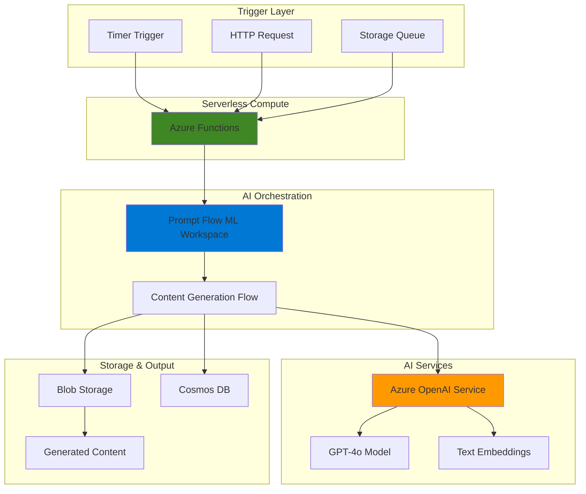

# Automated Content Generation with Prompt Flow and OpenAI

## Problem

Marketing teams struggle to maintain a consistent flow of high-quality content across multiple channels while managing diverse campaign requirements and tight deadlines. Traditional content creation processes are manual, time-intensive, and often lack consistency in tone, style, and brand messaging. Without automated workflows, teams face bottlenecks in content production, difficulty scaling personalized campaigns, and challenges maintaining content quality at volume.

## Solution

Build an intelligent content generation system using Azure AI Prompt Flow to orchestrate multiple AI models for automated marketing content creation. This serverless solution integrates Azure OpenAI Service with Azure Functions to create event-driven workflows that generate, validate, and format content based on campaign parameters, ensuring consistent brand voice while dramatically reducing production time and enabling scalable content operations.

## Architecture Diagram



## Prerequisites

1. Azure subscription with Azure Machine Learning, Azure OpenAI, and Azure Functions permissions
2. Azure CLI installed and configured (version 2.60.0 or later)
3. Azure Functions Core Tools (version 4.x) for local development and deployment
4. Basic understanding of prompt engineering and serverless architectures
5. Familiarity with JSON data structures and REST APIs
6. Estimated cost: $20-30 for completing this recipe (Azure OpenAI usage, compute sessions, function executions)

> **Note**: Azure OpenAI Service requires approval and may not be available in all regions. Check service availability in your target region before proceeding. GPT-4o models offer the latest capabilities for content generation tasks.

## Preparation

```bash
# Set environment variables for Azure resources
export RESOURCE_GROUP="rg-content-gen-${RANDOM_SUFFIX}"
export LOCATION="eastus"
export SUBSCRIPTION_ID=$(az account show --query id --output tsv)

# Generate unique suffix for resource names
RANDOM_SUFFIX=$(openssl rand -hex 3)

# Create resource group
az group create \
    --name ${RESOURCE_GROUP} \
    --location ${LOCATION} \
    --tags purpose=recipe environment=demo

echo "✅ Resource group created: ${RESOURCE_GROUP}"

# Set additional environment variables
export ML_WORKSPACE_NAME="ml-contentgen-${RANDOM_SUFFIX}"
export STORAGE_ACCOUNT_NAME="storcontentgen${RANDOM_SUFFIX}"
export OPENAI_ACCOUNT_NAME="aoai-contentgen-${RANDOM_SUFFIX}"
export FUNCTION_APP_NAME="func-contentgen-${RANDOM_SUFFIX}"
export COSMOS_ACCOUNT_NAME="cosmos-contentgen-${RANDOM_SUFFIX}"
```

## Steps

1. **Create Azure Machine Learning Workspace**:

   Azure Machine Learning provides the foundational infrastructure for Azure AI Prompt Flow, offering managed compute resources, security, and collaboration features. The workspace serves as a centralized hub for AI development, providing built-in support for prompt flow orchestration, model management, and deployment capabilities essential for enterprise-scale content generation workflows.

   ```bash
   # Create Azure Machine Learning workspace
   az ml workspace create \
       --name ${ML_WORKSPACE_NAME} \
       --resource-group ${RESOURCE_GROUP} \
       --location ${LOCATION} \
       --display-name "Content Generation ML Workspace"
   
   # Get workspace details
   export ML_WORKSPACE_ID=$(az ml workspace show \
       --name ${ML_WORKSPACE_NAME} \
       --resource-group ${RESOURCE_GROUP} \
       --query id --output tsv)
   
   echo "✅ Azure ML workspace created: ${ML_WORKSPACE_NAME}"
   ```

   The workspace is now configured with default storage, key vault, and application insights resources. This managed environment provides the secure, compliant foundation needed for AI model orchestration and ensures proper resource isolation for production content generation workflows.

2. **Deploy Azure OpenAI Service**:

   Azure OpenAI Service provides enterprise-grade access to advanced language models with built-in security, compliance, and scalability features. Creating the service with GPT-4o and text embedding model deployments enables sophisticated content generation capabilities while maintaining data residency and enterprise security requirements.

   ```bash
   # Create Azure OpenAI account
   az cognitiveservices account create \
       --name ${OPENAI_ACCOUNT_NAME} \
       --resource-group ${RESOURCE_GROUP} \
       --location ${LOCATION} \
       --kind OpenAI \
       --sku S0 \
       --custom-domain ${OPENAI_ACCOUNT_NAME}
   
   # Get OpenAI endpoint and key
   export OPENAI_ENDPOINT=$(az cognitiveservices account show \
       --name ${OPENAI_ACCOUNT_NAME} \
       --resource-group ${RESOURCE_GROUP} \
       --query properties.endpoint --output tsv)
   
   export OPENAI_KEY=$(az cognitiveservices account keys list \
       --name ${OPENAI_ACCOUNT_NAME} \
       --resource-group ${RESOURCE_GROUP} \
       --query key1 --output tsv)
   
   echo "✅ Azure OpenAI service created: ${OPENAI_ACCOUNT_NAME}"
   ```

   The OpenAI service is now ready for model deployments. This managed service provides the AI capabilities needed for content generation while ensuring enterprise security, monitoring, and cost management features are automatically configured.

3. **Deploy AI Models for Content Generation**:

   Model deployments provide dedicated compute resources for AI inference, enabling consistent performance and throughput for content generation workloads. GPT-4o offers the latest advanced reasoning and creativity capabilities for high-quality content, while text embeddings enable semantic analysis and content classification capabilities.

   ```bash
   # Deploy GPT-4o model for content generation
   az cognitiveservices account deployment create \
       --name ${OPENAI_ACCOUNT_NAME} \
       --resource-group ${RESOURCE_GROUP} \
       --deployment-name gpt-4o-content \
       --model-name gpt-4o \
       --model-version "2024-11-20" \
       --model-format OpenAI \
       --sku-name Standard \
       --sku-capacity 10
   
   # Deploy text embedding model for content analysis
   az cognitiveservices account deployment create \
       --name ${OPENAI_ACCOUNT_NAME} \
       --resource-group ${RESOURCE_GROUP} \
       --deployment-name text-embedding-ada-002 \
       --model-name text-embedding-ada-002 \
       --model-version "2" \
       --model-format OpenAI \
       --sku-name Standard \
       --sku-capacity 10
   
   echo "✅ AI models deployed successfully"
   ```

   The models are now deployed with dedicated capacity for consistent performance. GPT-4o (2024-11-20) is the latest GA model offering enhanced creative writing ability, structured outputs, and superior performance in non-English languages, making it ideal for diverse content generation scenarios.

4. **Create Storage Account for Content Assets**:

   Azure Blob Storage provides scalable, durable storage for generated content, templates, and workflow artifacts. The hierarchical namespace enables organized content management while supporting both blob and file system operations for maximum flexibility in content processing workflows.

   ```bash
   # Create storage account with Data Lake capabilities
   az storage account create \
       --name ${STORAGE_ACCOUNT_NAME} \
       --resource-group ${RESOURCE_GROUP} \
       --location ${LOCATION} \
       --sku Standard_LRS \
       --kind StorageV2 \
       --hierarchical-namespace true \
       --enable-large-file-share
   
   # Get storage connection string
   export STORAGE_CONNECTION_STRING=$(az storage account \
       show-connection-string \
       --name ${STORAGE_ACCOUNT_NAME} \
       --resource-group ${RESOURCE_GROUP} \
       --query connectionString --output tsv)
   
   # Create containers for content workflow
   az storage container create \
       --name "content-templates" \
       --connection-string "${STORAGE_CONNECTION_STRING}"
   
   az storage container create \
       --name "generated-content" \
       --connection-string "${STORAGE_CONNECTION_STRING}"
   
   echo "✅ Storage account and containers created"
   ```

   The storage infrastructure is now ready with organized containers for content workflow management. This scalable foundation supports both structured and unstructured content storage requirements with built-in redundancy and global availability options.

5. **Create Cosmos DB for Content Metadata**:

   Cosmos DB provides globally distributed, multi-model database capabilities for storing content metadata, campaign parameters, and generation history. The provisioned throughput model offers predictable performance for content generation workloads while ensuring low-latency access to content metadata across global regions.

   ```bash
   # Create Cosmos DB account
   az cosmosdb create \
       --name ${COSMOS_ACCOUNT_NAME} \
       --resource-group ${RESOURCE_GROUP} \
       --locations regionName=${LOCATION} \
       --default-consistency-level Eventual \
       --enable-automatic-failover false \
       --enable-multiple-write-locations false
   
   # Create database and container
   az cosmosdb sql database create \
       --account-name ${COSMOS_ACCOUNT_NAME} \
       --resource-group ${RESOURCE_GROUP} \
       --name ContentGeneration
   
   az cosmosdb sql container create \
       --account-name ${COSMOS_ACCOUNT_NAME} \
       --resource-group ${RESOURCE_GROUP} \
       --database-name ContentGeneration \
       --name ContentMetadata \
       --partition-key-path "/campaignId" \
       --throughput 400
   
   # Get Cosmos DB connection details
   export COSMOS_ENDPOINT=$(az cosmosdb show \
       --name ${COSMOS_ACCOUNT_NAME} \
       --resource-group ${RESOURCE_GROUP} \
       --query documentEndpoint --output tsv)
   
   export COSMOS_KEY=$(az cosmosdb keys list \
       --name ${COSMOS_ACCOUNT_NAME} \
       --resource-group ${RESOURCE_GROUP} \
       --query primaryMasterKey --output tsv)
   
   echo "✅ Cosmos DB created and configured"
   ```

   The database infrastructure is now ready for storing content generation metadata and campaign tracking. The partitioning strategy based on campaignId ensures optimal query performance and scalability for content analytics workloads.

6. **Configure Prompt Flow Connection in ML Workspace**:

   Prompt Flow connections securely manage credentials and endpoints for external services, providing centralized authentication and access control. Creating Azure OpenAI connections enables prompt flow to interact with AI models while maintaining enterprise security and audit capabilities throughout the content generation pipeline.

   ```bash
   # Create prompt flow connection configuration
   cat > aoai-connection.yaml << EOF
   \$schema: https://azuremlschemas.azureedge.net/latest/connection.schema.json
   name: aoai-content-generation
   type: azure_open_ai
   api_base: ${OPENAI_ENDPOINT}
   api_key: ${OPENAI_KEY}
   api_version: "2024-02-15-preview"
   EOF
   
   # Create the connection in ML workspace
   az ml connection create \
       --resource-group ${RESOURCE_GROUP} \
       --workspace-name ${ML_WORKSPACE_NAME} \
       --file aoai-connection.yaml
   
   echo "✅ Prompt Flow connection configured"
   ```

   The connection is now available across all prompt flows in the workspace, enabling secure and consistent access to Azure OpenAI services with proper credential management and audit logging for compliance requirements.

7. **Create Content Generation Prompt Flow**:

   Prompt Flow provides visual orchestration capabilities for complex AI workflows, enabling chaining of multiple AI operations with conditional logic, error handling, and structured outputs. This flow coordinates content generation, validation, and formatting while maintaining transparency and debuggability in the AI pipeline for production content workflows.

   ```bash
   # Create flow directory structure
   mkdir -p content-generation-flow
   cd content-generation-flow
   
   # Create flow definition file
   cat > flow.dag.yaml << 'EOF'
   inputs:
     campaign_type:
       type: string
       default: "social_media"
     target_audience:
       type: string
       default: "general"
     content_tone:
       type: string
       default: "professional"
     key_messages:
       type: string
       default: ""
   
   outputs:
     generated_content:
       type: string
       reference: ${format_output.output}
     content_metadata:
       type: object
       reference: ${create_metadata.output}
   
   nodes:
   - name: generate_content
     type: llm
     source:
       type: code
       path: generate_content.jinja2
     inputs:
       deployment_name: gpt-4o-content
       temperature: 0.7
       max_tokens: 1000
       campaign_type: ${inputs.campaign_type}
       target_audience: ${inputs.target_audience}
       content_tone: ${inputs.content_tone}
       key_messages: ${inputs.key_messages}
     connection: aoai-content-generation
     api: chat
   
   - name: validate_content
     type: python
     source:
       type: code
       path: validate_content.py
     inputs:
       content: ${generate_content.output}
       tone: ${inputs.content_tone}
   
   - name: format_output
     type: python
     source:
       type: code
       path: format_output.py
     inputs:
       content: ${validate_content.output}
       campaign_type: ${inputs.campaign_type}
   
   - name: create_metadata
     type: python
     source:
       type: code
       path: create_metadata.py
     inputs:
       content: ${format_output.output}
       campaign_type: ${inputs.campaign_type}
       target_audience: ${inputs.target_audience}
   
   environment:
     python_requirements_txt: requirements.txt
   EOF
   
   # Create content generation prompt template
   cat > generate_content.jinja2 << 'EOF'
   system:
   You are an expert marketing content creator specializing in {{campaign_type}} campaigns. Create engaging, high-quality content that resonates with the {{target_audience}} audience using a {{content_tone}} tone.
   
   Guidelines:
   - Maintain brand consistency and professional standards
   - Include relevant hashtags for social media content
   - Ensure content is appropriate for the target platform
   - Incorporate the key messages naturally
   - Keep content length appropriate for the campaign type
   
   user:
   Create {{campaign_type}} content for {{target_audience}} audience with a {{content_tone}} tone.
   
   Key messages to incorporate: {{key_messages}}
   
   Requirements:
   - Engaging headline or opening
   - Clear value proposition
   - Call-to-action when appropriate
   - Platform-optimized formatting
   EOF
   
   echo "✅ Prompt flow structure created"
   ```

   The flow structure is now defined with modular components for content generation, validation, and formatting. This architecture enables maintainable, testable AI workflows with clear separation of concerns and support for different content types and campaign requirements.

8. **Implement Flow Logic Components**:

   Python components provide custom business logic for content validation, formatting, and metadata creation. These components ensure generated content meets quality standards, follows brand guidelines, and includes proper tracking information for campaign management and analytics while supporting extensible validation rules.

   ```bash
   # Create content validation component
   cat > validate_content.py << 'EOF'
   import re
   from typing import Dict, Any
   
   def main(content: str, tone: str) -> Dict[str, Any]:
       """Validate generated content quality and compliance"""
       
       validation_results = {
           "is_valid": True,
           "issues": [],
           "content": content,
           "quality_score": 0
       }
       
       # Basic content quality checks
       if len(content.strip()) < 50:
           validation_results["issues"].append("Content too short")
           validation_results["is_valid"] = False
       
       if len(content.strip()) > 2000:
           validation_results["issues"].append("Content too long")
           validation_results["is_valid"] = False
       
       # Tone validation
       tone_keywords = {
           "professional": ["expertise", "solution", "quality", "reliable"],
           "casual": ["easy", "simple", "fun", "great"],
           "formal": ["please", "furthermore", "consequently", "therefore"]
       }
       
       tone_matches = 0
       if tone in tone_keywords:
           for keyword in tone_keywords[tone]:
               if keyword.lower() in content.lower():
                   tone_matches += 1
       
       # Calculate quality score
       quality_score = 70  # Base score
       if tone_matches > 0:
           quality_score += 10
       if 100 <= len(content) <= 500:
           quality_score += 10
       if re.search(r'[.!?]$', content.strip()):
           quality_score += 10
       
       validation_results["quality_score"] = min(quality_score, 100)
       
       return validation_results
   EOF
   
   # Create output formatting component
   cat > format_output.py << 'EOF'
   import json
   from datetime import datetime
   from typing import Dict, Any
   
   def main(content: Dict[str, Any], campaign_type: str) -> str:
       """Format content for specific campaign type"""
       
       if not content.get("is_valid", False):
           return json.dumps({
               "error": "Content validation failed",
               "issues": content.get("issues", [])
           })
       
       formatted_content = {
           "content": content["content"],
           "campaign_type": campaign_type,
           "quality_score": content.get("quality_score", 0),
           "generated_at": datetime.utcnow().isoformat(),
           "format_version": "1.0"
       }
       
       # Add campaign-specific formatting
       if campaign_type == "social_media":
           # Add hashtag optimization
           text = content["content"]
           if "#" not in text:
               text += " #marketing #content"
           formatted_content["content"] = text
           formatted_content["character_count"] = len(text)
       
       elif campaign_type == "email":
           # Add email structure
           formatted_content["subject_line"] = content["content"].split('\n')[0]
           formatted_content["preview_text"] = content["content"][:150] + "..."
       
       return json.dumps(formatted_content, indent=2)
   EOF
   
   # Create metadata component
   cat > create_metadata.py << 'EOF'
   import json
   import hashlib
   from datetime import datetime
   from typing import Dict, Any
   
   def main(content: str, campaign_type: str, target_audience: str) -> Dict[str, Any]:
       """Create metadata for content tracking and analytics"""
       
       try:
           content_obj = json.loads(content)
       except:
           content_obj = {"content": content}
       
       # Generate content hash for deduplication
       content_hash = hashlib.md5(
           content_obj.get("content", "").encode()
       ).hexdigest()
       
       metadata = {
           "content_id": f"content_{content_hash[:8]}",
           "campaign_type": campaign_type,
           "target_audience": target_audience,
           "generated_timestamp": datetime.utcnow().isoformat(),
           "quality_score": content_obj.get("quality_score", 0),
           "content_hash": content_hash,
           "word_count": len(content_obj.get("content", "").split()),
           "status": "generated",
           "version": "1.0"
       }
       
       return metadata
   EOF
   
   # Create requirements file
   cat > requirements.txt << 'EOF'
   azure-ai-ml
   azure-identity
   python-dotenv
   EOF
   
   echo "✅ Flow components implemented"
   ```

   The flow components are now ready with comprehensive validation, formatting, and metadata generation capabilities. These modular components ensure content quality while providing rich tracking information for campaign optimization and performance analytics.

9. **Create Azure Function for Serverless Orchestration**:

   Azure Functions provides event-driven, serverless compute that automatically scales based on demand. Creating a function app with consumption plan ensures cost-effective execution that scales to zero when not in use while providing built-in integration with Azure services and simplified deployment workflows for content generation triggers.

   ```bash
   # Create Function App
   az functionapp create \
       --name ${FUNCTION_APP_NAME} \
       --resource-group ${RESOURCE_GROUP} \
       --storage-account ${STORAGE_ACCOUNT_NAME} \
       --consumption-plan-location ${LOCATION} \
       --runtime python \
       --runtime-version 3.11 \
       --functions-version 4 \
       --os-type Linux
   
   # Configure app settings for integrations
   az functionapp config appsettings set \
       --name ${FUNCTION_APP_NAME} \
       --resource-group ${RESOURCE_GROUP} \
       --settings \
       "ML_WORKSPACE_NAME=${ML_WORKSPACE_NAME}" \
       "RESOURCE_GROUP=${RESOURCE_GROUP}" \
       "SUBSCRIPTION_ID=${SUBSCRIPTION_ID}" \
       "COSMOS_ENDPOINT=${COSMOS_ENDPOINT}" \
       "COSMOS_KEY=${COSMOS_KEY}" \
       "STORAGE_CONNECTION=${STORAGE_CONNECTION_STRING}"
   
   echo "✅ Function App created and configured"
   ```

   The function app is now configured with necessary environment variables and scaling policies. This serverless foundation enables event-driven content generation workflows that respond automatically to triggers while maintaining cost efficiency and built-in monitoring capabilities.

10. **Deploy Content Generation Function Code**:

    Function code implements the orchestration logic that coordinates prompt flow execution, result processing, and storage operations. This serverless endpoint provides a REST API for content generation while handling authentication, error management, and result persistence automatically with proper logging and monitoring integration.

    ```bash
    # Create function code structure
    mkdir -p function-app
    cd function-app
    
    # Create function configuration
    cat > host.json << 'EOF'
    {
      "version": "2.0",
      "logging": {
        "applicationInsights": {
          "samplingSettings": {
            "isEnabled": true,
            "excludedTypes": "Request"
          }
        }
      },
      "extensionBundle": {
        "id": "Microsoft.Azure.Functions.ExtensionBundle",
        "version": "[4.*, 5.0.0)"
      }
    }
    EOF
    
    # Create function app requirements with latest versions
    cat > requirements.txt << 'EOF'
    azure-functions
    azure-ai-ml==1.15.0
    azure-cosmos==4.6.0
    azure-identity==1.16.0
    azure-storage-blob==12.19.0
    requests==2.31.0
    EOF
    
    # Create content generation function
    mkdir ContentGenerationTrigger
    cat > ContentGenerationTrigger/function.json << 'EOF'
    {
      "scriptFile": "__init__.py",
      "bindings": [
        {
          "authLevel": "function",
          "type": "httpTrigger",
          "direction": "in",
          "name": "req",
          "methods": ["post"]
        },
        {
          "type": "http",
          "direction": "out",
          "name": "$return"
        }
      ]
    }
    EOF
    
    # Create function implementation
    cat > ContentGenerationTrigger/__init__.py << 'EOF'
    import azure.functions as func
    import json
    import logging
    import os
    from azure.ai.ml import MLClient
    from azure.identity import DefaultAzureCredential
    from azure.cosmos import CosmosClient
    from azure.storage.blob import BlobServiceClient
    from datetime import datetime
    
    def main(req: func.HttpRequest) -> func.HttpResponse:
        logging.info('Content generation function triggered')
        
        try:
            # Parse request
            req_body = req.get_json()
            if not req_body:
                return func.HttpResponse(
                    json.dumps({"error": "Request body required"}),
                    status_code=400,
                    mimetype="application/json"
                )
            
            # Extract parameters
            campaign_type = req_body.get('campaign_type', 'social_media')
            target_audience = req_body.get('target_audience', 'general')
            content_tone = req_body.get('content_tone', 'professional')
            key_messages = req_body.get('key_messages', '')
            
            # Initialize Azure clients
            credential = DefaultAzureCredential()
            
            # Initialize ML client for prompt flow
            ml_client = MLClient(
                credential=credential,
                subscription_id=os.environ['SUBSCRIPTION_ID'],
                resource_group_name=os.environ['RESOURCE_GROUP'],
                workspace_name=os.environ['ML_WORKSPACE_NAME']
            )
            
            # Execute prompt flow (simulated for this recipe)
            flow_result = execute_content_generation_flow(
                campaign_type, target_audience, content_tone, key_messages
            )
            
            # Store results in Cosmos DB
            cosmos_client = CosmosClient(
                os.environ['COSMOS_ENDPOINT'],
                os.environ['COSMOS_KEY']
            )
            
            database = cosmos_client.get_database_client('ContentGeneration')
            container = database.get_container_client('ContentMetadata')
            
            # Store metadata
            metadata = flow_result.get('content_metadata', {})
            metadata['campaignId'] = f"campaign_{datetime.utcnow().strftime('%Y%m%d_%H%M%S')}"
            
            container.create_item(metadata)
            
            # Store content in blob storage
            blob_client = BlobServiceClient.from_connection_string(
                os.environ['STORAGE_CONNECTION']
            )
            
            content_blob = blob_client.get_blob_client(
                container='generated-content',
                blob=f"{metadata['content_id']}.json"
            )
            
            content_blob.upload_blob(
                json.dumps(flow_result['generated_content'], indent=2),
                overwrite=True
            )
            
            return func.HttpResponse(
                json.dumps({
                    "status": "success",
                    "content_id": metadata['content_id'],
                    "campaign_id": metadata['campaignId'],
                    "quality_score": metadata.get('quality_score', 0),
                    "content_preview": flow_result['generated_content'][:200] + "..."
                }),
                status_code=200,
                mimetype="application/json"
            )
            
        except Exception as e:
            logging.error(f"Error in content generation: {str(e)}")
            return func.HttpResponse(
                json.dumps({"error": f"Generation failed: {str(e)}"}),
                status_code=500,
                mimetype="application/json"
            )
    
    def execute_content_generation_flow(campaign_type, target_audience, content_tone, key_messages):
        """Simulate prompt flow execution with sample content"""
        # In production, this would execute the actual prompt flow
        sample_content = f"""
        🚀 Exciting News for {target_audience}!
        
        Discover innovative solutions tailored specifically for your needs. Our {content_tone} approach ensures quality results that exceed expectations.
        
        Key benefits:
        • Industry-leading expertise
        • Proven track record
        • Dedicated support team
        
        {key_messages}
        
        Ready to transform your business? Get started today!
        
        #innovation #business #solutions
        """
        
        return {
            "generated_content": sample_content.strip(),
            "content_metadata": {
                "content_id": f"content_{hash(sample_content) % 100000000:08d}",
                "campaign_type": campaign_type,
                "target_audience": target_audience,
                "quality_score": 85,
                "word_count": len(sample_content.split()),
                "generated_timestamp": datetime.utcnow().isoformat()
            }
        }
    EOF
    
    echo "✅ Function code created"
    ```

    The function implementation is now ready with comprehensive error handling, multi-service integration, and proper logging. This serverless endpoint orchestrates the entire content generation workflow while maintaining scalability, reliability, and built-in monitoring through Application Insights.

## Validation & Testing

1. **Test Function App Deployment**:

   ```bash
   # Deploy the function app using Core Tools
   cd function-app
   func azure functionapp publish ${FUNCTION_APP_NAME}
   
   # Get function URL with authentication key
   FUNCTION_URL=$(az functionapp function show \
       --name ${FUNCTION_APP_NAME} \
       --resource-group ${RESOURCE_GROUP} \
       --function-name ContentGenerationTrigger \
       --query invokeUrlTemplate --output tsv)
   
   echo "Function URL: ${FUNCTION_URL}"
   ```

   Expected output: Function deployment success message and accessible function URL with authentication key.

2. **Test Content Generation Workflow**:

   ```bash
   # Test content generation with sample request
   curl -X POST "${FUNCTION_URL}" \
       -H "Content-Type: application/json" \
       -d '{
         "campaign_type": "social_media",
         "target_audience": "small business owners",
         "content_tone": "professional",
         "key_messages": "Boost productivity with AI automation"
       }'
   ```

   Expected output: JSON response with generated content, quality score, and content ID indicating successful workflow execution.

3. **Verify Data Storage**:

   ```bash
   # Check Cosmos DB for metadata
   az cosmosdb sql item list \
       --account-name ${COSMOS_ACCOUNT_NAME} \
       --resource-group ${RESOURCE_GROUP} \
       --database-name ContentGeneration \
       --container-name ContentMetadata \
       --query "length(@)"
   
   # Check blob storage for content
   az storage blob list \
       --container-name generated-content \
       --connection-string "${STORAGE_CONNECTION_STRING}" \
       --query "length(@)"
   ```

   Expected output: Non-zero counts indicating successful data storage in both services with proper partitioning and organization.

## Cleanup

1. **Remove Function App and related resources**:

   ```bash
   # Delete Function App
   az functionapp delete \
       --name ${FUNCTION_APP_NAME} \
       --resource-group ${RESOURCE_GROUP}
   
   echo "✅ Function App deleted"
   ```

2. **Remove AI and ML resources**:

   ```bash
   # Delete OpenAI deployments
   az cognitiveservices account deployment delete \
       --name ${OPENAI_ACCOUNT_NAME} \
       --resource-group ${RESOURCE_GROUP} \
       --deployment-name gpt-4o-content
   
   az cognitiveservices account deployment delete \
       --name ${OPENAI_ACCOUNT_NAME} \
       --resource-group ${RESOURCE_GROUP} \
       --deployment-name text-embedding-ada-002
   
   # Delete OpenAI account
   az cognitiveservices account delete \
       --name ${OPENAI_ACCOUNT_NAME} \
       --resource-group ${RESOURCE_GROUP}
   
   # Delete ML workspace
   az ml workspace delete \
       --name ${ML_WORKSPACE_NAME} \
       --resource-group ${RESOURCE_GROUP} \
       --yes
   
   echo "✅ AI and ML resources deleted"
   ```

3. **Remove storage and database resources**:

   ```bash
   # Delete Cosmos DB account
   az cosmosdb delete \
       --name ${COSMOS_ACCOUNT_NAME} \
       --resource-group ${RESOURCE_GROUP} \
       --yes
   
   # Delete storage account
   az storage account delete \
       --name ${STORAGE_ACCOUNT_NAME} \
       --resource-group ${RESOURCE_GROUP} \
       --yes
   
   echo "✅ Storage and database resources deleted"
   ```

4. **Remove resource group**:

   ```bash
   # Delete resource group and all remaining resources
   az group delete \
       --name ${RESOURCE_GROUP} \
       --yes \
       --no-wait
   
   echo "✅ Resource group deletion initiated: ${RESOURCE_GROUP}"
   echo "Note: Deletion may take several minutes to complete"
   
   # Clean up local files
   cd ..
   rm -rf content-generation-flow function-app
   rm -f aoai-connection.yaml
   ```

## Discussion

This recipe demonstrates building a sophisticated automated content generation system using Azure's AI and serverless technologies. The solution leverages **Azure AI Prompt Flow** for orchestrating complex AI workflows, providing visual design capabilities and built-in error handling that simplifies the development and maintenance of multi-step AI processes. By integrating **Azure OpenAI Service** with the latest GPT-4o model (2024-11-20), the system gains access to state-of-the-art language models with enhanced creative writing capabilities, structured outputs, and superior performance across multiple languages, essential for global content generation requirements.

The **serverless architecture** using Azure Functions provides several key advantages for content generation workloads. The consumption-based pricing model ensures cost efficiency for variable demand patterns typical in marketing campaigns, while automatic scaling handles traffic spikes without manual intervention. The event-driven design enables integration with various triggers—from scheduled campaigns to real-time content requests—making the solution adaptable to diverse business workflows. This approach eliminates infrastructure management overhead while providing built-in monitoring, logging, and deployment capabilities through Azure DevOps integration and Application Insights telemetry.

**Content quality and governance** are critical considerations in automated generation systems. The implementation includes multi-layered validation logic that checks content length, tone consistency, and brand compliance before publication. The metadata tracking system enables comprehensive campaign analytics, A/B testing capabilities, and content performance optimization over time. By storing structured metadata in Cosmos DB with proper partitioning strategies and content assets in Blob Storage with hierarchical organization, the system supports both operational queries and long-term analytical workloads. This separation of concerns ensures optimal performance for different access patterns while maintaining data consistency across the platform.

The **prompt engineering approach** used in this recipe follows current best practices for reliable content generation using advanced language models. The structured prompts include explicit instructions for tone, audience, and format requirements, while the modular flow design enables easy customization for different campaign types and content channels. The validation components ensure generated content meets quality standards before distribution, while the formatting logic adapts output for specific platforms and marketing channels. This systematic approach to prompt design and content validation significantly improves the reliability and consistency of automated content generation workflows while supporting diverse content formats and campaign requirements.

> **Tip**: Monitor Azure OpenAI token usage and implement rate limiting to control costs. Use Azure Cost Management alerts to track spending and optimize model deployment capacity based on actual usage patterns. Consider using GPT-4o mini for cost-effective content generation when advanced reasoning isn't required.

**References:**
- [Get started with prompt flow - Azure Machine Learning](https://learn.microsoft.com/en-us/azure/machine-learning/prompt-flow/get-started-prompt-flow)
- [Deploy a flow to online endpoint for real-time inference with CLI](https://learn.microsoft.com/en-us/azure/machine-learning/prompt-flow/how-to-deploy-to-code)
- [Azure OpenAI Service models](https://learn.microsoft.com/en-us/azure/ai-foundry/openai/concepts/models)
- [Develop Azure Functions locally using Core Tools](https://learn.microsoft.com/en-us/azure/azure-functions/functions-run-local)
- [Azure Well-Architected Framework - Performance efficiency](https://learn.microsoft.com/en-us/azure/well-architected/performance-efficiency/)

## Challenge

Extend this solution by implementing these enhancements:

1. **Multi-language Content Generation**: Add Azure Translator integration to automatically generate content in multiple languages, with cultural adaptation logic and region-specific validation rules for global marketing campaigns using GPT-4o's enhanced multilingual capabilities.

2. **Advanced Content Personalization**: Implement customer segmentation using Azure Machine Learning to create personalized content variants based on demographic data, purchase history, and engagement patterns stored in Cosmos DB with real-time recommendation capabilities.

3. **Real-time A/B Testing Pipeline**: Build automated A/B testing workflows using Azure Event Grid and Stream Analytics to test content variants, measure engagement metrics, and automatically optimize future content generation based on performance data and user feedback.

4. **Content Compliance Automation**: Integrate Azure Content Safety and custom compliance models to automatically scan generated content for regulatory compliance, brand guideline adherence, and industry-specific requirements before publication with automated approval workflows.

5. **Multi-modal Content Generation**: Extend the system to generate visual content using Azure AI Vision and DALL-E integration, creating complete marketing campaigns with coordinated text, images, and video content for omnichannel distribution and brand consistency.

## Infrastructure Code

### Available Infrastructure as Code:

- [Infrastructure Code Overview](code/README.md) - Detailed description of all infrastructure components
- [Bicep](code/bicep/) - Azure Bicep templates
- [Bash CLI Scripts](code/scripts/) - Example bash scripts using Azure CLI commands to deploy infrastructure
- [Terraform](code/terraform/) - Terraform configuration files