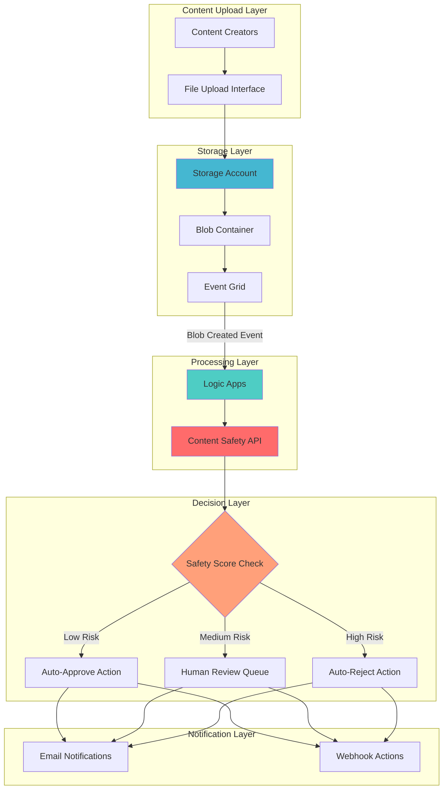

# Automated Content Moderation with Content Safety and Logic Apps

## Problem

Online platforms face increasing challenges with harmful user-generated content that can damage brand reputation, violate community guidelines, and create legal compliance issues. Manual content review is time-consuming, inconsistent, and doesn't scale with growing user bases. Organizations need automated systems that can instantly analyze uploaded content for potential safety violations while maintaining human oversight for final approval decisions.

## Solution

Build an automated content moderation workflow using Azure AI Content Safety to analyze uploaded content for harmful material, combined with Azure Logic Apps to orchestrate approval/rejection workflows. When content is uploaded to Azure Storage, the system automatically triggers content analysis and routes flagged items through appropriate review processes based on severity levels.

## Architecture Diagram



## Prerequisites

1. Azure subscription with appropriate permissions for AI Services, Logic Apps, and Storage
2. Azure CLI installed and configured (or Azure Cloud Shell access)
3. Basic understanding of event-driven architectures and content moderation concepts
4. Knowledge of JSON schema and HTTP operations
5. Estimated cost: $15-25 for testing resources (delete after completion to avoid ongoing charges)

> **Note**: Azure AI Content Safety has usage limits on the free tier. Review current pricing at [Azure AI Content Safety pricing](https://azure.microsoft.com/pricing/details/cognitive-services/content-safety/) before deployment.

## Preparation

```bash
# Set environment variables for Azure resources
export RESOURCE_GROUP="rg-content-moderation-${RANDOM_SUFFIX}"
export LOCATION="eastus"
export SUBSCRIPTION_ID=$(az account show --query id --output tsv)

# Generate unique suffix for resource names
RANDOM_SUFFIX=$(openssl rand -hex 3)

# Create resource group
az group create \
    --name ${RESOURCE_GROUP} \
    --location ${LOCATION} \
    --tags purpose=content-moderation environment=demo

echo "✅ Resource group created: ${RESOURCE_GROUP}"

# Set resource names with unique suffixes
export STORAGE_ACCOUNT="stcontentmod${RANDOM_SUFFIX}"
export CONTENT_SAFETY_NAME="cs-content-safety-${RANDOM_SUFFIX}"
export LOGIC_APP_NAME="la-content-workflow-${RANDOM_SUFFIX}"
export CONTAINER_NAME="content-uploads"
```

## Steps

1. **Create Azure AI Content Safety Resource**:

   Azure AI Content Safety provides advanced AI-powered content moderation capabilities that analyze text and images for harmful content across multiple categories (sexual, violence, hate, self-harm) with granular severity levels. This service replaces the deprecated Content Moderator and offers enhanced multilingual support and customization options for enterprise-scale content filtering.

   ```bash
   # Create Content Safety resource
   az cognitiveservices account create \
       --name ${CONTENT_SAFETY_NAME} \
       --resource-group ${RESOURCE_GROUP} \
       --location ${LOCATION} \
       --kind ContentSafety \
       --sku S0 \
       --custom-domain ${CONTENT_SAFETY_NAME} \
       --tags purpose=content-moderation

   # Get Content Safety endpoint and key
   export CONTENT_SAFETY_ENDPOINT=$(az cognitiveservices account show \
       --name ${CONTENT_SAFETY_NAME} \
       --resource-group ${RESOURCE_GROUP} \
       --query properties.endpoint \
       --output tsv)

   export CONTENT_SAFETY_KEY=$(az cognitiveservices account keys list \
       --name ${CONTENT_SAFETY_NAME} \
       --resource-group ${RESOURCE_GROUP} \
       --query key1 \
       --output tsv)

   echo "✅ Content Safety resource created with endpoint: ${CONTENT_SAFETY_ENDPOINT}"
   ```

   The Content Safety service is now configured with the Standard pricing tier, providing production-ready performance and higher request limits suitable for automated workflows.

2. **Create Storage Account for Content Uploads**:

   Azure Storage provides the foundation for event-driven content moderation by automatically generating events when new content is uploaded. The storage account configuration enables blob-level events that trigger downstream processing workflows while maintaining secure access controls and cost-effective storage tiers.

   ```bash
   # Create storage account with event grid integration
   az storage account create \
       --name ${STORAGE_ACCOUNT} \
       --resource-group ${RESOURCE_GROUP} \
       --location ${LOCATION} \
       --sku Standard_LRS \
       --kind StorageV2 \
       --access-tier Hot \
       --allow-blob-public-access false \
       --tags purpose=content-storage

   # Create container for content uploads
   az storage container create \
       --name ${CONTAINER_NAME} \
       --account-name ${STORAGE_ACCOUNT} \
       --public-access off \
       --auth-mode login

   # Get storage account connection string
   export STORAGE_CONNECTION_STRING=$(az storage account show-connection-string \
       --name ${STORAGE_ACCOUNT} \
       --resource-group ${RESOURCE_GROUP} \
       --query connectionString \
       --output tsv)

   echo "✅ Storage account created: ${STORAGE_ACCOUNT}"
   ```

   The storage account is configured with private blob access and Hot tier for immediate content processing, ensuring both security and performance for the moderation workflow.

3. **Create Logic App for Content Moderation Workflow**:

   Azure Logic Apps provides serverless workflow orchestration that automatically scales based on demand while integrating seamlessly with Azure services. The Consumption plan offers cost-effective execution for event-driven scenarios, charging only for actual workflow runs and connector operations.

   ```bash
   # Create basic workflow definition first
   cat > initial-workflow.json << 'EOF'
   {
     "$schema": "https://schema.management.azure.com/providers/Microsoft.Logic/schemas/2016-06-01/workflowdefinition.json#",
     "contentVersion": "1.0.0.0",
     "parameters": {},
     "triggers": {},
     "actions": {},
     "outputs": {}
   }
   EOF

   # Create Logic App (Consumption plan)
   az logic workflow create \
       --resource-group ${RESOURCE_GROUP} \
       --location ${LOCATION} \
       --name ${LOGIC_APP_NAME} \
       --definition @initial-workflow.json \
       --tags purpose=content-moderation-workflow

   echo "✅ Logic App created: ${LOGIC_APP_NAME}"

   # Get Logic App resource ID
   export LOGIC_APP_RESOURCE_ID=$(az logic workflow show \
       --resource-group ${RESOURCE_GROUP} \
       --name ${LOGIC_APP_NAME} \
       --query id \
       --output tsv)
   ```

   The Logic App foundation is established with the Consumption hosting model, providing automatic scaling and pay-per-execution billing suitable for event-driven content moderation scenarios.

4. **Create Storage Connection for Logic App**:

   Azure Logic Apps connectors provide pre-built integrations that abstract complex API operations into simple, configurable actions. The Azure Blob Storage connector enables seamless interaction with storage events and content retrieval without requiring custom HTTP operations or authentication handling.

   ```bash
   # Create API connection for Azure Blob Storage
   az resource create \
       --resource-group ${RESOURCE_GROUP} \
       --resource-type Microsoft.Web/connections \
       --name azureblob-connection \
       --location ${LOCATION} \
       --properties '{
         "displayName": "Azure Blob Storage Connection",
         "api": {
           "id": "/subscriptions/'${SUBSCRIPTION_ID}'/providers/Microsoft.Web/locations/'${LOCATION}'/managedApis/azureblob"
         },
         "parameterValues": {
           "connectionString": "'${STORAGE_CONNECTION_STRING}'"
         }
       }' \
       --tags purpose=logic-app-connector

   # Get connection resource ID
   export BLOB_CONNECTION_ID=$(az resource show \
       --resource-group ${RESOURCE_GROUP} \
       --resource-type Microsoft.Web/connections \
       --name azureblob-connection \
       --query id \
       --output tsv)

   echo "✅ Storage connection created for Logic App"
   ```

   The managed connection provides secure, authenticated access to Azure Blob Storage with automatic credential management and connection pooling for optimal performance.

5. **Configure Logic App Workflow Definition**:

   The workflow definition orchestrates the complete content moderation process, from receiving storage events to calling the Content Safety API and executing appropriate actions based on moderation results. This declarative approach ensures consistent processing logic and easy maintenance of business rules.

   ```bash
   # Create comprehensive workflow definition
   cat > content-moderation-workflow.json << EOF
   {
     "\$schema": "https://schema.management.azure.com/providers/Microsoft.Logic/schemas/2016-06-01/workflowdefinition.json#",
     "contentVersion": "1.0.0.0",
     "parameters": {
       "\$connections": {
         "defaultValue": {},
         "type": "Object"
       }
     },
     "triggers": {
       "When_a_blob_is_added_or_modified": {
         "recurrence": {
           "frequency": "Minute",
           "interval": 1
         },
         "splitOn": "@triggerBody()",
         "type": "ApiConnection",
         "inputs": {
           "host": {
             "connection": {
               "name": "@parameters('\$connections')['azureblob']['connectionId']"
             }
           },
           "method": "get",
           "path": "/datasets/default/triggers/batch/onupdatedfile",
           "queries": {
             "folderId": "${CONTAINER_NAME}",
             "maxFileCount": 10
           }
         }
       }
     },
     "actions": {
       "Get_blob_content": {
         "runAfter": {},
         "type": "ApiConnection",
         "inputs": {
           "host": {
             "connection": {
               "name": "@parameters('\$connections')['azureblob']['connectionId']"
             }
           },
           "method": "get",
           "path": "/datasets/default/files/@{encodeURIComponent(encodeURIComponent(triggerBody()?['Path']))}/content",
           "queries": {
             "inferContentType": true
           }
         }
       },
       "Analyze_content_with_AI": {
         "runAfter": {
           "Get_blob_content": [
             "Succeeded"
           ]
         },
         "type": "Http",
         "inputs": {
           "body": {
             "text": "@{base64ToString(body('Get_blob_content')?\$content)}",
             "outputType": "FourSeverityLevels"
           },
           "headers": {
             "Content-Type": "application/json",
             "Ocp-Apim-Subscription-Key": "${CONTENT_SAFETY_KEY}"
           },
           "method": "POST",
           "uri": "${CONTENT_SAFETY_ENDPOINT}/contentsafety/text:analyze?api-version=2024-09-01"
         }
       },
       "Process_moderation_results": {
         "runAfter": {
           "Analyze_content_with_AI": [
             "Succeeded"
           ]
         },
         "cases": {
           "Low_Risk_Auto_Approve": {
             "case": 0,
             "actions": {
               "Log_approval": {
                 "type": "Compose",
                 "inputs": {
                   "message": "Content approved automatically",
                   "file": "@triggerBody()?['Name']",
                   "timestamp": "@utcnow()",
                   "moderationResult": "@body('Analyze_content_with_AI')",
                   "decision": "approved"
                 }
               }
             }
           },
           "Medium_Risk_Needs_Review": {
             "case": 2,
             "actions": {
               "Flag_for_review": {
                 "type": "Compose",
                 "inputs": {
                   "message": "Content flagged for human review",
                   "file": "@triggerBody()?['Name']",
                   "timestamp": "@utcnow()",
                   "moderationResult": "@body('Analyze_content_with_AI')",
                   "decision": "review_needed"
                 }
               }
             }
           },
           "High_Risk_Auto_Reject": {
             "case": 4,
             "actions": {
               "Log_rejection": {
                 "type": "Compose",
                 "inputs": {
                   "message": "Content rejected automatically",
                   "file": "@triggerBody()?['Name']",
                   "timestamp": "@utcnow()",
                   "moderationResult": "@body('Analyze_content_with_AI')",
                   "decision": "rejected"
                 }
               }
             }
           }
         },
         "default": {
           "actions": {
             "Flag_for_review_high": {
               "type": "Compose",
               "inputs": {
                 "message": "Content flagged for urgent human review",
                 "file": "@triggerBody()?['Name']",
                 "timestamp": "@utcnow()",
                 "moderationResult": "@body('Analyze_content_with_AI')",
                 "decision": "urgent_review"
               }
             }
           }
         },
         "expression": "@max(body('Analyze_content_with_AI')?['categoriesAnalysis']?[0]?['severity'], body('Analyze_content_with_AI')?['categoriesAnalysis']?[1]?['severity'], body('Analyze_content_with_AI')?['categoriesAnalysis']?[2]?['severity'], body('Analyze_content_with_AI')?['categoriesAnalysis']?[3]?['severity'])",
         "type": "Switch"
       }
     }
   }
   EOF

   # Update Logic App with complete workflow and connections
   az logic workflow update \
       --resource-group ${RESOURCE_GROUP} \
       --name ${LOGIC_APP_NAME} \
       --definition @content-moderation-workflow.json \
       --connections azureblob=${BLOB_CONNECTION_ID}

   echo "✅ Logic App updated with content moderation workflow"
   ```

   The workflow now includes comprehensive content moderation logic with automatic decision-making based on Content Safety API severity scores. The workflow evaluates the maximum severity across all categories to ensure the most restrictive content is properly flagged for review.

6. **Enable Logic App and Verify Configuration**:

   Logic Apps can be enabled and disabled to control workflow execution. Once enabled, the workflow will automatically trigger when new blobs are uploaded to the configured storage container, providing real-time content moderation capabilities.

   ```bash
   # Enable the Logic App workflow
   az logic workflow update \
       --resource-group ${RESOURCE_GROUP} \
       --name ${LOGIC_APP_NAME} \
       --state Enabled

   # Verify the workflow is enabled and configured
   az logic workflow show \
       --resource-group ${RESOURCE_GROUP} \
       --name ${LOGIC_APP_NAME} \
       --query "{name:name, state:state, location:location}" \
       --output table

   echo "✅ Logic App enabled and ready for content moderation"
   ```

   The Logic App is now fully configured and enabled, ready to automatically process uploaded content through the AI-powered moderation pipeline.

## Validation & Testing

1. **Verify Content Safety Resource Deployment**:

   ```bash
   # Test Content Safety API connectivity with latest API version
   curl -X POST "${CONTENT_SAFETY_ENDPOINT}/contentsafety/text:analyze?api-version=2024-09-01" \
        -H "Ocp-Apim-Subscription-Key: ${CONTENT_SAFETY_KEY}" \
        -H "Content-Type: application/json" \
        -d '{
          "text": "This is a test message for content safety validation.",
          "outputType": "FourSeverityLevels"
        }'
   ```

   Expected output: JSON response with safety analysis results showing category scores and severity levels (0-6 range with FourSeverityLevels).

2. **Test Storage Account and Container Setup**:

   ```bash
   # Verify storage account and container
   az storage container show \
       --name ${CONTAINER_NAME} \
       --account-name ${STORAGE_ACCOUNT} \
       --auth-mode login

   # Test file upload capability
   echo "Test content for moderation workflow validation" > test-file.txt
   az storage blob upload \
       --file test-file.txt \
       --name test-upload.txt \
       --container-name ${CONTAINER_NAME} \
       --account-name ${STORAGE_ACCOUNT} \
       --auth-mode login

   echo "✅ Test file uploaded successfully"
   ```

3. **Validate Logic App Workflow Execution**:

   ```bash
   # Check Logic App run history
   az logic workflow list-runs \
       --resource-group ${RESOURCE_GROUP} \
       --name ${LOGIC_APP_NAME} \
       --top 5 \
       --query "value[].{status:status, startTime:startTime, endTime:endTime}" \
       --output table

   # Get detailed workflow status
   az logic workflow show \
       --resource-group ${RESOURCE_GROUP} \
       --name ${LOGIC_APP_NAME} \
       --query "{state:state, accessEndpoint:accessEndpoint}"
   ```

   Expected output: Workflow state should be "Enabled" and recent runs should show successful executions when files are uploaded.

4. **Test End-to-End Content Moderation Flow**:

   ```bash
   # Upload test content with varying safety levels
   echo "This is safe, family-friendly content for testing." > safe-content.txt
   echo "This content might contain language that needs review." > moderate-content.txt

   # Upload files to trigger workflow
   az storage blob upload \
       --file safe-content.txt \
       --name safe-test-$(date +%s).txt \
       --container-name ${CONTAINER_NAME} \
       --account-name ${STORAGE_ACCOUNT} \
       --auth-mode login

   az storage blob upload \
       --file moderate-content.txt \
       --name moderate-test-$(date +%s).txt \
       --container-name ${CONTAINER_NAME} \
       --account-name ${STORAGE_ACCOUNT} \
       --auth-mode login

   echo "✅ Test content uploaded - check Logic App runs for processing results"

   # Wait for processing and check results
   sleep 60
   az logic workflow list-runs \
       --resource-group ${RESOURCE_GROUP} \
       --name ${LOGIC_APP_NAME} \
       --top 3 \
       --query "value[].{status:status, startTime:startTime}" \
       --output table
   ```

## Cleanup

1. **Remove test files and storage container**:

   ```bash
   # Delete test files
   rm -f test-file.txt safe-content.txt moderate-content.txt \
         initial-workflow.json content-moderation-workflow.json

   # Delete storage container and blobs
   az storage container delete \
       --name ${CONTAINER_NAME} \
       --account-name ${STORAGE_ACCOUNT} \
       --auth-mode login

   echo "✅ Test files and container deleted"
   ```

2. **Delete Azure resources**:

   ```bash
   # Delete resource group and all contained resources
   az group delete \
       --name ${RESOURCE_GROUP} \
       --yes \
       --no-wait

   echo "✅ Resource group deletion initiated: ${RESOURCE_GROUP}"
   echo "Note: Deletion may take several minutes to complete"

   # Verify deletion (optional)
   az group exists --name ${RESOURCE_GROUP}
   ```

3. **Clean up environment variables**:

   ```bash
   # Unset environment variables
   unset RESOURCE_GROUP LOCATION STORAGE_ACCOUNT CONTENT_SAFETY_NAME
   unset LOGIC_APP_NAME CONTAINER_NAME CONTENT_SAFETY_ENDPOINT
   unset CONTENT_SAFETY_KEY STORAGE_CONNECTION_STRING BLOB_CONNECTION_ID
   unset LOGIC_APP_RESOURCE_ID SUBSCRIPTION_ID RANDOM_SUFFIX

   echo "✅ Environment variables cleared"
   ```

## Discussion

This automated content moderation solution demonstrates the power of combining Azure AI services with workflow orchestration to create scalable, intelligent content filtering systems. The architecture leverages Azure AI Content Safety's advanced machine learning models that analyze content across multiple harm categories with granular severity levels, providing much more nuanced decision-making than traditional binary filtering approaches.

The event-driven design pattern implemented through Azure Storage and Logic Apps creates a responsive system that processes content immediately upon upload, ensuring minimal delay between content submission and moderation decisions. This approach is particularly valuable for high-volume platforms where manual review would create bottlenecks and poor user experiences. The Logic Apps workflow engine provides built-in retry mechanisms, error handling, and monitoring capabilities that ensure reliable processing even under heavy loads.

Azure AI Content Safety's multilingual capabilities and custom category support make this solution adaptable to diverse global audiences and specific industry requirements. Organizations can fine-tune the moderation thresholds, create custom blocklists, and implement industry-specific content policies without rebuilding the core infrastructure. The updated 2024-09-01 API version provides enhanced accuracy and performance improvements, with support for both four-level and eight-level severity scoring systems for more granular content classification.

The serverless architecture offers significant cost advantages by scaling automatically based on content volume and only charging for actual processing. This makes the solution viable for both startup platforms with unpredictable traffic and enterprise applications with steady high-volume needs. The separation of concerns between content analysis, workflow orchestration, and decision logic enables teams to modify business rules without affecting the underlying technical implementation, supporting agile development and rapid policy adjustments.

> **Tip**: Use Azure Monitor and Application Insights to track workflow performance metrics and Content Safety API response times. This data helps optimize moderation thresholds and identify potential bottlenecks in your content pipeline.

**Documentation Sources**:
- [Azure AI Content Safety Overview](https://docs.microsoft.com/en-us/azure/ai-services/content-safety/overview)
- [Azure Logic Apps Workflow Definition Language](https://docs.microsoft.com/en-us/azure/logic-apps/logic-apps-workflow-definition-language)
- [Azure Storage Event Grid Integration](https://docs.microsoft.com/en-us/azure/storage/blobs/storage-blob-event-overview)
- [Azure Well-Architected Framework Security Pillar](https://docs.microsoft.com/en-us/azure/well-architected/security/)
- [Content Safety API Reference 2024-09-01](https://docs.microsoft.com/en-us/rest/api/contentsafety/)

## Challenge

Extend this automated content moderation solution with these advanced capabilities:

1. **Multi-Modal Content Analysis**: Integrate image and video moderation capabilities by adding Azure Computer Vision and Video Indexer services to analyze visual content alongside text, creating comprehensive media moderation pipelines that handle both textual and visual content in a unified workflow.

2. **Machine Learning Feedback Loop**: Implement Azure Machine Learning to train custom models based on human reviewer decisions, continuously improving moderation accuracy and reducing false positives through reinforcement learning techniques that adapt to your specific content policies and user behaviors.

3. **Real-Time Dashboard and Analytics**: Build a Power BI dashboard that visualizes moderation metrics, content trends, and policy effectiveness, enabling data-driven decisions about content policies and threshold adjustments while providing insights into content patterns and moderation performance.

4. **Advanced Workflow Orchestration**: Create sophisticated approval workflows using Azure Logic Apps' advanced features like parallel processing, human-in-the-loop approvals, and escalation policies for different content categories and risk levels, including integration with Microsoft Teams or Slack for reviewer notifications.

5. **Global Compliance Integration**: Extend the system to support region-specific content policies and regulatory requirements by implementing geo-routing and localized moderation rules that automatically adapt to different jurisdictions, ensuring compliance with local laws and cultural sensitivities.

## Infrastructure Code

### Available Infrastructure as Code:

- [Infrastructure Code Overview](code/README.md) - Detailed description of all infrastructure components
- [Bicep](code/bicep/) - Azure Bicep templates
- [Bash CLI Scripts](code/scripts/) - Example bash scripts using Azure CLI commands to deploy infrastructure
- [Terraform](code/terraform/) - Terraform configuration files