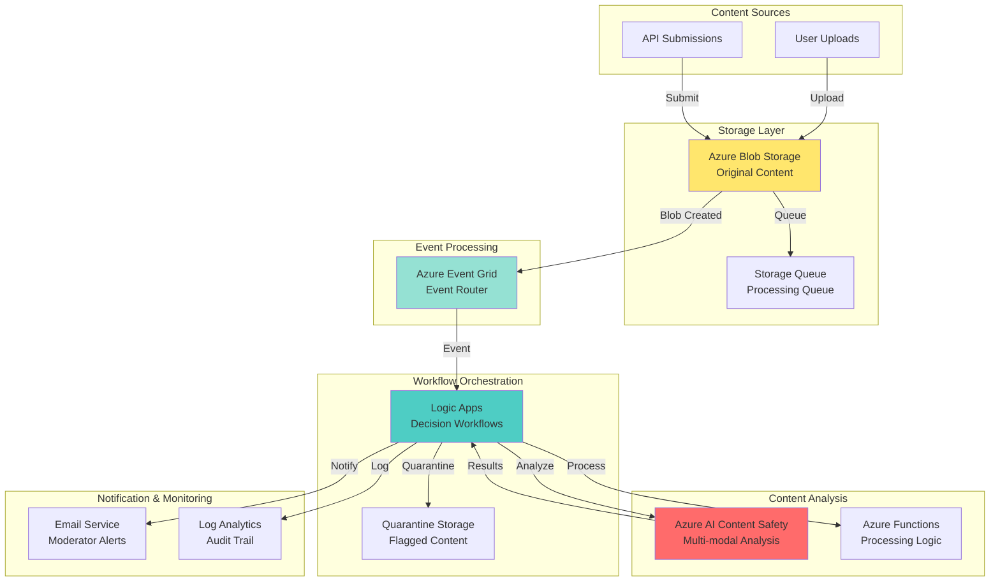

# Automated Content Safety Moderation with Logic Apps

## Problem

Organizations managing user-generated content face increasing challenges in maintaining safe online environments. Manual content moderation is time-consuming, inconsistent, and fails to scale with growing volumes of text, images, and videos. Without automated safety measures, platforms risk exposing users to harmful content, face regulatory compliance issues, and damage brand reputation through inappropriate material spreading unchecked.

## Solution

Deploy an automated content moderation system using Azure AI Content Safety to analyze uploaded content across multiple modalities, integrated with Azure Logic Apps to orchestrate intelligent workflows. This serverless architecture automatically detects harmful content, triggers appropriate actions based on severity levels, notifies human moderators for edge cases, and quarantines suspicious files while maintaining audit trails for compliance reporting.

## Architecture Diagram



## Prerequisites

1. Azure subscription with appropriate permissions to create resources
2. Azure CLI v2.50.0 or later installed and configured (or use Azure CloudShell)
3. Basic understanding of content moderation concepts and workflow automation
4. Familiarity with REST APIs and JSON data formats
5. Estimated cost: $50-100/month for moderate usage (varies by content volume)

> **Note**: Azure AI Content Safety requires approval for production use. Apply for access through the Azure portal before deploying to production environments.

## Preparation

```bash
# Set environment variables
export RESOURCE_GROUP="rg-content-moderation-${RANDOM_SUFFIX}"
export LOCATION="eastus"
export RANDOM_SUFFIX=$(openssl rand -hex 3)
export STORAGE_ACCOUNT="stcontentmod${RANDOM_SUFFIX}"
export AI_SERVICES_NAME="ai-content-safety-${RANDOM_SUFFIX}"
export LOGIC_APP_NAME="logic-content-mod-${RANDOM_SUFFIX}"
export EVENT_GRID_TOPIC="eg-content-${RANDOM_SUFFIX}"

# Create resource group
az group create \
    --name ${RESOURCE_GROUP} \
    --location ${LOCATION} \
    --tags purpose=content-moderation environment=demo

# Create storage account for content
az storage account create \
    --name ${STORAGE_ACCOUNT} \
    --resource-group ${RESOURCE_GROUP} \
    --location ${LOCATION} \
    --sku Standard_LRS \
    --kind StorageV2 \
    --enable-hierarchical-namespace false

# Get storage connection string
export STORAGE_CONNECTION=$(az storage account \
    show-connection-string \
    --name ${STORAGE_ACCOUNT} \
    --resource-group ${RESOURCE_GROUP} \
    --query connectionString -o tsv)

echo "✅ Foundation resources created successfully"
```

## Steps

1. **Create Azure AI Content Safety Service**:

   Azure AI Content Safety provides state-of-the-art AI models to detect harmful content across text, images, and other modalities. The service analyzes content for multiple harm categories including violence, hate speech, sexual content, and self-harm with configurable severity thresholds. This managed service eliminates the need to build and maintain your own content moderation models while providing enterprise-grade accuracy and compliance features.

   ```bash
   # Create Azure AI Services account with Content Safety
   az cognitiveservices account create \
       --name ${AI_SERVICES_NAME} \
       --resource-group ${RESOURCE_GROUP} \
       --location ${LOCATION} \
       --kind AIServices \
       --sku S0 \
       --yes
   
   # Get the endpoint and key
   export AI_ENDPOINT=$(az cognitiveservices account show \
       --name ${AI_SERVICES_NAME} \
       --resource-group ${RESOURCE_GROUP} \
       --query properties.endpoint -o tsv)
   
   export AI_KEY=$(az cognitiveservices account keys list \
       --name ${AI_SERVICES_NAME} \
       --resource-group ${RESOURCE_GROUP} \
       --query key1 -o tsv)
   
   echo "✅ AI Content Safety service created"
   echo "Endpoint: ${AI_ENDPOINT}"
   ```

   The Content Safety service is now ready to analyze content through its REST API. This foundation enables real-time content analysis with millisecond response times, supporting high-volume content moderation scenarios while maintaining consistent safety standards across your platform.

2. **Configure Storage Containers for Content Management**:

   Structured storage organization is critical for content moderation workflows. By separating content into different containers based on moderation status, you create clear data governance boundaries and simplify access control. The container structure supports audit requirements by maintaining original content separately from quarantined items, enabling forensic analysis and compliance reporting.

   ```bash
   # Create containers for different content states
   az storage container create \
       --name uploads \
       --connection-string "${STORAGE_CONNECTION}" \
       --public-access off
   
   az storage container create \
       --name quarantine \
       --connection-string "${STORAGE_CONNECTION}" \
       --public-access off
   
   az storage container create \
       --name approved \
       --connection-string "${STORAGE_CONNECTION}" \
       --public-access off
   
   # Create a queue for processing
   az storage queue create \
       --name content-processing \
       --connection-string "${STORAGE_CONNECTION}"
   
   echo "✅ Storage containers configured"
   ```

3. **Deploy Event Grid Topic for Event Routing**:

   Azure Event Grid acts as the central nervous system for your content moderation pipeline, providing reliable event delivery with built-in retry logic and dead-letter handling. This serverless event router ensures that no content upload goes unprocessed, even during system failures or high load periods. Event Grid's push model eliminates polling overhead and enables real-time content processing triggers.

   ```bash
   # Create Event Grid topic
   az eventgrid topic create \
       --name ${EVENT_GRID_TOPIC} \
       --resource-group ${RESOURCE_GROUP} \
       --location ${LOCATION}
   
   # Get Event Grid endpoint and key
   export EVENT_GRID_ENDPOINT=$(az eventgrid topic show \
       --name ${EVENT_GRID_TOPIC} \
       --resource-group ${RESOURCE_GROUP} \
       --query endpoint -o tsv)
   
   export EVENT_GRID_KEY=$(az eventgrid topic key list \
       --name ${EVENT_GRID_TOPIC} \
       --resource-group ${RESOURCE_GROUP} \
       --query key1 -o tsv)
   
   echo "✅ Event Grid topic deployed"
   ```

4. **Create Logic App for Workflow Orchestration**:

   Logic Apps provides the visual workflow orchestration layer that connects all components of your content moderation system. This low-code platform enables business logic implementation without extensive programming, making it easy to adjust moderation rules and add new integration points. The consumption-based pricing model ensures cost efficiency by charging only for actual workflow executions.

   ```bash
   # Create Logic App
   az logic workflow create \
       --name ${LOGIC_APP_NAME} \
       --resource-group ${RESOURCE_GROUP} \
       --location ${LOCATION} \
       --definition '{
           "definition": {
               "$schema": "https://schema.management.azure.com/providers/Microsoft.Logic/schemas/2016-06-01/workflowdefinition.json#",
               "contentVersion": "1.0.0.0",
               "triggers": {},
               "actions": {},
               "outputs": {}
           }
       }'
   
   # Get Logic App ID for Event Grid subscription
   export LOGIC_APP_ID=$(az logic workflow show \
       --name ${LOGIC_APP_NAME} \
       --resource-group ${RESOURCE_GROUP} \
       --query id -o tsv)
   
   echo "✅ Logic App created and ready for configuration"
   ```

5. **Configure Event Grid Subscription for Blob Storage**:

   Creating an event subscription establishes the critical link between content uploads and your moderation workflow. This configuration ensures that every file uploaded to your storage account automatically triggers the content moderation process. The filtering capabilities allow you to process only specific file types or containers, optimizing resource usage and processing costs.

   ```bash
   # Create Event Grid subscription for blob events
   az eventgrid event-subscription create \
       --name content-upload-subscription \
       --source-resource-id "/subscriptions/$(az account show \
           --query id -o tsv)/resourceGroups/${RESOURCE_GROUP}/providers/Microsoft.Storage/storageAccounts/${STORAGE_ACCOUNT}" \
       --endpoint-type webhook \
       --endpoint "${EVENT_GRID_ENDPOINT}" \
       --included-event-types Microsoft.Storage.BlobCreated \
       --subject-begins-with /blobServices/default/containers/uploads/
   
   echo "✅ Event Grid subscription configured"
   ```

6. **Implement Content Analysis Logic App Workflow**:

   The Logic App workflow represents the brain of your content moderation system, implementing decision logic based on AI analysis results. This workflow demonstrates how to chain multiple actions together, from content analysis to automated responses. The visual designer makes it easy to understand and modify the workflow logic, enabling rapid iteration based on moderation policy changes.

   ```bash
   # Update Logic App with content moderation workflow
   WORKFLOW_DEFINITION='{
       "definition": {
           "$schema": "https://schema.management.azure.com/providers/Microsoft.Logic/schemas/2016-06-01/workflowdefinition.json#",
           "contentVersion": "1.0.0.0",
           "triggers": {
               "When_a_blob_is_added": {
                   "type": "ApiConnection",
                   "inputs": {
                       "host": {
                           "connection": {
                               "name": "@parameters('"'"'$connections'"'"')['"'"'azureblob'"'"']['"'"'connectionId'"'"']"
                           }
                       },
                       "method": "get",
                       "path": "/v2/datasets/@{encodeURIComponent(encodeURIComponent('"'"'${STORAGE_ACCOUNT}'"'"'))}/triggers/batch/onupdatedfile",
                       "queries": {
                           "folderId": "/uploads",
                           "maxFileCount": 1
                       }
                   },
                   "recurrence": {
                       "frequency": "Minute",
                       "interval": 1
                   }
               }
           },
           "actions": {
               "Analyze_Content": {
                   "type": "Http",
                   "inputs": {
                       "method": "POST",
                       "uri": "${AI_ENDPOINT}contentsafety/text:analyze?api-version=2024-09-01",
                       "headers": {
                           "Ocp-Apim-Subscription-Key": "${AI_KEY}",
                           "Content-Type": "application/json"
                       },
                       "body": {
                           "text": "@{triggerBody()?['"'"'content'"'"']}",
                           "categories": ["Hate", "Violence", "Sexual", "SelfHarm"],
                           "outputType": "FourSeverityLevels"
                       }
                   }
               }
           }
       }
   }'
   
   # Update the Logic App workflow
   az logic workflow update \
       --name ${LOGIC_APP_NAME} \
       --resource-group ${RESOURCE_GROUP} \
       --definition "${WORKFLOW_DEFINITION}"
   
   echo "✅ Content moderation workflow implemented"
   ```

   The workflow now automatically triggers when new content is uploaded, analyzes it using Azure AI Content Safety, and prepares for decision-making based on the analysis results. This serverless approach scales automatically with your content volume while maintaining consistent moderation standards.

7. **Add Quarantine and Notification Actions**:

   Implementing automated quarantine and notification ensures rapid response to harmful content while keeping human moderators informed. This dual approach combines the speed of automation with human judgment for edge cases. The quarantine mechanism prevents harmful content from being publicly accessible while preserving it for review and potential evidence in compliance scenarios.

   ```bash
   # Create an Azure Function for content processing
   az functionapp create \
       --name func-content-${RANDOM_SUFFIX} \
       --resource-group ${RESOURCE_GROUP} \
       --storage-account ${STORAGE_ACCOUNT} \
       --consumption-plan-location ${LOCATION} \
       --runtime python \
       --functions-version 4 \
       --os-type Linux
   
   # Configure application settings
   az functionapp config appsettings set \
       --name func-content-${RANDOM_SUFFIX} \
       --resource-group ${RESOURCE_GROUP} \
       --settings "AI_ENDPOINT=${AI_ENDPOINT}" \
       "AI_KEY=${AI_KEY}" \
       "STORAGE_CONNECTION=${STORAGE_CONNECTION}"
   
   echo "✅ Processing function configured"
   ```

8. **Set Up Monitoring and Logging**:

   Comprehensive monitoring and logging are essential for maintaining content moderation system health and compliance. Azure Monitor provides real-time insights into system performance, content analysis patterns, and potential issues. The centralized logging approach enables security teams to track all moderation decisions, supporting audit requirements and helping identify emerging content threats.

   ```bash
   # Create Log Analytics workspace
   az monitor log-analytics workspace create \
       --name law-content-${RANDOM_SUFFIX} \
       --resource-group ${RESOURCE_GROUP} \
       --location ${LOCATION}
   
   # Get workspace ID
   WORKSPACE_ID=$(az monitor log-analytics workspace show \
       --name law-content-${RANDOM_SUFFIX} \
       --resource-group ${RESOURCE_GROUP} \
       --query id -o tsv)
   
   # Enable diagnostics for Logic App
   az monitor diagnostic-settings create \
       --name logic-app-diagnostics \
       --resource ${LOGIC_APP_ID} \
       --workspace ${WORKSPACE_ID} \
       --logs '[{"category": "WorkflowRuntime", "enabled": true}]' \
       --metrics '[{"category": "AllMetrics", "enabled": true}]'
   
   echo "✅ Monitoring and logging configured"
   ```

## Validation & Testing

1. Verify AI Content Safety service is operational:

   ```bash
   # Test the Content Safety API
   curl -X POST "${AI_ENDPOINT}contentsafety/text:analyze?api-version=2024-09-01" \
       -H "Ocp-Apim-Subscription-Key: ${AI_KEY}" \
       -H "Content-Type: application/json" \
       -d '{
           "text": "This is a test message for content moderation.",
           "categories": ["Hate", "Violence", "Sexual", "SelfHarm"],
           "outputType": "FourSeverityLevels"
       }'
   ```

   Expected output: JSON response with severity scores for each category (all should be 0 for safe content)

2. Test file upload and event triggering:

   ```bash
   # Create a test file
   echo "This is test content for moderation" > test-content.txt
   
   # Upload to storage
   az storage blob upload \
       --container-name uploads \
       --file test-content.txt \
       --name test-content.txt \
       --connection-string "${STORAGE_CONNECTION}"
   
   # Check Logic App runs
   az logic workflow run list \
       --name ${LOGIC_APP_NAME} \
       --resource-group ${RESOURCE_GROUP} \
       --query "[0].{status:status, startTime:startTime}" \
       -o table
   ```

3. Verify monitoring data collection:

   ```bash
   # Query Log Analytics for workflow runs
   az monitor log-analytics query \
       --workspace ${WORKSPACE_ID} \
       --analytics-query "AzureDiagnostics | where ResourceType == 'WORKFLOWS' | take 10" \
       --query "tables[0].rows" \
       -o table
   ```

## Cleanup

1. Remove the resource group and all resources:

   ```bash
   # Delete resource group
   az group delete \
       --name ${RESOURCE_GROUP} \
       --yes \
       --no-wait
   
   echo "✅ Resource group deletion initiated"
   echo "Note: Complete deletion may take 5-10 minutes"
   ```

2. Verify deletion status:

   ```bash
   # Check if resource group still exists
   az group exists --name ${RESOURCE_GROUP}
   ```

3. Clear environment variables:

   ```bash
   unset RESOURCE_GROUP LOCATION RANDOM_SUFFIX STORAGE_ACCOUNT
   unset AI_SERVICES_NAME LOGIC_APP_NAME EVENT_GRID_TOPIC
   unset STORAGE_CONNECTION AI_ENDPOINT AI_KEY EVENT_GRID_ENDPOINT
   unset EVENT_GRID_KEY LOGIC_APP_ID WORKSPACE_ID
   
   echo "✅ Environment variables cleared"
   ```

## Discussion

Azure AI Content Safety and Logic Apps create a powerful combination for automated content moderation that scales with your platform's growth. This architecture demonstrates how AI services can be seamlessly integrated into business workflows without extensive custom development. The serverless approach ensures you only pay for actual content processing while maintaining enterprise-grade reliability. For detailed implementation guidance, refer to the [Azure AI Content Safety documentation](https://learn.microsoft.com/en-us/azure/ai-services/content-safety/overview) and [Logic Apps best practices](https://learn.microsoft.com/en-us/azure/logic-apps/logic-apps-workflow-best-practices).

The event-driven architecture provides natural decoupling between content ingestion and processing, allowing independent scaling of each component. Event Grid's reliable delivery guarantees ensure no content goes unmoderated, while Logic Apps' visual workflow designer enables rapid policy updates without code changes. This flexibility is crucial for adapting to evolving content threats and regulatory requirements. The [Azure Well-Architected Framework](https://learn.microsoft.com/en-us/azure/architecture/framework/) principles guide this design for reliability and security.

From a compliance perspective, the solution maintains complete audit trails of all moderation decisions, supporting regulatory requirements across different jurisdictions. The quarantine mechanism ensures potentially harmful content is isolated but preserved for legal purposes. Integration with Azure Monitor provides real-time insights into moderation patterns and system health. For comprehensive monitoring strategies, review the [Azure Monitor documentation](https://learn.microsoft.com/en-us/azure/azure-monitor/overview) and [content moderation best practices](https://learn.microsoft.com/en-us/azure/ai-services/content-safety/overview).

> **Tip**: Implement custom blocklists in Azure AI Content Safety to catch platform-specific harmful content that generic models might miss. Use Logic Apps' conditional logic to route content to specialized human review queues based on confidence scores.

## Challenge

Extend this solution by implementing these enhancements:

1. Add multi-modal content analysis supporting images and videos using Azure AI Content Safety's image analysis APIs and Video Indexer integration
2. Implement severity-based routing with different Logic App workflows for low, medium, and high-risk content requiring varying response times
3. Create a Power BI dashboard connected to Log Analytics for real-time moderation metrics and trending harmful content patterns
4. Build an approval workflow using Logic Apps and Microsoft Teams integration for human moderator review of borderline content
5. Implement content hashing with Azure SQL Database to prevent re-upload of previously banned content and reduce processing costs

## Infrastructure Code

### Available Infrastructure as Code:

- [Infrastructure Code Overview](code/README.md) - Detailed description of all infrastructure components
- [Bicep](code/bicep/) - Azure Bicep templates
- [Bash CLI Scripts](code/scripts/) - Example bash scripts using Azure CLI commands to deploy infrastructure
- [Terraform](code/terraform/) - Terraform configuration files