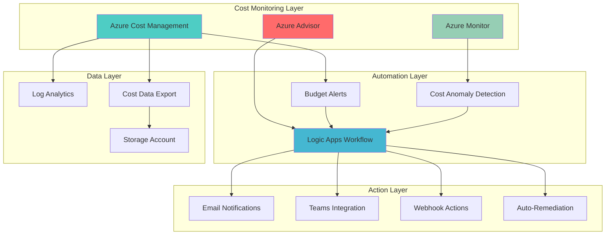

# Automated Cost Optimization with Intelligent Monitoring

## Problem

Organizations struggle with unpredictable Azure spending, lack of visibility into cost optimization opportunities, and reactive responses to budget overruns. Manual cost monitoring leads to delayed actions, missed optimization opportunities, and unexpected billing surprises that can impact business operations and profitability.

## Solution

Build an automated cost optimization system that continuously monitors Azure spending patterns, implements Azure Advisor recommendations, and provides intelligent alerts for cost anomalies. This proactive approach combines Azure Cost Management's budgeting capabilities with Azure Advisor's optimization insights and Logic Apps automation for immediate cost control actions.

## Architecture Diagram



## Prerequisites

1. Azure subscription with Contributor or Cost Management Contributor permissions
2. Azure CLI v2.40.0 or later installed and configured
3. Basic understanding of Azure Cost Management and budgeting concepts
4. Logic Apps Standard tier for advanced automation capabilities
5. Estimated cost: $10-30 per month for monitoring and automation resources

> **Note**: This recipe requires access to Azure Cost Management APIs and the ability to create budgets at the subscription level. Ensure you have appropriate permissions before proceeding.

## Preparation

```bash
# Set environment variables for the cost optimization solution
export RESOURCE_GROUP="rg-cost-optimization-${RANDOM_SUFFIX}"
export LOCATION="eastus"
export SUBSCRIPTION_ID=$(az account show --query id --output tsv)
export TENANT_ID=$(az account show --query tenantId --output tsv)

# Generate unique suffix for resource names
RANDOM_SUFFIX=$(openssl rand -hex 3)

# Set resource names with unique suffixes
export STORAGE_ACCOUNT="stcostopt${RANDOM_SUFFIX}"
export LOGIC_APP_NAME="la-cost-optimization-${RANDOM_SUFFIX}"
export LOG_ANALYTICS_WORKSPACE="law-cost-optimization-${RANDOM_SUFFIX}"
export BUDGET_NAME="budget-optimization-${RANDOM_SUFFIX}"

# Create resource group for cost optimization resources
az group create \
    --name ${RESOURCE_GROUP} \
    --location ${LOCATION} \
    --tags purpose=cost-optimization environment=production

echo "✅ Resource group created: ${RESOURCE_GROUP}"

# Create Log Analytics workspace for cost monitoring
az monitor log-analytics workspace create \
    --resource-group ${RESOURCE_GROUP} \
    --workspace-name ${LOG_ANALYTICS_WORKSPACE} \
    --location ${LOCATION} \
    --sku PerGB2018

echo "✅ Log Analytics workspace created for cost monitoring"
```

## Steps

1. **Create Storage Account for Cost Data Export**:

   Azure Storage provides the foundation for automated cost data analysis and historical trend tracking. Configuring a storage account with proper lifecycle management enables cost-effective long-term storage of cost data exports while maintaining accessibility for analysis workflows.

   ```bash
   # Create storage account for cost data exports
   az storage account create \
       --name ${STORAGE_ACCOUNT} \
       --resource-group ${RESOURCE_GROUP} \
       --location ${LOCATION} \
       --sku Standard_LRS \
       --kind StorageV2 \
       --access-tier Hot \
       --tags purpose=cost-data-export

   # Get storage account connection string
   STORAGE_CONNECTION_STRING=$(az storage account show-connection-string \
       --name ${STORAGE_ACCOUNT} \
       --resource-group ${RESOURCE_GROUP} \
       --query connectionString \
       --output tsv)

   # Create container for cost exports
   az storage container create \
       --name cost-exports \
       --connection-string "${STORAGE_CONNECTION_STRING}" \
       --public-access off

   echo "✅ Storage account configured for cost data exports"
   ```

   The storage account now provides secure, scalable storage for cost data exports with proper access controls. This foundation enables automated cost analysis and historical trend tracking essential for proactive cost optimization.

2. **Configure Azure Cost Management Budget with Automation**:

   Azure Cost Management budgets provide proactive spending control through automated alerts and actions when costs approach defined thresholds. Creating budgets with Action Groups enables immediate response to cost anomalies through Logic Apps integration.

   ```bash
   # Get current date for budget period
   START_DATE=$(date -u -d "$(date +%Y-%m-01)" +%Y-%m-%dT%H:%M:%S.%3NZ)
   END_DATE=$(date -u -d "$(date +%Y-%m-01) +1 month -1 day" +%Y-%m-%dT%H:%M:%S.%3NZ)

   # Create budget with 80% and 100% thresholds
   az consumption budget create \
       --budget-name ${BUDGET_NAME} \
       --amount 1000 \
       --category Cost \
       --start-date ${START_DATE} \
       --end-date ${END_DATE} \
       --time-grain Monthly \
       --time-period start-date=${START_DATE} end-date=${END_DATE}

   # Get budget resource ID for webhook configuration
   BUDGET_ID=$(az consumption budget show \
       --budget-name ${BUDGET_NAME} \
       --query id \
       --output tsv)

   echo "✅ Budget created with automated alert thresholds"
   ```

   The budget configuration establishes spending thresholds that trigger automated responses when costs exceed defined limits. This proactive approach prevents budget overruns through early warning systems and automated remediation actions.

3. **Create Logic Apps Workflow for Cost Optimization Automation**:

   Azure Logic Apps provides serverless workflow automation that responds to cost alerts and implements optimization actions. This workflow orchestrates the entire cost optimization process from alert detection to remediation implementation.

   ```bash
   # Create Logic Apps Standard resource
   az logicapp create \
       --resource-group ${RESOURCE_GROUP} \
       --name ${LOGIC_APP_NAME} \
       --storage-account ${STORAGE_ACCOUNT} \
       --location ${LOCATION} \
       --sku Standard \
       --tags purpose=cost-optimization-automation

   # Get Logic Apps resource ID
   LOGIC_APP_ID=$(az logicapp show \
       --resource-group ${RESOURCE_GROUP} \
       --name ${LOGIC_APP_NAME} \
       --query id \
       --output tsv)

   echo "✅ Logic Apps workflow created for cost optimization"
   ```

   The Logic Apps workflow now provides the automation engine for cost optimization processes. This serverless approach ensures scalable, reliable execution of optimization actions while maintaining cost efficiency through consumption-based pricing.

4. **Configure Azure Advisor Cost Recommendations Integration**:

   Azure Advisor continuously analyzes resource usage patterns and provides personalized cost optimization recommendations. Integrating these recommendations into automated workflows ensures consistent application of best practices and immediate action on optimization opportunities.

   ```bash
   # Create service principal for Azure Advisor API access
   SP_DETAILS=$(az ad sp create-for-rbac \
       --name "sp-cost-optimization-${RANDOM_SUFFIX}" \
       --role "Cost Management Reader" \
       --scopes "/subscriptions/${SUBSCRIPTION_ID}")

   # Extract service principal details
   SP_APP_ID=$(echo ${SP_DETAILS} | jq -r '.appId')
   SP_PASSWORD=$(echo ${SP_DETAILS} | jq -r '.password')

   # Configure Logic Apps application settings for API access
   az logicapp config appsettings set \
       --name ${LOGIC_APP_NAME} \
       --resource-group ${RESOURCE_GROUP} \
       --settings \
       "AZURE_CLIENT_ID=${SP_APP_ID}" \
       "AZURE_CLIENT_SECRET=${SP_PASSWORD}" \
       "AZURE_TENANT_ID=${TENANT_ID}" \
       "AZURE_SUBSCRIPTION_ID=${SUBSCRIPTION_ID}"

   echo "✅ Azure Advisor integration configured with proper permissions"
   ```

   The service principal configuration enables secure, programmatic access to Azure Advisor recommendations and Cost Management APIs. This authentication mechanism ensures reliable automation while maintaining proper security controls and access limitations.

5. **Set Up Cost Anomaly Detection with Azure Monitor**:

   Azure Monitor provides advanced analytics capabilities for detecting unusual spending patterns and cost anomalies. Configuring custom metrics and alerts enables proactive identification of cost optimization opportunities and spending irregularities.

   ```bash
   # Create custom metric for cost anomaly detection
   az monitor metrics alert create \
       --name "cost-anomaly-alert-${RANDOM_SUFFIX}" \
       --resource-group ${RESOURCE_GROUP} \
       --scopes "/subscriptions/${SUBSCRIPTION_ID}" \
       --condition "avg Microsoft.Consumption/budgets/ActualCost > 800" \
       --window-size 1h \
       --evaluation-frequency 1h \
       --severity 2 \
       --description "Alert when cost exceeds 80% of monthly budget"

   # Get Log Analytics workspace ID
   WORKSPACE_ID=$(az monitor log-analytics workspace show \
       --resource-group ${RESOURCE_GROUP} \
       --workspace-name ${LOG_ANALYTICS_WORKSPACE} \
       --query customerId \
       --output tsv)

   echo "✅ Cost anomaly detection configured with Azure Monitor"
   ```

   The anomaly detection system now monitors spending patterns and identifies deviations from normal usage. This intelligent monitoring enables rapid response to cost spikes and proactive optimization of resource utilization.

6. **Create Automated Cost Data Export**:

   Regular cost data exports provide the foundation for trend analysis, forecasting, and detailed cost optimization insights. Automated exports ensure consistent data availability for analysis while reducing manual overhead.

   ```bash
   # Create cost data export for daily analysis
   az consumption export create \
       --export-name "daily-cost-export-${RANDOM_SUFFIX}" \
       --type ActualCost \
       --dataset-granularity Daily \
       --dataset-start-date $(date -u -d "30 days ago" +%Y-%m-%d) \
       --dataset-end-date $(date -u +%Y-%m-%d) \
       --storage-account-id "/subscriptions/${SUBSCRIPTION_ID}/resourceGroups/${RESOURCE_GROUP}/providers/Microsoft.Storage/storageAccounts/${STORAGE_ACCOUNT}" \
       --storage-container cost-exports \
       --storage-root-folder-path exports/daily \
       --recurrence-type Daily \
       --recurrence-start-date $(date -u +%Y-%m-%d)

   echo "✅ Automated cost data export configured for daily analysis"
   ```

   The export configuration ensures consistent availability of cost data for analysis and trend identification. This automated approach enables comprehensive cost optimization insights while maintaining data freshness for accurate decision-making.

7. **Configure Teams Integration for Cost Alerts**:

   Microsoft Teams integration provides immediate visibility into cost optimization activities and alerts for stakeholders. This communication channel ensures rapid response to cost issues and collaborative optimization efforts.

   ```bash
   # Create Teams webhook connector (replace with actual webhook URL)
   TEAMS_WEBHOOK_URL="https://outlook.office.com/webhook/YOUR_WEBHOOK_URL"

   # Configure Teams integration in Logic Apps
   az logicapp config appsettings set \
       --name ${LOGIC_APP_NAME} \
       --resource-group ${RESOURCE_GROUP} \
       --settings "TEAMS_WEBHOOK_URL=${TEAMS_WEBHOOK_URL}"

   # Create Action Group for budget alerts
   az monitor action-group create \
       --name "cost-optimization-alerts-${RANDOM_SUFFIX}" \
       --resource-group ${RESOURCE_GROUP} \
       --short-name "CostOpt" \
       --action logic-app "Cost Optimization Workflow" \
       "${LOGIC_APP_ID}" \
       --tags purpose=cost-optimization-alerts

   echo "✅ Teams integration configured for cost optimization alerts"
   ```

   The Teams integration enables real-time communication about cost optimization activities and ensures stakeholder awareness of spending patterns and optimization opportunities.

8. **Deploy Cost Optimization Workflow Logic**:

   The Logic Apps workflow orchestrates the entire cost optimization process, from receiving alerts to implementing remediation actions. This comprehensive automation ensures consistent application of optimization strategies.

   ```bash
   # Create workflow definition directory
   mkdir -p workflow-definition

   # Create the main workflow definition
   cat > workflow-definition/workflow.json << 'EOF'
   {
     "definition": {
       "$schema": "https://schema.management.azure.com/providers/Microsoft.Logic/schemas/2016-06-01/workflowdefinition.json#",
       "actions": {
         "GetAdvisorRecommendations": {
           "type": "Http",
           "inputs": {
             "method": "GET",
             "uri": "https://management.azure.com/subscriptions/@{variables('subscriptionId')}/providers/Microsoft.Advisor/recommendations?api-version=2020-01-01&$filter=category eq 'Cost'",
             "authentication": {
               "type": "ActiveDirectoryOAuth",
               "tenant": "@{appsetting('AZURE_TENANT_ID')}",
               "audience": "https://management.azure.com/",
               "clientId": "@{appsetting('AZURE_CLIENT_ID')}",
               "secret": "@{appsetting('AZURE_CLIENT_SECRET')}"
             }
           }
         },
         "ProcessRecommendations": {
           "type": "ForEach",
           "foreach": "@body('GetAdvisorRecommendations')?['value']",
           "actions": {
             "SendTeamsNotification": {
               "type": "Http",
               "inputs": {
                 "method": "POST",
                 "uri": "@appsetting('TEAMS_WEBHOOK_URL')",
                 "body": {
                   "text": "Cost Optimization Alert: @{items('ProcessRecommendations')?['properties']?['shortDescription']?['solution']}"
                 }
               }
             }
           }
         }
       },
       "triggers": {
         "manual": {
           "type": "Request",
           "kind": "Http"
         }
       },
       "variables": {
         "subscriptionId": {
           "type": "String",
           "value": "@appsetting('AZURE_SUBSCRIPTION_ID')"
         }
       }
     }
   }
   EOF

   # Deploy the workflow
   az logicapp deployment source config \
       --name ${LOGIC_APP_NAME} \
       --resource-group ${RESOURCE_GROUP} \
       --repo-url "file://$(pwd)/workflow-definition"

   echo "✅ Cost optimization workflow deployed successfully"
   ```

   The workflow implementation provides comprehensive automation for cost optimization processes, including recommendation retrieval, analysis, and notification delivery. This automation ensures consistent application of optimization strategies.

## Validation & Testing

1. **Verify Azure Advisor Cost Recommendations**:

   ```bash
   # Check Azure Advisor recommendations
   az advisor recommendation list \
       --category Cost \
       --query "[].{Resource:resourceMetadata.resourceId, Impact:impact, Description:shortDescription.solution}" \
       --output table
   ```

   Expected output: List of cost optimization recommendations with impact levels and descriptions.

2. **Test Budget Alert Configuration**:

   ```bash
   # Verify budget configuration
   az consumption budget show \
       --budget-name ${BUDGET_NAME} \
       --query "{Name:name, Amount:amount, CurrentSpend:currentSpend.amount, Status:status}" \
       --output table
   ```

   Expected output: Budget details showing current spending status and alert thresholds.

3. **Validate Logic Apps Workflow Execution**:

   ```bash
   # Check Logic Apps workflow status
   az logicapp show \
       --resource-group ${RESOURCE_GROUP} \
       --name ${LOGIC_APP_NAME} \
       --query "{Name:name, State:state, Location:location}" \
       --output table

   # Test workflow trigger
   WORKFLOW_URL=$(az logicapp workflow show \
       --resource-group ${RESOURCE_GROUP} \
       --name ${LOGIC_APP_NAME} \
       --workflow-name workflow \
       --query "accessEndpoint" \
       --output tsv)

   echo "✅ Workflow trigger URL: ${WORKFLOW_URL}"
   ```

4. **Verify Cost Data Export**:

   ```bash
   # Check export configuration
   az consumption export show \
       --export-name "daily-cost-export-${RANDOM_SUFFIX}" \
       --query "{Name:name, Status:runHistory.status, LastRun:runHistory.executionTime}" \
       --output table
   ```

   Expected output: Export status and execution history showing successful data export operations.

## Cleanup

1. **Remove Logic Apps resources**:

   ```bash
   # Delete Logic Apps workflow
   az logicapp delete \
       --resource-group ${RESOURCE_GROUP} \
       --name ${LOGIC_APP_NAME} \
       --yes

   echo "✅ Logic Apps workflow deleted"
   ```

2. **Remove monitoring and alert resources**:

   ```bash
   # Delete Action Group
   az monitor action-group delete \
       --name "cost-optimization-alerts-${RANDOM_SUFFIX}" \
       --resource-group ${RESOURCE_GROUP}

   # Delete budget
   az consumption budget delete \
       --budget-name ${BUDGET_NAME}

   echo "✅ Monitoring and alert resources removed"
   ```

3. **Remove storage and export resources**:

   ```bash
   # Delete cost data export
   az consumption export delete \
       --export-name "daily-cost-export-${RANDOM_SUFFIX}"

   # Delete storage account
   az storage account delete \
       --name ${STORAGE_ACCOUNT} \
       --resource-group ${RESOURCE_GROUP} \
       --yes

   echo "✅ Storage and export resources deleted"
   ```

4. **Remove resource group and all remaining resources**:

   ```bash
   # Delete resource group
   az group delete \
       --name ${RESOURCE_GROUP} \
       --yes \
       --no-wait

   # Clean up service principal
   az ad sp delete --id ${SP_APP_ID}

   echo "✅ All cost optimization resources removed"
   ```

## Discussion

Azure Advisor and Cost Management create a powerful combination for proactive cost optimization that transforms reactive cost management into an intelligent, automated system. This architecture leverages Azure's native cost intelligence to identify optimization opportunities while providing automated remediation capabilities through Logic Apps integration. The [Azure Cost Management documentation](https://docs.microsoft.com/en-us/azure/cost-management-billing/) provides comprehensive guidance on implementing effective cost governance strategies.

The integration of Azure Advisor recommendations with automated workflows ensures consistent application of cost optimization best practices across your entire Azure environment. By combining real-time budget monitoring with intelligent recommendation processing, organizations can achieve significant cost reductions while maintaining operational efficiency. The [Azure Advisor cost recommendations](https://docs.microsoft.com/en-us/azure/advisor/advisor-cost-recommendations) provide actionable insights that can reduce Azure spending by 10-30% when properly implemented.

From an operational perspective, this solution follows the [Azure Well-Architected Framework](https://docs.microsoft.com/en-us/azure/architecture/framework/cost/) cost optimization principles by implementing automated monitoring, intelligent alerting, and proactive remediation. The Logic Apps integration enables customizable response actions that can range from simple notifications to complex resource management operations. For advanced cost optimization strategies, review the [Azure Cost Management best practices](https://docs.microsoft.com/en-us/azure/cost-management-billing/costs/cost-mgt-best-practices) documentation.

> **Tip**: Enable Azure Advisor email notifications and configure multiple budget thresholds (50%, 80%, 100%) to create graduated response levels. Use the [Azure Cost Management APIs](https://docs.microsoft.com/en-us/rest/api/cost-management/) to build custom reporting and analysis tools that complement the automated optimization workflow.

## Challenge

Extend this cost optimization solution by implementing these advanced capabilities:

1. **Implement AI-powered anomaly detection** using Azure Machine Learning to identify unusual spending patterns and predict future cost trends based on historical data and resource utilization patterns.

2. **Create resource-specific optimization policies** that automatically implement right-sizing recommendations for virtual machines, storage tier optimization, and reserved instance purchasing based on usage patterns.

3. **Build a comprehensive cost governance dashboard** using Power BI that visualizes cost trends, optimization opportunities, and ROI metrics for stakeholders across different organizational levels.

4. **Develop multi-cloud cost optimization** by extending the Logic Apps workflow to include AWS and Google Cloud cost management APIs for unified cost optimization across hybrid cloud environments.

5. **Implement predictive cost modeling** that uses Azure Synapse Analytics and machine learning to forecast future costs and automatically adjust budgets based on seasonal patterns and business growth projections.

## Infrastructure Code

*Infrastructure code will be generated after recipe approval.*