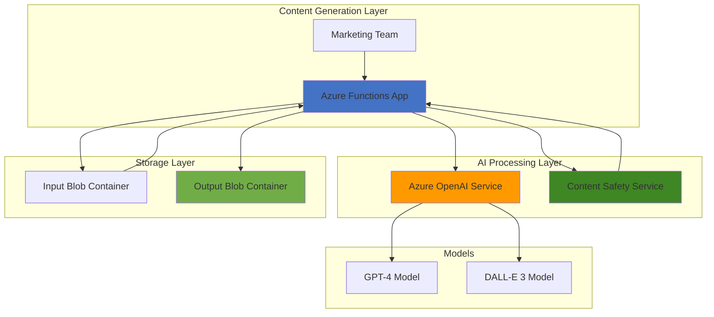

# Automated Marketing Asset Generation with OpenAI and Content Safety

## Problem

Marketing teams need to produce high-volume, consistent marketing content across multiple channels, but manual content creation is time-consuming and resource-intensive. Traditional approaches require significant human oversight for both content generation and safety validation, creating bottlenecks that prevent rapid campaign deployment and A/B testing at scale.

## Solution

Build an automated marketing asset generation system that uses Azure OpenAI for text and image creation, validates content through Azure Content Safety, and stores approved assets in Blob Storage. This serverless solution uses Azure Functions to orchestrate the entire workflow, enabling marketing teams to generate brand-compliant content at scale while ensuring safety standards.

## Architecture Diagram



## Prerequisites

1. Azure account with Cognitive Services and Storage permissions
2. Azure CLI installed and configured (or Azure Cloud Shell)
3. Basic knowledge of serverless functions and AI content generation
4. Understanding of content safety and moderation concepts
5. Estimated cost: $15-25 for complete recipe execution

> **Note**: This recipe requires access to Azure OpenAI Service, which may require approval through the access request process.

## Preparation

```bash
# Set environment variables for Azure resources
export RESOURCE_GROUP="rg-marketing-ai-${RANDOM_SUFFIX}"
export LOCATION="eastus"
export SUBSCRIPTION_ID=$(az account show --query id --output tsv)

# Generate unique suffix for resource names
RANDOM_SUFFIX=$(openssl rand -hex 3)

# Create resource group
az group create \
    --name ${RESOURCE_GROUP} \
    --location ${LOCATION} \
    --tags purpose=recipe environment=demo

echo "✅ Resource group created: ${RESOURCE_GROUP}"

# Set additional environment variables
export STORAGE_ACCOUNT="stmarketingai${RANDOM_SUFFIX}"
export FUNCTION_APP="func-marketing-ai-${RANDOM_SUFFIX}"
export OPENAI_ACCOUNT="openai-marketing-${RANDOM_SUFFIX}"
export CONTENT_SAFETY_ACCOUNT="cs-marketing-${RANDOM_SUFFIX}"
```

## Steps

1. **Create Storage Account for Marketing Assets**:

   Azure Blob Storage provides scalable, cost-effective storage for marketing assets with built-in redundancy and global availability. Creating separate containers for input prompts and generated assets ensures organized workflow management and supports automated content lifecycle policies.

   ```bash
   # Create storage account with hot tier for frequent access
   az storage account create \
       --name ${STORAGE_ACCOUNT} \
       --resource-group ${RESOURCE_GROUP} \
       --location ${LOCATION} \
       --sku Standard_LRS \
       --kind StorageV2 \
       --access-tier Hot \
       --tags purpose=marketing-assets
   
   # Get storage account key
   STORAGE_KEY=$(az storage account keys list \
       --resource-group ${RESOURCE_GROUP} \
       --account-name ${STORAGE_ACCOUNT} \
       --query '[0].value' --output tsv)
   
   echo "✅ Storage account created: ${STORAGE_ACCOUNT}"
   ```

   The storage account is now configured with hot tier access for frequent content retrieval, enabling rapid asset delivery for marketing campaigns and social media publishing workflows.

2. **Create Blob Containers for Content Workflow**:

   Organizing content into separate containers enables automated workflow management and content staging. The input container receives generation requests while the output container stores approved marketing assets ready for immediate use.

   ```bash
   # Create container for input prompts and requests
   az storage container create \
       --name "marketing-requests" \
       --account-name ${STORAGE_ACCOUNT} \
       --account-key ${STORAGE_KEY} \
       --public-access off
   
   # Create container for generated marketing assets
   az storage container create \
       --name "marketing-assets" \
       --account-name ${STORAGE_ACCOUNT} \
       --account-key ${STORAGE_KEY} \
       --public-access blob
   
   # Create container for rejected content (safety violations)
   az storage container create \
       --name "rejected-content" \
       --account-name ${STORAGE_ACCOUNT} \
       --account-key ${STORAGE_KEY} \
       --public-access off
   
   echo "✅ Blob containers created for content workflow"
   ```

   The container structure supports automated content moderation with public access for approved assets and private storage for sensitive review processes.

3. **Deploy Azure OpenAI Service**:

   Azure OpenAI Service provides enterprise-grade access to GPT and DALL-E models with built-in content filtering and compliance features. This managed service ensures consistent performance and security for business-critical marketing content generation workflows.

   ```bash
   # Create Azure OpenAI resource
   az cognitiveservices account create \
       --name ${OPENAI_ACCOUNT} \
       --resource-group ${RESOURCE_GROUP} \
       --location ${LOCATION} \
       --kind OpenAI \
       --sku S0 \
       --custom-domain ${OPENAI_ACCOUNT} \
       --tags purpose=marketing-content-generation
   
   # Get OpenAI endpoint and key
   OPENAI_ENDPOINT=$(az cognitiveservices account show \
       --name ${OPENAI_ACCOUNT} \
       --resource-group ${RESOURCE_GROUP} \
       --query properties.endpoint --output tsv)
   
   OPENAI_KEY=$(az cognitiveservices account keys list \
       --name ${OPENAI_ACCOUNT} \
       --resource-group ${RESOURCE_GROUP} \
       --query key1 --output tsv)
   
   echo "✅ Azure OpenAI Service deployed: ${OPENAI_ENDPOINT}"
   ```

   The OpenAI service is now ready for model deployment with enterprise security and compliance features enabled for marketing content generation at scale.

4. **Deploy OpenAI Models for Content Generation**:

   Deploying both GPT-4 for text generation and DALL-E 3 for image creation enables comprehensive marketing asset production. These models provide state-of-the-art capabilities for creating engaging, brand-consistent content across multiple media formats.

   ```bash
   # Deploy GPT-4 model for text generation
   az cognitiveservices account deployment create \
       --name ${OPENAI_ACCOUNT} \
       --resource-group ${RESOURCE_GROUP} \
       --deployment-name "gpt-4-marketing" \
       --model-name "gpt-4" \
       --model-version "0613" \
       --model-format "OpenAI" \
       --sku-name "Standard" \
       --sku-capacity 10
   
   # Deploy DALL-E 3 model for image generation
   az cognitiveservices account deployment create \
       --name ${OPENAI_ACCOUNT} \
       --resource-group ${RESOURCE_GROUP} \
       --deployment-name "dalle-3-marketing" \
       --model-name "dall-e-3" \
       --model-version "3.0" \
       --model-format "OpenAI" \
       --sku-name "Standard" \
       --sku-capacity 1
   
   echo "✅ OpenAI models deployed successfully"
   ```

   Both models are now available for high-throughput marketing content generation with appropriate capacity allocation for business workloads.

5. **Create Content Safety Service**:

   Azure Content Safety provides multi-modal content moderation with customizable severity thresholds and industry-specific safety policies. This service ensures all generated marketing content meets brand guidelines and regulatory compliance requirements before publication.

   ```bash
   # Create Content Safety resource
   az cognitiveservices account create \
       --name ${CONTENT_SAFETY_ACCOUNT} \
       --resource-group ${RESOURCE_GROUP} \
       --location ${LOCATION} \
       --kind ContentSafety \
       --sku S0 \
       --tags purpose=marketing-content-moderation
   
   # Get Content Safety endpoint and key
   CONTENT_SAFETY_ENDPOINT=$(az cognitiveservices account show \
       --name ${CONTENT_SAFETY_ACCOUNT} \
       --resource-group ${RESOURCE_GROUP} \
       --query properties.endpoint --output tsv)
   
   CONTENT_SAFETY_KEY=$(az cognitiveservices account keys list \
       --name ${CONTENT_SAFETY_ACCOUNT} \
       --resource-group ${RESOURCE_GROUP} \
       --query key1 --output tsv)
   
   echo "✅ Content Safety service created: ${CONTENT_SAFETY_ENDPOINT}"
   ```

   The Content Safety service is configured with standard moderation policies suitable for marketing content with customizable thresholds for brand-specific requirements.

6. **Create Function App for Orchestration**:

   Azure Functions provides serverless orchestration for the content generation workflow with automatic scaling and cost-effective execution. The consumption plan ensures you only pay for actual content processing while maintaining high availability for marketing campaigns.

   ```bash
   # Create Function App with Python runtime
   az functionapp create \
       --resource-group ${RESOURCE_GROUP} \
       --consumption-plan-location ${LOCATION} \
       --runtime python \
       --runtime-version 3.11 \
       --functions-version 4 \
       --name ${FUNCTION_APP} \
       --storage-account ${STORAGE_ACCOUNT} \
       --tags purpose=marketing-automation
   
   echo "✅ Function App created: ${FUNCTION_APP}"
   
   # Wait for Function App deployment
   sleep 30
   ```

   The Function App is ready to host the marketing content generation workflow with automatic scaling based on demand and integrated monitoring through Application Insights.

7. **Configure Function App Settings**:

   Application settings store secure connection strings and API keys for the content generation workflow. These settings enable the Functions to authenticate with Azure services while maintaining security best practices for production environments.

   ```bash
   # Configure application settings for all services
   az functionapp config appsettings set \
       --name ${FUNCTION_APP} \
       --resource-group ${RESOURCE_GROUP} \
       --settings \
       "AZURE_OPENAI_ENDPOINT=${OPENAI_ENDPOINT}" \
       "AZURE_OPENAI_KEY=${OPENAI_KEY}" \
       "CONTENT_SAFETY_ENDPOINT=${CONTENT_SAFETY_ENDPOINT}" \
       "CONTENT_SAFETY_KEY=${CONTENT_SAFETY_KEY}" \
       "STORAGE_CONNECTION_STRING=DefaultEndpointsProtocol=https;AccountName=${STORAGE_ACCOUNT};AccountKey=${STORAGE_KEY};EndpointSuffix=core.windows.net"
   
   # Enable system-assigned managed identity for enhanced security
   az functionapp identity assign \
       --name ${FUNCTION_APP} \
       --resource-group ${RESOURCE_GROUP}
   
   echo "✅ Function App configured with service connections"
   ```

   The Function App now has secure access to all required Azure services with managed identity authentication for enhanced security in production environments.

8. **Deploy Marketing Content Generation Function**:

   The content generation function orchestrates the entire workflow from prompt processing through safety validation to asset storage. This serverless function handles both text and image generation with built-in error handling and content safety checks.

   ```bash
   # Create function directory structure
   mkdir -p marketing-function
   cd marketing-function
   
   # Create requirements.txt for Python dependencies
   cat > requirements.txt << 'EOF'
azure-functions
azure-storage-blob
azure-ai-contentsafety
openai
requests
Pillow
EOF
   
   # Create the main function file
   cat > function_app.py << 'EOF'
import azure.functions as func
import json
import logging
import os
from azure.storage.blob import BlobServiceClient
from azure.ai.contentsafety import ContentSafetyClient
from azure.ai.contentsafety.models import AnalyzeTextOptions, AnalyzeImageOptions, ImageData
from azure.core.credentials import AzureKeyCredential
from openai import AzureOpenAI
import requests
from PIL import Image
from io import BytesIO
import base64

app = func.FunctionApp()

# Initialize clients
openai_client = AzureOpenAI(
    api_key=os.environ["AZURE_OPENAI_KEY"],
    api_version="2024-02-01",
    azure_endpoint=os.environ["AZURE_OPENAI_ENDPOINT"]
)

safety_client = ContentSafetyClient(
    os.environ["CONTENT_SAFETY_ENDPOINT"],
    AzureKeyCredential(os.environ["CONTENT_SAFETY_KEY"])
)

blob_client = BlobServiceClient.from_connection_string(
    os.environ["STORAGE_CONNECTION_STRING"]
)

@app.blob_trigger(arg_name="inputblob", 
                 path="marketing-requests/{name}",
                 connection="STORAGE_CONNECTION_STRING")
def generate_marketing_content(inputblob: func.InputStream):
    logging.info("Processing marketing content request")
    
    try:
        # Parse request from blob
        request_data = json.loads(inputblob.read().decode('utf-8'))
        
        # Generate text content
        if request_data.get("generate_text"):
            text_content = generate_marketing_text(request_data)
            if validate_content_safety(text_content):
                save_to_blob("marketing-assets", f"text/{request_data['campaign_id']}.txt", text_content)
                logging.info(f"Text content approved and saved for {request_data['campaign_id']}")
            else:
                save_to_blob("rejected-content", f"text/{request_data['campaign_id']}.txt", text_content)
                logging.warning(f"Text content rejected for safety violations: {request_data['campaign_id']}")
        
        # Generate image content
        if request_data.get("generate_image"):
            image_url = generate_marketing_image(request_data)
            if image_url and validate_image_safety(image_url):
                save_image_to_blob("marketing-assets", f"images/{request_data['campaign_id']}.png", image_url)
                logging.info(f"Image content approved and saved for {request_data['campaign_id']}")
            else:
                logging.warning(f"Image generation failed safety check for {request_data['campaign_id']}")
    
    except Exception as e:
        logging.error(f"Error processing marketing request: {str(e)}")

def generate_marketing_text(request_data):
    response = openai_client.chat.completions.create(
        model="gpt-4-marketing",
        messages=[
            {"role": "system", "content": "You are a marketing copywriter creating engaging, brand-appropriate content."},
            {"role": "user", "content": request_data["text_prompt"]}
        ],
        max_tokens=500,
        temperature=0.7
    )
    return response.choices[0].message.content

def generate_marketing_image(request_data):
    response = openai_client.images.generate(
        model="dalle-3-marketing",
        prompt=request_data["image_prompt"],
        size="1024x1024",
        quality="standard",
        n=1
    )
    return response.data[0].url

def validate_content_safety(text_content):
    try:
        # Analyze text content for safety violations
        request = AnalyzeTextOptions(text=text_content)
        response = safety_client.analyze_text(request)
        
        # Check if any category exceeded threshold (adjust thresholds as needed)
        for category_result in response.categories_analysis:
            if category_result.severity >= 4:  # High severity threshold
                return False
        return True
    except Exception as e:
        logging.error(f"Content safety analysis failed: {str(e)}")
        return False  # Reject on error for safety

def validate_image_safety(image_url):
    try:
        # Download image for analysis
        response = requests.get(image_url)
        image_data = response.content
        
        # Analyze image content for safety violations
        request = AnalyzeImageOptions(image=ImageData(content=image_data))
        response = safety_client.analyze_image(request)
        
        # Check if any category exceeded threshold
        for category_result in response.categories_analysis:
            if category_result.severity >= 4:  # High severity threshold
                return False
        return True
    except Exception as e:
        logging.error(f"Image safety analysis failed: {str(e)}")
        return False  # Reject on error for safety

def save_to_blob(container_name, blob_name, content):
    blob_client_instance = blob_client.get_blob_client(
        container=container_name, blob=blob_name
    )
    blob_client_instance.upload_blob(content, overwrite=True)
    logging.info(f"Saved content to {container_name}/{blob_name}")

def save_image_to_blob(container_name, blob_name, image_url):
    response = requests.get(image_url)
    blob_client_instance = blob_client.get_blob_client(
        container=container_name, blob=blob_name
    )
    blob_client_instance.upload_blob(response.content, overwrite=True)
    logging.info(f"Saved image to {container_name}/{blob_name}")
EOF
   
   # Create host.json configuration
   cat > host.json << 'EOF'
{
  "version": "2.0",
  "functionTimeout": "00:05:00",
  "extensions": {
    "blobs": {
      "maxDegreeOfParallelism": 4
    }
  }
}
EOF
   
   echo "✅ Marketing content generation function created"
   ```

   The function is structured to handle both text and image generation with integrated safety validation and automated asset storage for immediate marketing use.

9. **Deploy Function to Azure**:

   Deploying the function to Azure enables automatic scaling and production-ready marketing content generation. The deployment includes all dependencies and configuration required for enterprise marketing workflows.

   ```bash
   # Package and deploy function
   zip -r marketing-function.zip . -x "*.git*" "*.DS_Store*"
   
   # Deploy function package to Azure
   az functionapp deployment source config-zip \
       --resource-group ${RESOURCE_GROUP} \
       --name ${FUNCTION_APP} \
       --src marketing-function.zip
   
   # Wait for deployment to complete
   sleep 60
   
   echo "✅ Marketing function deployed successfully"
   
   # Return to parent directory
   cd ..
   ```

   The function is now deployed and ready to process marketing content generation requests automatically when JSON files are uploaded to the input container.

10. **Test Marketing Content Generation**:

    Testing the complete workflow validates that all services integrate correctly for automated marketing asset generation. This test demonstrates the end-to-end process from request submission to approved asset delivery.

    ```bash
    # Create test marketing request
    cat > test-marketing-request.json << 'EOF'
{
  "campaign_id": "summer-2025-launch",
  "generate_text": true,
  "text_prompt": "Create an engaging social media post for a summer product launch featuring sustainable outdoor gear. Include a call-to-action and relevant hashtags.",
  "generate_image": true,
  "image_prompt": "A vibrant summer scene with eco-friendly outdoor gear including backpacks and water bottles, natural lighting, professional marketing photography style"
}
EOF
    
    # Upload test request to trigger function
    az storage blob upload \
        --account-name ${STORAGE_ACCOUNT} \
        --account-key ${STORAGE_KEY} \
        --container-name "marketing-requests" \
        --name "test-request.json" \
        --file test-marketing-request.json
    
    echo "✅ Test marketing request uploaded"
    echo "⏳ Function processing will complete in 1-2 minutes"
    ```

    The test request triggers the automated workflow, generating marketing content that will be validated for safety and stored in the appropriate containers based on compliance results.

## Validation & Testing

1. Monitor Function execution logs:

   ```bash
   # Check Function App logs for processing status
   az monitor log-analytics query \
       --workspace $(az monitor log-analytics workspace show \
           --resource-group ${RESOURCE_GROUP} \
           --workspace-name "DefaultWorkspace-${SUBSCRIPTION_ID}-${LOCATION}" \
           --query customerId --output tsv) \
       --analytics-query "traces | where cloud_RoleName == '${FUNCTION_APP}' | order by timestamp desc | take 10"
   
   # Alternative: Check function execution in Azure portal
   echo "Check function logs at: https://portal.azure.com/#@/resource/subscriptions/${SUBSCRIPTION_ID}/resourceGroups/${RESOURCE_GROUP}/providers/Microsoft.Web/sites/${FUNCTION_APP}/functions"
   ```

2. Verify generated marketing assets:

   ```bash
   # List generated assets in output container
   az storage blob list \
       --account-name ${STORAGE_ACCOUNT} \
       --account-key ${STORAGE_KEY} \
       --container-name "marketing-assets" \
       --output table
   
   # Download generated text content for review
   az storage blob download \
       --account-name ${STORAGE_ACCOUNT} \
       --account-key ${STORAGE_KEY} \
       --container-name "marketing-assets" \
       --name "text/summer-2025-launch.txt" \
       --file generated-text.txt
   ```

   Expected output: Marketing text file and image assets stored in appropriate containers with timestamp metadata.

3. Test content safety validation:

   ```bash
   # Upload potentially unsafe content to test safety filtering
   cat > unsafe-request.json << 'EOF'
{
  "campaign_id": "safety-test",
  "generate_text": true,
  "text_prompt": "Create content with inappropriate language and harmful messaging",
  "generate_image": false
}
EOF
   
   az storage blob upload \
       --account-name ${STORAGE_ACCOUNT} \
       --account-key ${STORAGE_KEY} \
       --container-name "marketing-requests" \
       --name "safety-test.json" \
       --file unsafe-request.json
   
   # Check rejected content container after processing
   az storage blob list \
       --account-name ${STORAGE_ACCOUNT} \
       --account-key ${STORAGE_KEY} \
       --container-name "rejected-content" \
       --output table
   ```

   Expected behavior: Unsafe content should be filtered to the rejected-content container with appropriate logging.

## Cleanup

1. Remove Function App and associated resources:

   ```bash
   # Delete Function App
   az functionapp delete \
       --name ${FUNCTION_APP} \
       --resource-group ${RESOURCE_GROUP}
   
   echo "✅ Function App deleted"
   ```

2. Remove Azure OpenAI Service:

   ```bash
   # Delete OpenAI resource and deployments
   az cognitiveservices account delete \
       --name ${OPENAI_ACCOUNT} \
       --resource-group ${RESOURCE_GROUP}
   
   echo "✅ Azure OpenAI Service deleted"
   ```

3. Remove Content Safety Service:

   ```bash
   # Delete Content Safety resource
   az cognitiveservices account delete \
       --name ${CONTENT_SAFETY_ACCOUNT} \
       --resource-group ${RESOURCE_GROUP}
   
   echo "✅ Content Safety Service deleted"
   ```

4. Remove Storage Account and all marketing assets:

   ```bash
   # Delete storage account and all containers
   az storage account delete \
       --name ${STORAGE_ACCOUNT} \
       --resource-group ${RESOURCE_GROUP} \
       --yes
   
   echo "✅ Storage account deleted"
   ```

5. Remove resource group:

   ```bash
   # Delete resource group and remaining resources
   az group delete \
       --name ${RESOURCE_GROUP} \
       --yes \
       --no-wait
   
   echo "✅ Resource group deletion initiated"
   echo "Note: Complete deletion may take several minutes"
   
   # Clean up local files
   rm -f test-marketing-request.json unsafe-request.json generated-text.txt
   rm -rf marketing-function marketing-function.zip
   ```

## Discussion

This automated marketing asset generation solution demonstrates the powerful integration of Azure's AI services for enterprise content creation workflows. The architecture combines Azure OpenAI's generative capabilities with Content Safety's moderation features to ensure brand-appropriate, compliant marketing content at scale. By using Azure Functions for orchestration and Blob Storage for asset management, the solution provides a cost-effective, serverless approach that scales automatically with marketing campaign demands.

The integration of both text and image generation capabilities enables comprehensive marketing asset creation, from social media posts to visual content for digital campaigns. Azure Content Safety acts as a critical governance layer, ensuring all generated content meets organizational standards and regulatory requirements before publication. This approach significantly reduces manual review time while maintaining content quality and brand consistency across all marketing channels.

The serverless architecture optimizes costs by only consuming resources during active content generation, making it particularly suitable for seasonal campaigns or businesses with variable marketing content needs. The solution's modular design allows for easy extension to include additional content types, custom safety policies, or integration with existing marketing automation platforms and content management systems.

> **Tip**: Consider implementing custom Content Safety categories specific to your brand guidelines and industry requirements for enhanced content governance and compliance.

The solution follows Azure Well-Architected Framework principles by implementing automated scaling, security through managed identities, and operational excellence through comprehensive logging and monitoring. For production deployments, consider implementing Azure Key Vault for enhanced secret management and Azure Monitor for detailed performance analytics and content generation metrics.

**Key Documentation References:**
- [Azure OpenAI Service Overview](https://learn.microsoft.com/en-us/azure/ai-services/openai/overview)
- [Azure AI Content Safety Documentation](https://learn.microsoft.com/en-us/azure/ai-services/content-safety/overview)
- [Azure Functions Blob Storage Triggers](https://learn.microsoft.com/en-us/azure/azure-functions/functions-bindings-storage-blob-trigger)
- [DALL-E Image Generation Quickstart](https://learn.microsoft.com/en-us/azure/ai-foundry/openai/dall-e-quickstart)
- [Content Safety Prompt Shields](https://learn.microsoft.com/en-us/azure/ai-services/content-safety/concepts/jailbreak-detection)

## Challenge

Extend this marketing automation solution by implementing these enhancements:

1. **Multi-language Content Generation**: Integrate Azure Translator to generate marketing content in multiple languages with region-specific cultural adaptations and localized safety policies.

2. **Brand Voice Consistency**: Implement custom fine-tuning of GPT models using your organization's existing marketing content to maintain consistent brand voice and messaging across all generated assets.

3. **Advanced Content Workflows**: Add approval workflows using Azure Logic Apps with stakeholder notifications, version control, and scheduled content publishing to social media platforms and content management systems.

4. **Performance Analytics Dashboard**: Build a Power BI dashboard that tracks content generation metrics, safety filtering rates, campaign performance, and cost optimization insights for data-driven marketing decisions.

5. **Enterprise Integration**: Connect the solution to existing marketing automation platforms like HubSpot or Salesforce Marketing Cloud using Azure API Management for secure, rate-limited access to the content generation pipeline.

## Infrastructure Code

*Infrastructure code will be generated after recipe approval.*