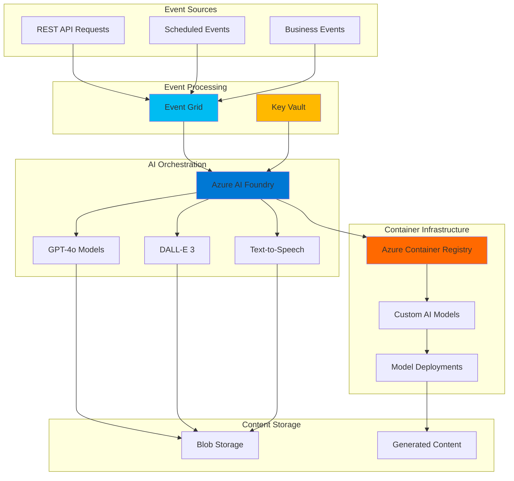

# Automated Multimodal Content Generation Workflows

## Problem

Modern content creation teams need to generate diverse media types (text, images, audio) at scale to meet increasing demand for personalized, multi-channel marketing campaigns. Manual content creation processes are slow, expensive, and inconsistent, while traditional AI solutions require complex infrastructure management and lack seamless integration between different content types. Organizations struggle to coordinate multiple AI models, manage containerized deployments, and orchestrate event-driven workflows that can automatically trigger content generation based on business events.

## Solution

Build an automated multi-modal content generation pipeline using Azure AI Foundry to orchestrate multiple AI models for creating text, images, and audio content. Azure Container Registry provides secure, versioned storage for custom AI model containers, while Azure Event Grid enables event-driven workflow automation that triggers content generation based on business events. This serverless, scalable architecture eliminates infrastructure management overhead while ensuring consistent, high-quality content generation across multiple modalities.

## Architecture Diagram



## Prerequisites

1. Azure subscription with appropriate permissions for AI Foundry, Container Registry, Event Grid, and Key Vault
2. Azure CLI v2.61.0 or later installed and configured
3. Docker Desktop installed for container image creation
4. Basic understanding of AI/ML concepts, containerization, and event-driven architectures
5. Python 3.11+ for developing custom AI model containers
6. Estimated cost: $50-100 for the initial setup and testing (varies based on AI model usage)

> **Note**: Azure AI Foundry includes consumption-based pricing for model inference. Review the [Azure AI pricing guide](https://azure.microsoft.com/en-us/pricing/details/ai-foundry/) to understand costs before proceeding.

## Preparation

```bash
# Set environment variables for Azure resources
export RESOURCE_GROUP="rg-multimodal-content-${RANDOM_SUFFIX}"
export LOCATION="eastus"
export SUBSCRIPTION_ID=$(az account show --query id --output tsv)

# Generate unique suffix for resource names
RANDOM_SUFFIX=$(openssl rand -hex 3)

# Set specific resource names
export AI_FOUNDRY_HUB="aif-hub-${RANDOM_SUFFIX}"
export AI_FOUNDRY_PROJECT="aif-project-${RANDOM_SUFFIX}"
export CONTAINER_REGISTRY="acr${RANDOM_SUFFIX}"
export EVENT_GRID_TOPIC="egt-content-${RANDOM_SUFFIX}"
export KEY_VAULT_NAME="kv-content-${RANDOM_SUFFIX}"
export STORAGE_ACCOUNT="stcontent${RANDOM_SUFFIX}"

# Create resource group with appropriate tags
az group create \
    --name ${RESOURCE_GROUP} \
    --location ${LOCATION} \
    --tags purpose=multi-modal-content environment=demo \
           created-by=azure-recipe

echo "✅ Resource group created: ${RESOURCE_GROUP}"

# Create storage account for content output
az storage account create \
    --name ${STORAGE_ACCOUNT} \
    --resource-group ${RESOURCE_GROUP} \
    --location ${LOCATION} \
    --sku Standard_LRS \
    --kind StorageV2 \
    --allow-blob-public-access false

echo "✅ Storage account created: ${STORAGE_ACCOUNT}"
```

## Steps

1. **Create Azure Key Vault for Secure Configuration Management**:

   Azure Key Vault provides centralized, secure storage for API keys, connection strings, and configuration secrets used throughout the multi-modal content generation workflow. This managed service eliminates the need to store sensitive information in application code or configuration files, ensuring compliance with enterprise security policies and providing audit logging for all secret access operations.

   ```bash
   # Create Key Vault with RBAC authorization
   az keyvault create \
       --name ${KEY_VAULT_NAME} \
       --resource-group ${RESOURCE_GROUP} \
       --location ${LOCATION} \
       --sku standard \
       --enable-rbac-authorization true

   # Get current user object ID for RBAC assignment
   CURRENT_USER_ID=$(az ad signed-in-user show --query id --output tsv)

   # Assign Key Vault Administrator role to current user
   az role assignment create \
       --assignee ${CURRENT_USER_ID} \
       --role "Key Vault Administrator" \
       --scope "/subscriptions/${SUBSCRIPTION_ID}/resourceGroups/${RESOURCE_GROUP}/providers/Microsoft.KeyVault/vaults/${KEY_VAULT_NAME}"

   echo "✅ Key Vault created with RBAC authorization: ${KEY_VAULT_NAME}"
   ```

   The Key Vault is now configured with role-based access control (RBAC) instead of traditional access policies, providing more granular security controls and better integration with Azure Active Directory. This foundation enables secure storage of AI model API keys and configuration parameters needed for the content generation workflow.

2. **Create Azure Container Registry for AI Model Container Storage**:

   Azure Container Registry provides enterprise-grade, private Docker registry services for storing and managing custom AI model containers. ACR offers geo-replication, image vulnerability scanning, and seamless integration with Azure services, making it ideal for hosting containerized machine learning models that require version control and secure distribution across development and production environments.

   ```bash
   # Create Premium tier ACR for advanced features
   az acr create \
       --name ${CONTAINER_REGISTRY} \
       --resource-group ${RESOURCE_GROUP} \
       --location ${LOCATION} \
       --sku Premium \
       --admin-enabled false

   # Enable system-assigned managed identity for ACR
   az acr identity assign \
       --name ${CONTAINER_REGISTRY} \
       --identities [system] \
       --resource-group ${RESOURCE_GROUP}

   # Get ACR login server for later use
   ACR_LOGIN_SERVER=$(az acr show \
       --name ${CONTAINER_REGISTRY} \
       --resource-group ${RESOURCE_GROUP} \
       --query loginServer --output tsv)

   echo "✅ Container Registry created: ${ACR_LOGIN_SERVER}"
   ```

   The Premium tier ACR provides geo-replication capabilities, content trust for image signing, and advanced security features including vulnerability scanning. This registry will store custom AI model containers that extend the capabilities of Azure AI Foundry's built-in models with domain-specific functionality.

3. **Create Azure AI Foundry Hub and Project**:

   Azure AI Foundry serves as the central orchestration platform for multi-modal AI workflows, providing access to over 1,900 AI models including GPT-4o for text generation, DALL-E 3 for image creation, and speech synthesis models. The hub-and-project structure enables collaborative development while maintaining security boundaries and resource isolation for different content generation workloads.

   ```bash
   # Create AI Foundry Hub
   az ml workspace create \
       --name ${AI_FOUNDRY_HUB} \
       --resource-group ${RESOURCE_GROUP} \
       --location ${LOCATION} \
       --kind hub \
       --storage-account ${STORAGE_ACCOUNT} \
       --key-vault ${KEY_VAULT_NAME} \
       --container-registry ${CONTAINER_REGISTRY}

   # Create AI Foundry Project within the Hub
   az ml workspace create \
       --name ${AI_FOUNDRY_PROJECT} \
       --resource-group ${RESOURCE_GROUP} \
       --location ${LOCATION} \
       --kind project \
       --hub-id "/subscriptions/${SUBSCRIPTION_ID}/resourceGroups/${RESOURCE_GROUP}/providers/Microsoft.MachineLearningServices/workspaces/${AI_FOUNDRY_HUB}"

   echo "✅ AI Foundry Hub and Project created"
   ```

   The AI Foundry Hub provides shared infrastructure and governance policies, while the Project offers an isolated workspace for developing and deploying multi-modal content generation workflows. This separation enables different teams to work independently while sharing common resources and security configurations.

4. **Deploy Azure AI Services for Multi-Modal AI Models**:

   Azure AI Services provides the foundation for multi-modal content generation through managed AI models accessible via standardized APIs. Creating an AI Services resource enables access to GPT-4o for text generation, DALL-E 3 for image creation, and speech synthesis models, providing the core AI capabilities needed for comprehensive content generation workflows.

   ```bash
   # Create Azure AI Services resource
   AI_SERVICES_NAME="ais-content-${RANDOM_SUFFIX}"
   
   az cognitiveservices account create \
       --name ${AI_SERVICES_NAME} \
       --resource-group ${RESOURCE_GROUP} \
       --location ${LOCATION} \
       --kind AIServices \
       --sku S0 \
       --custom-domain ${AI_SERVICES_NAME}

   # Get AI Services endpoint and key
   AI_SERVICES_ENDPOINT=$(az cognitiveservices account show \
       --name ${AI_SERVICES_NAME} \
       --resource-group ${RESOURCE_GROUP} \
       --query properties.endpoint --output tsv)

   AI_SERVICES_KEY=$(az cognitiveservices account keys list \
       --name ${AI_SERVICES_NAME} \
       --resource-group ${RESOURCE_GROUP} \
       --query key1 --output tsv)

   # Store AI Services credentials in Key Vault
   az keyvault secret set \
       --vault-name ${KEY_VAULT_NAME} \
       --name "ai-services-endpoint" \
       --value ${AI_SERVICES_ENDPOINT}

   az keyvault secret set \
       --vault-name ${KEY_VAULT_NAME} \
       --name "ai-services-key" \
       --value ${AI_SERVICES_KEY}

   echo "✅ Azure AI Services deployed: ${AI_SERVICES_NAME}"
   ```

   The AI Services resource provides unified access to multiple AI models through a single endpoint, simplifying authentication and management. This approach enables seamless switching between different AI models while maintaining consistent security and monitoring across all content generation operations.

5. **Create Event Grid Topic for Workflow Orchestration**:

   Azure Event Grid enables event-driven architecture by providing reliable event delivery between loosely coupled components. Creating a custom topic allows business applications, scheduling systems, and external APIs to trigger content generation workflows through standardized event publishing, ensuring scalable and responsive content creation processes.

   ```bash
   # Create Event Grid custom topic
   az eventgrid topic create \
       --name ${EVENT_GRID_TOPIC} \
       --resource-group ${RESOURCE_GROUP} \
       --location ${LOCATION} \
       --input-schema CloudEventSchemaV1_0

   # Get Event Grid topic endpoint and access key
   TOPIC_ENDPOINT=$(az eventgrid topic show \
       --name ${EVENT_GRID_TOPIC} \
       --resource-group ${RESOURCE_GROUP} \
       --query endpoint --output tsv)

   TOPIC_KEY=$(az eventgrid topic key list \
       --name ${EVENT_GRID_TOPIC} \
       --resource-group ${RESOURCE_GROUP} \
       --query key1 --output tsv)

   # Store Event Grid credentials in Key Vault
   az keyvault secret set \
       --vault-name ${KEY_VAULT_NAME} \
       --name "eventgrid-endpoint" \
       --value ${TOPIC_ENDPOINT}

   az keyvault secret set \
       --vault-name ${KEY_VAULT_NAME} \
       --name "eventgrid-key" \
       --value ${TOPIC_KEY}

   echo "✅ Event Grid topic created: ${EVENT_GRID_TOPIC}"
   ```

   The Event Grid topic now serves as the central event hub for the content generation workflow. Using Cloud Events schema ensures compatibility with modern event-driven architectures, while storing credentials in Key Vault maintains security best practices for production deployments.

6. **Build and Deploy Custom AI Model Container**:

   Creating custom AI model containers extends Azure AI Foundry's capabilities with domain-specific models, specialized preprocessing, or proprietary algorithms. Azure Container Registry provides secure storage and version control for these containers, enabling consistent deployment across development and production environments while maintaining enterprise security and compliance requirements.

   ```bash
   # Create sample custom model container structure
   mkdir -p custom-ai-model/src
   
   # Create Dockerfile for custom AI model
   cat > custom-ai-model/Dockerfile << 'EOF'
   FROM python:3.11-slim
   
   WORKDIR /app
   
   # Install required packages
   COPY requirements.txt .
   RUN pip install --no-cache-dir -r requirements.txt
   
   # Copy model code
   COPY src/ ./src/
   
   # Expose port for model inference
   EXPOSE 8080
   
   # Start model server
   CMD ["python", "src/model_server.py"]
   EOF

   # Create requirements.txt
   cat > custom-ai-model/requirements.txt << 'EOF'
   fastapi==0.104.1
   uvicorn==0.24.0
   transformers==4.35.2
   torch==2.1.0
   numpy==1.24.3
   pillow==10.0.1
   EOF

   # Create basic model server
   cat > custom-ai-model/src/model_server.py << 'EOF'
   from fastapi import FastAPI
   import uvicorn
   
   app = FastAPI(title="Custom AI Model Server")
   
   @app.get("/health")
   def health_check():
       return {"status": "healthy"}
   
   @app.post("/predict")
   def predict(data: dict):
       # Placeholder for custom AI model inference
       return {"result": "Custom AI processing completed", "input": data}
   
   if __name__ == "__main__":
       uvicorn.run(app, host="0.0.0.0", port=8080)
   EOF

   # Build and push container to ACR
   cd custom-ai-model
   
   # Login to ACR
   az acr login --name ${CONTAINER_REGISTRY}
   
   # Build container image
   docker build -t ${ACR_LOGIN_SERVER}/custom-ai-model:v1.0 .
   
   # Push to ACR
   docker push ${ACR_LOGIN_SERVER}/custom-ai-model:v1.0
   
   cd ..
   
   echo "✅ Custom AI model container deployed to ACR"
   ```

   The custom container is now stored in Azure Container Registry with version tagging and security scanning capabilities. This containerized approach enables deployment flexibility, version control, and integration with Azure AI Foundry's orchestration capabilities for specialized AI processing tasks.

7. **Configure Content Generation Workflow Function**:

   Azure Functions provides serverless compute for orchestrating the multi-modal content generation workflow, automatically scaling based on event volume while maintaining cost efficiency. The function integrates Event Grid triggers with AI Foundry model endpoints, creating a responsive system that generates coordinated text, image, and audio content based on business events and requirements.

   ```bash
   # Create Function App for workflow orchestration
   FUNCTION_APP_NAME="func-content-${RANDOM_SUFFIX}"
   
   az functionapp create \
       --name ${FUNCTION_APP_NAME} \
       --resource-group ${RESOURCE_GROUP} \
       --storage-account ${STORAGE_ACCOUNT} \
       --consumption-plan-location ${LOCATION} \
       --runtime python \
       --runtime-version 3.11 \
       --functions-version 4

   # Configure Function App settings with AI endpoints
   az functionapp config appsettings set \
       --name ${FUNCTION_APP_NAME} \
       --resource-group ${RESOURCE_GROUP} \
       --settings \
           "AI_SERVICES_ENDPOINT=${AI_SERVICES_ENDPOINT}" \
           "STORAGE_CONNECTION_STRING=DefaultEndpointsProtocol=https;AccountName=${STORAGE_ACCOUNT};AccountKey=$(az storage account keys list --account-name ${STORAGE_ACCOUNT} --resource-group ${RESOURCE_GROUP} --query '[0].value' --output tsv);EndpointSuffix=core.windows.net" \
           "KEY_VAULT_URL=https://${KEY_VAULT_NAME}.vault.azure.net/"

   # Create Event Grid subscription for workflow triggering
   az eventgrid event-subscription create \
       --name content-generation-subscription \
       --source-resource-id "/subscriptions/${SUBSCRIPTION_ID}/resourceGroups/${RESOURCE_GROUP}/providers/Microsoft.EventGrid/topics/${EVENT_GRID_TOPIC}" \
       --endpoint-type azurefunction \
       --endpoint "/subscriptions/${SUBSCRIPTION_ID}/resourceGroups/${RESOURCE_GROUP}/providers/Microsoft.Web/sites/${FUNCTION_APP_NAME}/functions/ContentGenerationOrchestrator"

   echo "✅ Content generation workflow function configured"
   ```

   The Function App is now configured to receive Event Grid events and orchestrate multi-modal content generation using Azure AI Services. This serverless architecture ensures automatic scaling and cost-effective processing of content generation requests while maintaining enterprise security through Key Vault integration.

8. **Implement Multi-Modal Content Coordination Logic**:

   The content coordination logic ensures that generated text, images, and audio maintain thematic consistency and brand alignment across different modalities. This orchestration layer uses Azure AI Services' unified API to coordinate between different AI models, managing dependencies between content types and ensuring coherent multi-modal outputs that meet business requirements and quality standards.

   ```bash
   # Create content coordination configuration
   cat > content-coordination-config.json << 'EOF'
   {
     "workflows": {
       "marketing_campaign": {
         "text_model": "gpt-4o",
         "image_model": "dall-e-3",
         "audio_model": "speech-synthesis",
         "coordination_rules": {
           "style_consistency": true,
           "brand_alignment": true,
           "message_coherence": true
         }
       },
       "social_media": {
         "text_model": "gpt-4o-mini",
         "image_model": "dall-e-3",
         "coordination_rules": {
           "platform_optimization": true,
           "engagement_focus": true
         }
       }
     },
     "quality_gates": {
       "content_safety": true,
       "brand_compliance": true,
       "technical_validation": true
     }
   }
   EOF

   # Store configuration in Key Vault
   COORDINATION_CONFIG=$(cat content-coordination-config.json | base64 -w 0)
   
   az keyvault secret set \
       --vault-name ${KEY_VAULT_NAME} \
       --name "content-coordination-config" \
       --value ${COORDINATION_CONFIG}

   # Create sample workflow trigger event
   cat > sample-event.json << 'EOF'
   {
     "specversion": "1.0",
     "type": "content.generation.requested",
     "source": "/marketing/campaigns",
     "id": "campaign-001",
     "time": "2025-07-12T10:00:00Z",
     "data": {
       "workflow_type": "marketing_campaign",
       "content_requirements": {
         "topic": "Product Launch",
         "target_audience": "Technology Professionals",
         "brand_guidelines": "professional_modern",
         "output_formats": ["blog_post", "social_image", "podcast_intro"]
       },
       "metadata": {
         "priority": "high",
         "deadline": "2025-07-15T17:00:00Z"
       }
     }
   }
   EOF

   echo "✅ Multi-modal content coordination logic implemented"
   ```

   The coordination configuration defines workflow templates that ensure consistent multi-modal content generation with built-in quality gates and brand compliance checks. This structured approach enables repeatable, high-quality content creation that meets enterprise standards while providing flexibility for different content types and business requirements.

## Validation & Testing

1. **Verify Azure AI Services Deployment**:

   ```bash
   # Check AI Services resource status
   az cognitiveservices account show \
       --name ${AI_SERVICES_NAME} \
       --resource-group ${RESOURCE_GROUP} \
       --query '{name:name,kind:kind,location:location,provisioningState:properties.provisioningState}'

   # Test AI Services endpoint connectivity
   curl -X POST "${AI_SERVICES_ENDPOINT}/openai/deployments/gpt-4o/chat/completions?api-version=2024-02-01" \
       -H "Content-Type: application/json" \
       -H "api-key: ${AI_SERVICES_KEY}" \
       -d '{"messages":[{"role":"user","content":"Generate a brief product description for a smart home device."}],"max_tokens":100}'
   ```

   Expected output: JSON response with generated text content and usage statistics.

2. **Test Event Grid Topic and Subscription**:

   ```bash
   # Send test event to Event Grid topic
   az eventgrid event send \
       --topic-name ${EVENT_GRID_TOPIC} \
       --resource-group ${RESOURCE_GROUP} \
       --events '[
         {
           "id": "test-001",
           "eventType": "content.generation.test",
           "subject": "test/workflow",
           "eventTime": "'$(date -u +"%Y-%m-%dT%H:%M:%SZ")'",
           "data": {
             "workflow_type": "test",
             "message": "Testing event delivery"
           },
           "dataVersion": "1.0"
         }
       ]'

   # Verify event subscription status
   az eventgrid event-subscription show \
       --name content-generation-subscription \
       --source-resource-id "/subscriptions/${SUBSCRIPTION_ID}/resourceGroups/${RESOURCE_GROUP}/providers/Microsoft.EventGrid/topics/${EVENT_GRID_TOPIC}" \
       --query '{name:name,destination:destination,filter:filter}'
   ```

   Expected output: Confirmation of event delivery and active subscription status.

3. **Validate Container Registry and Custom Model**:

   ```bash
   # List images in Container Registry
   az acr repository list \
       --name ${CONTAINER_REGISTRY} \
       --output table

   # Check image vulnerability scan results
   az acr repository show-tags \
       --name ${CONTAINER_REGISTRY} \
       --repository custom-ai-model \
       --output table

   # Verify custom model container health
   docker run --rm -p 8080:8080 ${ACR_LOGIN_SERVER}/custom-ai-model:v1.0 &
   sleep 5
   curl http://localhost:8080/health
   pkill -f "custom-ai-model"
   ```

   Expected output: Container registry listing, image tags, and health check response from custom model.

## Cleanup

1. **Remove Event Grid Topic and Subscriptions**:

   ```bash
   # Delete Event Grid event subscriptions
   az eventgrid event-subscription delete \
       --name content-generation-subscription \
       --source-resource-id "/subscriptions/${SUBSCRIPTION_ID}/resourceGroups/${RESOURCE_GROUP}/providers/Microsoft.EventGrid/topics/${EVENT_GRID_TOPIC}"

   # Delete Event Grid topic
   az eventgrid topic delete \
       --name ${EVENT_GRID_TOPIC} \
       --resource-group ${RESOURCE_GROUP}

   echo "✅ Event Grid resources deleted"
   ```

2. **Remove AI Services and Function App**:

   ```bash
   # Delete Function App
   az functionapp delete \
       --name ${FUNCTION_APP_NAME} \
       --resource-group ${RESOURCE_GROUP}

   # Delete AI Services resource
   az cognitiveservices account delete \
       --name ${AI_SERVICES_NAME} \
       --resource-group ${RESOURCE_GROUP}

   echo "✅ AI Services and Function App deleted"
   ```

3. **Remove AI Foundry Workspace and Container Registry**:

   ```bash
   # Delete AI Foundry Project and Hub
   az ml workspace delete \
       --name ${AI_FOUNDRY_PROJECT} \
       --resource-group ${RESOURCE_GROUP} \
       --yes

   az ml workspace delete \
       --name ${AI_FOUNDRY_HUB} \
       --resource-group ${RESOURCE_GROUP} \
       --yes

   # Delete Container Registry
   az acr delete \
       --name ${CONTAINER_REGISTRY} \
       --resource-group ${RESOURCE_GROUP} \
       --yes

   echo "✅ AI Foundry and Container Registry deleted"
   ```

4. **Remove Storage and Security Resources**:

   ```bash
   # Delete Key Vault
   az keyvault delete \
       --name ${KEY_VAULT_NAME} \
       --resource-group ${RESOURCE_GROUP}

   # Delete Storage Account
   az storage account delete \
       --name ${STORAGE_ACCOUNT} \
       --resource-group ${RESOURCE_GROUP} \
       --yes

   # Delete Resource Group
   az group delete \
       --name ${RESOURCE_GROUP} \
       --yes \
       --no-wait

   echo "✅ All resources deleted. Cleanup complete."
   ```

## Discussion

Azure AI Foundry represents Microsoft's unified approach to AI application development, providing access to over 1,900 models through a single platform that supports both foundation models and domain-specific AI capabilities. The integration with Azure Container Registry enables organizations to deploy custom AI models alongside managed services, creating hybrid architectures that combine the reliability of managed services with the flexibility of custom solutions. This approach is particularly valuable for enterprises that need to integrate proprietary models or specialized processing pipelines with Azure's enterprise-grade AI infrastructure. For comprehensive guidance on Azure AI Foundry architecture patterns, see the [Azure AI Foundry documentation](https://docs.microsoft.com/en-us/azure/ai-foundry/) and [multi-modal AI best practices](https://docs.microsoft.com/en-us/azure/ai-foundry/concepts/foundry-models-overview).

The event-driven architecture using Azure Event Grid creates a responsive, scalable system that can handle varying content generation workloads while maintaining cost efficiency through serverless computing. Event Grid's built-in retry logic, dead-letter handling, and message durability ensure reliable workflow execution even during high-volume periods or temporary service disruptions. This pattern follows the [Azure Well-Architected Framework](https://docs.microsoft.com/en-us/azure/architecture/framework/) principles of reliability and operational excellence by decoupling components and enabling independent scaling of different workflow stages.

From a security perspective, the integration of Azure Key Vault for credential management and Azure Container Registry's vulnerability scanning capabilities ensures that the entire content generation pipeline meets enterprise security requirements. The use of managed identities and role-based access control (RBAC) eliminates the need for storing credentials in application code while providing audit trails for all AI model interactions. For detailed security best practices in AI workflows, review the [Azure AI security guidance](https://docs.microsoft.com/en-us/azure/ai-foundry/concepts/security) and [container security documentation](https://docs.microsoft.com/en-us/azure/container-registry/container-registry-security).

The multi-modal content coordination ensures brand consistency and message coherence across different content types, addressing a key challenge in automated content generation where individual AI models might produce high-quality outputs that lack thematic unity. This orchestration layer can be extended with custom business rules, brand guidelines validation, and content approval workflows to meet specific organizational requirements.

> **Tip**: Use Azure Monitor and Application Insights to track content generation performance, model response times, and workflow success rates. The [monitoring documentation](https://docs.microsoft.com/en-us/azure/azure-monitor/app/app-insights-overview) provides comprehensive guidance on setting up alerts and dashboards for production AI workloads.

## Challenge

Extend this multi-modal content generation solution by implementing these enhancements:

1. **Advanced Content Personalization**: Integrate Azure Cognitive Services Text Analytics to analyze audience sentiment and preferences, dynamically adjusting content generation parameters based on target demographic data and engagement metrics.

2. **Real-time Content Optimization**: Implement Azure Stream Analytics to process real-time engagement metrics from social media platforms and automatically trigger content variant generation based on performance data and trending topics.

3. **Enterprise Content Governance**: Build a content approval workflow using Azure Logic Apps that routes generated content through human reviewers, implements automated brand compliance checking, and maintains content versioning with Azure Data Lake Storage.

4. **Multi-language Content Scaling**: Add Azure Translator Text API integration to automatically generate localized versions of content across multiple languages and regions, with cultural adaptation rules and region-specific brand guidelines.

5. **Advanced AI Model Orchestration**: Implement Azure Machine Learning pipelines to create custom ensemble models that combine multiple AI services for enhanced content quality, with automated A/B testing of different model combinations and performance optimization.

## Infrastructure Code

*Infrastructure code will be generated after recipe approval.*