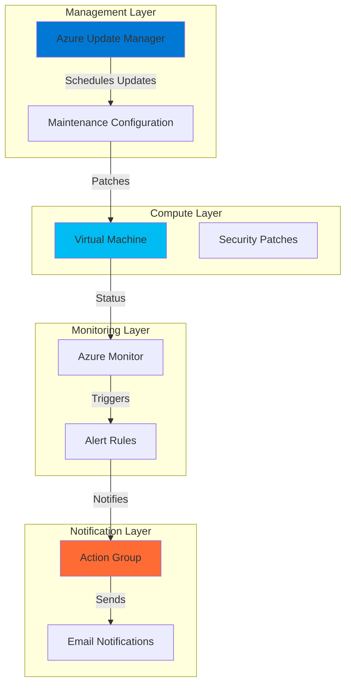

# Automated Server Patching with Update Manager and Notifications

## Problem

Organizations struggle to maintain consistent security patching across their virtual machine fleets, often relying on manual processes that lead to delayed updates, security vulnerabilities, and unplanned maintenance windows. Without automated notification systems, IT teams remain unaware of patching successes or failures, creating compliance risks and potential security exposures that can impact business operations.

## Solution

Azure Update Manager provides centralized, automated patching for virtual machines with customizable maintenance schedules that integrate seamlessly with Azure Action Groups for real-time email notifications. This solution enables organizations to establish consistent patching policies, maintain security compliance, and ensure IT teams receive immediate feedback on patch deployment status through automated email alerts.

## Architecture Diagram



## Prerequisites

1. Azure subscription with Virtual Machine Contributor and Monitoring Contributor permissions
2. Azure CLI installed and configured (version 2.37.0 or later)
3. Basic understanding of Azure virtual machines and monitoring concepts
4. Valid email address for receiving patch notifications
5. Estimated cost: $5-10 USD for 20 minutes (Standard B2s VM + monitoring resources)

> **Note**: This recipe creates resources that incur charges. All resources will be cleaned up at the end to minimize costs.

## Preparation

```bash
# Set environment variables for Azure resources
export RESOURCE_GROUP="rg-patching-demo-${RANDOM_SUFFIX}"
export LOCATION="eastus"
export SUBSCRIPTION_ID=$(az account show --query id --output tsv)

# Generate unique suffix for resource names
RANDOM_SUFFIX=$(openssl rand -hex 3)

# Set resource names with unique suffix
export VM_NAME="vm-demo-${RANDOM_SUFFIX}"
export ACTION_GROUP_NAME="ag-patching-${RANDOM_SUFFIX}"
export MAINTENANCE_CONFIG_NAME="mc-weekly-patches-${RANDOM_SUFFIX}"
export ADMIN_USERNAME="azureuser"

# Create resource group
az group create \
    --name ${RESOURCE_GROUP} \
    --location ${LOCATION} \
    --tags purpose=recipe environment=demo

echo "✅ Resource group created: ${RESOURCE_GROUP}"

# Set your email address for notifications
echo "Enter your email address for patch notifications:"
read EMAIL_ADDRESS
export EMAIL_ADDRESS
```

## Steps

1. **Create Test Virtual Machine for Patching**:

   Azure Virtual Machines serve as the foundation for demonstrating automated patching capabilities. Creating a Windows VM provides the ideal testing environment since Windows systems typically receive regular security updates that can be managed through Azure Update Manager's scheduling system.

   ```bash
   # Create a Windows VM for patch management demonstration
   az vm create \
       --resource-group ${RESOURCE_GROUP} \
       --name ${VM_NAME} \
       --image "Win2022Datacenter" \
       --admin-username ${ADMIN_USERNAME} \
       --admin-password "TempPassword123!" \
       --size "Standard_B2s" \
       --location ${LOCATION} \
       --tags purpose=patching-demo
   
   # Enable automatic VM guest patching with Customer Managed Schedules
   az vm update \
       --resource-group ${RESOURCE_GROUP} \
       --name ${VM_NAME} \
       --set osProfile.windowsConfiguration.patchSettings.patchMode="AutomaticByPlatform" \
       --set osProfile.windowsConfiguration.patchSettings.automaticByPlatformSettings.bypassPlatformSafetyChecksOnUserSchedule=true
   
   echo "✅ VM created and configured for scheduled patching: ${VM_NAME}"
   ```

   The VM is now configured with the Customer Managed Schedules patch orchestration mode, which allows Azure Update Manager to control when patches are installed according to your defined maintenance windows rather than Azure's automatic scheduling.

2. **Create Action Group for Email Notifications**:

   Azure Action Groups provide the notification infrastructure that enables automated communication when patch deployment events occur. By configuring email notifications, IT teams receive immediate feedback on patching successes, failures, or warnings, ensuring rapid response to any issues that arise during maintenance windows.

   ```bash
   # Create Action Group for patch deployment notifications
   az monitor action-group create \
       --resource-group ${RESOURCE_GROUP} \
       --name ${ACTION_GROUP_NAME} \
       --short-name "PatchAlert" \
       --email-receivers email1 ${EMAIL_ADDRESS}
   
   # Get Action Group resource ID for alert configuration
   export ACTION_GROUP_ID=$(az monitor action-group show \
       --resource-group ${RESOURCE_GROUP} \
       --name ${ACTION_GROUP_NAME} \
       --query id --output tsv)
   
   echo "✅ Action Group created for notifications: ${ACTION_GROUP_NAME}"
   echo "Notifications will be sent to: ${EMAIL_ADDRESS}"
   ```

   The Action Group is now ready to send email notifications whenever patch deployment events are triggered. This creates a reliable communication channel between Azure Update Manager and your operations team.

3. **Create Maintenance Configuration Schedule**:

   Maintenance Configurations define the automated patching schedule and scope for your virtual machines. Azure Update Manager uses these configurations to determine when patches should be installed, which update classifications to include, and how long maintenance windows should remain open for patch deployment activities.

   ```bash
   # Create maintenance configuration for weekly patching
   az maintenance configuration create \
       --resource-group ${RESOURCE_GROUP} \
       --resource-name ${MAINTENANCE_CONFIG_NAME} \
       --maintenance-scope InGuestPatch \
       --location ${LOCATION} \
       --start-date-time "2025-08-02 02:00" \
       --duration "02:00" \
       --recur-every "1Week" \
       --week-days "Saturday" \
       --time-zone "Eastern Standard Time" \
       --reboot-setting "IfRequired" \
       --windows-classifications-to-include "Critical,Security,Updates" \
       --windows-kb-numbers-to-exclude "" \
       --windows-kb-numbers-to-include ""
   
   # Get maintenance configuration ID
   export MAINTENANCE_CONFIG_ID=$(az maintenance configuration show \
       --resource-group ${RESOURCE_GROUP} \
       --resource-name ${MAINTENANCE_CONFIG_NAME} \
       --query id --output tsv)
   
   echo "✅ Maintenance configuration created: ${MAINTENANCE_CONFIG_NAME}"
   echo "Schedule: Every Saturday at 2:00 AM EST, 2-hour window"
   ```

   The maintenance configuration establishes a weekly patching schedule during off-peak hours, focusing on critical security updates while allowing system reboots when necessary to complete patch installation.

4. **Assign Virtual Machine to Maintenance Configuration**:

   Linking virtual machines to maintenance configurations enables Azure Update Manager to automatically apply the defined patching schedule to your infrastructure. This assignment ensures that your VM will receive patches according to the configured maintenance window and update classifications.

   ```bash
   # Assign VM to maintenance configuration
   az maintenance assignment create \
       --resource-group ${RESOURCE_GROUP} \
       --location ${LOCATION} \
       --resource-name ${VM_NAME} \
       --resource-type "virtualMachines" \
       --provider-name "Microsoft.Compute" \
       --configuration-assignment-name "assign-${MAINTENANCE_CONFIG_NAME}" \
       --maintenance-configuration-id ${MAINTENANCE_CONFIG_ID}
   
   # Verify the assignment was successful
   az maintenance assignment list \
       --resource-group ${RESOURCE_GROUP} \
       --resource-name ${VM_NAME} \
       --resource-type "virtualMachines" \
       --provider-name "Microsoft.Compute"
   
   echo "✅ VM assigned to maintenance configuration for automated patching"
   ```

   The virtual machine is now enrolled in the automated patching schedule and will receive updates according to the defined maintenance window and patch classification criteria.

5. **Configure Activity Log Alert for Patch Deployment Events**:

   Azure Activity Log alerts provide monitoring capabilities for administrative operations including maintenance activities. These alerts track patch deployment events and automatically trigger Action Groups when maintenance operations complete, ensuring immediate visibility into patching operations.

   ```bash
   # Create activity log alert for maintenance operations
   az monitor activity-log alert create \
       --resource-group ${RESOURCE_GROUP} \
       --name "Patch-Deployment-Activity-${RANDOM_SUFFIX}" \
       --scopes "/subscriptions/${SUBSCRIPTION_ID}/resourceGroups/${RESOURCE_GROUP}" \
       --condition category=Administrative \
           operationName=Microsoft.Maintenance/maintenanceConfigurations/write \
       --action-groups ${ACTION_GROUP_ID} \
       --description "Alert when patch deployment maintenance operations occur"
   
   # Create alert for maintenance assignment operations
   az monitor activity-log alert create \
       --resource-group ${RESOURCE_GROUP} \
       --name "Maintenance-Assignment-Alert-${RANDOM_SUFFIX}" \
       --scopes "/subscriptions/${SUBSCRIPTION_ID}/resourceGroups/${RESOURCE_GROUP}" \
       --condition category=Administrative \
           operationName=Microsoft.Maintenance/configurationAssignments/write \
       --action-groups ${ACTION_GROUP_ID} \
       --description "Alert when maintenance assignments are created or updated"
   
   echo "✅ Activity log alerts configured for patch deployment monitoring"
   ```

   The activity log alerts now monitor maintenance configuration and assignment operations, automatically triggering email notifications through the Action Group whenever patching-related administrative events occur.

6. **Enable Update Assessment and Periodic Scanning**:

   Azure Update Manager's periodic assessment capabilities automatically scan virtual machines every 24 hours to identify available updates and assess compliance status. This continuous monitoring ensures that your patching schedules remain current and that security vulnerabilities are identified promptly.

   ```bash
   # Enable periodic assessment for automatic update detection
   az vm update \
       --resource-group ${RESOURCE_GROUP} \
       --name ${VM_NAME} \
       --set osProfile.windowsConfiguration.patchSettings.assessmentMode="AutomaticByPlatform"
   
   # Trigger an immediate update assessment
   az vm assess-patches \
       --resource-group ${RESOURCE_GROUP} \
       --name ${VM_NAME}
   
   echo "✅ Periodic assessment enabled for continuous update monitoring"
   echo "VM will be scanned for updates every 24 hours automatically"
   ```

   The virtual machine now performs automatic update assessments that provide continuous visibility into available patches and compliance status, supporting proactive patch management decisions.

## Validation & Testing

1. **Verify Virtual Machine Patch Configuration**:

   ```bash
   # Check VM patch orchestration settings
   az vm show \
       --resource-group ${RESOURCE_GROUP} \
       --name ${VM_NAME} \
       --query "osProfile.windowsConfiguration.patchSettings" \
       --output table
   ```

   Expected output: patchMode should show "AutomaticByPlatform" and bypassPlatformSafetyChecksOnUserSchedule should be "true"

2. **Confirm Maintenance Configuration Assignment**:

   ```bash
   # Verify maintenance configuration is properly assigned
   az maintenance assignment list \
       --resource-group ${RESOURCE_GROUP} \
       --resource-name ${VM_NAME} \
       --resource-type "virtualMachines" \
       --provider-name "Microsoft.Compute" \
       --output table
   ```

   Expected output: Should display the maintenance configuration assignment with status details

3. **Test Action Group Notification**:

   ```bash
   # Test the Action Group to verify email delivery
   az monitor action-group test-notifications create \
       --resource-group ${RESOURCE_GROUP} \
       --action-group-name ${ACTION_GROUP_NAME} \
       --notification-type Email \
       --receivers email1
   ```

   Expected result: You should receive a test email confirming the Action Group configuration is working correctly

4. **Review Update Manager Status**:

   ```bash
   # Check current patch assessment status
   az vm get-instance-view \
       --resource-group ${RESOURCE_GROUP} \
       --name ${VM_NAME} \
       --query "patchStatus" \
       --output json
   ```

   Expected output: JSON object showing patch assessment information including available updates count and last assessment time

## Cleanup

1. **Remove Alert Rules and Monitoring**:

   ```bash
   # Delete activity log alerts
   az monitor activity-log alert delete \
       --resource-group ${RESOURCE_GROUP} \
       --name "Patch-Deployment-Activity-${RANDOM_SUFFIX}"
   
   az monitor activity-log alert delete \
       --resource-group ${RESOURCE_GROUP} \
       --name "Maintenance-Assignment-Alert-${RANDOM_SUFFIX}"
   
   echo "✅ Alert rules removed"
   ```

2. **Remove Maintenance Configuration Assignment**:

   ```bash
   # Remove VM from maintenance configuration
   az maintenance assignment delete \
       --resource-group ${RESOURCE_GROUP} \
       --resource-name ${VM_NAME} \
       --resource-type "virtualMachines" \
       --provider-name "Microsoft.Compute" \
       --configuration-assignment-name "assign-${MAINTENANCE_CONFIG_NAME}"
   
   echo "✅ Maintenance configuration assignment removed"
   ```

3. **Delete All Demo Resources**:

   ```bash
   # Delete entire resource group and all contained resources
   az group delete \
       --name ${RESOURCE_GROUP} \
       --yes \
       --no-wait
   
   echo "✅ Resource group deletion initiated: ${RESOURCE_GROUP}"
   echo "Note: Deletion may take several minutes to complete"
   
   # Verify deletion (optional)
   az group exists --name ${RESOURCE_GROUP}
   ```

## Discussion

Azure Update Manager revolutionizes patch management by providing a unified, cloud-native solution that eliminates the complexity of traditional update deployment methods. Unlike legacy approaches that required separate tools and manual coordination, Update Manager integrates directly with Azure's infrastructure to provide automated scheduling, assessment, and notification capabilities. The service leverages Azure's maintenance control framework, enabling organizations to define precise maintenance windows that align with business requirements while ensuring security patches are applied consistently across their virtual machine fleet.

The integration with Azure Action Groups creates a robust notification system that keeps IT teams informed about patch deployment activities. Activity log alerts provide visibility into administrative operations related to maintenance configurations and assignments, ensuring that operational changes are communicated immediately. This notification system supports multiple communication channels including email, SMS, and webhook integrations, allowing organizations to customize their alerting strategies based on team preferences and escalation procedures. By combining automated patching with proactive notifications, organizations can maintain security compliance while reducing the manual overhead traditionally associated with patch management operations.

The Customer Managed Schedules orchestration mode represents a significant advancement in Azure's patching capabilities, providing granular control over when and how updates are applied to virtual machines. This approach ensures that patches are installed only during approved maintenance windows, preventing unexpected reboots and service disruptions that can impact business operations. The maintenance configuration framework supports complex scheduling scenarios including weekly, monthly, and custom recurrence patterns that can accommodate diverse operational requirements across different application tiers and business units.

Azure Update Manager's periodic assessment capabilities provide continuous visibility into the security posture of your virtual machine infrastructure. By automatically scanning for available updates every 24 hours, the service ensures that security vulnerabilities are identified promptly and that compliance reporting remains current. This continuous monitoring approach supports proactive security management and helps organizations maintain awareness of their patch status without requiring manual intervention or additional tooling investments.

> **Tip**: Configure maintenance windows during off-peak hours and consider staggering schedules across different application tiers to minimize business impact while maintaining security compliance.

**Documentation References:**
- [Azure Update Manager Overview](https://learn.microsoft.com/en-us/azure/update-manager/overview)
- [Scheduled Patching in Azure Update Manager](https://learn.microsoft.com/en-us/azure/update-manager/scheduled-patching)
- [Azure Action Groups Configuration](https://learn.microsoft.com/en-us/azure/azure-monitor/alerts/action-groups)
- [Maintenance Configurations for Virtual Machines](https://learn.microsoft.com/en-us/azure/virtual-machines/maintenance-configurations)
- [Azure Well-Architected Framework - Operational Excellence](https://learn.microsoft.com/en-us/azure/architecture/framework/operational-excellence/)

## Challenge

Extend this automated patching solution by implementing these enhancements:

1. **Multi-Environment Patching Strategy**: Create separate maintenance configurations for development, staging, and production environments with different schedules and approval workflows, implementing a progressive rollout approach that tests patches in lower environments before production deployment.

2. **Advanced Notification Customization**: Integrate Azure Logic Apps with Action Groups to create sophisticated notification workflows that include patch deployment summaries, compliance reporting, and automatic ticket creation in IT service management systems.

3. **Compliance and Reporting Dashboard**: Build an Azure Workbook that provides comprehensive patch management reporting including compliance percentages, failed deployment analysis, and security vulnerability trending across your virtual machine fleet.

4. **Dynamic Scope Management**: Implement dynamic scoping rules that automatically assign virtual machines to appropriate maintenance configurations based on tags, resource groups, or other Azure metadata, ensuring new VMs are automatically included in patching schedules.

5. **Integration with Azure Policy**: Create Azure Policy definitions that enforce patch management configurations and automatically remediate non-compliant virtual machines by assigning them to appropriate maintenance configurations and enabling required patch orchestration settings.

## Infrastructure Code

### Available Infrastructure as Code:

- [Infrastructure Code Overview](code/README.md) - Detailed description of all infrastructure components
- [Bicep](code/bicep/) - Azure Bicep templates
- [Bash CLI Scripts](code/scripts/) - Example bash scripts using Azure CLI commands to deploy infrastructure
- [Terraform](code/terraform/) - Terraform configuration files