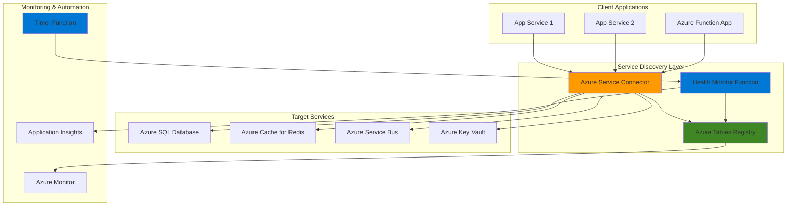

# Automated Service Discovery with Service Connector and Tables

## Problem

Modern microservices architectures require services to dynamically discover and connect to each other across distributed environments. Traditional service discovery approaches using hardcoded configurations or static load balancers create operational overhead, reduce system resilience, and make it difficult to scale services independently. Organizations need a centralized, automated solution that can manage service registration, health monitoring, and connection configuration while maintaining high availability and performance.

## Solution

Azure Service Connector provides automated connection management between Azure compute services and backing services, while Azure Tables offers a scalable NoSQL registry for service metadata. This solution combines these services with Azure Functions for health monitoring to create a comprehensive service discovery system that automatically manages service connections, tracks service health, and provides dynamic configuration updates without manual intervention.

## Architecture Diagram



## Prerequisites

1. Azure account with appropriate permissions for App Service, Functions, Storage, and Service Connector
2. Azure CLI v2.50.0 or later installed and configured (or Azure CloudShell)
3. Basic understanding of microservices architecture and service discovery patterns
4. Familiarity with Azure Functions and Azure Table storage concepts
5. Estimated cost: $20-40 per month for development resources (varies by region and usage)

> **Note**: This solution follows Azure Well-Architected Framework principles for reliability and operational excellence. Review the [Azure Architecture Center](https://learn.microsoft.com/en-us/azure/architecture/) for comprehensive guidance on microservices patterns.

## Preparation

```bash
# Set environment variables for Azure resources
export RESOURCE_GROUP="rg-service-discovery-$(openssl rand -hex 3)"
export LOCATION="eastus"
export SUBSCRIPTION_ID=$(az account show --query id --output tsv)

# Generate unique suffix for resource names
RANDOM_SUFFIX=$(openssl rand -hex 3)

# Set service-specific variables
export STORAGE_ACCOUNT="stdiscovery${RANDOM_SUFFIX}"
export FUNCTION_APP="func-discovery-${RANDOM_SUFFIX}"
export APP_SERVICE_PLAN="plan-discovery-${RANDOM_SUFFIX}"
export WEB_APP="app-discovery-${RANDOM_SUFFIX}"
export SQL_SERVER="sql-discovery-${RANDOM_SUFFIX}"
export SQL_DATABASE="ServiceRegistry"
export REDIS_CACHE="redis-discovery-${RANDOM_SUFFIX}"

# Create resource group
az group create \
    --name ${RESOURCE_GROUP} \
    --location ${LOCATION} \
    --tags purpose=service-discovery environment=demo

echo "✅ Resource group created: ${RESOURCE_GROUP}"

# Create storage account for Azure Tables and Functions
az storage account create \
    --name ${STORAGE_ACCOUNT} \
    --resource-group ${RESOURCE_GROUP} \
    --location ${LOCATION} \
    --sku Standard_LRS \
    --kind StorageV2

echo "✅ Storage account created: ${STORAGE_ACCOUNT}"

# Get storage connection string
export STORAGE_CONNECTION_STRING=$(az storage account show-connection-string \
    --name ${STORAGE_ACCOUNT} \
    --resource-group ${RESOURCE_GROUP} \
    --query connectionString --output tsv)
```

## Steps

1. **Create Azure Tables for Service Registry**:

   Azure Tables provides a scalable NoSQL data store perfect for service registry metadata. The schemaless design allows flexible service registration while maintaining fast query performance through partition and row keys. This creates the foundation for dynamic service discovery by storing service endpoints, health status, and configuration metadata.

   ```bash
   # Create service registry table
   az storage table create \
       --name "ServiceRegistry" \
       --account-name ${STORAGE_ACCOUNT} \
       --account-key $(az storage account keys list \
           --account-name ${STORAGE_ACCOUNT} \
           --resource-group ${RESOURCE_GROUP} \
           --query "[0].value" --output tsv)
   
   # Create health status table
   az storage table create \
       --name "HealthStatus" \
       --account-name ${STORAGE_ACCOUNT} \
       --account-key $(az storage account keys list \
           --account-name ${STORAGE_ACCOUNT} \
           --resource-group ${RESOURCE_GROUP} \
           --query "[0].value" --output tsv)
   
   echo "✅ Service registry tables created successfully"
   ```

   The service registry tables are now ready to store service metadata and health information. These tables will serve as the centralized store for service discovery, enabling dynamic service registration and health monitoring across your microservices architecture.

2. **Create Target Services for Discovery**:

   Setting up backing services that will be discovered by the service registry demonstrates real-world service discovery patterns. These services represent typical microservices dependencies like databases, caches, and message queues that need dynamic connection management.

   ```bash
   # Create Azure SQL Database
   az sql server create \
       --name ${SQL_SERVER} \
       --resource-group ${RESOURCE_GROUP} \
       --location ${LOCATION} \
       --admin-user sqladmin \
       --admin-password "SecurePassword123!"
   
   az sql db create \
       --resource-group ${RESOURCE_GROUP} \
       --server ${SQL_SERVER} \
       --name ${SQL_DATABASE} \
       --service-objective Basic
   
   # Create Azure Cache for Redis
   az redis create \
       --name ${REDIS_CACHE} \
       --resource-group ${RESOURCE_GROUP} \
       --location ${LOCATION} \
       --sku Basic \
       --vm-size C0
   
   echo "✅ Target services created for service discovery"
   ```

   The target services are now provisioned and ready for service discovery integration. These services will be registered in the service registry and managed through Azure Service Connector for automated connection management.

3. **Create Azure Function App for Health Monitoring**:

   Azure Functions provides serverless execution for health monitoring tasks that run on schedules and respond to events. This creates an automated system for continuously monitoring service health and updating the service registry with current status information.

   ```bash
   # Create App Service Plan for Functions
   az appservice plan create \
       --name ${APP_SERVICE_PLAN} \
       --resource-group ${RESOURCE_GROUP} \
       --location ${LOCATION} \
       --sku Y1 \
       --is-linux
   
   # Create Function App
   az functionapp create \
       --name ${FUNCTION_APP} \
       --resource-group ${RESOURCE_GROUP} \
       --plan ${APP_SERVICE_PLAN} \
       --storage-account ${STORAGE_ACCOUNT} \
       --runtime node \
       --runtime-version 18 \
       --functions-version 4
   
   # Configure Function App settings
   az functionapp config appsettings set \
       --name ${FUNCTION_APP} \
       --resource-group ${RESOURCE_GROUP} \
       --settings "STORAGE_CONNECTION_STRING=${STORAGE_CONNECTION_STRING}" \
                  "WEBSITE_NODE_DEFAULT_VERSION=18"
   
   echo "✅ Function App created for health monitoring"
   ```

   The Function App is now configured with access to the service registry tables and ready for health monitoring logic deployment. This serverless compute resource will automatically scale based on monitoring workload and provide cost-effective health checking capabilities.

4. **Deploy Health Monitoring Function**:

   The health monitoring function implements the core service discovery logic by periodically checking service health and updating the registry. This automated approach ensures service status is always current and enables rapid response to service failures.

   ```bash
   # Create function directory structure
   mkdir -p /tmp/health-monitor
   cd /tmp/health-monitor
   
   # Create package.json
   cat > package.json << 'EOF'
   {
     "name": "health-monitor",
     "version": "1.0.0",
     "dependencies": {
       "@azure/data-tables": "^13.2.2",
       "@azure/functions": "^4.0.0",
       "axios": "^1.6.0"
     }
   }
   EOF
   
   # Create host.json configuration
   cat > host.json << 'EOF'
   {
     "version": "2.0",
     "logging": {
       "applicationInsights": {
         "samplingSettings": {
           "isEnabled": true
         }
       }
     },
     "extensionBundle": {
       "id": "Microsoft.Azure.Functions.ExtensionBundle",
       "version": "[4.*, 5.0.0)"
     }
   }
   EOF
   
   # Create health monitor function
   mkdir -p HealthMonitor
   cat > HealthMonitor/function.json << 'EOF'
   {
     "bindings": [
       {
         "name": "myTimer",
         "type": "timerTrigger",
         "direction": "in",
         "schedule": "0 */5 * * * *"
       }
     ]
   }
   EOF
   
   # Create health monitor implementation
   cat > HealthMonitor/index.js << 'EOF'
   const { TableClient } = require('@azure/data-tables');
   const axios = require('axios');
   
   module.exports = async function (context, myTimer) {
       const storageConnectionString = process.env.STORAGE_CONNECTION_STRING;
       const registryClient = new TableClient(storageConnectionString, 'ServiceRegistry');
       const healthClient = new TableClient(storageConnectionString, 'HealthStatus');
       
       try {
           // Query all registered services
           const services = registryClient.listEntities();
           
           for await (const service of services) {
               const healthStatus = await checkServiceHealth(service);
               
               // Update health status in table
               await healthClient.upsertEntity({
                   partitionKey: service.partitionKey,
                   rowKey: service.rowKey,
                   serviceName: service.serviceName,
                   status: healthStatus.status,
                   lastChecked: new Date().toISOString(),
                   responseTime: healthStatus.responseTime,
                   errorMessage: healthStatus.errorMessage || ''
               });
               
               context.log(`Health check completed for ${service.serviceName}: ${healthStatus.status}`);
           }
       } catch (error) {
           context.log.error('Health monitoring failed:', error);
       }
   };
   
   async function checkServiceHealth(service) {
       try {
           const startTime = Date.now();
           const response = await axios.get(service.healthEndpoint || service.endpoint, {
               timeout: 5000,
               validateStatus: (status) => status < 500
           });
           
           const responseTime = Date.now() - startTime;
           
           return {
               status: response.status < 400 ? 'healthy' : 'unhealthy',
               responseTime: responseTime,
               errorMessage: response.status >= 400 ? `HTTP ${response.status}` : null
           };
       } catch (error) {
           return {
               status: 'unhealthy',
               responseTime: 0,
               errorMessage: error.message
           };
       }
   }
   EOF
   
   # Deploy function to Azure
   zip -r health-monitor.zip .
   az functionapp deployment source config-zip \
       --resource-group ${RESOURCE_GROUP} \
       --name ${FUNCTION_APP} \
       --src health-monitor.zip
   
   echo "✅ Health monitoring function deployed"
   ```

   The health monitoring function is now deployed and will automatically execute every 5 minutes to check service health. This provides continuous monitoring of all registered services and maintains up-to-date health status information in the service registry.

5. **Create Web Application for Service Discovery**:

   A web application demonstrates how client services consume the service discovery system. This shows the complete service discovery workflow from registration to consumption, including how applications can dynamically discover and connect to available services.

   ```bash
   # Create Web App
   az webapp create \
       --name ${WEB_APP} \
       --resource-group ${RESOURCE_GROUP} \
       --plan ${APP_SERVICE_PLAN} \
       --runtime "NODE:18-lts"
   
   # Configure Web App settings
   az webapp config appsettings set \
       --name ${WEB_APP} \
       --resource-group ${RESOURCE_GROUP} \
       --settings "STORAGE_CONNECTION_STRING=${STORAGE_CONNECTION_STRING}"
   
   echo "✅ Web application created for service discovery demo"
   ```

   The web application is now ready to demonstrate service discovery capabilities. This client application will register itself in the service registry and discover other services dynamically through the Azure Tables-based registry.

6. **Configure Service Connector Connections**:

   Azure Service Connector automates the connection configuration between compute services and backing services. This eliminates manual connection string management and provides secure, managed connections that automatically handle authentication and network configuration.

   ```bash
   # Connect Function App to Storage Tables
   az functionapp connection create storage-table \
       --resource-group ${RESOURCE_GROUP} \
       --name ${FUNCTION_APP} \
       --target-resource-group ${RESOURCE_GROUP} \
       --account ${STORAGE_ACCOUNT} \
       --connection "StorageConnection" \
       --client-type nodejs
   
   # Connect Web App to Storage Tables
   az webapp connection create storage-table \
       --resource-group ${RESOURCE_GROUP} \
       --name ${WEB_APP} \
       --target-resource-group ${RESOURCE_GROUP} \
       --account ${STORAGE_ACCOUNT} \
       --connection "ServiceRegistryConnection" \
       --client-type nodejs
   
   # Connect Web App to SQL Database
   az webapp connection create sql \
       --resource-group ${RESOURCE_GROUP} \
       --name ${WEB_APP} \
       --target-resource-group ${RESOURCE_GROUP} \
       --server ${SQL_SERVER} \
       --database ${SQL_DATABASE} \
       --connection "DatabaseConnection" \
       --client-type nodejs
   
   # Connect Web App to Redis Cache
   az webapp connection create redis \
       --resource-group ${RESOURCE_GROUP} \
       --name ${WEB_APP} \
       --target-resource-group ${RESOURCE_GROUP} \
       --server ${REDIS_CACHE} \
       --connection "CacheConnection" \
       --client-type nodejs
   
   echo "✅ Service Connector connections configured"
   ```

   Service Connector has now automated the connection management between your applications and backing services. These connections provide secure, managed access to services with automatic credential management and network configuration, following Azure security best practices.

7. **Deploy Service Registration Logic**:

   Service registration logic enables applications to automatically register themselves in the service discovery system. This creates a self-managing system where services announce their availability and capabilities without manual intervention.

   ```bash
   # Create service registration function
   mkdir -p /tmp/service-registrar
   cd /tmp/service-registrar
   
   # Create package.json
   cat > package.json << 'EOF'
   {
     "name": "service-registrar",
     "version": "1.0.0",
     "dependencies": {
       "@azure/data-tables": "^13.2.2",
       "@azure/functions": "^4.0.0"
     }
   }
   EOF
   
   # Create service registrar function
   mkdir -p ServiceRegistrar
   cat > ServiceRegistrar/function.json << 'EOF'
   {
     "bindings": [
       {
         "authLevel": "function",
         "type": "httpTrigger",
         "direction": "in",
         "name": "req",
         "methods": ["post"]
       },
       {
         "type": "http",
         "direction": "out",
         "name": "res"
       }
     ]
   }
   EOF
   
   cat > ServiceRegistrar/index.js << 'EOF'
   const { TableClient } = require('@azure/data-tables');
   
   module.exports = async function (context, req) {
       const storageConnectionString = process.env.STORAGE_CONNECTION_STRING;
       const registryClient = new TableClient(storageConnectionString, 'ServiceRegistry');
       
       try {
           const serviceInfo = req.body;
           
           // Validate required fields
           if (!serviceInfo.serviceName || !serviceInfo.endpoint) {
               context.res = {
                   status: 400,
                   body: { error: 'serviceName and endpoint are required' }
               };
               return;
           }
           
           // Create service registration entry
           const serviceEntity = {
               partitionKey: serviceInfo.serviceType || 'default',
               rowKey: serviceInfo.serviceName,
               serviceName: serviceInfo.serviceName,
               endpoint: serviceInfo.endpoint,
               healthEndpoint: serviceInfo.healthEndpoint || serviceInfo.endpoint,
               serviceType: serviceInfo.serviceType || 'default',
               version: serviceInfo.version || '1.0.0',
               tags: JSON.stringify(serviceInfo.tags || []),
               metadata: JSON.stringify(serviceInfo.metadata || {}),
               registeredAt: new Date().toISOString(),
               lastHeartbeat: new Date().toISOString()
           };
           
           await registryClient.upsertEntity(serviceEntity);
           
           context.res = {
               status: 200,
               body: { 
                   message: 'Service registered successfully',
                   serviceId: `${serviceEntity.partitionKey}:${serviceEntity.rowKey}`
               }
           };
           
           context.log(`Service registered: ${serviceInfo.serviceName}`);
           
       } catch (error) {
           context.log.error('Service registration failed:', error);
           context.res = {
               status: 500,
               body: { error: 'Service registration failed' }
           };
       }
   };
   EOF
   
   # Deploy service registrar
   zip -r service-registrar.zip .
   az functionapp deployment source config-zip \
       --resource-group ${RESOURCE_GROUP} \
       --name ${FUNCTION_APP} \
       --src service-registrar.zip
   
   echo "✅ Service registration logic deployed"
   ```

   The service registration function is now deployed and ready to accept service registration requests. Applications can now automatically register themselves by sending HTTP POST requests to this endpoint, creating a dynamic service registry.

8. **Create Service Discovery API**:

   The service discovery API provides a standardized interface for applications to discover available services. This API abstracts the complexity of querying the service registry and provides filtered, health-aware service discovery capabilities.

   ```bash
   # Create service discovery function
   mkdir -p /tmp/service-discovery
   cd /tmp/service-discovery
   
   # Create package.json
   cat > package.json << 'EOF'
   {
     "name": "service-discovery",
     "version": "1.0.0",
     "dependencies": {
       "@azure/data-tables": "^13.2.2",
       "@azure/functions": "^4.0.0"
     }
   }
   EOF
   
   # Create discovery function
   mkdir -p ServiceDiscovery
   cat > ServiceDiscovery/function.json << 'EOF'
   {
     "bindings": [
       {
         "authLevel": "function",
         "type": "httpTrigger",
         "direction": "in",
         "name": "req",
         "methods": ["get"]
       },
       {
         "type": "http",
         "direction": "out",
         "name": "res"
       }
     ]
   }
   EOF
   
   cat > ServiceDiscovery/index.js << 'EOF'
   const { TableClient } = require('@azure/data-tables');
   
   module.exports = async function (context, req) {
       const storageConnectionString = process.env.STORAGE_CONNECTION_STRING;
       const registryClient = new TableClient(storageConnectionString, 'ServiceRegistry');
       const healthClient = new TableClient(storageConnectionString, 'HealthStatus');
       
       try {
           const serviceType = req.query.serviceType;
           const serviceName = req.query.serviceName;
           const healthyOnly = req.query.healthyOnly === 'true';
           
           // Query services based on parameters
           let queryOptions = {};
           if (serviceType) {
               queryOptions.filter = `PartitionKey eq '${serviceType}'`;
           }
           if (serviceName) {
               queryOptions.filter = queryOptions.filter 
                   ? `${queryOptions.filter} and RowKey eq '${serviceName}'`
                   : `RowKey eq '${serviceName}'`;
           }
           
           const services = [];
           const servicesIterator = registryClient.listEntities(queryOptions);
           
           for await (const service of servicesIterator) {
               let healthStatus = null;
               
               // Get health status if requested
               if (healthyOnly) {
                   try {
                       healthStatus = await healthClient.getEntity(service.partitionKey, service.rowKey);
                   } catch (error) {
                       // Skip services without health data if healthyOnly is true
                       continue;
                   }
                   
                   if (healthStatus.status !== 'healthy') {
                       continue;
                   }
               }
               
               services.push({
                   serviceName: service.serviceName,
                   endpoint: service.endpoint,
                   healthEndpoint: service.healthEndpoint,
                   serviceType: service.serviceType,
                   version: service.version,
                   tags: JSON.parse(service.tags || '[]'),
                   metadata: JSON.parse(service.metadata || '{}'),
                   registeredAt: service.registeredAt,
                   lastHeartbeat: service.lastHeartbeat,
                   healthStatus: healthStatus ? {
                       status: healthStatus.status,
                       lastChecked: healthStatus.lastChecked,
                       responseTime: healthStatus.responseTime
                   } : null
               });
           }
           
           context.res = {
               status: 200,
               body: {
                   services: services,
                   count: services.length,
                   timestamp: new Date().toISOString()
               }
           };
           
       } catch (error) {
           context.log.error('Service discovery failed:', error);
           context.res = {
               status: 500,
               body: { error: 'Service discovery failed' }
           };
       }
   };
   EOF
   
   # Deploy service discovery API
   zip -r service-discovery.zip .
   az functionapp deployment source config-zip \
       --resource-group ${RESOURCE_GROUP} \
       --name ${FUNCTION_APP} \
       --src service-discovery.zip
   
   echo "✅ Service discovery API deployed"
   ```

   The service discovery API is now available to provide real-time service discovery capabilities. Applications can query this API to discover available services, filter by service type, and get health-aware results for reliable service consumption.

## Validation & Testing

1. **Verify Service Registry Tables**:

   ```bash
   # Check service registry table creation
   az storage table exists \
       --name "ServiceRegistry" \
       --account-name ${STORAGE_ACCOUNT}
   
   # Check health status table creation
   az storage table exists \
       --name "HealthStatus" \
       --account-name ${STORAGE_ACCOUNT}
   ```

   Expected output: `{"exists": true}` for both tables

2. **Test Service Registration**:

   ```bash
   # Get Function App URL
   FUNCTION_URL=$(az functionapp show \
       --name ${FUNCTION_APP} \
       --resource-group ${RESOURCE_GROUP} \
       --query defaultHostName --output tsv)
   
   # Register a test service
   curl -X POST "https://${FUNCTION_URL}/api/ServiceRegistrar" \
       -H "Content-Type: application/json" \
       -d '{
           "serviceName": "test-api",
           "endpoint": "https://test-api.example.com",
           "serviceType": "api",
           "version": "1.0.0",
           "tags": ["production", "rest-api"],
           "metadata": {"region": "eastus", "port": 443}
       }'
   ```

   Expected output: Service registration success message

3. **Test Service Discovery**:

   ```bash
   # Discover all services
   curl "https://${FUNCTION_URL}/api/ServiceDiscovery"
   
   # Discover services by type
   curl "https://${FUNCTION_URL}/api/ServiceDiscovery?serviceType=api"
   
   # Discover healthy services only
   curl "https://${FUNCTION_URL}/api/ServiceDiscovery?healthyOnly=true"
   ```

4. **Verify Service Connector Connections**:

   ```bash
   # List all connections for the web app
   az webapp connection list \
       --resource-group ${RESOURCE_GROUP} \
       --name ${WEB_APP} \
       --output table
   
   # List all connections for the function app
   az functionapp connection list \
       --resource-group ${RESOURCE_GROUP} \
       --name ${FUNCTION_APP} \
       --output table
   ```

5. **Monitor Health Check Function**:

   ```bash
   # Check function execution logs
   az functionapp logs tail \
       --name ${FUNCTION_APP} \
       --resource-group ${RESOURCE_GROUP}
   ```

## Cleanup

1. **Remove Service Connector connections**:

   ```bash
   # List and delete webapp connections
   az webapp connection list \
       --resource-group ${RESOURCE_GROUP} \
       --name ${WEB_APP} \
       --query "[].id" --output tsv | \
       xargs -r -I {} az resource delete --ids {}
   
   # List and delete function app connections
   az functionapp connection list \
       --resource-group ${RESOURCE_GROUP} \
       --name ${FUNCTION_APP} \
       --query "[].id" --output tsv | \
       xargs -r -I {} az resource delete --ids {}
   
   echo "✅ Service Connector connections deleted"
   ```

2. **Delete resource group and all resources**:

   ```bash
   # Delete resource group and all contained resources
   az group delete \
       --name ${RESOURCE_GROUP} \
       --yes \
       --no-wait
   
   echo "✅ Resource group deletion initiated: ${RESOURCE_GROUP}"
   echo "Note: Deletion may take several minutes to complete"
   ```

3. **Clean up local files**:

   ```bash
   # Remove temporary function code directories
   rm -rf /tmp/health-monitor
   rm -rf /tmp/service-registrar
   rm -rf /tmp/service-discovery
   
   echo "✅ Local temporary files cleaned up"
   ```

## Discussion

Azure Service Connector combined with Azure Tables creates a powerful service discovery platform that addresses the core challenges of microservices architecture. Service Connector eliminates the complexity of managing connection strings and credentials by providing automated, secure connections between compute services and backing services. This managed approach follows Azure security best practices and reduces operational overhead while ensuring connections remain secure and properly configured. For comprehensive guidance on Service Connector capabilities, see the [Azure Service Connector documentation](https://learn.microsoft.com/en-us/azure/service-connector/overview).

The service registry implemented with Azure Tables provides the scalability and performance needed for dynamic service discovery at enterprise scale. Tables' schemaless design allows flexible service metadata storage while maintaining fast query performance through effective partitioning strategies. The combination of partition keys based on service types and row keys based on service names enables efficient queries and supports thousands of service registrations with minimal latency. This approach aligns with the [Azure Well-Architected Framework](https://learn.microsoft.com/en-us/azure/architecture/framework/) principles of performance efficiency and scalability.

Azure Functions provides the serverless compute layer that makes the service discovery system cost-effective and highly available. The timer-triggered health monitoring function automatically scales based on the number of registered services and only consumes resources during execution. This event-driven approach ensures health monitoring operates efficiently while providing real-time service status updates. The HTTP-triggered registration and discovery APIs provide standardized interfaces that applications can easily integrate, following REST API best practices for service communication.

The integration of these services creates a comprehensive service discovery solution that supports modern microservices patterns including service mesh architectures, API gateways, and distributed application monitoring. By maintaining centralized service registry information while providing distributed access through APIs, this solution enables both service-to-service communication and external service monitoring through platforms like Application Insights and Azure Monitor.

> **Tip**: Use Azure Monitor and Application Insights to track service discovery API performance and set up alerts for service health status changes. The [Azure Functions monitoring guide](https://learn.microsoft.com/en-us/azure/azure-functions/functions-monitoring) provides detailed guidance on implementing comprehensive observability for your service discovery system.

## Challenge

Extend this dynamic service discovery solution by implementing these enhancements:

1. **Implement circuit breaker patterns** using Azure Functions to automatically isolate unhealthy services and implement fallback mechanisms for improved resilience.

2. **Add load balancing capabilities** by extending the service registry to track multiple instances per service and implement weighted routing algorithms based on health scores and response times.

3. **Create a service mesh integration** by connecting the service discovery system to Azure Service Fabric Mesh or Azure Container Apps with Dapr for advanced service-to-service communication patterns.

4. **Implement advanced health checks** including custom health endpoints, dependency health verification, and cascading health status updates for comprehensive service monitoring.

5. **Add security and authentication** by integrating Azure Active Directory and implementing service-to-service authentication tokens for secure service discovery and communication.

## Infrastructure Code

*Infrastructure code will be generated after recipe approval.*