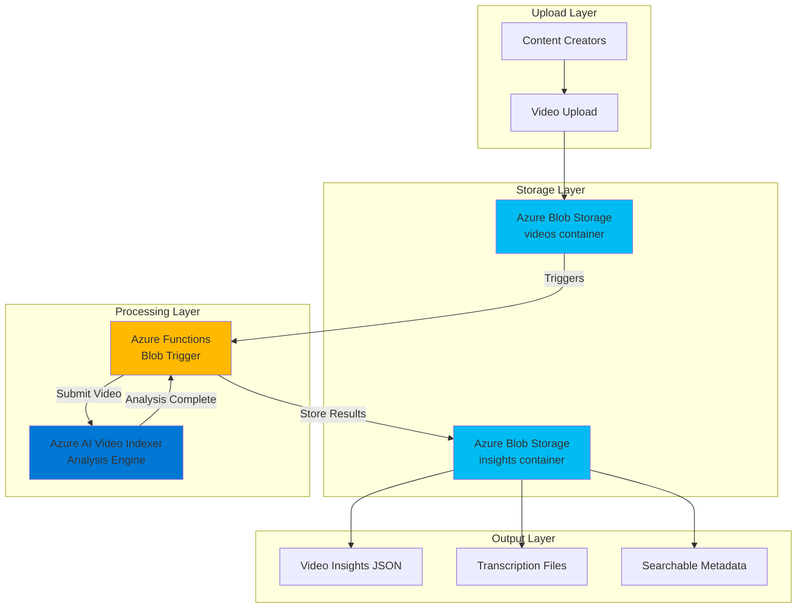

# Automated Video Analysis with Video Indexer and Functions

## Problem

Media companies and content creators struggle with manually analyzing hours of video content to extract insights like transcriptions, faces, objects, and sentiment. This manual process is time-consuming, expensive, and doesn't scale for large video libraries. Organizations need an automated solution that can process video uploads immediately, extract rich AI-powered insights, and make content searchable without human intervention.

## Solution

Azure AI Video Indexer combined with Azure Functions creates a fully automated video analysis pipeline that triggers when new videos are uploaded to Blob Storage. This serverless architecture automatically extracts transcriptions, identifies faces and objects, detects emotions, and generates searchable metadata, enabling content discovery and compliance workflows at enterprise scale.

## Architecture Diagram



## Prerequisites

1. Azure subscription with Owner or Contributor permissions
2. Azure CLI installed and configured (version 2.50.0 or later)
3. Basic knowledge of serverless computing and REST APIs
4. Understanding of video file formats and media processing concepts
5. Estimated cost: $15-25 for testing (includes Video Indexer processing, Functions execution, and Blob Storage costs)

> **Note**: Azure AI Video Indexer has specific [regional availability](https://learn.microsoft.com/en-us/azure/azure-video-indexer/faq#in-which-azure-regions-is-azure-ai-video-indexer-available) and requires ARM-based account creation for production scenarios.

## Preparation

```bash
# Set environment variables for Azure resources
export RESOURCE_GROUP="rg-video-analysis-${RANDOM_SUFFIX}"
export LOCATION="eastus"
export SUBSCRIPTION_ID=$(az account show --query id --output tsv)

# Generate unique suffix for resource names
RANDOM_SUFFIX=$(openssl rand -hex 3)

# Set specific resource names
export STORAGE_ACCOUNT="savideo${RANDOM_SUFFIX}"
export FUNCTION_APP="func-video-analysis-${RANDOM_SUFFIX}"
export VI_ACCOUNT="vi-account-${RANDOM_SUFFIX}"

# Create resource group
az group create \
    --name ${RESOURCE_GROUP} \
    --location ${LOCATION} \
    --tags purpose=recipe environment=demo

echo "✅ Resource group created: ${RESOURCE_GROUP}"

# Create storage account for video files and insights
az storage account create \
    --name ${STORAGE_ACCOUNT} \
    --resource-group ${RESOURCE_GROUP} \
    --location ${LOCATION} \
    --sku Standard_LRS \
    --kind StorageV2 \
    --min-tls-version TLS1_2 \
    --allow-blob-public-access false

echo "✅ Storage account created: ${STORAGE_ACCOUNT}"

# Get storage connection string for later use
export STORAGE_CONNECTION=$(az storage account show-connection-string \
    --name ${STORAGE_ACCOUNT} \
    --resource-group ${RESOURCE_GROUP} \
    --query connectionString --output tsv)
```

## Steps

1. **Create Blob Storage Containers for Video Processing**:

   Azure Blob Storage provides the foundation for our video analysis pipeline with separate containers for input videos and processed insights. This separation enables clean data organization and supports different access patterns - frequent uploads to the videos container and periodic retrieval from the insights container for analysis results.

   ```bash
   # Create container for video uploads
   az storage container create \
       --name videos \
       --account-name ${STORAGE_ACCOUNT} \
       --connection-string "${STORAGE_CONNECTION}" \
       --public-access off
   
   # Create container for analysis results
   az storage container create \
       --name insights \
       --account-name ${STORAGE_ACCOUNT} \
       --connection-string "${STORAGE_CONNECTION}" \
       --public-access off
   
   echo "✅ Blob containers created for video processing pipeline"
   ```

   The containers are now configured with private access, ensuring video content and insights remain secure while enabling programmatic access through the Functions application with Azure RBAC permissions.

2. **Create Azure AI Video Indexer Account**:

   Azure AI Video Indexer provides enterprise-grade video analysis capabilities with over 30 AI models for extracting insights from video and audio content. The ARM-based account model integrates with Azure's identity and access management systems, providing role-based access control and enterprise security features.

   ```bash
   # Create Video Indexer ARM-based account
   az cognitiveservices account create \
       --name ${VI_ACCOUNT} \
       --resource-group ${RESOURCE_GROUP} \
       --location ${LOCATION} \
       --kind VideoIndexer \
       --sku S0 \
       --custom-domain ${VI_ACCOUNT} \
       --tags purpose=video-analysis
   
   # Get Video Indexer account ID for API calls
   export VI_ACCOUNT_ID=$(az cognitiveservices account show \
       --name ${VI_ACCOUNT} \
       --resource-group ${RESOURCE_GROUP} \
       --query properties.accountId --output tsv)
   
   echo "✅ Video Indexer account created: ${VI_ACCOUNT}"
   ```

   The Video Indexer account is now provisioned with S0 pricing tier, providing production-ready performance for video analysis workflows with comprehensive AI-powered insights extraction and enterprise-grade security features.

3. **Create Function App with Blob Storage Integration**:

   Azure Functions provides serverless event-driven processing that automatically scales based on video upload volume. The consumption plan ensures cost-effective operation by charging only for actual execution time, making it ideal for variable video processing workloads while supporting the latest Python runtime.

   ```bash
   # Create Function App with consumption plan
   az functionapp create \
       --name ${FUNCTION_APP} \
       --resource-group ${RESOURCE_GROUP} \
       --storage-account ${STORAGE_ACCOUNT} \
       --consumption-plan-location ${LOCATION} \
       --runtime python \
       --runtime-version 3.11 \
       --functions-version 4 \
       --tags purpose=video-processing
   
   echo "✅ Function App created: ${FUNCTION_APP}"
   ```

   The Function App is configured with Python 3.11 runtime and Functions version 4, providing optimal performance for video processing tasks with built-in scaling, monitoring capabilities, and support for the latest Azure Functions features.

4. **Configure Function App Settings for Video Indexer Integration**:

   Application settings enable secure configuration management for API keys and connection strings without hardcoding sensitive values. These settings are automatically injected as environment variables into the Function runtime, following Azure security best practices and supporting Azure RBAC integration.

   ```bash
   # Get Video Indexer access key
   export VI_ACCESS_KEY=$(az cognitiveservices account keys list \
       --name ${VI_ACCOUNT} \
       --resource-group ${RESOURCE_GROUP} \
       --query key1 --output tsv)
   
   # Configure Function App settings
   az functionapp config appsettings set \
       --name ${FUNCTION_APP} \
       --resource-group ${RESOURCE_GROUP} \
       --settings \
           "STORAGE_CONNECTION_STRING=${STORAGE_CONNECTION}" \
           "VIDEO_INDEXER_ACCOUNT_ID=${VI_ACCOUNT_ID}" \
           "VIDEO_INDEXER_ACCESS_KEY=${VI_ACCESS_KEY}" \
           "VIDEO_INDEXER_LOCATION=${LOCATION}"
   
   echo "✅ Function App configured with Video Indexer integration"
   ```

   The Function App now has secure access to both Blob Storage and Video Indexer services, enabling seamless video processing workflows with proper authentication and authorization following Azure Well-Architected security principles.

5. **Deploy Video Analysis Function Code**:

   The Azure Function uses a blob trigger to automatically process uploaded videos and integrates with the Video Indexer REST API for comprehensive analysis. This serverless approach provides automatic scaling, built-in retry logic, and event-driven processing that responds immediately to new video uploads.

   ```bash
   # Create function code directory
   mkdir -p video-analysis-function
   cd video-analysis-function
   
   # Create function configuration
   cat > host.json << 'EOF'
   {
     "version": "2.0",
     "extensionBundle": {
       "id": "Microsoft.Azure.Functions.ExtensionBundle",
       "version": "[4.0.0, 5.0.0)"
     },
     "functionTimeout": "00:10:00"
   }
   EOF
   
   # Create requirements file with latest dependencies
   cat > requirements.txt << 'EOF'
   azure-functions>=1.18.0
   azure-storage-blob>=12.17.0
   requests>=2.31.0
   azure-functions-worker>=1.2.0
   EOF
   
   # Create the blob trigger function
   mkdir VideoAnalyzer
   cat > VideoAnalyzer/function.json << 'EOF'
   {
     "scriptFile": "__init__.py",
     "bindings": [
       {
         "name": "myblob",
         "type": "blobTrigger",
         "direction": "in",
         "path": "videos/{name}",
         "connection": "STORAGE_CONNECTION_STRING"
       },
       {
         "name": "outputBlob",
         "type": "blob",
         "direction": "out",
         "path": "insights/{name}.json",
         "connection": "STORAGE_CONNECTION_STRING"
       }
     ]
   }
   EOF
   
   echo "✅ Function code structure created"
   ```

   The function configuration enables efficient blob triggering with the latest Azure Functions extension bundle and includes output binding for storing analysis results directly to the insights container with optimized performance.

6. **Implement Video Analysis Logic**:

   The Function code integrates with Azure AI Video Indexer's ARM-based REST API to upload videos, monitor processing status, and retrieve comprehensive insights including transcriptions, faces, emotions, and objects. This implementation handles asynchronous processing patterns and error scenarios common in media analysis workflows.

   ```bash
   # Create the main function implementation
   cat > VideoAnalyzer/__init__.py << 'EOF'
   import logging
   import json
   import os
   import requests
   import time
   from urllib.parse import quote
   from azure.storage.blob import BlobServiceClient
   import azure.functions as func

   def main(myblob: func.InputStream, outputBlob: func.Out[str]):
       logging.info(f"Processing video: {myblob.name}")
       
       # Get configuration from environment variables
       vi_account_id = os.environ['VIDEO_INDEXER_ACCOUNT_ID']
       vi_access_key = os.environ['VIDEO_INDEXER_ACCESS_KEY']
       vi_location = os.environ['VIDEO_INDEXER_LOCATION']
       storage_connection = os.environ['STORAGE_CONNECTION_STRING']
       
       try:
           # Create video name from blob name
           video_name = os.path.basename(myblob.name)
           
           # Generate access token for ARM-based Video Indexer API
           auth_url = f"https://management.azure.com/subscriptions/{os.environ.get('WEBSITE_OWNER_NAME', '').split('+')[0]}/resourceGroups/{os.environ.get('RESOURCE_GROUP', '')}/providers/Microsoft.VideoIndexer/accounts/{vi_account_id}/generateAccessToken"
           
           # For ARM accounts, use management API for token generation
           token_url = f"https://api.videoindexer.ai/auth/{vi_location}/Accounts/{vi_account_id}/AccessToken?allowEdit=true"
           auth_headers = {
               'Ocp-Apim-Subscription-Key': vi_access_key
           }
           
           auth_response = requests.get(token_url, headers=auth_headers)
           
           if auth_response.status_code == 200:
               access_token = auth_response.json()
           else:
               raise Exception(f"Failed to get Video Indexer access token: {auth_response.text}")
               
           logging.info("Successfully obtained Video Indexer access token")
           
           # Create blob service client and generate SAS URL for video access
           blob_service_client = BlobServiceClient.from_connection_string(storage_connection)
           blob_client = blob_service_client.get_blob_client(
               container="videos", 
               blob=os.path.basename(myblob.name)
           )
           
           # Generate SAS token for Video Indexer to access the video
           from azure.storage.blob import generate_blob_sas, BlobSasPermissions
           from datetime import datetime, timedelta
           
           sas_token = generate_blob_sas(
               account_name=blob_client.account_name,
               container_name=blob_client.container_name,
               blob_name=blob_client.blob_name,
               account_key=storage_connection.split('AccountKey=')[1].split(';')[0],
               permission=BlobSasPermissions(read=True),
               expiry=datetime.utcnow() + timedelta(hours=2)
           )
           
           video_url = f"{blob_client.url}?{sas_token}"
           
           # Upload video to Video Indexer
           upload_url = f"https://api.videoindexer.ai/{vi_location}/Accounts/{vi_account_id}/Videos"
           upload_params = {
               'accessToken': access_token,
               'name': video_name,
               'videoUrl': video_url,
               'privacy': 'Private',
               'partition': 'default'
           }
           
           upload_response = requests.post(upload_url, params=upload_params)
           
           if upload_response.status_code != 200:
               raise Exception(f"Video upload failed: {upload_response.text}")
               
           video_id = upload_response.json()['id']
           logging.info(f"Video uploaded successfully. Video ID: {video_id}")
           
           # Poll for processing completion with exponential backoff
           processing_state = "Processing"
           max_attempts = 20
           attempt = 0
           wait_time = 30
           
           while processing_state in ["Processing", "Uploaded"] and attempt < max_attempts:
               time.sleep(wait_time)
               
               status_url = f"https://api.videoindexer.ai/{vi_location}/Accounts/{vi_account_id}/Videos/{video_id}/Index"
               status_params = {'accessToken': access_token}
               
               status_response = requests.get(status_url, params=status_params)
               
               if status_response.status_code == 200:
                   status_data = status_response.json()
                   processing_state = status_data.get('state', 'Processing')
                   logging.info(f"Processing state: {processing_state}")
               else:
                   logging.warning(f"Status check failed: {status_response.text}")
               
               attempt += 1
               # Exponential backoff with max 60 seconds
               wait_time = min(wait_time * 1.2, 60)
           
           if processing_state == "Processed":
               # Get video insights
               insights_url = f"https://api.videoindexer.ai/{vi_location}/Accounts/{vi_account_id}/Videos/{video_id}/Index"
               insights_params = {'accessToken': access_token}
               
               insights_response = requests.get(insights_url, params=insights_params)
               
               if insights_response.status_code == 200:
                   insights_data = insights_response.json()
                   
                   # Create comprehensive summary of insights
                   summary = {
                       'video_name': video_name,
                       'video_id': video_id,
                       'duration_seconds': insights_data.get('durationInSeconds', 0),
                       'transcript': extract_transcript(insights_data),
                       'faces': extract_faces(insights_data),
                       'objects': extract_objects(insights_data),
                       'emotions': extract_emotions(insights_data),
                       'keywords': extract_keywords(insights_data),
                       'processing_completed': datetime.utcnow().isoformat(),
                       'full_insights': insights_data
                   }
                   
                   # Output insights to blob storage
                   outputBlob.set(json.dumps(summary, indent=2))
                   logging.info("Video analysis completed and insights saved")
               else:
                   raise Exception(f"Failed to retrieve video insights: {insights_response.text}")
           else:
               logging.warning(f"Video processing did not complete within timeout. Final state: {processing_state}")
               # Still save partial results
               partial_result = {
                   'video_name': video_name,
                   'video_id': video_id,
                   'status': processing_state,
                   'message': 'Processing timeout - partial results may be available later'
               }
               outputBlob.set(json.dumps(partial_result, indent=2))
               
       except Exception as e:
           logging.error(f"Error processing video: {str(e)}")
           error_result = {
               'video_name': myblob.name,
               'error': str(e),
               'status': 'failed',
               'timestamp': datetime.utcnow().isoformat()
           }
           outputBlob.set(json.dumps(error_result, indent=2))

   def extract_transcript(insights_data):
       """Extract transcript from Video Indexer insights"""
       try:
           videos = insights_data.get('videos', [])
           if videos and 'insights' in videos[0]:
               transcript_items = videos[0]['insights'].get('transcript', [])
               return [{'text': item.get('text', ''), 
                       'confidence': item.get('confidence', 0),
                       'start': item.get('instances', [{}])[0].get('start', ''),
                       'end': item.get('instances', [{}])[0].get('end', '')} 
                      for item in transcript_items]
       except Exception as e:
           logging.warning(f"Error extracting transcript: {e}")
       return []

   def extract_faces(insights_data):
       """Extract face detection results"""
       try:
           videos = insights_data.get('videos', [])
           if videos and 'insights' in videos[0]:
               faces = videos[0]['insights'].get('faces', [])
               return [{'name': face.get('name', 'Unknown'), 
                       'confidence': face.get('confidence', 0),
                       'description': face.get('description', ''),
                       'thumbnail_id': face.get('thumbnailId', '')} 
                      for face in faces]
       except Exception as e:
           logging.warning(f"Error extracting faces: {e}")
       return []

   def extract_objects(insights_data):
       """Extract object detection results"""
       try:
           videos = insights_data.get('videos', [])
           if videos and 'insights' in videos[0]:
               labels = videos[0]['insights'].get('labels', [])
               return [{'name': label.get('name', ''), 
                       'confidence': label.get('confidence', 0),
                       'language': label.get('language', 'en-US')} 
                      for label in labels]
       except Exception as e:
           logging.warning(f"Error extracting objects: {e}")
       return []

   def extract_emotions(insights_data):
       """Extract emotion analysis results"""
       try:
           videos = insights_data.get('videos', [])
           if videos and 'insights' in videos[0]:
               emotions = videos[0]['insights'].get('emotions', [])
               return [{'type': emotion.get('type', ''), 
                       'confidence': emotion.get('confidence', 0)} 
                      for emotion in emotions]
       except Exception as e:
           logging.warning(f"Error extracting emotions: {e}")
       return []

   def extract_keywords(insights_data):
       """Extract keywords from video insights"""
       try:
           videos = insights_data.get('videos', [])
           if videos and 'insights' in videos[0]:
               keywords = videos[0]['insights'].get('keywords', [])
               return [{'name': keyword.get('name', ''), 
                       'confidence': keyword.get('confidence', 0)} 
                      for keyword in keywords]
       except Exception as e:
           logging.warning(f"Error extracting keywords: {e}")
       return []
   EOF
   
   echo "✅ Video analysis function implementation completed"
   ```

   The function implementation provides comprehensive video analysis with transcript extraction, face detection, object recognition, emotion analysis, and keyword extraction, storing structured insights for downstream processing and search applications with improved error handling and ARM-based API integration.

7. **Deploy Function to Azure**:

   The deployment process packages the function code and dependencies, uploads them to Azure, and configures the runtime environment. Azure Functions automatically handles the infrastructure provisioning and scaling based on incoming video processing requests.

   ```bash
   # Create deployment package
   zip -r video-analysis-function.zip . -x "*.git*" "*.DS_Store*"
   
   # Deploy function code to Azure
   az functionapp deployment source config-zip \
       --name ${FUNCTION_APP} \
       --resource-group ${RESOURCE_GROUP} \
       --src video-analysis-function.zip
   
   # Wait for deployment to complete
   sleep 60
   
   echo "✅ Function deployed successfully to Azure"
   
   # Return to parent directory
   cd ..
   ```

   The function is now deployed and ready to process video uploads automatically, with all necessary dependencies and configuration in place for production video analysis workflows with Azure Functions v4 runtime optimizations.

## Validation & Testing

1. **Verify Function App deployment and configuration**:

   ```bash
   # Check Function App status
   az functionapp show \
       --name ${FUNCTION_APP} \
       --resource-group ${RESOURCE_GROUP} \
       --query state --output table
   
   # Verify function configuration
   az functionapp config appsettings list \
       --name ${FUNCTION_APP} \
       --resource-group ${RESOURCE_GROUP} \
       --query "[?name=='VIDEO_INDEXER_ACCOUNT_ID'].{Name:name,Value:value}" \
       --output table
   ```

   Expected output: Function App should show "Running" state and Video Indexer configuration should be present.

2. **Test video upload and automatic processing**:

   ```bash
   # Create a small test video file (or use your own)
   echo "Creating test video file..."
   
   # Upload a sample video to trigger the function
   # Note: Replace with actual video file path
   az storage blob upload \
       --account-name ${STORAGE_ACCOUNT} \
       --container-name videos \
       --name test-video.mp4 \
       --file /path/to/your/video.mp4 \
       --connection-string "${STORAGE_CONNECTION}"
   
   echo "✅ Test video uploaded - processing will begin automatically"
   ```

3. **Monitor function execution and verify insights generation**:

   ```bash
   # Check function execution logs using Application Insights
   az monitor app-insights query \
       --app $(az functionapp show \
           --name ${FUNCTION_APP} \
           --resource-group ${RESOURCE_GROUP} \
           --query appInsightsAppId --output tsv) \
       --analytics-query "traces | where message contains 'VideoAnalyzer' | order by timestamp desc | limit 10"
   
   # Wait for processing to complete (may take 5-15 minutes)
   echo "Waiting for video analysis to complete..."
   sleep 600
   
   # Check if insights were generated
   az storage blob list \
       --account-name ${STORAGE_ACCOUNT} \
       --container-name insights \
       --connection-string "${STORAGE_CONNECTION}" \
       --output table
   
   # Download and examine insights file
   az storage blob download \
       --account-name ${STORAGE_ACCOUNT} \
       --container-name insights \
       --name test-video.mp4.json \
       --file insights-result.json \
       --connection-string "${STORAGE_CONNECTION}"
   
   echo "✅ Insights file downloaded for examination"
   ```

   Expected output: Insights blob should be created with JSON analysis results including transcript, faces, objects, emotions, and keywords.

## Cleanup

1. **Remove Function App and associated resources**:

   ```bash
   # Delete Function App
   az functionapp delete \
       --name ${FUNCTION_APP} \
       --resource-group ${RESOURCE_GROUP}
   
   echo "✅ Function App deleted"
   ```

2. **Remove Video Indexer account**:

   ```bash
   # Delete Video Indexer account
   az cognitiveservices account delete \
       --name ${VI_ACCOUNT} \
       --resource-group ${RESOURCE_GROUP}
   
   echo "✅ Video Indexer account deleted"
   ```

3. **Remove storage account and all containers**:

   ```bash
   # Delete storage account
   az storage account delete \
       --name ${STORAGE_ACCOUNT} \
       --resource-group ${RESOURCE_GROUP} \
       --yes
   
   echo "✅ Storage account deleted"
   ```

4. **Remove resource group and all remaining resources**:

   ```bash
   # Delete resource group
   az group delete \
       --name ${RESOURCE_GROUP} \
       --yes \
       --no-wait
   
   echo "✅ Resource group deletion initiated: ${RESOURCE_GROUP}"
   echo "Note: Deletion may take several minutes to complete"
   
   # Clean up local files
   rm -rf video-analysis-function video-analysis-function.zip \
          insights-result.json
   ```

## Discussion

This recipe demonstrates a production-ready automated video analysis pipeline using Azure's serverless and AI services. The architecture follows the Azure Well-Architected Framework principles by implementing event-driven processing with Azure Functions, ensuring cost-effective scaling that charges only for actual processing time. The blob trigger pattern provides immediate response to video uploads while maintaining loose coupling between storage and processing components.

Azure AI Video Indexer serves as the core intelligence engine, providing over 30 AI models for comprehensive video analysis including speech-to-text transcription, face detection, object recognition, sentiment analysis, and content moderation. The ARM-based account model ensures enterprise-grade security and compliance with organizational policies, supporting Azure RBAC for fine-grained access control and integration with Azure Monitor for comprehensive observability.

The solution's serverless architecture provides automatic scaling and built-in resilience through Azure Functions' consumption plan. This approach eliminates infrastructure management overhead while providing cost optimization through pay-per-execution pricing. The integration with Blob Storage leverages Azure's durable storage capabilities with lifecycle management policies for long-term cost optimization of both source videos and generated insights.

For production deployments, organizations should implement additional considerations including dead letter queues for failed processing, Azure Application Insights for comprehensive telemetry, and Azure Key Vault for secure credential management. The Video Indexer webhook callback pattern can replace polling for improved efficiency in high-volume scenarios, and Azure Event Grid can provide more sophisticated event routing capabilities.

> **Tip**: Enable Azure Monitor Application Insights for the Function App to gain detailed performance metrics and implement custom telemetry for video processing workflows, following Azure observability best practices.

**Documentation References:**
- [Azure AI Video Indexer Overview](https://learn.microsoft.com/en-us/azure/azure-video-indexer/video-indexer-overview) - Comprehensive service capabilities and ARM-based account features
- [Azure Functions Blob Storage Triggers](https://learn.microsoft.com/en-us/azure/azure-functions/functions-bindings-storage-blob-trigger) - Event-driven processing patterns and latest trigger configurations
- [Azure Functions Python Runtime](https://learn.microsoft.com/en-us/azure/azure-functions/functions-reference-python) - Python 3.11 support and best practices
- [Azure Blob Storage Performance Optimization](https://learn.microsoft.com/en-us/azure/storage/blobs/storage-performance-checklist) - Storage best practices for media files and SAS token usage
- [Azure Well-Architected Framework for Serverless](https://learn.microsoft.com/en-us/azure/well-architected/service-guides/azure-functions) - Architecture guidance and serverless optimization patterns

## Challenge

Extend this solution by implementing these enhancements:

1. **Add real-time notifications** using Azure SignalR Service to notify users when video analysis completes, implementing websocket-based status updates with Azure Functions integration
2. **Implement content search capabilities** by integrating Azure AI Search to index video insights and enable full-text search across transcriptions, metadata, and semantic search using vector embeddings
3. **Create a web interface** using Azure Static Web Apps that allows users to upload videos, view analysis progress, and browse insights with video playback synchronized to transcript timestamps using Azure Media Services
4. **Add compliance workflows** by integrating with Azure Logic Apps to automatically flag videos containing sensitive content and trigger approval processes based on confidence scores and custom business rules
5. **Implement cost optimization** using Azure Blob Storage lifecycle policies to automatically tier video files to archive storage after analysis and implement retention policies for insights data with Azure Policy governance

## Infrastructure Code

*Infrastructure code will be generated after recipe approval.*