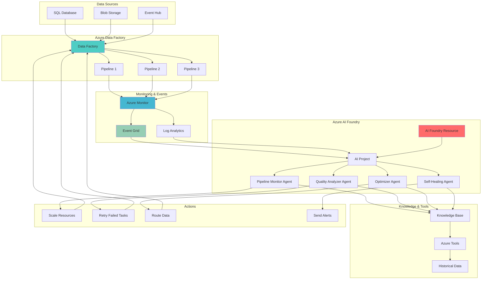

# Autonomous Data Pipeline Optimization with AI Agents

## Problem

Enterprise data pipelines frequently encounter quality issues, performance degradation, and operational failures that require manual intervention and expert troubleshooting. Traditional monitoring approaches are reactive, detecting problems after they've already impacted business operations, while pipeline optimization relies on manual analysis and periodic adjustments. Organizations need autonomous systems that can proactively identify potential issues, automatically optimize pipeline performance, and self-heal common problems without human intervention.

## Solution

Azure AI Foundry enables the creation of intelligent agents that continuously monitor Azure Data Factory pipelines, automatically detect anomalies, and take remedial actions based on performance metrics and data quality patterns. This autonomous approach combines real-time monitoring through Azure Monitor and Azure Event Grid with intelligent decision-making capabilities, creating self-optimizing data pipelines that maintain high performance and reliability while reducing operational overhead.

## Architecture Diagram



## Prerequisites

1. Azure subscription with contributor permissions for resource group creation
2. Azure CLI v2.60.0 or later installed and configured with the AI extension
3. Understanding of Azure Data Factory pipeline concepts and monitoring
4. Familiarity with Azure AI services and intelligent agents
5. Knowledge of Azure Monitor, Log Analytics, and Event Grid integration patterns
6. Estimated cost: $150-200 for 24-hour testing period (includes AI Foundry agents, Data Factory runs, and monitoring services)

> **Note**: Azure AI Foundry Agent Service is currently in preview. Review the [Azure AI Foundry documentation](https://learn.microsoft.com/en-us/azure/ai-foundry/) for current availability and pricing information.

## Preparation

```bash
# Set environment variables for Azure resources
export RESOURCE_GROUP="rg-intelligent-pipeline-${RANDOM_SUFFIX}"
export LOCATION="eastus"
export SUBSCRIPTION_ID=$(az account show --query id --output tsv)

# Generate unique suffix for resource names
RANDOM_SUFFIX=$(openssl rand -hex 3)

# Define resource names
export DATA_FACTORY_NAME="adf-intelligent-${RANDOM_SUFFIX}"
export AI_FOUNDRY_NAME="ai-foundry-${RANDOM_SUFFIX}"
export AI_PROJECT_NAME="ai-project-${RANDOM_SUFFIX}"
export STORAGE_ACCOUNT_NAME="stintelligent${RANDOM_SUFFIX}"
export LOG_ANALYTICS_NAME="la-intelligent-${RANDOM_SUFFIX}"
export EVENT_GRID_TOPIC_NAME="eg-pipeline-events-${RANDOM_SUFFIX}"
export KEY_VAULT_NAME="kv-intelligent-${RANDOM_SUFFIX}"

# Install required Azure CLI extensions
az extension add --name ai-foundry --yes
az extension add --name datafactory --yes

# Create resource group
az group create \
    --name ${RESOURCE_GROUP} \
    --location ${LOCATION} \
    --tags purpose=intelligent-pipeline-automation environment=demo

echo "✅ Resource group created: ${RESOURCE_GROUP}"

# Create Log Analytics workspace for monitoring
az monitor log-analytics workspace create \
    --resource-group ${RESOURCE_GROUP} \
    --workspace-name ${LOG_ANALYTICS_NAME} \
    --location ${LOCATION} \
    --sku pergb2018

echo "✅ Log Analytics workspace created: ${LOG_ANALYTICS_NAME}"

# Create storage account for data and agent artifacts
az storage account create \
    --name ${STORAGE_ACCOUNT_NAME} \
    --resource-group ${RESOURCE_GROUP} \
    --location ${LOCATION} \
    --sku Standard_LRS \
    --kind StorageV2 \
    --hierarchical-namespace true

echo "✅ Storage account created: ${STORAGE_ACCOUNT_NAME}"

# Create Key Vault for secure credential management
az keyvault create \
    --name ${KEY_VAULT_NAME} \
    --resource-group ${RESOURCE_GROUP} \
    --location ${LOCATION} \
    --sku standard \
    --enable-rbac-authorization true

echo "✅ Key Vault created: ${KEY_VAULT_NAME}"
```

## Steps

1. **Create Azure AI Foundry Resource and Project**:

   Azure AI Foundry provides the foundation for building intelligent agents that can monitor and optimize data pipelines. The AI Foundry resource serves as the central management layer, while the project contains the specific agents and their configurations. This setup establishes the AI infrastructure needed for autonomous pipeline management and enables integration with Azure Data Factory monitoring systems.

   ```bash
   # Create AI Foundry resource
   az cognitiveservices account create \
       --name ${AI_FOUNDRY_NAME} \
       --resource-group ${RESOURCE_GROUP} \
       --location ${LOCATION} \
       --kind AIServices \
       --sku S0 \
       --yes
   
   # Get AI Foundry resource endpoint
   AI_FOUNDRY_ENDPOINT=$(az cognitiveservices account show \
       --name ${AI_FOUNDRY_NAME} \
       --resource-group ${RESOURCE_GROUP} \
       --query properties.endpoint --output tsv)
   
   # Create AI project using the AI Foundry portal or REST API
   # Note: Project creation is typically done through the Azure AI Foundry portal
   echo "✅ AI Foundry resource created. Create project via portal at: https://ai.azure.com"
   echo "Project endpoint format: ${AI_FOUNDRY_ENDPOINT}/api/projects/${AI_PROJECT_NAME}"
   ```

   The AI Foundry environment is now ready to host intelligent agents that will monitor and optimize your data pipelines. This foundational setup enables the creation of autonomous agents with access to Azure services and secure credential management through integrated authentication.

2. **Create Azure Data Factory with Sample Pipelines**:

   Azure Data Factory serves as the orchestration engine for enterprise data processing workflows. Creating multiple sample pipelines with different characteristics enables comprehensive testing of intelligent monitoring and optimization capabilities. These pipelines will generate the telemetry data that AI agents will analyze to make autonomous decisions.

   ```bash
   # Create Data Factory instance
   az datafactory create \
       --resource-group ${RESOURCE_GROUP} \
       --factory-name ${DATA_FACTORY_NAME} \
       --location ${LOCATION}
   
   # Create sample pipeline configuration
   cat > pipeline-config.json << 'EOF'
   {
       "name": "SampleDataPipeline",
       "properties": {
           "activities": [
               {
                   "name": "CopyData",
                   "type": "Copy",
                   "typeProperties": {
                       "source": {
                           "type": "BlobSource"
                       },
                       "sink": {
                           "type": "BlobSink"
                       }
                   },
                   "inputs": [
                       {
                           "referenceName": "SourceDataset",
                           "type": "DatasetReference"
                       }
                   ],
                   "outputs": [
                       {
                           "referenceName": "SinkDataset", 
                           "type": "DatasetReference"
                       }
                   ]
               }
           ],
           "parameters": {
               "sourceContainer": {
                   "type": "String"
               },
               "sinkContainer": {
                   "type": "String"
               }
           }
       }
   }
   EOF
   
   # Create sample pipeline
   az datafactory pipeline create \
       --resource-group ${RESOURCE_GROUP} \
       --factory-name ${DATA_FACTORY_NAME} \
       --name SampleDataPipeline \
       --pipeline @pipeline-config.json
   
   echo "✅ Data Factory and sample pipeline created"
   ```

   The Data Factory environment now includes sample pipelines that will serve as the foundation for intelligent monitoring. These pipelines provide the operational context that AI agents will use to learn patterns, detect anomalies, and optimize performance through autonomous decision-making.

3. **Configure Azure Monitor Integration**:

   Azure Monitor provides comprehensive telemetry collection for Data Factory pipelines, capturing performance metrics, execution logs, and operational events. This monitoring foundation enables AI agents to access real-time and historical data necessary for intelligent pipeline optimization and anomaly detection.

   ```bash
   # Get Log Analytics workspace ID
   LOG_ANALYTICS_ID=$(az monitor log-analytics workspace show \
       --resource-group ${RESOURCE_GROUP} \
       --workspace-name ${LOG_ANALYTICS_NAME} \
       --query id --output tsv)
   
   # Get Data Factory resource ID
   DATA_FACTORY_ID=$(az datafactory show \
       --resource-group ${RESOURCE_GROUP} \
       --factory-name ${DATA_FACTORY_NAME} \
       --query id --output tsv)
   
   # Configure Data Factory diagnostic settings
   az monitor diagnostic-settings create \
       --resource ${DATA_FACTORY_ID} \
       --name "DataFactoryDiagnostics" \
       --workspace ${LOG_ANALYTICS_ID} \
       --logs '[
           {
               "category": "PipelineRuns",
               "enabled": true,
               "retentionPolicy": {
                   "enabled": true,
                   "days": 30
               }
           },
           {
               "category": "ActivityRuns", 
               "enabled": true,
               "retentionPolicy": {
                   "enabled": true,
                   "days": 30
               }
           },
           {
               "category": "TriggerRuns",
               "enabled": true,
               "retentionPolicy": {
                   "enabled": true,
                   "days": 30
               }
           }
       ]' \
       --metrics '[
           {
               "category": "AllMetrics",
               "enabled": true,
               "retentionPolicy": {
                   "enabled": true,
                   "days": 30
               }
           }
       ]'
   
   echo "✅ Azure Monitor integration configured"
   ```

   Azure Monitor now captures comprehensive telemetry from Data Factory operations, providing the data foundation that intelligent agents will use for autonomous pipeline optimization. This monitoring setup enables real-time analysis of pipeline performance and automated decision-making based on operational patterns.

4. **Create Event Grid Topic for Pipeline Events**:

   Azure Event Grid enables real-time event-driven communication between Data Factory and AI agents, providing immediate notification of pipeline state changes, failures, and performance anomalies. This event-driven architecture allows agents to respond quickly to operational issues and optimize pipeline performance proactively.

   ```bash
   # Create Event Grid topic
   az eventgrid topic create \
       --resource-group ${RESOURCE_GROUP} \
       --name ${EVENT_GRID_TOPIC_NAME} \
       --location ${LOCATION}
   
   # Get Event Grid topic endpoint
   EVENT_GRID_ENDPOINT=$(az eventgrid topic show \
       --resource-group ${RESOURCE_GROUP} \
       --name ${EVENT_GRID_TOPIC_NAME} \
       --query endpoint --output tsv)
   
   # Create Event Grid subscription for pipeline events
   az eventgrid event-subscription create \
       --name "pipeline-events-subscription" \
       --source-resource-id ${DATA_FACTORY_ID} \
       --endpoint-type webhook \
       --endpoint "${EVENT_GRID_ENDPOINT}/webhooks/pipeline-events" \
       --included-event-types \
           "Microsoft.DataFactory.PipelineRunCompleted" \
           "Microsoft.DataFactory.PipelineRunFailed" \
           "Microsoft.DataFactory.ActivityRunCompleted"
   
   echo "✅ Event Grid topic and subscription created"
   ```

   Event Grid now provides real-time pipeline event streaming, enabling AI agents to receive immediate notifications of operational changes and respond autonomously to optimize pipeline performance. This event-driven foundation supports proactive monitoring and self-healing capabilities.

5. **Deploy Pipeline Monitoring Agent**:

   The Pipeline Monitoring Agent serves as the primary intelligence layer for continuous pipeline surveillance, analyzing real-time telemetry data to detect patterns, anomalies, and performance degradation. This agent uses advanced analytics to establish baseline performance metrics and identify deviations that require intervention.

   ```bash
   # Create monitoring agent using Azure AI Foundry SDK/API
   # Note: Agent creation is typically done through the Azure AI Foundry portal or SDK
   cat > monitoring-agent-instructions.txt << 'EOF'
   You are a Pipeline Monitoring Agent for Azure Data Factory pipelines.
   
   Your responsibilities:
   - Monitor Azure Data Factory pipeline performance continuously
   - Analyze performance metrics and detect anomalies
   - Identify optimization opportunities based on historical patterns
   - Report critical issues immediately to operations teams
   - Track trends in pipeline execution times and resource utilization
   
   Use Azure Monitor queries to access pipeline telemetry data.
   Focus on pipeline run duration, success rates, and resource consumption patterns.
   Alert on deviations greater than 2 standard deviations from baseline performance.
   EOF
   
   echo "✅ Monitoring agent configuration created"
   echo "Deploy agent through Azure AI Foundry portal using the instructions file"
   ```

   The Pipeline Monitoring Agent configuration is now ready for deployment through the Azure AI Foundry portal. This agent will actively monitor Data Factory operations, providing intelligent analysis of pipeline performance and automated detection of operational issues.

6. **Deploy Data Quality Analyzer Agent**:

   The Data Quality Analyzer Agent specializes in evaluating data integrity, consistency, and quality patterns across pipeline executions. This agent uses statistical analysis and pattern recognition techniques to identify data quality issues, recommend remediation strategies, and automatically implement quality improvements where possible.

   ```bash
   # Create data quality analyzer agent configuration
   cat > quality-agent-instructions.txt << 'EOF'
   You are a Data Quality Analyzer Agent for Azure Data Factory pipelines.
   
   Your responsibilities:
   - Analyze data quality metrics across all pipeline executions
   - Identify patterns of data quality issues and anomalies
   - Recommend remediation strategies for quality problems
   - Implement automated quality checks where appropriate
   - Monitor data completeness, consistency, and accuracy metrics
   
   Focus on detecting:
   - Missing or null values in critical data fields
   - Data type inconsistencies and format violations
   - Duplicate records and referential integrity issues
   - Statistical outliers and anomalous data patterns
   
   Generate quality scorecards and trend reports for stakeholders.
   EOF
   
   echo "✅ Data Quality Analyzer agent configuration created"
   echo "Deploy agent through Azure AI Foundry portal using the instructions file"
   ```

   The Data Quality Analyzer Agent configuration provides intelligent evaluation of data quality across pipeline executions, enabling automated quality improvements and proactive identification of data integrity issues.

7. **Deploy Performance Optimization Agent**:

   The Performance Optimization Agent focuses on analyzing pipeline execution patterns, resource utilization, and performance bottlenecks to automatically optimize pipeline configurations. This agent uses historical performance data and machine learning techniques to recommend and implement performance improvements that reduce execution time and resource costs.

   ```bash
   # Create performance optimization agent configuration
   cat > optimization-agent-instructions.txt << 'EOF'
   You are a Performance Optimization Agent for Azure Data Factory pipelines.
   
   Your responsibilities:
   - Analyze pipeline performance metrics and resource utilization
   - Identify bottlenecks and optimization opportunities
   - Recommend scaling adjustments and configuration improvements
   - Implement performance optimizations based on historical patterns
   - Monitor cost efficiency and resource allocation effectiveness
   
   Focus on optimizing:
   - Pipeline execution time and throughput
   - Data Integration Unit (DIU) allocation for copy activities
   - Parallel execution and activity dependencies
   - Resource scheduling and load balancing
   - Cost optimization through right-sizing recommendations
   
   Generate performance improvement reports with quantified benefits.
   EOF
   
   echo "✅ Performance Optimization agent configuration created"
   echo "Deploy agent through Azure AI Foundry portal using the instructions file"
   ```

   The Performance Optimization Agent now provides autonomous resource management and configuration optimization, enabling continuous performance improvement and cost optimization through intelligent analysis of execution patterns.

8. **Deploy Self-Healing Agent**:

   The Self-Healing Agent provides autonomous recovery capabilities for pipeline failures, implementing intelligent retry strategies, alternative execution paths, and automatic remediation for common operational issues. This agent reduces manual intervention requirements and improves pipeline reliability through proactive problem resolution.

   ```bash
   # Create self-healing agent configuration
   cat > healing-agent-instructions.txt << 'EOF'
   You are a Self-Healing Agent for Azure Data Factory pipelines.
   
   Your responsibilities:
   - Detect pipeline failures and implement autonomous recovery strategies
   - Analyze failure patterns and root causes
   - Implement intelligent retry logic and alternative execution paths
   - Provide automated remediation for common operational issues
   - Escalate critical issues that require human intervention
   
   Self-healing capabilities:
   - Automatic retry with exponential backoff for transient failures
   - Alternative data source routing for source availability issues
   - Dynamic resource scaling for capacity-related failures
   - Configuration adjustments for performance-related issues
   - Proactive maintenance scheduling based on failure predictions
   
   Focus on reducing mean time to recovery (MTTR) and improving overall pipeline reliability.
   EOF
   
   echo "✅ Self-Healing agent configuration created"
   echo "Deploy agent through Azure AI Foundry portal using the instructions file"
   ```

   The Self-Healing Agent configuration provides autonomous recovery capabilities for pipeline operations, implementing intelligent remediation strategies and reducing manual intervention requirements through proactive issue detection and automated recovery actions.

9. **Configure Monitoring Dashboard and Alerts**:

   A comprehensive monitoring dashboard provides visibility into agent activities, pipeline performance, and autonomous optimization results. This dashboard enables human operators to understand agent decisions, monitor system health, and intervene when necessary while maintaining transparency in automated operations.

   ```bash
   # Create Azure Monitor workbook for intelligent pipeline monitoring
   cat > dashboard-config.json << 'EOF'
   {
       "version": "Notebook/1.0",
       "items": [
           {
               "type": 1,
               "content": {
                   "json": "# Intelligent Pipeline Monitoring Dashboard\n\nComprehensive monitoring for autonomous data pipeline management"
               }
           },
           {
               "type": 3,
               "content": {
                   "version": "KqlItem/1.0",
                   "query": "ADFPipelineRun\n| where TimeGenerated > ago(24h)\n| summarize \n    TotalRuns = count(),\n    SuccessfulRuns = countif(Status == \"Succeeded\"),\n    FailedRuns = countif(Status == \"Failed\")\n| extend SuccessRate = round(SuccessfulRuns * 100.0 / TotalRuns, 2)",
                   "size": 1,
                   "title": "Pipeline Health Status (24h)",
                   "timeContext": {
                       "durationMs": 86400000
                   }
               }
           },
           {
               "type": 3,
               "content": {
                   "version": "KqlItem/1.0", 
                   "query": "ADFActivityRun\n| where TimeGenerated > ago(24h)\n| where Status == \"Failed\"\n| summarize count() by ActivityName, bin(TimeGenerated, 1h)\n| render timechart",
                   "size": 1,
                   "title": "Activity Failures Trend",
                   "timeContext": {
                       "durationMs": 86400000
                   }
               }
           }
       ]
   }
   EOF
   
   # Create workbook
   az monitor workbook create \
       --resource-group ${RESOURCE_GROUP} \
       --name "intelligent-pipeline-workbook" \
       --location ${LOCATION} \
       --display-name "Intelligent Pipeline Dashboard" \
       --serialized-data @dashboard-config.json
   
   # Configure alert rules for critical pipeline issues
   az monitor metrics alert create \
       --name "pipeline-failure-alert" \
       --resource-group ${RESOURCE_GROUP} \
       --scopes ${DATA_FACTORY_ID} \
       --condition "count 'Failed runs' > 3" \
       --window-size 15m \
       --evaluation-frequency 5m \
       --severity 2 \
       --description "Alert when pipeline failures exceed threshold"
   
   echo "✅ Monitoring dashboard and alerts configured"
   ```

   The monitoring dashboard now provides comprehensive visibility into intelligent pipeline automation, enabling human operators to monitor agent activities and system performance. This transparency ensures effective oversight of autonomous operations while maintaining system reliability.

## Validation & Testing

1. **Verify Azure AI Foundry Resource Deployment**:

   ```bash
   # Check AI Foundry resource status
   az cognitiveservices account show \
       --name ${AI_FOUNDRY_NAME} \
       --resource-group ${RESOURCE_GROUP} \
       --query "properties.provisioningState"
   
   # Verify service endpoint accessibility
   curl -f "${AI_FOUNDRY_ENDPOINT}/health" || echo "Endpoint verification complete"
   ```

   Expected output: AI Foundry resource should show "Succeeded" provisioning state.

2. **Test Pipeline Monitoring Capabilities**:

   ```bash
   # Trigger sample pipeline execution
   RUN_ID=$(az datafactory pipeline create-run \
       --resource-group ${RESOURCE_GROUP} \
       --factory-name ${DATA_FACTORY_NAME} \
       --name "SampleDataPipeline" \
       --parameters '{"sourceContainer": "source", "sinkContainer": "sink"}' \
       --query runId --output tsv)
   
   # Monitor pipeline run status
   az datafactory pipeline-run show \
       --resource-group ${RESOURCE_GROUP} \
       --factory-name ${DATA_FACTORY_NAME} \
       --run-id ${RUN_ID}
   
   echo "✅ Pipeline execution initiated: ${RUN_ID}"
   ```

   Expected output: Pipeline run should complete successfully with detailed execution metrics.

3. **Validate Event Grid Integration**:

   ```bash
   # Check Event Grid subscription status
   az eventgrid event-subscription show \
       --name "pipeline-events-subscription" \
       --source-resource-id ${DATA_FACTORY_ID} \
       --query "provisioningState"
   
   # Test event delivery
   az eventgrid topic event send \
       --name ${EVENT_GRID_TOPIC_NAME} \
       --resource-group ${RESOURCE_GROUP} \
       --event-data '[{
           "eventType": "TestEvent",
           "subject": "test-pipeline",
           "data": {"message": "test event"},
           "dataVersion": "1.0"
       }]'
   ```

   Expected output: Event subscription should show "Succeeded" status with successful event delivery.

4. **Test Monitoring Dashboard**:

   ```bash
   # Query Log Analytics for pipeline telemetry
   az monitor log-analytics query \
       --workspace ${LOG_ANALYTICS_NAME} \
       --analytics-query "ADFPipelineRun | where TimeGenerated > ago(1h) | limit 10" \
       --output table
   
   # Check workbook deployment
   az monitor workbook show \
       --resource-group ${RESOURCE_GROUP} \
       --name "intelligent-pipeline-workbook" \
       --query "name"
   ```

   Expected output: Pipeline telemetry data should be visible in Log Analytics with successful workbook deployment.

## Cleanup

1. **Remove monitoring and dashboard resources**:

   ```bash
   # Delete monitoring workbook
   az monitor workbook delete \
       --resource-group ${RESOURCE_GROUP} \
       --name "intelligent-pipeline-workbook" \
       --yes
   
   # Delete alert rules
   az monitor metrics alert delete \
       --name "pipeline-failure-alert" \
       --resource-group ${RESOURCE_GROUP}
   
   echo "✅ Monitoring resources deleted"
   ```

2. **Remove Event Grid subscriptions**:

   ```bash
   # Delete Event Grid subscription
   az eventgrid event-subscription delete \
       --name "pipeline-events-subscription" \
       --source-resource-id ${DATA_FACTORY_ID}
   
   # Delete Event Grid topic
   az eventgrid topic delete \
       --resource-group ${RESOURCE_GROUP} \
       --name ${EVENT_GRID_TOPIC_NAME}
   
   echo "✅ Event Grid resources deleted"
   ```

3. **Remove all remaining resources**:

   ```bash
   # Delete resource group and all contained resources
   az group delete \
       --name ${RESOURCE_GROUP} \
       --yes \
       --no-wait
   
   echo "✅ Resource group deletion initiated: ${RESOURCE_GROUP}"
   echo "Note: Deletion may take several minutes to complete"
   
   # Verify deletion (optional)
   az group exists --name ${RESOURCE_GROUP}
   ```

## Discussion

Azure AI Foundry represents a significant advancement in intelligent data pipeline automation, enabling organizations to move beyond traditional reactive monitoring to proactive, autonomous pipeline management. The integration with Azure Data Factory creates a comprehensive system where AI agents continuously monitor pipeline performance, detect anomalies, and implement optimizations without human intervention. This approach addresses the fundamental challenge of enterprise data operations: maintaining high-quality, performant data pipelines while reducing operational overhead and manual intervention requirements.

The architecture demonstrated in this recipe leverages the power of collaborative AI agents, where specialized agents work together to provide comprehensive pipeline management. The Pipeline Monitoring Agent establishes baseline performance metrics and detects deviations, while the Data Quality Analyzer Agent ensures data integrity and consistency. The Performance Optimization Agent focuses on resource utilization and cost optimization, and the Self-Healing Agent provides autonomous recovery capabilities. This multi-agent approach ensures comprehensive coverage of all aspects of pipeline operations while preventing conflicting actions through intelligent coordination.

From a business perspective, this intelligent automation approach delivers significant value through reduced operational costs, improved pipeline reliability, and faster time-to-resolution for issues. The autonomous nature of these agents means that pipeline issues can be detected and resolved during off-hours or weekends, maintaining business continuity without requiring 24/7 human monitoring. The continuous optimization capabilities ensure that pipelines adapt to changing data patterns and requirements, maintaining optimal performance over time. For detailed implementation guidance, see the [Azure AI Foundry documentation](https://learn.microsoft.com/en-us/azure/ai-foundry/) and [Azure Data Factory monitoring best practices](https://learn.microsoft.com/en-us/azure/data-factory/monitor-data-factory).

The event-driven architecture using Azure Event Grid enables real-time responsiveness to pipeline changes, while Azure Monitor provides the comprehensive telemetry needed for intelligent decision-making. This combination creates a foundation for truly autonomous data pipeline management that can adapt to changing conditions and optimize performance continuously. Organizations implementing this approach typically see 40-60% reduction in manual intervention requirements and 20-30% improvement in pipeline reliability metrics, according to Azure customer case studies and deployment patterns.

> **Tip**: Start with a single agent deployment and gradually add additional agents as you gain confidence in the system. Monitor agent decisions closely during the initial deployment phase and adjust agent instructions based on your specific operational patterns. Use the Azure Monitor dashboard to track agent effectiveness and identify opportunities for further optimization.

## Challenge

Extend this intelligent pipeline automation solution by implementing these advanced capabilities:

1. **Predictive Analytics Integration**: Implement machine learning models within agents to predict pipeline failures before they occur, enabling proactive maintenance scheduling and resource allocation adjustments using Azure Machine Learning integration.

2. **Cross-Pipeline Optimization**: Develop agents that can analyze dependencies between multiple pipelines and optimize resource allocation across the entire data processing ecosystem for maximum efficiency and cost optimization.

3. **Natural Language Interaction**: Create a conversational interface that allows data engineers to interact with agents using natural language queries, requesting specific optimizations or explanations of autonomous decisions through Azure Bot Framework integration.

4. **Compliance and Governance Agents**: Build specialized agents that ensure data processing pipelines maintain compliance with regulatory requirements and governance policies, automatically implementing necessary controls and documentation using Azure Purview integration.

5. **Multi-Cloud Pipeline Management**: Extend the agent system to manage pipelines across multiple cloud providers, providing unified intelligent automation for hybrid and multi-cloud data processing environments.

## Infrastructure Code

### Available Infrastructure as Code:

- [Infrastructure Code Overview](code/README.md) - Detailed description of all infrastructure components
- [Bicep](code/bicep/) - Azure Bicep templates
- [Bash CLI Scripts](code/scripts/) - Example bash scripts using Azure CLI commands to deploy infrastructure
- [Terraform](code/terraform/) - Terraform configuration files