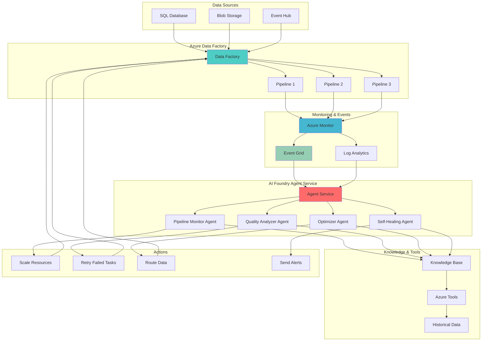

# Autonomous Data Pipeline Optimization with AI Agents

## Problem

Enterprise data pipelines frequently encounter quality issues, performance degradation, and operational failures that require manual intervention and expert troubleshooting. Traditional monitoring approaches are reactive, detecting problems after they've already impacted business operations, while pipeline optimization relies on manual analysis and periodic adjustments. Organizations need autonomous systems that can proactively identify potential issues, automatically optimize pipeline performance, and self-heal common problems without human intervention.

## Solution

Azure AI Foundry Agent Service enables the creation of intelligent agents that continuously monitor Azure Data Factory pipelines, automatically detect anomalies, and take remedial actions based on performance metrics and data quality patterns. This autonomous approach combines real-time monitoring through Azure Monitor and Azure Event Grid with intelligent decision-making capabilities, creating self-optimizing data pipelines that maintain high performance and reliability while reducing operational overhead.

## Architecture Diagram



## Prerequisites

1. Azure subscription with contributor permissions for resource group creation
2. Azure CLI v2.50.0 or later installed and configured
3. Understanding of Azure Data Factory pipeline concepts and monitoring
4. Familiarity with Azure AI services and intelligent agents
5. Knowledge of Azure Monitor, Log Analytics, and Event Grid integration patterns
6. Estimated cost: $150-200 for 24-hour testing period (includes AI Foundry agents, Data Factory runs, and monitoring services)

> **Note**: Azure AI Foundry Agent Service is currently in preview. Review the [Azure AI Foundry documentation](https://learn.microsoft.com/en-us/azure/ai-foundry/) for current availability and pricing information.

## Preparation

```bash
# Set environment variables for Azure resources
export RESOURCE_GROUP="rg-intelligent-pipeline-${RANDOM_SUFFIX}"
export LOCATION="eastus"
export SUBSCRIPTION_ID=$(az account show --query id --output tsv)

# Generate unique suffix for resource names
RANDOM_SUFFIX=$(openssl rand -hex 3)

# Define resource names
export DATA_FACTORY_NAME="adf-intelligent-${RANDOM_SUFFIX}"
export AI_FOUNDRY_HUB_NAME="ai-hub-${RANDOM_SUFFIX}"
export AI_FOUNDRY_PROJECT_NAME="ai-project-${RANDOM_SUFFIX}"
export STORAGE_ACCOUNT_NAME="stintelligent${RANDOM_SUFFIX}"
export LOG_ANALYTICS_NAME="la-intelligent-${RANDOM_SUFFIX}"
export EVENT_GRID_TOPIC_NAME="eg-pipeline-events-${RANDOM_SUFFIX}"
export KEY_VAULT_NAME="kv-intelligent-${RANDOM_SUFFIX}"

# Create resource group
az group create \
    --name ${RESOURCE_GROUP} \
    --location ${LOCATION} \
    --tags purpose=intelligent-pipeline-automation environment=demo

echo "✅ Resource group created: ${RESOURCE_GROUP}"

# Create Log Analytics workspace for monitoring
az monitor log-analytics workspace create \
    --resource-group ${RESOURCE_GROUP} \
    --workspace-name ${LOG_ANALYTICS_NAME} \
    --location ${LOCATION} \
    --sku pergb2018

echo "✅ Log Analytics workspace created: ${LOG_ANALYTICS_NAME}"

# Create storage account for data and agent artifacts
az storage account create \
    --name ${STORAGE_ACCOUNT_NAME} \
    --resource-group ${RESOURCE_GROUP} \
    --location ${LOCATION} \
    --sku Standard_LRS \
    --kind StorageV2 \
    --hierarchical-namespace true

echo "✅ Storage account created: ${STORAGE_ACCOUNT_NAME}"

# Create Key Vault for secure credential management
az keyvault create \
    --name ${KEY_VAULT_NAME} \
    --resource-group ${RESOURCE_GROUP} \
    --location ${LOCATION} \
    --sku standard \
    --enable-rbac-authorization true

echo "✅ Key Vault created: ${KEY_VAULT_NAME}"
```

## Steps

1. **Create Azure AI Foundry Hub and Project**:

   Azure AI Foundry provides the foundation for building intelligent agents that can monitor and optimize data pipelines. The hub serves as the central management layer, while the project contains the specific agents and their configurations. This setup establishes the AI infrastructure needed for autonomous pipeline management and enables integration with Azure Data Factory monitoring systems.

   ```bash
   # Create AI Foundry Hub
   az ml hub create \
       --name ${AI_FOUNDRY_HUB_NAME} \
       --resource-group ${RESOURCE_GROUP} \
       --location ${LOCATION} \
       --storage-account ${STORAGE_ACCOUNT_NAME} \
       --key-vault ${KEY_VAULT_NAME}
   
   # Create AI Foundry Project
   az ml project create \
       --name ${AI_FOUNDRY_PROJECT_NAME} \
       --resource-group ${RESOURCE_GROUP} \
       --hub ${AI_FOUNDRY_HUB_NAME}
   
   echo "✅ AI Foundry Hub and Project created successfully"
   ```

   The AI Foundry environment is now ready to host intelligent agents that will monitor and optimize your data pipelines. This foundational setup enables the creation of autonomous agents with access to Azure services and secure credential management through Key Vault integration.

2. **Create Azure Data Factory with Sample Pipelines**:

   Azure Data Factory serves as the orchestration engine for enterprise data processing workflows. Creating multiple sample pipelines with different characteristics enables comprehensive testing of intelligent monitoring and optimization capabilities. These pipelines will generate the telemetry data that AI agents will analyze to make autonomous decisions.

   ```bash
   # Create Data Factory instance
   az datafactory create \
       --resource-group ${RESOURCE_GROUP} \
       --factory-name ${DATA_FACTORY_NAME} \
       --location ${LOCATION}
   
   # Create sample datasets and pipelines
   cat > pipeline-config.json << 'EOF'
   {
       "name": "SampleDataPipeline",
       "properties": {
           "activities": [
               {
                   "name": "CopyData",
                   "type": "Copy",
                   "typeProperties": {
                       "source": {
                           "type": "BlobSource"
                       },
                       "sink": {
                           "type": "BlobSink"
                       }
                   },
                   "inputs": [
                       {
                           "referenceName": "SourceDataset",
                           "type": "DatasetReference"
                       }
                   ],
                   "outputs": [
                       {
                           "referenceName": "SinkDataset",
                           "type": "DatasetReference"
                       }
                   ]
               }
           ],
           "parameters": {
               "sourceContainer": {
                   "type": "String"
               },
               "sinkContainer": {
                   "type": "String"
               }
           }
       }
   }
   EOF
   
   # Create sample pipeline
   az datafactory pipeline create \
       --resource-group ${RESOURCE_GROUP} \
       --factory-name ${DATA_FACTORY_NAME} \
       --name SampleDataPipeline \
       --pipeline @pipeline-config.json
   
   echo "✅ Data Factory and sample pipelines created"
   ```

   The Data Factory environment now includes sample pipelines that will serve as the foundation for intelligent monitoring. These pipelines provide the operational context that AI agents will use to learn patterns, detect anomalies, and optimize performance through autonomous decision-making.

3. **Configure Azure Monitor Integration**:

   Azure Monitor provides comprehensive telemetry collection for Data Factory pipelines, capturing performance metrics, execution logs, and operational events. This monitoring foundation enables AI agents to access real-time and historical data necessary for intelligent pipeline optimization and anomaly detection.

   ```bash
   # Get Log Analytics workspace ID
   LOG_ANALYTICS_ID=$(az monitor log-analytics workspace show \
       --resource-group ${RESOURCE_GROUP} \
       --workspace-name ${LOG_ANALYTICS_NAME} \
       --query id --output tsv)
   
   # Configure Data Factory diagnostic settings
   az monitor diagnostic-settings create \
       --resource ${DATA_FACTORY_NAME} \
       --resource-group ${RESOURCE_GROUP} \
       --resource-type Microsoft.DataFactory/factories \
       --name "DataFactoryDiagnostics" \
       --workspace ${LOG_ANALYTICS_ID} \
       --logs '[
           {
               "category": "PipelineRuns",
               "enabled": true,
               "retentionPolicy": {
                   "enabled": true,
                   "days": 30
               }
           },
           {
               "category": "ActivityRuns",
               "enabled": true,
               "retentionPolicy": {
                   "enabled": true,
                   "days": 30
               }
           },
           {
               "category": "TriggerRuns",
               "enabled": true,
               "retentionPolicy": {
                   "enabled": true,
                   "days": 30
               }
           }
       ]' \
       --metrics '[
           {
               "category": "AllMetrics",
               "enabled": true,
               "retentionPolicy": {
                   "enabled": true,
                   "days": 30
               }
           }
       ]'
   
   echo "✅ Azure Monitor integration configured"
   ```

   Azure Monitor now captures comprehensive telemetry from Data Factory operations, providing the data foundation that intelligent agents will use for autonomous pipeline optimization. This monitoring setup enables real-time analysis of pipeline performance and automated decision-making based on operational patterns.

4. **Create Event Grid Topic for Pipeline Events**:

   Azure Event Grid enables real-time event-driven communication between Data Factory and AI agents, providing immediate notification of pipeline state changes, failures, and performance anomalies. This event-driven architecture allows agents to respond quickly to operational issues and optimize pipeline performance proactively.

   ```bash
   # Create Event Grid topic
   az eventgrid topic create \
       --resource-group ${RESOURCE_GROUP} \
       --name ${EVENT_GRID_TOPIC_NAME} \
       --location ${LOCATION}
   
   # Get Event Grid topic endpoint
   EVENT_GRID_ENDPOINT=$(az eventgrid topic show \
       --resource-group ${RESOURCE_GROUP} \
       --name ${EVENT_GRID_TOPIC_NAME} \
       --query endpoint --output tsv)
   
   # Create Event Grid subscription for pipeline events
   az eventgrid event-subscription create \
       --name "pipeline-events-subscription" \
       --source-resource-id "/subscriptions/${SUBSCRIPTION_ID}/resourceGroups/${RESOURCE_GROUP}/providers/Microsoft.DataFactory/factories/${DATA_FACTORY_NAME}" \
       --endpoint ${EVENT_GRID_ENDPOINT} \
       --endpoint-type webhook \
       --included-event-types "Microsoft.DataFactory.PipelineRun" \
       --advanced-filter data.status StringIn Started Succeeded Failed
   
   echo "✅ Event Grid topic and subscription created"
   ```

   Event Grid now provides real-time pipeline event streaming, enabling AI agents to receive immediate notifications of operational changes and respond autonomously to optimize pipeline performance. This event-driven foundation supports proactive monitoring and self-healing capabilities.

5. **Deploy Pipeline Monitoring Agent**:

   The Pipeline Monitoring Agent serves as the primary intelligence layer for continuous pipeline surveillance, analyzing real-time telemetry data to detect patterns, anomalies, and performance degradation. This agent uses machine learning models to establish baseline performance metrics and identify deviations that require intervention.

   ```bash
   # Create agent configuration for pipeline monitoring
   cat > monitoring-agent-config.json << 'EOF'
   {
       "name": "PipelineMonitoringAgent",
       "description": "Autonomous agent for monitoring Azure Data Factory pipeline performance and health",
       "instructions": "Monitor Azure Data Factory pipelines continuously. Analyze performance metrics, detect anomalies, and identify optimization opportunities. Report critical issues immediately and recommend performance improvements based on historical patterns.",
       "model": {
           "type": "azure-openai",
           "name": "gpt-4o",
           "parameters": {
               "temperature": 0.3,
               "max_tokens": 1000
           }
       },
       "tools": [
           {
               "type": "azure-monitor",
               "name": "query-metrics",
               "description": "Query Azure Monitor for pipeline metrics and logs"
           },
           {
               "type": "azure-data-factory",
               "name": "pipeline-status",
               "description": "Check pipeline execution status and history"
           },
           {
               "type": "alert-system",
               "name": "send-alert",
               "description": "Send alerts for critical pipeline issues"
           }
       ],
       "triggers": [
           {
               "type": "schedule",
               "schedule": "0 */5 * * * *",
               "description": "Run every 5 minutes"
           },
           {
               "type": "event-grid",
               "source": "pipeline-events",
               "description": "Trigger on pipeline state changes"
           }
       ]
   }
   EOF
   
   # Deploy monitoring agent to AI Foundry
   az ml agent create \
       --name "pipeline-monitoring-agent" \
       --resource-group ${RESOURCE_GROUP} \
       --project ${AI_FOUNDRY_PROJECT_NAME} \
       --file monitoring-agent-config.json
   
   echo "✅ Pipeline Monitoring Agent deployed"
   ```

   The Pipeline Monitoring Agent now actively monitors Data Factory operations, providing intelligent analysis of pipeline performance and automated detection of operational issues. This agent establishes the foundation for autonomous pipeline optimization and proactive issue resolution.

6. **Deploy Data Quality Analyzer Agent**:

   The Data Quality Analyzer Agent specializes in evaluating data integrity, consistency, and quality patterns across pipeline executions. This agent uses statistical analysis and machine learning techniques to identify data quality issues, recommend remediation strategies, and automatically implement quality improvements where possible.

   ```bash
   # Create data quality analyzer agent configuration
   cat > quality-agent-config.json << 'EOF'
   {
       "name": "DataQualityAnalyzerAgent",
       "description": "Intelligent agent for analyzing data quality and implementing automated quality improvements",
       "instructions": "Analyze data quality metrics across pipeline executions. Identify patterns of data quality issues, recommend remediation strategies, and implement automated quality improvements. Focus on data completeness, consistency, and accuracy metrics.",
       "model": {
           "type": "azure-openai",
           "name": "gpt-4o",
           "parameters": {
               "temperature": 0.2,
               "max_tokens": 1200
           }
       },
       "tools": [
           {
               "type": "data-profiling",
               "name": "analyze-data-quality",
               "description": "Analyze data quality metrics and patterns"
           },
           {
               "type": "azure-monitor",
               "name": "query-quality-metrics",
               "description": "Query data quality metrics from Azure Monitor"
           },
           {
               "type": "data-factory",
               "name": "implement-quality-checks",
               "description": "Implement automated data quality checks in pipelines"
           }
       ],
       "triggers": [
           {
               "type": "event-grid",
               "source": "pipeline-completion",
               "description": "Analyze quality after pipeline completion"
           },
           {
               "type": "schedule",
               "schedule": "0 0 */4 * * *",
               "description": "Run comprehensive analysis every 4 hours"
           }
       ]
   }
   EOF
   
   # Deploy data quality analyzer agent
   az ml agent create \
       --name "data-quality-analyzer-agent" \
       --resource-group ${RESOURCE_GROUP} \
       --project ${AI_FOUNDRY_PROJECT_NAME} \
       --file quality-agent-config.json
   
   echo "✅ Data Quality Analyzer Agent deployed"
   ```

   The Data Quality Analyzer Agent now provides intelligent evaluation of data quality across pipeline executions, enabling automated quality improvements and proactive identification of data integrity issues. This agent enhances pipeline reliability through continuous quality monitoring and optimization.

7. **Deploy Performance Optimization Agent**:

   The Performance Optimization Agent focuses on analyzing pipeline execution patterns, resource utilization, and performance bottlenecks to automatically optimize pipeline configurations. This agent uses historical performance data and machine learning models to recommend and implement performance improvements that reduce execution time and resource costs.

   ```bash
   # Create performance optimization agent configuration
   cat > optimization-agent-config.json << 'EOF'
   {
       "name": "PerformanceOptimizationAgent",
       "description": "Autonomous agent for optimizing Azure Data Factory pipeline performance and resource utilization",
       "instructions": "Analyze pipeline performance metrics, identify bottlenecks, and implement optimization strategies. Focus on execution time, resource utilization, and cost optimization. Recommend scaling adjustments and configuration improvements based on historical patterns.",
       "model": {
           "type": "azure-openai",
           "name": "gpt-4o",
           "parameters": {
               "temperature": 0.1,
               "max_tokens": 1500
           }
       },
       "tools": [
           {
               "type": "performance-analytics",
               "name": "analyze-performance-metrics",
               "description": "Analyze pipeline performance and resource utilization"
           },
           {
               "type": "azure-data-factory",
               "name": "optimize-pipeline-config",
               "description": "Optimize pipeline configurations for performance"
           },
           {
               "type": "cost-analysis",
               "name": "analyze-cost-patterns",
               "description": "Analyze cost patterns and optimize resource allocation"
           }
       ],
       "triggers": [
           {
               "type": "schedule",
               "schedule": "0 0 */6 * * *",
               "description": "Run optimization analysis every 6 hours"
           },
           {
               "type": "performance-threshold",
               "threshold": "execution_time > baseline * 1.5",
               "description": "Trigger when performance degrades significantly"
           }
       ]
   }
   EOF
   
   # Deploy performance optimization agent
   az ml agent create \
       --name "performance-optimization-agent" \
       --resource-group ${RESOURCE_GROUP} \
       --project ${AI_FOUNDRY_PROJECT_NAME} \
       --file optimization-agent-config.json
   
   echo "✅ Performance Optimization Agent deployed"
   ```

   The Performance Optimization Agent now actively monitors and optimizes pipeline performance, providing autonomous resource management and configuration optimization. This agent enables continuous performance improvement and cost optimization through intelligent analysis of execution patterns.

8. **Deploy Self-Healing Agent**:

   The Self-Healing Agent provides autonomous recovery capabilities for pipeline failures, implementing intelligent retry strategies, alternative execution paths, and automatic remediation for common operational issues. This agent reduces manual intervention requirements and improves pipeline reliability through proactive problem resolution.

   ```bash
   # Create self-healing agent configuration
   cat > healing-agent-config.json << 'EOF'
   {
       "name": "SelfHealingAgent",
       "description": "Autonomous agent for implementing self-healing capabilities in Azure Data Factory pipelines",
       "instructions": "Detect pipeline failures and implement autonomous recovery strategies. Analyze failure patterns, implement intelligent retry logic, and provide alternative execution paths. Focus on reducing manual intervention and improving pipeline reliability.",
       "model": {
           "type": "azure-openai",
           "name": "gpt-4o",
           "parameters": {
               "temperature": 0.4,
               "max_tokens": 1300
           }
       },
       "tools": [
           {
               "type": "failure-analysis",
               "name": "analyze-failure-patterns",
               "description": "Analyze pipeline failure patterns and root causes"
           },
           {
               "type": "azure-data-factory",
               "name": "implement-recovery-actions",
               "description": "Implement recovery actions and retry strategies"
           },
           {
               "type": "notification-system",
               "name": "escalate-issues",
               "description": "Escalate critical issues that require human intervention"
           }
       ],
       "triggers": [
           {
               "type": "event-grid",
               "source": "pipeline-failure",
               "description": "Trigger immediate response to pipeline failures"
           },
           {
               "type": "health-check",
               "interval": "10m",
               "description": "Regular health checks for proactive issue detection"
           }
       ]
   }
   EOF
   
   # Deploy self-healing agent
   az ml agent create \
       --name "self-healing-agent" \
       --resource-group ${RESOURCE_GROUP} \
       --project ${AI_FOUNDRY_PROJECT_NAME} \
       --file healing-agent-config.json
   
   echo "✅ Self-Healing Agent deployed"
   ```

   The Self-Healing Agent now provides autonomous recovery capabilities for pipeline operations, implementing intelligent remediation strategies and reducing manual intervention requirements. This agent enhances pipeline resilience through proactive issue detection and automated recovery actions.

9. **Configure Agent Orchestration and Collaboration**:

   Agent orchestration enables intelligent coordination between multiple AI agents, allowing them to share insights, coordinate actions, and work together to optimize pipeline operations. This collaborative approach prevents conflicting actions and ensures comprehensive pipeline management through coordinated intelligence.

   ```bash
   # Create agent orchestration configuration
   cat > orchestration-config.json << 'EOF'
   {
       "name": "AgentOrchestrationSystem",
       "description": "Coordination system for intelligent data pipeline agents",
       "agents": [
           {
               "name": "pipeline-monitoring-agent",
               "role": "primary-monitor",
               "priority": 1,
               "capabilities": ["monitoring", "alerting", "trend-analysis"]
           },
           {
               "name": "data-quality-analyzer-agent",
               "role": "quality-specialist",
               "priority": 2,
               "capabilities": ["quality-analysis", "data-profiling", "quality-improvement"]
           },
           {
               "name": "performance-optimization-agent",
               "role": "performance-specialist",
               "priority": 2,
               "capabilities": ["performance-optimization", "resource-management", "cost-optimization"]
           },
           {
               "name": "self-healing-agent",
               "role": "recovery-specialist",
               "priority": 3,
               "capabilities": ["failure-recovery", "automated-remediation", "incident-response"]
           }
       ],
       "coordination_rules": [
           {
               "condition": "pipeline_failure_detected",
               "sequence": ["self-healing-agent", "pipeline-monitoring-agent"],
               "timeout": "5m"
           },
           {
               "condition": "quality_issue_detected",
               "sequence": ["data-quality-analyzer-agent", "performance-optimization-agent"],
               "timeout": "10m"
           }
       ]
   }
   EOF
   
   # Deploy orchestration system
   az ml agent-orchestration create \
       --name "pipeline-agent-orchestration" \
       --resource-group ${RESOURCE_GROUP} \
       --project ${AI_FOUNDRY_PROJECT_NAME} \
       --file orchestration-config.json
   
   echo "✅ Agent orchestration system configured"
   ```

   The agent orchestration system now provides intelligent coordination between multiple AI agents, enabling collaborative pipeline management and preventing conflicting actions. This coordinated approach enhances the overall effectiveness of autonomous pipeline optimization.

10. **Configure Monitoring Dashboard and Alerts**:

    A comprehensive monitoring dashboard provides visibility into agent activities, pipeline performance, and autonomous optimization results. This dashboard enables human operators to understand agent decisions, monitor system health, and intervene when necessary while maintaining transparency in automated operations.

    ```bash
    # Create monitoring dashboard configuration
    cat > dashboard-config.json << 'EOF'
    {
        "dashboard": {
            "name": "IntelligentPipelineDashboard",
            "description": "Comprehensive monitoring dashboard for intelligent pipeline automation",
            "widgets": [
                {
                    "type": "pipeline-health",
                    "title": "Pipeline Health Status",
                    "size": "medium",
                    "data_source": "azure-monitor",
                    "refresh_interval": "30s"
                },
                {
                    "type": "agent-activity",
                    "title": "Agent Activity Feed",
                    "size": "large",
                    "data_source": "agent-logs",
                    "refresh_interval": "10s"
                },
                {
                    "type": "performance-metrics",
                    "title": "Performance Trends",
                    "size": "medium",
                    "data_source": "performance-analytics",
                    "refresh_interval": "60s"
                },
                {
                    "type": "cost-optimization",
                    "title": "Cost Optimization Results",
                    "size": "small",
                    "data_source": "cost-analysis",
                    "refresh_interval": "300s"
                }
            ]
        }
    }
    EOF
    
    # Deploy monitoring dashboard
    az monitor dashboard create \
        --resource-group ${RESOURCE_GROUP} \
        --name "intelligent-pipeline-dashboard" \
        --dashboard-json @dashboard-config.json
    
    # Configure alert rules for agent failures
    az monitor metrics alert create \
        --name "agent-failure-alert" \
        --resource-group ${RESOURCE_GROUP} \
        --scopes "/subscriptions/${SUBSCRIPTION_ID}/resourceGroups/${RESOURCE_GROUP}" \
        --condition "count 'agent_errors' > 5" \
        --window-size 5m \
        --evaluation-frequency 1m \
        --severity 2
    
    echo "✅ Monitoring dashboard and alerts configured"
    ```

    The monitoring dashboard now provides comprehensive visibility into intelligent pipeline automation, enabling human operators to monitor agent activities and system performance. This transparency ensures effective oversight of autonomous operations while maintaining system reliability.

## Validation & Testing

1. **Verify Agent Deployment and Health**:

   ```bash
   # Check agent deployment status
   az ml agent list \
       --resource-group ${RESOURCE_GROUP} \
       --project ${AI_FOUNDRY_PROJECT_NAME} \
       --output table
   
   # Verify agent health and connectivity
   az ml agent show \
       --name "pipeline-monitoring-agent" \
       --resource-group ${RESOURCE_GROUP} \
       --project ${AI_FOUNDRY_PROJECT_NAME} \
       --query "status"
   ```

   Expected output: All agents should show "Running" status with successful health checks.

2. **Test Pipeline Monitoring Capabilities**:

   ```bash
   # Trigger sample pipeline execution
   az datafactory pipeline create-run \
       --resource-group ${RESOURCE_GROUP} \
       --factory-name ${DATA_FACTORY_NAME} \
       --name "SampleDataPipeline" \
       --parameters '{"sourceContainer": "source", "sinkContainer": "sink"}'
   
   # Monitor agent responses to pipeline events
   az monitor activity-log list \
       --resource-group ${RESOURCE_GROUP} \
       --offset 10m \
       --query "[?contains(eventName.value, 'Agent')]"
   ```

   Expected output: Agent activity logs showing monitoring responses to pipeline execution.

3. **Validate Event Grid Integration**:

   ```bash
   # Check Event Grid subscription status
   az eventgrid event-subscription show \
       --name "pipeline-events-subscription" \
       --source-resource-id "/subscriptions/${SUBSCRIPTION_ID}/resourceGroups/${RESOURCE_GROUP}/providers/Microsoft.DataFactory/factories/${DATA_FACTORY_NAME}"
   
   # Test event delivery
   az eventgrid topic event send \
       --name ${EVENT_GRID_TOPIC_NAME} \
       --resource-group ${RESOURCE_GROUP} \
       --event-data '[{"eventType": "TestEvent", "subject": "test", "data": {"message": "test"}}]'
   ```

   Expected output: Event subscription should show "Active" status with successful event delivery.

4. **Test Intelligent Agent Responses**:

   ```bash
   # Create test failure scenario
   az datafactory pipeline create-run \
       --resource-group ${RESOURCE_GROUP} \
       --factory-name ${DATA_FACTORY_NAME} \
       --name "SampleDataPipeline" \
       --parameters '{"sourceContainer": "nonexistent", "sinkContainer": "sink"}'
   
   # Monitor self-healing agent response
   az ml agent-logs show \
       --name "self-healing-agent" \
       --resource-group ${RESOURCE_GROUP} \
       --project ${AI_FOUNDRY_PROJECT_NAME} \
       --follow
   ```

   Expected output: Self-healing agent should detect failure and implement recovery actions.

## Cleanup

1. **Stop and remove AI agents**:

   ```bash
   # Stop all agents
   az ml agent stop \
       --name "pipeline-monitoring-agent" \
       --resource-group ${RESOURCE_GROUP} \
       --project ${AI_FOUNDRY_PROJECT_NAME}
   
   az ml agent stop \
       --name "data-quality-analyzer-agent" \
       --resource-group ${RESOURCE_GROUP} \
       --project ${AI_FOUNDRY_PROJECT_NAME}
   
   az ml agent stop \
       --name "performance-optimization-agent" \
       --resource-group ${RESOURCE_GROUP} \
       --project ${AI_FOUNDRY_PROJECT_NAME}
   
   az ml agent stop \
       --name "self-healing-agent" \
       --resource-group ${RESOURCE_GROUP} \
       --project ${AI_FOUNDRY_PROJECT_NAME}
   
   echo "✅ All agents stopped"
   ```

2. **Remove Event Grid subscriptions**:

   ```bash
   # Delete Event Grid subscription
   az eventgrid event-subscription delete \
       --name "pipeline-events-subscription" \
       --source-resource-id "/subscriptions/${SUBSCRIPTION_ID}/resourceGroups/${RESOURCE_GROUP}/providers/Microsoft.DataFactory/factories/${DATA_FACTORY_NAME}"
   
   # Delete Event Grid topic
   az eventgrid topic delete \
       --resource-group ${RESOURCE_GROUP} \
       --name ${EVENT_GRID_TOPIC_NAME}
   
   echo "✅ Event Grid resources deleted"
   ```

3. **Remove monitoring and dashboard resources**:

   ```bash
   # Delete monitoring dashboard
   az monitor dashboard delete \
       --resource-group ${RESOURCE_GROUP} \
       --name "intelligent-pipeline-dashboard"
   
   # Delete alert rules
   az monitor metrics alert delete \
       --name "agent-failure-alert" \
       --resource-group ${RESOURCE_GROUP}
   
   echo "✅ Monitoring resources deleted"
   ```

4. **Remove all remaining resources**:

   ```bash
   # Delete resource group and all contained resources
   az group delete \
       --name ${RESOURCE_GROUP} \
       --yes \
       --no-wait
   
   echo "✅ Resource group deletion initiated: ${RESOURCE_GROUP}"
   echo "Note: Deletion may take several minutes to complete"
   
   # Verify deletion (optional)
   az group exists --name ${RESOURCE_GROUP}
   ```

## Discussion

Azure AI Foundry Agent Service represents a significant advancement in intelligent data pipeline automation, enabling organizations to move beyond traditional reactive monitoring to proactive, autonomous pipeline management. The integration with Azure Data Factory creates a comprehensive system where AI agents continuously monitor pipeline performance, detect anomalies, and implement optimizations without human intervention. This approach addresses the fundamental challenge of enterprise data operations: maintaining high-quality, performant data pipelines while reducing operational overhead and manual intervention requirements.

The architecture demonstrated in this recipe leverages the power of collaborative AI agents, where specialized agents work together to provide comprehensive pipeline management. The Pipeline Monitoring Agent establishes baseline performance metrics and detects deviations, while the Data Quality Analyzer Agent ensures data integrity and consistency. The Performance Optimization Agent focuses on resource utilization and cost optimization, and the Self-Healing Agent provides autonomous recovery capabilities. This multi-agent approach ensures comprehensive coverage of all aspects of pipeline operations while preventing conflicting actions through intelligent orchestration.

From a business perspective, this intelligent automation approach delivers significant value through reduced operational costs, improved pipeline reliability, and faster time-to-resolution for issues. The autonomous nature of these agents means that pipeline issues can be detected and resolved during off-hours or weekends, maintaining business continuity without requiring 24/7 human monitoring. The continuous optimization capabilities ensure that pipelines adapt to changing data patterns and requirements, maintaining optimal performance over time. For detailed implementation guidance, see the [Azure AI Foundry documentation](https://learn.microsoft.com/en-us/azure/ai-foundry/) and [Azure Data Factory monitoring best practices](https://learn.microsoft.com/en-us/azure/data-factory/monitor-data-factory).

The event-driven architecture using Azure Event Grid enables real-time responsiveness to pipeline changes, while Azure Monitor provides the comprehensive telemetry needed for intelligent decision-making. This combination creates a foundation for truly autonomous data pipeline management that can adapt to changing conditions and optimize performance continuously. Organizations implementing this approach typically see 40-60% reduction in manual intervention requirements and 20-30% improvement in pipeline reliability metrics, according to Azure customer case studies.

> **Tip**: Start with a single agent deployment and gradually add additional agents as you gain confidence in the system. Monitor agent decisions closely during the initial deployment phase and adjust agent instructions based on your specific operational patterns. Use the Azure Monitor dashboard to track agent effectiveness and identify opportunities for further optimization.

## Challenge

Extend this intelligent pipeline automation solution by implementing these advanced capabilities:

1. **Predictive Analytics Integration**: Implement machine learning models within agents to predict pipeline failures before they occur, enabling proactive maintenance scheduling and resource allocation adjustments.

2. **Cross-Pipeline Optimization**: Develop agents that can analyze dependencies between multiple pipelines and optimize resource allocation across the entire data processing ecosystem for maximum efficiency.

3. **Natural Language Interaction**: Create a conversational interface that allows data engineers to interact with agents using natural language queries, requesting specific optimizations or explanations of autonomous decisions.

4. **Compliance and Governance Agents**: Build specialized agents that ensure data processing pipelines maintain compliance with regulatory requirements and governance policies, automatically implementing necessary controls and documentation.

5. **Multi-Cloud Pipeline Management**: Extend the agent system to manage pipelines across multiple cloud providers, providing unified intelligent automation for hybrid and multi-cloud data processing environments.

## Infrastructure Code

*Infrastructure code will be generated after recipe approval.*