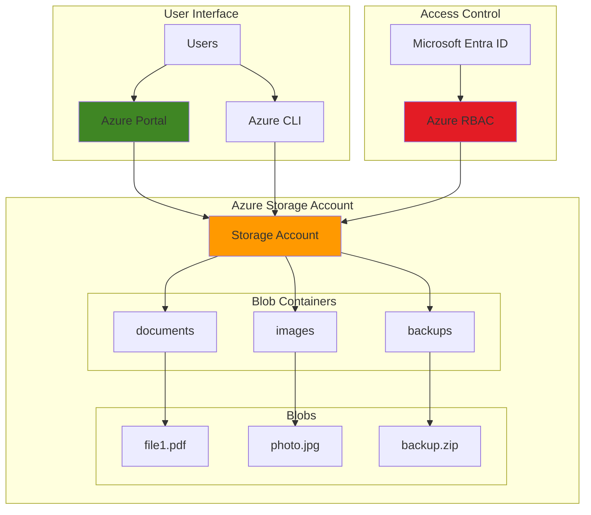

# Basic File Storage with Blob Storage and Portal

## Problem

Small businesses and individual developers need a simple, cost-effective way to store and access files in the cloud without managing complex infrastructure. They require basic file operations like upload, download, and organization through an intuitive interface, but existing on-premises solutions are limited by storage capacity, lack disaster recovery, and don't provide global accessibility for distributed teams.

## Solution

Azure Blob Storage provides scalable object storage with built-in redundancy and global accessibility through both Azure CLI and Azure Portal interfaces. This solution creates a storage account with blob containers that can organize files like folders, enabling secure file management with proper access controls and cost-effective storage tiers for different usage patterns.

## Architecture Diagram



## Prerequisites

1. Azure subscription with Owner or Contributor role on resource group
2. Azure CLI installed and configured (version 2.57.0 or later)
3. Basic understanding of cloud storage concepts
4. Web browser for Azure Portal access
5. Sample files for testing upload/download operations
6. Estimated cost: $0.02-0.05 per month for standard usage (first 5GB free tier)

> **Note**: This recipe uses locally redundant storage (LRS) and hot access tier for optimal learning experience. Production workloads should evaluate appropriate redundancy and access tier options based on business requirements.

## Preparation

```bash
# Login to Azure and set default subscription
az login

# Set environment variables for Azure resources
export RESOURCE_GROUP="rg-storage-demo-$(openssl rand -hex 3)"
export LOCATION="eastus"
export STORAGE_ACCOUNT="sa$(openssl rand -hex 6)"
export SUBSCRIPTION_ID=$(az account show --query id --output tsv)

# Generate unique suffix for resource naming
RANDOM_SUFFIX=$(openssl rand -hex 3)

# Create resource group for storage resources
az group create \
    --name ${RESOURCE_GROUP} \
    --location ${LOCATION} \
    --tags purpose=demo environment=learning

echo "✅ Resource group created: ${RESOURCE_GROUP}"
echo "✅ Storage account name: ${STORAGE_ACCOUNT}"
```

## Steps

1. **Create Storage Account with Security Best Practices**:

   Azure Storage accounts provide the foundation for all blob storage operations, offering 99.9% availability and multiple redundancy options. Standard performance tier provides cost-effective storage suitable for most applications, while the general-purpose v2 account type supports all Azure Storage services including blobs, files, tables, and queues. Security best practices include enforcing TLS 1.2 and disabling public blob access by default.

   ```bash
   # Create general-purpose v2 storage account with security hardening
   az storage account create \
       --name ${STORAGE_ACCOUNT} \
       --resource-group ${RESOURCE_GROUP} \
       --location ${LOCATION} \
       --sku Standard_LRS \
       --kind StorageV2 \
       --access-tier Hot \
       --min-tls-version TLS1_2 \
       --allow-blob-public-access false \
       --tags purpose=demo environment=learning
   
   echo "✅ Storage account created with TLS 1.2 enforcement and secure defaults"
   ```

   The storage account is now ready with locally redundant storage (LRS) for cost efficiency, hot access tier for frequently accessed data, and TLS 1.2 enforcement for enhanced security. Public access is disabled by default for security, requiring proper authentication for all operations.

2. **Configure RBAC Permissions for Data Access**:

   Azure Storage uses role-based access control (RBAC) to secure blob operations through Microsoft Entra ID integration. The Storage Blob Data Contributor role provides necessary permissions for blob operations without granting administrative access to the storage account itself, following the principle of least privilege and eliminating the need for shared access keys.

   ```bash
   # Get current user ID for RBAC assignment
   CURRENT_USER_ID=$(az ad signed-in-user show --query id --output tsv)
   
   # Assign Storage Blob Data Contributor role to current user
   az role assignment create \
       --role "Storage Blob Data Contributor" \
       --assignee ${CURRENT_USER_ID} \
       --scope "/subscriptions/${SUBSCRIPTION_ID}/resourceGroups/${RESOURCE_GROUP}/providers/Microsoft.Storage/storageAccounts/${STORAGE_ACCOUNT}"
   
   echo "✅ RBAC permissions configured for blob data access"
   echo "Note: Role assignment may take 1-2 minutes to propagate"
   ```

   This role assignment enables data plane operations like creating containers and uploading blobs while maintaining security boundaries. Role assignments may take 1-2 minutes to propagate across Azure's global infrastructure, providing enterprise-grade security without managing access keys.

3. **Create Blob Containers for File Organization**:

   Blob containers act like folders to organize your files logically within a flat namespace. Each container provides a secure boundary for blobs and can have different access policies applied. Creating multiple containers helps organize different types of content and apply appropriate security controls while supporting hierarchical naming patterns.

   ```bash
   # Wait for RBAC propagation before creating containers
   echo "Waiting 30 seconds for RBAC permissions to propagate..."
   sleep 30
   
   # Create containers for different content types
   az storage container create \
       --name "documents" \
       --account-name ${STORAGE_ACCOUNT} \
       --auth-mode login
   
   az storage container create \
       --name "images" \
       --account-name ${STORAGE_ACCOUNT} \
       --auth-mode login
   
   az storage container create \
       --name "backups" \
       --account-name ${STORAGE_ACCOUNT} \
       --auth-mode login
   
   echo "✅ Three containers created for organized file storage"
   ```

   The containers are now ready for file uploads with Microsoft Entra ID authentication. Each container supports unlimited blobs up to the storage account limits (500 TiB capacity), enabling scalable file organization patterns with logical separation of different content types.

4. **Upload Test Files Using Azure CLI**:

   Azure CLI provides efficient blob upload capabilities with automatic MD5 hash verification, progress tracking, and resume functionality for large files. This method is ideal for scripting and automation scenarios, supporting single files or entire directory structures with parallel uploads for optimal performance.

   ```bash
   # Create sample files for testing (if not available)
   echo "This is a sample document for testing blob storage capabilities." > sample-document.txt
   echo '{"app": "demo", "environment": "test", "version": "1.0"}' > config.json
   
   # Upload files to appropriate containers with hierarchical naming
   az storage blob upload \
       --file sample-document.txt \
       --name "sample-document.txt" \
       --container-name "documents" \
       --account-name ${STORAGE_ACCOUNT} \
       --auth-mode login
   
   az storage blob upload \
       --file config.json \
       --name "settings/config.json" \
       --container-name "documents" \
       --account-name ${STORAGE_ACCOUNT} \
       --auth-mode login
   
   echo "✅ Sample files uploaded successfully to blob storage"
   ```

   Files are now stored in Azure Blob Storage with automatic MD5 hash verification ensuring data integrity during transfer. The hierarchical namespace simulation using forward slashes enables logical folder structures within containers, supporting organized file management patterns.

5. **Access Files Through Azure Portal**:

   The Azure Portal provides an intuitive web interface for blob management, enabling drag-and-drop uploads, file preview capabilities, metadata editing, and real-time monitoring. This graphical interface is perfect for ad-hoc file management and provides accessibility for users who prefer visual interfaces over command-line tools.

   ```bash
   # Get storage account details for portal access
   echo "🌐 Access your storage account in the Azure Portal:"
   echo "https://portal.azure.com/#@/resource/subscriptions/${SUBSCRIPTION_ID}/resourceGroups/${RESOURCE_GROUP}/providers/Microsoft.Storage/storageAccounts/${STORAGE_ACCOUNT}/overview"
   
   # Display container access URLs and navigation instructions
   echo ""
   echo "📁 Portal navigation instructions:"
   echo "1. Navigate to Storage accounts > ${STORAGE_ACCOUNT}"
   echo "2. Select 'Storage browser' from the left menu"
   echo "3. Choose 'Blob containers' to view:"
   echo "   - documents (contains uploaded files)"
   echo "   - images (ready for image uploads)"
   echo "   - backups (ready for backup files)"
   ```

   Navigate to the provided URL to access your storage account through the Azure Portal. The Storage Browser provides comprehensive file management capabilities including upload, download, copy, move, and delete operations with real-time status updates and built-in file preview for supported formats.

6. **Download and Verify File Integrity**:

   Azure Blob Storage maintains file integrity through checksums and provides multiple download options with built-in verification. CLI downloads support resume functionality and parallel streams for large files, while the portal offers direct browser downloads with optional file preview capabilities.

   ```bash
   # Create download directory
   mkdir -p downloads
   
   # Download files from blob storage with verification
   az storage blob download \
       --name "sample-document.txt" \
       --container-name "documents" \
       --file "./downloads/downloaded-document.txt" \
       --account-name ${STORAGE_ACCOUNT} \
       --auth-mode login
   
   # Verify file content matches original
   if diff sample-document.txt ./downloads/downloaded-document.txt >/dev/null; then
       echo "✅ File downloaded and verified - content matches original"
   else
       echo "❌ File verification failed - content mismatch detected"
   fi
   ```

   The downloaded file maintains perfect fidelity with the original, demonstrating Azure Storage's data durability guarantees of 99.999999999% (11 9's). File metadata including creation time, content type, ETag, and custom properties are preserved during upload and download operations.

## Validation & Testing

1. **Verify storage account and containers exist**:

   ```bash
   # Check storage account status and configuration
   az storage account show \
       --name ${STORAGE_ACCOUNT} \
       --resource-group ${RESOURCE_GROUP} \
       --query "{name:name,sku:sku.name,location:location,provisioningState:provisioningState,minimumTlsVersion:minimumTlsVersion,allowBlobPublicAccess:allowBlobPublicAccess}" \
       --output table
   
   # List all containers with metadata
   az storage container list \
       --account-name ${STORAGE_ACCOUNT} \
       --auth-mode login \
       --output table
   ```

   Expected output: Storage account shows "Succeeded" provisioning state, TLS 1.2 minimum version, disabled public access, and three containers (documents, images, backups) are listed.

2. **Test blob operations and access permissions**:

   ```bash
   # List blobs in documents container
   az storage blob list \
       --container-name "documents" \
       --account-name ${STORAGE_ACCOUNT} \
       --auth-mode login \
       --output table
   
   # Test blob properties retrieval with security details
   az storage blob show \
       --name "sample-document.txt" \
       --container-name "documents" \
       --account-name ${STORAGE_ACCOUNT} \
       --auth-mode login \
       --query "{name:name,size:properties.contentLength,contentType:properties.contentType,lastModified:properties.lastModified,etag:properties.etag}"
   ```

   Expected output: Blobs are listed with correct names, sizes, timestamps, and ETags, confirming successful upload and proper access permissions through Microsoft Entra ID authentication.

3. **Validate cost and performance metrics**:

   ```bash
   # Check storage usage metrics for cost optimization
   az monitor metrics list \
       --resource "/subscriptions/${SUBSCRIPTION_ID}/resourceGroups/${RESOURCE_GROUP}/providers/Microsoft.Storage/storageAccounts/${STORAGE_ACCOUNT}" \
       --metric "UsedCapacity" \
       --output table
   ```

   Expected output: Metrics show current storage usage, typically a few KB for the test files, confirming cost-effective utilization within the free tier allowance.

## Cleanup

1. **Remove all blobs from containers**:

   ```bash
   # Delete all blobs in each container
   az storage blob delete-batch \
       --source "documents" \
       --account-name ${STORAGE_ACCOUNT} \
       --auth-mode login
   
   az storage blob delete-batch \
       --source "images" \
       --account-name ${STORAGE_ACCOUNT} \
       --auth-mode login
   
   az storage blob delete-batch \
       --source "backups" \
       --account-name ${STORAGE_ACCOUNT} \
       --auth-mode login
   
   echo "✅ All blobs deleted from containers"
   ```

2. **Delete storage account and resource group**:

   ```bash
   # Delete the entire resource group (includes storage account)
   az group delete \
       --name ${RESOURCE_GROUP} \
       --yes \
       --no-wait
   
   echo "✅ Resource group deletion initiated: ${RESOURCE_GROUP}"
   echo "Note: Complete deletion may take 2-3 minutes"
   ```

3. **Clean up local files and environment**:

   ```bash
   # Remove local test and download files
   rm -f sample-document.txt config.json
   rm -rf downloads/
   
   # Clear environment variables
   unset RESOURCE_GROUP LOCATION STORAGE_ACCOUNT SUBSCRIPTION_ID RANDOM_SUFFIX CURRENT_USER_ID
   
   echo "✅ Local cleanup completed"
   ```

## Discussion

Azure Blob Storage represents Microsoft's massively scalable object storage solution, designed to handle unstructured data at global scale while providing multiple access patterns and cost optimization options. The architecture demonstrated in this recipe showcases fundamental concepts that scale from simple file storage to enterprise data lakes supporting petabytes of data with integrated security and compliance features.

The choice of Standard_LRS (Locally Redundant Storage) provides cost-effective durability with 99.999999999% (11 9's) availability by maintaining three copies of data within a single datacenter. For production workloads requiring higher availability, consider Zone-Redundant Storage (ZRS) for protection against datacenter failures, or Geo-Redundant Storage (GRS) for disaster recovery across regions. The hot access tier optimizes for frequently accessed data, while cool and archive tiers offer significant cost savings for long-term storage scenarios with automated lifecycle management policies.

Role-based access control (RBAC) integration with Microsoft Entra ID provides enterprise-grade security without the complexity of managing access keys, following Azure's Zero Trust security model. The Storage Blob Data Contributor role exemplifies Azure's principle of least privilege, granting only necessary permissions for data operations while maintaining separation between control plane and data plane access. This security model scales seamlessly from individual users to complex organizational hierarchies with conditional access policies and multi-factor authentication requirements.

The combination of Azure CLI and Portal access demonstrates Azure's flexibility in supporting both programmatic automation and interactive management workflows. CLI operations excel at bulk operations, scripting, and CI/CD integration with support for parallel uploads and resume capabilities, while the Portal provides intuitive file management for ad-hoc operations and user-friendly access for non-technical stakeholders with built-in file preview and drag-and-drop functionality.

> **Tip**: For production environments, enable soft delete and versioning features to protect against accidental data loss. Consider implementing lifecycle management policies to automatically transition data to cooler tiers based on access patterns, optimizing storage costs while maintaining performance requirements. TLS 1.2 enforcement ensures compliance with modern security standards.

**Documentation Sources:**
- [Azure Blob Storage documentation](https://learn.microsoft.com/en-us/azure/storage/blobs/)
- [Azure Storage redundancy options](https://learn.microsoft.com/en-us/azure/storage/common/storage-redundancy)
- [Azure Storage access tiers](https://learn.microsoft.com/en-us/azure/storage/blobs/access-tiers-overview)
- [Azure RBAC best practices](https://learn.microsoft.com/en-us/azure/role-based-access-control/best-practices)
- [Azure Storage security recommendations](https://learn.microsoft.com/en-us/azure/storage/blobs/security-recommendations)
- [TLS 1.2 enforcement for Azure Storage](https://learn.microsoft.com/en-us/azure/storage/common/transport-layer-security-configure-minimum-version)

## Challenge

Extend this basic storage solution by implementing these enhancements:

1. **Implement lifecycle management policies** to automatically transition files to cool or archive tiers after 30 and 90 days respectively, reducing storage costs for infrequently accessed data while maintaining accessibility.

2. **Enable soft delete and blob versioning** to protect against accidental deletion and provide point-in-time recovery capabilities for critical business data with configurable retention periods.

3. **Configure Azure Storage Events** with Event Grid to trigger Azure Functions when files are uploaded, enabling automated processing workflows like image resizing, document indexing, or virus scanning.

4. **Set up cross-region replication** using geo-redundant storage (GRS) and implement read-access geo-redundant storage (RA-GRS) for disaster recovery scenarios with automated failover capabilities.

5. **Create custom RBAC roles** with fine-grained permissions for different user types, and implement Azure Policy to enforce organizational standards like mandatory encryption, access logging, and TLS version requirements across all storage accounts.

## Infrastructure Code

*Infrastructure code will be generated after recipe approval.*