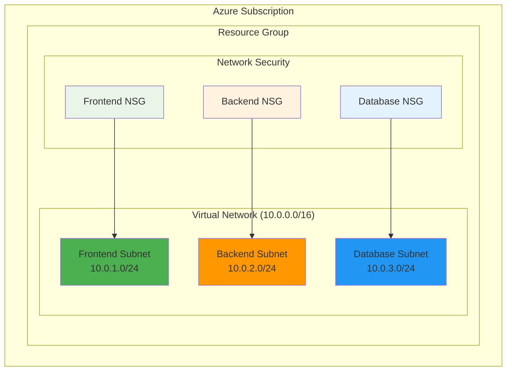

# Basic Network Setup with Virtual Network and Subnets

## Problem

Organizations deploying cloud applications need foundational network infrastructure to securely segment different application tiers and control traffic flow. Without proper network segmentation, applications lack security boundaries, making it difficult to implement proper access controls, comply with security policies, or isolate workloads based on their function and security requirements.

## Solution

Create an Azure Virtual Network with multiple subnets designed for different application tiers, establishing the fundamental networking foundation required for secure cloud deployments. This approach provides logical segmentation, enables proper security controls through Network Security Groups, and creates a scalable foundation for future infrastructure growth.

## Architecture Diagram



## Prerequisites

1. Azure account with subscription-level permissions to create resource groups and virtual networks
2. Azure CLI installed and configured (version 2.57 or later)
3. Basic understanding of networking concepts including CIDR notation and subnetting
4. Understanding of network security groups and firewall rules
5. Estimated cost: **$0.00** - Virtual Networks and Resource Groups are free of charge

> **Note**: Azure Virtual Networks have no usage charges and are completely free to create and use, making this an ideal starting point for learning Azure networking concepts.

## Preparation

```bash
# Set environment variables for Azure resources
export LOCATION="eastus"
export SUBSCRIPTION_ID=$(az account show --query id --output tsv)

# Generate unique suffix for resource names
RANDOM_SUFFIX=$(openssl rand -hex 3)
export RESOURCE_GROUP="rg-basic-network-${RANDOM_SUFFIX}"

# Set Virtual Network and subnet configuration
export VNET_NAME="vnet-basic-network-${RANDOM_SUFFIX}"
export VNET_ADDRESS_SPACE="10.0.0.0/16"
export FRONTEND_SUBNET_NAME="subnet-frontend"
export BACKEND_SUBNET_NAME="subnet-backend"
export DATABASE_SUBNET_NAME="subnet-database"

# Create resource group
az group create \
    --name ${RESOURCE_GROUP} \
    --location ${LOCATION} \
    --tags purpose=recipe environment=demo tier=networking

echo "✅ Resource group created: ${RESOURCE_GROUP}"
```

## Steps

1. **Create Virtual Network with Initial Subnet**:

   Azure Virtual Network (VNet) provides the fundamental networking layer for all Azure resources, creating an isolated private network environment within the Azure cloud. VNets support both IPv4 and IPv6 addressing, with automatic routing between subnets and built-in name resolution for connected resources. This logical isolation enables you to implement defense-in-depth security strategies as outlined in the [Azure Well-Architected Framework security pillar](https://learn.microsoft.com/en-us/azure/well-architected/security/).

   ```bash
   # Create Virtual Network with first subnet
   az network vnet create \
       --resource-group ${RESOURCE_GROUP} \
       --name ${VNET_NAME} \
       --location ${LOCATION} \
       --address-prefixes ${VNET_ADDRESS_SPACE} \
       --subnet-name ${FRONTEND_SUBNET_NAME} \
       --subnet-prefixes "10.0.1.0/24" \
       --tags purpose=recipe environment=demo

   echo "✅ Virtual Network created: ${VNET_NAME}"
   ```

   The Virtual Network now provides a private /16 address space with the first subnet configured for frontend services. This establishes the foundation for secure inter-resource communication within your Azure environment.

2. **Add Backend Application Subnet**:

   Subnets enable logical segmentation of the Virtual Network address space, allowing you to organize resources by function, security requirements, or compliance needs. Each subnet receives its own portion of the VNet's address space and can have independent security policies applied. This subnet-based segmentation follows [Azure networking best practices](https://learn.microsoft.com/en-us/azure/security/fundamentals/network-best-practices#logically-segment-subnets) for creating security boundaries within your application architecture.

   ```bash
   # Create backend subnet for application servers
   az network vnet subnet create \
       --resource-group ${RESOURCE_GROUP} \
       --vnet-name ${VNET_NAME} \
       --name ${BACKEND_SUBNET_NAME} \
       --address-prefixes "10.0.2.0/24"

   echo "✅ Backend subnet created: ${BACKEND_SUBNET_NAME}"
   ```

   The backend subnet is now available for application servers that should not be directly accessible from the internet, providing an additional layer of security through network isolation.

3. **Add Database Subnet for Data Tier**:

   Database subnets typically require the most restrictive network access policies, as they contain sensitive business data. By placing databases in a dedicated subnet, you can implement strict Network Security Group rules that only allow necessary database traffic from authorized application servers. This tier-based isolation is a fundamental component of the [defense-in-depth strategy](https://learn.microsoft.com/en-us/azure/well-architected/security/networking#key-design-strategies) recommended by the Azure Well-Architected Framework.

   ```bash
   # Create database subnet for data tier
   az network vnet subnet create \
       --resource-group ${RESOURCE_GROUP} \
       --vnet-name ${VNET_NAME} \
       --name ${DATABASE_SUBNET_NAME} \
       --address-prefixes "10.0.3.0/24"

   echo "✅ Database subnet created: ${DATABASE_SUBNET_NAME}"
   ```

   The three-tier subnet architecture is now complete, providing proper network segmentation that aligns with common application architecture patterns and security best practices.

4. **Create Network Security Group for Frontend**:

   Network Security Groups (NSGs) act as virtual firewalls that control inbound and outbound traffic at the subnet or network interface level. NSGs use a 5-tuple approach (source IP, source port, destination IP, destination port, and protocol) to evaluate traffic against security rules with priorities from 100 to 4096. As [stateful packet inspection devices](https://learn.microsoft.com/en-us/azure/security/fundamentals/network-best-practices#logically-segment-subnets), NSGs provide allow/deny rules for network traffic based on rule priorities.

   ```bash
   # Create NSG for frontend subnet
   az network nsg create \
       --resource-group ${RESOURCE_GROUP} \
       --name "nsg-${FRONTEND_SUBNET_NAME}" \
       --location ${LOCATION} \
       --tags purpose=recipe environment=demo tier=frontend

   # Add rule to allow HTTP traffic
   az network nsg rule create \
       --resource-group ${RESOURCE_GROUP} \
       --nsg-name "nsg-${FRONTEND_SUBNET_NAME}" \
       --name "Allow-HTTP" \
       --protocol tcp \
       --priority 1000 \
       --destination-port-ranges 80 \
       --access allow \
       --direction inbound \
       --source-address-prefixes "*"

   echo "✅ Frontend NSG created with HTTP rule"
   ```

   The frontend NSG now includes a rule allowing HTTP traffic, establishing the security foundation for web-facing resources while maintaining default deny-all behavior for unauthorized traffic.

5. **Create Network Security Group for Backend**:

   Backend Network Security Groups typically implement more restrictive policies, allowing only necessary communication from frontend services and blocking direct internet access. This follows the [defense-in-depth principle](https://learn.microsoft.com/en-us/azure/well-architected/security/networking#key-design-strategies) by creating multiple security layers that isolate application tiers and control traffic flow between them.

   ```bash
   # Create NSG for backend subnet
   az network nsg create \
       --resource-group ${RESOURCE_GROUP} \
       --name "nsg-${BACKEND_SUBNET_NAME}" \
       --location ${LOCATION} \
       --tags purpose=recipe environment=demo tier=backend

   # Add rule to allow traffic from frontend subnet
   az network nsg rule create \
       --resource-group ${RESOURCE_GROUP} \
       --nsg-name "nsg-${BACKEND_SUBNET_NAME}" \
       --name "Allow-From-Frontend" \
       --protocol tcp \
       --priority 1000 \
       --destination-port-ranges 8080 \
       --access allow \
       --direction inbound \
       --source-address-prefixes "10.0.1.0/24"

   echo "✅ Backend NSG created with frontend access rule"
   ```

   The backend NSG now restricts access to only accept traffic from the frontend subnet on application port 8080, implementing proper network segmentation and access control.

6. **Create Network Security Group for Database**:

   Database Network Security Groups implement the most restrictive policies, typically allowing only database traffic from authorized application servers. This creates the highest level of network security for sensitive data resources and aligns with [Azure network security best practices](https://learn.microsoft.com/en-us/azure/security/fundamentals/network-best-practices) for protecting data tier resources.

   ```bash
   # Create NSG for database subnet
   az network nsg create \
       --resource-group ${RESOURCE_GROUP} \
       --name "nsg-${DATABASE_SUBNET_NAME}" \
       --location ${LOCATION} \
       --tags purpose=recipe environment=demo tier=database

   # Add rule to allow database traffic from backend
   az network nsg rule create \
       --resource-group ${RESOURCE_GROUP} \
       --nsg-name "nsg-${DATABASE_SUBNET_NAME}" \
       --name "Allow-Database-From-Backend" \
       --protocol tcp \
       --priority 1000 \
       --destination-port-ranges 5432 \
       --access allow \
       --direction inbound \
       --source-address-prefixes "10.0.2.0/24"

   echo "✅ Database NSG created with backend access rule"
   ```

   The database NSG now allows only PostgreSQL traffic (port 5432) from the backend subnet, completing the secure three-tier network architecture.

7. **Associate Network Security Groups with Subnets**:

   Associating NSGs with subnets applies the security rules to all resources deployed within those subnets, providing automatic security policy enforcement. This subnet-level association is more efficient than individual network interface associations for uniform security policies and [enables NSG flow logging](https://learn.microsoft.com/en-us/azure/network-watcher/nsg-flow-logs-overview#best-practices) for security monitoring and compliance auditing.

   ```bash
   # Associate frontend NSG with frontend subnet
   az network vnet subnet update \
       --resource-group ${RESOURCE_GROUP} \
       --vnet-name ${VNET_NAME} \
       --name ${FRONTEND_SUBNET_NAME} \
       --network-security-group "nsg-${FRONTEND_SUBNET_NAME}"

   # Associate backend NSG with backend subnet
   az network vnet subnet update \
       --resource-group ${RESOURCE_GROUP} \
       --vnet-name ${VNET_NAME} \
       --name ${BACKEND_SUBNET_NAME} \
       --network-security-group "nsg-${BACKEND_SUBNET_NAME}"

   # Associate database NSG with database subnet
   az network vnet subnet update \
       --resource-group ${RESOURCE_GROUP} \
       --vnet-name ${VNET_NAME} \
       --name ${DATABASE_SUBNET_NAME} \
       --network-security-group "nsg-${DATABASE_SUBNET_NAME}"

   echo "✅ All NSGs associated with respective subnets"
   ```

   Network security policies are now automatically enforced for all resources deployed in each subnet, creating a comprehensive security foundation for the three-tier architecture.

## Validation & Testing

1. Verify Virtual Network was created successfully:

   ```bash
   # Check Virtual Network status and configuration
   az network vnet show \
       --resource-group ${RESOURCE_GROUP} \
       --name ${VNET_NAME} \
       --output table
   ```

   Expected output: Virtual Network details showing "Succeeded" provisioning state and correct address space.

2. List all subnets and verify address allocation:

   ```bash
   # List all subnets in the Virtual Network
   az network vnet subnet list \
       --resource-group ${RESOURCE_GROUP} \
       --vnet-name ${VNET_NAME} \
       --output table
   ```

   Expected output: Three subnets with correct names and address prefixes (10.0.1.0/24, 10.0.2.0/24, 10.0.3.0/24).

3. Verify Network Security Groups are properly associated:

   ```bash
   # Check NSG associations for each subnet
   for SUBNET in ${FRONTEND_SUBNET_NAME} ${BACKEND_SUBNET_NAME} ${DATABASE_SUBNET_NAME}; do
       echo "Checking NSG for subnet: ${SUBNET}"
       az network vnet subnet show \
           --resource-group ${RESOURCE_GROUP} \
           --vnet-name ${VNET_NAME} \
           --name ${SUBNET} \
           --query "networkSecurityGroup.id" --output tsv
   done
   ```

   Expected output: Each subnet should show an associated NSG resource ID.

4. Test Network Security Group rules:

   ```bash
   # Display NSG rules for frontend subnet
   az network nsg rule list \
       --resource-group ${RESOURCE_GROUP} \
       --nsg-name "nsg-${FRONTEND_SUBNET_NAME}" \
       --output table
   ```

   Expected output: Custom HTTP rule with priority 1000 plus default Azure security rules.

## Cleanup

1. Remove the entire resource group:

   ```bash
   # Delete resource group and all contained resources
   az group delete \
       --name ${RESOURCE_GROUP} \
       --yes \
       --no-wait

   echo "✅ Resource group deletion initiated: ${RESOURCE_GROUP}"
   echo "Note: Deletion may take several minutes to complete"
   ```

2. Verify deletion completion (optional):

   ```bash
   # Check if resource group still exists
   az group exists --name ${RESOURCE_GROUP}
   ```

3. Clear environment variables:

   ```bash
   # Clean up environment variables
   unset RESOURCE_GROUP LOCATION SUBSCRIPTION_ID RANDOM_SUFFIX
   unset VNET_NAME VNET_ADDRESS_SPACE FRONTEND_SUBNET_NAME 
   unset BACKEND_SUBNET_NAME DATABASE_SUBNET_NAME

   echo "✅ Environment variables cleared"
   ```

## Discussion

Azure Virtual Networks provide the foundational networking layer for cloud applications, enabling secure communication between resources while maintaining isolation from other networks. The three-tier subnet architecture demonstrated in this recipe follows industry best practices for application security, with frontend resources accessible from the internet, backend application servers isolated from direct external access, and database resources restricted to authorized application traffic only. This design implements the [Azure Well-Architected Framework security principles](https://learn.microsoft.com/en-us/azure/well-architected/security/principles) of explicit verification, least-privilege access, and assuming breach.

Network Security Groups act as virtual firewalls, using stateful packet inspection to evaluate traffic against security rules. The priority-based rule system allows for fine-grained control over network access, with lower priority numbers taking precedence. Default security rules provide basic connectivity for Azure platform services while denying unauthorized traffic, creating a secure-by-default network environment as described in the [Azure networking security best practices](https://learn.microsoft.com/en-us/azure/security/fundamentals/network-best-practices).

The subnet segmentation strategy aligns with the Azure Well-Architected Framework's security pillar, implementing [defense in depth through multiple layers of network controls](https://learn.microsoft.com/en-us/azure/well-architected/security/networking#key-design-strategies). By isolating different application tiers into separate subnets, organizations can apply appropriate security policies, monitor traffic patterns, and ensure compliance with regulatory requirements. This foundational setup supports future scaling and additional security enhancements such as Application Security Groups, Azure Firewall, or Network Virtual Appliances.

Cost optimization is inherent in this design, as Azure Virtual Networks and subnets have no usage charges, making them ideal for learning and development scenarios. The modular subnet approach also supports efficient resource allocation and management, allowing organizations to grow their infrastructure incrementally as business needs evolve.

> **Tip**: Use [Azure Monitor and Network Watcher](https://learn.microsoft.com/en-us/azure/network-watcher/) to gain visibility into network traffic patterns and performance metrics across your Virtual Network subnets, enabling proactive optimization and security monitoring through NSG flow logs and network topology analysis.

## Challenge

Extend this foundational network setup by implementing these enhancements:

1. **Add Application Security Groups** to provide more granular security controls within subnets, allowing rule-based access control for specific application roles rather than just subnet-based filtering.

2. **Implement Service Endpoints** for Azure Storage or Azure SQL Database to enable secure, private connectivity from your Virtual Network without exposing traffic to the public internet.

3. **Create a Hub-and-Spoke topology** by adding a second Virtual Network and implementing VNet peering to demonstrate enterprise-scale networking patterns with centralized shared services.

4. **Deploy Azure Bastion** in a dedicated subnet to provide secure RDP/SSH access to virtual machines without requiring public IP addresses or NSG rules for management traffic.

5. **Configure Network Watcher and Flow Logs** to monitor network traffic patterns, troubleshoot connectivity issues, and gain insights into security group rule effectiveness across all subnets.

## Infrastructure Code

*Infrastructure code will be generated after recipe approval.*