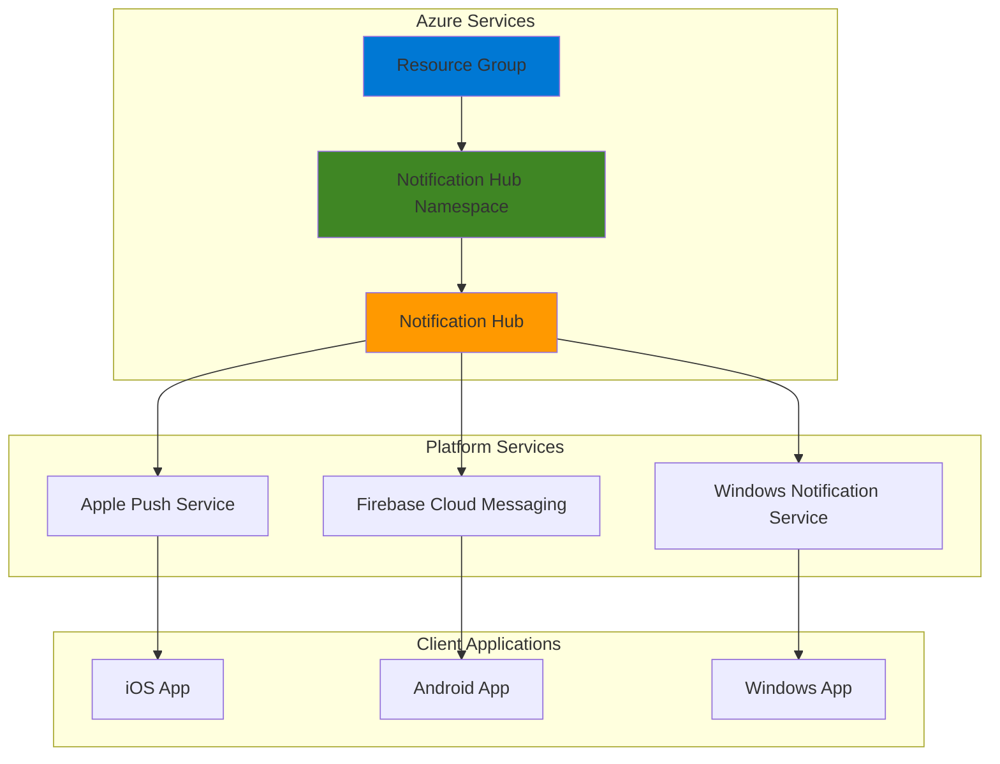

# Basic Push Notifications with Notification Hubs

## Problem

Mobile applications require reliable push notification capabilities to engage users with timely updates, alerts, and promotional messages. Setting up platform-specific notification services across iOS, Android, and Windows can be complex and time-consuming, requiring separate integrations with APNS, FCM, and WNS. Managing device registrations, handling failures, and scaling notification delivery across multiple platforms creates significant development overhead for mobile teams.

## Solution

Azure Notification Hubs provides a unified, serverless push notification engine that simplifies cross-platform notification delivery. This managed service abstracts platform-specific complexities, offering a single API to send notifications to any device platform with built-in scaling, device management, and delivery tracking. The hub-based architecture enables efficient broadcast and targeted messaging while providing enterprise-grade security and reliability.

## Architecture Diagram



## Prerequisites

1. Azure subscription with Contributor permissions for resource creation
2. Azure CLI installed and configured (version 2.67.0 or later for notification-hub extension)
3. Basic understanding of push notification concepts and mobile development
4. Mobile device or emulator for testing notifications (optional)
5. Estimated cost: $0.01-$0.10 for this tutorial (Free tier available for up to 1 million notifications)

> **Note**: Azure Notification Hubs offers a Free tier that includes 1 million push notifications and 500 active devices, making it cost-effective for development and small-scale applications.

## Preparation

```bash
# Set environment variables for Azure resources
export RESOURCE_GROUP="rg-notifications-${RANDOM_SUFFIX}"
export LOCATION="eastus"
export SUBSCRIPTION_ID=$(az account show --query id --output tsv)

# Generate unique suffix for resource names
RANDOM_SUFFIX=$(openssl rand -hex 3)

# Set Notification Hub specific variables
export NH_NAMESPACE="nh-namespace-${RANDOM_SUFFIX}"
export NH_NAME="notification-hub-${RANDOM_SUFFIX}"

# Create resource group
az group create \
    --name ${RESOURCE_GROUP} \
    --location ${LOCATION} \
    --tags purpose=recipe environment=demo

echo "✅ Resource group created: ${RESOURCE_GROUP}"
```

## Steps

1. **Create Notification Hub Namespace**:

   Azure Notification Hubs requires a namespace container that provides a unique messaging endpoint and security boundary for your notification hubs. The namespace acts as a logical container that can host multiple notification hubs, enabling you to organize hubs by application or environment while sharing management and security policies.

   ```bash
   # Create Notification Hub namespace
   az notification-hub namespace create \
       --resource-group ${RESOURCE_GROUP} \
       --name ${NH_NAMESPACE} \
       --location ${LOCATION} \
       --sku Free

   echo "✅ Notification Hub namespace created: ${NH_NAMESPACE}"
   ```

   The namespace provides the foundation for all notification operations, establishing the messaging infrastructure that will handle device registrations and notification delivery across all supported platforms.

2. **Create Notification Hub**:

   The notification hub is the core component that manages device registrations and handles notification distribution. Creating a hub within the namespace establishes the messaging endpoint that mobile applications will use for registration and that back-end services will use for sending notifications.

   ```bash
   # Create notification hub within the namespace
   az notification-hub create \
       --resource-group ${RESOURCE_GROUP} \
       --namespace-name ${NH_NAMESPACE} \
       --name ${NH_NAME} \
       --location ${LOCATION}

   echo "✅ Notification hub created: ${NH_NAME}"
   ```

   The notification hub now provides a centralized messaging service capable of handling millions of devices and notifications while maintaining high availability and consistent delivery performance.

3. **List Available Authorization Rules**:

   Azure Notification Hubs uses shared access signature (SAS) security with predefined authorization rules that control access to hub operations. Understanding available policies is crucial for properly configuring client applications and back-end services with appropriate permission levels.

   ```bash
   # List authorization rules for the notification hub
   az notification-hub authorization-rule list \
       --resource-group ${RESOURCE_GROUP} \
       --namespace-name ${NH_NAMESPACE} \
       --notification-hub-name ${NH_NAME} \
       --output table

   echo "✅ Listed authorization rules for ${NH_NAME}"
   ```

   This command reveals the default policies including "DefaultListenSharedAccessSignature" for client applications and "DefaultFullSharedAccessSignature" for administrative operations, each with specific permission levels for secure access control.

4. **Retrieve Listen Connection String**:

   The listen connection string enables client applications to register with the notification hub and receive notifications. This connection string provides the minimum required permissions for device registration while maintaining security through restricted access rights.

   ```bash
   # Get connection string for client applications
   LISTEN_CONNECTION=$(az notification-hub authorization-rule list-keys \
       --resource-group ${RESOURCE_GROUP} \
       --namespace-name ${NH_NAMESPACE} \
       --notification-hub-name ${NH_NAME} \
       --name DefaultListenSharedAccessSignature \
       --query primaryConnectionString --output tsv)

   echo "✅ Retrieved listen connection string"
   echo "Client connection string: ${LISTEN_CONNECTION:0:50}..."
   ```

   This connection string should be embedded in mobile applications for device registration, providing secure access to the hub without exposing administrative capabilities that could compromise security.

5. **Retrieve Full Access Connection String**:

   The full access connection string enables back-end applications to send notifications, manage registrations, and perform administrative operations. This elevated permission level is essential for server-side notification delivery and hub management.

   ```bash
   # Get connection string for back-end applications
   FULL_CONNECTION=$(az notification-hub authorization-rule list-keys \
       --resource-group ${RESOURCE_GROUP} \
       --namespace-name ${NH_NAMESPACE} \
       --notification-hub-name ${NH_NAME} \
       --name DefaultFullSharedAccessSignature \
       --query primaryConnectionString --output tsv)

   echo "✅ Retrieved full access connection string"
   echo "Server connection string: ${FULL_CONNECTION:0:50}..."
   ```

   This connection string should be secured and used only in trusted server environments to prevent unauthorized access to notification hub management functions and user data.

6. **Send Test Notification**:

   Testing notification delivery validates the hub configuration and demonstrates the notification flow without requiring platform-specific credentials. The test-send feature provides immediate feedback on hub functionality using Azure's testing infrastructure.

   ```bash
   # Send a test notification to verify configuration
   az notification-hub test-send \
       --resource-group ${RESOURCE_GROUP} \
       --namespace-name ${NH_NAMESPACE} \
       --notification-hub-name ${NH_NAME} \
       --notification-format template \
       --message "Hello from Azure Notification Hubs!"

   echo "✅ Test notification sent successfully"
   ```

   The test notification demonstrates the hub's ability to process and route notifications, confirming that the infrastructure is properly configured for production notification delivery.

## Validation & Testing

1. **Verify Notification Hub Status**:

   ```bash
   # Check notification hub deployment status
   az notification-hub show \
       --resource-group ${RESOURCE_GROUP} \
       --namespace-name ${NH_NAMESPACE} \
       --name ${NH_NAME} \
       --query "{Name:name,Location:location,Status:provisioningState}" \
       --output table
   ```

   Expected output: The hub should show "Succeeded" status with correct name and location.

2. **Validate Authorization Rules**:

   ```bash
   # Verify authorization rules are properly configured
   az notification-hub authorization-rule list \
       --resource-group ${RESOURCE_GROUP} \
       --namespace-name ${NH_NAMESPACE} \
       --notification-hub-name ${NH_NAME} \
       --query "[].{Name:name,Rights:rights}" \
       --output table
   ```

   Expected output: Should display both DefaultListenSharedAccessSignature and DefaultFullSharedAccessSignature with appropriate rights.

3. **Test Connection String Validity**:

   ```bash
   # Validate connection strings are accessible
   echo "Testing connection string retrieval..."
   CONNECTION_TEST=$(az notification-hub authorization-rule list-keys \
       --resource-group ${RESOURCE_GROUP} \
       --namespace-name ${NH_NAMESPACE} \
       --notification-hub-name ${NH_NAME} \
       --name DefaultListenSharedAccessSignature \
       --query primaryConnectionString --output tsv)

   if [[ -n "$CONNECTION_TEST" ]]; then
       echo "✅ Connection string retrieval successful"
   else
       echo "❌ Connection string retrieval failed"
   fi
   ```

4. **Verify Resource Tags and Configuration**:

   ```bash
   # Check resource group tags and configuration
   az group show \
       --name ${RESOURCE_GROUP} \
       --query "{Name:name,Location:location,Tags:tags}" \
       --output table

   # Check namespace configuration
   az notification-hub namespace show \
       --resource-group ${RESOURCE_GROUP} \
       --name ${NH_NAMESPACE} \
       --query "{Name:name,Sku:sku.name,Status:status}" \
       --output table
   ```

## Cleanup

1. **Remove Notification Hub**:

   ```bash
   # Delete the notification hub
   az notification-hub delete \
       --resource-group ${RESOURCE_GROUP} \
       --namespace-name ${NH_NAMESPACE} \
       --name ${NH_NAME} \
       --yes

   echo "✅ Notification hub deleted: ${NH_NAME}"
   ```

2. **Remove Notification Hub Namespace**:

   ```bash
   # Delete the notification hub namespace
   az notification-hub namespace delete \
       --resource-group ${RESOURCE_GROUP} \
       --name ${NH_NAMESPACE} \
       --yes

   echo "✅ Notification hub namespace deleted: ${NH_NAMESPACE}"
   ```

3. **Remove Resource Group**:

   ```bash
   # Delete resource group and all contained resources
   az group delete \
       --name ${RESOURCE_GROUP} \
       --yes \
       --no-wait

   echo "✅ Resource group deletion initiated: ${RESOURCE_GROUP}"
   echo "Note: Deletion may take several minutes to complete"
   ```

4. **Clean Environment Variables**:

   ```bash
   # Clear environment variables
   unset RESOURCE_GROUP LOCATION NH_NAMESPACE NH_NAME
   unset LISTEN_CONNECTION FULL_CONNECTION RANDOM_SUFFIX

   echo "✅ Environment variables cleared"
   ```

## Discussion

Azure Notification Hubs serves as a crucial component in modern mobile application architectures by providing a unified push notification infrastructure that abstracts the complexity of multiple platform notification services. The hub-based approach enables developers to send notifications to millions of devices across iOS, Android, Windows, and other platforms using a single API, significantly reducing development complexity and maintenance overhead.

The shared access signature (SAS) security model provides granular control over notification hub access, ensuring that client applications receive only the minimum permissions necessary for device registration while back-end services retain full administrative capabilities. This security model aligns with the principle of least privilege, a fundamental security best practice that reduces the attack surface and potential for unauthorized access to notification systems.

The serverless nature of Notification Hubs eliminates the need for infrastructure management while providing automatic scaling to handle notification volume fluctuations. This approach supports the [Azure Well-Architected Framework's](https://learn.microsoft.com/en-us/azure/architecture/framework/) operational excellence pillar by reducing operational complexity and enabling teams to focus on application logic rather than infrastructure concerns. The service's built-in telemetry and monitoring capabilities provide visibility into notification delivery success rates and device registration patterns.

Cost optimization is achieved through the Free tier that includes 1 million notifications and 500 active devices, making it suitable for development and small-scale applications. For production workloads, the pay-as-you-use pricing model scales with actual notification volume, ensuring cost-effectiveness across different application sizes and usage patterns. This pricing structure supports cost optimization principles by avoiding upfront commitments while providing predictable scaling costs. For detailed pricing information, see the [Azure Notification Hubs pricing page](https://azure.microsoft.com/en-us/pricing/details/notification-hubs/).

> **Tip**: Use Azure Monitor and Application Insights to track notification delivery metrics and optimize notification content based on user engagement patterns. This data-driven approach helps improve notification effectiveness while reducing unnecessary costs.

## Challenge

Extend this solution by implementing these enhancements:

1. **Configure Platform-Specific Credentials**: Set up APNS certificates for iOS, FCM keys for Android, and WNS credentials for Windows to enable actual device notifications rather than test notifications using the `az notification-hub credential` commands.

2. **Implement Tagged Messaging**: Create custom authorization rules and implement notification targeting using tags to send personalized notifications to specific user segments or device groups through the test-send command's `--tag` parameter.

3. **Add Notification Templates**: Configure notification templates with placeholders for dynamic content, enabling personalized messaging while maintaining a consistent notification structure across platforms using template-based payloads.

4. **Integrate with Azure Functions**: Create an Azure Function triggered by HTTP requests or Service Bus messages to send notifications programmatically, demonstrating serverless notification workflows using the Azure Notification Hubs SDK.

5. **Implement Notification Analytics**: Set up Azure Monitor dashboards and Application Insights to track notification delivery success rates, user engagement metrics, and cost optimization opportunities for comprehensive notification analytics.

## Infrastructure Code

### Available Infrastructure as Code:

- [Infrastructure Code Overview](code/README.md) - Detailed description of all infrastructure components
- [Bicep](code/bicep/) - Azure Bicep templates
- [Bash CLI Scripts](code/scripts/) - Example bash scripts using Azure CLI commands to deploy infrastructure
- [Terraform](code/terraform/) - Terraform configuration files