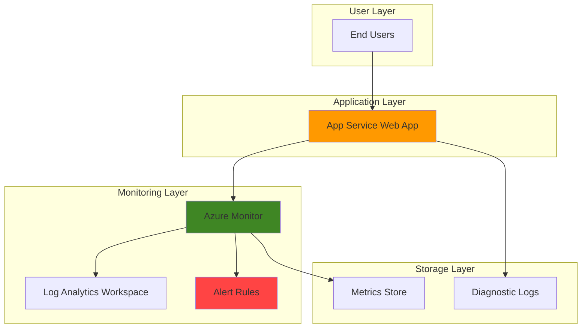

# Basic Web App Monitoring with App Service and Azure Monitor

## Problem

Development teams need visibility into their web applications' health and performance to ensure reliable user experiences. Without proper monitoring, issues like high response times, server errors, or resource exhaustion can go undetected until users complain. Teams often struggle to implement comprehensive monitoring from the start, leading to reactive troubleshooting instead of proactive issue prevention.

## Solution

Deploy a simple web application to Azure App Service with integrated Azure Monitor observability. Configure essential logging, metrics collection, and alerting to track application health, performance, and availability using Azure's built-in monitoring capabilities.

## Architecture Diagram



## Prerequisites

1. Azure account with active subscription and Contributor access
2. Azure CLI installed and configured (version 2.37.0 or later)
3. Basic understanding of web applications and HTTP protocols
4. Email address for alert notifications
5. Estimated cost: $0-5/month (Free tier App Service plan, basic monitoring included)

> **Note**: This recipe uses Azure's free tier services where possible to minimize costs during learning.

## Preparation

```bash
# Set environment variables for Azure resources
export RESOURCE_GROUP="rg-recipe-${RANDOM_SUFFIX}"
export LOCATION="eastus"
export SUBSCRIPTION_ID=$(az account show --query id --output tsv)

# Generate unique suffix for resource names
RANDOM_SUFFIX=$(openssl rand -hex 3)

# Set application-specific variables
export APP_NAME="webapp-${RANDOM_SUFFIX}"
export APP_SERVICE_PLAN="plan-${RANDOM_SUFFIX}"
export LOG_WORKSPACE="logs-${RANDOM_SUFFIX}"

# Create resource group
az group create \
    --name ${RESOURCE_GROUP} \
    --location ${LOCATION} \
    --tags purpose=recipe environment=demo

echo "✅ Resource group created: ${RESOURCE_GROUP}"
```

## Steps

1. **Create App Service Plan with Free Tier**:

   Azure App Service plans define the compute resources and features available to your web applications. The Free (F1) tier provides basic hosting capabilities perfect for development and testing scenarios, offering 1 GB memory and 1 GB storage at no cost.

   ```bash
   # Create App Service plan with Free tier
   az appservice plan create \
       --name ${APP_SERVICE_PLAN} \
       --resource-group ${RESOURCE_GROUP} \
       --location ${LOCATION} \
       --sku F1 \
       --is-linux
   
   echo "✅ App Service plan created: ${APP_SERVICE_PLAN}"
   ```

   The Free tier automatically includes basic platform metrics and health monitoring through Azure Monitor, providing immediate visibility into your application's resource usage and availability.

2. **Deploy Sample Web Application**:

   Azure App Service supports multiple deployment methods and runtime stacks. Using Docker containers provides consistent deployment packaging and enables easy local development and testing before production deployment.

   ```bash
   # Create web app with sample Node.js container
   az webapp create \
       --name ${APP_NAME} \
       --resource-group ${RESOURCE_GROUP} \
       --plan ${APP_SERVICE_PLAN} \
       --container-image-name mcr.microsoft.com/appsvc/node:18-lts
   
   # Configure app settings for monitoring
   az webapp config appsettings set \
       --name ${APP_NAME} \
       --resource-group ${RESOURCE_GROUP} \
       --settings "WEBSITES_ENABLE_APP_SERVICE_STORAGE=false"
   
   # Get the web app URL
   APP_URL=$(az webapp show \
       --name ${APP_NAME} \
       --resource-group ${RESOURCE_GROUP} \
       --query "defaultHostName" \
       --output tsv)
   
   echo "✅ Web app deployed: https://${APP_URL}"
   ```

   This creates a functional web application with a default landing page that we can monitor. The sample Node.js application includes built-in logging and health endpoints for comprehensive monitoring.

3. **Create Log Analytics Workspace**:

   Log Analytics workspaces serve as centralized repositories for log data from multiple Azure resources. They enable advanced querying, correlation analysis, and long-term retention of diagnostic information for troubleshooting and compliance.

   ```bash
   # Create Log Analytics workspace for centralized logging
   az monitor log-analytics workspace create \
       --workspace-name ${LOG_WORKSPACE} \
       --resource-group ${RESOURCE_GROUP} \
       --location ${LOCATION} \
       --sku PerGB2018
   
   # Get workspace ID for diagnostic settings
   WORKSPACE_ID=$(az monitor log-analytics workspace show \
       --workspace-name ${LOG_WORKSPACE} \
       --resource-group ${RESOURCE_GROUP} \
       --query "id" \
       --output tsv)
   
   echo "✅ Log Analytics workspace created: ${LOG_WORKSPACE}"
   ```

   The workspace will collect application logs, web server logs, and platform metrics, enabling comprehensive analysis of your application's behavior and performance patterns.

4. **Enable Application Logging**:

   Application logging captures output from your web application code, including custom log messages, error details, and debugging information. Azure App Service provides multiple logging destinations with configurable retention periods.

   ```bash
   # Enable application logging to filesystem
   az webapp log config \
       --name ${APP_NAME} \
       --resource-group ${RESOURCE_GROUP} \
       --application-logging filesystem \
       --level information \
       --retention-in-days 3
   
   # Enable web server logging
   az webapp log config \
       --name ${APP_NAME} \
       --resource-group ${RESOURCE_GROUP} \
       --web-server-logging filesystem \
       --retention-in-days 3
   
   echo "✅ Application and web server logging enabled"
   ```

   These settings capture both application-level events and HTTP request/response information, providing complete visibility into your web application's operational behavior.

5. **Configure Diagnostic Settings**:

   Diagnostic settings determine which platform logs and metrics get sent to your Log Analytics workspace. This integration enables advanced querying, alerting, and correlation analysis across your application infrastructure.

   ```bash
   # Get App Service resource ID
   APP_ID=$(az webapp show \
       --name ${APP_NAME} \
       --resource-group ${RESOURCE_GROUP} \
       --query "id" \
       --output tsv)
   
   # Create diagnostic setting for App Service
   az monitor diagnostic-settings create \
       --name "AppServiceDiagnostics" \
       --resource ${APP_ID} \
       --workspace ${WORKSPACE_ID} \
       --logs '[
         {"category":"AppServiceHTTPLogs","enabled":true},
         {"category":"AppServiceConsoleLogs","enabled":true},
         {"category":"AppServiceAppLogs","enabled":true}
       ]' \
       --metrics '[{"category":"AllMetrics","enabled":true}]'
   
   echo "✅ Diagnostic settings configured for centralized logging"
   ```

   This configuration ensures all application events, HTTP requests, and performance metrics flow into your Log Analytics workspace for comprehensive monitoring and analysis.

6. **Create Performance Alert Rule**:

   Metric alerts monitor key performance indicators and notify you when thresholds are exceeded. Response time monitoring helps identify performance degradation before it significantly impacts user experience.

   ```bash
   # Create alert rule for high response time
   az monitor metrics alert create \
       --name "HighResponseTime-${APP_NAME}" \
       --resource-group ${RESOURCE_GROUP} \
       --scopes ${APP_ID} \
       --condition "avg AverageResponseTime > 5" \
       --description "Alert when average response time exceeds 5 seconds" \
       --evaluation-frequency 1m \
       --window-size 5m \
       --severity 2
   
   echo "✅ Response time alert rule created"
   ```

   This alert monitors the application's average response time over a 5-minute window and triggers when responses consistently exceed 5 seconds, indicating potential performance issues.

7. **Create HTTP Error Alert Rule**:

   HTTP error monitoring detects application failures and server issues through status code analysis. Monitoring 5xx errors helps identify server-side problems that directly impact user experience and application availability.

   ```bash
   # Create alert rule for HTTP 5xx errors
   az monitor metrics alert create \
       --name "HTTP5xxErrors-${APP_NAME}" \
       --resource-group ${RESOURCE_GROUP} \
       --scopes ${APP_ID} \
       --condition "total Http5xx > 10" \
       --description "Alert when HTTP 5xx errors exceed 10 in 5 minutes" \
       --evaluation-frequency 1m \
       --window-size 5m \
       --severity 1
   
   echo "✅ HTTP error alert rule created"
   ```

   This alert detects when your application generates more than 10 server errors within a 5-minute period, indicating critical issues requiring immediate attention.

8. **Configure Email Notifications**:

   Action groups define how alerts notify team members when triggered. Email notifications provide immediate awareness of critical issues, enabling rapid response to application problems.

   ```bash
   # Create action group for email notifications
   az monitor action-group create \
       --name "WebAppAlerts-${RANDOM_SUFFIX}" \
       --resource-group ${RESOURCE_GROUP} \
       --short-name "WebAlert" \
       --email-receivers name="Admin" email="your-email@example.com"
   
   # Get action group ID
   ACTION_GROUP_ID=$(az monitor action-group show \
       --name "WebAppAlerts-${RANDOM_SUFFIX}" \
       --resource-group ${RESOURCE_GROUP} \
       --query "id" \
       --output tsv)
   
   # Update alert rules to use action group
   az monitor metrics alert update \
       --name "HighResponseTime-${APP_NAME}" \
       --resource-group ${RESOURCE_GROUP} \
       --add-action ${ACTION_GROUP_ID}
   
   az monitor metrics alert update \
       --name "HTTP5xxErrors-${APP_NAME}" \
       --resource-group ${RESOURCE_GROUP} \
       --add-action ${ACTION_GROUP_ID}
   
   echo "✅ Email notifications configured for alert rules"
   ```

   Replace "your-email@example.com" with your actual email address to receive alert notifications when performance or error thresholds are exceeded.

## Validation & Testing

1. **Verify web application is running**:

   ```bash
   # Check app status and get URL
   az webapp show \
       --name ${APP_NAME} \
       --resource-group ${RESOURCE_GROUP} \
       --query "{name:name,state:state,url:defaultHostName}" \
       --output table
   
   # Test application response
   curl -I https://${APP_URL}
   ```

   Expected output: HTTP/1.1 200 OK response indicating the application is running successfully.

2. **Verify logging is working**:

   ```bash
   # Stream live logs to verify logging configuration
   az webapp log tail \
       --name ${APP_NAME} \
       --resource-group ${RESOURCE_GROUP} \
       --provider application
   ```

   This command shows real-time log output. Visit your web application in a browser to generate log entries.

3. **Check monitoring data in Log Analytics**:

   ```bash
   # Query recent HTTP requests from Log Analytics
   az monitor log-analytics query \
       --workspace ${WORKSPACE_ID} \
       --analytics-query "AppServiceHTTPLogs | where TimeGenerated > ago(1h) | limit 10" \
       --output table
   ```

   Expected output: Recent HTTP request logs showing URL paths, response codes, and timing information.

4. **Verify alert rules are active**:

   ```bash
   # List all alert rules for the resource group
   az monitor metrics alert list \
       --resource-group ${RESOURCE_GROUP} \
       --output table
   ```

   Expected output: Two alert rules (HighResponseTime and HTTP5xxErrors) showing "Enabled" status.

## Cleanup

1. **Remove alert rules and action groups**:

   ```bash
   # Delete alert rules
   az monitor metrics alert delete \
       --name "HighResponseTime-${APP_NAME}" \
       --resource-group ${RESOURCE_GROUP}
   
   az monitor metrics alert delete \
       --name "HTTP5xxErrors-${APP_NAME}" \
       --resource-group ${RESOURCE_GROUP}
   
   # Delete action group
   az monitor action-group delete \
       --name "WebAppAlerts-${RANDOM_SUFFIX}" \
       --resource-group ${RESOURCE_GROUP}
   
   echo "✅ Alert rules and action groups deleted"
   ```

2. **Remove monitoring workspace**:

   ```bash
   # Delete Log Analytics workspace
   az monitor log-analytics workspace delete \
       --workspace-name ${LOG_WORKSPACE} \
       --resource-group ${RESOURCE_GROUP} \
       --yes
   
   echo "✅ Log Analytics workspace deleted"
   ```

3. **Remove web application and service plan**:

   ```bash
   # Delete web app
   az webapp delete \
       --name ${APP_NAME} \
       --resource-group ${RESOURCE_GROUP}
   
   # Delete App Service plan
   az appservice plan delete \
       --name ${APP_SERVICE_PLAN} \
       --resource-group ${RESOURCE_GROUP} \
       --yes
   
   echo "✅ Web app and service plan deleted"
   ```

4. **Remove resource group**:

   ```bash
   # Delete resource group and all remaining resources
   az group delete \
       --name ${RESOURCE_GROUP} \
       --yes \
       --no-wait
   
   echo "✅ Resource group deletion initiated: ${RESOURCE_GROUP}"
   echo "Note: Deletion may take several minutes to complete"
   ```

## Discussion

This recipe demonstrates the foundational elements of web application monitoring in Azure using App Service and Azure Monitor. Azure App Service provides a managed platform-as-a-service (PaaS) solution that handles infrastructure concerns while offering comprehensive built-in monitoring capabilities. The integration with Azure Monitor creates a centralized observability platform that scales from simple applications to complex distributed systems, following [Azure Well-Architected Framework principles](https://docs.microsoft.com/en-us/azure/architecture/framework/).

The monitoring approach follows Azure Well-Architected Framework principles by implementing proactive alerting, centralized logging, and performance tracking. Log Analytics workspaces serve as the foundation for advanced analytics, enabling complex queries using [Kusto Query Language (KQL)](https://docs.microsoft.com/en-us/azure/data-explorer/kusto/query/) across multiple data sources and long-term trend analysis. The metric alert system provides real-time notification of performance degradation and application errors, supporting rapid incident response.

Azure Monitor's integration with App Service follows a push-based telemetry model where the platform automatically collects standard metrics without requiring code changes. This approach reduces operational overhead while providing comprehensive visibility into application health, performance, and usage patterns. The diagnostic settings configuration demonstrates how to route specific log categories to centralized storage for compliance and advanced analysis requirements, as detailed in the [Azure App Service diagnostics documentation](https://docs.microsoft.com/en-us/azure/app-service/troubleshoot-diagnostic-logs).

Cost optimization strategies include using free tier services for development scenarios and implementing retention policies for log data. As applications mature, teams can enhance monitoring with Application Insights for deeper application performance monitoring, custom metrics for business KPIs, and integration with Azure DevOps for automated deployment monitoring and rollback capabilities. For production workloads, consider upgrading to commitment pricing tiers for Log Analytics to reduce costs at scale.

> **Tip**: Monitor both platform metrics (CPU, memory, response time) and application-specific metrics (user sessions, business transactions) for comprehensive observability coverage. Use Azure Monitor's built-in dashboards and workbooks for visualization.

## Challenge

Extend this monitoring solution by implementing these enhancements:

1. **Add Application Insights integration** for detailed application performance monitoring, user analytics, and dependency tracking across distributed components using the [Application Insights SDK](https://docs.microsoft.com/en-us/azure/azure-monitor/app/app-insights-overview)
2. **Create custom log queries** in Log Analytics to identify specific error patterns, analyze user behavior trends, and generate compliance reports using advanced KQL queries
3. **Implement autoscaling rules** based on CPU utilization and request queue depth to automatically adjust capacity during traffic spikes using Azure App Service's built-in scaling capabilities
4. **Configure availability tests** to monitor application endpoints from multiple global locations and detect regional connectivity issues using Azure Monitor synthetic monitoring
5. **Set up dashboard visualizations** in Azure Monitor to display key performance indicators, error rates, and system health metrics for operations teams using Azure Workbooks

## Infrastructure Code

### Available Infrastructure as Code:

- [Infrastructure Code Overview](code/README.md) - Detailed description of all infrastructure components
- [Bicep](code/bicep/) - Azure Bicep templates
- [Bash CLI Scripts](code/scripts/) - Example bash scripts using Azure CLI commands to deploy infrastructure
- [Terraform](code/terraform/) - Terraform configuration files