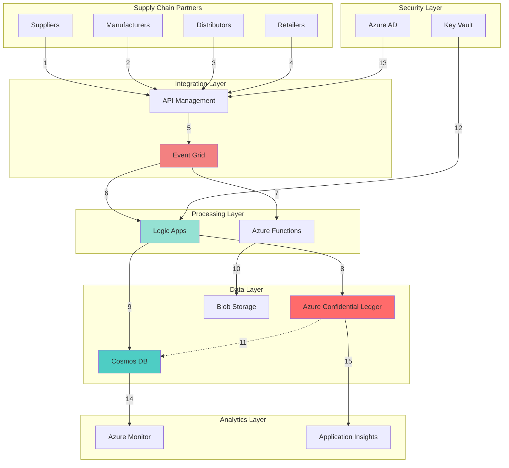

# Blockchain Supply Chain Transparency with Confidential Ledger and Cosmos DB

## Problem

Modern supply chains span multiple organizations, countries, and regulatory jurisdictions, making it challenging to maintain transparency and trust across all parties. Traditional centralized databases lack the immutability and cryptographic verification needed to prevent tampering, while existing blockchain solutions often struggle with performance at global scale and integration complexity.

## Solution

This recipe combines Azure Confidential Ledger's tamper-proof blockchain technology with Azure Cosmos DB's globally distributed database to create a high-performance supply chain tracking system. The solution provides cryptographic proof of product provenance while maintaining sub-millisecond query performance across geographic regions through Logic Apps orchestration and Event Grid messaging.

## Architecture Diagram



## Prerequisites

1. Azure subscription with Owner or Contributor access
2. Azure CLI v2.60.0 or later installed (or use Azure Cloud Shell)
3. Basic understanding of blockchain concepts and supply chain operations
4. Familiarity with REST APIs and JSON data formats
5. Azure AD permissions to create service principals and manage access
6. Estimated cost: $200-300/month for development environment

> **Note**: Azure Confidential Ledger requires specific regions for deployment. Check [availability by region](https://docs.microsoft.com/en-us/azure/confidential-ledger/overview#region-availability) before starting.

## Preparation

```bash
# Set environment variables for the deployment
export RESOURCE_GROUP="rg-supply-chain-ledger"
export LOCATION="eastus"
export SUBSCRIPTION_ID=$(az account show --query id --output tsv)

# Generate unique suffix for globally unique resource names
RANDOM_SUFFIX=$(openssl rand -hex 3)
export LEDGER_NAME="scledger${RANDOM_SUFFIX}"
export COSMOS_ACCOUNT="sccosmos${RANDOM_SUFFIX}"
export STORAGE_ACCOUNT="scstorage${RANDOM_SUFFIX}"
export KEYVAULT_NAME="sckv${RANDOM_SUFFIX}"
export LOGIC_APP_NAME="sc-logic-app-${RANDOM_SUFFIX}"
export EVENT_GRID_TOPIC="sc-events-${RANDOM_SUFFIX}"
export APIM_NAME="sc-apim-${RANDOM_SUFFIX}"

# Create resource group
az group create \
    --name ${RESOURCE_GROUP} \
    --location ${LOCATION} \
    --tags purpose=supply-chain environment=demo

echo "✅ Resource group created: ${RESOURCE_GROUP}"

# Create Azure AD application for Confidential Ledger access
export APP_ID=$(az ad app create \
    --display-name "SupplyChainLedgerApp${RANDOM_SUFFIX}" \
    --query appId \
    --output tsv)

export SP_ID=$(az ad sp create \
    --id ${APP_ID} \
    --query id \
    --output tsv)

echo "✅ Azure AD application created for ledger access"
```

## Steps

1. **Create Azure Confidential Ledger Instance**:

   Azure Confidential Ledger provides a tamper-proof, immutable ledger built on blockchain technology and hardware-backed secure enclaves. This creates an auditable record of all supply chain transactions that cannot be altered by any party, including Microsoft. The ledger's append-only nature ensures complete traceability while cryptographic proofs verify data integrity.

   ```bash
   # Create Confidential Ledger instance
   az confidentialledger create \
       --name ${LEDGER_NAME} \
       --resource-group ${RESOURCE_GROUP} \
       --location ${LOCATION} \
       --ledger-type Public \
       --aad-based-security-principals \
           objectId=${SP_ID} \
           tenantId=$(az account show --query tenantId -o tsv) \
           ledgerRoleName=Administrator
   
   # Wait for ledger creation
   echo "⏳ Waiting for ledger creation (this may take 5-10 minutes)..."
   az confidentialledger wait \
       --name ${LEDGER_NAME} \
       --resource-group ${RESOURCE_GROUP} \
       --created
   
   # Get ledger endpoint
   export LEDGER_ENDPOINT=$(az confidentialledger show \
       --name ${LEDGER_NAME} \
       --resource-group ${RESOURCE_GROUP} \
       --query properties.ledgerUri \
       --output tsv)
   
   echo "✅ Confidential Ledger created: ${LEDGER_ENDPOINT}"
   ```

   The Confidential Ledger is now operational with cryptographic verification capabilities. Each transaction will generate a receipt containing merkle tree proofs, enabling independent verification of data integrity throughout the supply chain lifecycle.

2. **Deploy Azure Cosmos DB with Global Distribution**:

   Azure Cosmos DB provides the high-performance, globally distributed database layer necessary for real-time supply chain queries. While the Confidential Ledger ensures immutability, Cosmos DB enables millisecond-latency access to supply chain data across geographic regions. The multi-model support allows storing both document and graph data for complex supply chain relationships.

   ```bash
   # Create Cosmos DB account with multiple APIs
   az cosmosdb create \
       --name ${COSMOS_ACCOUNT} \
       --resource-group ${RESOURCE_GROUP} \
       --locations regionName=${LOCATION} failoverPriority=0 \
       --default-consistency-level Session \
       --enable-multiple-write-locations true \
       --enable-analytical-storage true \
       --kind GlobalDocumentDB
   
   # Create database for supply chain data
   az cosmosdb sql database create \
       --account-name ${COSMOS_ACCOUNT} \
       --resource-group ${RESOURCE_GROUP} \
       --name SupplyChainDB
   
   # Create container for product tracking
   az cosmosdb sql container create \
       --account-name ${COSMOS_ACCOUNT} \
       --resource-group ${RESOURCE_GROUP} \
       --database-name SupplyChainDB \
       --name Products \
       --partition-key-path /productId \
       --throughput 1000
   
   # Create container for transaction records
   az cosmosdb sql container create \
       --account-name ${COSMOS_ACCOUNT} \
       --resource-group ${RESOURCE_GROUP} \
       --database-name SupplyChainDB \
       --name Transactions \
       --partition-key-path /transactionId \
       --throughput 1000
   
   # Get Cosmos DB connection details
   export COSMOS_ENDPOINT=$(az cosmosdb show \
       --name ${COSMOS_ACCOUNT} \
       --resource-group ${RESOURCE_GROUP} \
       --query documentEndpoint \
       --output tsv)
   
   export COSMOS_KEY=$(az cosmosdb keys list \
       --name ${COSMOS_ACCOUNT} \
       --resource-group ${RESOURCE_GROUP} \
       --query primaryMasterKey \
       --output tsv)
   
   echo "✅ Cosmos DB deployed with global distribution enabled"
   ```

   Cosmos DB now provides the scalable data layer with automatic indexing and global replication. The analytical storage enables complex supply chain analytics while maintaining operational performance for real-time tracking queries.

3. **Configure Azure Key Vault for Secure Credential Management**:

   Azure Key Vault centralizes the management of cryptographic keys, certificates, and connection strings required for blockchain operations. This ensures that sensitive credentials are never exposed in application code while providing audit trails for all secret access. Integration with Azure AD enables fine-grained access control for different supply chain participants.

   ```bash
   # Create Key Vault instance
   az keyvault create \
       --name ${KEYVAULT_NAME} \
       --resource-group ${RESOURCE_GROUP} \
       --location ${LOCATION} \
       --sku standard \
       --enable-rbac-authorization true
   
   # Store Cosmos DB connection string
   az keyvault secret set \
       --vault-name ${KEYVAULT_NAME} \
       --name "CosmosDBConnectionString" \
       --value "AccountEndpoint=${COSMOS_ENDPOINT};AccountKey=${COSMOS_KEY};"
   
   # Store Ledger endpoint
   az keyvault secret set \
       --vault-name ${KEYVAULT_NAME} \
       --name "LedgerEndpoint" \
       --value "${LEDGER_ENDPOINT}"
   
   # Grant Logic Apps access to Key Vault
   export LOGIC_APP_IDENTITY=$(az identity create \
       --name "logic-app-identity-${RANDOM_SUFFIX}" \
       --resource-group ${RESOURCE_GROUP} \
       --query id \
       --output tsv)
   
   az role assignment create \
       --role "Key Vault Secrets User" \
       --assignee-object-id $(az identity show \
           --ids ${LOGIC_APP_IDENTITY} \
           --query principalId \
           --output tsv) \
       --scope $(az keyvault show \
           --name ${KEYVAULT_NAME} \
           --query id \
           --output tsv)
   
   echo "✅ Key Vault configured with secure credential storage"
   ```

4. **Deploy Event Grid for Real-Time Event Distribution**:

   Azure Event Grid provides the event-driven backbone for supply chain updates, enabling real-time notifications across all participants. The publish-subscribe pattern allows multiple systems to react to supply chain events without tight coupling. Built-in retry policies and dead-letter queues ensure reliable event delivery even during network disruptions.

   ```bash
   # Create Event Grid topic
   az eventgrid topic create \
       --name ${EVENT_GRID_TOPIC} \
       --resource-group ${RESOURCE_GROUP} \
       --location ${LOCATION} \
       --input-schema eventgridschema \
       --public-network-access enabled
   
   # Get Event Grid endpoint and key
   export EVENT_GRID_ENDPOINT=$(az eventgrid topic show \
       --name ${EVENT_GRID_TOPIC} \
       --resource-group ${RESOURCE_GROUP} \
       --query endpoint \
       --output tsv)
   
   export EVENT_GRID_KEY=$(az eventgrid topic key list \
       --name ${EVENT_GRID_TOPIC} \
       --resource-group ${RESOURCE_GROUP} \
       --query key1 \
       --output tsv)
   
   # Create custom event types for supply chain
   echo '{
     "eventTypes": [
       {
         "id": "ProductCreated",
         "description": "New product registered in supply chain"
       },
       {
         "id": "ProductTransferred", 
         "description": "Product ownership transferred"
       },
       {
         "id": "QualityCheckCompleted",
         "description": "Product quality verification completed"
       },
       {
         "id": "LocationUpdated",
         "description": "Product location changed"
       }
     ]
   }' > event-types.json
   
   echo "✅ Event Grid deployed for real-time event distribution"
   ```

5. **Create Logic Apps for Blockchain Orchestration**:

   Azure Logic Apps provides the workflow orchestration layer that coordinates between supply chain events, blockchain recording, and database updates. The visual designer enables business users to understand and modify workflows without coding. Built-in connectors for Cosmos DB and HTTP APIs simplify integration while managed identity ensures secure authentication.

   ```bash
   # Create Logic App
   az logic workflow create \
       --name ${LOGIC_APP_NAME} \
       --resource-group ${RESOURCE_GROUP} \
       --location ${LOCATION} \
       --mi-user-assigned ${LOGIC_APP_IDENTITY}
   
   # Create workflow definition for supply chain recording
   cat > workflow-definition.json << EOF
   {
     "definition": {
       "\$schema": "https://schema.management.azure.com/providers/Microsoft.Logic/schemas/2016-06-01/workflowdefinition.json#",
       "contentVersion": "1.0.0.0",
       "triggers": {
         "When_a_HTTP_request_is_received": {
           "type": "Request",
           "kind": "Http",
           "inputs": {
             "method": "POST",
             "schema": {
               "type": "object",
               "properties": {
                 "transactionId": { "type": "string" },
                 "productId": { "type": "string" },
                 "action": { "type": "string" },
                 "timestamp": { "type": "string" },
                 "location": { "type": "string" },
                 "participant": { "type": "string" },
                 "metadata": { "type": "object" }
               }
             }
           }
         }
       },
       "actions": {
         "Record_to_Confidential_Ledger": {
           "type": "Http",
           "inputs": {
             "method": "POST",
             "uri": "@{parameters('ledgerEndpoint')}/app/transactions",
             "headers": {
               "Content-Type": "application/json"
             },
             "body": "@triggerBody()",
             "authentication": {
               "type": "ManagedServiceIdentity"
             }
           }
         },
         "Store_in_Cosmos_DB": {
           "type": "ApiConnection",
           "inputs": {
             "host": {
               "connection": {
                 "name": "@parameters('\$connections')['cosmosdb']['connectionId']"
               }
             },
             "method": "post",
             "body": "@triggerBody()",
             "path": "/dbs/SupplyChainDB/colls/Transactions/docs"
           },
           "runAfter": {
             "Record_to_Confidential_Ledger": ["Succeeded"]
           }
         },
         "Publish_Event": {
           "type": "Http",
           "inputs": {
             "method": "POST",
             "uri": "@{parameters('eventGridEndpoint')}",
             "headers": {
               "aeg-sas-key": "@{parameters('eventGridKey')}",
               "Content-Type": "application/json"
             },
             "body": [{
               "id": "@{guid()}",
               "eventType": "@{triggerBody()['action']}",
               "subject": "supplychain/products/@{triggerBody()['productId']}",
               "eventTime": "@{utcNow()}",
               "data": "@triggerBody()"
             }]
           },
           "runAfter": {
             "Store_in_Cosmos_DB": ["Succeeded"]
           }
         }
       }
     }
   }
   EOF
   
   # Update Logic App with workflow
   az logic workflow update \
       --name ${LOGIC_APP_NAME} \
       --resource-group ${RESOURCE_GROUP} \
       --definition workflow-definition.json
   
   echo "✅ Logic Apps workflow created for blockchain orchestration"
   ```

   The Logic App now orchestrates the complete transaction flow: receiving supply chain events, recording immutable entries to the Confidential Ledger, storing queryable data in Cosmos DB, and publishing notifications through Event Grid for downstream systems.

6. **Deploy API Management for Partner Integration**:

   Azure API Management provides the secure gateway for supply chain partners to submit transactions. Rate limiting prevents system overload while API versioning enables backward compatibility as the solution evolves. The developer portal automatically generates documentation and testing tools for partner onboarding.

   ```bash
   # Create API Management instance (Consumption tier for demo)
   az apim create \
       --name ${APIM_NAME} \
       --resource-group ${RESOURCE_GROUP} \
       --location ${LOCATION} \
       --publisher-name "SupplyChainDemo" \
       --publisher-email "admin@supplychain.demo" \
       --sku-name Consumption
   
   echo "⏳ Waiting for API Management deployment (this may take 20-30 minutes)..."
   
   # Create API for supply chain operations
   az apim api create \
       --service-name ${APIM_NAME} \
       --resource-group ${RESOURCE_GROUP} \
       --api-id supply-chain-api \
       --display-name "Supply Chain API" \
       --path "supply-chain" \
       --protocols https
   
   # Create operation for transaction submission
   az apim api operation create \
       --service-name ${APIM_NAME} \
       --resource-group ${RESOURCE_GROUP} \
       --api-id supply-chain-api \
       --operation-id submit-transaction \
       --display-name "Submit Transaction" \
       --method POST \
       --url-template "/transactions"
   
   # Configure rate limiting policy
   cat > api-policy.xml << EOF
   <policies>
     <inbound>
       <rate-limit-by-key calls="100" renewal-period="60" 
           counter-key="@(context.Subscription?.Key ?? \"anonymous\")" />
       <validate-jwt header-name="Authorization" 
           failed-validation-httpcode="401" 
           failed-validation-error-message="Unauthorized">
         <openid-config url="https://login.microsoftonline.com/\${TENANT_ID}/v2.0/.well-known/openid-configuration" />
         <audiences>
           <audience>api://supply-chain-api</audience>
         </audiences>
       </validate-jwt>
     </inbound>
   </policies>
   EOF
   
   echo "✅ API Management configured for secure partner access"
   ```

7. **Configure Storage for Document Attachments**:

   Azure Blob Storage provides cost-effective storage for supply chain documents like certificates, quality reports, and shipping manifests. Integration with the Confidential Ledger ensures document integrity by storing cryptographic hashes on the blockchain while keeping large files in blob storage for efficient retrieval.

   ```bash
   # Create storage account
   az storage account create \
       --name ${STORAGE_ACCOUNT} \
       --resource-group ${RESOURCE_GROUP} \
       --location ${LOCATION} \
       --sku Standard_LRS \
       --kind StorageV2 \
       --hierarchical-namespace false
   
   # Create container for supply chain documents
   az storage container create \
       --name documents \
       --account-name ${STORAGE_ACCOUNT} \
       --auth-mode login \
       --public-access off
   
   # Create container for quality certificates
   az storage container create \
       --name certificates \
       --account-name ${STORAGE_ACCOUNT} \
       --auth-mode login \
       --public-access off
   
   # Enable versioning for audit trail
   az storage account blob-service-properties update \
       --account-name ${STORAGE_ACCOUNT} \
       --resource-group ${RESOURCE_GROUP} \
       --enable-versioning true \
       --enable-change-feed true
   
   # Configure lifecycle management for cost optimization
   cat > lifecycle-policy.json << EOF
   {
     "rules": [
       {
         "name": "archiveOldDocuments",
         "type": "Lifecycle",
         "definition": {
           "filters": {
             "blobTypes": ["blockBlob"],
             "prefixMatch": ["documents/"]
           },
           "actions": {
             "baseBlob": {
               "tierToArchive": {
                 "daysAfterModificationGreaterThan": 90
               }
             }
           }
         }
       }
     ]
   }
   EOF
   
   az storage account management-policy create \
       --account-name ${STORAGE_ACCOUNT} \
       --resource-group ${RESOURCE_GROUP} \
       --policy @lifecycle-policy.json
   
   echo "✅ Storage configured for document management"
   ```

8. **Implement Monitoring and Analytics**:

   Azure Monitor and Application Insights provide comprehensive observability for the blockchain supply chain solution. Custom metrics track transaction volumes and latencies while alerts notify operators of anomalies. Log Analytics workspaces aggregate data from all components for security analysis and compliance reporting.

   ```bash
   # Create Application Insights for distributed tracing
   az monitor app-insights component create \
       --app supply-chain-insights \
       --resource-group ${RESOURCE_GROUP} \
       --location ${LOCATION} \
       --kind web
   
   export APPINSIGHTS_KEY=$(az monitor app-insights component show \
       --app supply-chain-insights \
       --resource-group ${RESOURCE_GROUP} \
       --query instrumentationKey \
       --output tsv)
   
   # Create Log Analytics workspace
   az monitor log-analytics workspace create \
       --workspace-name supply-chain-logs \
       --resource-group ${RESOURCE_GROUP} \
       --location ${LOCATION}
   
   export WORKSPACE_ID=$(az monitor log-analytics workspace show \
       --workspace-name supply-chain-logs \
       --resource-group ${RESOURCE_GROUP} \
       --query id \
       --output tsv)
   
   # Configure diagnostic settings for Confidential Ledger
   az monitor diagnostic-settings create \
       --name ledger-diagnostics \
       --resource $(az confidentialledger show \
           --name ${LEDGER_NAME} \
           --resource-group ${RESOURCE_GROUP} \
           --query id --output tsv) \
       --workspace ${WORKSPACE_ID} \
       --logs '[
         {
           "category": "ApplicationLogs",
           "enabled": true,
           "retentionPolicy": {
             "enabled": true,
             "days": 30
           }
         }
       ]' \
       --metrics '[
         {
           "category": "Transaction",
           "enabled": true,
           "retentionPolicy": {
             "enabled": true,
             "days": 30
           }
         }
       ]'
   
   # Create custom alerts for supply chain anomalies
   az monitor metrics alert create \
       --name high-transaction-volume \
       --resource-group ${RESOURCE_GROUP} \
       --scopes ${WORKSPACE_ID} \
       --condition "count 'TransactionCount' > 1000" \
       --window-size 5m \
       --evaluation-frequency 1m \
       --severity 2 \
       --description "Alert when transaction volume exceeds normal threshold"
   
   echo "✅ Monitoring and analytics configured"
   ```

   The monitoring infrastructure now provides end-to-end visibility into blockchain operations, enabling proactive issue detection and compliance reporting across the entire supply chain network.

## Validation & Testing

1. Verify Confidential Ledger deployment:

   ```bash
   # Check ledger status
   az confidentialledger show \
       --name ${LEDGER_NAME} \
       --resource-group ${RESOURCE_GROUP} \
       --query "{Name:name, State:properties.provisioningState, Type:properties.ledgerType}" \
       --output table
   ```

   Expected output: Should show "Succeeded" state and "Public" type

2. Test Cosmos DB global distribution:

   ```bash
   # Query Cosmos DB regions
   az cosmosdb show \
       --name ${COSMOS_ACCOUNT} \
       --resource-group ${RESOURCE_GROUP} \
       --query "locations[].{Region:locationName, Priority:failoverPriority}" \
       --output table
   
   # Test database connectivity
   az cosmosdb sql database list \
       --account-name ${COSMOS_ACCOUNT} \
       --resource-group ${RESOURCE_GROUP} \
       --output table
   ```

3. Validate Event Grid configuration:

   ```bash
   # Test event publishing
   curl -X POST ${EVENT_GRID_ENDPOINT} \
       -H "aeg-sas-key: ${EVENT_GRID_KEY}" \
       -H "Content-Type: application/json" \
       -d '[{
         "id": "test-001",
         "eventType": "ProductCreated",
         "subject": "test/validation",
         "eventTime": "'$(date -u +%Y-%m-%dT%H:%M:%SZ)'",
         "data": {
           "productId": "TEST-001",
           "message": "Validation successful"
         },
         "dataVersion": "1.0"
       }]'
   ```

4. Test end-to-end transaction flow:

   ```bash
   # Get Logic App trigger URL
   LOGIC_APP_URL=$(az logic workflow show \
       --name ${LOGIC_APP_NAME} \
       --resource-group ${RESOURCE_GROUP} \
       --query "accessEndpoint" \
       --output tsv)
   
   # Submit test transaction
   curl -X POST ${LOGIC_APP_URL} \
       -H "Content-Type: application/json" \
       -d '{
         "transactionId": "TXN-'$(date +%s)'",
         "productId": "PROD-001",
         "action": "ProductCreated",
         "timestamp": "'$(date -u +%Y-%m-%dT%H:%M:%SZ)'",
         "location": "Factory-A",
         "participant": "Manufacturer-001",
         "metadata": {
           "batchNumber": "BATCH-2024-001",
           "quantity": 1000,
           "qualityCertificate": "CERT-001"
         }
       }'
   ```

## Cleanup

1. Remove API Management instance:

   ```bash
   # Delete API Management (this may take time)
   az apim delete \
       --name ${APIM_NAME} \
       --resource-group ${RESOURCE_GROUP} \
       --yes
   
   echo "✅ API Management deletion initiated"
   ```

2. Delete Logic Apps and Event Grid:

   ```bash
   # Remove Logic App
   az logic workflow delete \
       --name ${LOGIC_APP_NAME} \
       --resource-group ${RESOURCE_GROUP} \
       --yes
   
   # Remove Event Grid topic
   az eventgrid topic delete \
       --name ${EVENT_GRID_TOPIC} \
       --resource-group ${RESOURCE_GROUP} \
       --yes
   
   echo "✅ Logic Apps and Event Grid removed"
   ```

3. Remove data services:

   ```bash
   # Delete Cosmos DB account
   az cosmosdb delete \
       --name ${COSMOS_ACCOUNT} \
       --resource-group ${RESOURCE_GROUP} \
       --yes
   
   # Delete Confidential Ledger
   az confidentialledger delete \
       --name ${LEDGER_NAME} \
       --resource-group ${RESOURCE_GROUP} \
       --yes
   
   # Delete Storage account
   az storage account delete \
       --name ${STORAGE_ACCOUNT} \
       --resource-group ${RESOURCE_GROUP} \
       --yes
   
   echo "✅ Data services removed"
   ```

4. Clean up remaining resources:

   ```bash
   # Delete Key Vault (soft-delete enabled)
   az keyvault delete \
       --name ${KEYVAULT_NAME} \
       --resource-group ${RESOURCE_GROUP}
   
   # Remove managed identity
   az identity delete \
       --ids ${LOGIC_APP_IDENTITY}
   
   # Delete resource group and all remaining resources
   az group delete \
       --name ${RESOURCE_GROUP} \
       --yes \
       --no-wait
   
   echo "✅ Resource group deletion initiated: ${RESOURCE_GROUP}"
   echo "Note: Complete deletion may take several minutes"
   ```

## Discussion

The combination of Azure Confidential Ledger and Cosmos DB creates a powerful architecture for blockchain-powered supply chains that addresses both trust and performance requirements. The Confidential Ledger's hardware-backed secure enclaves ensure that transaction records cannot be tampered with, even by cloud administrators, while Cosmos DB's global distribution enables real-time tracking across continents. This dual-database approach follows the [Azure Well-Architected Framework](https://docs.microsoft.com/en-us/azure/architecture/framework/) principle of using the right tool for each job - immutability for trust and distributed NoSQL for performance.

The event-driven architecture implemented through Event Grid and Logic Apps provides the flexibility needed for complex supply chain workflows. Each participant can subscribe to relevant events without tight coupling to other systems, enabling the gradual onboarding of partners. The [Event Grid documentation](https://docs.microsoft.com/en-us/azure/event-grid/overview) provides extensive guidance on implementing reliable event delivery patterns at scale.

From a security perspective, the solution implements defense-in-depth with multiple layers of protection. Azure AD provides identity management, Key Vault secures credentials, and the Confidential Ledger's cryptographic proofs ensure data integrity. The [Azure Confidential Computing](https://docs.microsoft.com/en-us/azure/confidential-computing/overview) platform underlying the ledger service protects data even during processing, addressing sophisticated supply chain attacks.

Cost optimization is achieved through appropriate service tier selection and data lifecycle management. The Cosmos DB analytical store enables complex queries without impacting operational performance, while Storage account lifecycle policies automatically move old documents to cheaper archive tiers. For detailed guidance on optimizing costs, review the [Azure Cost Management best practices](https://docs.microsoft.com/en-us/azure/cost-management-billing/costs/cost-mgt-best-practices) and [Cosmos DB pricing guide](https://docs.microsoft.com/en-us/azure/cosmos-db/how-pricing-works).

> **Tip**: Enable Cosmos DB's change feed to build real-time analytics dashboards showing supply chain metrics. This allows business users to track KPIs without querying the operational database.

## Challenge

Extend this solution by implementing these enhancements:

1. Add Azure Digital Twins to create a real-time digital representation of physical supply chain assets, enabling predictive analytics and what-if scenarios
2. Implement Azure Purview for data governance across the supply chain, automatically classifying sensitive information and tracking data lineage
3. Build a Power BI dashboard connected to Cosmos DB analytical store for real-time supply chain visibility and anomaly detection
4. Create Azure Functions for automated smart contract execution when predefined supply chain conditions are met (quality thresholds, delivery confirmations)
5. Integrate Azure IoT Hub for real-time sensor data from shipping containers, automatically recording temperature and location data to the blockchain

## Infrastructure Code

*Infrastructure code will be generated after recipe approval.*