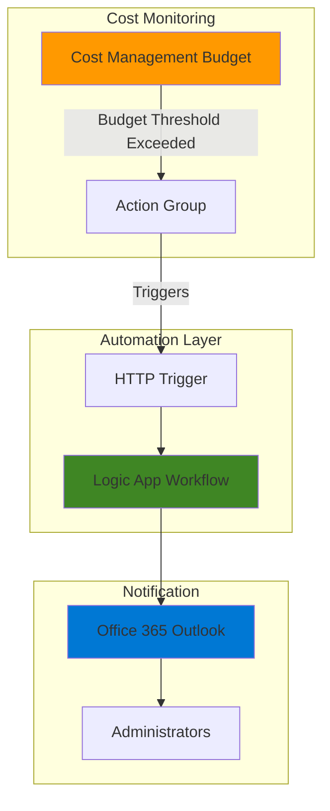

# Budget Alert Notifications with Cost Management and Logic Apps

## Problem

Organizations struggle to maintain control over cloud spending as Azure resources scale across multiple teams and projects. Without proactive cost monitoring, expenses can rapidly exceed budgets, leading to unexpected charges and budget overruns that impact business operations and project profitability.

## Solution

Create an automated budget monitoring system that combines Azure Cost Management budgets with Logic Apps workflow automation to send immediate email notifications when spending thresholds are exceeded. This solution provides real-time cost awareness and enables rapid response to budget anomalies through customizable alert workflows.

## Architecture Diagram



## Prerequisites

1. Azure subscription with Cost Management access and appropriate permissions (Cost Management Contributor role)
2. Azure CLI installed and configured (or use Azure Cloud Shell)
3. Office 365 Outlook account for email notifications
4. Basic understanding of Azure budgets and Logic Apps concepts
5. Estimated cost: $0.01-$2.00 for Logic App executions and minimal storage (very low cost for budget monitoring)

> **Note**: This recipe follows Azure Well-Architected Framework principles for cost optimization and operational excellence.

## Preparation

```bash
# Set environment variables for Azure resources
export RESOURCE_GROUP="rg-budget-alerts-${RANDOM_SUFFIX}"
export LOCATION="eastus"
export SUBSCRIPTION_ID=$(az account show --query id --output tsv)

# Generate unique suffix for resource names
RANDOM_SUFFIX=$(openssl rand -hex 3)

# Set resource names with unique suffix
export LOGIC_APP_NAME="la-budget-alerts-${RANDOM_SUFFIX}"
export ACTION_GROUP_NAME="ag-budget-${RANDOM_SUFFIX}"
export BUDGET_NAME="budget-demo-${RANDOM_SUFFIX}"
export STORAGE_ACCOUNT_NAME="st${RANDOM_SUFFIX}"

# Create resource group
az group create \
    --name ${RESOURCE_GROUP} \
    --location ${LOCATION} \
    --tags purpose=budget-monitoring environment=demo

echo "✅ Resource group created: ${RESOURCE_GROUP}"
```

## Steps

1. **Create Storage Account for Logic App**:

   Azure Logic Apps require a storage account for runtime operations and state management. This storage account provides the foundation for serverless workflow execution and enables durable function capabilities.

   ```bash
   # Create storage account for Logic App
   az storage account create \
       --name ${STORAGE_ACCOUNT_NAME} \
       --resource-group ${RESOURCE_GROUP} \
       --location ${LOCATION} \
       --sku Standard_LRS \
       --kind StorageV2 \
       --tags component=storage purpose=logic-app
   
   echo "✅ Storage account created: ${STORAGE_ACCOUNT_NAME}"
   ```

   The storage account provides the necessary backend services for Logic App state management and ensures reliable workflow execution with built-in redundancy.

2. **Create Logic App for Budget Alert Processing**:

   Azure Logic Apps provides serverless workflow automation that can process HTTP requests from Azure Monitor Action Groups. The Standard tier Logic App will parse budget alert data and send formatted email notifications with spending details and threshold information.

   ```bash
   # Create Logic App resource
   az logicapp create \
       --name ${LOGIC_APP_NAME} \
       --resource-group ${RESOURCE_GROUP} \
       --storage-account ${STORAGE_ACCOUNT_NAME} \
       --location ${LOCATION} \
       --tags component=automation purpose=budget-alerts
   
   echo "✅ Logic App created: ${LOGIC_APP_NAME}"
   ```

   The Logic App is now provisioned and ready for workflow configuration. This serverless compute resource will handle budget alert processing with automatic scaling and built-in monitoring capabilities.

3. **Create Action Group for Budget Notifications**:

   Azure Monitor Action Groups define how to respond when alerts are triggered. The Action Group connects budget alerts to automated notification channels, enabling immediate responses to spending threshold breaches.

   ```bash
   # Create Action Group with Logic App receiver
   az monitor action-group create \
       --name ${ACTION_GROUP_NAME} \
       --resource-group ${RESOURCE_GROUP} \
       --short-name "BudgetAlert" \
       --logic-app-receivers name="BudgetLogicApp" \
           resource-id="/subscriptions/${SUBSCRIPTION_ID}/resourceGroups/${RESOURCE_GROUP}/providers/Microsoft.Web/sites/${LOGIC_APP_NAME}" \
           callback-url="" \
           use-common-alert-schema=true \
       --tags purpose=budget-monitoring
   
   # Get Action Group resource ID
   ACTION_GROUP_ID=$(az monitor action-group show \
       --resource-group ${RESOURCE_GROUP} \
       --name ${ACTION_GROUP_NAME} \
       --query id --output tsv)
   
   echo "✅ Action Group created: ${ACTION_GROUP_NAME}"
   echo "Action Group ID: ${ACTION_GROUP_ID}"
   ```

   The Action Group now serves as the bridge between Cost Management budget alerts and automated workflow execution. This configuration ensures immediate notification delivery when spending thresholds are exceeded.

4. **Create Budget with Alert Thresholds**:

   Cost Management budgets track spending against defined limits and trigger alerts when thresholds are exceeded. Multiple alert conditions enable graduated responses as spending approaches and exceeds budget limits.

   ```bash
   # Create monthly budget with alert thresholds
   az consumption budget create \
       --budget-name ${BUDGET_NAME} \
       --amount 100 \
       --category Cost \
       --time-grain Monthly \
       --start-date "2025-01-01" \
       --end-date "2025-12-31" \
       --notifications '{
           "actual-80": {
               "enabled": true,
               "operator": "GreaterThan",
               "threshold": 80,
               "contactEmails": [],
               "contactGroups": ["'${ACTION_GROUP_ID}'"]
           },
           "forecasted-100": {
               "enabled": true,
               "operator": "GreaterThan",
               "threshold": 100,
               "contactEmails": [],
               "contactGroups": ["'${ACTION_GROUP_ID}'"]
           }
       }'
   
   echo "✅ Budget created with alert thresholds"
   echo "Budget name: ${BUDGET_NAME}"
   echo "Alert thresholds: 80% actual, 100% forecasted"
   ```

   The budget is now configured with multiple alert conditions that trigger at different spending levels. This provides early warning at 80% actual spending and critical alerts at 100% forecasted spending.

5. **Configure Logic App Workflow**:

   The Logic App workflow requires configuration to parse budget alert payloads and send formatted email notifications. This step creates the automation logic that processes budget alerts and sends detailed notifications.

   ```bash
   # Display configuration instructions for the Logic App workflow
   echo "Complete Logic App workflow configuration in Azure Portal:"
   echo ""
   echo "1. Navigate to: https://portal.azure.com"
   echo "2. Go to Resource Groups > ${RESOURCE_GROUP} > ${LOGIC_APP_NAME}"
   echo "3. Create a new workflow with these components:"
   echo "   a. HTTP Request trigger (When a HTTP request is received)"
   echo "   b. Parse JSON action to extract budget alert data"
   echo "   c. Office 365 Outlook - Send an email action"
   echo ""
   echo "4. Configure the HTTP trigger to accept POST requests"
   echo "5. Set up email template with dynamic content from the parsed JSON"
   echo "6. Save and enable the workflow"
   
   # Get Logic App resource information
   LOGIC_APP_ID=$(az logicapp show \
       --resource-group ${RESOURCE_GROUP} \
       --name ${LOGIC_APP_NAME} \
       --query id --output tsv)
   
   echo "✅ Logic App workflow ready for configuration"
   echo "Logic App Resource ID: ${LOGIC_APP_ID}"
   ```

   The workflow configuration enables custom email formatting with budget details, threshold information, and actionable recommendations. This provides administrators with comprehensive cost visibility and guidance for budget management.

## Validation & Testing

1. **Verify Budget Configuration**:

   ```bash
   # Check budget status and alert configuration
   az consumption budget show \
       --budget-name ${BUDGET_NAME} \
       --query '{name:name, amount:amount, timeGrain:timeGrain, notifications:notifications}' \
       --output table
   ```

   Expected output: Budget with $100 limit and configured alert thresholds at 80% actual and 100% forecasted costs.

2. **Test Action Group Configuration**:

   ```bash
   # Verify Action Group configuration
   az monitor action-group show \
       --resource-group ${RESOURCE_GROUP} \
       --name ${ACTION_GROUP_NAME} \
       --query '{name:name, enabled:enabled, shortName:groupShortName, logicAppReceivers:logicAppReceivers}' \
       --output table
   ```

   Expected output: Action Group with Logic App receiver properly configured and enabled status.

3. **Verify Logic App Status**:

   ```bash
   # Check Logic App status and configuration
   az logicapp show \
       --resource-group ${RESOURCE_GROUP} \
       --name ${LOGIC_APP_NAME} \
       --query '{name:name, state:state, location:location, kind:kind}' \
       --output table
   
   echo "Verify Logic App is running and ready to receive HTTP requests"
   ```

   Expected output: Logic App in running state with proper location and configuration.

## Cleanup

1. **Remove Budget**:

   ```bash
   # Delete budget configuration
   az consumption budget delete \
       --budget-name ${BUDGET_NAME}
   
   echo "✅ Budget deleted: ${BUDGET_NAME}"
   ```

2. **Remove Action Group**:

   ```bash
   # Delete Action Group
   az monitor action-group delete \
       --resource-group ${RESOURCE_GROUP} \
       --name ${ACTION_GROUP_NAME}
   
   echo "✅ Action Group deleted: ${ACTION_GROUP_NAME}"
   ```

3. **Remove Resource Group and All Resources**:

   ```bash
   # Delete resource group and all contained resources
   az group delete \
       --name ${RESOURCE_GROUP} \
       --yes \
       --no-wait
   
   echo "✅ Resource group deletion initiated: ${RESOURCE_GROUP}"
   echo "Note: Deletion may take several minutes to complete"
   
   # Verify deletion (optional)
   az group exists --name ${RESOURCE_GROUP}
   ```

## Discussion

Azure Cost Management budgets provide foundational cost control capabilities by tracking spending against defined limits and triggering alerts when thresholds are exceeded. When combined with Logic Apps automation, these budgets become powerful tools for proactive cost governance and immediate stakeholder notification. The integration between Cost Management and Logic Apps demonstrates the strength of Azure's serverless architecture, where event-driven workflows can respond to cost conditions in real-time without requiring dedicated infrastructure management.

The budget alert system follows event-driven architecture principles, where spending events trigger automated responses through Action Groups and Logic Apps. This approach ensures minimal latency between threshold breaches and notification delivery, enabling rapid response to cost anomalies. The Logic Apps workflow can be customized to include additional actions such as resource tagging, team notifications through Microsoft Teams, or integration with ITSM systems for automated ticket creation. This extensibility makes the solution adaptable to various organizational governance requirements.

Cost Management budgets support both actual and forecasted cost alerts, providing different perspectives on spending patterns. Actual cost alerts trigger when real spending reaches thresholds, while forecasted alerts use Azure's predictive analytics to warn about projected spending based on current consumption trends. This dual approach enables both reactive and proactive cost management, allowing teams to address current overspending while preventing future budget overruns through early intervention and corrective actions.

The solution demonstrates Azure Well-Architected Framework principles by implementing automated operational excellence through Logic Apps, cost optimization through proactive monitoring, and reliability through Action Group redundancy and Logic Apps' built-in retry mechanisms. Organizations can extend this pattern to include multiple budget scopes, custom notification channels, and integration with existing governance frameworks for comprehensive cost management automation that scales across enterprise environments.

> **Tip**: Configure multiple budget thresholds (50%, 80%, 90%, 100%) to provide graduated alerts as spending approaches limits, enabling proactive cost management before critical thresholds are reached.

**Documentation Sources:**
- [Monitor usage and spending with cost alerts](https://learn.microsoft.com/en-us/azure/cost-management-billing/costs/cost-mgt-alerts-monitor-usage-spending)
- [Manage costs with automation](https://learn.microsoft.com/en-us/azure/cost-management-billing/costs/manage-automation)
- [Connect to Office 365 Outlook from Azure Logic Apps](https://learn.microsoft.com/en-us/azure/connectors/connectors-create-api-office365-outlook)
- [Tutorial: Create and manage budgets](https://learn.microsoft.com/en-us/azure/cost-management-billing/costs/tutorial-acm-create-budgets)
- [Azure billing and cost management budget scenario](https://learn.microsoft.com/en-us/azure/cost-management-billing/manage/cost-management-budget-scenario)
- [Customize alert notifications by using Logic Apps](https://learn.microsoft.com/en-us/azure/azure-monitor/alerts/alerts-logic-apps)

## Challenge

Extend this solution by implementing these enhancements:

1. **Multi-Threshold Workflow Logic**: Implement conditional logic in the Logic App to send different notification types based on alert severity (warning, critical, emergency) with escalating recipient lists and communication channels including SMS and Microsoft Teams.

2. **Resource Tagging Integration**: Automatically tag resources that contribute to budget overruns and create cost allocation reports that identify the highest spending services and resource groups within the budget scope using Azure Resource Graph queries.

3. **Teams Integration and Approval Workflows**: Add Microsoft Teams notifications with adaptive cards that allow budget managers to approve or deny additional spending, integrating with Azure Policy for automated resource controls and spending governance.

4. **Cost Anomaly Detection Integration**: Extend the Logic App to consume Cost Management anomaly detection alerts alongside budget alerts, creating a comprehensive cost monitoring system that detects both threshold breaches and unusual spending patterns.

5. **Multi-Subscription Cost Aggregation**: Implement cross-subscription budget monitoring using Management Groups and Azure Resource Graph queries to aggregate costs across multiple subscriptions and provide enterprise-wide cost visibility through Power BI dashboards and executive reporting.

## Infrastructure Code

*Infrastructure code will be generated after recipe approval.*