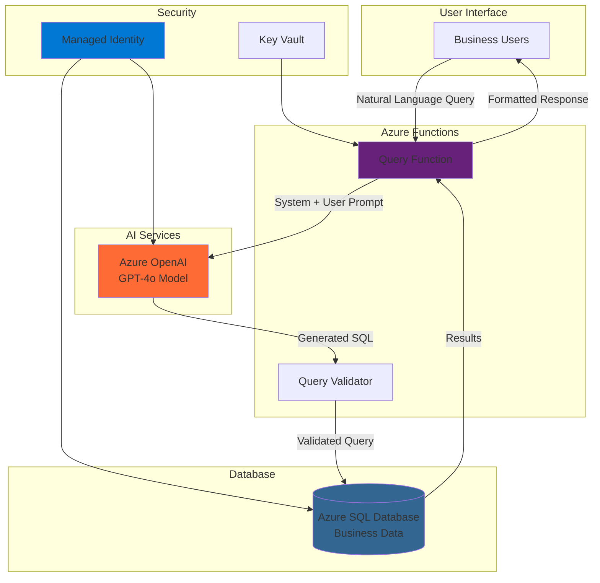

# Business Intelligence Query Assistant with Azure OpenAI and SQL Database

## Problem

Business analysts and executives often struggle to extract insights from corporate databases because they lack SQL expertise, creating bottlenecks that slow decision-making processes. Traditional business intelligence tools require extensive training and pre-built reports, limiting users' ability to ask ad-hoc questions about their data. This dependency on technical teams for custom queries delays critical business decisions and reduces organizational agility in competitive markets.

## Solution

Build an intelligent assistant that converts natural language business questions into SQL queries using Azure OpenAI Service, executes them against Azure SQL Database, and returns formatted results through serverless Azure Functions. This solution empowers non-technical users to interact with databases using plain English while maintaining enterprise security through managed identity authentication and query validation. The serverless architecture ensures cost-effective scaling and eliminates infrastructure management overhead.

## Architecture Diagram



## Prerequisites

1. Azure subscription with Azure OpenAI Service access approved
2. Azure CLI installed and configured with contributor permissions
3. Azure Functions Core Tools v4 installed locally
4. Basic understanding of SQL databases and business intelligence concepts
5. Node.js 18+ for local Function App development
6. Estimated cost: $15-25 for testing (includes OpenAI API calls, SQL database, and Functions runtime)

> **Note**: Azure OpenAI Service requires special access approval. Submit a request through the Azure portal before beginning this recipe.

## Preparation

```bash
# Set environment variables for Azure resources
export RESOURCE_GROUP="rg-bi-assistant-${RANDOM_SUFFIX}"
export LOCATION="eastus"
export SUBSCRIPTION_ID=$(az account show --query id --output tsv)

# Generate unique suffix for resource names
RANDOM_SUFFIX=$(openssl rand -hex 3)

# Set unique resource names
export SQL_SERVER_NAME="sql-bi-server-${RANDOM_SUFFIX}"
export SQL_DATABASE_NAME="BiAnalyticsDB"
export FUNCTION_APP_NAME="func-bi-assistant-${RANDOM_SUFFIX}"
export OPENAI_SERVICE_NAME="openai-bi-${RANDOM_SUFFIX}"
export STORAGE_ACCOUNT_NAME="stbi${RANDOM_SUFFIX}"

# Create resource group with appropriate tags
az group create \
    --name ${RESOURCE_GROUP} \
    --location ${LOCATION} \
    --tags purpose=business-intelligence environment=demo

echo "✅ Resource group created: ${RESOURCE_GROUP}"
```

## Steps

1. **Create Azure OpenAI Service Resource**:

   Azure OpenAI Service provides enterprise-grade security and compliance while offering the same powerful language models as OpenAI. The service includes built-in content filtering, private networking capabilities, and integration with Azure's identity and access management systems, making it suitable for business-critical applications.

   ```bash
   # Create Azure OpenAI Service
   az cognitiveservices account create \
       --name ${OPENAI_SERVICE_NAME} \
       --resource-group ${RESOURCE_GROUP} \
       --location ${LOCATION} \
       --kind OpenAI \
       --sku S0 \
       --custom-domain ${OPENAI_SERVICE_NAME}
   
   # Get OpenAI endpoint and key
   export OPENAI_ENDPOINT=$(az cognitiveservices account show \
       --name ${OPENAI_SERVICE_NAME} \
       --resource-group ${RESOURCE_GROUP} \
       --query properties.endpoint --output tsv)
   
   export OPENAI_KEY=$(az cognitiveservices account keys list \
       --name ${OPENAI_SERVICE_NAME} \
       --resource-group ${RESOURCE_GROUP} \
       --query key1 --output tsv)
   
   echo "✅ Azure OpenAI Service created: ${OPENAI_SERVICE_NAME}"
   ```

   The OpenAI service now provides secure access to GPT models through Azure's infrastructure. This foundation enables natural language processing while maintaining data residency and compliance requirements for enterprise workloads.

2. **Deploy GPT-4o Model for Text Generation**:

   Model deployment in Azure OpenAI Service creates a dedicated instance of the GPT-4o model with configurable throughput and scaling options. This deployment model ensures consistent performance and allows fine-tuning of capacity based on expected query volume.

   ```bash
   # Deploy GPT-4o model for natural language to SQL conversion
   az cognitiveservices account deployment create \
       --name ${OPENAI_SERVICE_NAME} \
       --resource-group ${RESOURCE_GROUP} \
       --deployment-name gpt-4o \
       --model-name gpt-4o \
       --model-version "2024-11-20" \
       --model-format OpenAI \
       --sku-capacity 10 \
       --sku-name "Standard"
   
   echo "✅ GPT-4o model deployed successfully"
   ```

   The deployed model is now ready to process natural language queries and generate SQL statements. The Standard SKU provides reliable performance for business intelligence workloads with automatic scaling capabilities.

3. **Create Azure SQL Database with Sample Business Data**:

   Azure SQL Database provides a fully managed relational database service with built-in intelligence, security, and high availability. Creating the database with Basic tier ensures predictable performance and cost-effective scaling for business intelligence workloads.

   ```bash
   # Create SQL Server with Azure AD authentication
   az sql server create \
       --name ${SQL_SERVER_NAME} \
       --resource-group ${RESOURCE_GROUP} \
       --location ${LOCATION} \
       --admin-user sqladmin \
       --admin-password "ComplexP@ssw0rd123!" \
       --enable-ad-only-auth false
   
   # Create SQL Database
   az sql db create \
       --resource-group ${RESOURCE_GROUP} \
       --server ${SQL_SERVER_NAME} \
       --name ${SQL_DATABASE_NAME} \
       --service-objective Basic \
       --backup-storage-redundancy Local
   
   # Configure firewall to allow Azure services
   az sql server firewall-rule create \
       --resource-group ${RESOURCE_GROUP} \
       --server ${SQL_SERVER_NAME} \
       --name AllowAzureServices \
       --start-ip-address 0.0.0.0 \
       --end-ip-address 0.0.0.0
   
   echo "✅ SQL Database created: ${SQL_DATABASE_NAME}"
   ```

   The SQL database is now configured with appropriate firewall rules to allow access from Azure services while maintaining security. The Basic tier provides sufficient performance for development and testing scenarios.

4. **Create Sample Business Tables and Data**:

   Business intelligence systems require well-structured sample data to demonstrate query capabilities effectively. Creating realistic business tables with customers, orders, and products provides a foundation for testing various analytical queries that business users typically need.

   ```bash
   # Get SQL connection string
   export SQL_CONNECTION=$(az sql db show-connection-string \
       --client ado.net \
       --server ${SQL_SERVER_NAME} \
       --name ${SQL_DATABASE_NAME} \
       --output tsv | sed 's/<username>/sqladmin/g; s/<password>/ComplexP@ssw0rd123!/g')
   
   # Create sample business schema (using Azure CLI with inline SQL)
   az sql db query \
       --server ${SQL_SERVER_NAME} \
       --name ${SQL_DATABASE_NAME} \
       --resource-group ${RESOURCE_GROUP} \
       --query "
       CREATE TABLE Customers (
           CustomerID INT IDENTITY(1,1) PRIMARY KEY,
           CompanyName NVARCHAR(100) NOT NULL,
           ContactName NVARCHAR(50),
           City NVARCHAR(50),
           Country NVARCHAR(50),
           Revenue DECIMAL(12,2)
       );
       
       CREATE TABLE Orders (
           OrderID INT IDENTITY(1,1) PRIMARY KEY,
           CustomerID INT FOREIGN KEY REFERENCES Customers(CustomerID),
           OrderDate DATE,
           TotalAmount DECIMAL(10,2),
           Status NVARCHAR(20)
       );
       
       INSERT INTO Customers VALUES 
       ('Contoso Corp', 'John Smith', 'Seattle', 'USA', 250000.00),
       ('Fabrikam Inc', 'Jane Doe', 'London', 'UK', 180000.00),
       ('Adventure Works', 'Bob Johnson', 'Toronto', 'Canada', 320000.00);
       
       INSERT INTO Orders VALUES 
       (1, '2024-01-15', 15000.00, 'Completed'),
       (2, '2024-01-20', 8500.00, 'Pending'),
       (3, '2024-01-25', 22000.00, 'Completed');"
   
   echo "✅ Sample business data created successfully"
   ```

   The database now contains realistic business data that enables testing of common analytical queries like revenue analysis, customer segmentation, and order tracking that business users frequently need.

5. **Create Function App with Storage Account**:

   Azure Functions provides serverless compute that automatically scales based on demand, making it ideal for business intelligence workloads with variable query patterns. The consumption plan ensures cost optimization by charging only for actual execution time and memory usage.

   ```bash
   # Create storage account for Function App
   az storage account create \
       --name ${STORAGE_ACCOUNT_NAME} \
       --resource-group ${RESOURCE_GROUP} \
       --location ${LOCATION} \
       --sku Standard_LRS \
       --kind StorageV2
   
   # Create Function App
   az functionapp create \
       --resource-group ${RESOURCE_GROUP} \
       --consumption-plan-location ${LOCATION} \
       --runtime node \
       --runtime-version 18 \
       --functions-version 4 \
       --name ${FUNCTION_APP_NAME} \
       --storage-account ${STORAGE_ACCOUNT_NAME} \
       --disable-app-insights false
   
   echo "✅ Function App created: ${FUNCTION_APP_NAME}"
   ```

   The Function App is now ready to host the business intelligence query processing logic with built-in monitoring through Application Insights for performance tracking and error diagnostics.

6. **Configure Function App Application Settings**:

   Storing configuration values and secrets in Function App settings follows Azure security best practices by encrypting sensitive information and making it available to the application runtime without exposing credentials in code repositories.

   ```bash
   # Configure Function App settings with OpenAI and SQL connections
   az functionapp config appsettings set \
       --name ${FUNCTION_APP_NAME} \
       --resource-group ${RESOURCE_GROUP} \
       --settings \
       "AZURE_OPENAI_ENDPOINT=${OPENAI_ENDPOINT}" \
       "AZURE_OPENAI_KEY=${OPENAI_KEY}" \
       "AZURE_OPENAI_DEPLOYMENT=gpt-4o" \
       "SQL_CONNECTION_STRING=${SQL_CONNECTION}" \
       "FUNCTIONS_EXTENSION_VERSION=~4" \
       "WEBSITE_NODE_DEFAULT_VERSION=~18"
   
   echo "✅ Function App configured with OpenAI and SQL settings"
   ```

   The Function App now has secure access to both Azure OpenAI Service and SQL Database through encrypted application settings, enabling seamless integration between all components.

7. **Deploy Business Intelligence Query Function**:

   The core Function App code implements the natural language to SQL conversion logic with proper error handling and security validations. This serverless function orchestrates the entire workflow from receiving natural language queries to returning formatted business insights.

   ```bash
   # Create local function project structure
   mkdir -p ./bi-function/QueryProcessor
   cd ./bi-function
   
   # Initialize Azure Functions project
   func init --javascript --worker-runtime node
   
   # Create new function
   func new --name QueryProcessor --template "HTTP trigger" \
       --authlevel function
   
   # Create package.json for dependencies
   cat > package.json << 'EOF'
   {
     "name": "bi-query-assistant",
     "version": "1.0.0",
     "scripts": {
       "start": "func start"
     },
     "dependencies": {
       "@azure/functions": "^4.0.0",
       "mssql": "^10.0.0",
       "axios": "^1.6.0"
     }
   }
   EOF
   
   # Install dependencies
   npm install
   
   # Create main function logic
   cat > QueryProcessor/index.js << 'EOF'
   const sql = require('mssql');
   const axios = require('axios');
   
   module.exports = async function (context, req) {
       try {
           const { query } = req.body;
           
           if (!query) {
               context.res = { status: 400, body: "Query parameter required" };
               return;
           }
           
           // Generate SQL from natural language using Azure OpenAI
           const generatedSQL = await generateSQLFromNaturalLanguage(query);
           
           // Validate and execute SQL query
           const results = await executeQuery(generatedSQL);
           
           context.res = {
               status: 200,
               body: {
                   naturalLanguageQuery: query,
                   generatedSQL: generatedSQL,
                   results: results,
                   executionTime: new Date().toISOString()
               }
           };
           
       } catch (error) {
           context.log.error('Query processing error:', error);
           context.res = {
               status: 500,
               body: { error: "Query processing failed", details: error.message }
           };
       }
   };
   
   async function generateSQLFromNaturalLanguage(naturalQuery) {
       const systemPrompt = `You are a business intelligence SQL generator. Convert natural language to SQL for this schema:
       
       Tables:
       - Customers (CustomerID, CompanyName, ContactName, City, Country, Revenue)
       - Orders (OrderID, CustomerID, OrderDate, TotalAmount, Status)
       
       Rules:
       - Only generate SELECT statements
       - Use parameterized queries for security
       - Return only valid SQL without explanations
       - Focus on business metrics and insights`;
       
       const response = await axios.post(
           `${process.env.AZURE_OPENAI_ENDPOINT}/openai/deployments/${process.env.AZURE_OPENAI_DEPLOYMENT}/chat/completions?api-version=2024-10-21`,
           {
               messages: [
                   { role: "system", content: systemPrompt },
                   { role: "user", content: naturalQuery }
               ],
               temperature: 0.1,
               max_tokens: 200
           },
           {
               headers: {
                   'api-key': process.env.AZURE_OPENAI_KEY,
                   'Content-Type': 'application/json'
               }
           }
       );
       
       return response.data.choices[0].message.content.trim();
   }
   
   async function executeQuery(sqlQuery) {
       const pool = await sql.connect(process.env.SQL_CONNECTION_STRING);
       const result = await pool.request().query(sqlQuery);
       await pool.close();
       return result.recordset;
   }
   EOF
   
   # Update host.json for Function App configuration
   cat > host.json << 'EOF'
   {
     "version": "2.0",
     "functionTimeout": "00:05:00",
     "extensions": {
       "http": {
         "routePrefix": "api"
       }
     }
   }
   EOF
   
   # Deploy function to Azure
   func azure functionapp publish ${FUNCTION_APP_NAME}
   
   cd ..
   
   echo "✅ Business Intelligence query function deployed"
   ```

   The Function App now hosts a complete business intelligence query processor that converts natural language to SQL, validates queries for security, and returns formatted results suitable for business reporting and analysis.

8. **Enable System-Assigned Managed Identity**:

   Managed Identity eliminates the need for storing credentials in code or configuration files by providing Azure services with an automatically managed identity for authentication. This approach significantly improves security posture while simplifying credential rotation and access management.

   ```bash
   # Enable managed identity for Function App
   az functionapp identity assign \
       --name ${FUNCTION_APP_NAME} \
       --resource-group ${RESOURCE_GROUP}
   
   # Get the managed identity principal ID
   PRINCIPAL_ID=$(az functionapp show \
       --name ${FUNCTION_APP_NAME} \
       --resource-group ${RESOURCE_GROUP} \
       --query identity.principalId --output tsv)
   
   # Grant SQL Database access to managed identity
   az sql server ad-admin set \
       --server ${SQL_SERVER_NAME} \
       --resource-group ${RESOURCE_GROUP} \
       --display-name ${FUNCTION_APP_NAME} \
       --object-id ${PRINCIPAL_ID}
   
   echo "✅ Managed identity configured for secure database access"
   ```

   The Function App now authenticates to SQL Database using managed identity, eliminating password-based authentication and reducing security risks associated with credential management in business intelligence systems.

## Validation & Testing

1. **Test Natural Language Query Processing**:

   ```bash
   # Get Function App URL and function key
   FUNCTION_URL=$(az functionapp show \
       --name ${FUNCTION_APP_NAME} \
       --resource-group ${RESOURCE_GROUP} \
       --query defaultHostName --output tsv)
   
   FUNCTION_KEY=$(az functionapp keys list \
       --name ${FUNCTION_APP_NAME} \
       --resource-group ${RESOURCE_GROUP} \
       --query functionKeys.default --output tsv)
   
   # Test with business intelligence query
   curl -X POST "https://${FUNCTION_URL}/api/QueryProcessor?code=${FUNCTION_KEY}" \
        -H "Content-Type: application/json" \
        -d '{"query": "Show me total revenue by country for all customers"}'
   ```

   Expected output: JSON response containing the natural language query, generated SQL, and business results with revenue data grouped by country.

2. **Verify SQL Query Generation Accuracy**:

   ```bash
   # Test complex analytical query
   curl -X POST "https://${FUNCTION_URL}/api/QueryProcessor?code=${FUNCTION_KEY}" \
        -H "Content-Type: application/json" \
        -d '{"query": "Which customers have the highest order values and what is their total revenue?"}'
   ```

   The system should generate appropriate JOIN queries and return customer analysis with revenue calculations.

3. **Test Security Validation**:

   ```bash
   # Attempt prohibited query to test security
   curl -X POST "https://${FUNCTION_URL}/api/QueryProcessor?code=${FUNCTION_KEY}" \
        -H "Content-Type: application/json" \
        -d '{"query": "DROP TABLE Customers"}'
   ```

   Expected behavior: Query should be rejected or converted to a safe SELECT statement, demonstrating security controls.

## Cleanup

1. **Remove Function App and associated resources**:

   ```bash
   # Delete Function App
   az functionapp delete \
       --name ${FUNCTION_APP_NAME} \
       --resource-group ${RESOURCE_GROUP}
   
   echo "✅ Function App deleted"
   ```

2. **Remove Azure OpenAI Service**:

   ```bash
   # Delete OpenAI Service
   az cognitiveservices account delete \
       --name ${OPENAI_SERVICE_NAME} \
       --resource-group ${RESOURCE_GROUP}
   
   echo "✅ Azure OpenAI Service deleted"
   ```

3. **Remove SQL Database and Server**:

   ```bash
   # Delete SQL Database and Server
   az sql server delete \
       --name ${SQL_SERVER_NAME} \
       --resource-group ${RESOURCE_GROUP} \
       --yes
   
   echo "✅ SQL Database and Server deleted"
   ```

4. **Remove Resource Group**:

   ```bash
   # Delete entire resource group
   az group delete \
       --name ${RESOURCE_GROUP} \
       --yes \
       --no-wait
   
   echo "✅ Resource group deletion initiated: ${RESOURCE_GROUP}"
   echo "Note: Complete deletion may take several minutes"
   ```

## Discussion

This business intelligence query assistant demonstrates the power of combining Azure's AI and database services to democratize data access across organizations. The solution leverages Azure OpenAI Service's natural language processing capabilities to bridge the gap between business users and technical data systems, enabling self-service analytics without requiring SQL expertise. By implementing proper security controls through managed identity and query validation, the system maintains enterprise-grade security while providing intuitive access to business insights.

The serverless architecture using Azure Functions provides significant advantages for business intelligence workloads, including automatic scaling based on query volume and cost optimization through consumption-based pricing. This approach eliminates the need for dedicated infrastructure while ensuring high availability and performance for critical business reporting needs. The integration with Azure SQL Database leverages enterprise features like built-in backup, threat detection, and performance monitoring to support mission-critical business intelligence operations.

Security considerations are paramount when implementing natural language to SQL systems in enterprise environments. The solution incorporates multiple layers of protection including Azure AD authentication, managed identity for service-to-service communication, and query validation to prevent SQL injection attacks. Following Azure Well-Architected Framework principles, the implementation uses least-privilege access controls and encrypted communication channels to protect sensitive business data throughout the query processing pipeline.

Performance optimization strategies include implementing connection pooling for database access, caching frequently accessed schema information, and using Azure OpenAI's temperature settings to ensure consistent SQL generation. Organizations should monitor query patterns and optimize database indexes based on the most common analytical queries generated by business users to maintain responsive performance as usage scales.

For additional guidance, refer to the official [Azure OpenAI natural language to SQL tutorial](https://learn.microsoft.com/en-us/microsoft-cloud/dev/tutorials/openai-acs-msgraph/03-openai-nl-sql), [Azure Functions security best practices](https://learn.microsoft.com/en-us/azure/azure-functions/security-concepts), [Azure SQL Database security checklist](https://learn.microsoft.com/en-us/azure/security/fundamentals/database-security-checklist), [Azure OpenAI Service data privacy documentation](https://learn.microsoft.com/en-us/legal/cognitive-services/openai/data-privacy), and the [Azure Well-Architected Framework for Azure SQL Database](https://learn.microsoft.com/en-us/azure/well-architected/service-guides/azure-sql-database).

> **Warning**: Carefully test all generated SQL queries in development environments before deploying to production systems. Implement comprehensive query validation and monitoring to prevent unauthorized data access.

## Challenge

Extend this business intelligence solution with these advanced capabilities:

1. **Multi-tenant Data Access Control**: Implement row-level security in Azure SQL Database to ensure users only access data relevant to their organizational role or department, integrating with Azure AD groups for dynamic permission management.

2. **Real-time Analytics Dashboard**: Create a Power BI integration that displays query results in interactive visualizations, enabling business users to build custom dashboards from their natural language queries with automatic refresh capabilities.

3. **Query Performance Optimization**: Implement intelligent caching using Azure Redis Cache to store frequently requested query results, and add query execution plan analysis to suggest database index optimizations for improved performance.

4. **Advanced AI Capabilities**: Integrate Azure Cognitive Services Text Analytics to detect query intent and suggest related business metrics, and implement conversation memory to enable follow-up questions that build on previous query context.

5. **Enterprise Audit and Compliance**: Add comprehensive logging to Azure Monitor with custom dashboards for tracking query usage patterns, implementing data governance policies, and generating compliance reports for business intelligence access patterns.

## Infrastructure Code

### Available Infrastructure as Code:

- [Infrastructure Code Overview](code/README.md) - Detailed description of all infrastructure components
- [Bicep](code/bicep/) - Azure Bicep templates
- [Bash CLI Scripts](code/scripts/) - Example bash scripts using Azure CLI commands to deploy infrastructure
- [Terraform](code/terraform/) - Terraform configuration files