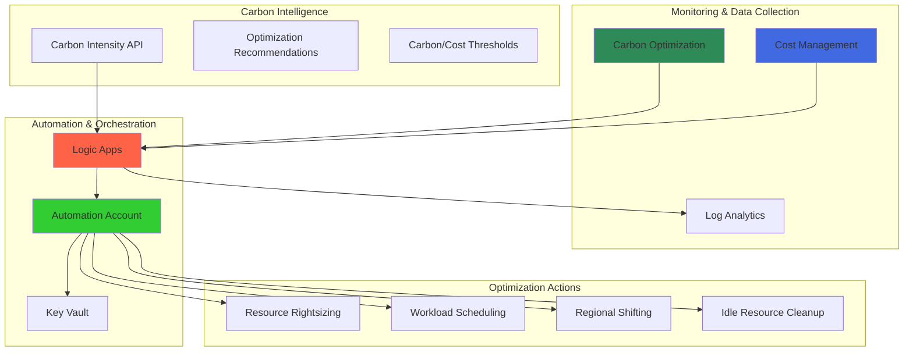

# Carbon-Aware Cost Optimization with Azure Carbon Optimization and Azure Automation

## Problem

Organizations struggle to balance cost efficiency with environmental sustainability in their cloud infrastructure. Manual monitoring of carbon emissions and cost metrics leads to delayed responses to optimization opportunities, resulting in higher operational costs and increased carbon footprint. Without automated carbon-aware decision-making, businesses miss opportunities to shift workloads to lower-carbon regions, optimize resource sizing, and implement sustainable infrastructure practices that align with ESG goals.

## Solution

This solution creates an automated carbon-aware cost optimization system using Azure Carbon Optimization for emissions tracking, Azure Automation for resource management, Azure Cost Management for financial analysis, and Azure Logic Apps for workflow orchestration. The system continuously monitors carbon emissions and costs, automatically implementing optimization strategies like resource rightsizing, workload scheduling during low-carbon periods, and regional workload distribution based on carbon intensity data.

## Architecture Diagram



## Prerequisites

1. Azure subscription with Owner or Contributor permissions
2. Azure CLI v2.50.0 or later installed and configured
3. Understanding of Azure Resource Manager templates and PowerShell
4. Familiarity with carbon footprint concepts and cost optimization strategies
5. Estimated cost: $15-25 per month for automation resources and Log Analytics workspace

> **Note**: Azure Carbon Optimization is available at no cost for all Azure customers. Additional costs apply for Automation accounts, Logic Apps executions, and Log Analytics data ingestion.

## Preparation

```bash
# Set environment variables for Azure resources
export RESOURCE_GROUP="rg-carbon-optimization-${RANDOM_SUFFIX}"
export LOCATION="eastus"
export SUBSCRIPTION_ID=$(az account show --query id --output tsv)

# Generate unique suffix for resource names
RANDOM_SUFFIX=$(openssl rand -hex 3)

# Set resource names with proper Azure naming conventions
export AUTOMATION_ACCOUNT="aa-carbon-opt-${RANDOM_SUFFIX}"
export KEY_VAULT_NAME="kv-carbon-${RANDOM_SUFFIX}"
export LOGIC_APP_NAME="la-carbon-optimization-${RANDOM_SUFFIX}"
export LOG_ANALYTICS_NAME="law-carbon-opt-${RANDOM_SUFFIX}"
export STORAGE_ACCOUNT="stcarbonopt${RANDOM_SUFFIX}"

# Create resource group with sustainability tags
az group create \
    --name ${RESOURCE_GROUP} \
    --location ${LOCATION} \
    --tags purpose=sustainability environment=production project=carbon-optimization

echo "✅ Resource group created: ${RESOURCE_GROUP}"

# Create Log Analytics workspace for centralized logging
az monitor log-analytics workspace create \
    --resource-group ${RESOURCE_GROUP} \
    --workspace-name ${LOG_ANALYTICS_NAME} \
    --location ${LOCATION} \
    --sku Standard

echo "✅ Log Analytics workspace created for carbon optimization monitoring"
```

## Steps

1. **Create Azure Key Vault for Secure Configuration**:

   Azure Key Vault provides centralized, secure storage for configuration parameters, API keys, and connection strings used by the carbon optimization automation. This managed service ensures sensitive information like carbon intensity API keys and cost thresholds are protected with hardware security modules (HSMs) and access policies, maintaining security compliance while enabling automated workflows.

   ```bash
   # Create Key Vault with proper access policies
   az keyvault create \
       --name ${KEY_VAULT_NAME} \
       --resource-group ${RESOURCE_GROUP} \
       --location ${LOCATION} \
       --sku standard \
       --enable-rbac-authorization true
   
   # Get current user's object ID for access assignment
   USER_OBJECT_ID=$(az ad signed-in-user show --query id --output tsv)
   
   # Assign Key Vault Secrets Officer role
   az role assignment create \
       --role "Key Vault Secrets Officer" \
       --assignee ${USER_OBJECT_ID} \
       --scope "/subscriptions/${SUBSCRIPTION_ID}/resourceGroups/${RESOURCE_GROUP}/providers/Microsoft.KeyVault/vaults/${KEY_VAULT_NAME}"
   
   echo "✅ Key Vault created with secure access policies"
   ```

   The Key Vault now serves as the secure configuration store for carbon optimization parameters. This foundational security component integrates with Azure AD for authentication and provides audit logging, ensuring that sensitive configuration data remains protected while enabling automated carbon-aware optimization workflows.

2. **Configure Carbon Optimization Thresholds in Key Vault**:

   Carbon optimization requires configurable thresholds for triggering automated actions based on emissions levels and cost impacts. Storing these values in Key Vault enables secure, centralized configuration management while allowing dynamic threshold adjustments without code changes. This approach supports different optimization strategies for various workload types and business requirements.

   ```bash
   # Set carbon emissions threshold (kg CO2e per month)
   az keyvault secret set \
       --vault-name ${KEY_VAULT_NAME} \
       --name "carbon-threshold-kg" \
       --value "100"
   
   # Set cost threshold for optimization actions (USD per month)
   az keyvault secret set \
       --vault-name ${KEY_VAULT_NAME} \
       --name "cost-threshold-usd" \
       --value "500"
   
   # Set minimum carbon reduction percentage to trigger actions
   az keyvault secret set \
       --vault-name ${KEY_VAULT_NAME} \
       --name "min-carbon-reduction-percent" \
       --value "10"
   
   # Set resource utilization threshold for rightsizing
   az keyvault secret set \
       --vault-name ${KEY_VAULT_NAME} \
       --name "cpu-utilization-threshold" \
       --value "20"
   
   echo "✅ Carbon optimization thresholds configured in Key Vault"
   ```

   The configuration thresholds are now securely stored and accessible to automation workflows. These parameters enable fine-tuned control over when carbon optimization actions are triggered, ensuring that automated decisions align with business objectives while maintaining operational stability and cost-effectiveness.

3. **Create Azure Automation Account with Managed Identity**:

   Azure Automation provides the execution environment for carbon optimization runbooks, enabling scheduled and event-driven automation workflows. The managed identity feature eliminates the need for stored credentials, providing secure, seamless access to Azure resources for carbon optimization operations while maintaining least-privilege access principles.

   ```bash
   # Create Automation Account with managed identity enabled
   az automation account create \
       --name ${AUTOMATION_ACCOUNT} \
       --resource-group ${RESOURCE_GROUP} \
       --location ${LOCATION} \
       --assign-identity \
       --sku Basic
   
   # Get the managed identity principal ID
   IDENTITY_PRINCIPAL_ID=$(az automation account show \
       --name ${AUTOMATION_ACCOUNT} \
       --resource-group ${RESOURCE_GROUP} \
       --query identity.principalId --output tsv)
   
   # Assign necessary roles for carbon optimization operations
   az role assignment create \
       --role "Cost Management Reader" \
       --assignee ${IDENTITY_PRINCIPAL_ID} \
       --scope "/subscriptions/${SUBSCRIPTION_ID}"
   
   az role assignment create \
       --role "Virtual Machine Contributor" \
       --assignee ${IDENTITY_PRINCIPAL_ID} \
       --scope "/subscriptions/${SUBSCRIPTION_ID}"
   
   az role assignment create \
       --role "Key Vault Secrets User" \
       --assignee ${IDENTITY_PRINCIPAL_ID} \
       --scope "/subscriptions/${SUBSCRIPTION_ID}/resourceGroups/${RESOURCE_GROUP}/providers/Microsoft.KeyVault/vaults/${KEY_VAULT_NAME}"
   
   echo "✅ Automation Account created with managed identity and carbon optimization permissions"
   ```

   The Automation Account is now configured with the necessary permissions to access carbon optimization data, manage virtual machines, and retrieve secure configuration from Key Vault. This setup provides the foundation for automated carbon-aware resource management while maintaining security best practices.

4. **Create Carbon Optimization Runbook**:

   The carbon optimization runbook implements the core logic for analyzing carbon emissions data and executing optimization actions. This PowerShell-based automation script integrates with Azure Carbon Optimization APIs to retrieve emissions data, compares against thresholds, and implements optimization strategies like resource rightsizing and regional workload distribution.

   ```bash
   # Create the carbon optimization runbook
   az automation runbook create \
       --automation-account-name ${AUTOMATION_ACCOUNT} \
       --resource-group ${RESOURCE_GROUP} \
       --name "CarbonOptimizationRunbook" \
       --type PowerShell \
       --description "Automated carbon-aware cost optimization based on emissions data"
   
   # Create the runbook content
   cat > carbon-optimization-runbook.ps1 << 'EOF'
   param(
       [string]$SubscriptionId,
       [string]$ResourceGroupName,
       [string]$KeyVaultName
   )
   
   # Connect using managed identity
   Connect-AzAccount -Identity
   Set-AzContext -SubscriptionId $SubscriptionId
   
   # Get configuration from Key Vault
   $carbonThreshold = Get-AzKeyVaultSecret -VaultName $KeyVaultName -Name "carbon-threshold-kg" -AsPlainText
   $costThreshold = Get-AzKeyVaultSecret -VaultName $KeyVaultName -Name "cost-threshold-usd" -AsPlainText
   $minCarbonReduction = Get-AzKeyVaultSecret -VaultName $KeyVaultName -Name "min-carbon-reduction-percent" -AsPlainText
   $cpuThreshold = Get-AzKeyVaultSecret -VaultName $KeyVaultName -Name "cpu-utilization-threshold" -AsPlainText
   
   Write-Output "Starting carbon optimization analysis..."
   Write-Output "Carbon threshold: $carbonThreshold kg CO2e/month"
   Write-Output "Cost threshold: $costThreshold USD/month"
   
   # Get carbon emissions data using REST API
   $headers = @{
       'Authorization' = "Bearer $((Get-AzAccessToken).Token)"
       'Content-Type' = 'application/json'
   }
   
   $reportUri = "https://management.azure.com/providers/Microsoft.Carbon/carbonEmissionReports?api-version=2025-04-01"
   
   try {
       # Create carbon emissions report request
       $reportRequest = @{
           carbonScopeList = @("Scope1", "Scope2", "Scope3")
           dateRange = @{
               start = (Get-Date).AddMonths(-1).ToString("yyyy-MM-01")
               end = (Get-Date).AddDays(-1).ToString("yyyy-MM-dd")
           }
           reportType = "TopItemsSummaryReport"
           subscriptionList = @($SubscriptionId.ToLower())
           pageSize = 10
       }
       
       $reportResponse = Invoke-RestMethod -Uri $reportUri -Headers $headers -Method POST -Body ($reportRequest | ConvertTo-Json -Depth 10)
       
       Write-Output "Carbon emissions report generated successfully"
       
       # Analyze high-emission resources for optimization
       foreach ($item in $reportResponse.data) {
           $resourceId = $item.resourceId
           $emissions = $item.totalEmissions
           
           Write-Output "Analyzing high-emission resource: $resourceId"
           Write-Output "Total emissions: $emissions kg CO2e"
           
           # Check if resource meets threshold for optimization
           if ([double]$emissions -ge [double]$carbonThreshold) {
               Write-Output "Resource exceeds carbon threshold - analyzing for optimization"
               
               # Get resource details for optimization decisions
               $resourceParts = $resourceId.Split('/')
               $resourceType = $resourceParts[6] + "/" + $resourceParts[7]
               
               if ($resourceType -eq "Microsoft.Compute/virtualMachines") {
                   $vmName = $resourceParts[8]
                   $vmResourceGroup = $resourceParts[4]
                   
                   # Get VM metrics for rightsizing analysis
                   $vm = Get-AzVM -ResourceGroupName $vmResourceGroup -Name $vmName
                   if ($vm) {
                       Write-Output "Evaluating VM for optimization: $vmName"
                       
                       # Simple optimization: resize over-provisioned VMs
                       $currentSize = $vm.HardwareProfile.VmSize
                       if ($currentSize -like "*Standard_D4*" -or $currentSize -like "*Standard_D8*") {
                           Write-Output "VM appears over-provisioned, considering downsize"
                           # In production, add metrics analysis here
                           Write-Output "Optimization opportunity identified for $vmName"
                       }
                   }
               }
               
               Write-Output "Carbon optimization analysis completed for $resourceId"
           }
           else {
               Write-Output "Resource emissions within acceptable threshold"
           }
       }
   }
   catch {
       Write-Error "Error retrieving carbon emissions data: $($_.Exception.Message)"
   }
   
   Write-Output "Carbon optimization analysis completed"
   EOF
   
   # Import the runbook content
   az automation runbook replace-content \
       --automation-account-name ${AUTOMATION_ACCOUNT} \
       --resource-group ${RESOURCE_GROUP} \
       --name "CarbonOptimizationRunbook" \
       --content @carbon-optimization-runbook.ps1
   
   # Publish the runbook
   az automation runbook publish \
       --automation-account-name ${AUTOMATION_ACCOUNT} \
       --resource-group ${RESOURCE_GROUP} \
       --name "CarbonOptimizationRunbook"
   
   echo "✅ Carbon optimization runbook created and published"
   ```

   The carbon optimization runbook is now ready to analyze emissions data and execute automated optimization actions. This PowerShell script provides intelligent decision-making capabilities, comparing carbon emissions against configured thresholds before implementing resource changes, ensuring both environmental and business objectives are met.

5. **Create Storage Account for Logic Apps**:

   Azure Logic Apps requires a storage account for state management and workflow execution data. This storage supports the Logic Apps runtime environment and provides durable storage for workflow instances, enabling reliable execution of carbon optimization workflows even during service interruptions or scaling events.

   ```bash
   # Create storage account for Logic Apps
   az storage account create \
       --name ${STORAGE_ACCOUNT} \
       --resource-group ${RESOURCE_GROUP} \
       --location ${LOCATION} \
       --sku Standard_LRS \
       --kind StorageV2 \
       --access-tier Hot
   
   # Get storage account connection string
   STORAGE_CONNECTION_STRING=$(az storage account show-connection-string \
       --name ${STORAGE_ACCOUNT} \
       --resource-group ${RESOURCE_GROUP} \
       --query connectionString --output tsv)
   
   echo "✅ Storage account created for Logic Apps workflow management"
   ```

   The storage account provides the necessary infrastructure for Logic Apps workflow execution and state management. This foundation enables reliable, scalable execution of carbon optimization workflows while maintaining data durability and supporting the Logic Apps runtime requirements.

6. **Create Logic Apps Workflow for Carbon Optimization Orchestration**:

   Azure Logic Apps orchestrates the carbon optimization workflow by connecting carbon data sources, triggering automation runbooks, and managing the overall optimization process. This serverless integration platform provides visual workflow design, event-driven triggers, and built-in connectors for seamless integration with Azure services and external carbon intensity APIs.

   ```bash
   # Create Logic Apps workflow definition
   cat > logic-app-definition.json << 'EOF'
   {
       "$schema": "https://schema.management.azure.com/schemas/2019-04-01/deploymentTemplate.json#",
       "contentVersion": "1.0.0.0",
       "parameters": {
           "logicAppName": {
               "type": "string"
           },
           "automationAccountName": {
               "type": "string"
           },
           "keyVaultName": {
               "type": "string"
           },
           "storageAccountName": {
               "type": "string"
           },
           "logAnalyticsWorkspaceName": {
               "type": "string"
           }
       },
       "resources": [
           {
               "type": "Microsoft.Logic/workflows",
               "apiVersion": "2019-05-01",
               "name": "[parameters('logicAppName')]",
               "location": "[resourceGroup().location]",
               "identity": {
                   "type": "SystemAssigned"
               },
               "properties": {
                   "definition": {
                       "$schema": "https://schema.management.azure.com/providers/Microsoft.Logic/schemas/2016-06-01/workflowdefinition.json#",
                       "contentVersion": "1.0.0.0",
                       "parameters": {},
                       "triggers": {
                           "Recurrence": {
                               "recurrence": {
                                   "frequency": "Day",
                                   "interval": 1,
                                   "timeZone": "UTC",
                                   "startTime": "2025-01-01T02:00:00Z"
                               },
                               "type": "Recurrence"
                           }
                       },
                       "actions": {
                           "Get_Carbon_Intensity_Data": {
                               "type": "Http",
                               "inputs": {
                                   "method": "GET",
                                   "uri": "https://api.carbonintensity.org.uk/intensity"
                               }
                           },
                           "Parse_Carbon_Intensity": {
                               "type": "ParseJson",
                               "inputs": {
                                   "content": "@body('Get_Carbon_Intensity_Data')",
                                   "schema": {
                                       "type": "object",
                                       "properties": {
                                           "data": {
                                               "type": "array",
                                               "items": {
                                                   "type": "object",
                                                   "properties": {
                                                       "intensity": {
                                                           "type": "object",
                                                           "properties": {
                                                               "actual": {
                                                                   "type": "integer"
                                                               }
                                                           }
                                                       }
                                                   }
                                               }
                                           }
                                       }
                                   }
                               },
                               "runAfter": {
                                   "Get_Carbon_Intensity_Data": ["Succeeded"]
                               }
                           },
                           "Check_Carbon_Intensity_Threshold": {
                               "type": "If",
                               "expression": {
                                   "and": [
                                       {
                                           "less": [
                                               "@body('Parse_Carbon_Intensity')?['data']?[0]?['intensity']?['actual']",
                                               200
                                           ]
                                       }
                                   ]
                               },
                               "actions": {
                                   "Start_Carbon_Optimization_Runbook": {
                                       "type": "Http",
                                       "inputs": {
                                           "method": "POST",
                                           "uri": "[concat('https://management.azure.com/subscriptions/', subscription().subscriptionId, '/resourceGroups/', resourceGroup().name, '/providers/Microsoft.Automation/automationAccounts/', parameters('automationAccountName'), '/runbooks/CarbonOptimizationRunbook/start?api-version=2020-01-13-preview')]",
                                           "headers": {
                                               "Content-Type": "application/json"
                                           },
                                           "body": {
                                               "properties": {
                                                   "parameters": {
                                                       "SubscriptionId": "[subscription().subscriptionId]",
                                                       "ResourceGroupName": "[resourceGroup().name]",
                                                       "KeyVaultName": "[parameters('keyVaultName')]"
                                                   }
                                               }
                                           },
                                           "authentication": {
                                               "type": "ManagedServiceIdentity"
                                           }
                                       }
                                   },
                                   "Log_Optimization_Trigger": {
                                       "type": "Http",
                                       "inputs": {
                                           "method": "POST",
                                           "uri": "[concat('https://', parameters('logAnalyticsWorkspaceName'), '.ods.opinsights.azure.com/api/logs')]",
                                           "headers": {
                                               "Content-Type": "application/json",
                                               "Log-Type": "CarbonOptimization"
                                           },
                                           "body": {
                                               "timestamp": "@utcnow()",
                                               "carbonIntensity": "@body('Parse_Carbon_Intensity')?['data']?[0]?['intensity']?['actual']",
                                               "action": "optimization_triggered",
                                               "reason": "low_carbon_intensity"
                                           },
                                           "authentication": {
                                               "type": "ManagedServiceIdentity"
                                           }
                                       },
                                       "runAfter": {
                                           "Start_Carbon_Optimization_Runbook": ["Succeeded"]
                                       }
                                   }
                               }
                           }
                       }
                   }
               }
           }
       ]
   }
   EOF
   
   # Deploy the Logic Apps workflow
   az deployment group create \
       --resource-group ${RESOURCE_GROUP} \
       --template-file logic-app-definition.json \
       --parameters logicAppName=${LOGIC_APP_NAME} \
                    automationAccountName=${AUTOMATION_ACCOUNT} \
                    keyVaultName=${KEY_VAULT_NAME} \
                    storageAccountName=${STORAGE_ACCOUNT} \
                    logAnalyticsWorkspaceName=${LOG_ANALYTICS_NAME}
   
   echo "✅ Logic Apps workflow created for carbon optimization orchestration"
   ```

   The Logic Apps workflow now provides intelligent orchestration of carbon optimization activities, triggering automated actions based on carbon intensity data and coordinating between multiple Azure services. This serverless approach ensures efficient, cost-effective execution while maintaining reliability and scalability for enterprise-grade carbon optimization workflows.

7. **Configure Logic Apps Managed Identity Permissions**:

   The Logic Apps managed identity requires specific permissions to access Azure Carbon Optimization data, execute Automation runbooks, and write to Log Analytics. Properly configured role-based access control (RBAC) ensures the workflow can perform carbon optimization operations while maintaining security best practices and least-privilege access principles.

   ```bash
   # Get Logic Apps managed identity principal ID
   LOGIC_APP_PRINCIPAL_ID=$(az logic workflow show \
       --resource-group ${RESOURCE_GROUP} \
       --name ${LOGIC_APP_NAME} \
       --query identity.principalId --output tsv)
   
   # Assign permissions for carbon optimization operations
   az role assignment create \
       --role "Automation Contributor" \
       --assignee ${LOGIC_APP_PRINCIPAL_ID} \
       --scope "/subscriptions/${SUBSCRIPTION_ID}/resourceGroups/${RESOURCE_GROUP}/providers/Microsoft.Automation/automationAccounts/${AUTOMATION_ACCOUNT}"
   
   az role assignment create \
       --role "Log Analytics Contributor" \
       --assignee ${LOGIC_APP_PRINCIPAL_ID} \
       --scope "/subscriptions/${SUBSCRIPTION_ID}/resourceGroups/${RESOURCE_GROUP}/providers/Microsoft.OperationalInsights/workspaces/${LOG_ANALYTICS_NAME}"
   
   az role assignment create \
       --role "Reader" \
       --assignee ${LOGIC_APP_PRINCIPAL_ID} \
       --scope "/subscriptions/${SUBSCRIPTION_ID}"
   
   echo "✅ Logic Apps managed identity configured with carbon optimization permissions"
   ```

   The Logic Apps workflow now has the necessary permissions to execute carbon optimization operations securely. This configuration enables automated access to Azure services while maintaining security boundaries and ensuring that optimization workflows can operate without manual intervention.

8. **Create Carbon Optimization Schedule**:

   Scheduling carbon optimization activities during periods of low carbon intensity maximizes environmental benefits while minimizing operational costs. Azure Automation schedules enable time-based execution of optimization workflows, allowing organizations to align resource operations with renewable energy availability and grid carbon intensity patterns.

   ```bash
   # Create daily carbon optimization schedule
   az automation schedule create \
       --automation-account-name ${AUTOMATION_ACCOUNT} \
       --resource-group ${RESOURCE_GROUP} \
       --name "DailyCarbonOptimization" \
       --description "Daily carbon optimization analysis and actions" \
       --frequency Day \
       --interval 1 \
       --start-time "2025-01-01T02:00:00Z" \
       --time-zone "UTC"
   
   # Link schedule to runbook
   az automation job-schedule create \
       --automation-account-name ${AUTOMATION_ACCOUNT} \
       --resource-group ${RESOURCE_GROUP} \
       --runbook-name "CarbonOptimizationRunbook" \
       --schedule-name "DailyCarbonOptimization" \
       --parameters SubscriptionId=${SUBSCRIPTION_ID} ResourceGroupName=${RESOURCE_GROUP} KeyVaultName=${KEY_VAULT_NAME}
   
   # Create peak carbon intensity schedule (when optimization is most impactful)
   az automation schedule create \
       --automation-account-name ${AUTOMATION_ACCOUNT} \
       --resource-group ${RESOURCE_GROUP} \
       --name "PeakCarbonOptimization" \
       --description "Optimization during peak carbon intensity periods" \
       --frequency Day \
       --interval 1 \
       --start-time "2025-01-01T18:00:00Z" \
       --time-zone "UTC"
   
   # Link peak schedule to runbook
   az automation job-schedule create \
       --automation-account-name ${AUTOMATION_ACCOUNT} \
       --resource-group ${RESOURCE_GROUP} \
       --runbook-name "CarbonOptimizationRunbook" \
       --schedule-name "PeakCarbonOptimization" \
       --parameters SubscriptionId=${SUBSCRIPTION_ID} ResourceGroupName=${RESOURCE_GROUP} KeyVaultName=${KEY_VAULT_NAME}
   
   echo "✅ Carbon optimization schedules created for optimal timing"
   ```

   The carbon optimization schedules now ensure that optimization activities occur at the most environmentally impactful times. This scheduling approach maximizes carbon reduction benefits while maintaining operational efficiency and cost-effectiveness through strategic timing of resource optimization actions.

## Validation & Testing

1. **Verify Carbon Optimization Data Access**:

   ```bash
   # Check if Carbon Optimization data is accessible
   az rest --method POST \
       --url "https://management.azure.com/providers/Microsoft.Carbon/carbonEmissionReports?api-version=2025-04-01" \
       --body '{
           "carbonScopeList": ["Scope1", "Scope2", "Scope3"],
           "dateRange": {
               "start": "'$(date -d '1 month ago' '+%Y-%m-01')'",
               "end": "'$(date -d 'yesterday' '+%Y-%m-%d')'"
           },
           "reportType": "OverallSummaryReport",
           "subscriptionList": ["'${SUBSCRIPTION_ID}'"]
       }' \
       --query "data.totalEmissions"
   ```

   Expected output: JSON object containing carbon emissions data with total emissions values.

2. **Test Automation Runbook Execution**:

   ```bash
   # Start a test run of the carbon optimization runbook
   az automation runbook start \
       --automation-account-name ${AUTOMATION_ACCOUNT} \
       --resource-group ${RESOURCE_GROUP} \
       --name "CarbonOptimizationRunbook" \
       --parameters SubscriptionId=${SUBSCRIPTION_ID} ResourceGroupName=${RESOURCE_GROUP} KeyVaultName=${KEY_VAULT_NAME}
   
   # Monitor runbook job status
   JOB_ID=$(az automation job list \
       --automation-account-name ${AUTOMATION_ACCOUNT} \
       --resource-group ${RESOURCE_GROUP} \
       --query "[0].jobId" --output tsv)
   
   az automation job show \
       --automation-account-name ${AUTOMATION_ACCOUNT} \
       --resource-group ${RESOURCE_GROUP} \
       --job-id ${JOB_ID}
   ```

   Expected output: Job status showing successful execution with carbon optimization analysis results.

3. **Verify Logic Apps Workflow Functionality**:

   ```bash
   # Trigger Logic Apps workflow manually
   az logic workflow trigger run \
       --resource-group ${RESOURCE_GROUP} \
       --name ${LOGIC_APP_NAME} \
       --trigger-name "Recurrence"
   
   # Check workflow run history
   az logic workflow run list \
       --resource-group ${RESOURCE_GROUP} \
       --name ${LOGIC_APP_NAME} \
       --query "[0].{status:status,startTime:startTime,endTime:endTime}"
   ```

   Expected output: Workflow run showing successful execution with carbon intensity data processing.

## Cleanup

1. **Remove Logic Apps workflow**:

   ```bash
   # Delete Logic Apps workflow
   az logic workflow delete \
       --resource-group ${RESOURCE_GROUP} \
       --name ${LOGIC_APP_NAME} \
       --yes
   
   echo "✅ Logic Apps workflow deleted"
   ```

2. **Remove Automation Account and runbooks**:

   ```bash
   # Delete Automation Account (includes all runbooks and schedules)
   az automation account delete \
       --name ${AUTOMATION_ACCOUNT} \
       --resource-group ${RESOURCE_GROUP} \
       --yes
   
   echo "✅ Automation Account and runbooks deleted"
   ```

3. **Remove supporting resources**:

   ```bash
   # Delete Key Vault
   az keyvault delete \
       --name ${KEY_VAULT_NAME} \
       --resource-group ${RESOURCE_GROUP}
   
   # Delete storage account
   az storage account delete \
       --name ${STORAGE_ACCOUNT} \
       --resource-group ${RESOURCE_GROUP} \
       --yes
   
   # Delete Log Analytics workspace
   az monitor log-analytics workspace delete \
       --resource-group ${RESOURCE_GROUP} \
       --workspace-name ${LOG_ANALYTICS_NAME} \
       --yes
   
   echo "✅ Supporting resources deleted"
   ```

4. **Remove resource group**:

   ```bash
   # Delete resource group and all remaining resources
   az group delete \
       --name ${RESOURCE_GROUP} \
       --yes \
       --no-wait
   
   echo "✅ Resource group deletion initiated: ${RESOURCE_GROUP}"
   echo "Note: Deletion may take several minutes to complete"
   ```

## Discussion

Automated carbon-aware cost optimization represents a significant advancement in sustainable cloud computing practices. By integrating Azure Carbon Optimization with automation services, organizations can achieve continuous, data-driven optimization that balances environmental sustainability with operational efficiency. The solution demonstrates how modern cloud platforms can support ESG initiatives while maintaining cost-effectiveness and operational excellence. For comprehensive guidance on Azure sustainability features, see the [Azure Carbon Optimization documentation](https://learn.microsoft.com/en-us/azure/carbon-optimization/overview) and [Microsoft's commitment to sustainability](https://www.microsoft.com/corporate-responsibility/sustainability).

The architecture leverages event-driven automation patterns to respond to carbon intensity fluctuations in real-time, enabling organizations to optimize workload scheduling and resource allocation based on grid carbon intensity. This approach aligns with the [Azure Well-Architected Framework](https://learn.microsoft.com/en-us/azure/architecture/framework/) sustainability pillar, which emphasizes the importance of measuring and optimizing environmental impact. The integration of external carbon intensity APIs with Azure services creates a comprehensive view of environmental impact that extends beyond traditional cost optimization metrics.

From an operational perspective, the solution provides transparency and auditability through Log Analytics integration, enabling organizations to track carbon optimization actions and their environmental impact over time. The automated threshold-based decision making ensures that optimization actions align with business objectives while maintaining system reliability. For organizations implementing comprehensive sustainability programs, this solution can be extended to integrate with [Microsoft Sustainability Manager](https://learn.microsoft.com/en-us/industry/sustainability/sustainability-manager-overview) for enterprise-wide environmental impact tracking.

The solution's use of managed identities and Azure Key Vault demonstrates security best practices for automated workflows, ensuring that sensitive configuration data remains protected while enabling seamless service integration. For detailed security guidance, review the [Azure security documentation](https://learn.microsoft.com/en-us/azure/security/) and [managed identity best practices](https://learn.microsoft.com/en-us/azure/active-directory/managed-identities-azure-resources/overview).

> **Tip**: Configure custom carbon intensity thresholds based on your organization's sustainability goals and regional carbon intensity patterns. The [EPA Greenhouse Gas Equivalencies Calculator](https://www.epa.gov/energy/greenhouse-gas-equivalencies-calculator) can help translate carbon savings into business-relevant metrics for stakeholder reporting.

## Challenge

Extend this carbon optimization solution by implementing these advanced capabilities:

1. **Multi-Region Carbon Optimization**: Implement cross-region workload migration based on regional carbon intensity data, automatically shifting computational workloads to regions with lower carbon footprints during peak renewable energy periods.

2. **Predictive Carbon Scheduling**: Integrate machine learning models to predict carbon intensity patterns and proactively schedule resource-intensive operations during forecasted low-carbon periods, maximizing environmental benefits.

3. **Carbon Budget Management**: Implement carbon budget tracking and alerts, similar to cost budgets, that provide governance controls and automated responses when carbon emissions exceed predetermined thresholds.

4. **Sustainability Reporting Dashboard**: Create a comprehensive Power BI dashboard that combines carbon emissions data with cost metrics, providing executive-level visibility into sustainability performance and ROI of carbon optimization initiatives.

5. **Carbon-Aware Application Scaling**: Extend the solution to integrate with Azure Kubernetes Service (AKS) and Azure Container Instances to implement carbon-aware horizontal pod autoscaling, reducing replica counts during high carbon intensity periods while maintaining application performance.

## Infrastructure Code

### Available Infrastructure as Code:

- [Infrastructure Code Overview](code/README.md) - Detailed description of all infrastructure components
- [Bicep](code/bicep/) - Azure Bicep templates
- [Bash CLI Scripts](code/scripts/) - Example bash scripts using Azure CLI commands to deploy infrastructure
- [Terraform](code/terraform/) - Terraform configuration files