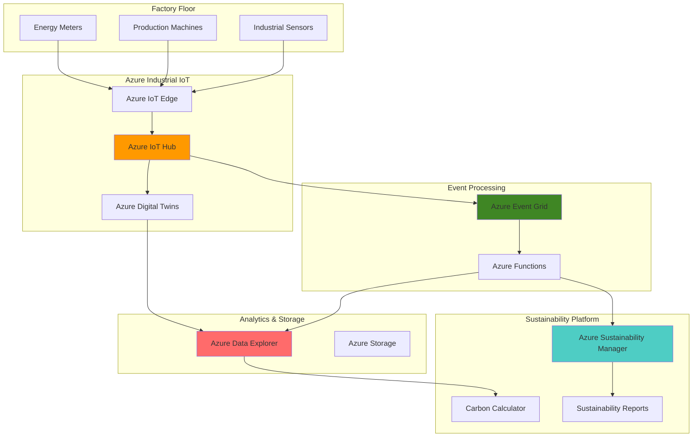

# Carbon-Intelligent Manufacturing with Azure Industrial IoT and Sustainability Manager

## Problem

Manufacturing facilities face increasing pressure to monitor and reduce their carbon footprint while maintaining operational efficiency. Traditional environmental monitoring systems operate in silos, lacking real-time visibility into energy consumption patterns, emissions data, and operational metrics. Without integrated carbon tracking across production lines, manufacturers struggle to identify optimization opportunities, comply with sustainability regulations, and demonstrate environmental responsibility to stakeholders.

## Solution

This solution creates an intelligent carbon footprint monitoring system that integrates Azure Industrial IoT for real-time sensor data collection with Azure Sustainability Manager for environmental impact analysis. Azure Event Grid orchestrates event-driven workflows that automatically trigger carbon footprint calculations, while Azure Data Explorer provides real-time analytics and sustainability reporting capabilities for compliance and operational optimization.

## Architecture Diagram



## Prerequisites

1. Azure subscription with appropriate permissions for IoT Hub, Event Grid, Data Explorer, and Function Apps
2. Azure CLI v2.57.0 or later installed and configured (or Azure CloudShell)
3. Basic understanding of IoT device management and data analytics concepts
4. Knowledge of sustainability metrics and carbon footprint calculations
5. Estimated cost: $150-300/month for development environment (varies by data volume and compute usage)

> **Note**: Azure Sustainability Manager is currently in preview and requires enrollment in the preview program. Contact your Microsoft representative for access.

## Preparation

```bash
# Set environment variables for Azure resources
export RESOURCE_GROUP="rg-smart-factory-carbon"
export LOCATION="eastus"
export SUBSCRIPTION_ID=$(az account show --query id --output tsv)

# Generate unique suffix for resource names
RANDOM_SUFFIX=$(openssl rand -hex 3)

# Set resource names with unique suffix
export IOT_HUB_NAME="iothub-factory-${RANDOM_SUFFIX}"
export EVENT_GRID_TOPIC="evtgrid-carbon-${RANDOM_SUFFIX}"
export DATA_EXPLORER_CLUSTER="adx-carbon-${RANDOM_SUFFIX}"
export FUNCTION_APP_NAME="func-carbon-calc-${RANDOM_SUFFIX}"
export STORAGE_ACCOUNT_NAME="stfactory${RANDOM_SUFFIX}"

# Create resource group
az group create \
    --name ${RESOURCE_GROUP} \
    --location ${LOCATION} \
    --tags purpose=carbon-monitoring environment=production

echo "✅ Resource group created: ${RESOURCE_GROUP}"

# Create storage account for Function App
az storage account create \
    --name ${STORAGE_ACCOUNT_NAME} \
    --resource-group ${RESOURCE_GROUP} \
    --location ${LOCATION} \
    --sku Standard_LRS \
    --kind StorageV2

echo "✅ Storage account created: ${STORAGE_ACCOUNT_NAME}"
```

## Steps

1. **Create Azure IoT Hub for Industrial Device Management**:

   Azure IoT Hub provides the foundational connectivity layer for industrial sensors and manufacturing equipment. This managed service enables secure, bi-directional communication between factory floor devices and cloud applications, supporting millions of simultaneously connected devices with enterprise-grade security and device lifecycle management.

   ```bash
   # Create IoT Hub with Standard tier for advanced features
   az iot hub create \
       --name ${IOT_HUB_NAME} \
       --resource-group ${RESOURCE_GROUP} \
       --location ${LOCATION} \
       --sku S1 \
       --unit 1 \
       --partition-count 4
   
   # Get IoT Hub connection string for device configuration
   IOT_CONNECTION_STRING=$(az iot hub connection-string show \
       --hub-name ${IOT_HUB_NAME} \
       --resource-group ${RESOURCE_GROUP} \
       --query connectionString --output tsv)
   
   echo "✅ IoT Hub created with device-to-cloud messaging capabilities"
   ```

   The IoT Hub is now configured with multiple partitions to support high-throughput data ingestion from industrial sensors. This enables real-time streaming of energy consumption, production metrics, and environmental data that forms the foundation for carbon footprint calculations.

2. **Deploy Azure Data Explorer Cluster for Real-time Analytics**:

   Azure Data Explorer provides a high-performance analytics engine specifically designed for time-series data and real-time analytics. Its columnar storage and advanced query capabilities enable rapid analysis of massive volumes of industrial telemetry data, making it ideal for carbon footprint monitoring and sustainability reporting.

   ```bash
   # Create Data Explorer cluster
   az kusto cluster create \
       --cluster-name ${DATA_EXPLORER_CLUSTER} \
       --resource-group ${RESOURCE_GROUP} \
       --location ${LOCATION} \
       --sku name="Standard_D11_v2" tier="Standard" \
       --capacity 2
   
   # Create database for carbon monitoring data
   az kusto database create \
       --cluster-name ${DATA_EXPLORER_CLUSTER} \
       --database-name "CarbonMonitoring" \
       --resource-group ${RESOURCE_GROUP} \
       --soft-delete-period P365D \
       --hot-cache-period P30D
   
   echo "✅ Data Explorer cluster configured for time-series analytics"
   ```

   The Data Explorer cluster now provides a scalable analytics platform with optimized storage for carbon monitoring data. The hot cache configuration ensures fast queries on recent data while maintaining cost-effective long-term storage for historical sustainability trends.

3. **Configure Event Grid Topic for Event-Driven Architecture**:

   Azure Event Grid enables reactive, event-driven architectures that automatically respond to changes in industrial systems. This serverless event routing service ensures that carbon footprint calculations are triggered immediately when new sensor data arrives, enabling real-time sustainability monitoring without manual intervention.

   ```bash
   # Create Event Grid custom topic
   az eventgrid topic create \
       --name ${EVENT_GRID_TOPIC} \
       --resource-group ${RESOURCE_GROUP} \
       --location ${LOCATION} \
       --input-schema eventgridschema
   
   # Get Event Grid endpoint and access key
   EVENT_GRID_ENDPOINT=$(az eventgrid topic show \
       --name ${EVENT_GRID_TOPIC} \
       --resource-group ${RESOURCE_GROUP} \
       --query endpoint --output tsv)
   
   EVENT_GRID_KEY=$(az eventgrid topic key list \
       --name ${EVENT_GRID_TOPIC} \
       --resource-group ${RESOURCE_GROUP} \
       --query key1 --output tsv)
   
   echo "✅ Event Grid topic ready for carbon monitoring events"
   ```

   Event Grid is now configured to handle sustainability-related events such as energy threshold breaches, production cycle completions, and maintenance activities. This enables automatic triggering of carbon calculations and sustainability workflows based on real-time factory operations.

4. **Create Azure Function App for Carbon Calculation Logic**:

   Azure Functions provides serverless compute capabilities that automatically scale based on incoming events from industrial systems. This consumption-based model ensures cost-effective processing of carbon footprint calculations while maintaining high availability for critical sustainability monitoring workloads.

   ```bash
   # Create Function App with consumption plan
   az functionapp create \
       --name ${FUNCTION_APP_NAME} \
       --resource-group ${RESOURCE_GROUP} \
       --storage-account ${STORAGE_ACCOUNT_NAME} \
       --consumption-plan-location ${LOCATION} \
       --runtime python \
       --runtime-version 3.11 \
       --functions-version 4
   
   # Configure application settings for carbon calculations
   az functionapp config appsettings set \
       --name ${FUNCTION_APP_NAME} \
       --resource-group ${RESOURCE_GROUP} \
       --settings "IoTHubConnectionString=${IOT_CONNECTION_STRING}" \
                  "EventGridEndpoint=${EVENT_GRID_ENDPOINT}" \
                  "EventGridKey=${EVENT_GRID_KEY}" \
                  "DataExplorerCluster=${DATA_EXPLORER_CLUSTER}"
   
   echo "✅ Function App configured for carbon footprint processing"
   ```

   The Function App now has the necessary configuration to process IoT telemetry data and calculate carbon emissions in real-time. This serverless approach ensures that carbon calculations scale automatically with factory activity levels while maintaining consistent performance.

5. **Set Up IoT Hub to Event Grid Integration**:

   Integrating IoT Hub with Event Grid creates an automated pipeline that converts device telemetry into sustainability events. This integration enables immediate response to energy consumption changes, production anomalies, and environmental threshold breaches without requiring custom polling or batch processing.

   ```bash
   # Create Event Grid subscription for IoT Hub events
   az eventgrid event-subscription create \
       --name "carbon-monitoring-subscription" \
       --source-resource-id "/subscriptions/${SUBSCRIPTION_ID}/resourceGroups/${RESOURCE_GROUP}/providers/Microsoft.Devices/IotHubs/${IOT_HUB_NAME}" \
       --endpoint-type webhook \
       --endpoint "https://${FUNCTION_APP_NAME}.azurewebsites.net/api/ProcessCarbonData" \
       --included-event-types "Microsoft.Devices.DeviceTelemetry"
   
   # Configure IoT Hub built-in Event Hub endpoint for data ingestion
   az iot hub consumer-group create \
       --hub-name ${IOT_HUB_NAME} \
       --resource-group ${RESOURCE_GROUP} \
       --name "carbon-consumer"
   
   echo "✅ IoT Hub integrated with Event Grid for automated carbon monitoring"
   ```

   The integration now automatically routes industrial sensor data through Event Grid to trigger carbon footprint calculations. This event-driven approach ensures that sustainability metrics are updated in real-time as factory operations change, enabling immediate visibility into environmental impact.

6. **Configure Event Hub for High-Volume Data Ingestion**:

   Establishing a separate Event Hub provides a dedicated high-throughput ingestion pipeline for industrial telemetry data. This architecture ensures that Data Explorer can handle massive volumes of sensor data while maintaining the low latency required for real-time carbon footprint monitoring.

   ```bash
   # Create Event Hub namespace for data ingestion
   EVENTHUB_NAMESPACE="ehns-carbon-${RANDOM_SUFFIX}"
   az eventhubs namespace create \
       --name ${EVENTHUB_NAMESPACE} \
       --resource-group ${RESOURCE_GROUP} \
       --location ${LOCATION} \
       --sku Standard
   
   # Create Event Hub for IoT data
   EVENTHUB_NAME="carbon-telemetry"
   az eventhubs eventhub create \
       --name ${EVENTHUB_NAME} \
       --namespace-name ${EVENTHUB_NAMESPACE} \
       --resource-group ${RESOURCE_GROUP} \
       --partition-count 4 \
       --message-retention 7
   
   # Get Event Hub connection string
   EVENTHUB_CONNECTION=$(az eventhubs namespace authorization-rule keys list \
       --namespace-name ${EVENTHUB_NAMESPACE} \
       --resource-group ${RESOURCE_GROUP} \
       --name RootManageSharedAccessKey \
       --query primaryConnectionString --output tsv)
   
   echo "✅ Event Hub configured for high-volume industrial data ingestion"
   ```

   The Event Hub now provides a scalable ingestion layer that can handle thousands of industrial sensors simultaneously. This infrastructure ensures that no sustainability data is lost during peak production periods while maintaining low latency for real-time carbon monitoring.

7. **Deploy Carbon Calculation Function Code**:

   The carbon calculation function implements the core sustainability logic that converts raw industrial telemetry into meaningful environmental impact metrics. This serverless function processes energy consumption data, production volumes, and operational parameters to calculate real-time carbon emissions using industry-standard methodologies.

   ```bash
   # Create a simple carbon calculation function
   mkdir -p /tmp/carbon-function
   cd /tmp/carbon-function
   
   # Create function code for carbon footprint calculation
   cat > __init__.py << 'EOF'
import azure.functions as func
import json
import logging
from datetime import datetime

def main(req: func.HttpRequest) -> func.HttpResponse:
    logging.info('Carbon footprint calculation triggered')
    
    try:
        # Parse IoT telemetry data
        req_body = req.get_json()
        device_id = req_body.get('deviceId', 'unknown')
        timestamp = req_body.get('timestamp', datetime.utcnow().isoformat())
        telemetry = req_body.get('telemetry', {})
        
        # Carbon calculation logic
        energy_consumption = telemetry.get('energyKwh', 0)
        production_units = telemetry.get('productionUnits', 0)
        
        # Calculate carbon footprint (simplified calculation)
        carbon_factor = 0.4  # kg CO2 per kWh (grid average)
        total_emissions = energy_consumption * carbon_factor
        emissions_per_unit = total_emissions / max(production_units, 1)
        
        # Prepare sustainability metrics
        carbon_data = {
            'deviceId': device_id,
            'timestamp': timestamp,
            'energyConsumption': energy_consumption,
            'productionUnits': production_units,
            'totalEmissions': total_emissions,
            'emissionsPerUnit': emissions_per_unit,
            'calculationMethod': 'grid-average-factor'
        }
        
        logging.info(f'Carbon calculation completed for device {device_id}')
        return func.HttpResponse(
            json.dumps(carbon_data),
            status_code=200,
            mimetype="application/json"
        )
        
    except Exception as e:
        logging.error(f'Error in carbon calculation: {str(e)}')
        return func.HttpResponse(
            json.dumps({'error': str(e)}),
            status_code=500,
            mimetype="application/json"
        )
EOF
   
   # Create function.json configuration
   cat > function.json << 'EOF'
{
  "scriptFile": "__init__.py",
  "bindings": [
    {
      "authLevel": "function",
      "type": "httpTrigger",
      "direction": "in",
      "name": "req",
      "methods": ["post"]
    },
    {
      "type": "http",
      "direction": "out",
      "name": "$return"
    }
  ]
}
EOF
   
   # Deploy function to Azure
   zip -r carbon-function.zip .
   az functionapp deployment source config-zip \
       --name ${FUNCTION_APP_NAME} \
       --resource-group ${RESOURCE_GROUP} \
       --src carbon-function.zip
   
   echo "✅ Carbon calculation function deployed successfully"
   ```

   The carbon calculation function is now deployed and ready to process industrial telemetry data. This function implements standard carbon footprint methodologies and can be extended to include more sophisticated calculations based on specific industry requirements and emission factors.

8. **Create Sample IoT Device for Testing**:

   Setting up a test device enables validation of the complete carbon monitoring pipeline from sensor data ingestion through sustainability calculations. This simulated industrial device generates realistic telemetry patterns that mirror actual factory operations for comprehensive testing.

   ```bash
   # Create IoT device identity
   DEVICE_ID="factory-sensor-001"
   az iot hub device-identity create \
       --hub-name ${IOT_HUB_NAME} \
       --device-id ${DEVICE_ID} \
       --resource-group ${RESOURCE_GROUP}
   
   # Get device connection string
   DEVICE_CONNECTION_STRING=$(az iot hub device-identity connection-string show \
       --hub-name ${IOT_HUB_NAME} \
       --device-id ${DEVICE_ID} \
       --resource-group ${RESOURCE_GROUP} \
       --query connectionString --output tsv)
   
   # Send sample telemetry data
   az iot device send-d2c-message \
       --hub-name ${IOT_HUB_NAME} \
       --device-id ${DEVICE_ID} \
       --data '{"deviceId":"factory-sensor-001","timestamp":"'$(date -u +%Y-%m-%dT%H:%M:%SZ)'","telemetry":{"energyKwh":15.5,"productionUnits":100,"temperature":22.5,"humidity":45}}'
   
   echo "✅ Test device created and sample data transmitted"
   ```

   The test device now provides a controlled way to validate carbon footprint calculations and ensure that the monitoring system responds correctly to various operational scenarios. This enables thorough testing before connecting actual factory equipment.

## Validation & Testing

1. **Verify IoT Hub message routing and processing**:

   ```bash
   # Check IoT Hub metrics
   az monitor metrics list \
       --resource "/subscriptions/${SUBSCRIPTION_ID}/resourceGroups/${RESOURCE_GROUP}/providers/Microsoft.Devices/IotHubs/${IOT_HUB_NAME}" \
       --metric "d2c.telemetry.ingress.allProtocol" \
       --interval PT1M
   
   # View Event Grid topic metrics
   az monitor metrics list \
       --resource "/subscriptions/${SUBSCRIPTION_ID}/resourceGroups/${RESOURCE_GROUP}/providers/Microsoft.EventGrid/topics/${EVENT_GRID_TOPIC}" \
       --metric "PublishSuccessCount" \
       --interval PT5M
   ```

   Expected output: Non-zero message counts indicating successful telemetry ingestion and event processing.

2. **Test carbon calculation function**:

   ```bash
   # Get function URL
   FUNCTION_URL=$(az functionapp function show \
       --name ${FUNCTION_APP_NAME} \
       --resource-group ${RESOURCE_GROUP} \
       --function-name ProcessCarbonData \
       --query invokeUrlTemplate --output tsv)
   
   # Test carbon calculation with sample data
   curl -X POST "${FUNCTION_URL}" \
       -H "Content-Type: application/json" \
       -d '{"deviceId":"test-device","timestamp":"'$(date -u +%Y-%m-%dT%H:%M:%SZ)'","telemetry":{"energyKwh":25.0,"productionUnits":150}}'
   ```

   Expected output: JSON response with calculated carbon emissions and sustainability metrics.

3. **Verify Data Explorer ingestion and analytics capabilities**:

   ```bash
   # Check Data Explorer cluster status
   az kusto cluster show \
       --cluster-name ${DATA_EXPLORER_CLUSTER} \
       --resource-group ${RESOURCE_GROUP} \
       --query "state" --output tsv
   
   # Verify database creation
   az kusto database show \
       --cluster-name ${DATA_EXPLORER_CLUSTER} \
       --database-name "CarbonMonitoring" \
       --resource-group ${RESOURCE_GROUP} \
       --query "name" --output tsv
   ```

   Expected output: "Running" cluster state and successful database name retrieval.

## Cleanup

1. **Remove Function App and associated resources**:

   ```bash
   # Delete Function App
   az functionapp delete \
       --name ${FUNCTION_APP_NAME} \
       --resource-group ${RESOURCE_GROUP}
   
   echo "✅ Function App deleted"
   ```

2. **Delete Event Grid topic and subscriptions**:

   ```bash
   # Delete Event Grid topic (includes all subscriptions)
   az eventgrid topic delete \
       --name ${EVENT_GRID_TOPIC} \
       --resource-group ${RESOURCE_GROUP}
   
   echo "✅ Event Grid topic and subscriptions deleted"
   ```

3. **Remove Data Explorer cluster**:

   ```bash
   # Delete Data Explorer cluster
   az kusto cluster delete \
       --cluster-name ${DATA_EXPLORER_CLUSTER} \
       --resource-group ${RESOURCE_GROUP} \
       --yes
   
   echo "✅ Data Explorer cluster deletion initiated"
   ```

4. **Delete IoT Hub and associated devices**:

   ```bash
   # Delete IoT Hub
   az iot hub delete \
       --name ${IOT_HUB_NAME} \
       --resource-group ${RESOURCE_GROUP}
   
   echo "✅ IoT Hub deleted"
   ```

5. **Remove resource group and all remaining resources**:

   ```bash
   # Delete resource group and all contained resources
   az group delete \
       --name ${RESOURCE_GROUP} \
       --yes \
       --no-wait
   
   echo "✅ Resource group deletion initiated: ${RESOURCE_GROUP}"
   echo "Note: Complete deletion may take 10-15 minutes"
   ```

## Discussion

Azure Industrial IoT combined with Azure Sustainability Manager creates a comprehensive carbon footprint monitoring solution that addresses the growing need for environmental accountability in manufacturing. This architecture leverages Azure's event-driven capabilities to provide real-time visibility into energy consumption patterns and environmental impact, enabling manufacturers to make data-driven decisions for sustainability optimization. The [Azure IoT Hub documentation](https://docs.microsoft.com/en-us/azure/iot-hub/) provides detailed guidance on device management and security best practices for industrial environments.

The integration of Azure Data Explorer enables sophisticated time-series analytics on sustainability data, supporting complex queries across historical trends and real-time metrics. This combination is particularly powerful for identifying patterns in energy consumption, correlating production efficiency with environmental impact, and generating compliance reports for regulatory requirements. The [Azure Data Explorer documentation](https://docs.microsoft.com/en-us/azure/data-explorer/) offers comprehensive examples of time-series queries and analytics patterns suitable for environmental monitoring.

Event-driven architecture using Azure Event Grid ensures that carbon footprint calculations are performed immediately as new data arrives from factory sensors, enabling rapid response to environmental threshold breaches and optimization opportunities. This approach follows the [Azure Well-Architected Framework](https://docs.microsoft.com/en-us/azure/architecture/framework/) principles of reliability and operational excellence, ensuring that sustainability monitoring systems remain responsive and accurate even during peak production periods.

From a cost optimization perspective, the serverless nature of Azure Functions combined with consumption-based pricing for Event Grid ensures that sustainability monitoring costs scale directly with factory activity levels. This approach is particularly beneficial for manufacturers with seasonal production patterns or varying operational schedules. For detailed cost optimization strategies, review the [Azure sustainability pricing guide](https://docs.microsoft.com/en-us/azure/sustainability/azure-sustainability-guide) and consider implementing Azure Cost Management alerts for monitoring solution expenses.

> **Tip**: Use Azure Monitor and Application Insights to track the performance of carbon calculation functions and identify optimization opportunities. The [Azure monitoring documentation](https://docs.microsoft.com/en-us/azure/azure-monitor/) provides comprehensive guidance on setting up alerts and dashboards for sustainability monitoring systems.

## Challenge

Extend this solution by implementing these advanced sustainability monitoring capabilities:

1. **Multi-Site Carbon Aggregation**: Deploy the solution across multiple manufacturing facilities and implement cross-site carbon footprint aggregation with regional emission factor variations and supply chain carbon tracking.

2. **Predictive Carbon Analytics**: Integrate Azure Machine Learning to build predictive models that forecast carbon emissions based on production schedules, energy pricing, and weather patterns for proactive sustainability optimization.

3. **Sustainability Compliance Automation**: Implement automated compliance reporting workflows that generate regulatory submissions for carbon disclosure frameworks like CDP, GRI, and TCFD using Azure Logic Apps and Power Automate.

4. **Real-time Carbon Trading Integration**: Connect the system to carbon credit marketplaces and implement automated carbon offset purchasing based on real-time emissions calculations and sustainability targets.

5. **Smart Factory Optimization**: Deploy Azure Digital Twins to create a comprehensive digital model of factory operations and implement AI-driven recommendations for reducing carbon footprint while maintaining production efficiency.

## Infrastructure Code

*Infrastructure code will be generated after recipe approval.*