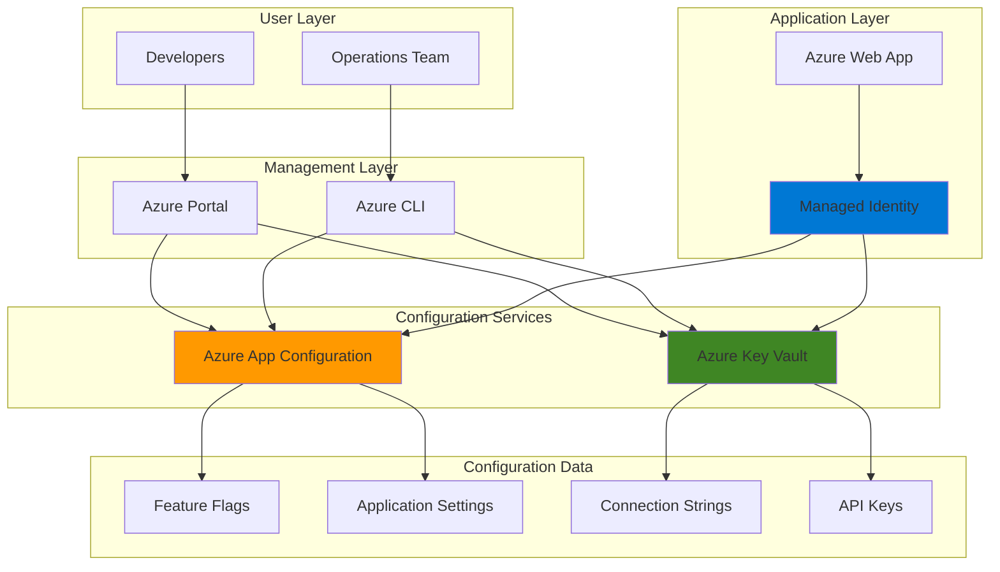

# Centralized Configuration Management with App Configuration and Key Vault

## Problem

Modern applications often struggle with scattered configuration settings across multiple deployment environments, leading to configuration drift, security vulnerabilities from hardcoded secrets, and operational overhead when updating application settings. Development teams face challenges managing feature flags, environment-specific configurations, and ensuring sensitive data like connection strings and API keys are properly secured without impacting application performance or requiring application restarts for configuration updates.

## Solution

Azure App Configuration provides a centralized configuration store that enables dynamic configuration updates and feature flag management, while Azure Key Vault securely stores application secrets with enterprise-grade encryption and access controls. By integrating these services with Azure Web Apps, applications can retrieve both public configuration settings and sensitive secrets through secure, managed connections that eliminate hardcoded values and enable real-time configuration changes without application downtime.

## Architecture Diagram



## Prerequisites

1. Azure account with appropriate permissions for App Configuration, Key Vault, and Web Apps
2. Azure CLI v2 installed and configured (or Azure CloudShell)
3. Basic understanding of Azure Resource Manager and managed identities
4. Familiarity with web application deployment concepts
5. Estimated cost: $5-15 USD for resources created during this recipe

> **Note**: This recipe follows Azure Well-Architected Framework principles for security and operational excellence. Resources will be configured with managed identities to eliminate credential management complexity.

## Preparation

```bash
# Set environment variables for Azure resources
export RESOURCE_GROUP="rg-config-mgmt-${RANDOM_SUFFIX}"
export LOCATION="eastus"
export SUBSCRIPTION_ID=$(az account show --query id --output tsv)

# Generate unique suffix for resource names
RANDOM_SUFFIX=$(openssl rand -hex 3)

# Set resource names with unique suffixes
export APP_CONFIG_NAME="ac-config-${RANDOM_SUFFIX}"
export KEY_VAULT_NAME="kv-secrets-${RANDOM_SUFFIX}"
export WEB_APP_NAME="wa-demo-${RANDOM_SUFFIX}"
export APP_SERVICE_PLAN="asp-demo-${RANDOM_SUFFIX}"

# Create resource group with appropriate tags
az group create \
    --name ${RESOURCE_GROUP} \
    --location ${LOCATION} \
    --tags purpose=recipe environment=demo \
           recipe="config-management"

echo "✅ Resource group created: ${RESOURCE_GROUP}"
echo "📝 Configuration values:"
echo "   App Configuration: ${APP_CONFIG_NAME}"
echo "   Key Vault: ${KEY_VAULT_NAME}"
echo "   Web App: ${WEB_APP_NAME}"
```

## Steps

1. **Create Azure App Configuration Store**:

   Azure App Configuration provides a centralized repository for application settings and feature flags, enabling dynamic configuration management without application restarts. This managed service supports configuration versioning, labeling for environment-specific settings, and real-time updates that applications can consume through provider libraries or REST APIs.

   ```bash
   # Create App Configuration store with Standard tier
   az appconfig create \
       --name ${APP_CONFIG_NAME} \
       --resource-group ${RESOURCE_GROUP} \
       --location ${LOCATION} \
       --sku Standard \
       --tags environment=demo purpose=configuration

   # Get App Configuration endpoint for later use
   export APP_CONFIG_ENDPOINT=$(az appconfig show \
       --name ${APP_CONFIG_NAME} \
       --resource-group ${RESOURCE_GROUP} \
       --query endpoint --output tsv)

   echo "✅ App Configuration store created: ${APP_CONFIG_NAME}"
   echo "🔗 Endpoint: ${APP_CONFIG_ENDPOINT}"
   ```

   The App Configuration store is now ready with Standard tier capabilities, including feature flags, configuration labeling, and point-in-time recovery. This foundational service will centralize all non-sensitive application settings and enable advanced configuration management scenarios.

2. **Create Azure Key Vault for Secrets Management**:

   Azure Key Vault provides enterprise-grade security for storing application secrets, certificates, and cryptographic keys. The service uses hardware security modules (HSMs) for key protection and integrates seamlessly with Azure Active Directory for access control, ensuring sensitive configuration data remains encrypted and auditable.

   ```bash
   # Create Key Vault with soft delete and purge protection
   az keyvault create \
       --name ${KEY_VAULT_NAME} \
       --resource-group ${RESOURCE_GROUP} \
       --location ${LOCATION} \
       --sku Standard \
       --enable-soft-delete true \
       --retention-days 7 \
       --tags environment=demo purpose=secrets

   # Get current user object ID for Key Vault permissions
   export USER_OBJECT_ID=$(az ad signed-in-user show \
       --query id --output tsv)

   # Grant current user full access to Key Vault secrets
   az keyvault set-policy \
       --name ${KEY_VAULT_NAME} \
       --object-id ${USER_OBJECT_ID} \
       --secret-permissions all

   echo "✅ Key Vault created: ${KEY_VAULT_NAME}"
   ```

   The Key Vault is configured with security best practices including soft delete protection and will serve as the secure repository for all sensitive application configuration data, integrating with App Configuration through Key Vault references.

3. **Create Sample Configuration Settings and Secrets**:

   Application configuration typically includes both public settings that can be viewed by operations teams and sensitive secrets that require secure storage. This step demonstrates the proper separation of concerns by storing public configuration in App Configuration and sensitive data in Key Vault.

   ```bash
   # Add application settings to App Configuration
   az appconfig kv set \
       --name ${APP_CONFIG_NAME} \
       --key "App:Name" \
       --value "Demo Configuration App" \
       --label "Production"

   az appconfig kv set \
       --name ${APP_CONFIG_NAME} \
       --key "App:Version" \
       --value "1.0.0" \
       --label "Production"

   az appconfig kv set \
       --name ${APP_CONFIG_NAME} \
       --key "Features:EnableLogging" \
       --value "true" \
       --label "Production"

   # Create a feature flag for A/B testing
   az appconfig feature set \
       --name ${APP_CONFIG_NAME} \
       --feature "BetaFeatures" \
       --label "Production" \
       --yes

   # Add secrets to Key Vault
   az keyvault secret set \
       --vault-name ${KEY_VAULT_NAME} \
       --name "DatabaseConnection" \
       --value "Server=db.example.com;Database=prod;Uid=admin;Pwd=SecureP@ssw0rd123;"

   az keyvault secret set \
       --vault-name ${KEY_VAULT_NAME} \
       --name "ApiKey" \
       --value "sk-1234567890abcdef1234567890abcdef"

   echo "✅ Configuration settings and secrets created"
   ```

   The configuration hierarchy is now established with public settings in App Configuration labeled for the Production environment, and sensitive secrets securely stored in Key Vault with automatic encryption and access logging.

4. **Create App Service Plan and Web App**:

   Azure Web Apps provide managed hosting for web applications with built-in integration for Azure App Configuration and Key Vault. Creating an App Service Plan establishes the compute resources, while the Web App provides the runtime environment with managed identity capabilities for secure service-to-service authentication.

   ```bash
   # Create App Service Plan with Basic tier
   az appservice plan create \
       --name ${APP_SERVICE_PLAN} \
       --resource-group ${RESOURCE_GROUP} \
       --location ${LOCATION} \
       --sku B1 \
       --is-linux \
       --tags environment=demo purpose=hosting

   # Create Web App with Node.js runtime
   az webapp create \
       --name ${WEB_APP_NAME} \
       --resource-group ${RESOURCE_GROUP} \
       --plan ${APP_SERVICE_PLAN} \
       --runtime "NODE:18-lts" \
       --tags environment=demo purpose=application

   echo "✅ Web App created: ${WEB_APP_NAME}"
   echo "🌐 URL: https://${WEB_APP_NAME}.azurewebsites.net"
   ```

   The Web App is now deployed with a Linux-based App Service Plan and Node.js runtime, providing the foundation for demonstrating centralized configuration management with automatic scaling and integrated monitoring capabilities.

5. **Enable Managed Identity for Web App**:

   Managed identities eliminate the need for storing credentials in code or configuration by providing Azure resources with automatically managed identities in Azure Active Directory. This enables secure authentication to other Azure services without credential management overhead.

   ```bash
   # Enable system-assigned managed identity
   az webapp identity assign \
       --name ${WEB_APP_NAME} \
       --resource-group ${RESOURCE_GROUP}

   # Get the managed identity object ID
   export WEBAPP_IDENTITY=$(az webapp identity show \
       --name ${WEB_APP_NAME} \
       --resource-group ${RESOURCE_GROUP} \
       --query principalId --output tsv)

   echo "✅ Managed identity enabled for Web App"
   echo "🔑 Identity Object ID: ${WEBAPP_IDENTITY}"
   ```

   The Web App now has a system-assigned managed identity that Azure automatically manages, providing a secure way to authenticate to App Configuration and Key Vault without storing any credentials in the application code or configuration files.

6. **Grant Permissions to Access Configuration Services**:

   Role-based access control (RBAC) ensures the Web App's managed identity has appropriate permissions to read configuration data while following the principle of least privilege. These permissions enable the application to dynamically retrieve settings and secrets at runtime.

   ```bash
   # Grant App Configuration Data Reader role to Web App identity
   az role assignment create \
       --assignee ${WEBAPP_IDENTITY} \
       --role "App Configuration Data Reader" \
       --scope "/subscriptions/${SUBSCRIPTION_ID}/resourceGroups/${RESOURCE_GROUP}/providers/Microsoft.AppConfiguration/configurationStores/${APP_CONFIG_NAME}"

   # Grant Key Vault Secrets User role to Web App identity
   az keyvault set-policy \
       --name ${KEY_VAULT_NAME} \
       --object-id ${WEBAPP_IDENTITY} \
       --secret-permissions get list

   echo "✅ Permissions granted to Web App managed identity"
   ```

   The managed identity now has read-only access to App Configuration settings and Key Vault secrets, enabling the Web App to securely retrieve configuration data using Azure's built-in authentication mechanisms without exposing credentials.

7. **Configure Web App Settings with Configuration References**:

   Azure Web Apps support direct integration with App Configuration and Key Vault through application settings that reference external configuration sources. This approach enables dynamic configuration updates and secure secret retrieval without modifying application code.

   ```bash
   # Configure App Configuration connection
   az webapp config appsettings set \
       --name ${WEB_APP_NAME} \
       --resource-group ${RESOURCE_GROUP} \
       --settings "AZURE_APP_CONFIG_ENDPOINT=${APP_CONFIG_ENDPOINT}"

   # Add Key Vault references as application settings
   az webapp config appsettings set \
       --name ${WEB_APP_NAME} \
       --resource-group ${RESOURCE_GROUP} \
       --settings "DATABASE_CONNECTION=@Microsoft.KeyVault(VaultName=${KEY_VAULT_NAME};SecretName=DatabaseConnection)"

   az webapp config appsettings set \
       --name ${WEB_APP_NAME} \
       --resource-group ${RESOURCE_GROUP} \
       --settings "API_KEY=@Microsoft.KeyVault(VaultName=${KEY_VAULT_NAME};SecretName=ApiKey)"

   echo "✅ Web App configured with configuration references"
   ```

   The Web App now automatically resolves Key Vault references at runtime, providing secure access to secrets while maintaining the configuration endpoint for dynamic settings retrieval. This configuration enables real-time updates without application restarts.

8. **Deploy Simple Demo Application**:

   A demonstration application helps validate the configuration management setup by showing how applications can consume both App Configuration settings and Key Vault secrets through standard environment variables and Azure SDK libraries.

   ```bash
   # Create a simple Node.js application that demonstrates config usage
   cat > app.js << 'EOF'
const express = require('express');
const app = express();
const port = process.env.PORT || 3000;

app.get('/', (req, res) => {
    const config = {
        appConfigEndpoint: process.env.AZURE_APP_CONFIG_ENDPOINT || 'Not configured',
        databaseConnection: process.env.DATABASE_CONNECTION ? 'Configured (hidden)' : 'Not configured',
        apiKey: process.env.API_KEY ? 'Configured (hidden)' : 'Not configured',
        timestamp: new Date().toISOString()
    };
    
    res.json({
        message: 'Centralized Configuration Demo',
        configuration: config,
        status: 'success'
    });
});

app.listen(port, () => {
    console.log(`App listening at port ${port}`);
});
EOF

   # Create package.json for the demo app
   cat > package.json << 'EOF'
{
    "name": "config-demo",
    "version": "1.0.0",
    "main": "app.js",
    "dependencies": {
        "express": "^4.18.0"
    },
    "scripts": {
        "start": "node app.js"
    }
}
EOF

   # Deploy the application using zip deployment
   zip -r app.zip app.js package.json

   az webapp deploy \
       --name ${WEB_APP_NAME} \
       --resource-group ${RESOURCE_GROUP} \
       --src-path app.zip \
       --type zip

   # Clean up local files
   rm app.js package.json app.zip

   echo "✅ Demo application deployed successfully"
   ```

   The demonstration application is now deployed and configured to display configuration status, showing how real applications can access centralized configuration data through environment variables that are automatically populated from App Configuration and Key Vault.

## Validation & Testing

1. **Verify Web App Configuration Access**:

   ```bash
   # Test the deployed application
   curl -s "https://${WEB_APP_NAME}.azurewebsites.net" | jq '.'
   ```

   Expected output: JSON response showing configuration status with "Configured" values for secrets and the App Configuration endpoint URL.

2. **Test Configuration Retrieval from App Configuration**:

   ```bash
   # List all configuration values in App Configuration
   az appconfig kv list \
       --name ${APP_CONFIG_NAME} \
       --label "Production" \
       --query "[].{Key:key, Value:value}" \
       --output table
   ```

   Expected output: Table showing the application settings created earlier with their values.

3. **Verify Feature Flag Configuration**:

   ```bash
   # Check feature flag status
   az appconfig feature show \
       --name ${APP_CONFIG_NAME} \
       --feature "BetaFeatures" \
       --label "Production" \
       --query "{Feature:key, Enabled:enabled}" \
       --output table
   ```

   Expected output: Feature flag status showing "BetaFeatures" as enabled.

4. **Test Key Vault Secret Access**:

   ```bash
   # Verify secrets are accessible (without revealing values)
   az keyvault secret list \
       --vault-name ${KEY_VAULT_NAME} \
       --query "[].{Name:name, Enabled:attributes.enabled}" \
       --output table
   ```

   Expected output: List of secrets showing "DatabaseConnection" and "ApiKey" as enabled.

## Cleanup

1. **Remove Web App and App Service Plan**:

   ```bash
   # Delete Web App
   az webapp delete \
       --name ${WEB_APP_NAME} \
       --resource-group ${RESOURCE_GROUP}

   # Delete App Service Plan
   az appservice plan delete \
       --name ${APP_SERVICE_PLAN} \
       --resource-group ${RESOURCE_GROUP} \
       --yes

   echo "✅ Web App and App Service Plan deleted"
   ```

2. **Remove Key Vault (with purge to avoid retention)**:

   ```bash
   # Delete Key Vault
   az keyvault delete \
       --name ${KEY_VAULT_NAME} \
       --resource-group ${RESOURCE_GROUP}

   # Purge Key Vault to completely remove it
   az keyvault purge \
       --name ${KEY_VAULT_NAME} \
       --location ${LOCATION}

   echo "✅ Key Vault deleted and purged"
   ```

3. **Remove App Configuration Store**:

   ```bash
   # Delete App Configuration store
   az appconfig delete \
       --name ${APP_CONFIG_NAME} \
       --resource-group ${RESOURCE_GROUP} \
       --yes

   echo "✅ App Configuration store deleted"
   ```

4. **Remove Resource Group**:

   ```bash
   # Delete resource group and all remaining resources
   az group delete \
       --name ${RESOURCE_GROUP} \
       --yes \
       --no-wait

   echo "✅ Resource group deletion initiated: ${RESOURCE_GROUP}"
   echo "Note: Deletion may take several minutes to complete"
   ```

## Discussion

Centralized application configuration management addresses critical operational challenges in modern cloud applications by separating configuration concerns from application code and providing secure, auditable access to sensitive data. Azure App Configuration and Key Vault together create a comprehensive solution that enables DevOps teams to manage application settings dynamically while maintaining security best practices. The [Azure App Configuration service](https://docs.microsoft.com/en-us/azure/azure-app-configuration/) provides advanced features like feature flags, configuration labeling for different environments, and real-time configuration refresh without application restarts, following the [Azure Well-Architected Framework operational excellence pillar](https://docs.microsoft.com/en-us/azure/architecture/framework/devops/overview).

The integration pattern demonstrated here leverages managed identities to eliminate credential management complexity while providing granular access control through Azure role-based access control (RBAC). This approach aligns with the [Azure security baseline for App Configuration](https://docs.microsoft.com/en-us/security/benchmark/azure/baselines/app-configuration-security-baseline) and [Key Vault security best practices](https://docs.microsoft.com/en-us/azure/key-vault/general/security-overview), ensuring that sensitive configuration data remains protected while being easily accessible to authorized applications. The use of Key Vault references in Web App settings provides automatic secret rotation support and audit logging for compliance requirements.

From an operational perspective, this architecture enables configuration changes without application deployments, reducing deployment risks and enabling faster response to operational requirements. The separation between public configuration settings and sensitive secrets allows different team members to manage appropriate aspects of application configuration while maintaining security boundaries. For comprehensive guidance on implementing configuration management at scale, see the [Azure App Configuration best practices](https://docs.microsoft.com/en-us/azure/azure-app-configuration/howto-best-practices) and [enterprise-scale configuration management patterns](https://docs.microsoft.com/en-us/azure/architecture/patterns/external-configuration-store).

> **Tip**: Use Azure Monitor and Application Insights to track configuration changes and their impact on application performance. The [monitoring and diagnostics documentation](https://docs.microsoft.com/en-us/azure/azure-app-configuration/monitor-app-configuration) provides comprehensive guidance on setting up alerts and tracking configuration access patterns for optimization and security purposes.

## Challenge

Extend this solution by implementing these enhancements:

1. **Multi-Environment Configuration**: Set up separate App Configuration labels for Development, Staging, and Production environments with environment-specific feature flags and configuration values.

2. **Automated Configuration Deployment**: Create an Azure DevOps pipeline or GitHub Actions workflow that automatically updates App Configuration settings and Key Vault secrets based on configuration files in source control.

3. **Configuration Refresh Integration**: Implement real-time configuration refresh in the demo application using the Azure App Configuration provider libraries to automatically detect and apply configuration changes without restarts.

4. **Advanced Security Controls**: Add Azure Private Link endpoints for both App Configuration and Key Vault to restrict network access, and implement Azure Policy to enforce configuration compliance across multiple applications.

5. **Configuration Backup and Disaster Recovery**: Implement cross-region replication of App Configuration settings and Key Vault secrets with automated failover capabilities for high availability scenarios.

## Infrastructure Code

*Infrastructure code will be generated after recipe approval.*