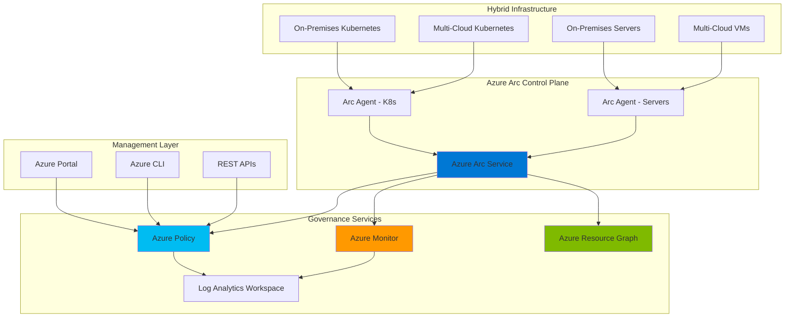

# Centralized Hybrid Cloud Governance with Arc and Policy

## Problem

Organizations managing resources across on-premises datacenters, multiple cloud providers, and edge locations struggle with inconsistent governance, compliance monitoring, and policy enforcement. Traditional approaches require separate management tools for each environment, leading to operational complexity, security gaps, and compliance risks. Without centralized visibility and control, IT teams cannot ensure consistent security baselines, track compliance status, or automate remediation across their entire hybrid estate.

## Solution

Azure Arc extends Azure governance capabilities to any infrastructure, enabling centralized policy enforcement and compliance monitoring across hybrid and multi-cloud environments. By combining Azure Arc with Azure Policy, Azure Monitor, and Azure Resource Graph, organizations can implement a unified governance framework that enforces security baselines, tracks compliance status, and automates remediation across on-premises Kubernetes clusters, servers, and multi-cloud resources using Azure's native management tools.

## Architecture Diagram



## Prerequisites

1. Azure subscription with Owner or Contributor permissions to create resources
2. Azure CLI v2.50.0 or later installed and configured (or use Azure Cloud Shell)
3. kubectl CLI tool installed for Kubernetes cluster management
4. Access to on-premises or multi-cloud Kubernetes clusters (version 1.27+)
5. Access to on-premises or multi-cloud servers (Windows Server 2012 R2+ or Linux)
6. Network connectivity from hybrid resources to Azure endpoints
7. Estimated cost: $0 for Arc connection, ~$2.30/GB for monitoring data ingestion

> **Note**: Azure Arc for servers and Kubernetes is free to connect. You only pay for enabled services like Azure Monitor log ingestion and Azure Policy guest configuration.

## Preparation

```bash
# Set environment variables
export RESOURCE_GROUP="rg-arc-governance-${RANDOM_SUFFIX}"
export LOCATION="eastus"
export SUBSCRIPTION_ID=$(az account show --query id --output tsv)

# Generate unique suffix for resource names
RANDOM_SUFFIX=$(openssl rand -hex 3)

# Create resource group for Arc resources
az group create \
    --name ${RESOURCE_GROUP} \
    --location ${LOCATION} \
    --tags purpose=hybrid-governance environment=demo

# Create Log Analytics workspace for monitoring
export WORKSPACE_NAME="law-arc-${RANDOM_SUFFIX}"
az monitor log-analytics workspace create \
    --resource-group ${RESOURCE_GROUP} \
    --workspace-name ${WORKSPACE_NAME} \
    --location ${LOCATION}

# Get workspace ID for later use
export WORKSPACE_ID=$(az monitor log-analytics workspace show \
    --resource-group ${RESOURCE_GROUP} \
    --workspace-name ${WORKSPACE_NAME} \
    --query customerId --output tsv)

echo "✅ Resource group and Log Analytics workspace created"
```

## Steps

1. **Connect On-Premises Kubernetes Cluster to Azure Arc**:

   Azure Arc-enabled Kubernetes provides a centralized control plane to manage policy, governance, and security across Kubernetes clusters running anywhere. The Arc agent establishes a secure outbound connection to Azure, enabling you to project your clusters into Azure Resource Manager. This projection allows you to apply Azure-native management capabilities to non-Azure Kubernetes infrastructure while maintaining local cluster autonomy.

   ```bash
   # Install or update the connectedk8s extension
   az extension add --name connectedk8s --upgrade
   
   # Set cluster name and create Arc connection
   export CLUSTER_NAME="arc-k8s-onprem-${RANDOM_SUFFIX}"
   
   # Connect the Kubernetes cluster to Azure Arc
   az connectedk8s connect \
       --name ${CLUSTER_NAME} \
       --resource-group ${RESOURCE_GROUP} \
       --location ${LOCATION} \
       --tags environment=onpremises type=kubernetes
   
   # Verify the connection status
   az connectedk8s show \
       --name ${CLUSTER_NAME} \
       --resource-group ${RESOURCE_GROUP} \
       --query connectivityStatus --output table
   
   echo "✅ Kubernetes cluster connected to Azure Arc"
   ```

   The Kubernetes cluster is now projected into Azure Resource Manager as an Arc-enabled resource. This enables centralized management while the cluster continues to run independently in your on-premises environment. The Arc agents maintain a secure, authenticated connection to Azure for policy synchronization and compliance reporting.

2. **Enable Azure Policy Extension for Arc-enabled Kubernetes**:

   Azure Policy for Kubernetes extends Open Policy Agent (OPA) Gatekeeper v3 to apply at-scale enforcements and safeguards on your clusters in a centralized, consistent manner. By enabling the Azure Policy extension, you can use Azure Policy definitions to govern cluster components like pods, namespaces, and ingress rules. The extension continuously synchronizes policy assignments and reports compliance status back to Azure.

   ```bash
   # Install k8s-extension if not already available
   az extension add --name k8s-extension --upgrade
   
   # Enable Azure Policy extension on the Arc-enabled cluster
   az k8s-extension create \
       --name azurepolicy \
       --cluster-name ${CLUSTER_NAME} \
       --resource-group ${RESOURCE_GROUP} \
       --cluster-type connectedClusters \
       --extension-type Microsoft.PolicyInsights
   
   # Wait for extension installation to complete
   echo "Waiting for Azure Policy extension to be installed..."
   sleep 60
   
   # Verify extension status
   az k8s-extension show \
       --name azurepolicy \
       --cluster-name ${CLUSTER_NAME} \
       --resource-group ${RESOURCE_GROUP} \
       --cluster-type connectedClusters \
       --query installState --output table
   
   echo "✅ Azure Policy extension installed on Kubernetes cluster"
   ```

   The Azure Policy extension is now installed and operational on your Kubernetes cluster. This extension deploys OPA Gatekeeper components and establishes communication channels with Azure Policy service, enabling real-time policy evaluation and compliance reporting across your Kubernetes workloads.

3. **Connect On-Premises Servers to Azure Arc**:

   Azure Arc-enabled servers allow you to manage Windows and Linux physical servers and virtual machines hosted outside of Azure with the same Azure-native management capabilities. The Azure Connected Machine agent establishes the connection and enables features like Azure Policy guest configuration, Azure Monitor integration, and Azure Update Management. This unified approach eliminates the need for separate tools across different environments.

   ```bash
   # Create service principal for server onboarding
   export SP_NAME="sp-arc-onboarding-${RANDOM_SUFFIX}"
   SP_CREDENTIALS=$(az ad sp create-for-rbac \
       --name ${SP_NAME} \
       --role "Azure Connected Machine Onboarding" \
       --scopes /subscriptions/${SUBSCRIPTION_ID}/resourceGroups/${RESOURCE_GROUP} \
       --output json)
   
   export SP_ID=$(echo $SP_CREDENTIALS | jq -r '.appId')
   export SP_SECRET=$(echo $SP_CREDENTIALS | jq -r '.password')
   export TENANT_ID=$(echo $SP_CREDENTIALS | jq -r '.tenant')
   
   echo "✅ Service principal created for server onboarding"
   echo "Use the following commands on each server to connect to Azure Arc:"
   echo ""
   echo "# For Linux servers:"
   echo "wget https://aka.ms/azcmagent -O ~/Install_linux_azcmagent.sh"
   echo "bash ~/Install_linux_azcmagent.sh"
   echo "azcmagent connect \\"
   echo "    --service-principal-id '${SP_ID}' \\"
   echo "    --service-principal-secret '${SP_SECRET}' \\"
   echo "    --tenant-id '${TENANT_ID}' \\"
   echo "    --subscription-id '${SUBSCRIPTION_ID}' \\"
   echo "    --resource-group '${RESOURCE_GROUP}' \\"
   echo "    --location '${LOCATION}'"
   echo ""
   echo "# For Windows servers:"
   echo "Download and install: https://aka.ms/AzureConnectedMachineAgent"
   echo "azcmagent connect \\"
   echo "    --service-principal-id '${SP_ID}' \\"
   echo "    --service-principal-secret '${SP_SECRET}' \\"
   echo "    --tenant-id '${TENANT_ID}' \\"
   echo "    --subscription-id '${SUBSCRIPTION_ID}' \\"
   echo "    --resource-group '${RESOURCE_GROUP}' \\"
   echo "    --location '${LOCATION}'"
   ```

   The service principal and connection commands are now configured for Arc-enabled server onboarding. Run the provided commands on each server you want to connect. Once connected, servers appear in Azure Resource Manager and can be managed using Azure tools while continuing to operate in their current location.

4. **Create and Assign Governance Policies**:

   Azure Policy enables you to enforce organizational standards and assess compliance at scale. For hybrid environments, you can use built-in policy definitions or create custom policies that apply to both Arc-enabled servers and Kubernetes clusters. Policy effects include audit, deny, deploy if not exists, and modify, allowing you to both prevent non-compliant resources and automatically remediate existing ones.

   ```bash
   # Assign built-in policy initiative for Arc-enabled servers
   az policy assignment create \
       --name "arc-servers-baseline" \
       --display-name "Security baseline for Arc-enabled servers" \
       --scope "/subscriptions/${SUBSCRIPTION_ID}/resourceGroups/${RESOURCE_GROUP}" \
       --policy-set-definition "/providers/Microsoft.Authorization/policySetDefinitions/c96b2f5d-8c94-4588-bb6e-0e1295d5a6d4" \
       --location ${LOCATION} \
       --identity-scope "/subscriptions/${SUBSCRIPTION_ID}/resourceGroups/${RESOURCE_GROUP}" \
       --role Contributor \
       --assign-identity SystemAssigned
   
   # Assign Kubernetes policy for container security
   az policy assignment create \
       --name "k8s-container-security" \
       --display-name "Kubernetes container security baseline" \
       --scope "/subscriptions/${SUBSCRIPTION_ID}/resourceGroups/${RESOURCE_GROUP}" \
       --policy "/providers/Microsoft.Authorization/policyDefinitions/95edb821-ddaf-4404-9732-666045e056b4" \
       --params '{"effect":{"value":"audit"}}'
   
   echo "✅ Governance policies assigned to Arc resources"
   ```

   These policy assignments now actively evaluate your hybrid resources against defined compliance standards. The policies will continuously assess resource configurations and report compliance status to Azure Policy, enabling centralized visibility across your entire hybrid estate.

5. **Configure Monitoring and Diagnostics**:

   Azure Monitor provides comprehensive monitoring for Arc-enabled resources, collecting metrics, logs, and diagnostic information in a centralized Log Analytics workspace. This integration enables you to analyze performance, troubleshoot issues, and maintain security visibility across hybrid environments using the same tools and queries you use for native Azure resources.

   ```bash
   # Enable monitoring for Arc-enabled Kubernetes
   az k8s-extension create \
       --name azuremonitor-containers \
       --cluster-name ${CLUSTER_NAME} \
       --resource-group ${RESOURCE_GROUP} \
       --cluster-type connectedClusters \
       --extension-type Microsoft.AzureMonitor.Containers \
       --configuration-settings logAnalyticsWorkspaceResourceID="/subscriptions/${SUBSCRIPTION_ID}/resourceGroups/${RESOURCE_GROUP}/providers/Microsoft.OperationalInsights/workspaces/${WORKSPACE_NAME}"
   
   # Create data collection rule for Arc-enabled servers
   export DCR_NAME="dcr-arc-servers-${RANDOM_SUFFIX}"
   az monitor data-collection rule create \
       --name ${DCR_NAME} \
       --resource-group ${RESOURCE_GROUP} \
       --location ${LOCATION} \
       --rule-file /dev/stdin << EOF
   {
     "location": "${LOCATION}",
     "properties": {
       "destinations": {
         "logAnalytics": [{
           "workspaceResourceId": "/subscriptions/${SUBSCRIPTION_ID}/resourceGroups/${RESOURCE_GROUP}/providers/Microsoft.OperationalInsights/workspaces/${WORKSPACE_NAME}",
           "name": "centralWorkspace"
         }]
       },
       "dataSources": {
         "performanceCounters": [{
           "streams": ["Microsoft-Perf"],
           "samplingFrequencyInSeconds": 60,
           "counterSpecifiers": [
             "\\Processor(_Total)\\% Processor Time",
             "\\Memory\\Available Bytes",
             "\\LogicalDisk(_Total)\\% Free Space"
           ],
           "name": "perfCounterDataSource"
         }]
       },
       "dataFlows": [{
         "streams": ["Microsoft-Perf"],
         "destinations": ["centralWorkspace"]
       }]
     }
   }
   EOF
   
   echo "✅ Monitoring configured for Arc resources"
   ```

   Monitoring infrastructure is now established for your Arc-enabled resources. Container insights will collect performance metrics, logs, and telemetry from Kubernetes workloads, while the data collection rule ensures Arc-enabled servers send performance counters to the centralized workspace for analysis and alerting.

6. **Set Up Azure Resource Graph Queries for Compliance Reporting**:

   Azure Resource Graph provides a powerful query language to explore resources at scale across subscriptions. For hybrid governance, Resource Graph enables you to query compliance status, resource configurations, and policy evaluation results across all Arc-enabled resources. This capability is essential for creating compliance dashboards and generating audit reports.

   ```bash
   # Query to get all Arc-enabled resources
   az graph query -q "Resources | where type =~ 'microsoft.hybridcompute/machines' or type =~ 'microsoft.kubernetes/connectedclusters' | project name, type, location, resourceGroup, subscriptionId | order by type asc" \
       --output table
   
   # Query to check policy compliance for Arc resources
   az graph query -q "PolicyResources | where type =~ 'microsoft.policyinsights/policystates' | where properties.resourceType contains 'microsoft.hybridcompute' or properties.resourceType contains 'microsoft.kubernetes' | summarize count() by tostring(properties.complianceState)" \
       --output table
   
   # Create a saved query for ongoing compliance monitoring
   az graph shared-query create \
       --name "arc-compliance-status" \
       --resource-group ${RESOURCE_GROUP} \
       --description "Monitor compliance status of Arc-enabled resources" \
       --query "PolicyResources | where type =~ 'microsoft.policyinsights/policystates' | where properties.resourceType contains 'microsoft.hybridcompute' or properties.resourceType contains 'microsoft.kubernetes' | project resourceId=properties.resourceId, complianceState=properties.complianceState, policyDefinitionName=properties.policyDefinitionName, timestamp=properties.timestamp | order by timestamp desc"
   
   echo "✅ Resource Graph queries configured for compliance reporting"
   ```

   Resource Graph queries now provide real-time visibility into your hybrid estate's compliance posture. These queries can be scheduled, exported, or integrated into Power BI dashboards for executive reporting and continuous compliance monitoring.

7. **Implement Automated Remediation with Azure Policy**:

   Azure Policy's remediation capabilities enable automatic correction of non-compliant resources, reducing manual intervention and ensuring continuous compliance. For Arc-enabled resources, you can create remediation tasks that deploy missing configurations, modify existing settings, or trigger custom scripts through Azure Policy's DeployIfNotExists and Modify effects.

   ```bash
   # Create remediation task for non-compliant Arc servers
   ASSIGNMENT_ID=$(az policy assignment show \
       --name "arc-servers-baseline" \
       --scope "/subscriptions/${SUBSCRIPTION_ID}/resourceGroups/${RESOURCE_GROUP}" \
       --query id --output tsv)
   
   az policy remediation create \
       --name "remediate-arc-servers" \
       --resource-group ${RESOURCE_GROUP} \
       --policy-assignment ${ASSIGNMENT_ID} \
       --location-filters ${LOCATION}
   
   # Monitor remediation progress
   az policy remediation show \
       --name "remediate-arc-servers" \
       --resource-group ${RESOURCE_GROUP} \
       --query '{Status:provisioningState,ResourcesRemediated:deploymentSummary.successfulCount}' \
       --output table
   
   echo "✅ Automated remediation configured for policy compliance"
   ```

   Automated remediation is now active for your hybrid environment. The remediation task will automatically correct non-compliant configurations on Arc-enabled servers, ensuring continuous adherence to organizational standards without manual intervention.

## Validation & Testing

1. Verify Arc-enabled Kubernetes cluster status:

   ```bash
   # Check cluster connection and compliance status
   az connectedk8s show \
       --name ${CLUSTER_NAME} \
       --resource-group ${RESOURCE_GROUP} \
       --query '{Name:name,Status:connectivityStatus,Distribution:distribution,Version:kubernetesVersion}' \
       --output table
   ```

   Expected output: A table showing the cluster name, "Connected" status, distribution type, and Kubernetes version.

2. Validate Azure Policy enforcement on Kubernetes:

   ```bash
   # List policy assignments for the cluster
   az policy assignment list \
       --scope "/subscriptions/${SUBSCRIPTION_ID}/resourceGroups/${RESOURCE_GROUP}/providers/Microsoft.Kubernetes/connectedClusters/${CLUSTER_NAME}" \
       --query '[].{Name:name,State:enforcementMode}' \
       --output table
   
   # Check policy compliance state
   az policy state list \
       --resource "/subscriptions/${SUBSCRIPTION_ID}/resourceGroups/${RESOURCE_GROUP}/providers/Microsoft.Kubernetes/connectedClusters/${CLUSTER_NAME}" \
       --query '[].{Policy:policyDefinitionName,Compliance:complianceState}' \
       --output table
   ```

3. Test Resource Graph queries for compliance insights:

   ```bash
   # Query overall compliance percentage
   az graph query -q "PolicyResources | where type =~ 'microsoft.policyinsights/policystates' | where properties.resourceType contains 'arc' | summarize Total = count(), Compliant = countif(properties.complianceState =~ 'Compliant') | project CompliancePercentage = (todouble(Compliant) / todouble(Total)) * 100" \
       --output table
   ```

4. Verify monitoring data collection:

   ```bash
   # Query Log Analytics for Arc server heartbeats
   az monitor log-analytics query \
       --workspace ${WORKSPACE_ID} \
       --analytics-query "Heartbeat | where ResourceProvider == 'Microsoft.HybridCompute' | summarize LastHeartbeat = max(TimeGenerated) by Computer | order by LastHeartbeat desc | take 10" \
       --output table
   ```

## Cleanup

1. Remove Azure Policy assignments and remediation tasks:

   ```bash
   # Delete policy remediation task
   az policy remediation delete \
       --name "remediate-arc-servers" \
       --resource-group ${RESOURCE_GROUP}
   
   # Delete policy assignments
   az policy assignment delete \
       --name "arc-servers-baseline" \
       --scope "/subscriptions/${SUBSCRIPTION_ID}/resourceGroups/${RESOURCE_GROUP}"
   
   az policy assignment delete \
       --name "k8s-container-security" \
       --scope "/subscriptions/${SUBSCRIPTION_ID}/resourceGroups/${RESOURCE_GROUP}"
   
   echo "✅ Policy assignments removed"
   ```

2. Disconnect Arc-enabled Kubernetes cluster:

   ```bash
   # Remove monitoring extension first
   az k8s-extension delete \
       --name azuremonitor-containers \
       --cluster-name ${CLUSTER_NAME} \
       --resource-group ${RESOURCE_GROUP} \
       --cluster-type connectedClusters \
       --yes
   
   # Remove policy extension
   az k8s-extension delete \
       --name azurepolicy \
       --cluster-name ${CLUSTER_NAME} \
       --resource-group ${RESOURCE_GROUP} \
       --cluster-type connectedClusters \
       --yes
   
   # Disconnect the cluster from Arc
   az connectedk8s delete \
       --name ${CLUSTER_NAME} \
       --resource-group ${RESOURCE_GROUP} \
       --yes
   
   echo "✅ Kubernetes cluster disconnected from Azure Arc"
   ```

3. Clean up service principal and resource group:

   ```bash
   # Delete service principal
   az ad sp delete --id ${SP_ID}
   
   # Delete the entire resource group
   az group delete \
       --name ${RESOURCE_GROUP} \
       --yes \
       --no-wait
   
   echo "✅ Resource group deletion initiated: ${RESOURCE_GROUP}"
   echo "Note: Deletion may take several minutes to complete"
   ```

## Discussion

Azure Arc fundamentally transforms hybrid cloud governance by extending Azure's control plane to any infrastructure, creating a unified management experience across on-premises, multi-cloud, and edge environments. This architecture leverages Azure's native policy engine and monitoring capabilities to enforce consistent security baselines and compliance standards regardless of where resources are hosted. The integration with Azure Policy enables GitOps-style governance where policies are defined as code, version-controlled, and automatically enforced across the entire hybrid estate. For comprehensive guidance on implementing Azure Arc at scale, refer to the [Azure Arc documentation](https://docs.microsoft.com/en-us/azure/azure-arc/), [Cloud Adoption Framework for hybrid scenarios](https://docs.microsoft.com/en-us/azure/cloud-adoption-framework/scenarios/hybrid/), and [Azure Policy for Kubernetes documentation](https://docs.microsoft.com/en-us/azure/governance/policy/concepts/policy-for-kubernetes).

The combination of Azure Arc, Azure Policy, and Azure Monitor creates a powerful compliance and governance framework that addresses the key challenges of hybrid cloud management. By projecting non-Azure resources into Azure Resource Manager, organizations gain centralized visibility through Azure Resource Graph, enabling complex queries across their entire infrastructure portfolio. This approach aligns with the [Azure Well-Architected Framework](https://docs.microsoft.com/en-us/azure/architecture/framework/) principles of operational excellence and security, providing automated compliance assessment, drift detection, and remediation capabilities that would be impossible to achieve with traditional management tools.

From a security perspective, Azure Arc's agent-based architecture maintains a secure outbound connection to Azure, eliminating the need for inbound firewall rules while ensuring all management operations are authenticated and authorized through Microsoft Entra ID. The integration with Microsoft Defender for Cloud provides advanced threat detection and security posture management across hybrid workloads. For detailed security guidance, review the [Azure Arc security baseline](https://docs.microsoft.com/en-us/azure/azure-arc/servers/security-overview) and [governance best practices](https://docs.microsoft.com/en-us/azure/cloud-adoption-framework/scenarios/hybrid/arc-enabled-servers/eslz-security-governance-and-compliance).

> **Tip**: Use Azure Policy's built-in initiative definitions as a starting point for hybrid governance. These initiatives include hundreds of policies aligned with regulatory standards like ISO 27001, NIST, and CIS benchmarks, significantly accelerating your compliance journey.

## Challenge

Extend this solution by implementing these enhancements:

1. Create custom Azure Policy definitions that enforce organization-specific naming conventions and tagging requirements across all Arc-enabled resources
2. Implement Azure Automation runbooks that respond to policy violations by automatically creating ServiceNow tickets and triggering remediation workflows
3. Build a Power BI dashboard that visualizes compliance trends across different environments, resource types, and geographical regions using Resource Graph data
4. Integrate Azure Arc with GitHub Actions to implement GitOps-based configuration management for both Kubernetes applications and server configurations
5. Develop a cost optimization framework using Azure Policy to identify and remediate underutilized Arc-enabled resources based on monitoring metrics

## Infrastructure Code

### Available Infrastructure as Code:

- [Infrastructure Code Overview](code/README.md) - Detailed description of all infrastructure components
- [Bicep](code/bicep/) - Azure Bicep templates
- [Bash CLI Scripts](code/scripts/) - Example bash scripts using Azure CLI commands to deploy infrastructure
- [Terraform](code/terraform/) - Terraform configuration files