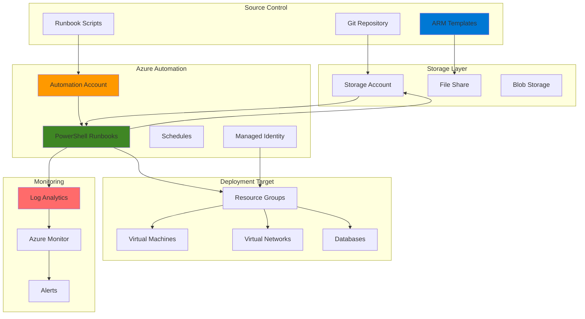

# Centralized Infrastructure Provisioning with Azure Automation and ARM Templates

## Problem

Enterprise organizations struggle with manual infrastructure provisioning processes that lead to configuration drift, deployment inconsistencies, and human error. Manual deployments often result in environment differences, security vulnerabilities, and lengthy deployment times that slow down development cycles and increase operational overhead.

## Solution

Azure Automation combined with Azure Resource Manager (ARM) templates provides a centralized, automated infrastructure provisioning system that ensures consistent deployments, reduces human error, and enables automated rollback capabilities. This solution leverages Azure Automation runbooks to orchestrate ARM template deployments with centralized logging and monitoring for enterprise-scale infrastructure management.

## Architecture Diagram



## Prerequisites

1. Azure subscription with Owner or Contributor permissions
2. Azure CLI installed and configured (or Azure Cloud Shell)
3. Basic knowledge of ARM templates and PowerShell
4. Understanding of Azure Resource Manager concepts
5. Estimated cost: $5-15 per month for automation resources

> **Note**: This recipe uses Azure Automation's PowerShell 7.2 runtime which provides improved performance and compatibility with modern Azure modules.

## Preparation

```bash
# Set environment variables for Azure resources
export RESOURCE_GROUP="rg-automation-demo"
export LOCATION="eastus"
export AUTOMATION_ACCOUNT="aa-infra-provisioning"
export STORAGE_ACCOUNT="stautoarmtemplates$(openssl rand -hex 3)"
export LOG_ANALYTICS_WORKSPACE="law-automation-monitoring"
export SUBSCRIPTION_ID=$(az account show --query id --output tsv)

# Generate unique suffix for resource names
RANDOM_SUFFIX=$(openssl rand -hex 3)

# Create resource group for automation infrastructure
az group create \
    --name ${RESOURCE_GROUP} \
    --location ${LOCATION} \
    --tags purpose=automation environment=demo

echo "✅ Resource group created: ${RESOURCE_GROUP}"

# Create Log Analytics workspace for centralized logging
az monitor log-analytics workspace create \
    --resource-group ${RESOURCE_GROUP} \
    --workspace-name ${LOG_ANALYTICS_WORKSPACE} \
    --location ${LOCATION} \
    --sku PerGB2018

echo "✅ Log Analytics workspace created for monitoring"
```

## Steps

1. **Create Azure Automation Account with Managed Identity**:

   Azure Automation provides a cloud-based automation service that allows you to orchestrate infrastructure deployments at scale. The Automation Account serves as the central hub for runbook execution, credential management, and scheduling. Managed Identity eliminates the need for stored credentials by providing secure, token-based authentication to Azure resources.

   ```bash
   # Create Azure Automation Account
   az automation account create \
       --resource-group ${RESOURCE_GROUP} \
       --name ${AUTOMATION_ACCOUNT} \
       --location ${LOCATION} \
       --sku Basic \
       --assign-identity

   # Get the managed identity principal ID
   MANAGED_IDENTITY_ID=$(az automation account show \
       --resource-group ${RESOURCE_GROUP} \
       --name ${AUTOMATION_ACCOUNT} \
       --query "identity.principalId" \
       --output tsv)

   echo "✅ Automation Account created with managed identity"
   echo "Managed Identity ID: ${MANAGED_IDENTITY_ID}"
   ```

   The Automation Account is now configured with a system-assigned managed identity, providing secure authentication for resource deployment operations. This identity will be used by runbooks to authenticate with Azure Resource Manager without storing credentials.

2. **Create Storage Account for ARM Template Storage**:

   Azure Storage provides secure, scalable storage for ARM templates and deployment artifacts. Creating a dedicated storage account ensures templates are centrally managed, version-controlled, and accessible to automation runbooks. The file share service enables easy template organization and retrieval during deployment processes.

   ```bash
   # Create storage account for ARM templates
   az storage account create \
       --name ${STORAGE_ACCOUNT} \
       --resource-group ${RESOURCE_GROUP} \
       --location ${LOCATION} \
       --sku Standard_LRS \
       --kind StorageV2

   # Get storage account key
   STORAGE_KEY=$(az storage account keys list \
       --resource-group ${RESOURCE_GROUP} \
       --account-name ${STORAGE_ACCOUNT} \
       --query "[0].value" \
       --output tsv)

   # Create file share for ARM templates
   az storage share create \
       --name arm-templates \
       --account-name ${STORAGE_ACCOUNT} \
       --account-key ${STORAGE_KEY}

   echo "✅ Storage account and file share created for ARM templates"
   ```

   The storage infrastructure is now ready to host ARM templates with secure access controls. This centralized template storage enables consistent deployments across multiple environments while maintaining version control and access audit trails.

3. **Configure Role-Based Access Control (RBAC)**:

   Azure Role-Based Access Control (RBAC) provides fine-grained access management for Azure resources. Assigning appropriate permissions to the managed identity ensures runbooks can deploy resources while maintaining security boundaries. The Contributor role enables resource creation and management within the specified resource group scope.

   ```bash
   # Assign Contributor role to managed identity for deployment operations
   az role assignment create \
       --assignee ${MANAGED_IDENTITY_ID} \
       --role "Contributor" \
       --scope "/subscriptions/${SUBSCRIPTION_ID}/resourceGroups/${RESOURCE_GROUP}"

   # Assign Storage Blob Data Contributor for template access
   az role assignment create \
       --assignee ${MANAGED_IDENTITY_ID} \
       --role "Storage Blob Data Contributor" \
       --scope "/subscriptions/${SUBSCRIPTION_ID}/resourceGroups/${RESOURCE_GROUP}/providers/Microsoft.Storage/storageAccounts/${STORAGE_ACCOUNT}"

   echo "✅ RBAC permissions configured for managed identity"
   ```

   The managed identity now has the necessary permissions to deploy infrastructure resources and access ARM templates from storage. This security model follows Azure's principle of least privilege while enabling automated deployment capabilities.

4. **Create Sample ARM Template for Infrastructure Deployment**:

   ARM templates provide declarative infrastructure definitions that ensure consistent, repeatable deployments. This template demonstrates best practices including parameterization, variable usage, and output generation. The template creates a virtual network and storage account to showcase typical infrastructure components.

   ```bash
   # Create local ARM template file
   cat > infrastructure-template.json << 'EOF'
   {
       "$schema": "https://schema.management.azure.com/schemas/2019-04-01/deploymentTemplate.json#",
       "contentVersion": "1.0.0.0",
       "parameters": {
           "storageAccountType": {
               "type": "string",
               "defaultValue": "Standard_LRS",
               "allowedValues": [
                   "Standard_LRS",
                   "Standard_GRS",
                   "Standard_ZRS"
               ],
               "metadata": {
                   "description": "Storage Account type"
               }
           },
           "location": {
               "type": "string",
               "defaultValue": "[resourceGroup().location]",
               "metadata": {
                   "description": "Location for all resources"
               }
           },
           "environment": {
               "type": "string",
               "defaultValue": "demo",
               "metadata": {
                   "description": "Environment tag"
               }
           }
       },
       "variables": {
           "storageAccountName": "[concat('st', uniqueString(resourceGroup().id))]",
           "virtualNetworkName": "[concat('vnet-', parameters('environment'), '-', uniqueString(resourceGroup().id))]",
           "subnetName": "default"
       },
       "resources": [
           {
               "type": "Microsoft.Storage/storageAccounts",
               "apiVersion": "2021-09-01",
               "name": "[variables('storageAccountName')]",
               "location": "[parameters('location')]",
               "tags": {
                   "environment": "[parameters('environment')]",
                   "deployment": "automated"
               },
               "sku": {
                   "name": "[parameters('storageAccountType')]"
               },
               "kind": "StorageV2",
               "properties": {
                   "allowBlobPublicAccess": false,
                   "supportsHttpsTrafficOnly": true
               }
           },
           {
               "type": "Microsoft.Network/virtualNetworks",
               "apiVersion": "2021-05-01",
               "name": "[variables('virtualNetworkName')]",
               "location": "[parameters('location')]",
               "tags": {
                   "environment": "[parameters('environment')]",
                   "deployment": "automated"
               },
               "properties": {
                   "addressSpace": {
                       "addressPrefixes": [
                           "10.0.0.0/16"
                       ]
                   },
                   "subnets": [
                       {
                           "name": "[variables('subnetName')]",
                           "properties": {
                               "addressPrefix": "10.0.1.0/24"
                           }
                       }
                   ]
               }
           }
       ],
       "outputs": {
           "storageAccountName": {
               "type": "string",
               "value": "[variables('storageAccountName')]"
           },
           "virtualNetworkName": {
               "type": "string",
               "value": "[variables('virtualNetworkName')]"
           },
           "deploymentTimestamp": {
               "type": "string",
               "value": "[utcNow()]"
           }
       }
   }
   EOF

   # Upload ARM template to storage account
   az storage file upload \
       --share-name arm-templates \
       --source infrastructure-template.json \
       --path infrastructure-template.json \
       --account-name ${STORAGE_ACCOUNT} \
       --account-key ${STORAGE_KEY}

   echo "✅ ARM template created and uploaded to storage"
   ```

   The ARM template is now stored in Azure Storage with comprehensive resource definitions and security configurations. This template serves as a foundation for automated infrastructure deployments with built-in best practices and error handling.

5. **Create PowerShell Runbook for Automated Deployment**:

   PowerShell runbooks provide the automation logic for ARM template deployment with error handling and logging capabilities. This runbook demonstrates managed identity authentication, template retrieval, deployment execution, and rollback strategies. The script includes comprehensive logging for audit trails and troubleshooting.

   ```bash
   # Create PowerShell runbook script
   cat > deploy-infrastructure-runbook.ps1 << 'EOF'
   param(
       [Parameter(Mandatory=$true)]
       [string]$ResourceGroupName,
       
       [Parameter(Mandatory=$true)]
       [string]$StorageAccountName,
       
       [Parameter(Mandatory=$true)]
       [string]$TemplateName,
       
       [Parameter(Mandatory=$false)]
       [string]$Environment = "demo",
       
       [Parameter(Mandatory=$false)]
       [string]$StorageAccountType = "Standard_LRS"
   )

   # Ensure no context inheritance
   Disable-AzContextAutosave -Scope Process

   try {
       # Connect using managed identity
       Write-Output "Connecting to Azure using managed identity..."
       $AzureContext = (Connect-AzAccount -Identity).context
       
       # Download ARM template from storage
       Write-Output "Downloading ARM template from storage..."
       $StorageAccount = Get-AzStorageAccount -ResourceGroupName $ResourceGroupName -Name $StorageAccountName
       $StorageKey = (Get-AzStorageAccountKey -ResourceGroupName $ResourceGroupName -Name $StorageAccountName)[0].Value
       $StorageContext = New-AzStorageContext -StorageAccountName $StorageAccountName -StorageAccountKey $StorageKey
       
       # Create temp directory for template
       $TempPath = "C:\Temp"
       if (!(Test-Path $TempPath)) {
           New-Item -ItemType Directory -Path $TempPath
       }
       
       # Download template file
       Get-AzStorageFileContent -ShareName "arm-templates" -Path $TemplateName -Destination $TempPath -Context $StorageContext
       $TemplateFile = Join-Path $TempPath $TemplateName
       
       # Set deployment parameters
       $DeploymentParams = @{
           storageAccountType = $StorageAccountType
           environment = $Environment
       }
       
       # Generate unique deployment name
       $DeploymentName = "deployment-$(Get-Date -Format 'yyyyMMdd-HHmmss')"
       
       Write-Output "Starting deployment: $DeploymentName"
       
       # Deploy ARM template
       $Deployment = New-AzResourceGroupDeployment -ResourceGroupName $ResourceGroupName -Name $DeploymentName -TemplateFile $TemplateFile -TemplateParameterObject $DeploymentParams -Verbose
       
       if ($Deployment.ProvisioningState -eq "Succeeded") {
           Write-Output "✅ Deployment completed successfully"
           Write-Output "Deployment Name: $DeploymentName"
           Write-Output "Provisioning State: $($Deployment.ProvisioningState)"
           
           # Log deployment outputs
           if ($Deployment.Outputs) {
               Write-Output "Deployment Outputs:"
               $Deployment.Outputs.Keys | ForEach-Object {
                   Write-Output "  $($_): $($Deployment.Outputs[$_].Value)"
               }
           }
       } else {
           Write-Error "Deployment failed with state: $($Deployment.ProvisioningState)"
           throw "Deployment failed"
       }
       
   } catch {
       Write-Error "Error during deployment: $($_.Exception.Message)"
       
       # Attempt rollback if deployment exists
       try {
           Write-Output "Attempting rollback to previous successful deployment..."
           $PreviousDeployment = Get-AzResourceGroupDeployment -ResourceGroupName $ResourceGroupName | Where-Object { $_.ProvisioningState -eq "Succeeded" } | Sort-Object Timestamp -Descending | Select-Object -First 1
           
           if ($PreviousDeployment) {
               Write-Output "Rolling back to deployment: $($PreviousDeployment.DeploymentName)"
               # Rollback implementation would go here
           }
       } catch {
           Write-Error "Rollback failed: $($_.Exception.Message)"
       }
       
       throw $_.Exception
   }
   EOF

   # Import runbook into Automation Account
   az automation runbook create \
       --resource-group ${RESOURCE_GROUP} \
       --automation-account-name ${AUTOMATION_ACCOUNT} \
       --name "Deploy-Infrastructure" \
       --type PowerShell \
       --description "Automated infrastructure deployment using ARM templates"

   # Upload runbook script
   az automation runbook replace-content \
       --resource-group ${RESOURCE_GROUP} \
       --automation-account-name ${AUTOMATION_ACCOUNT} \
       --name "Deploy-Infrastructure" \
       --content @deploy-infrastructure-runbook.ps1

   # Publish the runbook
   az automation runbook publish \
       --resource-group ${RESOURCE_GROUP} \
       --automation-account-name ${AUTOMATION_ACCOUNT} \
       --name "Deploy-Infrastructure"

   echo "✅ PowerShell runbook created and published"
   ```

   The PowerShell runbook is now configured with comprehensive deployment logic, error handling, and logging capabilities. This automation script provides enterprise-grade infrastructure deployment with built-in rollback strategies and audit logging.

6. **Configure Automation Account Modules**:

   Azure Automation requires specific PowerShell modules to interact with Azure services. Installing the latest Az modules ensures compatibility with current Azure services and access to new features. Module management is critical for maintaining runbook reliability and security.

   ```bash
   # Install required Az modules in Automation Account
   az automation module install \
       --resource-group ${RESOURCE_GROUP} \
       --automation-account-name ${AUTOMATION_ACCOUNT} \
       --name "Az.Accounts" \
       --module-version "latest"

   az automation module install \
       --resource-group ${RESOURCE_GROUP} \
       --automation-account-name ${AUTOMATION_ACCOUNT} \
       --name "Az.Resources" \
       --module-version "latest"

   az automation module install \
       --resource-group ${RESOURCE_GROUP} \
       --automation-account-name ${AUTOMATION_ACCOUNT} \
       --name "Az.Storage" \
       --module-version "latest"

   # Wait for module installation to complete
   echo "⏳ Waiting for module installation to complete..."
   sleep 60

   echo "✅ Required PowerShell modules installed"
   ```

   The Automation Account now has the necessary PowerShell modules for Azure resource management and storage operations. These modules provide the foundation for reliable runbook execution and Azure service integration.

7. **Create Deployment Target Resource Group**:

   Creating a separate resource group for deployment targets demonstrates infrastructure organization best practices. This separation enables better resource management, cost tracking, and access control. The target resource group serves as the deployment destination for ARM template resources.

   ```bash
   # Create target resource group for deployments
   TARGET_RESOURCE_GROUP="rg-deployed-infrastructure"
   
   az group create \
       --name ${TARGET_RESOURCE_GROUP} \
       --location ${LOCATION} \
       --tags environment=demo deployment=automated

   # Assign permissions to managed identity for target resource group
   az role assignment create \
       --assignee ${MANAGED_IDENTITY_ID} \
       --role "Contributor" \
       --scope "/subscriptions/${SUBSCRIPTION_ID}/resourceGroups/${TARGET_RESOURCE_GROUP}"

   echo "✅ Target resource group created with proper permissions"
   ```

   The target resource group is now configured with appropriate permissions for automated deployments. This separation of concerns enables better resource lifecycle management and security boundary enforcement.

8. **Execute Runbook for Infrastructure Deployment**:

   Running the automation runbook demonstrates the complete infrastructure provisioning workflow. The runbook execution includes parameter validation, template retrieval, deployment execution, and result logging. This step validates the entire automation pipeline from template storage to resource deployment.

   ```bash
   # Start the runbook job
   JOB_ID=$(az automation runbook start \
       --resource-group ${RESOURCE_GROUP} \
       --automation-account-name ${AUTOMATION_ACCOUNT} \
       --name "Deploy-Infrastructure" \
       --parameters resourceGroupName=${TARGET_RESOURCE_GROUP} storageAccountName=${STORAGE_ACCOUNT} templateName=infrastructure-template.json environment=demo \
       --query "jobId" \
       --output tsv)

   echo "✅ Runbook job started with ID: ${JOB_ID}"
   
   # Monitor job status
   echo "⏳ Monitoring job progress..."
   sleep 30
   
   JOB_STATUS=$(az automation job show \
       --resource-group ${RESOURCE_GROUP} \
       --automation-account-name ${AUTOMATION_ACCOUNT} \
       --job-id ${JOB_ID} \
       --query "status" \
       --output tsv)

   echo "Job Status: ${JOB_STATUS}"
   ```

   The runbook is now executing the automated infrastructure deployment process. This demonstrates the complete workflow from template retrieval through resource provisioning with comprehensive logging and monitoring capabilities.

## Validation & Testing

1. **Verify Automation Account Configuration**:

   ```bash
   # Check automation account status
   az automation account show \
       --resource-group ${RESOURCE_GROUP} \
       --name ${AUTOMATION_ACCOUNT} \
       --query "{name:name,state:state,location:location}" \
       --output table
   
   # Verify managed identity configuration
   az automation account show \
       --resource-group ${RESOURCE_GROUP} \
       --name ${AUTOMATION_ACCOUNT} \
       --query "identity.type" \
       --output tsv
   ```

   Expected output: SystemAssigned identity type and active automation account state.

2. **Test ARM Template Storage Access**:

   ```bash
   # List ARM templates in storage
   az storage file list \
       --share-name arm-templates \
       --account-name ${STORAGE_ACCOUNT} \
       --account-key ${STORAGE_KEY} \
       --output table
   
   # Verify template content
   az storage file download \
       --share-name arm-templates \
       --path infrastructure-template.json \
       --dest ./downloaded-template.json \
       --account-name ${STORAGE_ACCOUNT} \
       --account-key ${STORAGE_KEY}
   ```

   Expected output: ARM template file listed and successfully downloaded.

3. **Validate Runbook Execution Results**:

   ```bash
   # Check job output
   az automation job output \
       --resource-group ${RESOURCE_GROUP} \
       --automation-account-name ${AUTOMATION_ACCOUNT} \
       --job-id ${JOB_ID}
   
   # Verify deployed resources
   az resource list \
       --resource-group ${TARGET_RESOURCE_GROUP} \
       --output table
   ```

   Expected output: Successful job execution logs and deployed Azure resources.

4. **Test Deployment Rollback Capability**:

   ```bash
   # List deployment history
   az deployment group list \
       --resource-group ${TARGET_RESOURCE_GROUP} \
       --query "[].{name:name,state:properties.provisioningState,timestamp:properties.timestamp}" \
       --output table
   
   # Verify rollback mechanism (if needed)
   az deployment group show \
       --resource-group ${TARGET_RESOURCE_GROUP} \
       --name ${DEPLOYMENT_NAME} \
       --query "properties.provisioningState" \
       --output tsv
   ```

   Expected output: Deployment history showing successful states and rollback capabilities.

## Cleanup

1. **Remove Deployed Infrastructure**:

   ```bash
   # Delete target resource group and deployed resources
   az group delete \
       --name ${TARGET_RESOURCE_GROUP} \
       --yes \
       --no-wait
   
   echo "✅ Target resource group deletion initiated"
   ```

2. **Clean up Automation Resources**:

   ```bash
   # Delete automation account
   az automation account delete \
       --resource-group ${RESOURCE_GROUP} \
       --name ${AUTOMATION_ACCOUNT} \
       --yes
   
   echo "✅ Automation account deleted"
   ```

3. **Remove Storage and Supporting Resources**:

   ```bash
   # Delete storage account
   az storage account delete \
       --resource-group ${RESOURCE_GROUP} \
       --name ${STORAGE_ACCOUNT} \
       --yes
   
   # Delete Log Analytics workspace
   az monitor log-analytics workspace delete \
       --resource-group ${RESOURCE_GROUP} \
       --workspace-name ${LOG_ANALYTICS_WORKSPACE} \
       --yes
   
   echo "✅ Storage and monitoring resources deleted"
   ```

4. **Remove Resource Group**:

   ```bash
   # Delete main resource group
   az group delete \
       --name ${RESOURCE_GROUP} \
       --yes \
       --no-wait
   
   echo "✅ Main resource group deletion initiated"
   echo "Note: Deletion may take several minutes to complete"
   ```

## Discussion

Azure Automation combined with ARM templates provides a robust foundation for enterprise infrastructure provisioning that addresses the challenges of manual deployment processes. This automated approach ensures consistent deployments across environments while reducing human error and operational overhead. The solution demonstrates how Azure's native automation capabilities can be leveraged to create scalable, secure infrastructure deployment pipelines. For comprehensive guidance on Azure Automation best practices, see the [Azure Automation documentation](https://docs.microsoft.com/en-us/azure/automation/) and [ARM template best practices](https://docs.microsoft.com/en-us/azure/azure-resource-manager/templates/best-practices).

The managed identity integration eliminates the security risks associated with stored credentials while providing seamless authentication to Azure resources. This approach follows Azure's [Well-Architected Framework](https://docs.microsoft.com/en-us/azure/architecture/framework/) principles of security and operational excellence. The centralized template storage in Azure Files ensures version control and access management while enabling template reuse across multiple deployment scenarios.

From an operational perspective, the automated deployment pipeline with rollback capabilities provides confidence in production deployments. The comprehensive logging and monitoring integration with Azure Monitor enables proactive issue detection and troubleshooting. For detailed monitoring strategies, review the [Azure Monitor best practices](https://docs.microsoft.com/en-us/azure/azure-monitor/logs/best-practices-logs) and [enterprise monitoring architecture](https://docs.microsoft.com/en-us/azure/azure-monitor/fundamentals/enterprise-monitoring-architecture) documentation.

Cost optimization is achieved through the consumption-based pricing model of Azure Automation and the efficient resource utilization enabled by automated scaling and deployment strategies. The solution supports enterprise governance requirements through RBAC integration and audit logging capabilities. For additional cost optimization guidance, see the [Azure cost management documentation](https://docs.microsoft.com/en-us/azure/cost-management-billing/).

> **Tip**: Implement Azure Policy integration with your automation workflows to ensure deployed resources comply with organizational standards and regulatory requirements. Use Azure DevOps or GitHub Actions for advanced CI/CD pipeline integration.

## Challenge

Extend this solution by implementing these enhancements:

1. **Advanced Rollback Strategies**: Implement sophisticated rollback mechanisms that can restore to specific deployment versions and handle complex dependency scenarios during rollback operations.

2. **Multi-Environment Pipeline**: Create environment-specific runbooks with approval workflows that enable promotion through development, staging, and production environments with automated testing.

3. **Template Validation and Testing**: Integrate ARM template validation using Azure Resource Manager What-If analysis and automated testing frameworks to catch deployment issues before execution.

4. **Monitoring and Alerting Integration**: Implement comprehensive monitoring dashboards using Azure Monitor Workbooks and automated alerting for deployment failures, resource drift, and performance issues.

5. **GitOps Integration**: Connect the automation pipeline to Git repositories for version-controlled template management with automated triggers for infrastructure updates based on repository changes.

## Infrastructure Code

*Infrastructure code will be generated after recipe approval.*