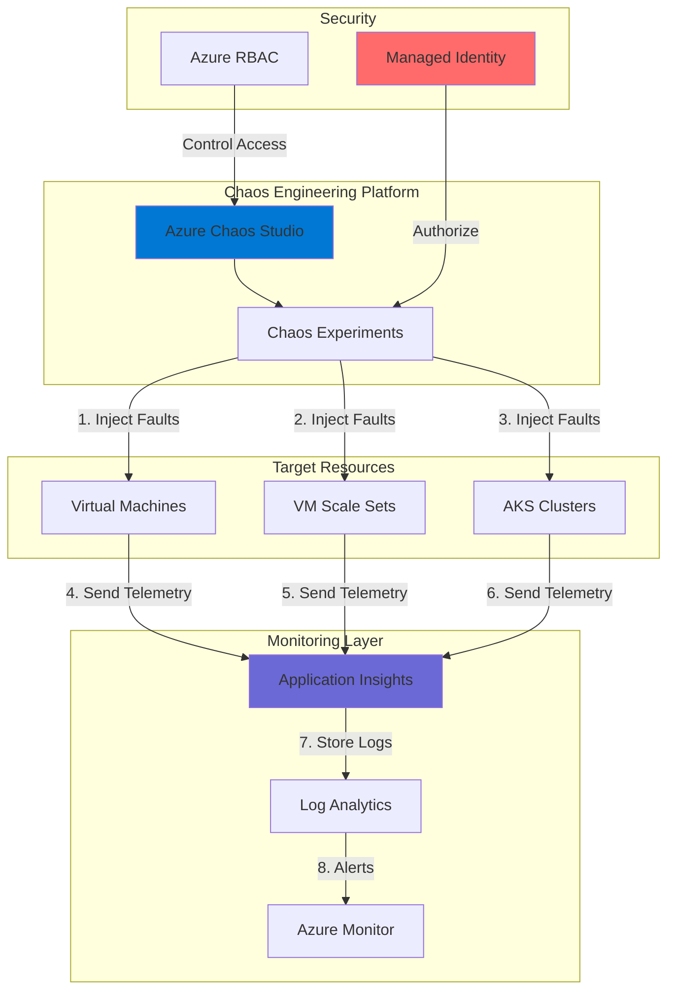

# Chaos Engineering for Application Resilience Testing

## Problem

Modern cloud applications face unpredictable failures ranging from network outages to resource exhaustion, making it difficult to validate system resilience before production incidents occur. Organizations struggle to identify weaknesses in their applications' fault tolerance mechanisms, often discovering critical vulnerabilities only during actual outages that impact customers and revenue.

## Solution

Azure Chaos Studio provides a managed chaos engineering platform that systematically injects controlled failures into your applications while Application Insights monitors the impact in real-time. This combination enables proactive resilience testing through automated experiments that simulate real-world failures, helping teams identify and fix weaknesses before they affect production users.

## Architecture Diagram



## Prerequisites

1. Azure subscription with Owner or Contributor permissions
2. Azure CLI v2.50.0 or later installed (or use Azure Cloud Shell)
3. Basic understanding of chaos engineering principles
4. Familiarity with Azure Monitor and Application Insights concepts
5. Estimated cost: ~$50-100/month for resources created

> **Note**: This recipe creates billable resources. Follow the cleanup section to avoid unnecessary charges.

## Preparation

```bash
# Set environment variables for consistent resource naming
export RESOURCE_GROUP="rg-chaos-testing-$(openssl rand -hex 3)"
export LOCATION="eastus"
export VM_NAME="vm-target-$(openssl rand -hex 3)"
export APP_INSIGHTS_NAME="appi-chaos-$(openssl rand -hex 3)"
export WORKSPACE_NAME="log-chaos-$(openssl rand -hex 3)"
export IDENTITY_NAME="id-chaos-$(openssl rand -hex 3)"

# Create resource group for all chaos testing resources
az group create \
    --name ${RESOURCE_GROUP} \
    --location ${LOCATION} \
    --tags purpose=chaos-testing environment=demo

# Create Log Analytics workspace for Application Insights
WORKSPACE_ID=$(az monitor log-analytics workspace create \
    --resource-group ${RESOURCE_GROUP} \
    --workspace-name ${WORKSPACE_NAME} \
    --location ${LOCATION} \
    --query id --output tsv)

echo "✅ Preparation complete with resource group: ${RESOURCE_GROUP}"
```

## Steps

1. **Create Application Insights for Monitoring**:

   Application Insights provides real-time application performance monitoring that captures detailed telemetry during chaos experiments. By creating a dedicated Application Insights instance backed by Log Analytics, you establish a centralized monitoring platform that tracks application behavior, failures, and recovery patterns during controlled fault injection scenarios.

   ```bash
   # Create Application Insights resource
   az monitor app-insights component create \
       --app ${APP_INSIGHTS_NAME} \
       --location ${LOCATION} \
       --resource-group ${RESOURCE_GROUP} \
       --workspace ${WORKSPACE_ID} \
       --application-type web
   
   # Retrieve instrumentation key for later use
   INSTRUMENTATION_KEY=$(az monitor app-insights component show \
       --app ${APP_INSIGHTS_NAME} \
       --resource-group ${RESOURCE_GROUP} \
       --query instrumentationKey --output tsv)
   
   echo "✅ Application Insights created with key: ${INSTRUMENTATION_KEY}"
   ```

   Application Insights is now configured and ready to receive telemetry from chaos experiments. The instrumentation key will be used to configure target resources to send fault event data during experiments.

2. **Deploy Target Virtual Machine for Testing**:

   Creating a target virtual machine provides a controlled environment for chaos experiments. This VM represents a typical application server that might experience failures in production. By using Ubuntu 22.04 LTS with a Standard_B2s size, we balance cost-effectiveness with sufficient resources to demonstrate meaningful chaos scenarios while ensuring compatibility with the Chaos Agent.

   ```bash
   # Create virtual machine as chaos target
   az vm create \
       --resource-group ${RESOURCE_GROUP} \
       --name ${VM_NAME} \
       --image Ubuntu2204 \
       --size Standard_B2s \
       --admin-username azureuser \
       --generate-ssh-keys \
       --public-ip-sku Standard
   
   # Wait for VM to be fully provisioned
   az vm wait --created --resource-group ${RESOURCE_GROUP} --name ${VM_NAME}
   
   echo "✅ Virtual machine ${VM_NAME} created successfully"
   ```

3. **Configure Managed Identity for Chaos Studio**:

   Azure Chaos Studio requires proper authentication to execute faults against target resources. Creating a user-assigned managed identity provides a secure, password-free authentication mechanism that follows Azure security best practices. This identity will be granted specific permissions to perform chaos actions while maintaining the principle of least privilege.

   ```bash
   # Create user-assigned managed identity
   az identity create \
       --name ${IDENTITY_NAME} \
       --resource-group ${RESOURCE_GROUP} \
       --location ${LOCATION}
   
   # Get identity details for role assignment
   IDENTITY_ID=$(az identity show \
       --name ${IDENTITY_NAME} \
       --resource-group ${RESOURCE_GROUP} \
       --query id --output tsv)
   
   IDENTITY_CLIENT_ID=$(az identity show \
       --name ${IDENTITY_NAME} \
       --resource-group ${RESOURCE_GROUP} \
       --query clientId --output tsv)
   
   # Assign managed identity to VM for agent authentication
   az vm identity assign \
       --resource-group ${RESOURCE_GROUP} \
       --name ${VM_NAME} \
       --identities ${IDENTITY_ID}
   
   echo "✅ Managed identity created and assigned: ${IDENTITY_NAME}"
   ```

4. **Enable Chaos Studio on Target Resources**:

   Enabling Chaos Studio on target resources establishes the connection between the chaos engineering platform and your infrastructure. This step registers the VM as a valid target for both service-direct faults (like VM shutdown) and agent-based faults (like CPU pressure), providing comprehensive testing capabilities.

   ```bash
   # Register Chaos Studio resource provider
   az provider register --namespace Microsoft.Chaos
   
   # Wait for registration to complete (may take several minutes)
   while [[ $(az provider show --namespace Microsoft.Chaos \
       --query registrationState --output tsv) != "Registered" ]]; do
       echo "Waiting for Microsoft.Chaos provider registration..."
       sleep 30
   done
   
   # Get VM resource ID for target configuration
   VM_RESOURCE_ID=$(az vm show \
       --name ${VM_NAME} \
       --resource-group ${RESOURCE_GROUP} \
       --query id --output tsv)
   
   # Enable VM as chaos target (service-direct)
   az rest --method put \
       --url "https://management.azure.com${VM_RESOURCE_ID}/providers/Microsoft.Chaos/targets/Microsoft-VirtualMachine?api-version=2024-01-01" \
       --body '{"properties":{}}'
   
   echo "✅ Chaos Studio enabled on virtual machine"
   ```

5. **Configure Agent-Based Target for In-Guest Faults**:

   Agent-based targets enable advanced fault injection capabilities within the virtual machine's operating system. By creating a Microsoft-Agent target with proper managed identity configuration, we establish the foundation for testing scenarios like CPU stress, memory pressure, and process disruption.

   ```bash
   # Get tenant ID for identity configuration
   TENANT_ID=$(az account show --query tenantId --output tsv)
   
   # Create target configuration JSON
   cat > agent-target.json << EOF
   {
       "properties": {
           "identities": [
               {
                   "clientId": "${IDENTITY_CLIENT_ID}",
                   "tenantId": "${TENANT_ID}",
                   "type": "AzureManagedIdentity"
               }
           ]
       }
   }
   EOF
   
   # Create Microsoft-Agent target
   AGENT_PROFILE_ID=$(az rest --method put \
       --url "https://management.azure.com${VM_RESOURCE_ID}/providers/Microsoft.Chaos/targets/Microsoft-Agent?api-version=2024-01-01" \
       --body @agent-target.json \
       --query properties.agentProfileId --output tsv)
   
   echo "✅ Agent target created with profile ID: ${AGENT_PROFILE_ID}"
   ```

6. **Enable Chaos Capabilities for Agent-Based Faults**:

   Capabilities define the specific types of faults that can be executed against a target resource. By enabling CPU pressure capabilities, we prepare the VM to handle stress testing scenarios that simulate resource exhaustion conditions common in production environments.

   ```bash
   # Enable CPU Pressure capability for agent-based testing
   az rest --method put \
       --url "https://management.azure.com${VM_RESOURCE_ID}/providers/Microsoft.Chaos/targets/Microsoft-Agent/capabilities/CPUPressure-1.0?api-version=2024-01-01" \
       --body '{"properties":{}}'
   
   # Enable VM Shutdown capability for service-direct testing
   az rest --method put \
       --url "https://management.azure.com${VM_RESOURCE_ID}/providers/Microsoft.Chaos/targets/Microsoft-VirtualMachine/capabilities/Shutdown-1.0?api-version=2024-01-01" \
       --body '{"properties":{}}'
   
   echo "✅ Chaos capabilities enabled (CPU Pressure and VM Shutdown)"
   ```

7. **Install and Configure Chaos Agent**:

   The Chaos Agent is a VM extension that enables in-guest fault injection capabilities. By configuring the agent with Application Insights integration and proper authentication, all fault events are automatically logged with detailed telemetry, providing comprehensive visibility into system behavior during chaos experiments.

   ```bash
   # Install Chaos Agent VM extension with Application Insights
   az vm extension set \
       --resource-group ${RESOURCE_GROUP} \
       --vm-name ${VM_NAME} \
       --name ChaosAgent \
       --publisher Microsoft.Azure.Chaos \
       --version 1.0 \
       --settings "{
           \"agentProfileId\": \"${AGENT_PROFILE_ID}\",
           \"clientId\": \"${IDENTITY_CLIENT_ID}\",
           \"appInsightsKey\": \"${INSTRUMENTATION_KEY}\"
       }"
   
   # Verify agent installation status
   AGENT_STATUS=$(az vm extension show \
       --resource-group ${RESOURCE_GROUP} \
       --vm-name ${VM_NAME} \
       --name ChaosAgent \
       --query provisioningState --output tsv)
   
   echo "✅ Chaos Agent installed with status: ${AGENT_STATUS}"
   ```

   The Chaos Agent is now running on the VM and configured to send all fault injection events to Application Insights, enabling real-time monitoring of chaos experiments.

8. **Create CPU Pressure Chaos Experiment**:

   Creating a chaos experiment defines the controlled failure scenarios you want to test. This experiment uses CPU pressure to simulate resource exhaustion scenarios, helping validate whether your application can handle high CPU utilization and maintain acceptable performance under stress conditions.

   ```bash
   # Create chaos experiment definition
   EXPERIMENT_NAME="exp-cpu-pressure-$(openssl rand -hex 3)"
   
   cat > experiment.json << EOF
   {
       "location": "${LOCATION}",
       "identity": {
           "type": "UserAssigned",
           "userAssignedIdentities": {
               "${IDENTITY_ID}": {}
           }
       },
       "properties": {
           "steps": [
               {
                   "name": "CPU Stress Test",
                   "branches": [
                       {
                           "name": "CPU Pressure Branch",
                           "actions": [
                               {
                                   "type": "continuous",
                                   "name": "High CPU Load",
                                   "selectorId": "CPUSelector",
                                   "duration": "PT5M",
                                   "parameters": [
                                       {
                                           "key": "pressureLevel",
                                           "value": "95"
                                       }
                                   ]
                               }
                           ]
                       }
                   ]
               }
           ],
           "selectors": [
               {
                   "id": "CPUSelector",
                   "type": "List",
                   "targets": [
                       {
                           "type": "ChaosTarget",
                           "id": "${VM_RESOURCE_ID}/providers/Microsoft.Chaos/targets/Microsoft-Agent"
                       }
                   ]
               }
           ]
       }
   }
   EOF
   
   # Create the experiment
   az rest --method put \
       --url "https://management.azure.com/subscriptions/$(az account show --query id -o tsv)/resourceGroups/${RESOURCE_GROUP}/providers/Microsoft.Chaos/experiments/${EXPERIMENT_NAME}?api-version=2024-01-01" \
       --body @experiment.json
   
   echo "✅ Chaos experiment ${EXPERIMENT_NAME} created"
   ```

9. **Grant Permissions for Experiment Execution**:

   Chaos experiments require specific Azure RBAC permissions to execute faults against target resources. By assigning the Virtual Machine Contributor role to the experiment's managed identity, you enable it to perform the necessary operations while maintaining security boundaries through least-privilege access control.

   ```bash
   # Get experiment principal ID
   EXPERIMENT_PRINCIPAL_ID=$(az rest --method get \
       --url "https://management.azure.com/subscriptions/$(az account show --query id -o tsv)/resourceGroups/${RESOURCE_GROUP}/providers/Microsoft.Chaos/experiments/${EXPERIMENT_NAME}?api-version=2024-01-01" \
       --query identity.principalId --output tsv)
   
   # Assign Virtual Machine Contributor role for agent-based faults
   az role assignment create \
       --assignee ${EXPERIMENT_PRINCIPAL_ID} \
       --role "Virtual Machine Contributor" \
       --scope ${VM_RESOURCE_ID}
   
   echo "✅ Permissions granted to chaos experiment"
   ```

10. **Configure Application Insights Alerts**:

    Setting up alerts ensures you're immediately notified when chaos experiments impact your application. These alerts can trigger automated responses, notify on-call teams, or integrate with incident management systems, creating a comprehensive monitoring strategy for resilience testing.

    ```bash
    # Create action group for notifications
    ACTION_GROUP_NAME="ag-chaos-alerts-$(openssl rand -hex 3)"
    
    az monitor action-group create \
        --name ${ACTION_GROUP_NAME} \
        --resource-group ${RESOURCE_GROUP} \
        --short-name ChaosAlert
    
    # Create alert rule for high CPU usage during chaos experiments
    az monitor metrics alert create \
        --name "Chaos CPU Stress Alert" \
        --resource-group ${RESOURCE_GROUP} \
        --scopes ${VM_RESOURCE_ID} \
        --condition "avg Percentage CPU > 90" \
        --window-size 5m \
        --evaluation-frequency 1m \
        --action ${ACTION_GROUP_NAME} \
        --description "Alert when chaos experiment causes high CPU usage"
    
    echo "✅ Application Insights alerts configured"
    ```

## Validation & Testing

1. Verify Chaos Studio configuration:

   ```bash
   # Check service-direct target enablement
   az rest --method get \
       --url "https://management.azure.com${VM_RESOURCE_ID}/providers/Microsoft.Chaos/targets/Microsoft-VirtualMachine?api-version=2024-01-01" \
       --query properties
   
   # Check agent-based target enablement
   az rest --method get \
       --url "https://management.azure.com${VM_RESOURCE_ID}/providers/Microsoft.Chaos/targets/Microsoft-Agent?api-version=2024-01-01" \
       --query properties
   ```

   Expected output: Properties object showing enabled targets

2. Verify Chaos Agent installation:

   ```bash
   # Check agent extension status
   az vm extension show \
       --resource-group ${RESOURCE_GROUP} \
       --vm-name ${VM_NAME} \
       --name ChaosAgent \
       --query "{Status: provisioningState, HandlerStatus: instanceView.statuses[0].message}"
   ```

   Expected output: Status should be "Succeeded" and HandlerStatus should show "Ready"

3. Run the chaos experiment:

   ```bash
   # Start chaos experiment
   az rest --method post \
       --url "https://management.azure.com/subscriptions/$(az account show --query id -o tsv)/resourceGroups/${RESOURCE_GROUP}/providers/Microsoft.Chaos/experiments/${EXPERIMENT_NAME}/start?api-version=2024-01-01"
   
   echo "✅ Chaos experiment started - monitoring CPU pressure for 5 minutes"
   ```

4. Monitor experiment in Application Insights:

   ```bash
   # Query Application Insights for chaos events
   az monitor app-insights query \
       --app ${APP_INSIGHTS_NAME} \
       --resource-group ${RESOURCE_GROUP} \
       --analytics-query "customEvents | where name contains 'Chaos' | project timestamp, name, customDimensions | order by timestamp desc | take 10"
   
   # Monitor VM CPU metrics during experiment
   az monitor metrics list \
       --resource ${VM_RESOURCE_ID} \
       --metric "Percentage CPU" \
       --interval PT1M \
       --output table
   ```

5. Verify experiment completion and VM recovery:

   ```bash
   # Check experiment status
   az rest --method get \
       --url "https://management.azure.com/subscriptions/$(az account show --query id -o tsv)/resourceGroups/${RESOURCE_GROUP}/providers/Microsoft.Chaos/experiments/${EXPERIMENT_NAME}/statuses?api-version=2024-01-01" \
       --query "value[0].status"
   
   # Verify VM is running normally after experiment
   az vm get-instance-view \
       --name ${VM_NAME} \
       --resource-group ${RESOURCE_GROUP} \
       --query instanceView.statuses[1].displayStatus \
       --output tsv
   ```

   Expected output: "VM running" after experiment completes

## Cleanup

1. Stop any running experiments:

   ```bash
   # Stop active experiments
   az rest --method post \
       --url "https://management.azure.com/subscriptions/$(az account show --query id -o tsv)/resourceGroups/${RESOURCE_GROUP}/providers/Microsoft.Chaos/experiments/${EXPERIMENT_NAME}/stop?api-version=2024-01-01"
   
   echo "✅ Chaos experiment stopped"
   ```

2. Remove chaos experiment:

   ```bash
   # Delete chaos experiment
   az rest --method delete \
       --url "https://management.azure.com/subscriptions/$(az account show --query id -o tsv)/resourceGroups/${RESOURCE_GROUP}/providers/Microsoft.Chaos/experiments/${EXPERIMENT_NAME}?api-version=2024-01-01"
   
   echo "✅ Chaos experiment deleted"
   ```

3. Delete all resources:

   ```bash
   # Delete resource group and all contained resources
   az group delete \
       --name ${RESOURCE_GROUP} \
       --yes \
       --no-wait
   
   echo "✅ Resource group deletion initiated: ${RESOURCE_GROUP}"
   echo "Note: Deletion may take several minutes to complete"
   
   # Clean up local files
   rm -f experiment.json agent-target.json
   ```

## Discussion

Azure Chaos Studio implements chaos engineering principles by providing a managed platform for controlled failure injection, enabling organizations to proactively discover and fix resilience gaps before they impact production systems. The integration with Application Insights creates a comprehensive observability solution that captures detailed telemetry during experiments, helping teams understand exactly how their applications respond to various failure scenarios. This approach aligns with the [Azure Well-Architected Framework's reliability pillar](https://docs.microsoft.com/en-us/azure/architecture/framework/resiliency/overview), which emphasizes the importance of testing failure scenarios to build resilient applications.

The combination of service-direct and agent-based faults provides flexibility in testing different failure modes. Service-direct faults operate at the Azure control plane level, simulating infrastructure-level failures like VM shutdowns or network disruptions. Agent-based faults run inside the target resources, enabling more granular testing such as CPU stress, memory pressure, or process termination. This dual approach ensures comprehensive coverage of potential failure scenarios as outlined in the [Chaos Studio documentation](https://docs.microsoft.com/en-us/azure/chaos-studio/chaos-studio-overview). The Chaos Agent requires specific operating system compatibility and network access to function properly, as detailed in the [agent compatibility guide](https://docs.microsoft.com/en-us/azure/chaos-studio/chaos-agent-os-support).

From a cost optimization perspective, Chaos Studio follows a pay-per-use model where you're only charged for the duration of active experiments. Combined with Application Insights' sampling capabilities, teams can run comprehensive resilience testing programs without significant monitoring overhead. The [Application Insights best practices guide](https://docs.microsoft.com/en-us/azure/azure-monitor/app/best-practices) provides detailed guidance on optimizing data ingestion costs while maintaining visibility. Security is maintained through Azure RBAC and managed identities, ensuring that chaos experiments can only execute authorized actions against designated target resources.

> **Tip**: Schedule chaos experiments during off-peak hours initially, then gradually increase testing frequency and complexity as your team gains confidence. Consider integrating experiments into your CI/CD pipeline for continuous resilience validation as recommended in [Microsoft's chaos engineering guidance](https://docs.microsoft.com/en-us/azure/well-architected/reliability/testing-strategy). Monitor the [Chaos Agent status](https://docs.microsoft.com/en-us/azure/chaos-studio/chaos-agent-verify-status) regularly to ensure proper connectivity and functionality.

## Challenge

Extend this solution by implementing these enhancements:

1. Create multi-step chaos experiments that combine different fault types (CPU stress + memory pressure + network latency) to simulate complex real-world failure scenarios
2. Implement automated recovery mechanisms using Azure Monitor alerts to trigger Azure Functions that automatically remediate specific failure conditions detected during experiments
3. Build a comprehensive chaos experiment library with reusable templates for common scenarios like region failures, dependency outages, and cascading resource exhaustion patterns
4. Integrate chaos experiments into your CI/CD pipeline using Azure DevOps or GitHub Actions to validate application resilience with every deployment and infrastructure change
5. Create custom KQL queries in Application Insights to measure mean time to recovery (MTTR), system steady-state deviation, and track resilience improvements over time using chaos engineering metrics

## Infrastructure Code

*Infrastructure code will be generated after recipe approval.*