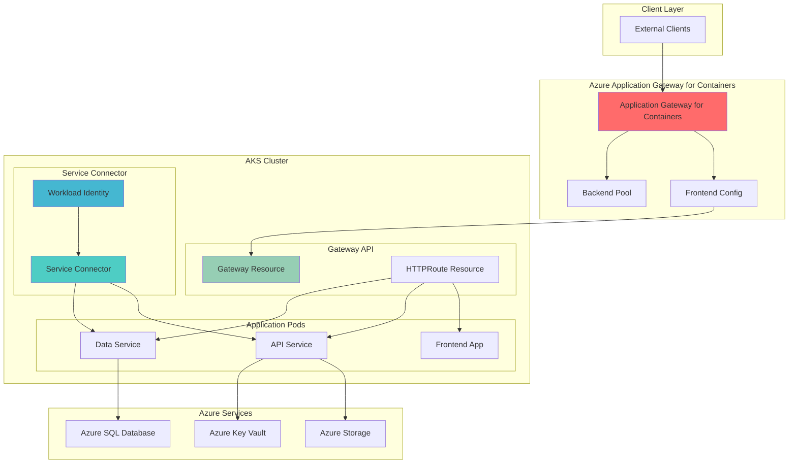

# Cloud-Native Service Connectivity with Application Gateway for Containers

## Problem

Modern microservices applications require sophisticated load balancing, secure service-to-service communication, and passwordless authentication across distributed components. Organizations struggle with complex ingress controllers, manual certificate management, and password-based authentication between services, leading to security vulnerabilities and operational overhead. Traditional networking solutions lack the cloud-native integration and automation needed for scalable microservices architectures.

## Solution

Azure Application Gateway for Containers provides advanced layer 7 load balancing with native Kubernetes Gateway API integration, while Service Connector enables secure, passwordless connections between services using Azure Workload Identity. This combination creates a comprehensive cloud-native connectivity solution that automatically handles ingress, service discovery, and authentication without exposing credentials.

## Architecture Diagram



## Prerequisites

1. Azure subscription with owner or contributor permissions
2. Azure CLI v2.61.0 or higher installed and configured
3. kubectl installed and configured
4. Basic knowledge of Kubernetes Gateway API concepts
5. Understanding of Azure RBAC and managed identities
6. Estimated cost: $50-100 for resources created during this recipe

> **Note**: This recipe uses Azure Application Gateway for Containers, which is a newer offering under general availability. Ensure your subscription has access to this service in your selected region.

## Preparation

```bash
# Set environment variables for Azure resources
export RESOURCE_GROUP="rg-cloud-native-connectivity"
export LOCATION="eastus"
export SUBSCRIPTION_ID=$(az account show --query id --output tsv)

# Generate unique suffix for resource names
RANDOM_SUFFIX=$(openssl rand -hex 3)
export CLUSTER_NAME="aks-connectivity-${RANDOM_SUFFIX}"
export AGC_NAME="agc-connectivity-${RANDOM_SUFFIX}"
export STORAGE_ACCOUNT="storage${RANDOM_SUFFIX}"
export SQL_SERVER="sqlserver-${RANDOM_SUFFIX}"
export KEY_VAULT="kv-${RANDOM_SUFFIX}"
export WORKLOAD_IDENTITY_NAME="wi-connectivity-${RANDOM_SUFFIX}"

# Create resource group
az group create \
    --name ${RESOURCE_GROUP} \
    --location ${LOCATION} \
    --tags purpose=cloud-native-connectivity environment=demo

echo "✅ Resource group created: ${RESOURCE_GROUP}"

# Enable required Azure feature flags
az feature register --namespace Microsoft.ContainerService --name AKS-ExtensionManager
az feature register --namespace Microsoft.ContainerService --name AKS-Dapr
az feature register --namespace Microsoft.ContainerService --name EnableWorkloadIdentityPreview

# Install required Azure CLI extensions
az extension add --name serviceconnector-passwordless --upgrade
az extension add --name alb --upgrade

echo "✅ Azure CLI extensions and features configured"
```

## Steps

1. **Create Azure Kubernetes Service cluster with required configurations**:

   Azure Kubernetes Service provides the foundation for our cloud-native application platform. We'll enable workload identity and OIDC issuer to support passwordless authentication patterns. The cluster configuration includes specific addons for Application Gateway for Containers integration and enhanced security features.

   ```bash
   # Create AKS cluster with workload identity and required features
   az aks create \
       --resource-group ${RESOURCE_GROUP} \
       --name ${CLUSTER_NAME} \
       --location ${LOCATION} \
       --node-count 3 \
       --node-vm-size Standard_D2s_v3 \
       --enable-workload-identity \
       --enable-oidc-issuer \
       --enable-addons monitoring \
       --generate-ssh-keys \
       --network-plugin azure \
       --network-policy azure \
       --tags purpose=cloud-native-connectivity
   
   # Get AKS credentials
   az aks get-credentials \
       --resource-group ${RESOURCE_GROUP} \
       --name ${CLUSTER_NAME} \
       --overwrite-existing
   
   # Get OIDC issuer URL for workload identity
   export OIDC_ISSUER=$(az aks show \
       --resource-group ${RESOURCE_GROUP} \
       --name ${CLUSTER_NAME} \
       --query "oidcIssuerProfile.issuerUrl" \
       --output tsv)
   
   echo "✅ AKS cluster created with workload identity enabled"
   echo "OIDC Issuer: ${OIDC_ISSUER}"
   ```

   The AKS cluster is now configured with workload identity and OIDC issuer capabilities, enabling secure, passwordless authentication between pods and Azure services. This foundation supports the Service Connector integration we'll implement in later steps.

2. **Install Application Gateway for Containers on AKS**:

   Application Gateway for Containers represents the next generation of Azure's application load balancing capabilities, specifically designed for Kubernetes environments. It provides advanced traffic management, SSL termination, and native Gateway API support, enabling sophisticated routing patterns and operational simplicity.

   ```bash
   # Install Application Gateway for Containers controller
   az aks enable-addons \
       --resource-group ${RESOURCE_GROUP} \
       --name ${CLUSTER_NAME} \
       --addons application-gateway-for-containers
   
   # Verify the installation
   kubectl get pods -n azure-alb-system
   
   # Create Application Gateway for Containers resource
   az network application-gateway for-containers create \
       --resource-group ${RESOURCE_GROUP} \
       --name ${AGC_NAME} \
       --location ${LOCATION} \
       --frontend-configurations '[{
           "name": "frontend-config",
           "port": 80,
           "protocol": "Http"
       }]'
   
   # Get the Application Gateway for Containers resource ID
   export AGC_ID=$(az network application-gateway for-containers show \
       --resource-group ${RESOURCE_GROUP} \
       --name ${AGC_NAME} \
       --query id \
       --output tsv)
   
   echo "✅ Application Gateway for Containers installed and configured"
   echo "AGC Resource ID: ${AGC_ID}"
   ```

   The Application Gateway for Containers controller is now active in the cluster, providing advanced load balancing capabilities through the Kubernetes Gateway API. This enables sophisticated traffic routing, SSL termination, and integration with Azure networking services.

3. **Create Azure services for Service Connector integration**:

   Service Connector requires target Azure services to demonstrate secure, passwordless connectivity patterns. We'll create Azure Storage, SQL Database, and Key Vault to represent common microservices dependencies. These services will be configured to accept managed identity authentication, eliminating the need for connection strings or passwords.

   ```bash
   # Create Azure Storage Account
   az storage account create \
       --name ${STORAGE_ACCOUNT} \
       --resource-group ${RESOURCE_GROUP} \
       --location ${LOCATION} \
       --sku Standard_LRS \
       --kind StorageV2 \
       --allow-blob-public-access false \
       --min-tls-version TLS1_2
   
   # Create SQL Server and Database
   az sql server create \
       --name ${SQL_SERVER} \
       --resource-group ${RESOURCE_GROUP} \
       --location ${LOCATION} \
       --admin-user cloudadmin \
       --admin-password "SecurePassword123!" \
       --enable-ad-only-auth false
   
   az sql db create \
       --resource-group ${RESOURCE_GROUP} \
       --server ${SQL_SERVER} \
       --name application-db \
       --edition Basic \
       --compute-model Serverless \
       --auto-pause-delay 60
   
   # Create Key Vault
   az keyvault create \
       --name ${KEY_VAULT} \
       --resource-group ${RESOURCE_GROUP} \
       --location ${LOCATION} \
       --sku standard \
       --enable-rbac-authorization true
   
   # Add sample secrets to Key Vault
   az keyvault secret set \
       --vault-name ${KEY_VAULT} \
       --name "database-connection-timeout" \
       --value "30"
   
   az keyvault secret set \
       --vault-name ${KEY_VAULT} \
       --name "api-rate-limit" \
       --value "1000"
   
   echo "✅ Azure services created for Service Connector integration"
   ```

   The Azure services are now configured and ready for passwordless authentication integration. Each service supports managed identity authentication, which will be leveraged by Service Connector to establish secure connections without storing credentials.

4. **Configure Azure Workload Identity**:

   Azure Workload Identity enables Kubernetes pods to securely authenticate with Azure services using managed identities, eliminating the need for storing secrets or connection strings. This integration creates a federated identity relationship between the AKS cluster and Azure Active Directory.

   ```bash
   # Create user-assigned managed identity
   az identity create \
       --resource-group ${RESOURCE_GROUP} \
       --name ${WORKLOAD_IDENTITY_NAME} \
       --location ${LOCATION}
   
   # Get managed identity details
   export USER_ASSIGNED_CLIENT_ID=$(az identity show \
       --resource-group ${RESOURCE_GROUP} \
       --name ${WORKLOAD_IDENTITY_NAME} \
       --query 'clientId' \
       --output tsv)
   
   export USER_ASSIGNED_OBJECT_ID=$(az identity show \
       --resource-group ${RESOURCE_GROUP} \
       --name ${WORKLOAD_IDENTITY_NAME} \
       --query 'principalId' \
       --output tsv)
   
   # Create Kubernetes namespace and service account
   kubectl create namespace cloud-native-app
   
   kubectl create serviceaccount workload-identity-sa \
       --namespace cloud-native-app
   
   # Annotate service account with managed identity
   kubectl annotate serviceaccount workload-identity-sa \
       --namespace cloud-native-app \
       azure.workload.identity/client-id=${USER_ASSIGNED_CLIENT_ID}
   
   # Create federated identity credential
   az identity federated-credential create \
       --name "aks-federated-credential" \
       --identity-name ${WORKLOAD_IDENTITY_NAME} \
       --resource-group ${RESOURCE_GROUP} \
       --issuer ${OIDC_ISSUER} \
       --subject "system:serviceaccount:cloud-native-app:workload-identity-sa"
   
   echo "✅ Azure Workload Identity configured"
   echo "Client ID: ${USER_ASSIGNED_CLIENT_ID}"
   ```

   The workload identity federation is now established, enabling pods using the service account to authenticate with Azure services without storing credentials. This creates a secure, passwordless authentication mechanism for microservices.

5. **Grant managed identity permissions to Azure services**:

   The managed identity requires appropriate permissions to access Azure services. We'll assign built-in roles that follow the principle of least privilege, ensuring each service has only the permissions necessary for its function.

   ```bash
   # Grant Storage Blob Data Contributor role for Azure Storage
   az role assignment create \
       --role "Storage Blob Data Contributor" \
       --assignee-object-id ${USER_ASSIGNED_OBJECT_ID} \
       --assignee-principal-type ServicePrincipal \
       --scope "/subscriptions/${SUBSCRIPTION_ID}/resourceGroups/${RESOURCE_GROUP}/providers/Microsoft.Storage/storageAccounts/${STORAGE_ACCOUNT}"
   
   # Grant SQL DB Contributor role for Azure SQL Database
   az role assignment create \
       --role "SQL DB Contributor" \
       --assignee-object-id ${USER_ASSIGNED_OBJECT_ID} \
       --assignee-principal-type ServicePrincipal \
       --scope "/subscriptions/${SUBSCRIPTION_ID}/resourceGroups/${RESOURCE_GROUP}/providers/Microsoft.Sql/servers/${SQL_SERVER}/databases/application-db"
   
   # Grant Key Vault Secrets User role for Azure Key Vault
   az role assignment create \
       --role "Key Vault Secrets User" \
       --assignee-object-id ${USER_ASSIGNED_OBJECT_ID} \
       --assignee-principal-type ServicePrincipal \
       --scope "/subscriptions/${SUBSCRIPTION_ID}/resourceGroups/${RESOURCE_GROUP}/providers/Microsoft.KeyVault/vaults/${KEY_VAULT}"
   
   echo "✅ Managed identity permissions granted to Azure services"
   ```

   The managed identity now has the necessary permissions to access Azure Storage, SQL Database, and Key Vault using role-based access control. This enables passwordless authentication while maintaining security through precise permission scoping.

6. **Deploy sample applications with Service Connector integration**:

   We'll deploy microservices that demonstrate different Service Connector patterns. Each application will use workload identity to authenticate with Azure services, showcasing the passwordless connectivity capabilities.

   ```bash
   # Create frontend application deployment
   cat <<EOF | kubectl apply -f -
   apiVersion: apps/v1
   kind: Deployment
   metadata:
     name: frontend-app
     namespace: cloud-native-app
   spec:
     replicas: 2
     selector:
       matchLabels:
         app: frontend-app
     template:
       metadata:
         labels:
           app: frontend-app
           azure.workload.identity/use: "true"
       spec:
         serviceAccountName: workload-identity-sa
         containers:
         - name: frontend
           image: nginx:latest
           ports:
           - containerPort: 80
           env:
           - name: AZURE_CLIENT_ID
             value: ${USER_ASSIGNED_CLIENT_ID}
   ---
   apiVersion: v1
   kind: Service
   metadata:
     name: frontend-service
     namespace: cloud-native-app
   spec:
     selector:
       app: frontend-app
     ports:
     - port: 80
       targetPort: 80
     type: ClusterIP
   EOF
   
   # Create API service deployment
   cat <<EOF | kubectl apply -f -
   apiVersion: apps/v1
   kind: Deployment
   metadata:
     name: api-service
     namespace: cloud-native-app
   spec:
     replicas: 2
     selector:
       matchLabels:
         app: api-service
     template:
       metadata:
         labels:
           app: api-service
           azure.workload.identity/use: "true"
       spec:
         serviceAccountName: workload-identity-sa
         containers:
         - name: api
           image: mcr.microsoft.com/dotnet/samples:aspnetapp
           ports:
           - containerPort: 8080
           env:
           - name: AZURE_CLIENT_ID
             value: ${USER_ASSIGNED_CLIENT_ID}
           - name: STORAGE_ACCOUNT_NAME
             value: ${STORAGE_ACCOUNT}
           - name: KEY_VAULT_NAME
             value: ${KEY_VAULT}
   ---
   apiVersion: v1
   kind: Service
   metadata:
     name: api-service
     namespace: cloud-native-app
   spec:
     selector:
       app: api-service
     ports:
     - port: 8080
       targetPort: 8080
     type: ClusterIP
   EOF
   
   # Create data service deployment
   cat <<EOF | kubectl apply -f -
   apiVersion: apps/v1
   kind: Deployment
   metadata:
     name: data-service
     namespace: cloud-native-app
   spec:
     replicas: 1
     selector:
       matchLabels:
         app: data-service
     template:
       metadata:
         labels:
           app: data-service
           azure.workload.identity/use: "true"
       spec:
         serviceAccountName: workload-identity-sa
         containers:
         - name: data
           image: mcr.microsoft.com/dotnet/samples:aspnetapp
           ports:
           - containerPort: 8080
           env:
           - name: AZURE_CLIENT_ID
             value: ${USER_ASSIGNED_CLIENT_ID}
           - name: SQL_SERVER_NAME
             value: ${SQL_SERVER}
   ---
   apiVersion: v1
   kind: Service
   metadata:
     name: data-service
     namespace: cloud-native-app
   spec:
     selector:
       app: data-service
     ports:
     - port: 8080
       targetPort: 8080
     type: ClusterIP
   EOF
   
   echo "✅ Sample applications deployed with workload identity configuration"
   ```

   The microservices are now deployed with workload identity enabled, allowing them to authenticate with Azure services using the managed identity. Each service is configured to use the appropriate environment variables for passwordless connectivity.

7. **Configure Gateway API resources for Application Gateway for Containers**:

   The Gateway API provides a standardized way to configure ingress traffic routing. We'll create Gateway and HTTPRoute resources that leverage Application Gateway for Containers' advanced traffic management capabilities.

   ```bash
   # Create Gateway resource
   cat <<EOF | kubectl apply -f -
   apiVersion: gateway.networking.k8s.io/v1beta1
   kind: Gateway
   metadata:
     name: cloud-native-gateway
     namespace: cloud-native-app
     annotations:
       alb.networking.azure.io/alb-id: ${AGC_ID}
   spec:
     gatewayClassName: azure-alb
     listeners:
     - name: http-listener
       port: 80
       protocol: HTTP
       allowedRoutes:
         namespaces:
           from: Same
   EOF
   
   # Create HTTPRoute for frontend application
   cat <<EOF | kubectl apply -f -
   apiVersion: gateway.networking.k8s.io/v1beta1
   kind: HTTPRoute
   metadata:
     name: frontend-route
     namespace: cloud-native-app
   spec:
     parentRefs:
     - name: cloud-native-gateway
       sectionName: http-listener
     rules:
     - matches:
       - path:
           type: PathPrefix
           value: /
       backendRefs:
       - name: frontend-service
         port: 80
         weight: 100
   EOF
   
   # Create HTTPRoute for API service
   cat <<EOF | kubectl apply -f -
   apiVersion: gateway.networking.k8s.io/v1beta1
   kind: HTTPRoute
   metadata:
     name: api-route
     namespace: cloud-native-app
   spec:
     parentRefs:
     - name: cloud-native-gateway
       sectionName: http-listener
     rules:
     - matches:
       - path:
           type: PathPrefix
           value: /api
       backendRefs:
       - name: api-service
         port: 8080
         weight: 100
   EOF
   
   # Create HTTPRoute for data service
   cat <<EOF | kubectl apply -f -
   apiVersion: gateway.networking.k8s.io/v1beta1
   kind: HTTPRoute
   metadata:
     name: data-route
     namespace: cloud-native-app
   spec:
     parentRefs:
     - name: cloud-native-gateway
       sectionName: http-listener
     rules:
     - matches:
       - path:
           type: PathPrefix
           value: /data
       backendRefs:
       - name: data-service
         port: 8080
         weight: 100
   EOF
   
   echo "✅ Gateway API resources configured for Application Gateway for Containers"
   ```

   The Gateway API resources are now configured to route traffic through Application Gateway for Containers, providing advanced load balancing and traffic management capabilities for the microservices architecture.

8. **Create Service Connector connections for passwordless authentication**:

   Service Connector automates the configuration of secure connections between AKS applications and Azure services. It configures authentication, injects connection information, and manages the integration between services using managed identities.

   ```bash
   # Create Service Connector for Azure Storage
   az containerapp connection create storage-blob \
       --resource-group ${RESOURCE_GROUP} \
       --name storage-connection \
       --target-resource-group ${RESOURCE_GROUP} \
       --account ${STORAGE_ACCOUNT} \
       --system-identity \
       --client-type dotnet
   
   # Create Service Connector for Azure SQL Database
   az containerapp connection create sql \
       --resource-group ${RESOURCE_GROUP} \
       --name sql-connection \
       --target-resource-group ${RESOURCE_GROUP} \
       --server ${SQL_SERVER} \
       --database application-db \
       --system-identity \
       --client-type dotnet
   
   # Create Service Connector for Azure Key Vault
   az containerapp connection create keyvault \
       --resource-group ${RESOURCE_GROUP} \
       --name keyvault-connection \
       --target-resource-group ${RESOURCE_GROUP} \
       --vault ${KEY_VAULT} \
       --system-identity \
       --client-type dotnet
   
   echo "✅ Service Connector connections created for passwordless authentication"
   ```

   Service Connector has established secure, passwordless connections between the applications and Azure services. The connections are configured to use managed identities, eliminating the need for connection strings or stored credentials.

## Validation & Testing

1. **Verify Application Gateway for Containers is operational**:

   ```bash
   # Check Application Gateway for Containers status
   az network application-gateway for-containers show \
       --resource-group ${RESOURCE_GROUP} \
       --name ${AGC_NAME} \
       --query '{name:name,provisioningState:provisioningState,location:location}' \
       --output table
   
   # Verify Gateway API resources
   kubectl get gateway -n cloud-native-app
   kubectl get httproute -n cloud-native-app
   ```

   Expected output: Gateway and HTTPRoute resources should show "Accepted" status.

2. **Test workload identity authentication**:

   ```bash
   # Check workload identity configuration
   kubectl describe serviceaccount workload-identity-sa -n cloud-native-app
   
   # Verify managed identity federation
   az identity federated-credential list \
       --identity-name ${WORKLOAD_IDENTITY_NAME} \
       --resource-group ${RESOURCE_GROUP} \
       --output table
   ```

   Expected output: Service account should show workload identity annotations and federated credentials should be listed.

3. **Verify application deployments and service connectivity**:

   ```bash
   # Check application pod status
   kubectl get pods -n cloud-native-app
   
   # Test internal service connectivity
   kubectl exec -it deployment/frontend-app -n cloud-native-app -- curl http://api-service:8080/
   kubectl exec -it deployment/api-service -n cloud-native-app -- curl http://data-service:8080/
   ```

   Expected output: All pods should be in "Running" state and services should respond to connectivity tests.

4. **Test external traffic routing through Application Gateway for Containers**:

   ```bash
   # Get the external IP of the Application Gateway for Containers
   export GATEWAY_IP=$(kubectl get gateway cloud-native-gateway -n cloud-native-app -o jsonpath='{.status.addresses[0].value}')
   
   # Test frontend application access
   curl -H "Host: frontend.example.com" http://${GATEWAY_IP}/
   
   # Test API service access
   curl -H "Host: api.example.com" http://${GATEWAY_IP}/api/
   ```

   Expected output: HTTP responses from the applications routed through Application Gateway for Containers.

## Cleanup

1. **Remove Service Connector connections**:

   ```bash
   # Delete Service Connector connections
   az containerapp connection delete \
       --resource-group ${RESOURCE_GROUP} \
       --name storage-connection \
       --yes
   
   az containerapp connection delete \
       --resource-group ${RESOURCE_GROUP} \
       --name sql-connection \
       --yes
   
   az containerapp connection delete \
       --resource-group ${RESOURCE_GROUP} \
       --name keyvault-connection \
       --yes
   
   echo "✅ Service Connector connections deleted"
   ```

2. **Remove Kubernetes resources**:

   ```bash
   # Delete application deployments and services
   kubectl delete namespace cloud-native-app
   
   echo "✅ Kubernetes resources deleted"
   ```

3. **Remove Azure resources**:

   ```bash
   # Delete resource group and all contained resources
   az group delete \
       --name ${RESOURCE_GROUP} \
       --yes \
       --no-wait
   
   echo "✅ Resource group deletion initiated: ${RESOURCE_GROUP}"
   echo "Note: Deletion may take several minutes to complete"
   ```

## Discussion

Azure Application Gateway for Containers represents a significant evolution in cloud-native load balancing, providing native Kubernetes Gateway API support and advanced traffic management capabilities. This solution integrates seamlessly with AKS clusters, offering features like traffic splitting, mutual TLS authentication, and near real-time configuration updates. The Gateway API standardization ensures portability across different Kubernetes implementations while providing Azure-specific optimizations. For comprehensive guidance on Application Gateway for Containers, see the [official documentation](https://docs.microsoft.com/en-us/azure/application-gateway/for-containers/overview) and [Gateway API specification](https://gateway-api.sigs.k8s.io/).

Service Connector automates the complex process of establishing secure connections between applications and Azure services, eliminating the operational overhead of managing connection strings, certificates, and authentication credentials. By integrating with Azure Workload Identity, Service Connector enables passwordless authentication patterns that significantly enhance security posture while simplifying operational management. This approach follows the [Azure Well-Architected Framework](https://docs.microsoft.com/en-us/azure/architecture/framework/) principles of security and operational excellence. The passwordless authentication model reduces the attack surface and eliminates common security vulnerabilities associated with stored credentials.

From an architectural perspective, this solution demonstrates modern cloud-native patterns including service mesh concepts, zero-trust networking, and identity-based security. The combination of Application Gateway for Containers and Service Connector creates a comprehensive platform for microservices communication that scales automatically and maintains security through Azure's native identity services. Organizations can leverage this pattern to build resilient, secure applications that follow industry best practices for cloud-native development.

The integration of workload identity with Service Connector represents a shift toward identity-centric security models, where authentication is based on federated identities rather than shared secrets. This approach aligns with modern security practices and provides better auditability and compliance capabilities. For detailed information about workload identity patterns, review the [Azure Workload Identity documentation](https://docs.microsoft.com/en-us/azure/aks/workload-identity-overview) and [Service Connector authentication guide](https://docs.microsoft.com/en-us/azure/service-connector/how-to-manage-authentication).

> **Tip**: Monitor Application Gateway for Containers performance and Service Connector health using Azure Monitor and Application Insights. The [monitoring documentation](https://docs.microsoft.com/en-us/azure/application-gateway/for-containers/monitoring) provides comprehensive guidance on setting up observability for production workloads.

## Challenge

Extend this solution by implementing these advanced cloud-native connectivity patterns:

1. **Implement traffic splitting and canary deployments** using Application Gateway for Containers' weighted routing capabilities to gradually roll out new application versions with automated rollback triggers.

2. **Add mutual TLS authentication** between microservices using Service Connector's certificate management features and Azure Key Vault integration for enhanced security.

3. **Configure advanced Gateway API features** such as header-based routing, custom health checks, and rate limiting using Application Gateway for Containers' policy resources.

4. **Integrate with Azure Service Bus** using Service Connector to create event-driven architectures with passwordless message queue authentication for asynchronous communication patterns.

5. **Implement cross-cluster connectivity** using Application Gateway for Containers' multi-cluster support and Service Connector's service discovery capabilities for distributed microservices architectures.

## Infrastructure Code

*Infrastructure code will be generated after recipe approval.*