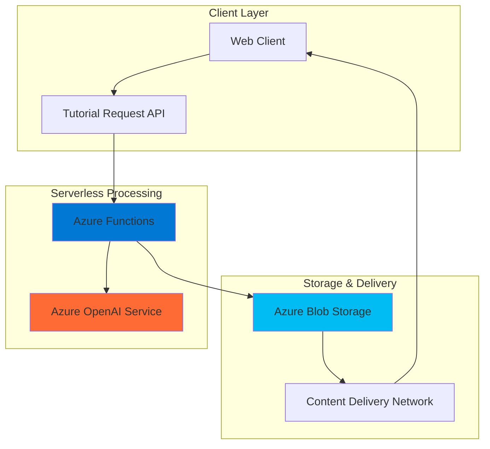

# Code Tutorial Generator with OpenAI and Functions

## Problem

Educational platforms and coding bootcamps struggle to create personalized, step-by-step coding tutorials at scale, often requiring hours of manual content creation for each programming concept. Traditional static tutorials cannot adapt to different learning styles or provide dynamic examples based on current best practices, leading to outdated content and poor learner engagement that impacts business growth and student retention.

## Solution

Build an intelligent tutorial generation system using Azure OpenAI for content creation, Azure Functions for serverless request processing, and Azure Blob Storage for scalable content delivery. This architecture automatically generates customized coding tutorials with interactive exercises, stores them as structured content, and serves them through a web-friendly interface with built-in caching and global distribution capabilities.

## Architecture Diagram



## Prerequisites

1. Azure subscription with appropriate permissions for creating resources
2. Azure CLI installed and configured (or Azure Cloud Shell)
3. Basic understanding of serverless architecture and REST APIs
4. Familiarity with Python programming for function development
5. Estimated cost: $15-25 per month for moderate usage (includes OpenAI token costs)

> **Note**: Azure OpenAI requires special approval. Ensure you have access to the service before proceeding.

## Preparation

```bash
# Set environment variables for Azure resources
export RESOURCE_GROUP="rg-tutorial-gen-${RANDOM_SUFFIX}"
export LOCATION="eastus"
export SUBSCRIPTION_ID=$(az account show --query id --output tsv)

# Generate unique suffix for resource names
RANDOM_SUFFIX=$(openssl rand -hex 3)

# Create resource group
az group create \
    --name ${RESOURCE_GROUP} \
    --location ${LOCATION} \
    --tags purpose=recipe environment=demo

echo "✅ Resource group created: ${RESOURCE_GROUP}"

# Set additional resource names
export STORAGE_ACCOUNT="tutorialstorage${RANDOM_SUFFIX}"
export FUNCTION_APP="tutorial-generator-${RANDOM_SUFFIX}"
export OPENAI_ACCOUNT="tutorial-openai-${RANDOM_SUFFIX}"
```

## Steps

1. **Create Storage Account for Tutorial Content**:

   Azure Blob Storage provides massively scalable object storage with built-in redundancy and global availability. Creating a storage account with hot access tier enables fast retrieval of generated tutorial content while maintaining cost-effectiveness for frequently accessed educational materials.

   ```bash
   # Create storage account for tutorial content
   az storage account create \
       --name ${STORAGE_ACCOUNT} \
       --resource-group ${RESOURCE_GROUP} \
       --location ${LOCATION} \
       --sku Standard_LRS \
       --kind StorageV2 \
       --access-tier Hot
   
   # Get storage account key
   STORAGE_KEY=$(az storage account keys list \
       --account-name ${STORAGE_ACCOUNT} \
       --resource-group ${RESOURCE_GROUP} \
       --query '[0].value' --output tsv)
   
   echo "✅ Storage account created: ${STORAGE_ACCOUNT}"
   ```

   The storage account is now ready to store generated tutorial content with hot access tier optimization for frequent retrieval by learners.

2. **Create Storage Containers for Tutorial Files**:

   ```bash
   # Create container for storing tutorial content
   az storage container create \
       --name tutorials \
       --account-name ${STORAGE_ACCOUNT} \
       --account-key ${STORAGE_KEY} \
       --public-access blob
   
   # Create container for tutorial metadata
   az storage container create \
       --name metadata \
       --account-name ${STORAGE_ACCOUNT} \
       --account-key ${STORAGE_KEY} \
       --public-access off
   
   echo "✅ Storage containers created successfully"
   ```

3. **Deploy Azure OpenAI Service**:

   Azure OpenAI provides enterprise-grade access to GPT models with built-in security, compliance, and regional data residency. The service offers fine-grained control over model deployment and usage while maintaining the latest AI capabilities for educational content generation.

   ```bash
   # Create Azure OpenAI service
   az cognitiveservices account create \
       --name ${OPENAI_ACCOUNT} \
       --resource-group ${RESOURCE_GROUP} \
       --location ${LOCATION} \
       --kind OpenAI \
       --sku S0 \
       --custom-domain ${OPENAI_ACCOUNT}
   
   # Get OpenAI endpoint and key
   OPENAI_ENDPOINT=$(az cognitiveservices account show \
       --name ${OPENAI_ACCOUNT} \
       --resource-group ${RESOURCE_GROUP} \
       --query properties.endpoint --output tsv)
   
   OPENAI_KEY=$(az cognitiveservices account keys list \
       --name ${OPENAI_ACCOUNT} \
       --resource-group ${RESOURCE_GROUP} \
       --query key1 --output tsv)
   
   echo "✅ Azure OpenAI service deployed: ${OPENAI_ENDPOINT}"
   ```

   The OpenAI service is now ready to generate educational content using state-of-the-art language models with enterprise security and compliance features.

4. **Create Model Deployment**:

   ```bash
   # Deploy GPT-4o-mini model for tutorial generation
   az cognitiveservices account deployment create \
       --name ${OPENAI_ACCOUNT} \
       --resource-group ${RESOURCE_GROUP} \
       --deployment-name gpt-4o-mini \
       --model-name gpt-4o-mini \
       --model-version "2024-07-18" \
       --model-format OpenAI \
       --sku-capacity 10 \
       --sku-name Standard
   
   echo "✅ GPT-4o-mini model deployed successfully"
   
   # Wait for deployment to complete
   sleep 30
   ```

5. **Create Function App for Tutorial Processing**:

   Azure Functions provides serverless compute that automatically scales based on demand, making it ideal for processing tutorial generation requests. The consumption plan ensures cost-effectiveness by charging only for actual execution time while providing built-in integration with other Azure services.

   ```bash
   # Create Function App with Python runtime
   az functionapp create \
       --name ${FUNCTION_APP} \
       --resource-group ${RESOURCE_GROUP} \
       --storage-account ${STORAGE_ACCOUNT} \
       --consumption-plan-location ${LOCATION} \
       --runtime python \
       --runtime-version 3.11 \
       --functions-version 4 \
       --os-type Linux
   
   echo "✅ Function App created: ${FUNCTION_APP}"
   ```

   The Function App now provides a serverless execution environment optimized for Python-based tutorial generation logic with automatic scaling and integrated monitoring.

6. **Configure Function App Settings**:

   ```bash
   # Configure application settings for OpenAI and Storage
   az functionapp config appsettings set \
       --name ${FUNCTION_APP} \
       --resource-group ${RESOURCE_GROUP} \
       --settings \
       "OPENAI_ENDPOINT=${OPENAI_ENDPOINT}" \
       "OPENAI_KEY=${OPENAI_KEY}" \
       "STORAGE_ACCOUNT_NAME=${STORAGE_ACCOUNT}" \
       "STORAGE_ACCOUNT_KEY=${STORAGE_KEY}" \
       "DEPLOYMENT_NAME=gpt-4o-mini"
   
   echo "✅ Function app configured with OpenAI and Storage settings"
   ```

7. **Create Tutorial Generation Function**:

   ```bash
   # Create local function project directory
   mkdir tutorial-function && cd tutorial-function
   
   # Create function code
   cat > function_app.py << 'EOF'
import azure.functions as func
import json
import logging
from azure.ai.openai import OpenAIClient
from azure.core.credentials import AzureKeyCredential
from azure.storage.blob import BlobServiceClient
import os
from datetime import datetime
import uuid

app = func.FunctionApp()

@app.function_name(name="GenerateTutorial")
@app.route(route="generate", methods=["POST"])
def generate_tutorial(req: func.HttpRequest) -> func.HttpResponse:
    logging.info('Tutorial generation request received.')
    
    try:
        # Parse request
        req_body = req.get_json()
        topic = req_body.get('topic', 'Python basics')
        difficulty = req_body.get('difficulty', 'beginner')
        language = req_body.get('language', 'python')
        
        # Initialize OpenAI client
        openai_client = OpenAIClient(
            endpoint=os.environ["OPENAI_ENDPOINT"],
            credential=AzureKeyCredential(os.environ["OPENAI_KEY"])
        )
        
        # Generate tutorial content
        tutorial_content = generate_tutorial_content(
            openai_client, topic, difficulty, language
        )
        
        # Store in blob storage
        tutorial_id = store_tutorial(tutorial_content, topic, difficulty, language)
        
        return func.HttpResponse(
            json.dumps({
                "tutorial_id": tutorial_id,
                "status": "success",
                "content_preview": tutorial_content[:200] + "..."
            }),
            status_code=200,
            mimetype="application/json"
        )
        
    except Exception as e:
        logging.error(f"Error generating tutorial: {str(e)}")
        return func.HttpResponse(
            json.dumps({"error": str(e)}),
            status_code=500,
            mimetype="application/json"
        )

def generate_tutorial_content(client, topic, difficulty, language):
    """Generate tutorial content using OpenAI"""
    
    prompt = f"""
    Create a comprehensive coding tutorial for the topic: {topic}
    Difficulty level: {difficulty}
    Programming language: {language}
    
    Format the tutorial with the following structure:
    1. Introduction (2-3 sentences)
    2. Prerequisites
    3. Step-by-step instructions (5-7 steps)
    4. Code examples with explanations
    5. Practice exercises (3 exercises)
    6. Common pitfalls and solutions
    7. Next steps for further learning
    
    Make it engaging and practical with real-world examples.
    Include code snippets that are properly formatted and commented.
    """
    
    response = client.chat.completions.create(
        model=os.environ["DEPLOYMENT_NAME"],
        messages=[
            {"role": "system", "content": "You are an expert programming instructor creating educational content."},
            {"role": "user", "content": prompt}
        ],
        max_tokens=2000,
        temperature=0.7
    )
    
    return response.choices[0].message.content

def store_tutorial(content, topic, difficulty, language):
    """Store tutorial in blob storage"""
    
    # Initialize blob client
    blob_service_client = BlobServiceClient(
        account_url=f"https://{os.environ['STORAGE_ACCOUNT_NAME']}.blob.core.windows.net",
        credential=os.environ["STORAGE_ACCOUNT_KEY"]
    )
    
    # Generate unique tutorial ID
    tutorial_id = str(uuid.uuid4())
    
    # Create tutorial metadata
    metadata = {
        "topic": topic,
        "difficulty": difficulty,
        "language": language,
        "created_at": datetime.utcnow().isoformat(),
        "tutorial_id": tutorial_id
    }
    
    # Upload tutorial content
    blob_client = blob_service_client.get_blob_client(
        container="tutorials", 
        blob=f"{tutorial_id}.md"
    )
    blob_client.upload_blob(content, overwrite=True)
    
    # Upload metadata
    metadata_client = blob_service_client.get_blob_client(
        container="metadata", 
        blob=f"{tutorial_id}.json"
    )
    metadata_client.upload_blob(json.dumps(metadata), overwrite=True)
    
    return tutorial_id

@app.function_name(name="GetTutorial")
@app.route(route="tutorial/{tutorial_id}", methods=["GET"])
def get_tutorial(req: func.HttpRequest) -> func.HttpResponse:
    """Retrieve a tutorial by ID"""
    
    tutorial_id = req.route_params.get('tutorial_id')
    
    try:
        # Initialize blob client
        blob_service_client = BlobServiceClient(
            account_url=f"https://{os.environ['STORAGE_ACCOUNT_NAME']}.blob.core.windows.net",
            credential=os.environ["STORAGE_ACCOUNT_KEY"]
        )
        
        # Get tutorial content
        blob_client = blob_service_client.get_blob_client(
            container="tutorials", 
            blob=f"{tutorial_id}.md"
        )
        content = blob_client.download_blob().readall().decode('utf-8')
        
        # Get metadata
        metadata_client = blob_service_client.get_blob_client(
            container="metadata", 
            blob=f"{tutorial_id}.json"
        )
        metadata = json.loads(metadata_client.download_blob().readall().decode('utf-8'))
        
        return func.HttpResponse(
            json.dumps({
                "tutorial_id": tutorial_id,
                "content": content,
                "metadata": metadata
            }),
            status_code=200,
            mimetype="application/json"
        )
        
    except Exception as e:
        logging.error(f"Error retrieving tutorial: {str(e)}")
        return func.HttpResponse(
            json.dumps({"error": "Tutorial not found"}),
            status_code=404,
            mimetype="application/json"
        )
EOF

   echo "✅ Function code created successfully"
   ```

8. **Create Requirements File**:

   ```bash
   # Create requirements.txt for Python dependencies
   cat > requirements.txt << 'EOF'
azure-functions
azure-ai-openai
azure-storage-blob
azure-core
EOF

   echo "✅ Requirements file created"
   ```

9. **Deploy Function to Azure**:

   ```bash
   # Deploy the function using zip deployment
   zip -r function.zip .
   
   az functionapp deployment source config-zip \
       --name ${FUNCTION_APP} \
       --resource-group ${RESOURCE_GROUP} \
       --src function.zip
   
   # Wait for deployment to complete
   sleep 60
   
   echo "✅ Function deployed successfully"
   
   # Clean up local files
   cd .. && rm -rf tutorial-function
   ```

10. **Configure CORS for Web Access**:

    ```bash
    # Enable CORS for web applications
    az functionapp cors add \
        --name ${FUNCTION_APP} \
        --resource-group ${RESOURCE_GROUP} \
        --allowed-origins "*"
    
    echo "✅ CORS configured for web access"
    ```

## Validation & Testing

1. **Verify Function App Deployment**:

   ```bash
   # Check function app status
   az functionapp show \
       --name ${FUNCTION_APP} \
       --resource-group ${RESOURCE_GROUP} \
       --query "state" --output tsv
   
   # Get function app URL
   FUNCTION_URL="https://${FUNCTION_APP}.azurewebsites.net"
   echo "Function App URL: ${FUNCTION_URL}"
   ```

   Expected output: `Running`

2. **Test Tutorial Generation**:

   ```bash
   # Test tutorial generation with sample request
   curl -X POST "${FUNCTION_URL}/api/generate" \
        -H "Content-Type: application/json" \
        -d '{
            "topic": "Python Functions",
            "difficulty": "beginner",
            "language": "python"
        }'
   ```

   Expected response should include a tutorial_id and success status.

3. **Verify Storage Contents**:

   ```bash
   # List generated tutorials
   az storage blob list \
       --container-name tutorials \
       --account-name ${STORAGE_ACCOUNT} \
       --account-key ${STORAGE_KEY} \
       --output table
   
   # List tutorial metadata
   az storage blob list \
       --container-name metadata \
       --account-name ${STORAGE_ACCOUNT} \
       --account-key ${STORAGE_KEY} \
       --output table
   ```

4. **Test Tutorial Retrieval**:

   ```bash
   # Get a tutorial ID from the previous test response
   # Replace {tutorial-id} with actual ID from step 2
   curl "${FUNCTION_URL}/api/tutorial/{tutorial-id}"
   ```

## Cleanup

1. **Remove Resource Group**:

   ```bash
   # Delete resource group and all contained resources
   az group delete \
       --name ${RESOURCE_GROUP} \
       --yes \
       --no-wait
   
   echo "✅ Resource group deletion initiated: ${RESOURCE_GROUP}"
   echo "Note: Deletion may take several minutes to complete"
   ```

2. **Verify Cleanup**:

   ```bash
   # Verify resource group deletion
   az group exists --name ${RESOURCE_GROUP}
   ```

   Expected output: `false`

## Discussion

This tutorial generation system demonstrates the power of combining Azure's serverless and AI services to create scalable educational content. The architecture leverages Azure OpenAI's advanced language models to generate contextually relevant tutorials while using Azure Functions for cost-effective, event-driven processing that scales automatically with demand.

The solution addresses several key challenges in educational technology: content personalization, scalability, and maintenance overhead. By using Azure OpenAI's GPT models, the system can generate tutorials that adapt to different learning styles and programming languages while maintaining consistency and quality. The serverless architecture ensures the system can handle varying loads without pre-provisioning resources, making it cost-effective for educational platforms with unpredictable usage patterns.

Azure Blob Storage provides the foundation for content delivery with its global replication capabilities and integration with content delivery networks. This ensures fast access to generated tutorials regardless of user location while providing the durability and availability required for educational content that learners depend on. The separation of content and metadata storage allows for efficient querying and content management while maintaining performance as the tutorial library grows.

The integration patterns demonstrated here follow Azure Well-Architected Framework principles, particularly around cost optimization through serverless computing and operational excellence through managed services. For production deployments, consider implementing additional features such as content caching with Azure CDN, user authentication with Azure AD, and monitoring with Application Insights to enhance performance and security.

> **Tip**: Monitor OpenAI token usage closely as tutorial generation can consume significant tokens. Consider implementing caching mechanisms for frequently requested tutorial topics to optimize costs.

For comprehensive guidance on Azure OpenAI best practices, see the [Azure OpenAI Service documentation](https://learn.microsoft.com/en-us/azure/ai-services/openai/). Additional architectural patterns can be found in the [Azure Architecture Center](https://learn.microsoft.com/en-us/azure/architecture/). For serverless best practices, review the [Azure Functions best practices guide](https://learn.microsoft.com/en-us/azure/azure-functions/functions-best-practices). Storage optimization techniques are detailed in the [Azure Blob Storage performance guide](https://learn.microsoft.com/en-us/azure/storage/blobs/storage-performance-checklist). Security considerations for AI applications are covered in the [Azure AI security documentation](https://learn.microsoft.com/en-us/azure/ai-services/security-features).

## Challenge

Extend this solution by implementing these enhancements:

1. **Content Versioning System**: Implement tutorial versioning with Azure Cosmos DB to track content evolution and allow rollbacks to previous versions based on user feedback.

2. **Multi-Language Support**: Add Azure Translator integration to automatically generate tutorials in multiple human languages while maintaining technical accuracy for code examples.

3. **Interactive Code Execution**: Integrate with Azure Container Instances to provide sandboxed code execution environments where learners can run tutorial examples safely.

4. **Adaptive Learning Paths**: Use Azure Machine Learning to analyze user progress and automatically generate follow-up tutorials that adapt to individual learning patterns and skill gaps.

5. **Real-time Collaboration**: Implement Azure SignalR Service to enable real-time collaborative editing of tutorials and peer learning features within the platform.

## Infrastructure Code

### Available Infrastructure as Code:

- [Infrastructure Code Overview](code/README.md) - Detailed description of all infrastructure components
- [Bicep](code/bicep/) - Azure Bicep templates
- [Bash CLI Scripts](code/scripts/) - Example bash scripts using Azure CLI commands to deploy infrastructure
- [Terraform](code/terraform/) - Terraform configuration files