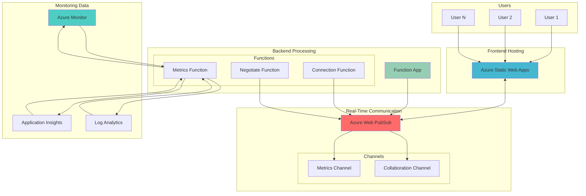

# Collaborative Monitoring Dashboards with WebSocket Synchronization

## Problem

Operations teams struggle to monitor critical system metrics collaboratively, with team members viewing dashboards in isolation and lacking real-time awareness of investigations or annotations made by colleagues. Traditional monitoring solutions require constant page refreshes and don't support simultaneous multi-user interaction, leading to delayed incident response and duplicated investigation efforts.

## Solution

Implement a real-time collaborative monitoring dashboard using Azure Web PubSub for WebSocket-based synchronization, Azure Monitor for metrics collection, and Azure Static Web Apps for hosting. This serverless architecture enables instant metric updates, shared cursor tracking, and collaborative annotations while automatically scaling to support hundreds of concurrent users.

## Architecture Diagram



## Prerequisites

1. Azure subscription with contributor access to create resource groups
2. Azure CLI v2.50.0 or higher installed (or use Azure Cloud Shell)
3. Node.js 18.x or higher for local development
4. Basic knowledge of JavaScript and WebSocket concepts
5. Familiarity with Azure Monitor metrics and KQL queries
6. Estimated cost: ~$5-10/month for development workload

> **Note**: This recipe uses consumption-based pricing models for most services, keeping costs minimal during development and testing phases. Static Web Apps provides free hosting, and Azure Functions use consumption billing.

## Preparation

```bash
# Set environment variables for Azure resources
export RESOURCE_GROUP="rg-collab-dashboard-${RANDOM_SUFFIX}"
export LOCATION="eastus"
export RANDOM_SUFFIX=$(openssl rand -hex 3)
export WEBPUBSUB_NAME="wps-dashboard-${RANDOM_SUFFIX}"
export STATIC_APP_NAME="swa-dashboard-${RANDOM_SUFFIX}"
export FUNCTION_APP_NAME="func-dashboard-${RANDOM_SUFFIX}"
export STORAGE_NAME="stdashboard${RANDOM_SUFFIX}"
export APP_INSIGHTS_NAME="appi-dashboard-${RANDOM_SUFFIX}"
export LOG_ANALYTICS_NAME="log-dashboard-${RANDOM_SUFFIX}"

# Create resource group
az group create \
    --name ${RESOURCE_GROUP} \
    --location ${LOCATION} \
    --tags purpose=collab-dashboard environment=demo

echo "✅ Resource group created: ${RESOURCE_GROUP}"
```

## Steps

1. **Create Log Analytics Workspace for Centralized Monitoring**:

   Azure Log Analytics provides a centralized repository for all monitoring data, enabling powerful KQL queries across multiple data sources. This workspace will collect metrics, logs, and custom telemetry from our dashboard components, forming the foundation for real-time metric visualization and historical analysis.

   ```bash
   # Create Log Analytics workspace
   az monitor log-analytics workspace create \
       --name ${LOG_ANALYTICS_NAME} \
       --resource-group ${RESOURCE_GROUP} \
       --location ${LOCATION} \
       --retention-time 30

   # Store workspace ID for later use
   LOG_ANALYTICS_ID=$(az monitor log-analytics workspace show \
       --name ${LOG_ANALYTICS_NAME} \
       --resource-group ${RESOURCE_GROUP} \
       --query id --output tsv)

   echo "✅ Log Analytics workspace created"
   ```

   The workspace is configured with 30-day retention, balancing cost with the need for historical data analysis. This retention period allows teams to investigate trends and patterns over a meaningful timeframe while keeping storage costs reasonable.

2. **Deploy Application Insights for Application Performance Monitoring**:

   Application Insights provides deep application performance monitoring and distributed tracing capabilities. By connecting it to our Log Analytics workspace, we create a unified monitoring solution that correlates infrastructure metrics with application behavior, essential for comprehensive dashboard visibility.

   ```bash
   # Create Application Insights connected to Log Analytics
   az monitor app-insights component create \
       --app ${APP_INSIGHTS_NAME} \
       --location ${LOCATION} \
       --resource-group ${RESOURCE_GROUP} \
       --workspace ${LOG_ANALYTICS_ID} \
       --application-type web

   # Get instrumentation key for application configuration
   INSTRUMENTATION_KEY=$(az monitor app-insights component show \
       --app ${APP_INSIGHTS_NAME} \
       --resource-group ${RESOURCE_GROUP} \
       --query instrumentationKey --output tsv)

   echo "✅ Application Insights created with key: ${INSTRUMENTATION_KEY}"
   ```

   Application Insights enables automatic dependency tracking, performance counter collection, and exception monitoring, providing comprehensive observability for our dashboard application.

3. **Configure Azure Web PubSub for Real-Time Communication**:

   Azure Web PubSub enables serverless WebSocket connections at scale, handling the complexity of connection management, authentication, and message routing. The service automatically scales from zero to millions of concurrent connections, making it ideal for collaborative experiences where user count can vary dramatically.

   ```bash
   # Create Azure Web PubSub service
   az webpubsub create \
       --name ${WEBPUBSUB_NAME} \
       --resource-group ${RESOURCE_GROUP} \
       --location ${LOCATION} \
       --sku Free_F1 \
       --unit-count 1

   # Get connection string for backend configuration
   WEBPUBSUB_CONNECTION=$(az webpubsub key show \
       --name ${WEBPUBSUB_NAME} \
       --resource-group ${RESOURCE_GROUP} \
       --query primaryConnectionString --output tsv)

   echo "✅ Web PubSub service created"
   ```

   The Free tier provides up to 20 concurrent connections and 20,000 messages per day, suitable for development and testing. The service includes built-in support for WebSocket protocols and handles connection state management automatically.

4. **Create Storage Account for Function App Backend**:

   Azure Storage provides durable state management for our serverless backend, storing function code, maintaining execution state, and enabling reliable message processing. The storage account's queue service will handle asynchronous metric processing, ensuring dashboard responsiveness even under heavy load.

   ```bash
   # Create storage account for Function App
   az storage account create \
       --name ${STORAGE_NAME} \
       --resource-group ${RESOURCE_GROUP} \
       --location ${LOCATION} \
       --sku Standard_LRS \
       --https-only true \
       --min-tls-version TLS1_2

   echo "✅ Storage account created with security hardening"
   ```

   The storage account is configured with HTTPS-only access and minimum TLS 1.2 encryption, following Azure security best practices for data protection.

5. **Deploy Function App for Backend Processing**:

   Azure Functions provides the serverless compute layer for our dashboard, handling WebSocket authentication, metric aggregation, and real-time data broadcasting. The consumption plan ensures cost-effective scaling, spinning up instances only when needed to process incoming requests or metric updates.

   ```bash
   # Create Function App with Node.js runtime
   az functionapp create \
       --name ${FUNCTION_APP_NAME} \
       --resource-group ${RESOURCE_GROUP} \
       --storage-account ${STORAGE_NAME} \
       --consumption-plan-location ${LOCATION} \
       --runtime node \
       --runtime-version 18 \
       --functions-version 4

   # Configure application settings
   az functionapp config appsettings set \
       --name ${FUNCTION_APP_NAME} \
       --resource-group ${RESOURCE_GROUP} \
       --settings \
           "WEBPUBSUB_CONNECTION=${WEBPUBSUB_CONNECTION}" \
           "APPINSIGHTS_INSTRUMENTATIONKEY=${INSTRUMENTATION_KEY}" \
           "AzureWebJobsFeatureFlags=EnableWorkerIndexing"

   # Enable Application Insights integration
   az monitor app-insights component connect-webapp \
       --app ${APP_INSIGHTS_NAME} \
       --resource-group ${RESOURCE_GROUP} \
       --web-app ${FUNCTION_APP_NAME}

   echo "✅ Function App deployed and configured"
   ```

   The Function App configuration includes Application Insights integration for end-to-end tracing, helping identify performance bottlenecks and debug real-time communication issues. The Node.js 18 runtime provides the latest language features and security updates.

6. **Configure Web PubSub Hub for Dashboard Communication**:

   Creating a dedicated hub for dashboard communication enables organized message routing and event handling. The hub configuration establishes event handlers that process connection lifecycle events and custom collaboration messages.

   ```bash
   # Configure hub settings for dashboard communication
   az webpubsub hub create \
       --name dashboard \
       --resource-group ${RESOURCE_GROUP} \
       --webpubsub-name ${WEBPUBSUB_NAME} \
       --event-handler url-template="https://${FUNCTION_APP_NAME}.azurewebsites.net/api/eventhandler" \
       --event-handler user-event-pattern="*" \
       --event-handler system-event="connect,connected,disconnected"

   echo "✅ Web PubSub hub configured for dashboard communication"
   ```

   The hub configuration routes all user events and critical system events to our Function App, enabling real-time tracking of user activities and connection state management.

7. **Implement Real-Time Metric Collection Functions**:

   Creating Azure Functions that query Azure Monitor and broadcast metrics through Web PubSub enables real-time dashboard updates. These functions run on a timer trigger, collecting metrics at regular intervals and pushing updates to all connected clients simultaneously.

   ```bash
   # Create local function project structure
   mkdir -p dashboard-functions/MetricsCollector
   cd dashboard-functions

   # Create package.json for dependencies
   cat > package.json << 'EOF'
   {
     "name": "dashboard-functions",
     "version": "1.0.0",
     "dependencies": {
       "@azure/identity": "^3.3.0",
       "@azure/monitor-query": "^1.1.0"
     }
   }
   EOF

   # Create host.json for function app configuration
   cat > host.json << 'EOF'
   {
     "version": "2.0",
     "logging": {
       "applicationInsights": {
         "samplingSettings": {
           "isEnabled": true,
           "maxTelemetryItemsPerSecond": 20
         }
       }
     },
     "extensions": {
       "http": {
         "routePrefix": "api",
         "maxConcurrentRequests": 100
       }
     }
   }
   EOF

   # Create metrics collector function
   cat > MetricsCollector/function.json << 'EOF'
   {
     "bindings": [
       {
         "name": "myTimer",
         "type": "timerTrigger",
         "direction": "in",
         "schedule": "*/30 * * * * *"
       },
       {
         "name": "webPubSubContext",
         "type": "webPubSub",
         "direction": "out",
         "hub": "dashboard",
         "connection": "WEBPUBSUB_CONNECTION"
       }
     ]
   }
   EOF

   # Create metrics collector implementation
   cat > MetricsCollector/index.js << 'EOF'
   const { DefaultAzureCredential } = require("@azure/identity");
   const { MetricsQueryClient } = require("@azure/monitor-query");

   module.exports = async function (context, myTimer) {
       try {
           const client = new MetricsQueryClient(new DefaultAzureCredential());
           
           // Query sample metrics from the Function App itself
           const resourceId = `/subscriptions/${process.env.SUBSCRIPTION_ID}/resourceGroups/${process.env.RESOURCE_GROUP}/providers/Microsoft.Web/sites/${process.env.FUNCTION_APP_NAME}`;
           
           const metrics = await client.queryResource(
               resourceId,
               ["Http5xx", "MemoryWorkingSet"],
               {
                   timespan: "PT5M",
                   interval: "PT1M"
               }
           );

           // Broadcast metrics to all connected clients
           context.bindings.webPubSubContext = {
               actionName: "sendToAll",
               data: JSON.stringify({
                   type: "metrics",
                   timestamp: new Date().toISOString(),
                   data: metrics.metrics || []
               })
           };

           context.log("Metrics broadcast completed");
       } catch (error) {
           context.log.error("Error collecting metrics:", error.message);
       }
   };
   EOF

   echo "✅ Function code created locally"
   ```

   The metrics collector runs every 30 seconds, querying sample performance metrics and broadcasting them to all connected dashboard users. This approach demonstrates real-time data distribution patterns.

8. **Create WebSocket Connection Handler for Client Management**:

   The connection handler manages client lifecycle events, maintaining user presence information and handling authentication. This function ensures secure access to the dashboard while enabling real-time collaboration features like cursor tracking and user activity indicators.

   ```bash
   # Create connection handler function
   mkdir -p EventHandler
   
   cat > EventHandler/function.json << 'EOF'
   {
     "bindings": [
       {
         "name": "req",
         "type": "httpTrigger",
         "direction": "in",
         "methods": ["post", "options"],
         "authLevel": "anonymous"
       },
       {
         "name": "res",
         "type": "http",
         "direction": "out"
       }
     ]
   }
   EOF

   cat > EventHandler/index.js << 'EOF'
   module.exports = async function (context, req) {
       context.log('Event handler triggered:', req.body);
       
       // Handle CORS preflight requests
       if (req.method === 'OPTIONS') {
           context.res = {
               status: 200,
               headers: {
                   "Access-Control-Allow-Origin": "*",
                   "Access-Control-Allow-Methods": "POST, OPTIONS",
                   "Access-Control-Allow-Headers": "Content-Type"
               }
           };
           return;
       }

       // Process Web PubSub events
       const event = req.body;
       
       if (event.type === 'validation') {
           context.res = {
               status: 200,
               body: event.data
           };
           return;
       }

       if (event.type === 'user') {
           context.log(`User event: ${event.eventName} from ${event.userId}`);
       }

       context.res = {
           status: 200,
           headers: {
               "Access-Control-Allow-Origin": "*"
           }
       };
   };
   EOF

   echo "✅ Event handler function created"
   ```

   The event handler processes WebSocket validation requests and user events, enabling secure communication and event tracking across the dashboard application.

9. **Deploy Static Web App for Dashboard Frontend**:

   Azure Static Web Apps provides global content distribution and automatic SSL for our dashboard frontend. The service integrates with GitHub Actions for continuous deployment, enabling rapid iteration on dashboard features while maintaining high availability and performance.

   ```bash
   # Create dashboard frontend structure
   mkdir -p dashboard-frontend/src
   cd dashboard-frontend

   # Create package.json
   cat > package.json << 'EOF'
   {
     "name": "collab-dashboard",
     "version": "1.0.0",
     "scripts": {
       "build": "webpack --mode production",
       "start": "webpack serve --mode development"
     },
     "dependencies": {
       "@azure/web-pubsub-client": "^1.1.0",
       "chart.js": "^4.3.0"
     },
     "devDependencies": {
       "webpack": "^5.88.0",
       "webpack-cli": "^5.1.0",
       "webpack-dev-server": "^4.15.0"
     }
   }
   EOF

   # Create main dashboard HTML
   cat > src/index.html << 'EOF'
   <!DOCTYPE html>
   <html lang="en">
   <head>
       <meta charset="UTF-8">
       <meta name="viewport" content="width=device-width, initial-scale=1.0">
       <title>Collaborative Monitoring Dashboard</title>
       <style>
           body { font-family: Arial, sans-serif; margin: 20px; }
           .dashboard { display: grid; grid-template-columns: 1fr 1fr; gap: 20px; }
           .metric-card { border: 1px solid #ddd; padding: 20px; border-radius: 8px; }
           .user-cursor { position: absolute; pointer-events: none; z-index: 1000; }
           .status { padding: 10px; background: #f0f0f0; border-radius: 4px; margin-bottom: 20px; }
           .connected { background: #d4edda; color: #155724; }
           .disconnected { background: #f8d7da; color: #721c24; }
       </style>
   </head>
   <body>
       <h1>Real-Time Collaborative Dashboard</h1>
       <div id="status" class="status disconnected">Disconnected</div>
       <div id="active-users"></div>
       <div class="dashboard" id="dashboard">
           <div class="metric-card">
               <h3>HTTP Errors</h3>
               <canvas id="errorChart" width="400" height="200"></canvas>
           </div>
           <div class="metric-card">
               <h3>Memory Usage</h3>
               <canvas id="memoryChart" width="400" height="200"></canvas>
           </div>
       </div>
       <script src="bundle.js"></script>
   </body>
   </html>
   EOF

   # Create main JavaScript application
   cat > src/app.js << 'EOF'
   import { WebPubSubClient } from "@azure/web-pubsub-client";
   import Chart from "chart.js/auto";

   class CollaborativeDashboard {
       constructor() {
           this.charts = new Map();
           this.users = new Map();
           this.initializeUI();
           this.initWebSocket();
       }

       initializeUI() {
           this.statusElement = document.getElementById('status');
           this.usersElement = document.getElementById('active-users');
           
           // Initialize empty charts
           this.createChart('errorChart', 'HTTP Errors', []);
           this.createChart('memoryChart', 'Memory Usage', []);
       }

       async initWebSocket() {
           try {
               const response = await fetch("/api/negotiate", {
                   method: "POST",
                   headers: { "Content-Type": "application/json" }
               });
               
               if (!response.ok) {
                   throw new Error(`HTTP ${response.status}: ${response.statusText}`);
               }
               
               const { url } = await response.json();
               
               this.client = new WebPubSubClient(url, {
                   reconnectRetryOptions: {
                       maxRetries: 10,
                       retryDelayInMs: 5000
                   }
               });

               this.client.on("connected", () => this.updateStatus(true));
               this.client.on("disconnected", () => this.updateStatus(false));
               this.client.on("server-message", (e) => this.handleMessage(e));
               
               await this.client.start();
           } catch (error) {
               console.error("WebSocket connection failed:", error);
               this.updateStatus(false);
           }
       }

       updateStatus(connected) {
           this.statusElement.textContent = connected ? "Connected" : "Disconnected";
           this.statusElement.className = `status ${connected ? "connected" : "disconnected"}`;
       }

       handleMessage(event) {
           try {
               const message = JSON.parse(event.message.data);
               
               switch(message.type) {
                   case "metrics":
                       this.updateCharts(message.data);
                       break;
                   case "cursor":
                       this.updateUserCursor(message.userId, message.position);
                       break;
                   case "annotation":
                       this.addAnnotation(message.data);
                       break;
               }
           } catch (error) {
               console.error("Error handling message:", error);
           }
       }

       createChart(elementId, title, data) {
           const ctx = document.getElementById(elementId);
           const chart = new Chart(ctx, {
               type: 'line',
               data: {
                   labels: [],
                   datasets: [{
                       label: title,
                       data: data,
                       borderColor: 'rgb(75, 192, 192)',
                       tension: 0.1
                   }]
               },
               options: {
                   responsive: true,
                   scales: {
                       y: { beginAtZero: true }
                   }
               }
           });
           this.charts.set(elementId, chart);
       }

       updateCharts(metrics) {
           metrics.forEach(metric => {
               const chartId = metric.name.includes('Http') ? 'errorChart' : 'memoryChart';
               const chart = this.charts.get(chartId);
               
               if (chart && metric.timeseries && metric.timeseries.length > 0) {
                   const data = metric.timeseries[0].data || [];
                   chart.data.labels = data.map(d => new Date(d.timeStamp).toLocaleTimeString());
                   chart.data.datasets[0].data = data.map(d => d.average || 0);
                   chart.update();
               }
           });
       }

       updateUserCursor(userId, position) {
           // Implementation for collaborative cursor tracking
           console.log(`User ${userId} cursor at:`, position);
       }

       addAnnotation(data) {
           // Implementation for collaborative annotations
           console.log("New annotation:", data);
       }
   }

   // Initialize dashboard when page loads
   document.addEventListener('DOMContentLoaded', () => {
       new CollaborativeDashboard();
   });
   EOF

   # Create Static Web App
   az staticwebapp create \
       --name ${STATIC_APP_NAME} \
       --resource-group ${RESOURCE_GROUP} \
       --location ${LOCATION} \
       --sku Free

   echo "✅ Static Web App created"
   ```

   The frontend application establishes a resilient WebSocket connection with automatic reconnection, ensuring users maintain real-time synchronization even during network interruptions. Chart.js provides responsive data visualization capabilities.

10. **Configure API Integration and Authentication**:

    Connecting the Static Web App to our Function App backend enables secure API calls while maintaining the benefits of global edge distribution. This configuration establishes the negotiate endpoint for WebSocket authentication and other API routes for dashboard operations.

    ```bash
    # Create negotiate function for WebSocket auth
    mkdir -p ../Negotiate
    
    cat > ../Negotiate/function.json << 'EOF'
    {
      "bindings": [
        {
          "authLevel": "anonymous",
          "type": "httpTrigger",
          "direction": "in",
          "name": "req",
          "methods": ["post", "options"]
        },
        {
          "type": "http",
          "direction": "out",
          "name": "res"
        },
        {
          "type": "webPubSubConnection",
          "direction": "in",
          "name": "connection",
          "hub": "dashboard",
          "connection": "WEBPUBSUB_CONNECTION"
        }
      ]
    }
    EOF

    cat > ../Negotiate/index.js << 'EOF'
    module.exports = async function (context, req, connection) {
        // Handle CORS preflight requests
        if (req.method === 'OPTIONS') {
            context.res = {
                status: 200,
                headers: {
                    "Access-Control-Allow-Origin": "*",
                    "Access-Control-Allow-Methods": "POST, OPTIONS",
                    "Access-Control-Allow-Headers": "Content-Type"
                }
            };
            return;
        }

        context.res = {
            status: 200,
            headers: {
                "Access-Control-Allow-Origin": "*",
                "Content-Type": "application/json"
            },
            body: connection
        };
    };
    EOF

    # Deploy functions to Azure
    cd ..
    
    # Install dependencies and deploy
    npm install
    func azure functionapp publish ${FUNCTION_APP_NAME}

    echo "✅ Functions deployed to Azure"
    ```

    The negotiate function provides WebSocket connection URLs to frontend clients, enabling secure real-time communication through Azure Web PubSub with proper CORS handling.

11. **Link Backend API to Static Web App**:

    The backend linking creates a seamless integration between the frontend and Function App, enabling API calls through the Static Web App's edge network for improved performance and simplified authentication.

    ```bash
    # Link backend API to Static Web App
    az staticwebapp backends link \
        --name ${STATIC_APP_NAME} \
        --resource-group ${RESOURCE_GROUP} \
        --backend-resource-id "/subscriptions/$(az account show --query id -o tsv)/resourceGroups/${RESOURCE_GROUP}/providers/Microsoft.Web/sites/${FUNCTION_APP_NAME}"

    echo "✅ API integration configured"
    ```

    Backend linking enables the Static Web App to proxy API requests to the Function App while maintaining edge caching and global distribution benefits.

## Validation & Testing

1. Verify Web PubSub service is running:

   ```bash
   # Check Web PubSub health
   az webpubsub show \
       --name ${WEBPUBSUB_NAME} \
       --resource-group ${RESOURCE_GROUP} \
       --query "provisioningState" --output tsv
   ```

   Expected output: `Succeeded`

2. Test Function App endpoints:

   ```bash
   # Get Function App URL
   FUNCTION_URL=$(az functionapp show \
       --name ${FUNCTION_APP_NAME} \
       --resource-group ${RESOURCE_GROUP} \
       --query "defaultHostName" --output tsv)

   # Test negotiate endpoint
   curl -X POST "https://${FUNCTION_URL}/api/negotiate" \
       -H "Content-Type: application/json"
   ```

   Expected output: JSON containing WebSocket URL and access token

3. Verify Static Web App deployment:

   ```bash
   # Get Static Web App URL
   STATIC_URL=$(az staticwebapp show \
       --name ${STATIC_APP_NAME} \
       --resource-group ${RESOURCE_GROUP} \
       --query "defaultHostname" --output tsv)

   echo "Dashboard URL: https://${STATIC_URL}"
   
   # Check deployment status
   az staticwebapp environment list \
       --name ${STATIC_APP_NAME} \
       --resource-group ${RESOURCE_GROUP} \
       --output table
   ```

4. Test real-time collaboration features:

   ```bash
   # Open dashboard in multiple browser windows
   echo "Open https://${STATIC_URL} in multiple browsers"
   echo "Verify:"
   echo "  - Connection status shows 'Connected'"
   echo "  - Real-time metric updates appear every 30 seconds"
   echo "  - Charts display HTTP errors and memory usage data"
   ```

> **Tip**: Use browser developer tools to monitor WebSocket frames and verify real-time message flow. The Network tab should show persistent WebSocket connections with regular heartbeat messages and metric updates.

## Cleanup

1. Remove all dashboard resources:

   ```bash
   # Delete resource group and all contained resources
   az group delete \
       --name ${RESOURCE_GROUP} \
       --yes \
       --no-wait

   echo "✅ Resource deletion initiated"
   ```

2. Verify cleanup completion:

   ```bash
   # Check if resource group still exists
   az group exists --name ${RESOURCE_GROUP}
   ```

   Expected output: `false` (after deletion completes)

3. Clean up local development files:

   ```bash
   # Remove local project directories
   rm -rf dashboard-functions dashboard-frontend

   echo "✅ Local files cleaned up"
   ```

## Discussion

Azure Web PubSub revolutionizes real-time collaborative applications by abstracting WebSocket complexity while providing enterprise-scale capabilities. Unlike traditional SignalR implementations, Web PubSub offers a serverless approach that eliminates server management overhead and automatically scales to millions of concurrent connections. This architecture pattern is particularly effective for monitoring dashboards where multiple team members need synchronized views of system health. The service follows the [Azure Well-Architected Framework](https://docs.microsoft.com/en-us/azure/architecture/framework/) principles, providing built-in reliability, security, and performance optimization. For detailed architectural guidance, see the [Azure Web PubSub documentation](https://docs.microsoft.com/en-us/azure/azure-web-pubsub/overview) and [real-time messaging patterns](https://docs.microsoft.com/en-us/azure/azure-web-pubsub/concept-service-internals).

The integration with Azure Monitor creates a powerful observability platform that goes beyond traditional dashboards. By leveraging Log Analytics and Application Insights, teams gain access to advanced analytics capabilities including anomaly detection, predictive alerts, and correlation analysis across multiple data sources. The unified data platform enables sophisticated query scenarios using KQL (Kusto Query Language), allowing teams to correlate WebSocket connection events with application performance metrics. The [Azure Monitor best practices guide](https://docs.microsoft.com/en-us/azure/azure-monitor/best-practices) provides comprehensive strategies for optimizing metric collection and visualization, while the [KQL query language documentation](https://docs.microsoft.com/en-us/azure/data-explorer/kusto/query/) enables complex data transformations for sophisticated dashboard visualizations.

From a cost optimization perspective, the serverless architecture ensures you only pay for actual usage, following Azure's consumption-based pricing model. Web PubSub's free tier provides 20 concurrent connections and 20,000 messages per day, while Function Apps charge only for execution time with a generous monthly free grant. Static Web Apps provides free hosting for the frontend with global CDN distribution, making this solution extremely cost-effective for development and small production workloads. For high-scale deployments, review the [Azure pricing calculator](https://azure.microsoft.com/en-us/pricing/calculator/) to estimate costs and consider reserved capacity options. The [Azure Cost Management documentation](https://docs.microsoft.com/en-us/azure/cost-management-billing/) provides guidance on monitoring and optimizing cloud spending across all services.

> **Warning**: WebSocket connections consume bandwidth continuously. Monitor your Web PubSub metrics using Azure Monitor to understand usage patterns and configure appropriate connection limits for your subscription tier. Consider implementing connection pooling and message batching for high-throughput scenarios.

## Challenge

Extend this solution by implementing these enhancements:

1. Add Azure Active Directory authentication with role-based access control to restrict dashboard access and enable user-specific metric views with Azure RBAC integration
2. Implement Azure Cache for Redis to store metric data and reduce Azure Monitor API calls while improving dashboard loading performance and response times
3. Create custom visualization widgets using D3.js with drag-and-drop dashboard customization, storing layout preferences in Azure Cosmos DB for persistence
4. Integrate Azure Logic Apps to trigger automated responses when specific metric thresholds are exceeded, enabling proactive incident management workflows
5. Build a mobile companion app using React Native with Azure Notification Hubs that maintains WebSocket synchronization for on-the-go monitoring capabilities

## Infrastructure Code

*Infrastructure code will be generated after recipe approval.*