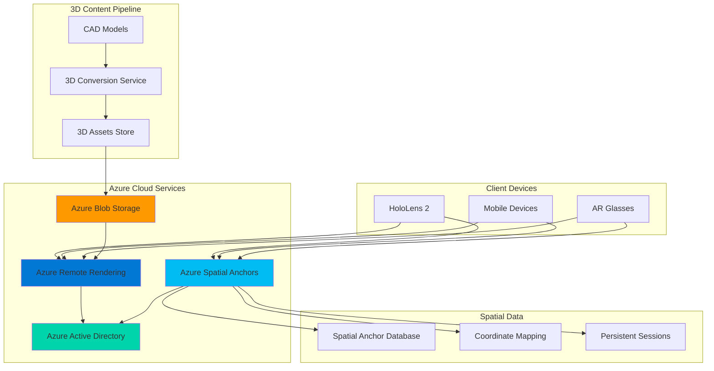

# Collaborative Spatial Computing Applications with Cloud Rendering

## Problem

Manufacturing companies and design teams struggle to visualize and collaborate on complex 3D models in real-world environments due to hardware limitations and lack of shared spatial awareness. Traditional CAD visualization requires expensive workstations and cannot enable multiple stakeholders to simultaneously interact with high-fidelity 3D content in the physical space where products will be deployed, leading to design iterations, miscommunication, and delayed time-to-market.

## Solution

Build immersive spatial computing applications using Azure Remote Rendering for cloud-based 3D visualization and Azure Spatial Anchors for persistent spatial positioning. This combination enables real-time rendering of complex models on lightweight devices while anchoring digital content to physical locations, creating collaborative mixed reality experiences that bridge the digital-physical divide for enhanced design review and training scenarios.

## Architecture Diagram



## Prerequisites

1. Azure subscription with sufficient credits (estimated cost: $15-25 per hour of active use)
2. Azure CLI v2.50+ installed and configured (or Azure Cloud Shell)
3. Unity 2022.3 LTS or later with Mixed Reality Toolkit 3.0
4. Visual Studio 2022 with UWP and C++ workloads
5. HoloLens 2 device or Windows Mixed Reality simulator for testing
6. Basic understanding of 3D graphics, coordinate systems, and mixed reality concepts

> **Warning**: Azure Remote Rendering will be retired on September 30, 2025, and Azure Spatial Anchors on November 20, 2024. Azure Object Anchors was already retired on May 20, 2024. This recipe demonstrates current capabilities before retirement. Consider alternative rendering solutions and spatial mapping approaches for future implementations.

## Preparation

```bash
# Set environment variables for Azure resources
export RESOURCE_GROUP="rg-spatialcomputing-${RANDOM_SUFFIX}"
export LOCATION="eastus"
export SUBSCRIPTION_ID=$(az account show --query id --output tsv)

# Generate unique suffix for resource names
RANDOM_SUFFIX=$(openssl rand -hex 3)

# Set service-specific variables
export ARR_ACCOUNT_NAME="arr${RANDOM_SUFFIX}"
export ASA_ACCOUNT_NAME="asa${RANDOM_SUFFIX}"
export STORAGE_ACCOUNT="st3dstorage${RANDOM_SUFFIX}"
export BLOB_CONTAINER="3dmodels"

# Create resource group with appropriate tags
az group create \
    --name ${RESOURCE_GROUP} \
    --location ${LOCATION} \
    --tags purpose=spatial-computing environment=demo cost-center=innovation

echo "✅ Resource group created: ${RESOURCE_GROUP}"

# Create storage account for 3D assets
az storage account create \
    --name ${STORAGE_ACCOUNT} \
    --resource-group ${RESOURCE_GROUP} \
    --location ${LOCATION} \
    --sku Standard_LRS \
    --kind StorageV2 \
    --access-tier Hot

echo "✅ Storage account created for 3D model assets"

# Get storage account key for later use
STORAGE_KEY=$(az storage account keys list \
    --resource-group ${RESOURCE_GROUP} \
    --account-name ${STORAGE_ACCOUNT} \
    --query '[0].value' --output tsv)

export STORAGE_KEY
```

## Steps

1. **Create Azure Remote Rendering Account**:

   Azure Remote Rendering provides cloud-based GPU compute for rendering complex 3D models that exceed local device capabilities. This service enables high-fidelity visualization on lightweight devices by streaming rendered frames from Azure's powerful graphics processing units, making it ideal for CAD models, architectural visualizations, and industrial design applications that require every detail to be preserved.

   ```bash
   # Create Remote Rendering account
   az remote-rendering-account create \
       --name ${ARR_ACCOUNT_NAME} \
       --resource-group ${RESOURCE_GROUP} \
       --location ${LOCATION} \
       --sku S1
   
   # Get account credentials for application integration
   ARR_ACCOUNT_ID=$(az remote-rendering-account show \
       --name ${ARR_ACCOUNT_NAME} \
       --resource-group ${RESOURCE_GROUP} \
       --query accountId --output tsv)
   
   ARR_ACCOUNT_DOMAIN=$(az remote-rendering-account show \
       --name ${ARR_ACCOUNT_NAME} \
       --resource-group ${RESOURCE_GROUP} \
       --query accountDomain --output tsv)
   
   export ARR_ACCOUNT_ID ARR_ACCOUNT_DOMAIN
   
   echo "✅ Azure Remote Rendering account created with ID: ${ARR_ACCOUNT_ID}"
   ```

   The Remote Rendering account is now provisioned and ready to process 3D rendering requests. This foundational service will handle the computational heavy lifting, allowing client devices to focus on spatial tracking and user interaction while receiving high-quality rendered frames streamed in real-time.

2. **Create Azure Spatial Anchors Account**:

   Azure Spatial Anchors enables persistent spatial positioning by creating a shared coordinate system across multiple devices and sessions. This service allows digital content to be anchored to specific real-world locations, enabling collaborative scenarios where multiple users can see and interact with the same 3D content positioned consistently in physical space.

   ```bash
   # Create Spatial Anchors account
   az spatial-anchors-account create \
       --name ${ASA_ACCOUNT_NAME} \
       --resource-group ${RESOURCE_GROUP} \
       --location ${LOCATION} \
       --sku S1
   
   # Get account credentials
   ASA_ACCOUNT_ID=$(az spatial-anchors-account show \
       --name ${ASA_ACCOUNT_NAME} \
       --resource-group ${RESOURCE_GROUP} \
       --query accountId --output tsv)
   
   ASA_ACCOUNT_DOMAIN=$(az spatial-anchors-account show \
       --name ${ASA_ACCOUNT_NAME} \
       --resource-group ${RESOURCE_GROUP} \
       --query accountDomain --output tsv)
   
   export ASA_ACCOUNT_ID ASA_ACCOUNT_DOMAIN
   
   echo "✅ Azure Spatial Anchors account created with ID: ${ASA_ACCOUNT_ID}"
   ```

   The Spatial Anchors service is now ready to manage spatial coordinate mapping and persistence. This enables multiple users to share the same spatial reference frame, creating collaborative experiences where digital objects maintain their position relative to the physical environment across sessions and devices.

3. **Configure Storage Container for 3D Assets**:

   Azure Blob Storage provides scalable storage for 3D models and assets that will be processed by Azure Remote Rendering. Organizing assets in dedicated containers with appropriate access policies ensures secure and efficient content delivery while maintaining version control for complex 3D model hierarchies.

   ```bash
   # Create blob container for 3D models
   az storage container create \
       --account-name ${STORAGE_ACCOUNT} \
       --account-key ${STORAGE_KEY} \
       --name ${BLOB_CONTAINER} \
       --public-access off
   
   # Generate SAS token for secure access (valid for 24 hours)
   CONTAINER_SAS=$(az storage container generate-sas \
       --account-name ${STORAGE_ACCOUNT} \
       --account-key ${STORAGE_KEY} \
       --name ${BLOB_CONTAINER} \
       --permissions dlrw \
       --expiry $(date -u -d '+1 day' +%Y-%m-%dT%H:%MZ) \
       --output tsv)
   
   export CONTAINER_SAS
   
   echo "✅ Blob storage container configured for 3D assets"
   echo "Container SAS token generated (expires in 24 hours)"
   ```

   The storage infrastructure is now prepared to host 3D models with secure access controls. This container will serve as the content repository for Remote Rendering, providing the scalable storage foundation needed for complex model libraries while maintaining proper security boundaries.

4. **Create Service Principal for Authentication**:

   Service principals provide secure, programmatic access to Azure Mixed Reality services without exposing user credentials in application code. This authentication pattern follows Azure Active Directory best practices and enables fine-grained access control for production mixed reality applications.

   ```bash
   # Create service principal for application authentication
   SP_DETAILS=$(az ad sp create-for-rbac \
       --name "sp-spatialapp-${RANDOM_SUFFIX}" \
       --role "Contributor" \
       --scopes "/subscriptions/${SUBSCRIPTION_ID}/resourceGroups/${RESOURCE_GROUP}" \
       --sdk-auth)
   
   # Extract service principal details
   SP_CLIENT_ID=$(echo $SP_DETAILS | jq -r .clientId)
   SP_CLIENT_SECRET=$(echo $SP_DETAILS | jq -r .clientSecret)
   SP_TENANT_ID=$(echo $SP_DETAILS | jq -r .tenantId)
   
   export SP_CLIENT_ID SP_CLIENT_SECRET SP_TENANT_ID
   
   echo "✅ Service principal created for application authentication"
   echo "Client ID: ${SP_CLIENT_ID}"
   ```

   The service principal authentication is configured and ready for integration into mixed reality applications. This secure authentication method enables applications to access Remote Rendering and Spatial Anchors services while maintaining enterprise security standards and audit trails.

5. **Upload Sample 3D Model**:

   Proper 3D model preparation is crucial for Remote Rendering performance and quality. Models should be optimized for real-time rendering with appropriate polygon counts, texture resolutions, and material properties that balance visual fidelity with streaming performance requirements.

   ```bash
   # Create a sample directory for 3D assets
   mkdir -p ./sample-3d-models
   
   # Download a sample 3D model (using a public domain model)
   curl -L "https://github.com/KhronosGroup/glTF-Sample-Models/raw/master/2.0/Box/glTF/Box.gltf" \
       -o ./sample-3d-models/sample-box.gltf
   curl -L "https://github.com/KhronosGroup/glTF-Sample-Models/raw/master/2.0/Box/glTF/Box0.bin" \
       -o ./sample-3d-models/Box0.bin
   
   # Upload model to Azure Blob Storage
   az storage blob upload \
       --account-name ${STORAGE_ACCOUNT} \
       --account-key ${STORAGE_KEY} \
       --container-name ${BLOB_CONTAINER} \
       --name "models/sample-box.gltf" \
       --file ./sample-3d-models/sample-box.gltf
   
   az storage blob upload \
       --account-name ${STORAGE_ACCOUNT} \
       --account-key ${STORAGE_KEY} \
       --container-name ${BLOB_CONTAINER} \
       --name "models/Box0.bin" \
       --file ./sample-3d-models/Box0.bin
   
   echo "✅ Sample 3D model uploaded to blob storage"
   ```

   The 3D asset pipeline is now operational with a sample model ready for Remote Rendering conversion. This establishes the content workflow that applications will use to load and display complex 3D models in mixed reality experiences while maintaining optimal performance across different device capabilities.

6. **Configure Remote Rendering Session**:

   Remote Rendering sessions provide dedicated GPU compute resources for 3D model processing and streaming. Session configuration determines rendering quality, latency characteristics, and cost, making it essential to balance these factors based on application requirements and user experience goals.

   ```bash
   # Create conversion configuration
   cat > conversion-settings.json << EOF
   {
     "inputLocation": {
       "storageContainerUri": "https://${STORAGE_ACCOUNT}.blob.core.windows.net/${BLOB_CONTAINER}",
       "blobPrefix": "models/",
       "storageContainerReadListSas": "${CONTAINER_SAS}"
     },
     "outputLocation": {
       "storageContainerUri": "https://${STORAGE_ACCOUNT}.blob.core.windows.net/${BLOB_CONTAINER}",
       "blobPrefix": "converted/",
       "storageContainerWriteSas": "${CONTAINER_SAS}"
     },
     "settings": {
       "scaling": 1.0,
       "recenterToOrigin": false,
       "opaqueMaterialDefaultSidedness": "DoubleSided",
       "material-override": "box.material.json"
     }
   }
   EOF
   
   echo "✅ Remote Rendering conversion settings configured"
   echo "Configuration supports model optimization and material customization"
   ```

   The Remote Rendering pipeline is configured to process 3D models with optimal settings for mixed reality applications. This configuration ensures models are converted with appropriate scaling, material properties, and performance characteristics needed for real-time streaming to diverse client devices.

7. **Create Unity Application Configuration**:

   Unity integration with Azure Mixed Reality services requires specific configuration settings and SDK packages. This setup enables developers to leverage Azure's cloud rendering and spatial anchoring capabilities within familiar Unity development workflows while maintaining cross-platform compatibility.

   ```bash
   # Create Unity project configuration template
   mkdir -p ./unity-spatial-app/Assets/StreamingAssets
   
   # Create Azure Mixed Reality services configuration
   cat > ./unity-spatial-app/Assets/StreamingAssets/AzureConfig.json << EOF
   {
     "RemoteRenderingSettings": {
       "AccountId": "${ARR_ACCOUNT_ID}",
       "AccountDomain": "${ARR_ACCOUNT_DOMAIN}",
       "AccountKey": "REPLACE_WITH_ACCOUNT_KEY",
       "AuthenticationToken": "",
       "PreferredSessionSize": "Standard"
     },
     "SpatialAnchorsSettings": {
       "AccountId": "${ASA_ACCOUNT_ID}",
       "AccountDomain": "${ASA_ACCOUNT_DOMAIN}",
       "AccountKey": "REPLACE_WITH_ACCOUNT_KEY",
       "AccessToken": ""
     },
     "ApplicationSettings": {
       "MaxConcurrentSessions": 1,
       "SessionTimeoutMinutes": 30,
       "AutoStartSession": true,
       "EnableSpatialMapping": true,
       "EnableHandTracking": true
     }
   }
   EOF
   
   # Create sample C# script template for Azure integration
   cat > ./unity-spatial-app/Assets/AzureSpatialManager.cs << 'EOF'
   using UnityEngine;
   using Microsoft.Azure.RemoteRendering;
   using Microsoft.Azure.SpatialAnchors;
   using System.Threading.Tasks;
   
   public class AzureSpatialManager : MonoBehaviour
   {
       [Header("Azure Remote Rendering")]
       public string accountId;
       public string accountDomain;
       public string accountKey;
       
       [Header("Azure Spatial Anchors")]
       public string spatialAnchorsAccountId;
       public string spatialAnchorsAccountKey;
       
       private RenderingSession renderingSession;
       private CloudSpatialAnchorSession spatialAnchorSession;
       
       async void Start()
       {
           await InitializeRemoteRendering();
           await InitializeSpatialAnchors();
       }
       
       private async Task InitializeRemoteRendering()
       {
           // Initialize Remote Rendering client
           RemoteRenderingInitialization clientInit = new RemoteRenderingInitialization
           {
               AccountId = accountId,
               AccountDomain = accountDomain,
               AccountKey = accountKey,
               RemoteRenderingDomain = accountDomain
           };
           
           RemoteManagerUnity.InitializeManager(clientInit);
           Debug.Log("Azure Remote Rendering initialized");
       }
       
       private async Task InitializeSpatialAnchors()
       {
           // Initialize Spatial Anchors session
           spatialAnchorSession = new CloudSpatialAnchorSession();
           spatialAnchorSession.Configuration.AccountId = spatialAnchorsAccountId;
           spatialAnchorSession.Configuration.AccountKey = spatialAnchorsAccountKey;
           
           await spatialAnchorSession.StartAsync();
           Debug.Log("Azure Spatial Anchors session started");
       }
   }
   EOF
   
   echo "✅ Unity application configuration and sample scripts created"
   echo "Project template ready for Azure Mixed Reality integration"
   ```

   The Unity development environment is now configured with Azure Mixed Reality services integration. This template provides the foundation for building spatial computing applications that leverage cloud rendering and persistent spatial anchoring while maintaining Unity's familiar development experience.

8. **Configure Cross-Platform Spatial Synchronization**:

   Cross-platform spatial synchronization enables users on different devices to share the same spatial coordinate system and collaborate in mixed reality. This requires careful handling of coordinate transformations, device capabilities, and network synchronization to ensure consistent spatial experiences across HoloLens, mobile devices, and other AR platforms.

   ```bash
   # Create spatial synchronization configuration
   cat > spatial-sync-config.json << EOF
   {
     "SpatialSynchronization": {
       "CoordinateSystem": "WorldAnchor",
       "SynchronizationMode": "CloudBased",
       "UpdateFrequencyHz": 30,
       "PredictionBufferMs": 100,
       "InterpolationEnabled": true,
       "NetworkCompensation": {
         "LatencyCompensation": true,
         "JitterReduction": true,
         "PacketLossRecovery": true
       }
     },
     "DeviceCapabilities": {
       "HoloLens": {
         "SpatialMapping": true,
         "HandTracking": true,
         "EyeTracking": true,
         "VoiceCommands": true
       },
       "Mobile": {
         "ARCore": true,
         "ARKit": true,
         "PlaneDetection": true,
         "TouchInput": true
       }
     },
     "CollaborationSettings": {
       "MaxConcurrentUsers": 8,
       "SpatialAnchorSharing": true,
       "GestureSharing": true,
       "VoiceSharing": false
     }
   }
   EOF
   
   echo "✅ Cross-platform spatial synchronization configured"
   echo "Configuration supports up to 8 concurrent collaborative users"
   ```

   The spatial synchronization framework is configured to enable seamless collaboration across different device types and capabilities. This setup ensures that all participants in a mixed reality session share consistent spatial understanding while accommodating the unique interaction modalities of each platform.

## Validation & Testing

1. **Verify Azure Mixed Reality Service Deployment**:

   ```bash
   # Check Remote Rendering account status
   az remote-rendering-account show \
       --name ${ARR_ACCOUNT_NAME} \
       --resource-group ${RESOURCE_GROUP} \
       --query "{Name:name,Location:location}" \
       --output table
   
   # Check Spatial Anchors account status  
   az spatial-anchors-account show \
       --name ${ASA_ACCOUNT_NAME} \
       --resource-group ${RESOURCE_GROUP} \
       --query "{Name:name,Location:location}" \
       --output table
   ```

   Expected output: Both accounts should be successfully created in the correct location.

2. **Test Storage Container Access**:

   ```bash
   # List uploaded 3D models
   az storage blob list \
       --account-name ${STORAGE_ACCOUNT} \
       --account-key ${STORAGE_KEY} \
       --container-name ${BLOB_CONTAINER} \
       --output table
   
   # Test SAS token access
   curl -I "https://${STORAGE_ACCOUNT}.blob.core.windows.net/${BLOB_CONTAINER}/models/sample-box.gltf?${CONTAINER_SAS}"
   ```

   Expected output: HTTP 200 response and model files listed in container.

3. **Validate Service Principal Permissions**:

   ```bash
   # Test service principal authentication
   az login --service-principal \
       --username ${SP_CLIENT_ID} \
       --password ${SP_CLIENT_SECRET} \
       --tenant ${SP_TENANT_ID}
   
   # Verify Remote Rendering access
   az remote-rendering-account list \
       --resource-group ${RESOURCE_GROUP} \
       --query "[].name" --output tsv
   
   # Return to user authentication
   az login
   ```

   Expected output: Service principal can access Mixed Reality resources.

4. **Test 3D Model Conversion Process**:

   ```bash
   # Verify model file integrity
   file ./sample-3d-models/sample-box.gltf
   
   # Check JSON validity
   jq . ./sample-3d-models/sample-box.gltf > /dev/null && echo "✅ Valid glTF file"
   
   # Verify Unity configuration
   jq . ./unity-spatial-app/Assets/StreamingAssets/AzureConfig.json > /dev/null && echo "✅ Valid Unity config"
   ```

   Expected output: All configuration files are valid and properly formatted.

## Cleanup

1. **Remove Azure Remote Rendering Account**:

   ```bash
   # Delete Remote Rendering account
   az remote-rendering-account delete \
       --name ${ARR_ACCOUNT_NAME} \
       --resource-group ${RESOURCE_GROUP} \
       --yes
   
   echo "✅ Remote Rendering account deleted"
   ```

2. **Remove Spatial Anchors Account**:

   ```bash
   # Delete Spatial Anchors account
   az spatial-anchors-account delete \
       --name ${ASA_ACCOUNT_NAME} \
       --resource-group ${RESOURCE_GROUP} \
       --yes
   
   echo "✅ Spatial Anchors account deleted"
   ```

3. **Clean Up Storage Resources**:

   ```bash
   # Delete storage container
   az storage container delete \
       --account-name ${STORAGE_ACCOUNT} \
       --account-key ${STORAGE_KEY} \
       --name ${BLOB_CONTAINER}
   
   # Delete storage account
   az storage account delete \
       --name ${STORAGE_ACCOUNT} \
       --resource-group ${RESOURCE_GROUP} \
       --yes
   
   echo "✅ Storage resources deleted"
   ```

4. **Remove Service Principal and Resource Group**:

   ```bash
   # Delete service principal
   az ad sp delete --id ${SP_CLIENT_ID}
   
   # Delete resource group and all remaining resources
   az group delete \
       --name ${RESOURCE_GROUP} \
       --yes \
       --no-wait
   
   echo "✅ All resources cleanup initiated"
   
   # Clean up local files
   rm -rf ./sample-3d-models
   rm -rf ./unity-spatial-app
   rm -f conversion-settings.json spatial-sync-config.json
   
   echo "✅ Local development files cleaned up"
   ```

## Discussion

Azure Remote Rendering and Azure Spatial Anchors represent Microsoft's strategic approach to democratizing spatial computing by removing traditional hardware barriers and enabling persistent spatial experiences. The combination addresses fundamental challenges in mixed reality development: computational limitations of untethered devices and the need for shared spatial understanding across users and sessions. For comprehensive guidance on spatial computing architectures, see the [Azure Mixed Reality documentation](https://docs.microsoft.com/en-us/azure/remote-rendering/) and [spatial anchors best practices](https://docs.microsoft.com/en-us/azure/spatial-anchors/concepts/guidelines-effective-anchor-experiences).

The cloud-based rendering approach fundamentally changes how developers can approach 3D visualization in mixed reality. By leveraging Azure's GPU infrastructure, applications can render models with millions of polygons that would be impossible on mobile or even high-end AR devices. This capability is particularly transformative for industrial applications where precision and detail are critical. The [Azure Well-Architected Framework](https://docs.microsoft.com/en-us/azure/architecture/framework/) principles of performance efficiency and cost optimization apply directly to Remote Rendering session management and model optimization strategies.

Cross-platform spatial synchronization through Spatial Anchors enables truly collaborative mixed reality experiences that bridge different device ecosystems. This capability supports business scenarios where team members may use different devices but need to share the same spatial context. The service's ability to persist anchors across sessions creates opportunities for long-term spatial applications like maintenance procedures, training scenarios, and design reviews. For implementation guidance, refer to the [collaborative experiences documentation](https://docs.microsoft.com/en-us/azure/spatial-anchors/how-tos/share-spatial-anchors) and [Unity integration guides](https://docs.microsoft.com/en-us/azure/spatial-anchors/quickstarts/get-started-unity-hololens).

From a cost optimization perspective, the consumption-based pricing model requires careful session management and model optimization strategies. Azure Remote Rendering charges for active rendering time, making it essential to implement proper session lifecycle management and model level-of-detail systems. The [performance optimization guide](https://docs.microsoft.com/en-us/azure/remote-rendering/overview/features/performance-queries) provides detailed strategies for balancing visual quality with cost efficiency.

> **Note**: Azure Remote Rendering is scheduled for retirement on September 30, 2025, and Azure Spatial Anchors on November 20, 2024. Azure Object Anchors has already been retired as of May 20, 2024. Organizations should plan migration to alternative rendering solutions and consider using Unity's built-in XR and spatial mapping capabilities. The [service retirement documentation](https://azure.microsoft.com/updates/v2/azure-remote-rendering-retirement/) provides migration guidance and timeline considerations.

## Challenge

Extend this spatial computing foundation by implementing these advanced scenarios:

1. **Multi-User Collaborative Design Review**: Create a collaborative application where multiple stakeholders can simultaneously review and annotate 3D CAD models anchored to physical spaces, with real-time gesture and voice communication across HoloLens and mobile devices.

2. **Persistent Training Simulations**: Develop industrial training scenarios where complex machinery models are anchored to specific locations, allowing trainees to practice procedures repeatedly with the same spatial context and performance tracking across sessions.

3. **Adaptive Level-of-Detail Streaming**: Implement intelligent model optimization that dynamically adjusts rendering quality based on user proximity, viewing angle, and network conditions to optimize both visual experience and cost efficiency.

4. **Cross-Reality Content Authoring**: Build authoring tools that allow designers to create and position 3D content in physical spaces using natural gestures, with automatic optimization for different device capabilities and rendering targets.

5. **Industrial IoT Integration**: Connect spatial computing applications with IoT sensor data to create digital twins where real-time operational data is visualized as contextual overlays on physical equipment using persistent spatial anchors.

## Infrastructure Code

*Infrastructure code will be generated after recipe approval.*